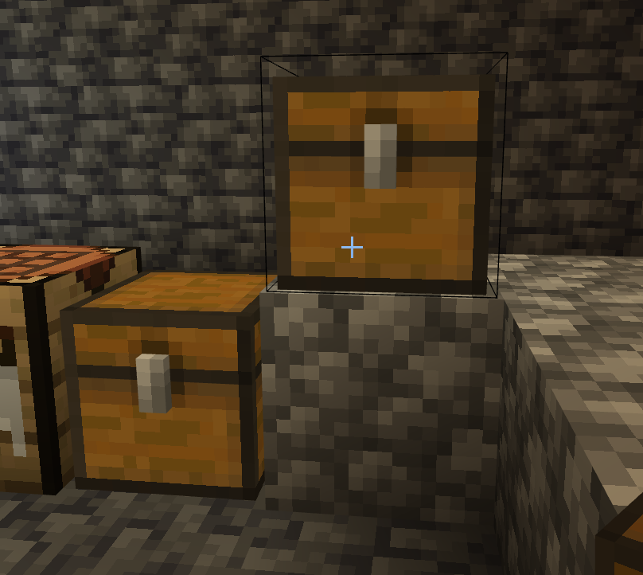
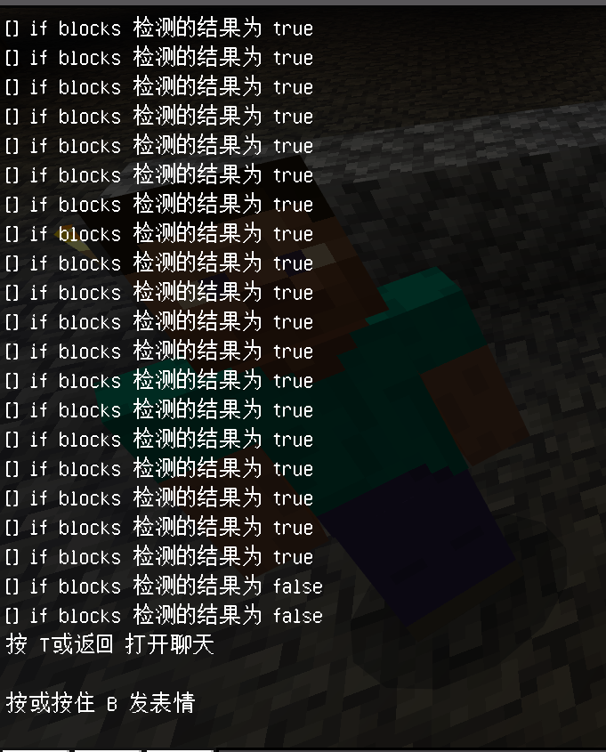
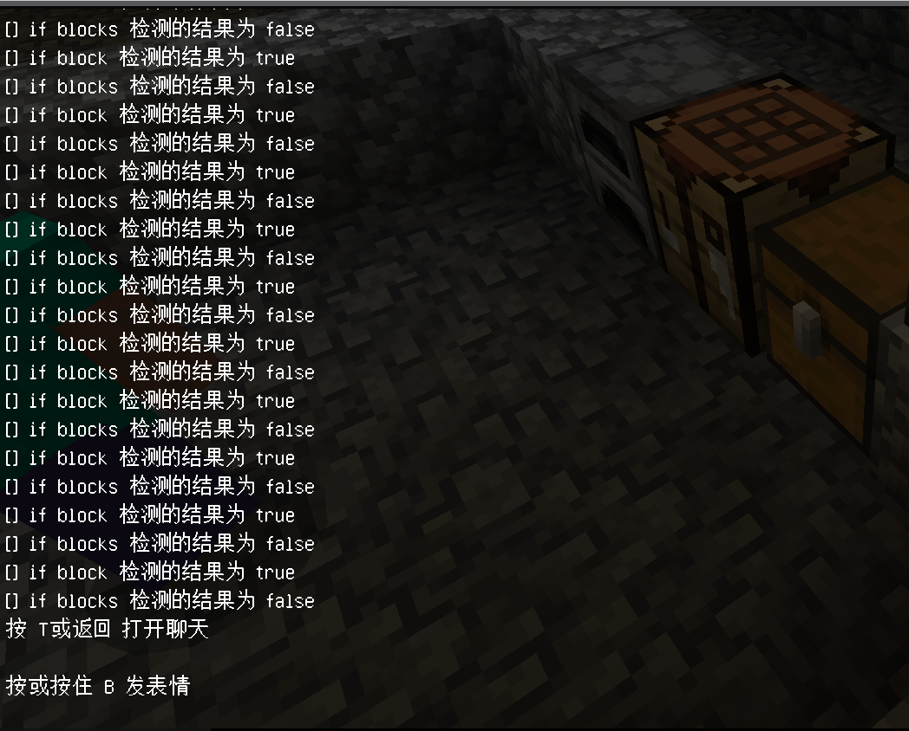
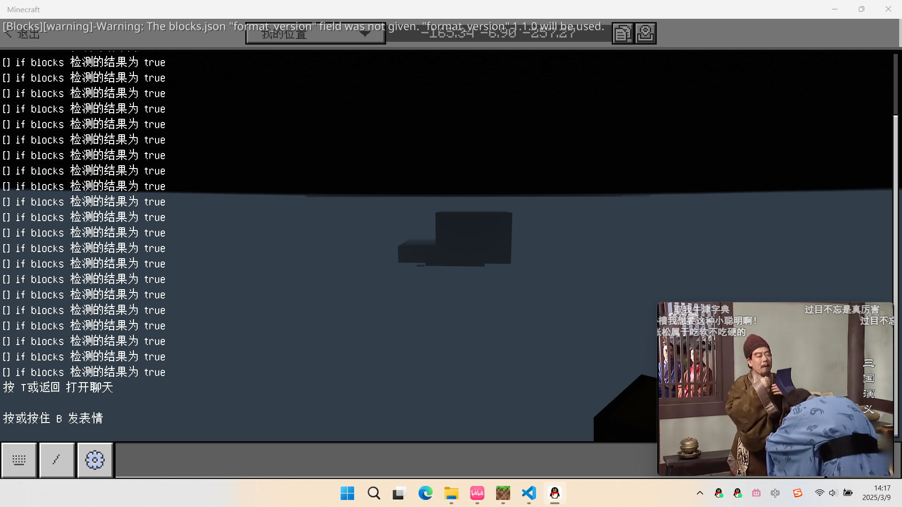
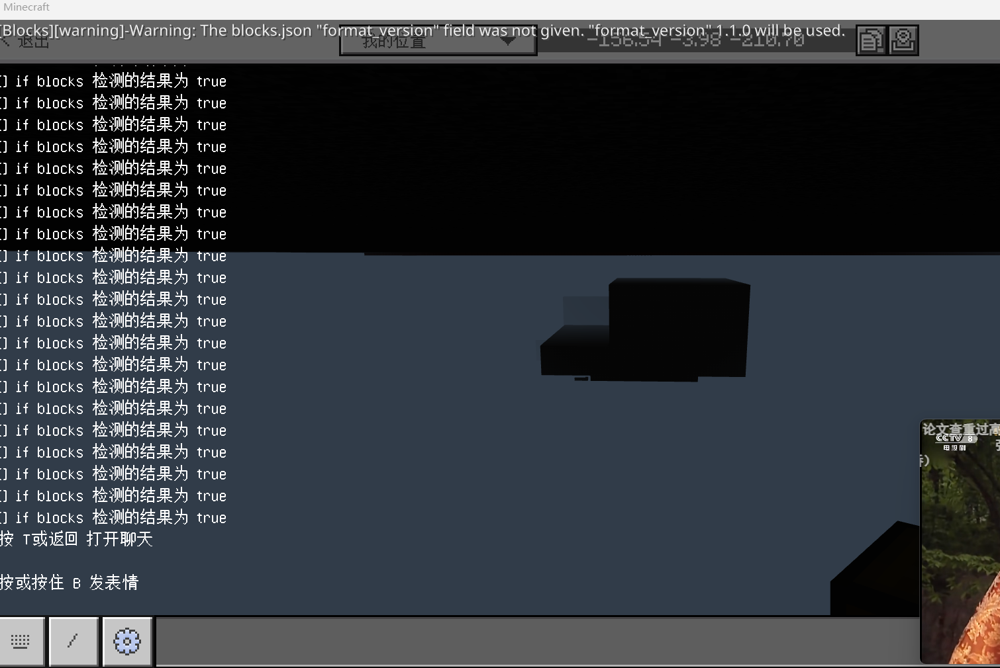

# 关于退出重进时`if block`和`if blocks`的表现研究，以及预加载常加载区域的表现研究

最近巴豆在开发《冒险世界：筑梦》。在我的“怂恿”之下，他选择使用全函数。

不过，在开发到逍遥矿井地牢时，却出现了一些问题。退出重进游戏时，会导致一个小游戏的判定和御风珠的判定直接炸了。这是一个很难处理的问题，所以我和巴豆决定一起研究 bug 的成因，并尝试解决。

## 为什么判定炸了？

巴豆采用的方法，是判断玩家是否拿走了箱子里的物品。源代码如下：

```mcfunction showLineNumbers
#破解谜题
execute if score 3_shaft_2 data matches 0 if blocks -95 -38 128 -95 -34 130 -93 -38 128 all run tellraw @a {"rawtext":[{"text":"§e你破解了谜题，箱子上的障碍清除了！"}]}
execute if score 3_shaft_2 data matches 0 if blocks -95 -38 128 -95 -34 130 -93 -38 128 all run setblock -95 -40 119 air
execute if score 3_shaft_2 data matches 0 if blocks -95 -38 128 -95 -34 130 -93 -38 128 all run scoreboard players set 3_shaft_2 data 1

#拿到御风珠
execute if score 3_shaft_item data matches 0 if blocks -139 -33 111 -139 -33 111 -139 -35 111 all run tellraw @a {"rawtext":[{"text":"§e你拿到了御风珠，向奇怪的方块扔出试试吧！"}]}
execute if score 3_shaft_item data matches 0 if blocks -139 -33 111 -139 -33 111 -139 -35 111 all run scoreboard players set 3_shaft_item data 1 
```

两段代码的核心内容，都是`if blocks ...`检测待检测的箱子和空箱子是否一致，以判断玩家是否拿走了物品。

在正常情况下，这段代码并没有任何问题。但是，如果我们进入逍遥矿井后，退出游戏再重进，就很容易看到手上多了一个物品，在聊天栏也能看得到那句“你拿到了御风珠，向奇怪的方块扔出试试吧！”。看来，这条命令在不该执行的情况下执行了。

我们来看一下这条命令是如何执行的。它只有两个条件：

- `if score 3_shaft_item data matches 0`；
- `if blocks -139 -33 111 -139 -33 111 -139 -35 111 all`

但是，记分板的问题应该是可以立刻排除的。因为退出重进涉及到的最重要的问题就是加载问题，但是记分板一般不太涉及到加载问题；而`if blocks`涉及到方块加载，就很可能涉及到加载问题了。

看来，`if blocks`在加载过程中的检测很可能出现了问题。

## 修复的尝试思路 1 - 使用`if block`

问题找到了，怎么解决呢？巴豆一开始告诉我的方案是，用`if block`检测箱子。


不过我并不明白这么做能否切实地修复这个问题。既然`if blocks`炸了，`if block`就不会吗？


### 对这个解决思路的验证

过了一天后，我决定做一个简易的实验来看看这种修复方法是否有效。我在`main.mcfunction`中（这个函数是始终运行的）写入了下面的命令：

```mcfunction title="实验代码" showLineNumbers
execute unless entity @a if block -165 -59 124 chest run say if block 检测的结果为 true
execute unless entity @a unless block -165 -59 124 chest run say if block 检测的结果为 false
execute unless entity @a if blocks -165 -59 124 -165 -59 124 -166 -58 124 all run say if blocks 检测的结果为 true
execute unless entity @a unless blocks -165-59 124-165 -59 124-166 -58 124 all run say if blocks 检测的结果为 false
```

其中，`unless entity @a`在检测不到玩家时通过，所以就代表了在玩家加载前所执行的命令。而我在(-165,-59,124)和(-166,-58,124)放了一个同向的箱子，其中一个放了物品，另一个则没放：



那么，如果一切正常的话，退出重进后`if block`应该得到`true`，`if blocks`应该得到`false`。但实际情况，却得到这样的结果：



看来，猜的确实不错，`if blocks`在加载过程中的检测确实出现了问题，它先是返回了一堆`true`，然后在玩家加载的“前夕”返回了正确结果`false`。所以，从`if blocks`的返回角度分析，可以猜测这样的加载顺序：

1. `if blocks`开始检测（加载到有箱子，但没有检测里面的内容，所以为`true`）
2. NBT加载（检测到里面的内容不一致，所以为`false`）
3. 玩家加载（后续停止运行）

我接着从`if block`的角度分析，发现它一个`if block`都没有返回。看来，`if block`至少是在玩家加载之后才开始进行检测的。那么这个过程就可以扩展出第 4 步：

1. `if blocks`开始检测（加载到有箱子，但没有检测里面的内容，所以为`true`）
2. NBT加载（检测到里面的内容不一致，所以为`false`）
3. 玩家加载（后续停止运行）
4. `if block`开始检测（因为所有`if block`都没有反馈）。

至少从现阶段来说，巴豆的修复方法是可行的。因为当`if block`开始检测时，这时的`if blocks`已经能够返回一个正确结果。不过，现在看来，其实加一个`if entity @a`也是可行的修复方法。

## 修复的尝试思路 2 - 使用预加载的常加载区域

然而，我给出的修复思路和巴豆不同：添加一个预加载的常加载区域。

既然问题出在加载时判断错误，那么只要让它保持加载不就好了吗？

道理当然是这个道理，但是其实我一开始根本不知道预加载的常加载区域有什么用！

其实我们很早就发现了这个问题，很早就发现了问题根源在于`if blocks`检测错误，并且已经尝试过修复。**当时的修复尝试，是添加常加载区域**。但是，最终却没能成功修复这个问题。所以，我才想试一下如果添加预加载，是否可行。

这是一个在 1.18.30 加入的功能。当时我尝试过这个预加载参数`[preload: Boolean]`，然而根本就没有搞清楚这个东西的作用，今天正是一个好机会。

说白了，我给出解决思路的时候，和巴豆给出他的解决思路的时候，我们两个人都没有任何把握能够保证这个问题能够以此解决。

事后证明：**我们是很幸运的，因为两个办法都是可行的**。

### 对这个解决思路的验证

我们还是使用上面的实验代码，同样地箱子环境，进行退出重进。不过这次，我们为这个常加载区域添加了预加载参数（`preload=true`）。结果和普通的常加载区域完全不同，看来预加载起作用了！



相比于普通的常加载区域，不仅`if block`开始返回数值，`if blocks`也从一开始就能够返回正确的数值。这说明，这些区块早早地就在玩家加载完成之前加载完毕，相比于其他加载区块，这些「预加载的常加载区域」的优先级在加载世界时也是非常高的，以至于连`if block`都能够成功执行。对于预加载情况来说，就是下面的步骤：

1. 区块预先加载
2. `if blocks`已经开始正确检测（加载到有箱子，但没有检测里面的内容，所以为true）；  
  `if block`开始检测（因为所有if block都没有反馈）
3. 玩家加载（后续停止运行）

## 等下！如果没有常加载区域……

这是巴豆问的一个很关键的问题。我在上面跟他分析叭叭了一大堆之后，他就问出了这个问题。这个问题提的非常好，所以我就做了一个这个实验。


移除它的常加载区域后，然后跑到很远很远的地方，并退出重进执行这段实验代码。下图就是实验结果。



~*是的，我当时在看老三国，太好看了，就挂在后台上看（逃*~

和有普通常加载区域的结论不同的是，`if blocks`光返回错误信息了，正事不干。

这引起了我的好奇。既然区域都完全没有加载，`if blocks`是怎么执行的呢？因为如果单独在未加载的区块执行`if blocks`，无论如何都会报错的呀？


这背后定有猫腻！所以我决定：干脆挖掉一个箱子，让一个空气和一个箱子检测。这绝不可能出现 NBT 检测差异的可能性，无论如何都要返回`false`了吧？

**但结果，却让我大吃一惊**。居然还返回`true`？一个箱子和一个空气居然还是检测成功？？？



看来，`if blocks`在这个世界加载完毕之前，**根本就是瞎检测的**！我大吃一惊，这根本就是一个游戏漏洞啊！难怪 Mojang 要加入预加载常加载区域，难道就是为了处理这种问题吗？

## 结论：世界加载顺序的结论推测与问题修复方法

经过上面的分析，我和巴豆得出了世界加载的顺序的结论：

1. 区块预加载，则区块加载完毕：  
  （1）`if block`开始检测：有预加载常加载区域时：检测到有箱子，所以为`true`；  
  （2）`if blocks`开始检测：有预加载常加载区域时：检测到里面的内容不一致，所以为`false`；
2. 如果未开启区块预加载，`if blocks`开始检测（**瞎检测的，无论是什么东西都返回`true`**）
3. 区块开始加载，`if blocks`能够正确检测：  
  （1）有普通常加载区域时：检测到里面的内容不一致，所以为`false`；
  （2）无常加载区域时：无法执行，所以不会返回任何东西。
4. 玩家加载（后续停止运行）
5. 未开启预加载，区块后于玩家加载而加载完毕，`if block`开始检测：  
  （1）有普通常加载区域时：因为玩家加载完毕，所以无法执行；
  （2）无常加载区域时：因为玩家加载完毕，所以无法执行。

也就是说，`if block`和`if blocks`都是需要区块加载完才能执行的，但是`if blocks`自身存在问题，在区块开始加载前会有一小段执行期，乱检测（可能是全检测为空气了）而全部返回`true`。

以及相关问题的修复方法，有以下几种：

1. 额外插入`if entity @a`或`if block ...`，这两种情况返回`true`时，`if blocks`已经能够返回一个正确的结果。  
  虽然后来，巴豆跟我反馈说`if entity @a`似乎并不会奏效，个人猜测或许是没有加常加载区域导致的问题。
2. 添加一个预加载的常加载区域，它可以大幅提高世界加载时该区块加载的优先级，对于这种需要`if blocks`检测的情况很有帮助。这似乎也是更合理的解决方式。
3. 或者，寻求一种方法，干脆避免使用`if blocks`。很明显就是因为这东西有坑

希望这篇文章可以帮助到所有被相关问题困扰的开发者！

import GiscusComponent from "/src/components/GiscusComponent/component.js"

<GiscusComponent/>
