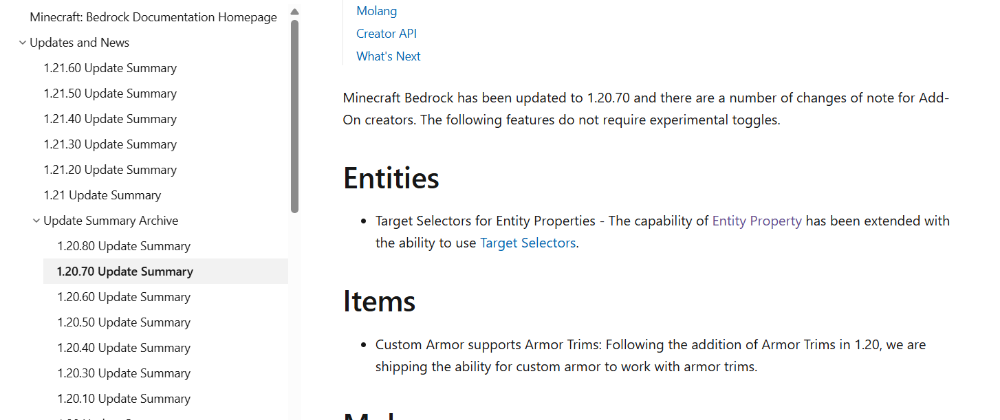

# 初了解实体属性

前几天我非常偶然地了解到了实体属性这个东西。

当时正值深夜时分，我躺在床上，没什么事，偶然间翻开了微软文档的更新内容。网易目前还是 1.20.50，所以我看看这个版本都能用一些什么东西。结果，不知不觉我就翻到其他页面去了。其中，有一篇内容吸引了我的注意：

其实我是知道 1.20.70 加了个`has_property`目标选择器参数这回事的。不过当时，我更多地从命令角度去考虑这个参数，当时下了一个结论：这东西也就行为包用用有用，给原版命令玩家用没啥用。

不过现在当我回过头来再看，点进去看的时候，我很惊讶：

**woc，这不就是`minecraft:variant`、`minecraft:is_sheared`的完美平替吗？？？**

现在就是，你说我干嘛要从租赁服服主的角度去想这东西呢？？

这东西是什么东西呢？准确来说，它算是一个标记实体状态的东西，和方块状态定义那些东西也差不多。但要是谈优势，那可太多了：

- **可以自定义属性名称**。我原先在一些项目中做过类似于“门”的实体。当时我的“解题”思路是这样的：用`is_sheared`去标记门是开是关，这也是当时在某个夏令营中所学习到的方法。但是这个`is_sheared`吧……就很模糊你知道吧，后来的我要怎么知道有它是开还是没它是开呢？对于我这种超级重视易读性，注释比代码多的开发者来说，真的是灾难。
- **有 3 种类型可供选择**。毕竟以前那些标记组件只支持`int`和`bool`，或者说近似地认为它们支持`bool`吧，毕竟不是真的`bool`。但是现在它还支持`enum`，允许枚举值的存在。太好了！
- **最多可以指定 32 种属性**。放在以前，这种标记组件撑死 10 种。
- **切换方便**。以前想更改什么状态，还得先`event`再`component_groups`，但是现在直接一个`event`的`set_property`就解决了。而且：它还支持 Molang！它支持 Molang 啊！！让我想起原先我做过一个类似于电池的实体，要用`variant`记录剩余能量信息。好在“甲方”给的数值范围不太大，1-10，要知道用`variant`就只能穷举，但现在可以用表达式了，太好了！
- **以前能做的它也能做**。比如在资源包可能用`query.variant`去检测，但是现在用`query.property('...')==...`能实现和以前同样的效果。
- **最关键的：网 易 支 持 ！！！**。其实我能猜到为啥：~ojng~ Mojang 可能是为了鼓励开发者使用实体属性，也是为了方便他们自己开发，所以原版蜜蜂就用了大量的实体属性，并且后来的实体也用了大量属性，结果导致网易这方便就算不想做适配也得适配，除非你网易宣布未来永远不更新。~ojng~ Mojang 你干的好啊（无贬义）！

那请问，我还有什么理由拒绝这东西呢？以后再也不会用`variant`、`is_sheared`这些东西了。

那天晚上，我还第一时间跟知名开发者 **@E尘** 聊了聊这回事。我发现他也挺兴奋的。

总之，这次的粗略了解确实是令我收获很多。显而易见的是，下一个作品中，我就要用到这东西了。
