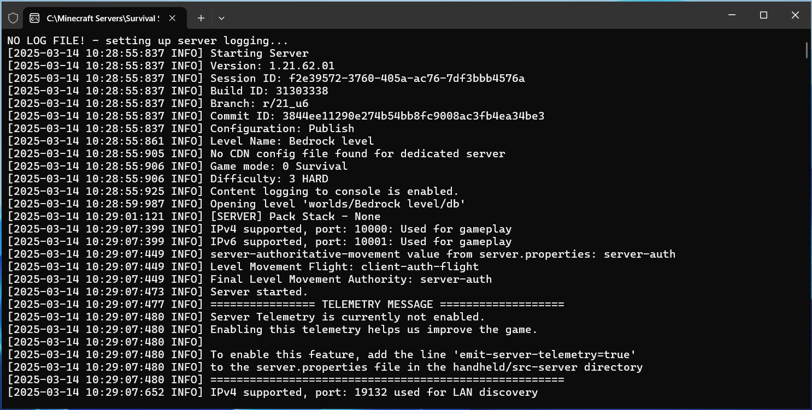
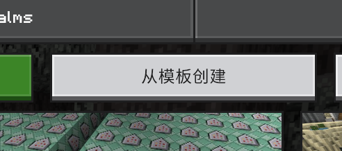
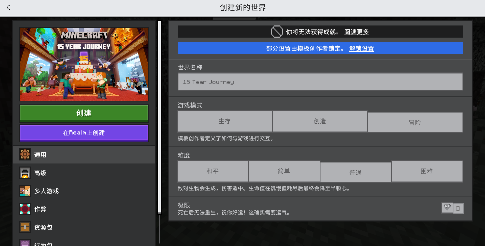
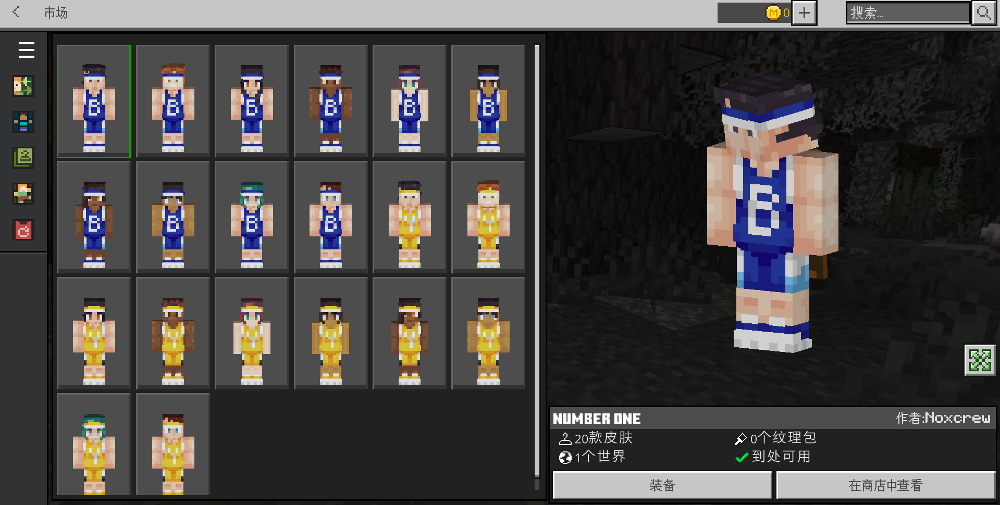

# 1.1 附加包类型简介

我们在概论部分，介绍了附加包的根本性质，也就是基岩版的“模组”。

> 附加包（Add-on）是基岩版加入新内容或修改原有内容的一种手段，受Mojang官方支持。

很多人可能并不知道“受 Mojang 官方支持”这句话的“含金量”。如果你玩过 Java 版，你知道大家想要玩模组的话都必须使用 Forge 或者 Fabric 等模组加载器来加载模组，然而基岩版并不需要额外再安装什么东西，它是官方支持的，你所编写的内容也都会得到后续游戏本体更新的保障，这就使你无须过于担心版本更新等所带来的变化。

在正式讲我们如何写一个“模组”之前，我们需要先清楚，附加包是怎么分类的，这很重要。现在来说，附加包的类型有很多种，但绝大多数都是以下四类：行为包、资源包、世界模板、皮肤包。

但在介绍这些概念之前，因为附加包是从游戏本身的运行原理出发修改游戏，所以我们需要简单了解一下游戏运行的基本原理，也就是服务端和客户端。

---

## 服务端与客户端

羊为什么能剪毛？僵尸为什么会攻击你？为什么草就那么软，黑曜石就那么硬？为什么镐子破坏石头就更快，锹就不行？你很可能从来没有思考过这些问题，认为这些是理所应当的。代码上，当然没有那么多理所应当。**这些底层的逻辑和计算，就是服务端（Server）所负责的事情**。服务端规定了世界中的每个游戏元素的底层逻辑。所有生物的坐标、移动、行为、AI 等；方块的硬度、存储内容等；物品的耐久、名称等；以及你在游玩时进行的各种操作、数值上的底层逻辑，都是服务端的功劳。

如果你是一个服务器的服主，你一定对**基岩版专用服务器（Bedrock Dedicated Server，简称 BDS）** 不陌生。这是 Mojang 官方提供的一个服务器平台。事实上，这个服务器所开启的，就是一个纯粹的 Minecraft 服务端，你看不到任何来自于这个服务器的画面，比如这里的草方块、羊、或者是里面玩家的物品栏的物品，但是它运行着这个服务器的最底层的逻辑，并和远程设备进行着各种交互。

下图是一台运行在 Windows Server 2025 上的 BDS 服务器。

那么，是什么将羊、方块和你的物品栏显示到你面前的呢？**这种画面的渲染、绘制工作，就是客户端（Client）所负责的事情**。比如，服务端告诉客户端，这只羊的种类是`0`，该怎么渲染到玩家的屏幕上，你懂得？客户端表示，我懂我懂，然后将一只白色的羊渲染到你的屏幕上，这样你就看到了这只白色的羊在你面前活蹦乱跳。

当然，服务端和客户端并不是只负责这些事情，但是涉及上面两种情况的时候，确实就是服务端和客户端所对应的工作了。

---

### 来自于服务端和客户端的卡顿现象

很多玩家在玩游戏时，时常会感受到一些卡顿现象。玩家们可能会遇到各种形形色色的卡顿现象，但是很多玩家却对此知之甚少。刚刚我们已经强调了服务端和客户端的概念，如果**代码的运行效率不够高效，在玩家的眼里所导致的，可能就是不够流畅的画面感、操作感，这就是卡顿**。

服务端和客户端的卡顿所导致的后果是不同的。

我们在模块 1：命令部分时曾讲过，Minecraft，或者所有游戏，本质上都是在一个个的代码循环。Minecraft 进行一次这样的循环所需要的时间是 0.05 秒，所以我们才说 1 秒等于 20 游戏刻。我们也可以这样说，在正常情况下，每一秒钟都有 20 游戏刻，我们用**每秒刻数（Tick Per Second，TPS）** 来表示每秒运行了多少次这样的游戏逻辑循环。

然而，在实际情况下，比如加载了一些优化不太好的模组，或者在一台性能不太好的设备上玩 MC，你会发现一种很明显的“延迟感”，挖方块不能立刻掉落、聊天不能立即发送、攻击生物不能立刻响应、从高处摔下来血量延迟降低等，这都是延迟高的表现。也就是说一秒钟很显然地没有执行到 20 次的游戏循环，这种情况可能也就十几次甚至只有几次循环，换言之，**延迟高就意味着 TPS 出现了严重的降低**。我们注意到这些都是底层逻辑上出现的响应延迟，也就是说，**TPS 的降低和服务端的性能低下有着直接的关系**。如果你的资源出现 TPS 的降低，你就要好好检查一下你的资源的性能优化问题了。

玩家的卡顿感还可能出现在另一方面，也就是“画面卡卡的，不流畅”。你可能很久之前就听说过帧率这样的概念，人眼能够将一个高频变化的分立画面自动连接起来，从而得到一个较为流畅的运动画面，或者说动画。每一个分立画面，我们称为一**帧（Frame）**，而每秒有多少个这样的分立画面闪过，就叫做**每秒帧数**，或者**帧率（Frame Per Second，FPS）**。这种不流畅感的起因，就是因为这样的分立画面过少，换言之，**不流畅就意味着 FPS 出现了严重的降低**，注意到画面的渲染都是服务端的工作，所以**FPS 的降低和客户端的性能低下则有着直接的关系**，例如渲染的模型面数过多、动作过于精细、光影特效计算量过大，或者运行游戏的设备本身性能低下，都可能导致帧率的降低。

---

## 行为包

**行为包（Behavior Pack，简称 BP）是一种能够更改世界运行方式的附加包**。显然，**行为包影响服务端**。

在你的世界中，部分方块、物品、实体，以及各种各样的配方、战利品、交易品，都是由这种包来定义你的世界究竟如何运行的。你可以对原版的部分内容做出修改，但更主要的意义在于，你可以新增一些内容进去。

Wiki 中，给出下面的定义：

> 行为包是一种用于改变实体的行为、掉落物、生成规则、物品合成配方与村民交易表等的附加包。行为包不仅可以改变现有内容，还可以创建新的实体、方块及物品。为了实现版本控制，基岩版的部分新内容便是以附加包形式实现的，这些附加包在选项内被统一归类为“原版附加包”而无法移除。强制移除它们会导致游戏出现图形或者崩溃问题。

在本模块，我们会讲到那些只需要行为包就能实现的技术。

---

## 资源包

**资源包（Resource Pack，简称 RP）是一种能够更改游戏界面、世界外观和渲染的附加包**。显然，**资源包影响客户端**。

在你的世界中，实体和方块之所以以如此形状和贴图生成，物品之所以会展示为如此形状，以及翻译、粒子、音效之所以会如此播放和显示，都是因为资源包在起作用。

社区中所说的*材质包*，显然也是资源包的范畴，因此*材质包*属于附加包。但是，必须指出的是，*材质包*的说法是长期以来的错传。它们真正的翻译应当叫做**贴图包**或**纹理包（Texture Pack）**。虽然一般玩家并不会在意这些专有名词的区别，但是作为专业人士，我们必须分清这之间的区别。至于为什么不能称之为*材质*，到了模块 3：附加包进阶，学习了如何自定义一个实体之后，你就会看到这一点。

Wiki 中，给出下面的定义（但并不明晰）：

> 资源包属于附加包的一部分，和行为包并列，同时区分原版资源包与自定义资源包。原版资源包用于为游戏加入新内容而准备。

在本模块，我们亦会讲到那些只需要资源包就能实现的技术。

---

## 世界模板

世界模板（World Template）是一类能够将一个世界通过附加包的形式打包，并在每次新建世界时以该世界作为模板的附加包。简单来说，这种附加包允许你在游戏内就通过这个模板创建一张地图。

你在国际版市场中购买的地图，本质上也都是购买了一个世界模板，并且创建时都是在“从模板创建”中创建的地图。

使用世界模板发布地图有几点好处：

- 版本锁定。虽然附加包是由 Mojang 官方支持的，但是地图内使用的一些特性难免在高版本中无法适应，例如蜘蛛网无法分解为线的特性就可能造成很大的影响。地图模板就可以锁定地图版本，阻止其使用更高版本的特性，以免受到高版本影响。
- 设置锁定。一些玩家可能会在游玩地图时乱调整设置，导致地图运行出错或偏离预期。因此，可以用这个功能锁定设置，阻止玩家乱调预设设置。
  
- 便于在游戏内重新创建地图。如果你的地图不支持重开，但是玩家还想要重玩一遍，使用这个功能可以免除玩家再次导入地图的麻烦。

但是，中国版不支持世界模板。

---

## 皮肤包

皮肤包（Skin Pack）是一类将多个皮肤打包的附加包。在市场中购买的皮肤，也都是以多份皮肤打包为一个皮肤包的形式出售的。

但是，中国版不支持皮肤包。

---

## 常用文档

在附加包领域，我们所常用的文档就**不能再只局限于中文 Minecraft Wiki**。因为 Wiki 并不是专门为了基岩版玩家编写的，更不是专门为了基岩版开发者编写的，但是附加包所涉及的领域非常之广泛，如果 Wiki 详细记载，恐怕 Wiki 的半壁江山都要记载这些细碎的东西。好在，官方为我们提供了文档，社区也有很多文档可以使用。我们现在把这些文档列出来，供你使用。

- **[微软文档](https://learn.microsoft.com/en-us/minecraft/creator)（这是最官方、最权威的文档，出现各种问题应当优先找微软文档）**
  - [创作者常用工具](https://learn.microsoft.com/en-us/minecraft/creator/documents/commonlyusedtools)
- [Bedrock Wiki](https://wiki.bedrock.dev/)
  - [实用链接](https://wiki.bedrock.dev/meta/useful-links.html)  
  - [自带附加包历代文档收录](https://bedrock.dev/)
  - [附加包模板历代收录](https://bedrock.dev/packs)
- [JaylyMC 的 SAPI 文档](https://jaylydev.github.io/scriptapi-docs/)
- [中文 Minecraft Wiki](https://zh.minecraft.wiki/)
- [Minecraft 基岩版开发 Wiki](https://wiki.mcbe-dev.net/)（仍处于开荒状态）
- [MC 开发者文档](https://mc.163.com/mcstudio/mc-dev/)（多数仅网易可用）
- 我的世界开发指南（多数仅网易可用）
  - [电脑版](https://mc.163.com/dev/guide.html)
  - [手机版](https://mc.163.com/m/dev/guide.html)
- [Minecraft 基岩版开发文档](https://www.mcbe-dev.net/addons/)（理解难度高，仅作上述文档的补充）

此外，还有很多常用工具可供我们使用，这些就等到我们讲到具体内容的时候再细说。

---

## 总结

- 附加包（Add-ons）是一种受到官方支持的包，主要分为 4 类：行为包、资源包、世界模板、皮肤包。
- 几乎所有的游戏都有服务端（Server）和客户端（Client）。
  - 在 Minecraft，服务端负责底层的逻辑和计算。
  - 在 Minecraft，客户端负责画面的渲染和绘制。
  - 服务端的卡顿，会造成 TPS 的降低，也就是“高延迟”。
  - 客户端的卡顿，会造成 FPS 的降低，也就是“不流畅”。
- 行为包（Behavior Pack，BP）是一种能够更改世界运行方式的附加包，行为包影响服务端，它定义部分方块、物品、实体，以及各种各样的配方、战利品、交易品的运行方式。
- 资源包（Resource Pack，RP）是一种能够更改游戏界面、世界外观和渲染的附加包。资源包影响客户端，它决定方块、物品、实体如何显示、以及粒子、音效、翻译、界面等如何出现在你的屏幕上。
- 世界模板（World Template）允许你在游戏内基于它创建一张地图。它有版本锁定、设置锁定、便于在游戏内重新创建地图等优点，但是中国版并不支持。
- 皮肤包（Skin Pack）是一类将多个皮肤打包的附加包。但是中国版并不支持。
- 在附加包领域，我们已不再能仅局限于中文 Minecraft Wiki，诸如微软文档、Bedrock Wiki 等文档才是我们编写附加包时应参考的主要文档。
