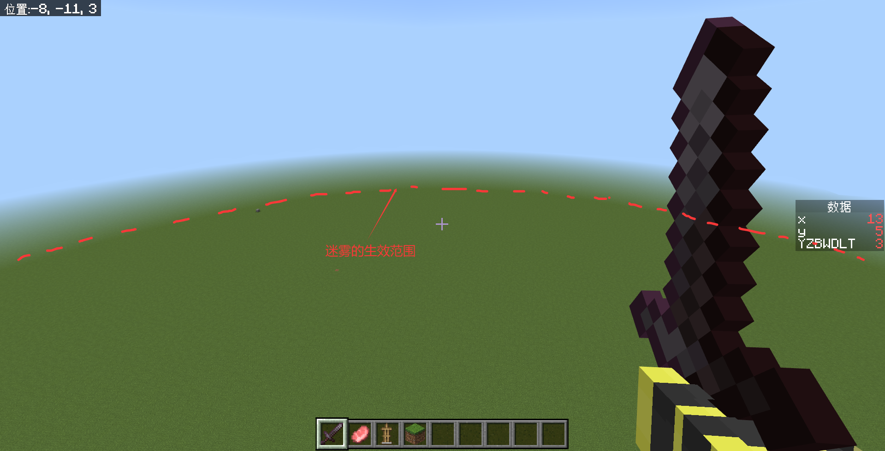
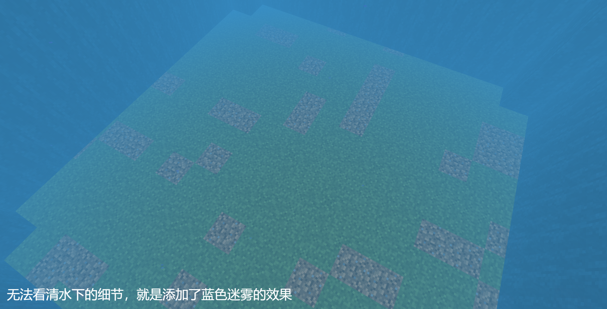
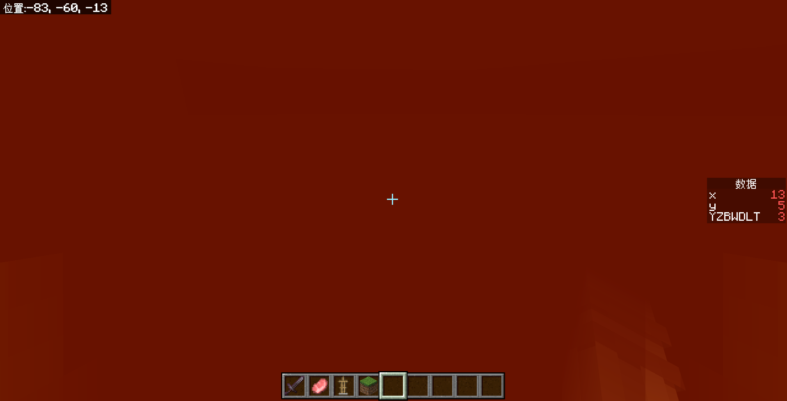
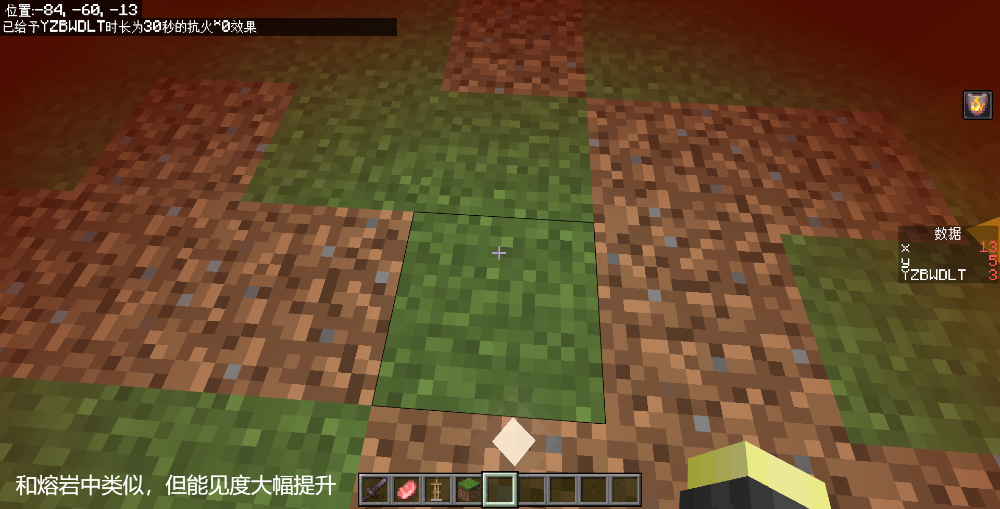
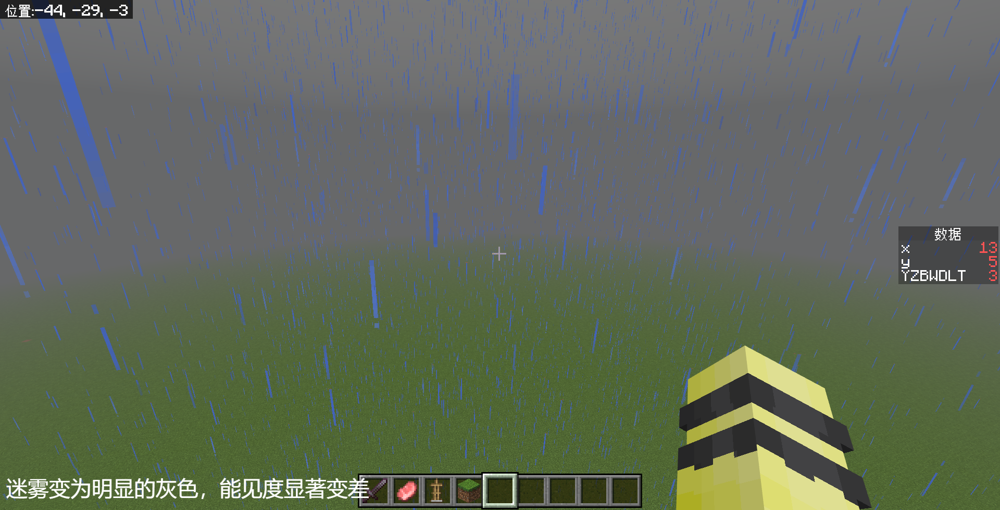

# 3.6 迷雾

基岩版迷雾的运行机制是，在特定的生物群系下，采用不同类型的迷雾，这些迷雾通常称作**迷雾设定（Fog Settings）**。每种生物群系对应的迷雾设定都可以设定下列六种基本类型中的一种或几种：

- `air`（空气中）
  
- `water`（水中）
  
- `lava`（熔岩中）
  
- `lava_resistance`（有抗火时在熔岩中）
  
- `weather`（雨中）
  
- `powder_snow`（细雪中）。
  

每种迷雾都拥有**颜色（Color）**、迷雾起始距离（For Start Distance）和迷雾可见距离（Fog End Distance）。
