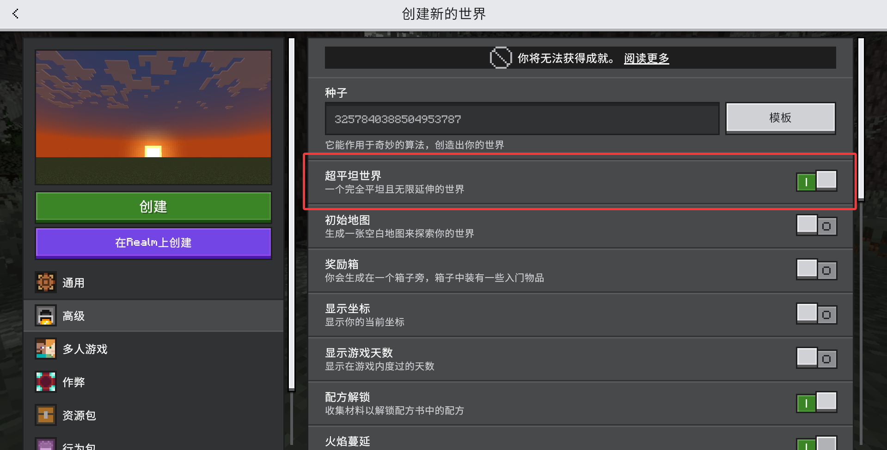
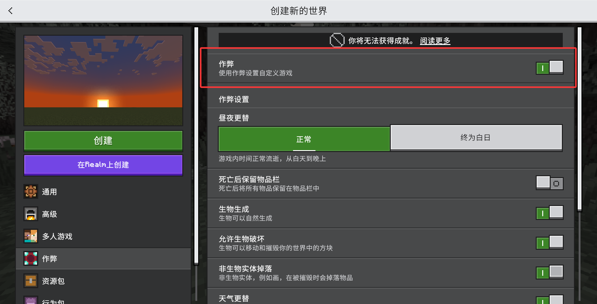
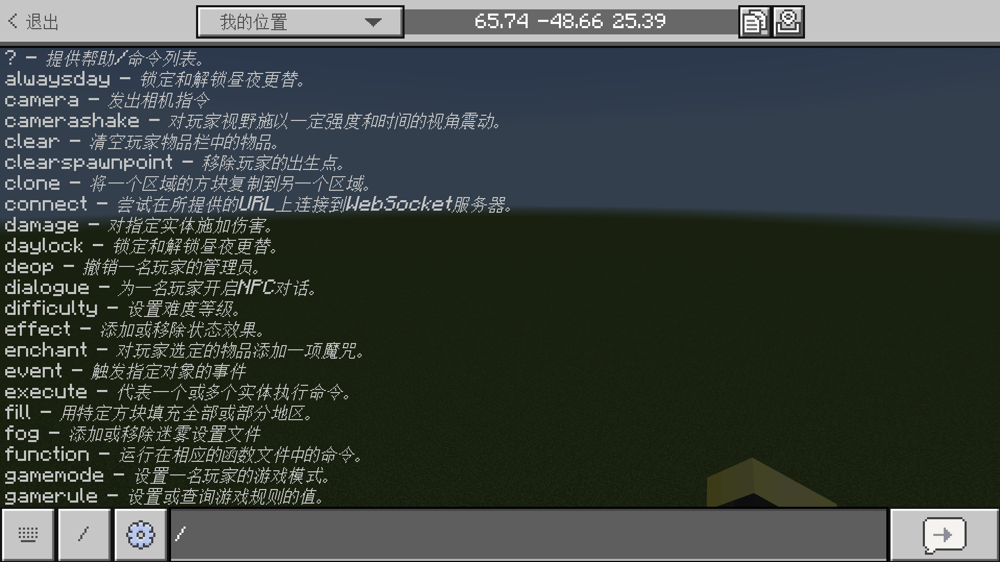
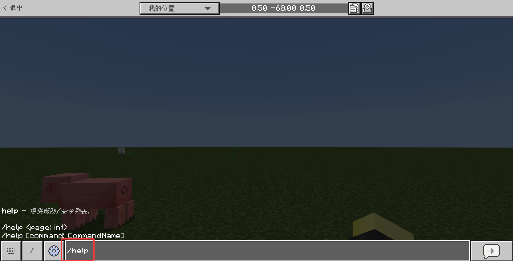
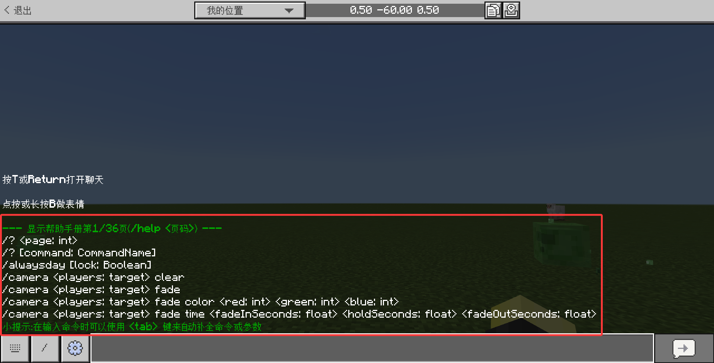
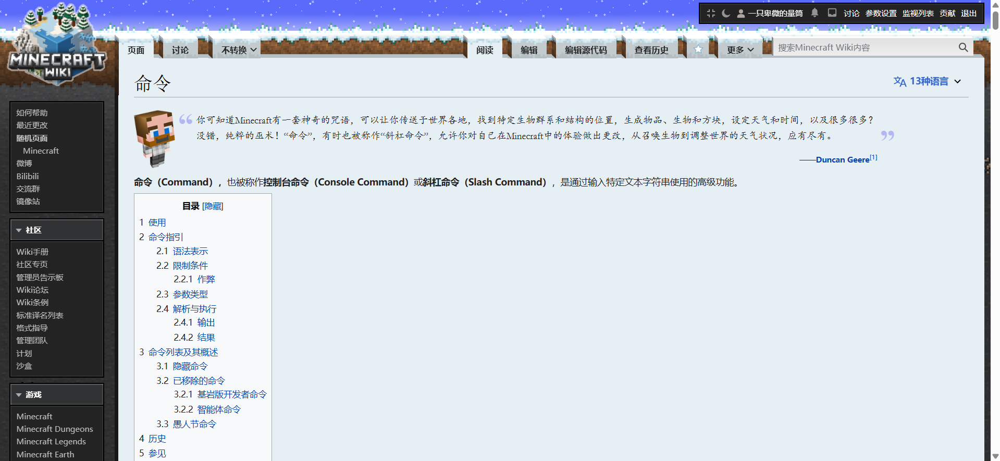

# 1.1 命令

在概论中，我们已经知道**命令是游戏中所内置的一种高级功能**。本章我们就要了解一些有关于命令的基础概念。这里的概念会比较枯燥，但了解这些是必须的，只要你跟着下面的步骤走，你就可以大体上理解这些基本概念了！

---

## 前置工作：创建一个新的测试世界

在了解基础概念之前，请先进入你的 Minecraft 基岩版，因为**开发过程是非常依赖于你的实践过程的**，换言之，**要多跟着做**。创建一个如下的世界：

- 创造模式，否则你要用生存模式开发一个资源吗？


- 超平坦世界，这有助于你进行调试；



- **开启作弊，请注意，使用命令必须开启作弊**。不要认为作弊是什么坏事，Minecraft 的作弊仅仅意味着你不能玩纯原版生存，不能获取成就，仅此而已。这也是我们让你开一张新地图测试的理由，请不要在你重要的生存存档开启作弊！



---

## 命令的使用方法

要使用一条命令，有很多方法。不过，我们在这里只介绍最基础的用法。

:::tip[实验 1.1-1]

请打开聊天栏，然后输入一个斜杠`/`，你将看到下图所示的界面：



:::

是的，这些就是命令。输入一个斜杠`/`就开始了命令的联想输入，提示你可以使用这些命令。命令一般来说都需要以一个斜杠开头，因此命令又称为**斜杠命令（Slash Command）**。

:::tip[实验 1.1-2]

执行命令`/help`。请注意，我们现在说**执行命令**的过程，就是**在聊天栏输入这条命令并发送**的过程。



:::

当你执行这条命令后，游戏会返回给你几条命令的语法。恭喜你！这就是你执行的第一条命令！



**注**：如果你是 Windows，你可以按键盘上的`↑`或`↓`键来查看过往输入过的文本或命令。在手机上，部分输入法也可以做到这一点。

---

## 学习命令常用的文档

学习命令需要经常查看官方或社区所给出的文档。在命令方面，常用的文档主要有两个：

1. `/help`：对，这事实上就是个游戏内内置的文档。这条命令包含了所有命令的用法，如果在不方便访问其他网站的情况下，或者只是想单纯看看命令参数顺序的情况下，`/help`是非常有用的。
2. [命令 - 中文 Minecraft Wiki](https://zh.minecraft.wiki/w/命令)：这是 Wiki 记载命令的地方，内容非常详细。**本模块主要参考这篇 Wiki 文章及其链接的子文章**。如果你有任何需求，请在这里参考一些命令的基本用法。



建议你可以通过这两个途径或者更多的其他途径来自学命令。事实上**自学是很重要的**，只是看本模块所讲述的内容或者其他人的视频等，难免会遗漏一些细节问题，我们也不打算在这篇文章里面写下这几十条命令的细节，毕竟 Wiki 上都有了，我们要做的就只是帮你入门，帮你了解命令都能做到什么。

---

## 命令参数与类型

现在问题来了，`/help`是返回了很多信息，可是我们看不懂啊？别急，我们这就来学习如何看懂这些命令！

我们还是来看执行`/help`返回的文本：

```text title="使用/help后所返回的文本" showLineNumbers
--- 显示帮助手册第1/36页（/help <页码>） ---
/? <page: int>
/? [command: CommandName]
/alwaysday [lock: Boolean]
/camera <players: target> clear
/camera <players: target> fade
/camera <players: target> fade color <red: int> <green: int> <blue: int>
/camera <players: target> fade time <fadeInSeconds: float> <holdSeconds: float> <fadeOutSeconds: float>
小提示：在输入命令时可以使用<Tab>键来自动补全命令或参数
```

首先我们可以看到，这些命令都是由多个以**空格**（Space）隔开的片段组成的。

最左边的`/?`、`/alwaysday`、`/camera`就是**命令**（Command）本体，它们决定了这条命令将会大体上执行什么样的功能。例如，`/?`和`/help`一样，也会显示帮助页面；而`/camera`则会控制你的摄像头（也就是视角）。目前来说，**Minecraft 基岩版一共有数十种不同的命令**。如果你觉得眼花缭乱，不要担心，这是我们后面要解决的问题！

后面那些`<page: int>`、`[command: CommandName]`等就叫做命令的**参数**（Parameter），它决定命令执行的具体细节。

例如，`/alwaysday`命令是用于锁定和解锁昼夜更替的，如果指定了参数`[lock: Boolean]`的值为`true`，那么世界就将锁定为终为白日；如果指定为`false`，就将启用时间流动。可见，**设定命令参数会影响命令的具体执行效果**。

如果你是电脑玩家，你可以使用`Tab`来在游戏中尝试自动补全参数，是很方便的。

### 参数的种类：必选参数与可选参数

我们注意到，上面`/help`所返回的内容中，有各种不同类型的参数。这里我们来为它分个类，你可以看到在这些命令的使用方法中有下面几类参数。

- `<名称: 类型>`：这叫做**必选参数**，这些参数都使用**尖括号**`<>`来包裹。代表**这个参数必须存在才能正常运行**。例如：`<page: int>`、`<players: target>`。
- `[名称: 类型]`：这叫做**可选参数**，这些参数都使用**方括号**`[]`来包裹。代表**这个参数即便不填写也能正常运行**。例如：`[lock: Boolean]`。
- `名称`：这是按**原样填写**的参数，也是**必须存在的参数**。例如：`fade`、`color`。
- `名称 | 名称`：可以填写所给定的若干个参数的其中一个。例如：`/loot`命令中的`[<tool>|mainhand|offhand: string]`。

### 参数的名称：参数最简单的描述

那么`名称: 类型`代表什么呢？我们从上面的`/camera`命令的一个语法来入手说明：

```text
/camera <players: target> fade time <fadeInSeconds: float> <holdSeconds: float> <fadeOutSeconds: float>
```

我们现在关注它的`名称`。它的四个必选参数的含义分别是`players`→`玩家`、`fadeInSeconds`→`淡入秒数`、`holdSeconds`→`维持秒数`、`fadeOutSeconds`→`淡出秒数`，如果我们不关注它的类型，上面的命令可以写为

```text
/camera <玩家> fade time <淡入秒数> <维持秒数> <淡出秒数>
```

它的含义其实是：对`<玩家>`施加一个淡入、维持、淡出秒数时长分别为`<淡入秒数>`、`<维持秒数>`、`<淡出秒数>`的黑屏相机。

换句话说，**`名称`主要提示你，这个参数是做什么用的，它是给这个参数最简单的一个描述。**

### 参数的类型：这个参数可以填些什么？

**`类型`主要提示你，你可以输入些什么东西**。我们下面也说填写参数为**传入参数**，或者**传参**。命令参数不是乱填的，传入 Minecraft 不认识的参数就会导致报错。下表是常见的几种`类型`。当然，如果你现在看不懂，不要紧，我们后面会对这里的类型做一些详细的说明。

| `类型` | `类型`的中文翻译 | 意义 |
| --- | --- | --- |
| `int` | `整数` | 该参数可以传入数学意义上的整数。例：`1`、`0`、`-5`。 |
| `float` | `浮点数` | 该参数可以传入数学意义上的整数或小数。例：`1.0`、`-5.5`。 |
| `Boolean` | `布尔值` | 该参数可以传入`true`（真）或`false`（假）。 |
| `string` | `字符串` | 该参数可以传入由英文双（单）引号包裹的任意文本。例：`"awa"`、`"这是一个字符串"`。特殊地，如果字符串内没有空格、斜杠等可能产生歧义的内容，引号可以省略。 |
| `x y z` | `坐标` | 该参数可以传入一个坐标。例：`15 74 32`。 |
| `Block` | `方块` | 该参数可以传入一个允许的方块 ID。例：`grass_block`。 |
| `EntityType` | `实体` | 该参数可以传入一个允许的实体 ID。例：`zombie_pigman`。 |
| `Item` | `物品` | 该参数可以传入一个允许的物品 ID。例：`stick`。 |
| `target` | `目标` | 该参数可以传入一个代表玩家、实体的目标选择器参数，或者直接传入玩家名。例：`YZBWDLT`、`@e[type=zombie]`。 |

---

## 总结与练习

在本节，我们主要介绍了下面的内容：

- 要使用命令，必须开启作弊。
- 命令一般都是以斜杠打头的。
- 在聊天栏里，输入一条命令并发送出去，就是执行这条命令。
- 在后续的命令学习中，我们要经常运用`help`或查询 Minecraft Wiki 来了解一条命令的具体用法。查询文档是非常重要的技能！
- 绝大多数情况下，一条命令由它的主体和后面的参数组成，并由空格分隔。由尖括号`<>`所包裹的参数叫做必选参数，由方括号`[]`所包裹的参数叫做可选参数，而未被包裹的参数则按照原来的字面量进行填写，也是必选参数的一种。
- 对于参数`<名称: 类型>`或`[名称: 类型]`，`名称`表示这个参数最基本的描述，而`类型`则限制了这个参数可以填写的值。

:::info[练习 1.1]

1. 已知`/help`命令的其中一条语法为`/help <页码：int>`，请在游戏内写一条命令查看第 17 页的帮助页面。
2. `/help`命令的另一条语法为`/help [命令条目：CommandName]`。请查询`/difficulty`的用法，并根据其给出的用法尝试自学该命令。

:::
