# 1.2 坐标

从本节开始，我们就要开始接触最常见的参数类型和最简单的命令了。我们将会从需求开始引入概念，然后回归到实践上。**当然，需要再次强调：请务必重视实践这个过程！**

本节我们要提到坐标这个概念。什么是坐标？**坐标**这个概念源自于数学的数轴、坐标系的概念，它**反映一个物体所处的位置该如何表述**。在命令中，我们经常需要获取某个位置上是否有玩家、有方块等等，因此引入坐标的概念是必要的。

如果你从来没有学过坐标这个概念，你可以看看下面的扩展内容，了解一些必要的数学知识。

<details>

<summary>扩展：什么是坐标？（数学知识警告！）</summary>

如果你不了解什么是坐标，那么我们现在简单引入一点数学的基础概念。

现在你可以想象一根绳，随便掐住一个点，如何描述你掐住的这个点的位置信息呢？你可以说，你掐住的这个点距离这根绳左端的长度是 x。你会发现，这个 x 唯一地确定了这个点，不再有任何其他的点与左端的距离也是 x，也就是说你只使用了一个参量 x 就描述了它的位置信息。

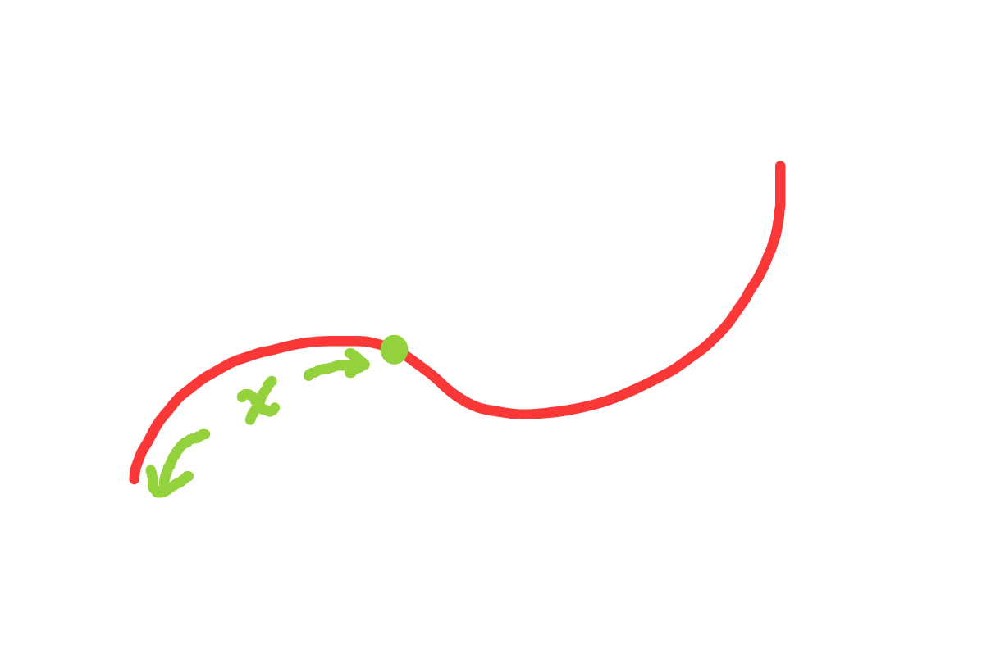

现在我们把这根绳扩展到一张纸，随便选一个点，如何描述它的位置信息？你可能会想到，像上面一样找到一个角落，并描述这个点到它的距离 x。但这样并不能准确描述它的位置信息，因为还有其它与这个角落距离相同的点存在，而且是无数个，如果将这些点连起来，将组成一个圆弧。我们这时候不妨假设这个点与这张纸的左侧和上侧的距离分别为 x 和 y，那么当这两个参量都确定的时候，你会发现只有唯一的一个点被确定。

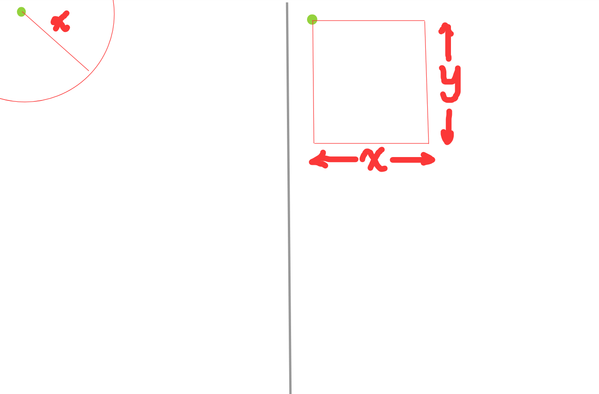

同样地，我们扩展到一个房间里面，假设这个房间里面有一只飞虫，如何确定它的位置？也许聪明的你已经想到：假设这只飞虫与这个房间的左侧、下侧、底侧的距离分别为 x，y，z，这三个值才能够唯一地确定一个位置。

上述三种情况中，绳子称为**一维**的。拉直这根绳，我们可以选取一个**参考点**，也就是上文所说的「这根绳左端」，我们将之称为**原点**，并根据原点规定一个**方向**，我们一般选取向右为正方向，向左为负方向。事实上，这基本就是**数轴**的概念。数轴是一维且无限长的，你可以用一个唯一的 x 确定一个点所在的位置。

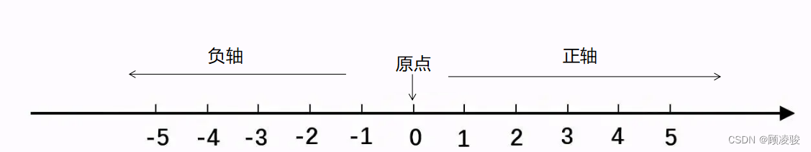

而纸是二维的。如果我们取一个垂直于数轴 x 的数轴 y，并让这两个数轴相交于各自的原点，数轴 x 的正方向为右，数轴 y 的正方向为上，那么这时候，则构建了一个无穷大的平面，这是**二维**的**平面直角坐标系**。这时候，你想确定这个平面上一个点的位置，就要通过 x 和 y 来标记。

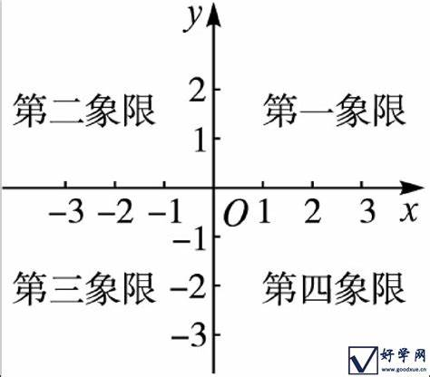

在平面直角坐标系的基础上，添加一个向上为正方向的数轴 z，这时候就出现了一个无穷大的空间，这叫做**三维**的**空间直角坐标系**。如果你要确定一个三维的物体的位置，你就需要 x，y，z 三个变量。特殊地，我们称如上构造的空间直角坐标系叫做**右手坐标系**。伸出你右手的拇指、食指和中指，中指向上，拇指指向你自己，而食指指向右边，那么这时候，如果这三个手指两两垂直，拇指的方向就是 x 轴正方向，食指的方向就是 y 轴正方向，而中指的方向就是 z 轴正方向。

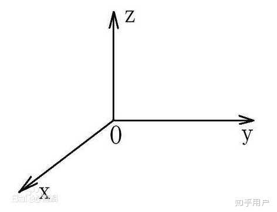

之所以要说到右手系的问题，是因为 Minecraft **不满足右手系的规则**。详情可见下文。总之，你已经了解了为什么我们用 3 组数字代表你所在的位置的含义——因为 Minecraft 是一款三维游戏，要描述你在这个空间中的位置，必须使用三组数字。

**坐标的表示方法是( x, y, z )，用圆括号写入x、y、z的值，中间用逗号分隔。**

</details>

---

## 坐标的基本概念

在前文我们说，坐标反映一个物体的位置信息。如何获取我们在这个世界的位置呢？

现在，你可以进入你的世界设置，并开启**坐标显示**。

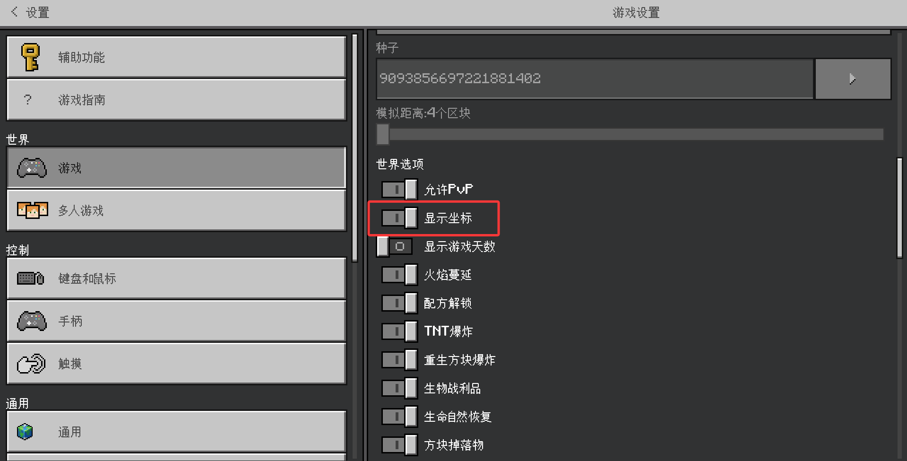

回到游戏，你会看到左上角多出来了一个`位置：xx xx xx`。这就是你所处的**坐标**。注意，打开坐标显示后，这个坐标表示的是你的**脚部的位置**信息。

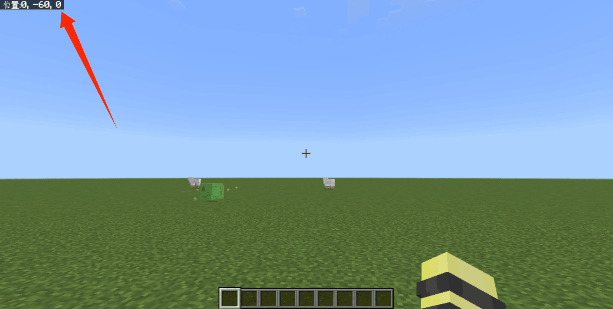

Minecraft 的坐标以东为 x 轴正方向，以南为 z 轴正方向，而**向上则为 y 轴正方向**。请务必注意这一点，尤其是在数学上我们一般将竖轴设为 z 轴而非 y 轴。

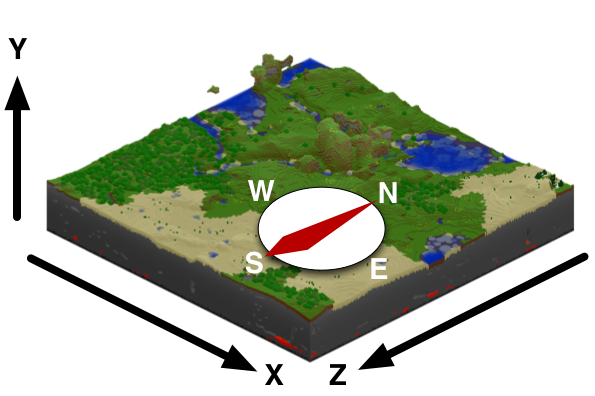

注：图片来源于中文 Minecraft Wiki。

为了方便地获取你的坐标或你所面向的方块的坐标，你可以打开“设置 - 创作者 - 启用复制坐标 UI”，然后在聊天栏界面快速复制粘贴你的坐标或者你所面向的方块的坐标。如果你使用 Windows，你还可以通过 “Ctrl+Alt+X” 快捷键来快速获取你所面向的方块坐标，通过 “Ctrl+Alt+C” 快捷键快速获取你的坐标。

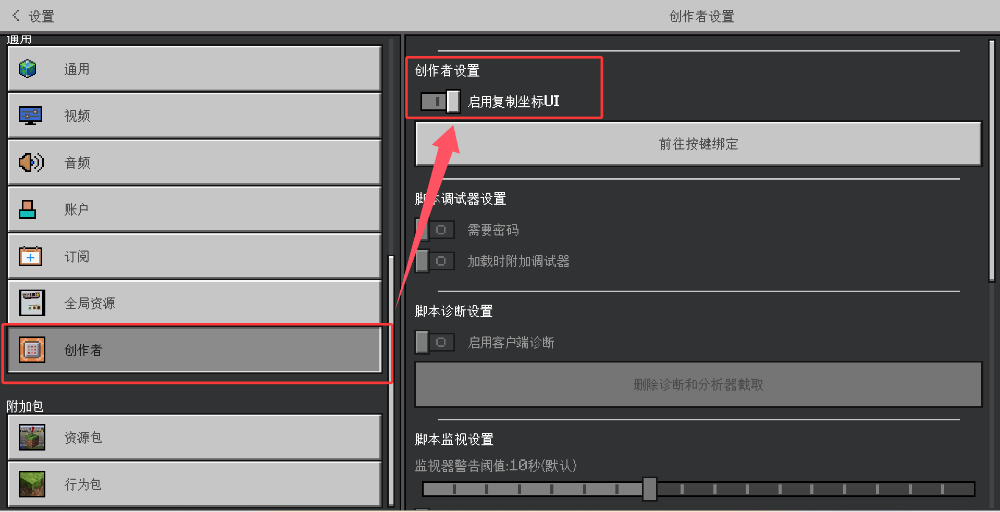

---

## 绝对坐标 `/tp`

由三个**确定的数字组成的坐标**，称为**绝对坐标（Absolute World Coordinates）**。在前文中，你所获取的你所处的坐标就是一个绝对坐标。

如果命令的参数要求填写为`x y z`类型，则可以填写为三个确定的数字组成的坐标。接下来，我们以`/tp`为例，介绍一下如何应对此类命令参数。`/tp`命令是一条可以传送玩家到特定位置的命令，其中的一条语法为

```text
/tp <位置：x y z>
```

即将执行者传送到`<位置>`的坐标上。我们看到，这条命令的`<位置>`参数的类型，正是`x y z`，因此，你可以填入一个绝对坐标进去。

:::tip[实验 1.2-1]

在创造模式下飞起来，然后执行`/tp 50 -58 50`。执行此命令后，观察你的位置变化。

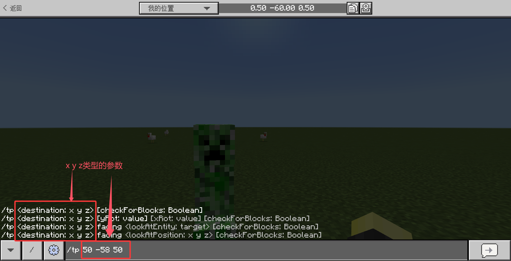

:::

做完上述实验后可以看到，你会被直接传送到这个位置上。

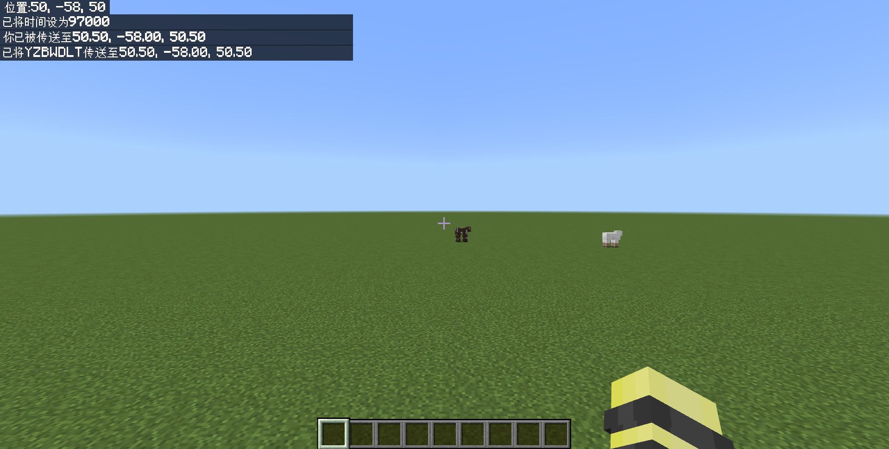

---

## 相对坐标

很多情况下，你可能只是希望玩家往特定方向走特定距离，比如往东走 5 格，也就是绝对坐标的`x`值 +5 。但是这样传送每次都需要计算一下，加 5 格还好说，但如果是加 12345 格这种不好算的数，或者长时间循环加 5 格的话，总不能每次都手动运算然后输入值吧？这下怎么办？

:::tip[实验 1.2-2]

在创造模式下飞起来，执行`/tp ~5~~`。你可以多次执行这条命令。

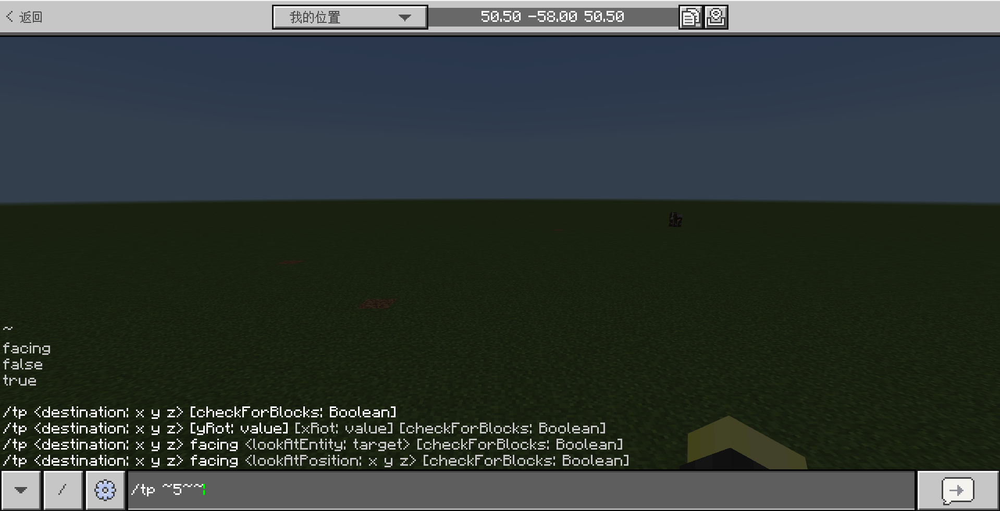

:::

做完上述实验后，你将被传送到你原来位置的东边 5 格上。这种用波浪线和一个数字来表示相对位置的坐标叫做**相对坐标（Relative World Coordinates）**。如果命令的参数要求填写为`x y z`类型，相对坐标也是允许的。

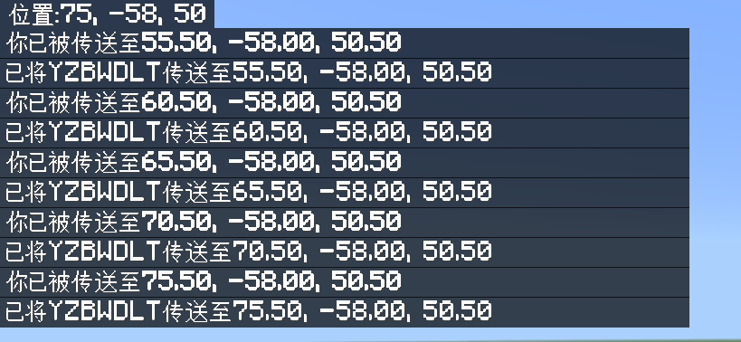

### 相对坐标的表示方法

相对坐标的表示方法为`~(+x) ~(+y) ~(+z)`，代表相对于你原来位置的多少格之外的距离。`(+x)`、`(+y)`、`(+z)`如果为`0`则可以忽略，如果为正数则`+`可以忽略。特殊地，在基岩版，相对坐标之间的空格也可以忽略。例如：

- `/tp ~5~~`，它等价于`/tp ~+5 ~ ~`；
- `/tp ~~~`，它等价于`/tp ~ ~ ~`；
- `/tp ~3~4~-5`，它等价于`/tp ~+3 ~+4 ~-5`。

### 相对坐标与绝对坐标的混用

相对坐标可以和绝对坐标混用。例如`/tp 5 ~5 5`则是将你传送到(5, (你当前的y坐标)+5, 5)。

:::tip[实验 1.2-3]

如何把你立刻传送上天？你可以执行`/tp ~ 256 ~`。注意这次三个坐标之间必须要有空格！

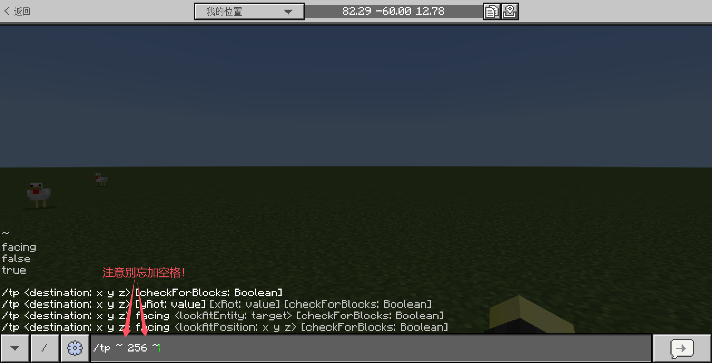

:::info[思考 1.2-1]

为什么这次必须要有空格了呢？

:::

---

## 局部坐标

现在我们再添加一个新的需求：如果我想要玩家往前传送 5 格该怎么办？这里我们要问：什么是“前”？很明显，在 Minecraft 中我们可以转动视角，那么这里所谓的前方也就是指玩家视线的前方。但是相对坐标只能满足固定方向上的坐标计算，也就是东西南北和高低，如何根据玩家的视线判断该向什么方向传送呢？

:::tip[实验 1.2-4]

在创造模式下飞起来，随便面向什么方向，然后执行`/tp ^^^5`。你可以多次尝试执行这条命令，尽量平视，不要向上或向下看！


:::

做完上述实验后，你将被传送到你前方 5 格上。这种用折线和一个数字来表示相对于朝向位置的坐标叫做**局部坐标（Local Coordinates）**。如果命令的参数要求填写为`x y z`类型，局部坐标也是允许的。

### 局部坐标的表示方法

局部坐标的表示方法为`^(+左) ^(+上) ^(+前)`，代表相对于你原来位置的左侧、上方、前方之外的距离。`(左)`、`(上)`、`(前)`如果为`0`则可以忽略，如果为正数则`+`可以忽略。特殊地，在基岩版，局部坐标之间的空格也可以忽略。*~口诀：坐上钱~*

例如：

- `/tp ^5^^`，它等价于`/tp ^+5 ^ ^`；
- `/tp ^^^`，它等价于`/tp ^ ^ ^`；
- `/tp ^3^4^-5`，它等价于`/tp ^+3 ^+4 ^-5`。

### 局部坐标不能混用

**注意：局部坐标不能和相对坐标、绝对坐标混用**！例如，如果我们执行`/tp ^5 -60 ~2`，游戏将会报错：

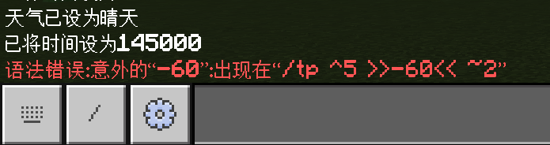

顺便一提，这种报错格式`语法错误：意外的“xxx”，出现在“... >>xxx<< ...”`代表你写的命令中存在语法错误。看到这种报错格式，应当检查你的命令中是否存在语法问题。

---

## 总结与练习

- 坐标反映一个物体所处的位置，在 Minecraft 中用三个数字（后面会了解到，这叫做三维有序数组）表示。玩家、生物的坐标，代表其脚部所处的位置。
- 由三个确定的数字组成的坐标，叫做绝对坐标。
- 用波浪线和一个数字来表示相对位置的坐标，叫做相对坐标。相对坐标的表示方法为`~(+x) ~(+y) ~(+z)`，并且在特定情况下可省略特定的符号。相对坐标可以和绝对坐标混用，但不得省略空格。
- 用折线和一个数字来表示相对于朝向位置的坐标，叫做局部坐标。局部坐标的表示方法为`^(+左) ^(+上) ^(+前)`，但是不可与相对坐标、局部坐标混用。
- 一个接受`x y z`类型的命令参数，可以填入绝对坐标、相对坐标或局部坐标。
- `/tp <位置: x y z>`是一条可以将玩家传送到`<位置>`的命令，其中`<位置>`的类型是`x y z`，因此可以填入绝对坐标、相对坐标或局部坐标。

:::info[练习 1.2]

1. 在聊天栏执行一条`/tp`命令，把你传送到坐标(11,45,14)吧！
2. 写一条命令把你自己传送到东南方向各 5 格。提示：x 轴正方向为东，z 轴正方向为南。
3. 写一条命令把你自己传送到北方 17 格，东方 42 格。
4. 写一条命令把你直接传送到虚空！提示：虚空的 y 轴坐标是小于 -64 的。
5. 写一条命令，把你传送到脚下一格！提示：脚下 1 格的实质就是 x 和 z 轴坐标不变，而 y 轴坐标 -1。
6. 把自己传送到自己视角上方 5 格，观察会传送到哪里？这样的传送和`/tp ~~5~`有什么区别？
7. 头朝下并把自己传送到自己视角前方 1 格，观察会传送到哪里？

:::
