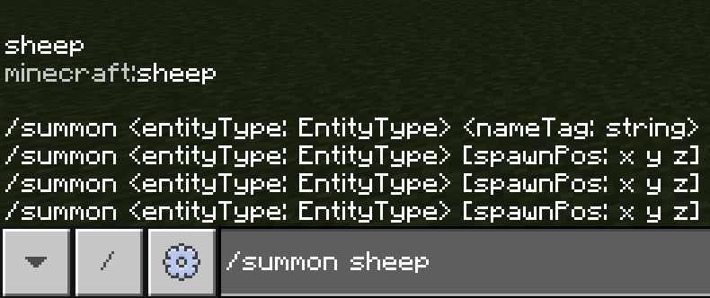
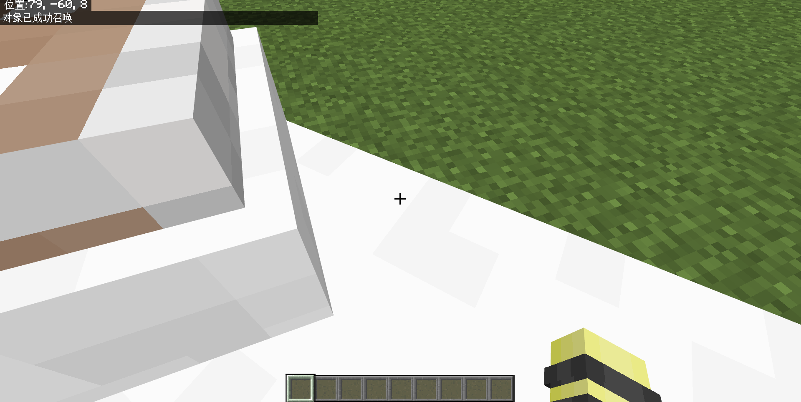
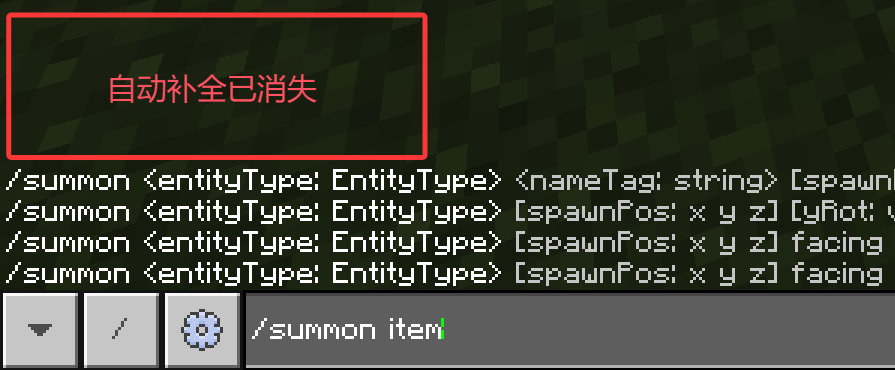
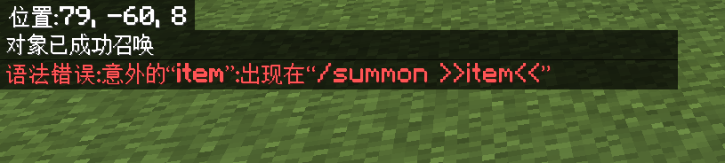

# 1.3 实体

本节，我们开始介绍 **实体（Entity）** 的概念。为什么我们需要实体这样一个概念呢？这是因为在实际的工程里面，会用到大量有关于实体操作的命令。有很多命令是用于控制实体的。实体拥有比较良好的执行性和灵活度（因为有旋转和位置变量），所以很多情况下我们都需要一些实体来辅助我们实现一些特殊功能。

---

## 实体

什么是实体？Wiki 给出定义如下：

> 实体（Entity）包括在 Minecraft 中所有动态的、移动中的对象。

实体的概念是与方块相对的，方块是世界中的那些较为固定的东西，而实体则是可移动的，较为动态的东西。事实上，作为初学者，你可以认为**实体就是生物加上部分特殊实体的集合**，也就是说，**实体就是广义概念上的生物**，比如苦力怕、绵羊、犰狳这些生物自然都属于实体，玩家作为生物也是一种实体，这些都是好理解的。那么*部分特殊实体*是指代谁呢？我们列出一些比较常见的：

- **盔甲架**
- 各种船和矿车（因为它们会动）
- 物品掉落物和经验球（因为它会动而且在转）
- 各种箭、三叉戟、雪球、鸡蛋等投掷物（因为它们也会动）
- 闪电束
- 画
- 末地水晶和被点燃的 TNT

实际工程中，最常用的辅助实体是**盔甲架**，因为它不会乱动且不会消失。你可以在 [Wiki 的实体条目](https://zh.minecraft.wiki/w/实体)中看到所有的实体类型。

注意：我们讲实体这个概念的时候，**不考虑以上实体的物品性**，也就是在物品栏中的对应形式。例如，物品栏中的雪球应该属于物品的范畴，而非实体的范畴。实体应该是存在于世界中的。

---

## 实体 ID

什么是实体 ID？简单来说，为了**在代码中表示这个实体的种类**，比如这是猪，那是猪灵，一个生物不可能既是猪又是猪灵，显然，我们需要一个**唯一的标识符（Identifier）** 来指代它的种类，这就是实体 ID。那么实体 ID 怎么写呢？事实上，绝大部分的实体 ID 都是其英文名改写来的。一般命名规律如下：

- 知道这个实体的英文名。例如盔甲架（Armor Stand）。
- 全部改为小写，然后将空格`Space`换为下划线`_`。例如盔甲架的 ID 为`armor_stand`。

需要注意，少数实体因为历史原因，其 ID 与其英文名并不完全一致。例如僵尸猪灵（Zombified Piglin）的 ID 为`zombie_pigman`。

在什么地方可以用到这些实体 ID 呢？有两处：一处是目标选择器参数中，我们用`type`来指代特定实体，但这是后话了；而另一处则是`类型`为`EntityType`的命令参数接受这些实体 ID 。目前来说，使用这类参数的命令只有 1 条：`/summon`。

---

## 生成实体的命令：`/summon`

### 基本语法

`/summon`命令是一条用于直接生成实体的命令，它的语法为

```text
/summon <实体：EntityType>
```

即在执行者的位置生成`实体`。下面我们来通过一个实验来加深一下理解吧！

:::tip[实验 1.3-1]

试执行命令`/summon sheep`。



:::

执行上述的命令，将会在你的位置生成一只绵羊。



`EntityType`是一种穷举类型的参数。如果不是允许的实体 ID，换言之，传入的参数指代了一个不存在的实体，比如传入`tiger`，但 MC 可没有老虎，那么执行的命令将会报错。

:::note[扩展：关于穷举参数]

很多命令所允许的参数都是穷举参数。最经典的例子是实体 ID 对应的`EntityType`、物品 ID 对应的`Item`、方块 ID 对应的`Block`。你可以看到这些参数有一个共同点——`类型`首字母是大写的。

所谓穷举，就是把所有的可能性一一列举出来。一些参数是不可能做到穷举的，例如整数`int`，在数学上我们认为有无穷多个数，是不可穷举的。而布尔值`Boolean`则是可穷举的。Minecraft 中的实体、物品、方块种类虽多，但是归根结底是有限个，因此它们都是穷举参数。

以后你还会在更多的命令中遇到更多的穷举参数。**请记住，穷举参数只能填写为规定的值，如果不为规定的值，命令就将会报错。**

:::

### 部分实体不能被`/summon`生成

既然我们前文提过，一些特殊的东西也是实体，比如掉落物，那么掉落物也能够用`/summon`生成吗？

:::tip[实验 1.3-2]

试执行命令`/summon item`。事实上你可以看到与上面的实验的不同之处——前面是有`sheep`的自动补全的，而现在已经没有自动补全了。



:::

执行上述的命令，`/summon`会执行失败：



奇了怪了，物品不是实体吗？怎么会生成出错呢？

这是因为，该实体被设置为**不可生成**。事实上，部分实体虽然拥有一个统一的大类（例如下落的方块或掉落物实体），但是它们又可以分成许多个小类，这就会在生成的时候产生歧义，比如下落的方块是沙子还是沙砾？掉落物是草方块还是钻石剑？所以对于这种较为笼统的大类，Minecraft 就阻止了它们直接使用`/summon`生成。

---

## 总结与练习

- 实体包括在 Minecraft 中所有动态的、移动中的对象。简单来说，实体是生物与部分特殊动态移动对象的集合，实体就是广义概念上的生物。
- 实体 ID 是为了在代码中表示这个实体的种类而设置的唯一标识符。绝大部分的实体 ID 都是其英文名改写来的，即：全小写后再将中间的空格改为下划线。但是，少数实体因为历史原因，其 ID 与其英文名并不完全一致。
- `/summon <实体：EntityType>`是一条可以在执行者的位置生成`实体`的命令，其中`<实体>`的类型是`EntityType`，因此可以填入实体 ID。
- `/summon`不能生成一切的实体，因为部分实体被设置为不可生成。

:::info[练习 1.3]

1. 已知闪电束的英文名（Lightning Bolt），请按照实体 ID 命名的一般规律总结出闪电束的实体 ID，并执行生成闪电束的命令。
2. 已知末地水晶的英文名（End Crystal），请按照实体 ID 命名的一般规律总结出闪电束的实体 ID，并执行生成末地水晶的命令。
3. 已知命令方块矿车的 ID 为`command_block_minecart`，请试图生成之。如果你不了解什么是命令方块，先不要紧，把它扔在那里就行。

:::
