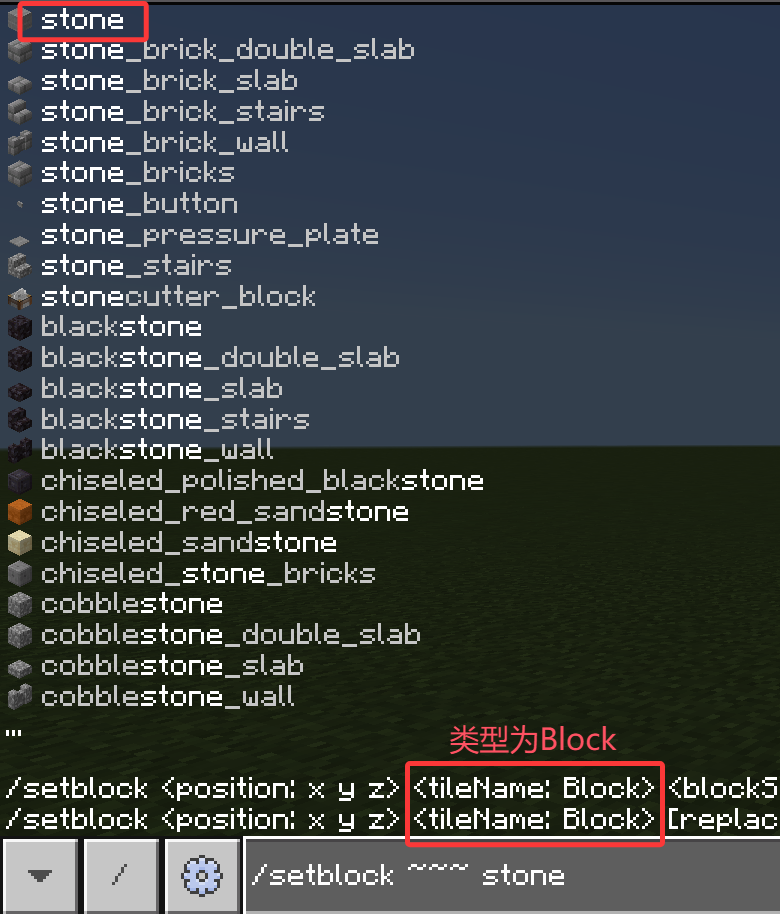
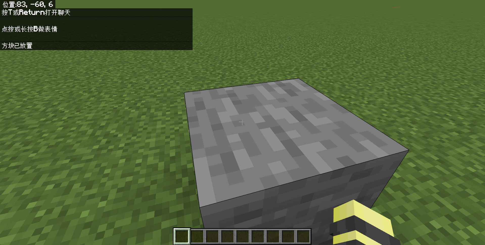

# 1.5 方块

本节，我们介绍方块这个概念。

---

## 方块

在前面几节，我们介绍了实体、物品两个基本概念，而方块则是在命令中的另一个基本概念。实体、物品和方块基本上就是构成 Minecraft 世界的基本要素。Wiki 给出如下定义：

> 方块是 Minecraft 世界里最基本的组成单位。

特别地，我们说**方块应当是一个与实体相对的定义**，即那些不太动态的，不可移动的（活塞除外）世界中的东西。例如，草方块、玻璃板、黑曜石、红石粉等都是方块。这个概念是很容易理解的。特殊地，在基岩版中，物品展示框是方块。你也许知道，在 Java 版中，它是一种实体。

同样地，我们**不考虑方块的物品性**，例如物品栏中的草方块应该属于物品的范畴，而不属于方块的范畴。

因此，从定义上来看：

- 物品就是特指物品栏中的东西，实体和方块是世界中的东西；
- 实体是可移动的，动态的东西，实体包括生物和一些特殊的实体；
- 而方块则是相对固定的东西。

---

## 方块 ID

我们前面已经介绍了实体 ID 和物品 ID。方块 ID 的一般命名规则和另外两者也是类似的，这里我们便不再赘述了。但与另外二者不同的是，方块 ID “不按套路出牌”的 ID 比较多。

因为历史原因，在相对比较旧的版本中，Mojang 使用了大量的数据值来将不同方块压缩到了一个 ID 中，例如`stone`可以同时包含石头、花岗岩、闪长岩、安山岩和它们的磨制变种。最灾难性的 ID 当属台阶，众多类型的台阶都整合为`stone_block_slab_1`、`stone_block_slab_2`等模棱不清的 ID，而新增的台阶的 ID 却并不归属于这些 ID 之中。幸好，自 1.19.70 开始，方块 ID 和物品 ID 被进行拆分，方块 ID 也逐渐变得更规律。

一般来说，方块 ID 和方块类的物品 ID 是一致的，例如草方块`grass_block`、钻石块`diamond_block`，但也有一些不太一致的，例如红石灯的物品 ID 为`redstone_lamp`，但是它的方块 ID 则分为`redstone_lamp`（未点亮的红石灯）和`lit_redstone_lamp`（点亮的红石灯）。

同样的问题：什么时候可以用到方块 ID 呢？基本上，`类型`为`Block`的参数会需要方块 ID。一些方块操作的命令通常包括这类参数，主要包括`/setblock`（单个方块处理）、`/fill`（批量处理）、`/clone`（复制粘贴）、`/execute if block`等。本节，我们接下来以`/setblock`为例深入讨论。

---

## 放置方块的命令：`/setblock`

`/setblock`是一条非常常用的命令，可以在特定位置放置方块，它的语法为

```text
/setblock <位置：x y z> <方块：Block>
```

即：在`位置`处放置`方块`。其中，`位置`的类型`x y z`我们已经学习过，它可以填写为坐标（包括绝对坐标、相对坐标、局部坐标）；而`方块`的类型`Block`则可以填写为方块 ID。现在我们对这条命令有了一定的基本了解，现在我们来做一个实验吧！

:::tip[实验 1.5-1]

执行命令`/setblock ~~~ stone`。



:::

可以看到执行这条命令后，就在你的位置放置了一块石头。同样是一条很简单的命令，不是吗？



Minecraft 中含有各种各样五花八门的 ID，它们一般都以穷举参数的形式出现，即`类型`的首字母是大写的参数。你可以在这个网站：[MCBEID 查询表](https://ca.projectxero.top/idlist/)中查询到你所需要的各种 ID，本教程中将只详细介绍这三种最常用的 ID。

---

## 总结与练习

- 方块，是一个与实体相对的定义，即那些不太动态的，不可移动的世界中的东西。
- 方块 ID，与物品 ID 和实体 ID 类似，都是为了在代码中表示这个方块的种类而设置的唯一标识符。它的一般命名原则与另外二者一致。一般来说，方块 ID 与方块类的物品的 ID 是一致的，但仍有一些特例。因为历史原因，不规则的方块 ID 较多。
- `/setblock <位置：x y z> <方块：Block>`用于在`位置`处放置`方块`。`位置`的类型是`x y z`，因此填写为坐标（包括绝对坐标、相对坐标、局部坐标）；`方块`的类型`Block`则可以填写为方块 ID。

:::info[练习 1.5]

1. 在你所在的位置放置一个草方块（`grass_block`）。
2. 在你前方 5 格的位置再放置一个泥土（`dirt`）。
3. 然后，回到地面，把你脚下的方块用命令清除掉。提示：清除一个方块的实质就是放置一个空气（`air`）。如果你忘了脚下怎么写，请参见[练习 1.2 的第 5 个问题](section2#总结与练习)。

:::
