# 1.6 目标选择器

本节我们来介绍目标选择器这个基本概念。事实上，在你不知不觉中，就已经在前面见过它了。为什么我们需要目标选择器？还记得我们在 [1.3 实体](section3)曾说过的：

> 这是因为在实际的工程里面，会用到大量有关于实体操作的命令。有很多命令是用于控制实体的。实体拥有比较良好的执行性和灵活度（因为有旋转和位置变量），所以很多情况下我们都需要一些实体来辅助我们实现一些特殊功能。

但是我们又在那一节中说，使用实体 ID 的命令只有`/summon`一条。既然如此，为什么说“有很多命令是用于控制实体”的呢？这就不得不提到目标选择器了。

---

## 命令`/tp`的扩展

让我们试想这样一个需求：我们现在要传送一只绵羊到(0,256,0)的位置上。听起来很不可思议！因为我们曾经学过，`/tp`是用于传送执行者到特定位置的，在目前，我们所学习的聊天栏执行的命令中，我们才是执行者，绵羊是不能成为执行者的。但细心的你一定已经发现：我们所学的只是`/tp`的冰山一角！为什么呢？因为当我们输入`/tp`后：

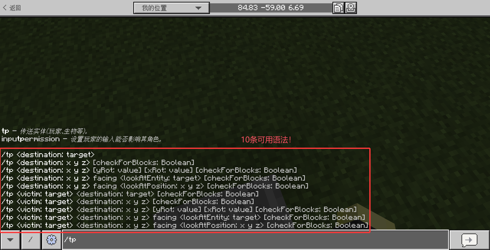

它拥有整整 10 条语法！而且我们曾学过的`/tp <位置>`也只是图中第 2~4 种语法的简写形式而已。

让我们关注这张图的第 1\~5 种语法和第 6\~10 种语法，并进行比对，你发现了什么？

没错！下面的命令都多出来了一个`<victim: target>`参数！也就是说，我们以前所学的命令

```text
/tp <位置: x y z>
```

可以扩展为

```text
/tp <目标: target> <位置: x y z>
```

这样，`/tp`的意义就变为：将`目标`传送到`位置`上，也就是说，你可以指定特定的目标进行传送！这些目标，允许的类型就是实体，你可以指定一个合适的实体，将它传送到特定位置。

你可能也已经注意到，`<目标>`的`类型`是`target`，我们好像在哪里见过？没错！在`/give`命令中我们也曾见过这个参数类型。当时我们说，`target`可以填写为自己的昵称，而现在你已经知道，`target`是用于指代实体的类型，因此玩家的昵称自然也在这个行列之中。

然而，我们如何利用`target`指代一个实体呢？难道是直接写`sheep`？且不说就算它能生效，原则上也是对所有的绵羊生效，不能指定到我们希望传送的那只羊身上，实际这样写也是根本无法生效的。让我们来分析这样一条命令：

```text
/tp sheep 0 256 0
```

让我们考虑这么一种情况：一位名字叫`sheep`的玩家加入了游戏，这时是传送绵羊还是传送玩家？

不难发现，这种情况会造成歧义。因此，游戏认为，输入一个普通的字符串是传送名字为`sheep`的玩家，而不是绵羊。如果没有名字为`sheep`的玩家，游戏将会报错：

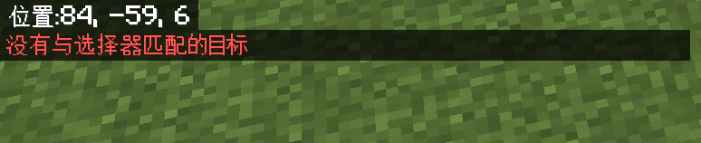

这种报错：`没有与选择器匹配的目标`代表命令的语法是正确的，但是找不到这样的实体。那我们怎么指代绵羊呢？

---

## 目标选择器

为了指定特定的实体，我们需要引入 **目标选择器（Target Selector）** 这个概念，因为是专门指定实体的，因此又称为 **实体选择器（Entity Selector）**。[Wiki](https://zh.minecraft.wiki/w/目标选择器) 给出的概念为

> 目标选择器（Target Selector）又名实体选择器（Entity Selector），可在无需指定确切的玩家名称或UUID的情况下在命令中选择任意玩家与实体。目标选择器变量可以选择一个或多个实体，目标选择器参数可以根据特定条件筛选目标。

类型为`target`的命令参数，不仅接受玩家昵称，也接受目标选择器。例如`/tp @e ~~~`，其中的`@e`就是一个目标选择器。至于这个选择器代表什么，很快你就会认识到。

要使用目标选择器，我们必须了解目标选择器如何编写。一般来说，目标选择器由两部分组成：**目标选择器变量**和**目标选择器参数**，但是目标选择器参数是可选的。

---

## 命令`/testfor`：检测实体的命令

在正式开始介绍目标选择器之前，我们需要先插入一个额外的话题……下面我们将要探讨对实体的操作命令，然而到目前为止我们只学习了两条对实体的操作命令：`/tp`和`/give`。这两条命令都并不方便我们进行各种各样的实验，所以，我们在这里引入一条新的，能够检测实体是否存在的命令——`/testfor`！它的语法如下：

```text
/testfor <目标: target>
```

意义是：检测`<目标>`是否存在。如果存在，则在聊天栏返回符合条件的实体信息；如果不存在，则报错`没有与选择器匹配的目标`。在下面我们将会频繁地使用这条命令，这是一条非常简单的命令！

---

## 目标选择器变量

目标选择器变量（本节下文简称为变量），用于大体上地划定并选择实体范围。

变量的写法为`@(字符/字符串)`，例如`@a`、`@e`或`@initiator`。

基岩版一共有 6 种变量，其中 5 种都有很重要的用途。我们来一一认识一下这 5 种目标选择器变量！

### `@a`：选定所有玩家

`@a`中的`a`代表的是 **A**ll Players 的 A，因此，**使用`@a`将选中所有玩家**。我们来回顾一下`/give`命令的语法：

```text
/give <玩家: target> <物品: Item>
```

接下来，我们来使用`@a`做个实验吧！

:::tip[实验 1.5-1]

执行命令`/give @a apple`。你现在应该能够看懂这条命令：它将给予所有玩家一个苹果。


:::

特别地：`@a`是直接选取的玩家，**无论玩家目前是死亡状态还是存活状态、是创造模式还是生存模式等，只要是玩家就都会被`@a`选中**。

### `@e`：选定所有实体

`@e`中的`e`代表的是 **E**ntities 中的 E，因此，**使用`@e`将选中所有实体**。我们来使用`@e`做一个实验：

:::tip[实验 1.5-2]

执行命令`/tp @e ~~~`。在执行之前，你可以试着分析一下这条命令的含义，在游戏内执行后，看看符不符合你的预期。

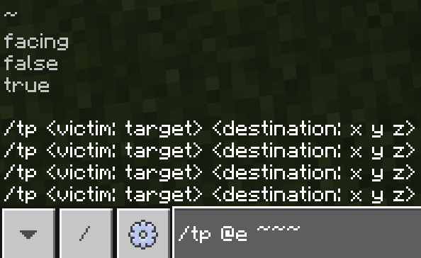

:::

是的，这条命令会把所有的实体全都传送到你的身上！你分析对了吗？

在使用这个目标选择器的时候，请务必注意三点：

1. `@e`会选定所有实体，**这个范围是相当大的**！因此，我们在使用该变量的时候，一般都要搭配目标选择器参数，来限定选中的实体。直接使用`@e`一般都是很危险的，用之前请务必谨慎！
2. `@e`**不会选定已经死亡的实体**。依据这个原理，我们很快就会了解到，`@a`和`@e`的联合应用可以精确地检测到哪个玩家处于死亡状态。
3. **部分命令只能接受玩家类型的实体**。因此，`@e`在某些`target`类型的命令中也会报错。

### 限定玩家类型的`target`命令参数

我们来看这样一个实验：

:::tip[实验 1.5-3]

执行命令`/give @e apple`。

:::

执行上面的命令，将会报错。这是因为有相当多的实体是不存在物品栏这个概念的，所以一些类型为`target`的命令是不允许更广泛的实体概念参与的，而只允许玩家。后面你会看到更多类似的命令，例如`/gamemode`。


对于这类仅限玩家的命令，你可以注意到命令参数一般为`player: target`，限定玩家，而不是`victim: target`、`entity: target`等更广泛的描述。在`/give`中，对应的参数就是`<player: target>`。

### `@p`：选定最近的玩家

`@p`中的`p`代表的是 Nearest **P**layer 中的 P，因此，**使用`@p`将选中最近的玩家**。

也许你会问一个问题：这里的最近是指距离什么位置最近呢？很显然，就目前来说，我们的执行位置就是我们自己的位置，因此，离我们最近的玩家自然就是我们自己。那么这样的话，如何指定距离特定位置最近的玩家，而不是总指定到我们自己呢？先不要紧，我们马上就会了解到这一点。当然，在你学习 [2.3 的命令执行原理](../chapter2/section3)后，你会更加深刻地了解到这一点。

特别地，`@p`只选择活着的玩家。

### `@r`：选定随机的玩家

`@r`中的`r`代表的是 **R**andom Player 中的 R，因此，**使用`@r`将选中一个随机的玩家**。不过，`@r`也是可以选定随机实体的，稍后你就能看到这一点。

### `@s`：选定执行者

`@s`中的`s`代表的是 **S**elf 中的 S，因此，**使用`@s`将选中执行者本身**。显然，`/tp <位置>`和`/tp @s <位置>`的效果是完全等同的，因此，扩展的语法完全能够代替我们以前所学的语法，从今以后，我们讨论`/tp`时，就将讨论扩展的语法：

```text
/tp <目标: target> <位置: x y z>
```

---

## 目标选择器参数

我们注意到一点：即使我们能够通过`@e`等方法指代其他实体，但是我们一开始的需求并没有解决。如何指定一只绵羊呢？这就需要目标选择器参数来进行更进一步的筛选。

目标选择器参数（本节下文简称为参数），是在变量选中的实体的基础上，再通过参数中所给的条件进行筛选。参数是跟在变量之后的，并且用中括号包裹：

`@变量[参数1=值1,参数2=值2,...]`

不同参数的筛选原则，采用“和”的逻辑，即：在变量选中的实体的基础上，筛选出符合`参数1=值1`、并且`参数2=值2`、并且`...`的所有条件的实体。

接下来，我们介绍一些基本概念，和几个比较常用的参数。

### 实体的碰撞箱

在介绍接下来的概念之前，我们首先要介绍一下实体的**碰撞箱（Collision Box）**。在 Minecraft 中，碰撞箱经常用于各种判定。每个实体都拥有一个长宽相等的碰撞箱，例如玩家在站立时的碰撞箱的高度就是 1.8 格，宽度为 0.6 格，因此玩家在站立时，就无法穿过 1.5 格高的洞口。

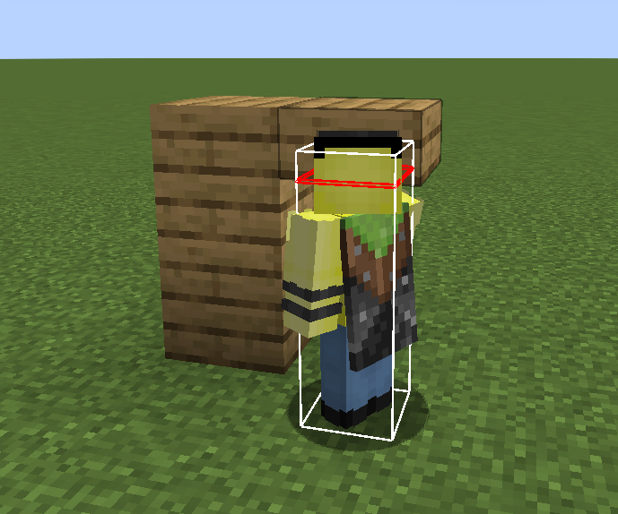

下文中的`r`、`rm`、`dx`、`dy`、`dz`都是进行区域检测的参数，它们的判定标准是：**只要碰撞箱有和检测区域重叠的部分，就视为检测通过**。

### `r,rm`：指定特定距离内的实体

参数`r`的 r，取自 **R**adius，也就是半径的意思。**`r`将选中在特定半径内的实体**。它所能接受的值为浮点数类型。我们来举几个例子：

- `@e[r=10]`：指代执行者周围 10 格的实体；
- `@a[r=5]`：指代执行者周围 5 格的玩家。

而参数`rm`，相比于`r`多了一个 m，取自 **M**inimum，结合起来看，就是最小半径。换言之，**`rm`将选中在特定半径外的实体**。同样地，它所能接受的值为浮点数类型。我们来举几个例子：

- `@e[rm=10]`：指代执行者 10 格之外的实体；
- `@a[rm=5]`：指代执行者 5 格之外的玩家；
- 特殊地，`@e[rm=0]`：指代执行者 0 格之外的实体，换言之，选中此维度的所有实体。

在这一小节的一开始，我们说过可以使用多个参数，并采用“和”的逻辑。同样地，`r`和`rm`可以并用，并选中特定区域的实体（图片来自 Minecraft Wiki）：

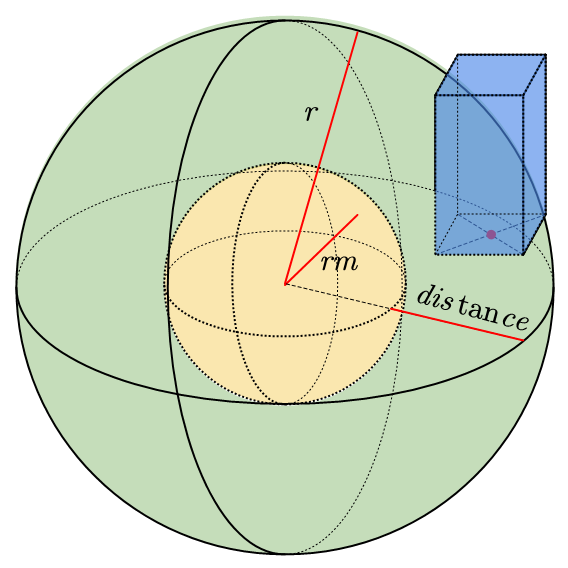

在这张图中，绿色球壳的部分就是检测区域，而蓝色的长方体指代实体的碰撞箱。只要实体的碰撞箱与绿色部分的检测区域有重叠，就认为检测通过。我们同样举几个例子：

- `@e[rm=5,r=10]`：指代距执行者 5~10 格的实体。
- `@a[rm=1.5,r=5]`：指代距执行者 1.5~5 格的玩家。
- `@a[rm=5,r=4]`：指代距执行者 5~4 格的玩家。很显然，不可能存在这样的实体，因此这条命令将会报错。所以，这里必须满足`r`>`rm`。


### `dx,dy,dz`：指定一个长方体区域内的实体

参数`dx`、`dy`、`dz`的 d，均指代 **D**elta，也就是变化量、差值的意思。换言之，**如果执行者的位置位于(x,y,z)，那么，实体碰撞箱与坐标(x,y,z)和坐标(x+dx,y+dy,z+dz)构成的长方体检测区域重合的实体将会检测通过**。`dx`、`dy`、`dz`的默认值均为`0`。

这样的基本描述稍微抽象了一点，要理解这个定义主要会面临 3 个问题：

1. 为什么两个坐标就能确定一个长方体区域？
2. 坐标(x,y,z)和坐标(x+dx,y+dy,z+dz)构成了什么样的长方体检测区域？
3. 默认值这个概念怎么理解？

因此我们将结合一个例子来进一步帮助你加深对这个参数的理解。现在我们回到(0,-60,0)的位置，并在周围的不同区域安排一些小动物：

- 在第一象限（也就是 x 为正数， z 为正数）放上一群羊；
- 第二象限（x 负 z 正）放上一群鸡 *（注意 MC 的坐标系不是右手系，所以为右下角）*；
- 第三象限（x 负 z 负）放上一群牛；
- 第四象限（x 正 z 负）放上一群猪。

在下面的图，你可以清楚地看到这一点。注意红线代表 x 轴的正方向，绿线代表 z 轴的正方向。

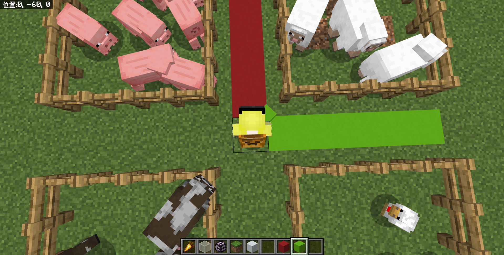

然后，我们来执行下面这条命令：

```text
/testfor @e[dx=5,dz=5]
```

你会发现，一些绵羊，也就是第一象限的实体都被检测到并发在聊天栏上。

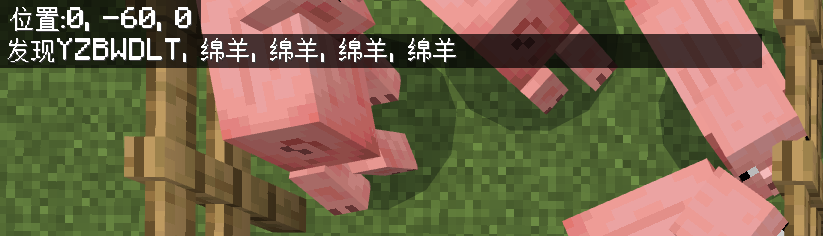

我们来解析一下这个结果，或者更准确一些来说，我们要回答上面提出的 3 个问题。

要回答第一个问题，就需要我们理解一个原理：**两个坐标能够确定一个长方体区域**，并且这个长方体的各个边都与 x,y,z 轴是平行的。举个例子：假设(0,-60,0)（红）和(5,-55,5)（蓝）有两个方块，那么它们所成的长方体区域就将如下图所示：

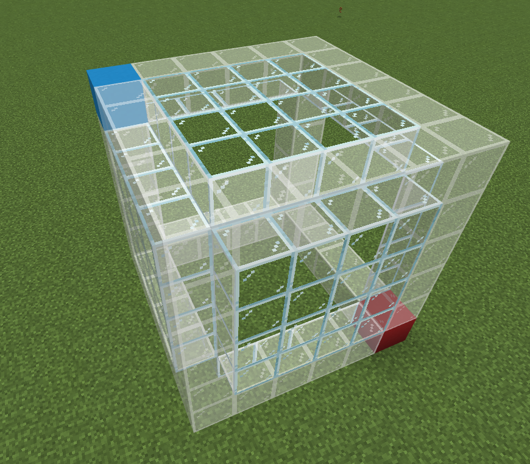

注意，这个原理是至关重要的，在命令中我们总是用这种方法确定一个长方体区域。这样，由你的位置(x,y,z)，和经过计算得到的新位置(x+dx,y+dy,z+dz)就能够围成一个长方体区域。

因此，在上面的例子中，我们的坐标是(0,-60,0)，指定的参数为`dx=5,dz=5`，因为`dy`没有指定，所以使用默认值`0`，也就是说，这条命令将找到(0,-60,0)和(0+5,-60+0,0+5)（也就是(5,-60,5)）所组成的长方体区域的实体。这个区域属于第一象限，因此将返回这个区域内的绵羊。

希望这个例子有助于你的理解！我们再举几个例子：

- 当你的位置在(30,40,50)时，使用`@e[dx=30,dy=40,dz=50]`将选中(30,30,30)和(60,80,100)所成区域内的实体。
- 当你的位置在(-5,-5,-5)时，使用`@e[dx=-20]`将选中(-5,-5,-5)和(-25,-5,-5)所成区域内的实体。
  - 什么？这是一条直线？是的！但是我们前文曾说过，只要碰撞箱有和检测区域重叠的部分，就视为检测通过。所以，只要实体的碰撞箱和这条线相交，就能够检测通过。
- 当你的位置在(0,320,0)时，使用`@e[dy=50]`将选中(0,320,0)和(0,370,0)所成区域的实体。

### `x,y,z`：指定参数的参考位置

考虑这么一种情况：现在我们到(10,-50,10)的位置上去，如果我们再使用上面的命令

```text
/testfor @e[dx=5,dz=5]
```

你会发现，这时执行这条命令将不再返回我们和多个绵羊，而是只返回我们自己：

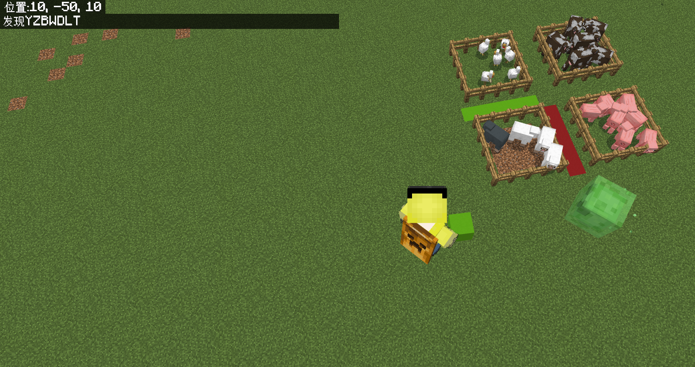

显然，每一次使用`r`、`rm`、`dx`、`dy`、`dz`时，所选取的基准坐标都是相对于我们的。如何选定一个确定位置的检测区域，而不是让检测区域的位置和我们的位置相关呢？这时我们就需要用`x`、`y`、`z`来额外确定一个基准坐标。`x`、`y`、`z`的默认值均为执行者当前的位置。在上面的例子中，我们就可以用

```text
/testfor @e[x=0,y=-60,z=0,dx=5,dz=5]
```

这样，检测的基准坐标就迁移到了(0,-60,0)上。你会得到一个返回全是绵羊的结果，和前面不同，这次的返回结果不包括我们自己。这是很好理解的，因为我们现在在(10,-50,10)的位置上，按照前文的分析，这条命令将找到(0,-60,0)和(5,-60,5)所组成的长方体区域的实体，我们不在这个区域内，因此自然不包括我们。

`x`、`y`、`z`也允许相对坐标，例如`x=~1.5`。

要格外注意两个问题：

- `x`、`y`、`z`将会更改`@p`的判定。我们曾说过，`@p`指代最近的玩家。这里的最近，是指代参数的参考位置(`x`,`y`,`z`)。
- 不要只指代`x`、`y`、`z`，它不会有什么作用，因为它仅仅改变参数的参考位置，相当于它换了一个位置检测，但是因为没有指定范围，所以它一般起不到什么用途。
  - 例如：`/testfor @e[x=0,y=-60,z=0]`仍然会返回全部的实体，这时候它和`/testfor @e`几乎没有任何区别。
  - 有一种情况是例外的：当你要寻找离某个位置最近的实体的时候，比如`/testfor @p[x=0,y=-60,z=0]`。这种情况下，`@p`的基准坐标也被更改，因此只这么写是可以的。不过我们一般也很少这么用。
  - 细心的你或许已经注意到，既然`dx`、`dy`、`dz`的默认值均为`0`，为什么`/testfor @e[x=0,y=-60,z=0]`不是什么都不返回，而是返回所有实体呢？这是因为我们三个参数都没有指定，所以这条命令根本不会进行范围上的搜索。因此，就无需考虑`dx`、`dy`、`dz`的问题。

### `type`：指定特定类型的实体

似乎到这里我们还是没有解决一开始的问题……如何指代一只绵羊？这里会遇到两个问题，一个是数量上，我们只需要 1 只；一个是类型上，我们需要绵羊而不是其他东西。`type`就是为了解决这种类型问题而生的，它是指代实体中最重要的参数之一！

参数`type`的书写格式如：`[type=<实体 ID>]`，即，你可以通过`type`来指代特定`实体 ID`的实体。我们来做一个非常简单的小实验：

:::tip[实验 1.6-4]

执行命令`/testfor @e[type=sheep]`。在输入命令的过程中，你能够看到自动补全：

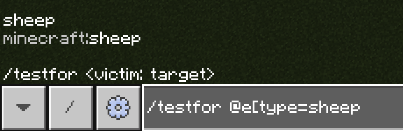

:::

它将返回这个世界所有的绵羊。

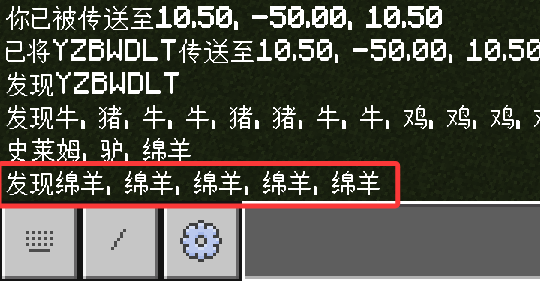

需要注意的一个问题：还记得`@r`吗？它将选择随机的玩家。但是，这个变量有一个特殊之处：**它可以指代`type`参数**，进而，它就可以指代非玩家类型的实体了。例如：`@r[type=zombie]`将指定一个随机的僵尸。不过`@a`、`@p`这些只能指代玩家的变量，就不允许再添加`type`进行修饰了。如果你想问如何指代最近的任意一种实体而非仅指代玩家，马上你就会知道。

### 反选

让我们先考虑一个新的问题：如果我唯独不想选中绵羊呢？难道要每个`type`都过一遍？

大可不必！我们用`!`来反选我们不想筛选的实体。反选的方法很简单，一般来讲，反选的表示方法为：

`参数=!值`

因此，筛选除了绵羊的其他所有实体就是`type=!sheep`。很简单吧？

注意：反选只对特定的参数有效，在后面的总结中我们会详细地给你指出这个参数是否支持反选。

### `c`：指定至多选中多少个实体

接下来我们还希望解决数量的问题？这里，我们需要用到参数`c`，也就是 **C**ount 的简写。**指定`c`后，这个选择器就将找到至多`c`个符合条件的实体**。我们再来做一个非常简单的小实验，自己动手试一试！

:::tip[实验 1.6-5]

执行命令`/testfor @e[type=sheep,c=1]`。

:::

你将会看到，只有 1 只绵羊被返回，哪怕在图里我们就看到至少有 4 只绵羊：

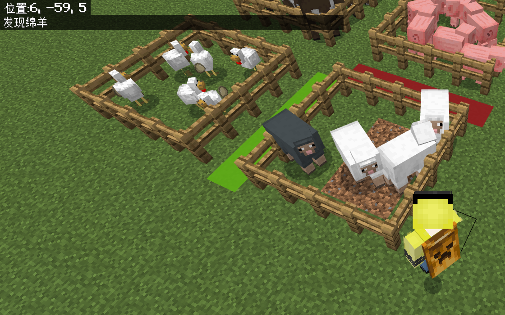

显然，`c`可以限制执行命令的实体数量。这样，我们一开始的问题就可以解决了！

> 我们现在要传送一只绵羊到(0,256,0)的位置上。

:::tip[实验 1.6-6]

执行命令`/tp @e[type=sheep,c=1] 0 256 0`。这就是我们一开始的问题的解决方案！

:::

### 参数`c`的至多限制性

然而，很多开发者都对`c`的理解有一个误区：他们会习惯性地应用`c`去检测实体的数目。我们来举一个例子：假设你希望在拥有 100 只羊后检测成功，进而执行新的命令，很多开发者在一开始都会错误地写为

```text
/testfor @e[type=sheep,c=100]
```

我们不妨来执行一下这条命令看看：

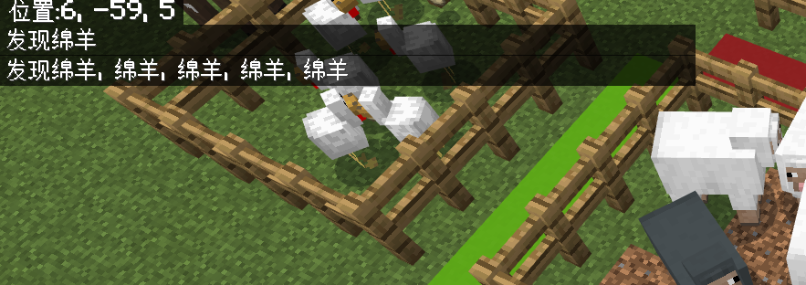

这意味着：

1. 在这个世界中，只存在 5 只羊；
2. 这条命令执行成功了，因为是白字，并且成功地返回了 5 只羊的信息。

这就意味着：即使不到 100 只羊，这条命令仍然能成功执行，并不像很多开发者预想的那样，到 100 只羊才执行。因此，我们要尤其注意，`c`只能限制命令**至多**选中多少实体！很遗憾，我们没有`cm`这样的参数，所以用`c`检测实体的数量，不能说完全做不到，但它绝不会像你预期那般好用。

也许你会问，既然这样，我们一般采用什么办法检测实体数目呢？等到我们学习到[2.4 标记与计算命令](../chapter2/section4/subsection1)的时候，你就会了解到我们更多地应用什么原理计算实体数目。

### 参数`c`的距离性

在前面我们曾提到过：`@p`是不能使用`type`参数的。那么，我们该如何指代一只距离(0,-60,0)最近的绵羊呢？事实上，`c`就是“版本答案”。为了向你明确地展示这一点，我们现在做一个稍微复杂一点点的实验：

:::tip[实验 1.6-7]

放 3 个盔甲架，从近到远分别用命名牌命名为 a, b, c：

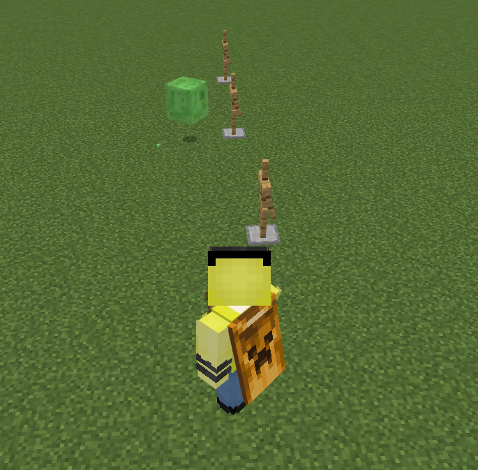

我们分别执行下面的命令：

- `/testfor @e[type=armor_stand,c=1]`；
- `/testfor @e[type=armor_stand,c=-1]`，想问`-1`个实体是什么？你先不用考虑那么多，照做就行。
- `/testfor @e[type=armor_stand,c=2]`；
- `/testfor @e[type=armor_stand,c=-2]`，同样照做就行。

:::

你最后会得到一个神奇的结果，四条命令都没有报错，而且都给出了不同的结果：

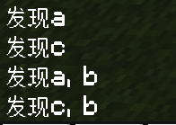

看到这个结论，你能总结`c`的含义吗？看看下面 Wiki 的定义（节选），看看和你的预期是否一样：

> `[c=<值>]` — 选择指定数量的目标，并**以距离命令执行点的顺序排列。当输入的值为负值时，目标的顺序会被反转。**

### `name`：指定特定名称的实体

我们刚刚在实验 1.6-7 中，放了 3 个带有名字的盔甲架。能否直接用名字指定它们？这就要用到`name`参数了。它是一种可以筛选特定名称的实体的参数。

:::tip[实验 1.6-8]

在上一个实验的基础上，执行命令`/testfor @e[name=a]`。

:::

最后，游戏将返回一个`发现a`的结果。名称也支持反选。是不是很简单呢？

### 使用命令检测掉落物的种类

:::warning[警告]

在你看这一节之前，我们必须警告你一点：这种做法并不稳定，只要物品因为更新、语言更改、铁砧命名等而改名，很有可能会导致基于此原理的命令系统报废。

但我们为什么还要提这么危险的东西呢？主要原因就一点——我们的命令体系确实没辙了。这是很多人宁可顶着风险也不得不用这东西的原因，所以我们还是会和你分享这么做的原理，让你有一个简单了解。但还是那句话：**除非你能确定物品名称无论如何都不会变，否则我们不推荐你这么做！**

:::

特别地：我们在 [1.3 实体](section3#部分实体不能被summon生成)中曾说过：

> 部分实体虽然拥有一个统一的大类（例如下落的方块或掉落物实体），但是它们又可以分成许多个小类，这就会在生成的时候产生歧义，比如下落的方块是沙子还是沙砾？掉落物是草方块还是钻石剑？所以对于这种较为笼统的大类，Minecraft 就阻止了它们直接使用/summon生成。

因此，如果我们使用`@e[type=item]`来检测，我们虽然知道这是一个掉落物，但是并不知道这是什么掉落物——它是钻石剑？还是纸？还是什么别的东西？这时候我们的方法是：再加一个`name`参数做具体的限定！例如要检测钻石剑：

```text
/testfor @e[type=item,name="钻石剑"]
```

这样，你就可以检测特定种类的掉落物了！当然，你可能已经发现这么做的诸多问题——比如如果把纸命名成钻石剑？如果改成英文？如果哪一天钻石剑改名叫金刚石剑了？这就是我们放了一个警告黄框的原因。请慎重使用！

### `hasitem`：指定拥有特定物品的实体

这个参数，可以筛选拥有特定物品的实体。我们在这里只介绍基础用法，之后的教程中我们会更进一步地向你展示它的威力。它的基础用法为：

`[hasitem={item=<物品 ID>}]`

也许你会问：为什么不直接使用`[hasitem=<物品 ID>]`呢？因为这只是基础用法嘛。它内部还接受很多参数，用法很灵活，但这是最基础的，就请你先接受这种写法吧~言归正传，我们来举一个例子：

:::tip[实验 1.6-9]

在上一个实验的基础上，执行命令`/testfor @a[hasitem={item=diamond}]`。如你所知，它将检测拥有钻石的玩家。

- 你可以在你的背包里放上钻石，执行一次看看？
- 然后拿掉钻石，再执行一次看看？
- 把`@a`改成`@e`，驯服一头驴，然后给它装上箱子，再放上钻石，执行一次看看？

:::

不难发现，3 次的执行效果分别为成功执行、检测失败、成功执行。相信这个实验会让你了解到它最基本的用法！

---

## 总结与练习

这一节我们接触的概念很多，难度也相比于以往大大地增加了。很遗憾，这也是一个必要的基本概念，不过好消息是至此，我们第一章的最基本的概念到这里就结束了。在此，我们对本节的内容进行回顾！

### 新命令

我们本节学习了两条新命令：

- `/tp <目标: target> <位置: x y z>`：将`目标`传送到`位置`上。是我们曾经所学过的`/tp`的扩展语法
  - 特殊地，当`目标`为`@s`时，这条命令与`/tp <位置: x y z>`的意义是等同的。因此，我们以后谈`/tp`都只谈带`<目标: target>`参数的扩展语法。
  - `target`类型的参数，接收字符串，代表玩家昵称；也接收目标选择器，用于指代其他实体。
- `/testfor <目标: target>`：检测`目标`是否存在。

### 原理与基本概念

- **碰撞箱**：每个实体都拥有一个大小不同的碰撞箱。碰撞箱是一个长宽相等，高度独立于长宽的长方体。实体的许多判定经常依赖于碰撞箱，例如 1.8 格高的玩家穿不过 1.5 格高的洞口。在命令中，只要碰撞箱有和检测区域重叠的部分，就视为检测通过。
- **两点确定长方体区域原理**：两个坐标可以确定一个各边均与 x,y,z 坐标平行的长方体区域。

### 目标选择器

- 目标选择器是用于在无需指定确切的玩家名称的情况下，在命令中选择任意玩家与实体的基本工具。
- 大量的命令中，都含有所需类型为`target`的参数，因此目标选择器在命令中极为常用。
- 目标选择器由目标选择器变量（必选）和目标选择器参数（可选）组成。
- 目标选择器变量用于大体上地选中实体，写法为`@变量`，具体如下表所示：

| 目标选择器变量 | 取自于 | 意义 | 检测死亡实体？ | 备注 |
| :---: | --- | --- | :---: | --- |
| `@a` | **A**ll Players | 选中所有玩家 | 是 | 禁止使用`type`指定实体类型 |
| `@e` | **E**ntities | 选中所有实体 | 否 | 要注意参数是否限定玩家类型（`<player: target>`） |
| `@p` | Nearest **P**layer | 选中最近的玩家 | 否 | 禁止使用`type`指定实体类型；用`x`、`y`、`z`指定基准检测坐标 |
| `@r` | **R**andom Player | 选中随机的玩家 | 否 | |
| `@s` | **S**elf | 选中执行者自身 | 是 | |

- 目标选择器参数用于在选中的实体的基础上进行进一步的筛选，写法为`@变量[参数1=值1,参数2=值2,...]`，本节所学习的为基础用法，具体如下表所示：

| 目标选择器参数（`参数=值`） | 取自于 | 意义 | 分类依据 | 备注 |
| :---: | --- | --- | :---: | --- |
| `x=<值: x>` | **x** | 目标选择器原点（参考位置）的 x 坐标 | 坐标 | 一般结合`r`、`rm`、`dx`、`dy`、`dz`使用，默认为执行者位置 |
| `y=<值: y>` | **y** | 目标选择器原点（参考位置）的 y 坐标 | 坐标 | 一般结合`r`、`rm`、`dx`、`dy`、`dz`使用，默认为执行者位置 |
| `z=<值: z>` | **z** | 目标选择器原点（参考位置）的 z 坐标 | 坐标 | 一般结合`r`、`rm`、`dx`、`dy`、`dz`使用，默认为执行者位置 |
| `r=<值: float>` | **R**adius | 距离目标选择器原点`值`以内的实体 | 坐标 | 必须满足`r`>`rm`，默认为无穷大[^1] |
| `rm=<值: float>` | **M**inimum **R**adius | 距离目标选择器原点`值`以外的实体 | 坐标 | 必须满足`r`>`rm`，默认为 0 |
| `dx=<值: float>` | **D**elta **X** | x 坐标满足`x`~`x`+`dx`的实体 | 坐标 | 默认为 0 |
| `dy=<值: float>` | **D**elta **Y** | y 坐标满足`y`~`y`+`dy`的实体 | 坐标 | 默认为 0 |
| `dz=<值: float>` | **D**elta **Z** | z 坐标满足`z`~`z`+`dz`的实体 | 坐标 | 默认为 0 |
| `type=<类型: EntityType>` | **Type** | 类型为`类型`的实体 | 实体数据 | 允许反选（`type=!...`） |
| `name=<名称: string>` | **Name** | 名称为`名称`的实体 | 实体数据 | 允许反选（`name=!...`），可选中特定名称的掉落物（*慎用此特性*） |
| `hasitem={item=<物品: Item>}` | **Has Item** | 拥有物品`物品`的实体 | 实体数据 | |
| `c=<最大数量: int>` | **C**ount | 至多从近到远选中**至多**`最大数量`个符合条件的实体 | 其他 | 可以指定为负数，并选中从远到近**至多**\|`最大数量`\|个实体 |

:::info[练习 1.6]

1. 写一条命令，将 Steve 传送到天上去！高度随你定，别高的离谱就行。
2. 写一条命令以检测所有玩家。思考：什么情况下，执行这条命令会检测失败？（别认为不可能，特殊情况下真的可以检测失败！好好思考一下~）
3. 写一条命令，看看你的世界都有什么实体。
4. 已知在潜行状态下，玩家的碰撞箱高度会降低到 1.49 格高，你能想到一种方法，利用`y`和`dy`检测玩家是否潜行吗？可以卡在一个 1.5 格高的洞里，用`/testfor`命令验证你的想法！
5. 写一条命令，返回距离(0,-60,0)距离 5~20 格的实体。
6. 试着做一个7×7×7的火柴盒，然后写一条命令检测里头的实体。假设这是个牛棚，再写一条命令以检测出里头所有的牛。
7. 假设现在你正处于单人游戏，写一条命令，把除了你之外的所有实体全都传送到你头上 10 格！
8. 假设现在你正处于多人游戏，写一条命令，把除了你之外的所有玩家全都传送到你头上 10 格！提示：你可以用`name`参数进行反选。
9. 写一条命令，检测是否有一些坏蛋玩家拥有 TNT 吧！

:::

[^1]: 事实上编程中不存在无穷大的情况。这个值顶多为一个很大很大的数，例如2,147,483,648。不过，在实际应用中，我们可以认为它就是囊括整个 Minecraft 世界的无穷大。
