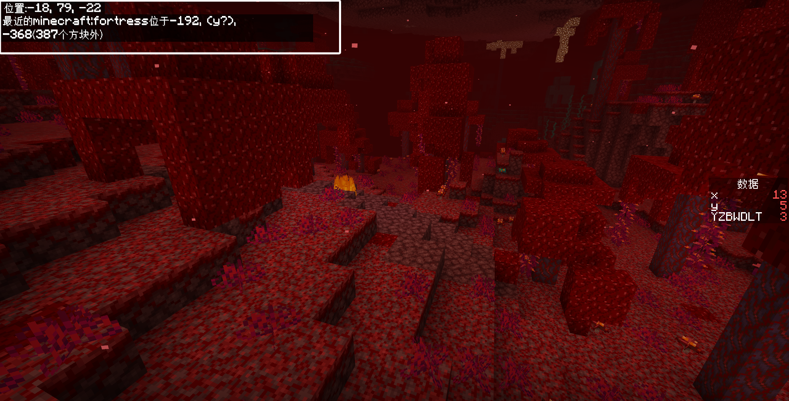
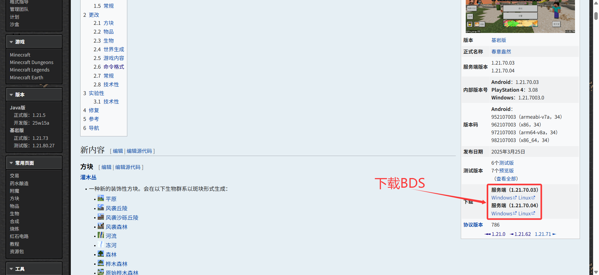
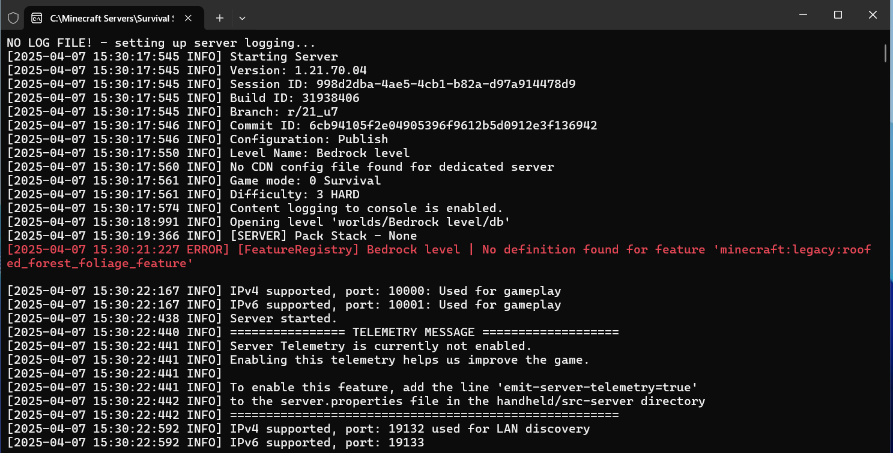

# 2.10 服务器、联机与生存常用命令

这一节我们讲一些剩下的，实际工程用途没那么大的命令。它们有些是只在特定场景下才有意义，有些是实际工程所使用的命令方块、函数或脚本所不能执行的命令。这节课不设习题，但是有一个基本概念——权限等级还是比较重要的。

## 命令的权限等级

在下面的命令中，大多数都是命令方块、函数等，甚至哪怕作为服主的你也无法执行的命令。事实上，我们在 2.3 所提到过的上下文信息中，除了执行者和执行环境参数之外，还有一个重要的上下文叫做**执行权限等级（Permission Level）**。

每条命令都有一个权限等级需求，而每个玩家又都拥有自己的权限等级。一旦执行者不能满足命令的权限等级需求，就会报`未知的命令`错误。一些命令对游戏平衡毫无影响，比如私聊命令，这种命令的权限等级需求就是`0`；而一些服务器管理命令决定着众多玩家的游戏体验，所以它们的权限等级需求就相当高，有些甚至可以达到最高的`4`，连服主都不能执行这样的命令。**绝大多数的命令的权限等级需求是`1`**。

这也很好地解释了为什么传统的无作弊服务器中，普通玩家是用不了诸如`/gamemode`这种命令的——很简单，他们的权限等级太低了。作为**非管理员来讲，普通成员的权限等级是`0`**，所以他们只能使用那些权限等级需求为`0`的命令，诸如`/tell`、`/?`、`/me`这种聊天命令。

在我们后面将要学习的命令方块、函数和脚本中，**这些自动化程序所具有的权限等级都是`1`**。所以，一些服务器管理命令就不能交给这些执行者去做。例如我们将要学到的`/op`就是这样的命令。但是，它们已经能够执行绝大多数的命令了。

而像是**普通的管理员，他们的权限等级可以达到`2`**，能够实现少部分的服务器管理命令。**联机房间的房主的权限等级在所有玩家中会是最高的，可以达到`3`**。

而权限等级最高的，是对于专门的服务器控制台而言的，控制台的权限等级是`4`，可以执行一些服务器专属命令。

## 定位命令`/locate`

`/locate`不是什么高权限等级的命令，它是用来定位特殊结构和生物群系的，所以常常用于生存跑图或寻找特定群系和结构。它的语法是

```text title="/locate的语法" showLineNumbers
/locate biome <群系: Biome>
/locate structure <结构: string> [只使用新区块: Boolean]
```

用这条命令，可以用来定位樱花树林、蘑菇岛这样比较稀有的群系，也可以用来定位村庄、下界要塞这样的特殊结构。在该维度定位到之后，会返回一个坐标值，这时候`/tp`过去就可以。具体用法就交给读者自行尝试了。



## 玩家列表命令`/list`

权限等级为`0`的普通玩家，还可以执行一条查询所有玩家的命令：`/list`。这条命令不需要任何参数，可以方便地查询当前服务器的玩家人数。

## 权限控制：`/op`与`/deop`

:::warning[权限等级提醒]

该命令需要至少为`2`的权限等级才能运行。如果使用命令方块、函数、脚本等自动化程序，将无法运行该命令。

:::

如果你是房主或管理员，你可以使用`/op`命令给予另一个玩家管理员权限，这样他便可以在房间或服务器中使用更多的命令。根据权限等级的原理：

- 如果你们的服务器是开启了作弊的，那么这个玩家的权限等级会从`0`跳到`2`，能够使用绝大多数的命令，所以在这种情况下给予管理权限一定要慎之又慎，因为你一定也知道，前面所学的那么多命令足够做出对服务器或房间具有毁灭性打击的系统。
- 如果你们的服务器没有开启作弊，那么即使给予了管理权限，权限等级会跳到`2`，但是绝大多数命令都要求开启作弊。这时是可以放心给予管理权限的。

如果觉得“大事不妙”，可以使用`/deop`来解除一名玩家的管理。两条命令的语法都非常简单：

```text title="/op与/deop的语法" showLineNumbers
/op <玩家: target>
/deop <玩家: target>
```

## 移出玩家命令`/kick`

`/kick`用于将玩家移出服务器或房间。有趣的是，这条显然是用于服务器管理的命令，**却只有`1`的权限等级，这就意味着命令方块也是可用的**。而且，这条命令无需开启作弊，所以不论你的服务器有没有开启作弊，管理员都可以使用这条命令移出玩家。

不过要注意的是，这条命令并不等于封禁，将玩家踢出去之后，他们是可以回来的。如果想要彻底的封禁效果，建议使用服务器的白名单机制。如果是联机房间的话，最好开启好友验证，而且注意甄别你的好友是否怀揣恶意。

```text title="/kick的语法" showLineNumbers
/kick <玩家: target> <移出理由: message>
```

## 设置最大玩家数`/setmaxplayers`

:::warning[权限等级提醒]

该命令需要至少为`3`的权限等级才能运行。如果使用命令方块、函数、脚本等自动化程序，将无法运行该命令。

:::

这条命令可以设置联机房间允许进入最多多少名玩家。这条命令就只有房主可以设置了，就连普通管理员的权限都是不够的。

```text title="/setmaxplayers的语法" showLineNumbers
/setmaxplayers <最大玩家数: int>
```

## *基岩版专属服务器 BDS

谈到基岩版的服务器，就不能不说**基岩版专属服务器（Bedrock Dedicated Server，简称 BDS）** 了。这种服务器面板是专门为了服务器而生的，并能够执行最高权限等级的命令，主要是停服、白名单处理、存档功能等。

BDS 的服务端软件可以在 Wiki 各个版本简介窗口下面下载到。



它拥有一个配置文件`server.properties`、白名单文件`allowlist.json`和管理权限文件`permissions.json`。此外，还有一个服务器的核心文件`bedrock_server.exe`。启动这个`.exe`文件后，服务器就会读取前面 3 种配置文件的数据，选择性地放玩家进来，并且按照服主配置的方式运行。

下图是 BDS 在 Windows Server 2025 上运行的窗口。



BDS 实际上是开启了一个 Minecraft 的服务端，这样其他玩家就都能够通过和这个服务器联络以进行游戏。通常来说，服主们都是自行购买各大厂家的服务器面板，通过厂家提供的地址和端口让玩家连接，从而进入服务器的。这些服务器面板通常价格高昂，而且操作门槛也很高，因此对于普通玩家，应谨慎考虑购入服务器的事情。

## *服务器可用的命令`/stop`、`/allowlist`和`/save`等

:::warning[权限等级提醒]

该命令需要至少为`4`的权限等级才能运行。如果使用命令方块、函数、脚本等自动化程序，将无法运行该命令。

:::

在 BDS 上，可以使用`/stop`直接停止服务器（无需打斜杠）、使用`/allowlist add (玩家名)`来添加玩家到白名单中，`/allowlist remove (玩家名)`来移除玩家的白名单。这些是服主们比较常用的命令。

---

## 总结

本节主要讲了有关权限等级的内容，和一些服务器常用命令，例如`/op`、`/locate`、`/kick`等命令。希望本节的知识可以帮助你更好地了解服务器运行背后的一些故事。
