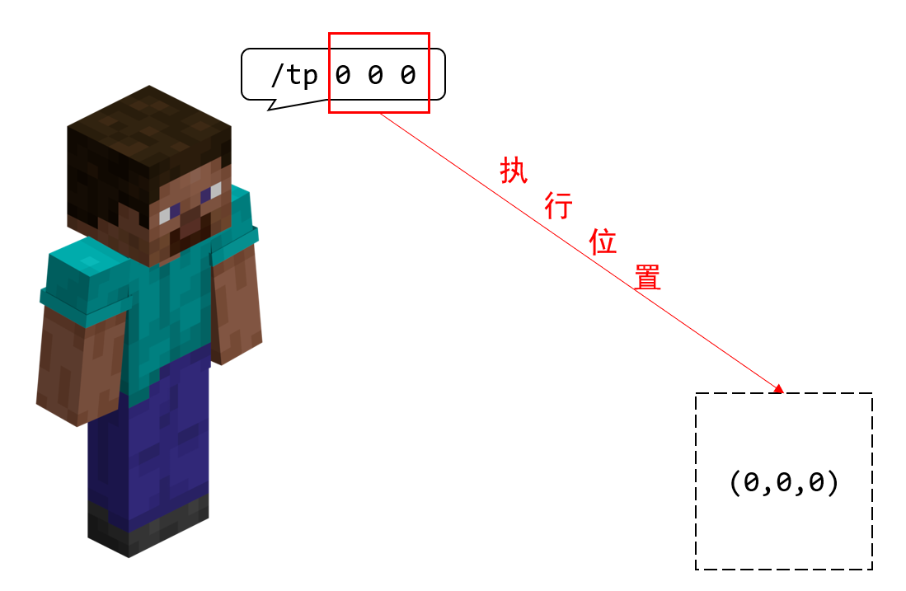

# 2.3 命令执行原理 `/execute`

在 2.1 中，我们看到`/execute`高居超高频命令之榜首。为什么这条命令如此重要？事实上，我们看到这条命令按照用途分类的标准是“执行其他命令”。看来这条命令需要依靠其他命令来发挥全部实力。

事实上，这条命令能够**修饰**一条命令的执行上下文，或者可以**用于检测条件是否成立**。Wiki 给出的定义如下：

> /execute 是各不同功能的子命令的集合，用于改变命令执行上下文（修饰子命令），执行逻辑判断（条件子命令），并在此基础上执行任意其他命令。

不过在介绍到此命令之前，我们需要首先说清，什么是“命令执行上下文”。

## 命令的执行者

如果你足够细心，可能已经发现我们已经用了很多次“执行者”这样的说辞。事实上，**执行者就是指，谁执行了这条命令**，严谨来说，**执行者是执行命令的主体**。

例如，同样的一条命令`/give @s apple`，Steve 执行的效果和 Alex 执行的效果明显是不同的。**很多命令中，执行者都是至关重要的，它们可能需要执行者作为自己执行的默认值**，比如`/gamemode`、`/kill`这些命令的`目标`参数的默认值都是`@s`，换句话讲，都是执行者自身。


我们很快就要了解到：`/execute`能够修改命令的执行者。例如让一只羊执行命令！


## 命令的执行位置

命令的执行位置也是很好理解的概念。**执行位置是指，这条命令在什么位置上执行**。严谨来说，它指代**执行命令的坐标**。

例如`/tp`、`/setblock`命令中，我们都指定了命令的执行位置为特定位置。比如`/tp 0 0 0`就是把命令的执行位置设置到了(0,0,0)位置上。



如果我们指定`/tp ~5~~`或者`/tp ^5^^`这样的命令，它们的执行位置是基于执行者的位置和朝向来确定的，也就是说，**相对坐标和局部坐标都要相对于执行者来确定执行位置**。所以，很多看似与执行者无关的命令（即那些没有`target`类型参数的命令），事实上也和执行者有关，因为坐标可能是与它们的位置相关的。


同样地，我们很快就要了解到：`/execute`能够修改命令的执行位置，例如在一只羊脚下执行命令。

## 命令的执行朝向

**命令的执行朝向，就是这条命令在什么朝向上执行**。可能一时之间你能想到的例子并不多——是的，实际上这个上下文的应用频率并没有那么高 *（但不代表不重要）*，主要用于`/tp`命令和局部坐标。

一般来说，如果不指定，**执行者的朝向，就是命令的默认执行朝向**。

同样地，`/execute`也可以更改执行朝向，这样它就将影响局部坐标的执行效果。

## 命令的执行维度

**命令的执行维度，就是这条命令在什么维度上执行**。

到目前为止，我们都还没有尝试过不同维度执行命令所带来的不同影响如何，但是简而言之，它可能会影响一些坐标的判定方法。你知道 Minecraft 目前有 3 种群系，主世界、下界和末地。比如我们在下界执行传送命令`/tp 0 64 0`，它会把你传送到下界对应位置，不会是主世界，也不会是末地，这是很显然的。

所以，凡是涉及到坐标的命令，都是在该执行维度下所选取的坐标。一般来说，**执行者处在哪个维度下，命令的默认执行维度就是这个维度**，我们再一次看到指定执行者的重要性。

是的，想必你已经猜到：`/execute`也可以更改执行维度。

## 命令执行上下文

我们刚刚介绍了执行命令的执行者和执行位置、朝向、维度的问题，并且所有命令都要根据这些信息去执行。我们说，上面的这些内容和执行权限等级、执行输出反馈一起，共同称作**命令执行上下文（Command Context）**。**上下文提供了一种执行环境，在特定环境下就将产生不同的执行效果**。其中，执行位置、朝向和维度统称为**执行环境参数**。

关于权限等级的问题，我们在讲到服务器命令的时候再细说；而关于输出反馈的问题，我们在第一章的时候则已经谈过一些，在第三章接触命令方块之后，我们还要了解更多有关输出反馈的事情。关于命令执行上下文，你可以参见[这篇 Wiki](https://zh.minecraft.wiki/w/命令上下文)。这样，我们通过了解命令执行上下文，就看到了命令执行背后的一些本质和原理，了解这些原理对于你理解`/execute`是至关重要的。

## 执行命令的命令：`/execute`

话现在说到这里，我们就该正式了解这个玩家圈子内所说的“高级命令”：`/execute`了。

`/execute`下面有非常非常多的命令，刚接触到的玩家看到下面这些东西一定会眼花缭乱：

```text title="/execute的语法" showLineNumbers
/execute <子命令: if|unless> block <位置: x y z> <方块: Block> <方块状态: block states> [子命令: ExecuteChainedOption_0]
/execute <子命令: if|unless> block <位置: x y z> <方块: Block> [子命令: ExecuteChainedOption_0]
/execute <子命令: if|unless> blocks <起点: x y z> <终点: x y z> <目标点: x y z> <扫描模式: all|masked> [子命令: ExecuteChainedOption_0]
/execute <子命令: if|unless> entity <目标: target> [子命令: ExecuteChainedOption_0]
/execute <子命令: if|unless> score <目标: target> <记分项: string> <操作方法: compare operator> <源目标: target> <记分项: string> [子命令: ExecuteChainedOption_0]
/execute <子命令: if|unless> score <目标: target> <记分项: string> matches <范围: integer range> [子命令: ExecuteChainedOption_0]
/execute align <坐标轴: string> <子命令: ExecuteChainedOption_0>
/execute anchored <eyes|feet> <子命令: ExecuteChainedOption_0>
/execute as <源目标: target> <子命令: ExecuteChainedOption_0>
/execute at <源目标: target> <子命令: ExecuteChainedOption_0>
/execute facing <位置: x y z> <子命令: ExecuteChainedOption_0>
/execute facing entity <源目标: target> <eyes|feet> <子命令: ExecuteChainedOption_0>
/execute in <维度: Dimension> <子命令: ExecuteChainedOption_0>
/execute positioned <位置: x y z> <子命令: ExecuteChainedOption_0>
/execute positioned as <源目标: target> <子命令: ExecuteChainedOption_0>
/execute rotated <y旋转: value> <x旋转: value> <子命令: ExecuteChainedOption_0>
/execute rotated as <源目标: target> <子命令: ExecuteChainedOption_0>
/execute run <命令: command>
```

天哪！这么多……18 条语法，怎么办呢？不要紧，我们来带你分析。

### 子命令

还记得 Wiki 一开始的定义吗？

> /execute 是各不同功能的子命令的集合，用于改变命令执行上下文（修饰子命令），执行逻辑判断（条件子命令），并在此基础上执行任意其他命令。

所以，这些语法拆开来看就是各式各样的**子命令（Subcommand）**。

首先，我们先关注`/execute`后面所跟的东西，那就是子命令。在基岩版，目前**一共有 11 条子命令**，分别是：`align`、`anchored`、`as`、`at`、`facing`、`in`、`positioned`、`rotated`、`if`、`unless`、`run`。换言之，我们这一节就是学习这 11 条子命令的。

接下来我们继续来看，除了`run`之外，每个语法后面都有一个`子命令: ExecuteChainedOption_0`，对吧？换句话说，这些子命令中除了`run`之外，我们可以把这些所有的语法统一写为

```text title="/execute的一般语法" showLineNumbers
execute <子命令> -> execute
```

这里的`-> execute`是 Java 版惯用的写法，基岩版写为`子命令: ExecuteChainedOption_0`，不过它太长了，所以**我们用`-> execute`，来表示这是下一个子命令的起点，本教程都将使用`-> execute`来指代`子命令: ExecuteChainedOption_0`**。

也就是说，**`/execute`是允许子命令嵌套下去的**。例如`/execute as @a if entity @e[name=a]`，就是在`at`的子命令结束后接上了一个`if`子命令，而`if`子命令还可以再接下去。

这么多的子命令，可以分为 3 类：**修饰子命令、条件子命令、`run`子命令**。除`run`、`if`、`unless`外，其他的所有子命令都是修饰子命令。

如你所见：

- 所有的修饰子命令的`-> execute`都是必选参数；
- 所有的条件子命令的`-> execute`都是可选参数；
- `run`不以`-> execute`为结尾。

这也就是说，**`/execute`必须以条件子命令或`run`子命令收尾**。如果不这么做，也就是以修饰子命令为结尾，将会导致语法错误，因为修饰子命令的`-> execute`是必选参数。

### 修饰子命令和`run`子命令

刚刚你已经了解了命令执行原理，知道命令的执行效果是根据执行环境而定的，而**修饰子命令就可以修改这些环境**。在前面我们提到，**修饰子命令能够修改执行者和执行环境参数（也就是执行位置、执行朝向和执行维度）**。

**修改了这些上下文之后，就由`run`来负责把这些上下文信息传递给一般的命令**。例如，修饰子命令在修改了执行者为羊后，再执行`tp @s 0 0 0`，就把执行者从玩家改成了羊，这条命令所传送的实体也就变成了羊。

我们刚刚说：子命令是可以嵌套的。那么 Minecraft 读取一条嵌套很长的`/execute`是如何读取的呢？事实上，不光是`run`，其实后面的子命令也受到修饰子命令的影响。举一个例子，对于命令`/execute (子命令1) (子命令2) ...`来说，`子命令1`修改的信息也会影响`子命令2`的判断，所以**读一条`/execute`命令应该从左往右读**。这也就导致，`/execute (子命令1) (子命令2) ...`和`/execute (子命令2) (子命令1) ...`的执行效果往往不一样。

接下来，我们开始逐个突破，教你学会使用这些神奇的子命令。

### 更改执行者的子命令：`as`

`as`是一条更改执行者的子命令。它的语法为

```text title="/execute as的语法" showLineNumbers
as <源目标: target> -> execute
```

**更改命令执行者为`源目标`**。相信了解了上下文机制的你，对此已经不会认为这是难点了。我们来做个实验吧！

:::tip[实验 2.3-1]

分别执行`/tp @s 0 -60 0`和`/execute as @e[type=sheep] run tp @s 0 -60 0`。观察效果，你会立刻发现`as @e[type=sheep]`的作用。

:::

执行`/tp @s 0 -60 0`之后，将你传送到了(0,-60,0)，你对这命令已不陌生。

而执行`/execute as @e[type=sheep] run tp @s 0 -60 0`，从左往右读，我们看到执行者改成了所有的羊，然后再执行*将所有执行者传送到(0,-60,0)的命令*，所以，这就会导致将所有的羊传送到(0,-60,0)。

我们用下面这张图来反映这个子命令究竟做了什么：


不过！这张图有一点并没有说清楚……这张图似乎隐晦地传达了一个信息：难道更改执行者就会把执行位置、执行朝向和执行维度全部改过去吗？事实上，这种想法是错误的。何以见得？我们来做下一个实验，你就会看到这点。

:::tip[实验 2.3-2]

执行`/execute as @e[type=sheep] run tp @a ~~~`。

如果`as`更改了执行位置，玩家应当传送到羊的身上，反之玩家的位置则不动（因为执行位置默认为玩家的位置）。

:::

实验结果如下图：


看来，结果是显然的：**`as`更改且仅更改执行者**。换言之，**执行环境参数不受影响**，这张图的更完整的画法应当为：


我们着重强调这点，就是为了提醒你：务必注意这些子命令都会更改什么上下文，以及它们可能会带来什么影响，不会带来什么影响。尤其对于`as`，因为它不改变执行位置，很多开发者会错误地认为它更改了执行者之后，就认为是该实体完全执行此命令，隐晦地认为这条命令更改执行位置（哪怕他们明确地知道这条命令不更改执行位置），这是不正确的。

### 更改执行位置、朝向、维度的子命令：`at`

`at`会完全改变命令的执行环境参数。它的语法是：

```text title="/execute at的语法" showLineNumbers
at <源目标: target> -> execute
```

### 更改执行位置的子命令：`positioned`、`align`、`anchored`

### 更改执行朝向的子命令：`facing`、`rotated`

### 更改执行维度的子命令：`in`

### 条件子命令

此外，`/execute`还可以进行条件检测与判断，这就叫做**条件子命令**。

### 检测实体的子命令：`if entity`

### 检测方块的子命令：`if block`

### 检测区域的子命令：`if blocks`

## 旧版的`/execute`
