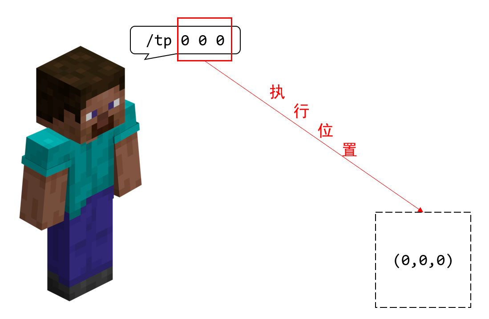
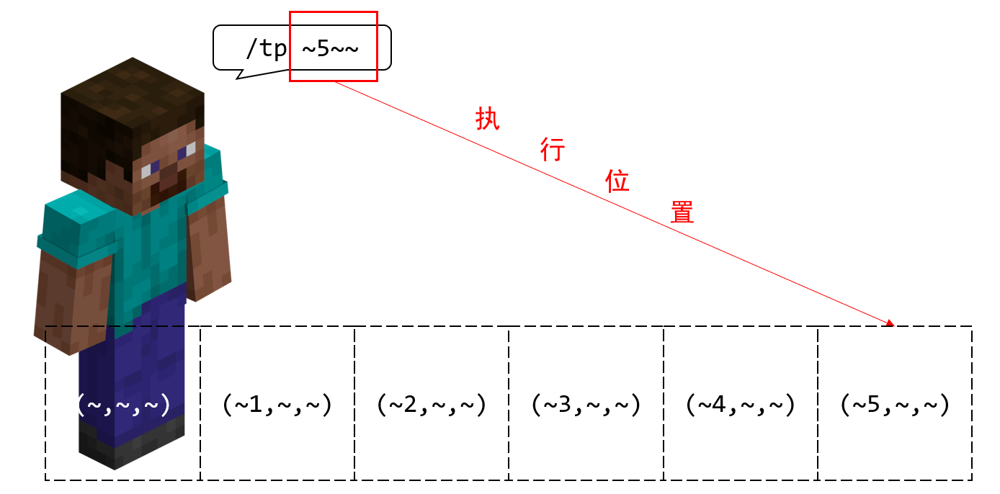

# 2.3.1 命令上下文

在 2.1 中，我们看到`/execute`高居超高频命令之榜首。为什么这条命令如此重要？我们看到这条命令按照用途分类的标准是“执行其他命令”。看来这条命令需要依靠其他命令来发挥全部实力。

事实上，这条命令能够**修饰**一条命令的执行上下文，或者可以**用于检测条件是否成立**。Wiki 给出的定义如下：

> /execute 是各不同功能的子命令的集合，用于改变命令上下文（修饰子命令），执行逻辑判断（条件子命令），并在此基础上执行任意其他命令。

不过在介绍到此命令之前，我们需要首先说清，什么是“命令上下文”。

---

## 命令的执行者

如果你足够细心，可能已经发现我们已经用了很多次“执行者”这样的说辞。其实，**执行者就是指，谁执行了这条命令**，严谨来说，**执行者是执行命令的主体**。

例如，同样的一条命令`/give @s apple`，Steve 执行的效果和 Alex 执行的效果明显是不同的。**很多命令中，执行者都是至关重要的，它们可能需要执行者作为自己执行的默认值**，比如`/gamemode`、`/kill`这些命令的`目标`参数的默认值都是`@s`，换句话讲，都是执行者自身。

我们很快就要了解到：`/execute`能够修改命令的执行者。例如让一只羊执行命令！

---

## 命令的执行位置

命令的执行位置也是很好理解的概念。**执行位置是指，这条命令在什么位置上执行**。严谨来说，它指代**执行命令的坐标**。

例如`/tp`、`/setblock`命令中，我们都指定了命令的执行位置为特定位置。比如`/tp 0 0 0`就是把命令的执行位置设置到了(0,0,0)位置上。

如果我们指定`/tp ~5~~`或者`/tp ^5^^`这样的命令，它们的执行位置是基于执行者的位置和朝向来确定的，也就是说，**相对坐标和局部坐标都要相对于执行者来确定执行位置**。所以，很多看似与执行者无关的命令（即那些没有`target`类型参数的命令），事实上也和执行者有关，因为坐标可能是与它们的位置相关的。

同样地，我们很快就要了解到：`/execute`能够修改命令的执行位置，例如在一只羊脚下执行命令。

---

## 命令的执行朝向

**命令的执行朝向，就是这条命令在什么朝向上执行**。可能一时之间你能想到的例子并不多——是的，实际上这个上下文的应用频率并没有那么高 *（但不代表不重要）*，主要用于`/tp`命令和局部坐标。

一般来说，如果不指定，**执行者的朝向，就是命令的默认执行朝向**。

同样地，`/execute`也可以更改执行朝向，这样它就将影响局部坐标的执行效果。

---

## 命令的执行维度

**命令的执行维度，就是这条命令在什么维度上执行**。

到目前为止，我们都还没有尝试过不同维度执行命令所带来的不同影响如何，但是简而言之，它可能会影响一些坐标的判定方法。你知道 Minecraft 目前有 3 种群系，主世界、下界和末地。比如我们在下界执行传送命令`/tp 0 64 0`，它会把你传送到下界对应位置，不会是主世界，也不会是末地，这是很显然的。

所以，凡是涉及到坐标的命令，都是在该执行维度下所选取的坐标。一般来说，**执行者处在哪个维度下，命令的默认执行维度就是这个维度**，我们再一次看到指定执行者的重要性。

是的，想必你已经猜到：`/execute`也可以更改执行维度。

---

## 命令上下文

我们刚刚介绍了执行命令的执行者和执行位置、朝向、维度的问题，并且所有命令都要根据这些信息去执行。我们说，上面的这些内容和执行权限等级、执行输出反馈一起，共同称作**命令上下文（Command Context）**。**上下文提供了一种执行环境，在特定环境下就将产生不同的执行效果**。其中，执行位置、朝向和维度统称为**执行环境参数**。

关于权限等级的问题，我们在讲到服务器命令的时候再细说；而关于输出反馈的问题，我们在第一章的时候则已经谈过一些，在第三章接触命令方块之后，我们还要了解更多有关输出反馈的事情。关于命令上下文，你可以参见[这篇 Wiki](https://zh.minecraft.wiki/w/命令上下文)。这样，我们通过了解命令上下文，就看到了命令执行背后的一些本质和原理，了解这些原理对于你理解`/execute`是至关重要的。

---

## 总结

- 命令上下文提供了命令执行所需的环境。在不同环境下，哪怕执行相同的命令，往往也产生不同的执行效果。
- 命令上下文的分类：
  - 执行权限等级
  - 执行输出反馈
  - 执行者：执行命令的主体。
  - 执行环境参数
    - 执行位置：执行命令的坐标。涉及到相对和局部坐标时，和执行者的位置会有关系。默认为执行者的位置。
    - 执行朝向：执行命令的朝向。涉及到局部坐标时，和执行者的朝向会有关系。默认为执行者的朝向。
    - 执行维度：执行命令的维度。和执行者的维度会有关系。默认为执行者的维度。
- `/execute`能够更改执行者和执行环境参数。
