# 2.4.3 记分板的记分项操作命令

在上一节，我们已经认识到记分板由 3 个要素组成：记分项、追踪对象和分值。我们还知道，要描述一个追踪对象的分数，必须以一个记分项为前提。那么如何添加或修改一个记分项呢？我们这一节就来学习一下记分项相关的操作命令。

---

## 命令`/scoreboard`

在正式学习记分项相关的操作命令之前，我们当然要先认识一下记分板命令啦！它的语法如下：

```mcfunction title="/scoreboard的语法" showLineNumbers {1-5}
/scoreboard objectives add <记分项: string> dummy [显示名称: string]
/scoreboard objectives list
/scoreboard objectives remove <记分项: string>
/scoreboard objectives setdisplay <list|sidebar> [记分项: string] [ascending|descending]
/scoreboard objectives setdisplay belowname [记分项: string]
/scoreboard players <set|add|remove> <玩家: target> <记分项: string> <数值: int>
/scoreboard players list [玩家名称: target]
/scoreboard players operation <目标名称: target> <目标记分板: string> <操作: operator> <选择器: target> <记分项: string>
/scoreboard players random <玩家: target> <记分项: string> <最小值: int> <最大值: int>
/scoreboard players reset <玩家: target> [记分项: string]
/scoreboard players test <玩家: target> <记分项: string> <最小值: wildcard int> [最大值: wildcard int]
```

呃啊啊……这个看起来可比`/tag`复杂多了！但你并不用感到“头大”，我们还是像分析`/execute`命令时分析一下这些命令，抓住它们的共同点。

我们看到，上面的语法中，高亮的部分的第一个参数是`objectives`，这些就是**记分项操作命令**；而第一个参数为`players`的命令，就是**玩家操作命令**。在本节，我们重点分析高亮的这 5 条命令，而剩下的 6 条命令则留到下一节去介绍。

接下来关注这 5 条记分项操作命令的第二个参数，让我们来看看这 5 条命令都能做什么。分类一下就不难发现下面的 4 个用途：

- `add`：**添加记分项**。
- `remove`：**移除记分项**。
- `setdisplay`：**显示记分项**。
- `list`：**列举所有记分项**。

其中，前三条在实际工程中都有很重要的用途，我们来依次分析。

---

## 添加记分项

显然，要使用记分板，我们必须添加一个记分板。添加记分板的命令就是用下面的命令：

```mcfunction showLineNumbers
/scoreboard objectives add <记分项: string> dummy [显示名称: string]
```

它代表：**添加一个名为`记分项`并显示为`显示名称`的记分板**。

其中，记分项是一个字符串。前面强调过，在命令中的字符串可以不必加引号，除非出现了诸如斜杠或空格的特殊字符。

> 在基岩版中，必须为一个完整的单词，不能为数字（允许的字符：`-`, `:`, `.`, `_`、`A`-`Z`、`a`-`z`和`0`-`9`）或一个被双引号包围的字符串。[^1]

[^1]: [命令/scoreboard - 中文 Minecraft Wiki](https://zh.minecraft.wiki/w/命令/scoreboard)

现在我们来试着添加一个记分板吧！

:::tip[实验 2.4-3]

执行命令`/scoreboard objectives add test dummy`。注意`dummy`是必选参数，不要丢下！

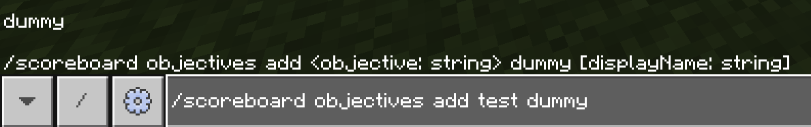

:::

执行该命令之后，系统提示我们`已成功添加新记分项“test”`。这样，我们就拥有了一个名为`test`的记分项了！

而`显示名称`又是怎么一回事呢？先别急，容我卖个关子，你马上就会看到它的用途。

这里需要注意，一个已经存在的记分项是不能被重复创建的，命令将会报错：

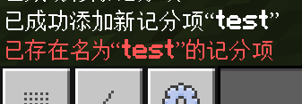

### 为`记分项`命名的规范

在创建记分项的时候，我们还需要注意，因为几乎所有记分板命令都需要指定记分项，**所以`记分项`的命名应当简单且直观**，以便在后续频繁调用时能够简化工作，并提升命令的易读性。例如，如果要*创建一个底层数据的记分项*，我们这里提供一些命名指导参考：

| 这么做✔️ | 不要这么做❌ | 看个人喜好❔ |
| :---: | :---: | :---: |
| 单个的英文单词：`data`<br/>不仅足够简单，而且足够直观 | 单个字母：`a`<br/>虽然简单，但是第一眼看到这个记分项无法把它从“底层数据”这方面去联想。 | 中文：`数据`<br/>虽然足够直观，但是中文等除列出的字符之外终归容易出问题，而且还要切换输入法，打字并不方便，而且其他地方的调用也不容易 |
| 驼峰命名法：`mainData`<br/>适用于多个单词的记分项名称 | 中文拼音：`shujv`<br/>中文拼音经常对应多个词汇，例如书局、属具、书据，尤其对应的词汇过多时，可读性将会变得极差 | 乱码：`hhafajfan`<br/>这种乱码式记分项名虽然完全牺牲易读性和易操作性，却常常能够有效地阻止玩家篡改底层数据，例如 15 周年地图中就使用了这种混淆技术 |
| 下划线命名法：`main_data`<br/>适用于多个单词的记分项名称 | 中文拼音简写：`sj`<br/>同上，只是会变得更难对应，易读性变得更差 —— 无论如何，**绝对不要这么做**！ | |
| | 带空格的英文单词：`main data`<br/>在调用记分板时，这么做将会变得很难调用，必须带上双引号 | |

在本教程系列和其他文档中，首选的记分项命名方式为驼峰命名法（包括单个的英文单词）。

:::note[扩展：`dummy`是什么？]

在 Java 版的同名命令中，这第 4 个参数不止可以填写为`dummy`，事实上它能填写的东西甚至五花八门，用鼠标划半天都划不到头。

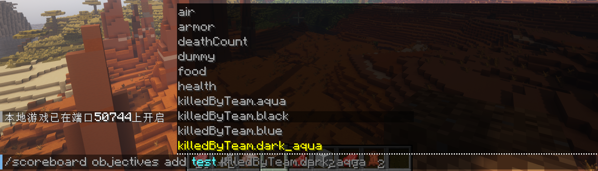

这个参数，叫做**准则（Criteria）**。准则决定了这个记分板如何追踪玩家和实体的分数。例如，`deathCount`准则可以追踪玩家的死亡次数、`totalKillCount`准则可以追踪玩家杀死了多少实体、`health`准则追踪玩家的血量等等。[^2]

[^2]: [记分板#准则 - 中文 Minecraft Wiki](https://zh.minecraft.wiki/w/记分板#准则)

其中，`dummy`被称为**虚拟准则**，这是一种只能通过`/scoreboard`命令才能控制分值的准则，而不会因为其他的环境变化而发生变化。遗憾的是，基岩版自 1.7（2018 年）更新记分板以来直到今天，仍然只支持虚拟准则。

:::

---

## 显示记分项

我们先来介绍如何显示记分项。显示记分项需要用到`setdisplay`的语法：

```mcfunction showLineNumbers
/scoreboard objectives setdisplay <list|sidebar> [记分项: string] [ascending|descending]
/scoreboard objectives setdisplay belowname [记分项: string]
```

虽然有两条语法，但总结起来，它的第 3 个参数无非指代的是可显示的位置，而第 5 个参数就不能对`belowname`位置生效了。这样，我们便得到这两条命令的含义：**将`记分项`按照分数高低降序（`descending`）或升序（`ascending`）显示到`显示位置`（包括玩家列表`list`、侧边栏`sidebar`和玩家名下方`belowname`）上**。

话不多说，我们先来试试一种最经典的记分板显示位置：侧边栏吧！这也是最常用的显示位置。

:::tip[实验 2.4-4]

执行命令`/scoreboard objectives setdisplay sidebar test`。

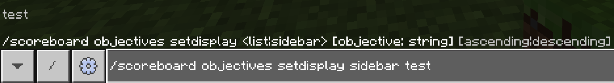

:::

最后，它将把`test`显示在你的屏幕右侧：

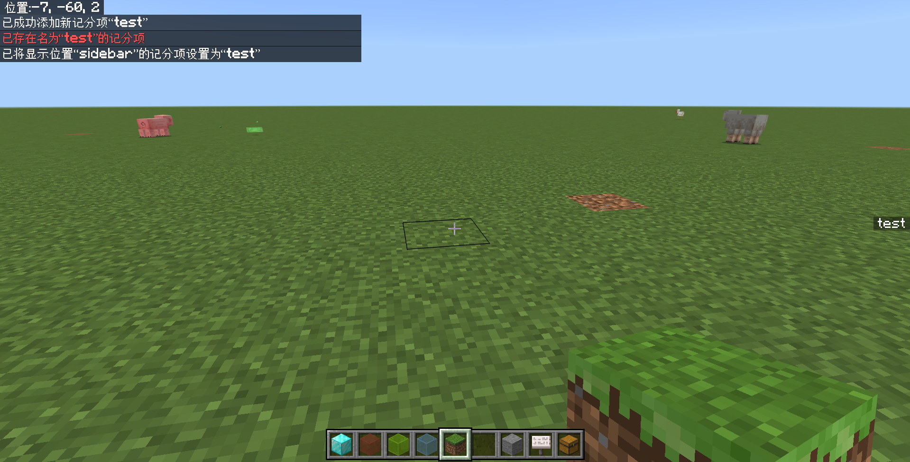

然而，它现在因为没有追踪任何玩家或实体的分数，所以只是很单调地显示一个 test。

### 升序和降序

如果为 test 记分项添加一些分数，你就能看到升序或降序所带来的影响。至于如何添加分数，在下一节我们将会学习到。

- 降序（`descending`）（默认参数）：分数从高到低排列。

  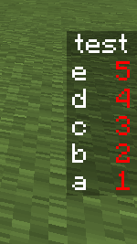

- 升序（`ascending`）：分数从低到高排列。

  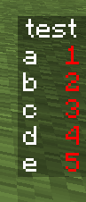

### 显示在不同位置的效果

刚刚我们已经看到了记分板在侧边栏显示的效果。现在我们来看看另外两种显示位置的效果吧。

- 玩家列表（`list`），它会把分数排名写在前面，并在右下角显示分数。

  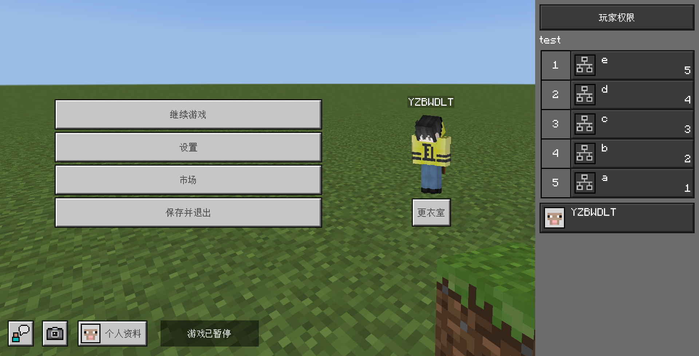

- 玩家名下方（`belowname`，Below Name），它会把分数和记分板名称显示在玩家名牌的下方。也就是说，**只有实际玩家的分数会显示出来，而实体和假名的分数则都无法显示**。

  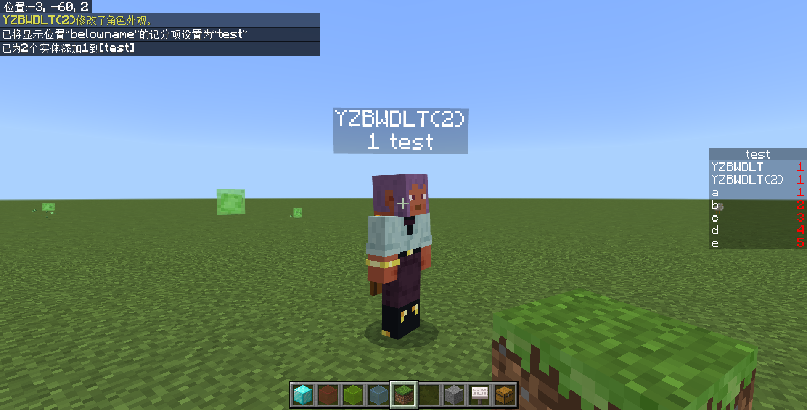

### `显示名称`的效果

你可能现在已经产生了一个疑惑——既然我们只推荐驼峰命名法和下划线命名法命名`记分项`，那么那些服务器标题的名称不都是不符合我们提出的规范的吗？比如“Bed Wars”、“起床战争”这种，都不属于我们列出的“这么做✔️”啊？事实上，它们并不是将`记分项`命名为了“数据”，而是在一开始添加记分板的时候就指定了这个记分板的**显示名称**。

:::tip[实验 2.4-5]

执行两条命令：

- 先创建一个数据记分板：`/scoreboard objectives add data dummy "数据"`
- 然后将它显示在右侧的侧边栏上：`/scoreboard objectives setdisplay sidebar data`

:::

看，这样就可以保证记分项`data`显示为“数据”：

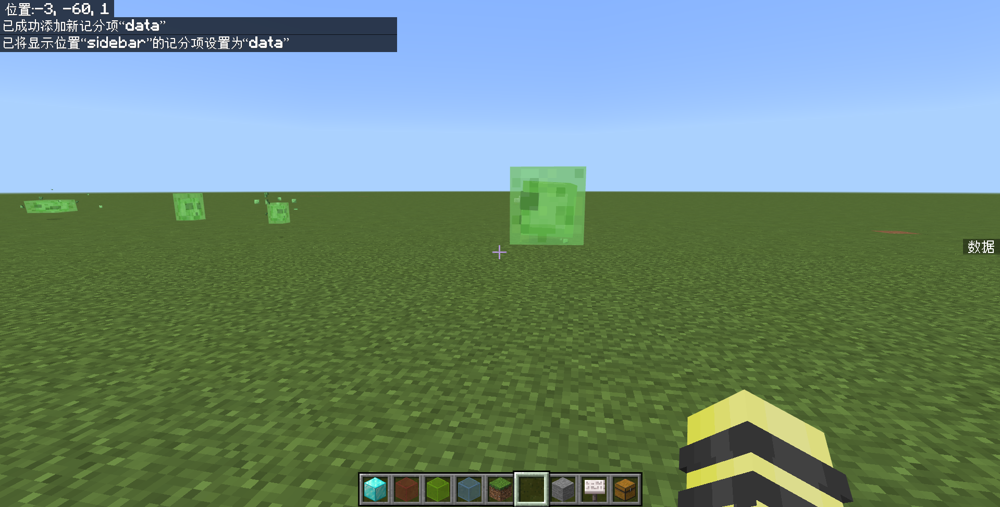

这就是能同时保证`记分项`简洁的同时还能保证显示名称符合要求的“秘诀”，只是一个参数的事。然而，一些经验相对丰富的开发者不知道这回事的情况也并不鲜见。

### 清空原有的显示位置

有时候，我们调出记分板只是为了调试，毕竟并不是所有情况都要把记分板显示出来的，调试完了之后还要隐藏回去。

遇到这种需求，并不需要移除记分板再重新创建，那很麻烦。我们注意到，`[记分项: string]`是一个可选参数，如果不写会发生什么呢？

:::tip[实验 2.4-8]

执行命令`/scoreboard objectives setdisplay sidebar`。观察侧边栏的记分板的变化。

:::

执行此命令后，游戏返回`已清除记分项显示位置“sidebar”`。显然，只要不指定要显示的记分项，就等同于隐藏对应的显示位置。

---

## 移除记分项

移除记分项就更简单了，我们直接来看语法：

```mcfunction showLineNumbers
/scoreboard objectives remove <记分项: string>
```

这条命令将移除`记分项`。例如，`/scoreboard objectives remove test`将移除`test`记分项。很简单吧！

---

## 列举记分项

使用下面的命令，就直接列举出所有记分项的信息：

```mcfunction showLineNumbers
/scoreboard objectives list
```

这条命令将在聊天栏返回所有记分项的显示名称和准则。显然，基岩版的准则全是`dummy`。此外，没有指定`显示名称`的记分项，显示名称就默认变成了记分项的名称。当然，我们还是那句话：建议你在创建记分板时事先指定一个另外的显示名称，不要用记分项来做显示名称。

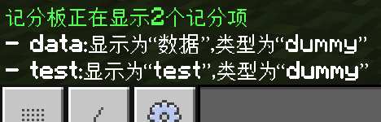

---

## 总结与练习

本节，我们学习了操作记分项的 5 条命令。现在让我们一起来回顾一下：

- 记分板命令`/scoreboard`一共有 11 条语法。
  - 第一个参数为`objectives`的为记分项操作命令。
  - 第一个参数为`players`的为玩家操作命令。
- 记分项操作命令如下表所示：

| 命令 | 含义 | 备注 |
| --- | --- | --- |
| `/scoreboard objectives add <记分项: string> dummy [显示名称: string]` | 添加显示为`显示名称`的`记分项`记分项 | |
| `/scoreboard objectives remove <记分项: string>` | 移除`记分项`记分项 | |
| `/scoreboard objectives setdisplay <list\|sidebar> [记分项: string] [ascending\|descending]` | 在玩家列表（`list`）或侧边栏（`sidebar`）按升序（`ascending`）或降序（`descending`，默认）显示`记分项`记分项 | `记分项`为空时，清空对应显示位置 |
| `/scoreboard objectives setdisplay belowname [记分项: string]` | 在玩家名牌下显示`记分项`记分项 | 只能显示真实玩家的分数 |
| `/scoreboard objectives list` | 在聊天栏列举所有记分项的信息 | |

- 在创建记分项时，需要注意`记分项`为了不影响正常运行和便于后续大量调用，命名应当采用驼峰命名法（例：`isOnline`）或下划线命名法（例：`is_online`），除非有必要使用其他方法命名。
  - 本教程系列，记分项均采用驼峰命名法。

:::info[练习 2.4-2]

1. 创建一个显示名为“时间数据”的记分项，采用驼峰命名法命名`记分项`。可以考虑“Time”、“Time Data”等字眼。
2. 在上一题的基础上，将这个记分项显示到屏幕右侧的侧边栏上。
3. 在上一题的基础上，移除这个记分项。

:::
