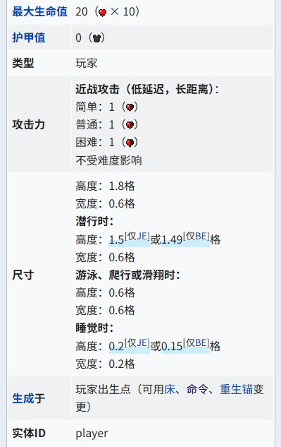

# 2.4.5 记分板的运用 变量

在前面的内容中，我们已经学习了标签命令`/tag`和记分板命令`/scoreboard`。但是，这两个东西有什么用呢？我们在这一节，就来介绍如何检测分数，综合应用这些基本工具，并引入*变量*的概念。

## 检查分数的常用方法

我们在上一节简单了解了一下检测分数的命令`/scoreboard players test`，但是该命令只能检测而不能执行命令，所以在上一节中我们只将其列为了扩展内容。那么，实际工程中我们是如何检查分数的呢？

### 目标选择器参数`scores`

现在我们来了解一下这个新的目标选择器参数`scores`。它的语法如下：

```text
scores={<记分项: string>=<值: integer range>,...}
```

**它将筛选出在`记分项`上的分数在`值`内的实体**。`记分项`我们已经十分熟知，但`值`我们似乎还从来没见过，尤其是它的类型`integer range`。

其实，`integer range`非常简单。它既可以代表一个特定的值，也可以代表一个数值范围。

- **如果要指定一个具体的值，就直接写为这个值**。
  - 例如，指定分数为 1 分，就写为`1`。
- **如果要指定为范围，它的格式是`最小值..最大值`，并且含两端**。
  - 例如，指定分数范围在 1~5 分之内，就写为`1..5`。注意：中间是 2 个点哦！不要写为 3 个点。
  - 如果只想指定大于等于 1 分，那么可以不写最大值，直接写为`1..`。
  - 同样地，指定小于等于 5 分，可以不写最小值，直接写为`..5`。
- **`integer range`还支持反选，只需要在其最前面加上一个`!`即可**。
  - 例如，如果指定分数不在 1~5 分之内，就写为`!1..5`。
  - 如果分数不为 1 分，就写为`!1`。

我们在后面还会见到这个`integer range`类型，例如马上要提到的`execute if score`和之后要提到的`hasitem`的扩展。

:::tip[实验 2.4-18]

执行命令`/scoreboard players set @s data 5`，然后执行`/execute if entity @s[scores={data=1..10}]`。如上文所说，这条命令将检查执行者是否在`data`上拥有 1~10 分（取两端）。

然后，先执行`/scoreboard players set @s data 15`，再检查一次`/execute if entity @s[scores={data=1..10}]`。这时，这条命令就将检测失败。

:::info[思考 2.4-1]

这时执行`/execute if entity @s[scores={data=!10..}]`是执行成功还是失败？试分析之并在游戏内验证。

:::

而`...`则代表着，它可以同时检查一个实体的多个记分板上的分数是否符合条件。例如，查找`foo.@s`∈[5,10]并且`bar.@s`∉[3,+∞)的实体，就可以表示为

```mcfunction
/execute if entity @e[scores={foo=5..10,bar=!3..}]
```

### `/execute`的子命令`if score`

刚刚的`scores`目标选择器参数，虽然表达简洁易懂，也很好用，沾上目标选择器的命令就都能用，但是**它有一个致命缺陷——无法指定假名**。还是老问题：因为假名并不是真实存在的实体，所以不能用目标选择器指代。

这时，就该让我们的`/execute`登场啦！`/execute`有一条子命令`if score`可以处理这样的问题：

```text title="/execute if|unless score的语法" showLineNumbers
<if|unless> score <目标: target> <记分项: string> <操作方法: compare operator> <源目标: target> <记分项: string> -> execute
<if|unless> score <目标: target> <记分项: string> matches <范围: integer range> -> execute
```

我们先关注第一条语法。它表示，**当`目标`在其`记分项`上的分数和`源目标`在其`记分项`上的分数经过`操作方法`比较成立后，则检测通过**。

你是否还记得我们上一节曾讲过的`/scoreboard players operation`？那里也涉及到一个很类似的`操作`，而且也是左边的分数和右边的分数进行对比。但是，这里终究不完全一样，因为`/scoreboard players operation`的`操作`是`operator`类型，每个运算符都进行了赋值的操作；而这里是`compare operator`类型，代表它只进行对比而不赋值。其接受的运算符，就是典型的比较符号了：大于等于`>=`、小于等于`<=`、大于`>`、小于`<`、等于`=`。

:::tip[实验 2.4-19]

依次执行下面的命令。

```mcfunction
/scoreboard players set x data 100
/scoreboard players set y data 5
/execute if score x data >= y data
```

这 3 条命令中，前两条用来定义`data.x`和`data.y`，最后这条则是比较`data.x`是否大于等于`data.y`。显然，这条命令的条件检测一定会通过。

你可以变换一下其中的`操作方法`和`data.x`、`data.y`两个值，体验`/execute if score`的比较大小用法。

:::

而第二个语法，则是我们直接把`/scoreboard players test`打为“扩展内容”的直接原因。它表示，**当`目标`在`记分项`上的分数满足`范围`条件时，则检测通过**。看，`integer range`又回来了！

:::tip[实验 2.4-20]

在实验 2.4-19 的基础上，分别执行下面的几条命令，观察执行效果。注意：实践时很多开发者常常丢`matches`，不要忘了哦！

```mcfunction showLineNumbers
/execute if score x data matches 1..
/execute if score x data matches ..10
/execute if score x data matches 1..10
/execute if score x data matches !1..10
/execute if score x data matches 100
```

:::

因为在实验 2.4-19 中，定义了`data.x`=`100`，所以：

- 第一条命令执行成功，因为 100>1 成立；
- 第二条命令执行失败，因为 100\<10 不成立；
- 第三条命令执行失败，因为 1\<100\<10 不成立；
- 第四条命令执行成功，因为 1\<100\<10 不成立（注意有一个`!`）；
- 第五条命令执行成功，因为 100=100 成立。

显然，`/execute if score x data matches !1..10`和`/execute unless score x data matches 1..10`也是等价的。具体采用哪种写法，就看你的个人风格了。

基本上，可以认为`/execute if score`是目标选择器`scores`的扩展版，因为它支持假名。同时，你还可以认为`/execute if score`是`/scoreboard players test`的扩展版，因为它不仅完全支持特定范围的检测，还支持比较两个分数的大小关系，并且还能够在条件通过后继续执行命令。

总体来说，**`scores`目标选择器参数和`/execute if score`都是极为常用的检测分值的方法**。

:::info[思考 2.4-2]

你可以只用`/scoreboard players operation`命令，完成两个分数的大小比较吗？比如，当`data.x`>`data.y`时，执行命令`/say 1`，但是不能用`/execute if score x data > y data`去检测！

:::

## 记分板的运用实例

可能你会问：既然记分板和标签的添加，对实体、对世界不会有任何影响，那么我们要这两样东西究竟有什么用呢？别忘了，我们引入标签和记分板的目的只有一个——**标记**！我们会按照我们自己的需求进行变量的定义和标记，这对于我们条件性地执行命令是有很大意义的。

现在，我们就几个常见的应用场景和疑难问题进行一些思路分享，这对你未来在项目中的实战也许会有很大的帮助。

### 抽奖机

现在假设我们要做一个抽奖机，投入一颗绿宝石后，有 95% 的概率给予一组泥土，还有 5% 的概率给予 10 颗钻石。

显然，对于这种概率和随机事件，使用`/scoreboard players random`是最好不过的选择了。我们可以在 1\~100 之间随机一个数字，当这个数字为 1\~95 的时候就给予泥土，当数字为 96\~100 的时候就给予钻石，这便是基本思路了。

顺着这个基本思路，我们便写出下面的命令：

```mcfunction showLineNumbers
scoreboard players random lottery data 1 100
execute if score lottery data matches 1..95 run give @p dirt 64
execute if score lottery data matches 96..100 run give @p diamond 10
```

接下来有什么优化空间呢？首先要求得投入一颗绿宝石，但直接一开始就贸然清理绿宝石固然不是个好选择，除非使用条件制约型命令方块（检查是否成功执行了命令的一种执行命令的方块），否则是否清除了物品很难界定。既然如此，我们不妨换个思路，比如检查附近玩家是否拥有绿宝石？检查到之后就先执行抽奖的命令，然后再清除绿宝石也未尝不可嘛。这样，我们就能写出改进后的命令：

```mcfunction showLineNumbers
execute as @p if entity @s[hasitem={item=emerald}] run scoreboard players random lottery data 1 100
execute as @p if entity @s[hasitem={item=emerald}] if score lottery data matches 1..95 run give @s dirt 64
execute as @p if entity @s[hasitem={item=emerald}] if score lottery data matches 96..100 run give @s diamond 10
execute as @p if entity @s[hasitem={item=emerald}] run clear @s emerald
```

基本上，就是给每条命令都加上一个拥有绿宝石的最近玩家的前提。但是，这么写未免也太冗长了！我们可以借助标签来再进行一下简化：

```mcfunction showLineNumbers
execute as @p if entity @s[hasitem={item=emerald}] run tag @s add lottery
execute as @p[tag=lottery] run scoreboard players random lottery data 1 100
execute as @p[tag=lottery] if score lottery data matches 1..95 run give @s dirt 64
execute as @p[tag=lottery] if score lottery data matches 96..100 run give @s diamond 10
execute as @p[tag=lottery] run clear @s emerald
tag @a remove lottery
```

这样，就形成了一套逻辑相对完整又易读的命令系统了。

### 实现随机的对话

在一些地图中常常能看见一些 NPC 的随机对话。怎么实现呢？显然，这种情况也是非`/scoreboard players random`不可。

我们现在假设有一种自定义的 NPC（ID 为`custom:npc`），右键交互后便获得`talking`标签（这确是可实现的，在模块 3 中你就看到它的实现方法）。现在，我们就来基于这些条件实现随机的对话吧！

我们可以在检测到有`talking`标签的 NPC 时，让这些 NPC 使用`/scoreboard players random`随机几种情况，使他们对玩家说话，说完话之后再移除`talking`标签，为下次的右键做好准备。

```mcfunction showLineNumbers
## 指定要随机说哪句话
execute as @e[type=custom:npc,tag=talking] run scoreboard players random @s data 1 5
## 按照data.@s的数据对玩家说话
execute as @e[type=custom:npc,tag=talking] if score @s data matches 1 run say 你好呀~
execute as @e[type=custom:npc,tag=talking] if score @s data matches 2 run say 好久不见！
execute as @e[type=custom:npc,tag=talking] if score @s data matches 3 run say 欢迎！
execute as @e[type=custom:npc,tag=talking] if score @s data matches 4 run say 有空常来哦~
execute as @e[type=custom:npc,tag=talking] if score @s data matches 5 run say Hello!
## 移除标签和随机数据
execute as @e[type=custom:npc] run tag @e remove talking
execute as @e[type=custom:npc] run scoreboard players reset @s data
```

事实上，这正是地图《触发》中，与 NPC 交互的基本原理，只是其中执行的具体内容和上文所列举的有若干差异。

### 检测站立、潜行、爬行和睡觉的玩家

假设现在我们在做一个难度很高的跑酷游戏，禁止玩家潜行，否则将其传送回出生点。检测潜行怎么做呢？我们可以从 1.20.10 加入的潜行高度上入手。玩家在站立时的高度是 1.8 格，而潜行时的高度仅为 1.5 格。也就是说，只要我们能够抓住这个高度变化，就能够检测到玩家潜行了。



这不由得让我们想起目标选择器，因为基本上只有它能在不依靠任何外部环境的情况下做检测。而检测位置的参数，主要有`x`、`y`、`z`、`dx`、`dy`、`dz`、`r`和`rm`，而这些都是**判定碰撞箱是否和检测区域重叠**。利用这些，我们就可以考虑从玩家的位置开始，在 1.6 格高度处看能不能检测到这个玩家的碰撞箱，如果检测得到，那么玩家必定处于站立状态下，为站立玩家添加`isStanding`标签，否则就不处于站立状态，没有`isStanding`标签。用命令来写，就是：

```mcfunction showLineNumbers
tag @a remove isStanding
execute as @a at @s if entity @s[y=~1.6,dy=0.1] run tag @s add isStanding
```

但是，这么做只能检测

### 记分板商店

### 计时器

### 处理“玩家下线”问题

### 处理多人游戏下退出重进的玩家的问题

### 补偿准则缺憾的实例：死亡榜的实现

## 变量

### 数据库的“增删改查”

### 灵活运用标签和记分板的方法：由状态数决定

## 总结与练习

:::info[练习 2.4-4]

1. 现在我们回顾练习 2.3-2 的第一个问题：  
   在地图《30 种死法 2》的第 17 关中，有一个进度要求玩家放下所有刷怪蛋。这个进度要获取的条件有 5 条：  
   （1）所给出的箱子（位于(-1,22,85)）被玩家拿空；  
   （2）检测不到任何掉落物存在（防止玩家扔出物品触发进度）；  
   （3）检测到存在骷髅；  
   （4）该进度尚未获取；  
   （5）上一个进度已经获取，  
   在当时，我们忽略了（4）和（5）的条件，这是因为当时我们还不能实现类似的效果，但现在可以了。假设该进度的记分板分数为`advancement.adv1`，上一个进度的记分板分数为`advancement.adv0`，并且标记：`-1`=未解锁，`0`=已解锁但未获取，`1`=已获取。当符合所有条件时，执行命令`/say 恭喜你获取进度！`。试写出该命令。已知可供用于检测的空箱子位于(10,5,7)。
2. 在地图《冒险世界：筑梦》中，有一个跑酷小游戏。地图使用`time.timeline`记录

:::
