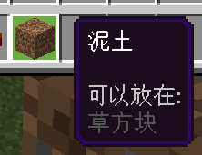

# 2.7 物品操作命令

你是否还记得我们第一章时曾经讲过三个基本概念：实体、物品和方块？是的！2.6~2.8 这三大节，我们就是按照实体操作、物品操作和方块操作来讲解的了。这一节，我们就来学习与物品相关的操作。

其实物品操作你已经掌握了一些，在 2.2，我们已经学习了`/give`和`/clear`。现在，我们从“增删改查”的角度再出发，好好回顾一下这两位老朋友，并认识几位新朋友。

## 物品组件

还记得吗？我们当时在讲 2.2 的`/give`命令的时候，特意把物品组件绕过去了。因为那还是打基础的阶段，而且这里涉及的内容又很多，所以就跳过去了。但是现在，是时候了，我们要开始认识物品组件了。

来重新回顾一下`/give`命令的语法：

```text title="/give的语法" showLineNumbers
/give <玩家: target> <物品: Item> [数量: int] [数据值: int] [组件: json]
```

这里我们看到`json`这个全新的类型。关于 JSON，目前我们认为讲这个对你来说其实是相对比较适合的，但是要涉及的内容还是太多了，所以我们会在模块 2 的第一章系统性地讲解 JSON 的语法。目前，你只需要学会像套公式一样去套物品组件就可以了。

物品组件（Item Component）进一步地决定了物品拥有的行为。对于组件这种陌生的概念，你可以把它理解成是一个器械的不同模块，只要给物品加上一个组件，就代表这个物品拥有这个组件所决定的特性。

### 有哪些物品组件？

对于基岩版来说，现在一共支持 4 类物品组件：**（冒险模式）可破坏、（冒险模式）可放置、物品锁定、死亡保留**。

- 如果你给物品加上一个“可破坏”的组件，那么这个物品**在冒险模式下就拥有了可破坏特定方块的功效**。

  

  - **前提是，这个方块本来就是可破坏的**。加上一个“可破坏”基岩的组件，最后还是无法破坏基岩。
- 同样地，如果加上一个“可放置”的组件，那么这个物品**在冒险模式下就拥有了可放置在特定方块上的功效**。

  

  - **前提是，这个物品本来就是可放置的**。给钻石剑加上一个“可放置”的组件，最后还是无法放置。
- 加上一个“物品锁定”的组件，这个物品**就将无法移除、丢弃、用于合成**，除非使用`/clear`。
  - 这类物品会在其**左上角加一个小三角标识**这是一个被锁定的物品。

    

  - 然而，这类物品**还是可以右键使用的**。比如为雪球加上一个物品锁定，还是可以扔出去。
  - 物品锁定也分为两类：**锁定在物品栏**和**锁定在槽位**。
    - **锁定在物品栏**时，代表这个物品还可以**在物品栏内从一个位置移动到另一个位置**。小三角标识的颜色是黄色。
    - **锁定在槽位**时，这个物品就**完全锁死在这个槽位上无法移动**。小三角标识的颜色是红色。
- 加上一个“死亡保留”的组件，这个物品**就将在玩家死亡后仍然保留**。

  

  - 不过，如果开了死亡不掉落的话，那么这个组件就没什么意义了——反正无论如何，死亡后其他物品也不掉落。

你可以清楚地看到，这些物品组件所添加的信息都会在物品描述中显示出来。但是，如果使用`/gamerule showTags false`的话，那么这些信息就会被隐藏。

:::note[扩展：Java版的物品组件]

Java 版也同样存在物品组件这个概念。在 1.20.5 以前，Java 版还是使用 NBT 存储物品的数据。1.20.5 之后，Java 版更换了一个更统一的写法，并正式升级为**物品堆叠组件（Item Stack Component）**。

格式上，和基岩版可以认为毫无半点关系。功能上，Java 版的物品堆叠组件可实现的功能堪称“吊打”基岩版。基岩版开发者梦寐以求的附魔`enchantments`、命名`item_name`、提示信息`lore`、不可破坏`unbreakable`等等全都未加入。Java 版至今支持数十种物品组件，而遗憾的是，基岩版现如今却只支持 4 种，自 1.16.100 更新以来就再也没有更新过。好在，使用脚本（ScriptAPI）可以一定程度上弥补这种差距。

有趣的是，基岩版现如今支持的 4 种物品组件中，有 2 种是 Java 版所没有的：物品锁定和死亡保留。但反过来说，基岩版命令现如今也只支持 Java 版数十种物品组件的其中 2 个而已，而这两个组件是基岩版 1.1 （2017 年）更新的……

:::

### 如何添加物品组件？

我们稍后会在两条命令中看到需要填写`组件: json`的参数，这就是你可以添加物品组件的地方。

对于`json`，通常我们都需要先写一个大括号`{}`包裹里面的内容，里面就可以添加组件了。这里需要格外注意一点，我们需要再强调一次：**其中会涉及到大量的`[`、`]`、`,`、`"`、`:`等符号，请务必使用英文的半角符号！否则在这里极有可能会出现语法问题**！如果你确信自己没有输入错误，却出现了语法错误，仔细检查语法错误的描述，有时候可能就是因为你误输入了中文的符号导致的。

```json
{(组件1),(组件2),...}
```

接下来，我们直接给出组件的写法：

```json title="可破坏组件"
"can_destroy":{"blocks":["方块ID1","方块ID2",...]}
```

可破坏组件，指代物品可破坏的方块。`can_destroy`也可以写为`minecraft:can_destroy`。**`方块ID`必须是有效的 ID，否则将导致物品组件无法解析**。示例：

- `"can_destroy":{"blocks":["grass_block"]}`：可以破坏草方块。
- `"can_destroy":{"blocks":["grass_block","dirt"]}`：可以破坏草方块和泥土。

一定要注意的一点是，**各项用逗号分隔，但末尾决不能加逗号**！对于 JSON 而言，这叫做**语法错误（Syntax Error）**，会直接导致 JSON 无法解析。

- `["grass_block","dirt"]`：正确写法。
- `["grass_block","dirt",]`：错误写法，`"dirt"`后面多出了一个`,`。

```json title="可放置组件"
"can_place_on":{"blocks":["方块ID1","方块ID2",...]}
```

与可破坏组件类似，指代物品可以放置在何方块上。`can_place_on`也可以写为`minecraft:can_place_on`。示例：

- `"can_place_on":{"blocks":["grass_block"]}`：可以放置到草方块上。
- `"can_place_on":{"blocks":["grass_block","dirt"]}`：可以放置到草方块和泥土上。

```json title="物品锁定组件：锁定在物品栏"
"item_lock":{"mode":"lock_in_inventory"}
```

```json title="物品锁定组件：锁定在槽位"
"item_lock":{"mode":"lock_in_slot"}
```

`item_lock`也可以写为`minecraft:item_lock`。

```json title="死亡保留组件"
"keep_on_death":{}
```

`keep_on_death`也可以写为`minecraft:keep_on_death`。

### 物品组件运用的实例

按照上面所给出的物品组件的格式，将它们拼装到一起即可。以下是`组件: json`的几个示例：

```json title="可破坏泥土"
{"can_destroy":{"blocks":["dirt"]}}
```

其中，`"can_destroy":{"blocks":["dirt"]}`是一个可破坏的组件，将其直接包裹在`{}`里，便构成了一个完整的`组件: json`。

```json title="可破坏泥土、同时可放置在泥土上"
{"can_destroy":{"blocks":["dirt"]},"can_place_on":{"blocks":["dirt"]}}
```

其中，`"can_destroy":{"blocks":["dirt"]}`是一个可破坏的组件，`"can_place_on":{"blocks":["dirt"]}`是一个可放置的组件，这两个组件中间用一个`,`分隔，包裹在`{}`里，便构成了一个完整的`组件: json`。

```json title="锁定在物品栏上、同时死亡保留"
{"item_lock":{"mode":"lock_in_inventory"},"keep_on_death":{}}
```

和上文同理，`"item_lock":{"mode":"lock_in_inventory"}`和`"keep_on_death":{}`是两个组件，中间以`,`分隔并用`{}`包裹。

```json title="可破坏泥土和草方块、可放置在石头上且锁定在槽位上"
{"can_destroy":{"blocks":["dirt","grass_block"]},"can_place_on":{"blocks":["stone"]},"item_lock":{"mode":"lock_in_slot"}}
```

看到这里，想必你自己已经可以进行解析了。现在，对物品组件有一些基本认识了吗？

:::note[扩展：如果将最后一个JSON展开来写……]

在模块 2 我们就会看到附加包的 JSON 都是展开来写的，这样能够有效提升可读性。具体来说就是加缩进以明确上下级的关系：

```json title="添加缩进、换行与空格的写法" showLineNumbers {2-7,13-15}
{
    "can_destroy": {
        "blocks": [
            "dirt", // <- 以逗号分隔
            "grass_block" // 最后一项没有逗号
        ] // 最后一项没有逗号
    }, // <- 以逗号分隔
    "can_place_on": {
        "blocks": [
            "stone" // 最后一项没有逗号
        ] // 最后一项没有逗号
    }, // <- 以逗号分隔
    "item_lock": {
        "mode": "lock_in_slot" // 最后一项没有逗号
    } // 最后一项没有逗号
}
```

不过，命令是不支持缩进和换行滴，死心吧~ 只是给你看个乐呵而已。不过，虽然只是看个乐呵，它却很好地把 JSON 的结构呈现给你，你可以清楚地看到所谓的最后一项，后面是没有逗号的。

:::

### 输入物品组件稳定不出错的小技巧

我们看到这些物品组件里有这么多的乱七八糟的符号，括号都是成对的、引号也是成对的，少打一个就会出现语法错误。条件如此苛刻，该怎么确保不出现问题呢？这里分享两个小技巧。

<details>

<summary>第一个小技巧：直接复制粘贴我们所给的组件</summary>

例如，在打字的时候你可以先打一个花括号，然后复制粘贴一个组件到花括号里，如果需要另一个组件加个逗号就继续复制粘贴，最后，按需修改。例如，如果想实现“可破坏泥土和草方块、可放置在石头上且锁定在槽位上”的效果，可以按如下步骤解决。

```json title="第一步：先打花括号"
{}
```

```json title="第二步：复制第一个组件进去"
{"can_destroy":{"blocks":["方块ID1","方块ID2",...]}}
```

```json title="第三步：在组件后面加逗号，然后复制第二个组件进去"
{"can_destroy":{"blocks":["方块ID1","方块ID2",...]},"can_place_on":{"blocks":["方块ID1","方块ID2",...]}}
```

```json title="第四步：在组件后面加逗号，然后复制第三个组件进去"
{"can_destroy":{"blocks":["方块ID1","方块ID2",...]},"can_place_on":{"blocks":["方块ID1","方块ID2",...]},"item_lock":{"mode":"lock_in_slot"}}
```

```json title="第五步：更改可破坏和可放置组件的值，大功告成！"
{"can_destroy":{"blocks":["dirt","grass_block"]},"can_place_on":{"blocks":["stone"]},"item_lock":{"mode":"lock_in_slot"}}
```

</details>

<details>

<summary>第二个小技巧：先打成对的括号和字符串的引号</summary>

我们注意到这里每个括号都是成对出现的，所以我们可以优先打出各组件的第一级括号，然后第二级括号，以此类推……

```json title="第一步：先打花括号"
{}
```

```json title="第二步：先打各组件的第一级内容和第一对括号"
{"can_destroy":{},"can_place_on":{},"item_lock":{}}
```

```json title="第三步：分别填写第二级内容和第二对括号"
{"can_destroy":{"blocks":[]},"can_place_on":{"blocks":[]},"item_lock":{"mode":""}}
```

```json title="第四步：填写第二级内的内容"
{"can_destroy":{"blocks":["dirt","grass_block"]},"can_place_on":{"blocks":["stone"]},"item_lock":{"mode":"lock_in_slot"}}
```

这种方法通常更适合已经精通这些组件结构和 JSON 语法的“高手”。

</details>

---

## “增”物品：给予物品的命令`/give`

## “删”物品：移除物品的命令`/clear`

## “改”物品：更改物品栏物品的命令`/replaceitem`

## “查”物品：目标选择器参数`hasitem`

### 指代数量

### 指代位置

### 指代数据值

## 为物品附魔的命令`/enchant`

## *战利品命令`/loot`

## *配方表命令`/recipe`

---

## 总结与扩展
