# 2.9.1 文本操作命令

在前面的几节，我们掌握了许多基本逻辑相关的命令。可以说，有了这些命令，你已经可以做出一张出色的地图。然而，虽然在底层逻辑上我们已经没有太大的问题，但是在一些细节、特效上却有一些缺憾。迄今为止，我们都是在用`/say`来通知玩家，如果有一些只能给特定玩家传递的信息，`/say`会导致所有人都能看到这些消息；而且也缺少粒子、音效等其他辅助特效的支持，这就导致做出来的逻辑搭配的反馈总是“缺点什么”。可以说，这些特效是为了玩家能够体会到更好的反馈而服务的，在很多情况下仍然是重要的。

在 2.9 这一大节，我们将从聊天栏、标题、相机、粒子、音效等方面详细谈谈如何实现不同的特效效果。本节，我们来看聊天栏和标题，也就是文本特效。

## 聊天栏输出

通常来说，很多必要的消息都是从聊天栏输出的。例如地图中一个 NPC 说过的话；或者起床战争中通知自己和别人的床被破坏；或者在密室杀手提示特定的玩家游戏目标；等等。好在，聊天栏输出文本信息的命令还是很多的，主要有 4 条：`/say`、`/tell`、`/me`、`/tellraw`，其中`/tell`和`/me`现在并不常用，最常用的是`/tellraw`，但是我们先简单介绍另外三条。

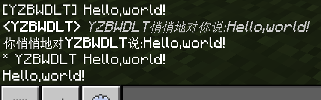

### 公告命令：`/say`

`/say`我们已经在 2.2 学过，并且在前面我们一直在用，这里就不再多强调，我们再来看一眼语法作为复习。

```text title="/say的语法" showLineNumbers
/say <消息: message>
```

### *私聊玩家：`/tell`（`/w`、`/msg`）

`/tell`是一条能够对特定玩家展示聊天栏消息的命令。它还有两个同义命令（也是同义命令最多的命令），`/w`和`/msg`。语法如下：

```text title="/tell的语法" showLineNumbers
/tell <玩家: target> <消息: message>
```

对`玩家`展示`消息`。在`/tellraw`在 1.9 版本加入到游戏之前，这条命令也是常用的对玩家私发聊天栏消息的命令，然而现在在实际工程中却已经几乎不用了。但特别的是，因为这条命令在服务器中普通玩家也能使用，因此它反而是无作弊服务器中玩家们常用的命令之一。关于权限等级的问题，我们在 2.10 会详细谈谈。

执行命令`/tell @a @a，你们好，这是对玩家私聊一条消息的效果！`的效果如下图所示。

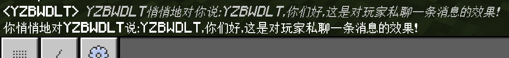

:::note[扩展：关于该命令的返回]

如果你在无作弊服务器中想要通过这条命令私聊玩家，请务必提醒服主关闭`sendCommandFeedBack`游戏规则。否则，你在私聊的同时，命令的返回值也会一并对其他玩家显示，其他玩家也能看到你的悄悄话，颇有一种掩耳盗铃的意味。

:::

### *聊天栏宣告状态：`/me`

`/me`对所有玩家宣告执行者的状态。语法如下：

```text title="/tell的语法" showLineNumbers
/me <消息: message>
```

和`/say`的区别在于，它的输出格式从`[执行者] 消息`的格式变成了`* 执行者 消息`的格式。例如执行`/me 掉出了这个世界`，它的执行效果为


## 标题命令：`/title`

除了聊天栏之外，屏幕其他地方也是可以显示文字的。你在其他地图中、其他模组甚至其他游戏中都一定看过一些在屏幕中央展示的文字，例如《植物大战僵尸》的红色大字“A HUGE WAVE OF ZOMBIES IS APPROACHING”通过一段动画显示在屏幕中央，配合音效就展现了一种“压迫感”。在 Minecraft 中，这样的文字称作**标题（Title）**。

下图展现了 MC 中可用的三种标题：主标题（屏幕中央）、副标题（主标题下方）和快捷栏标题（快捷栏上方）。

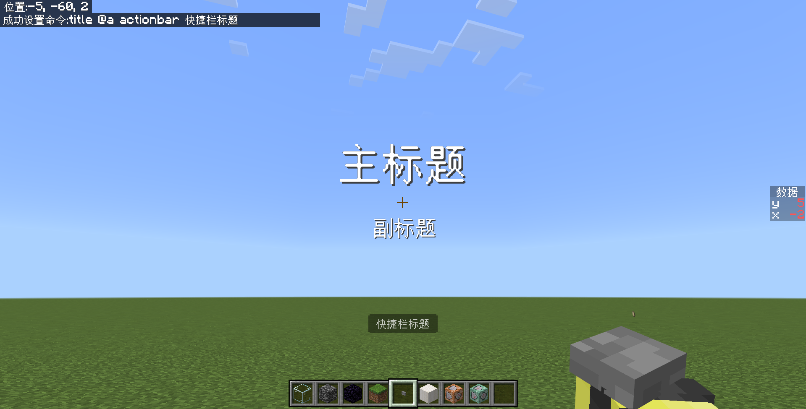

标题命令的语法如下所示：

```text title="/title的语法" showLineNumbers
/title <玩家: target> <title|subtitle|actionbar> <标题信息: message>
/title <玩家: target> clear
/title <玩家: target> reset
/title <玩家: target> times <淡入: int> <停留: int> <淡出: int>
```

虽然看起来有 4 种用法，但是事实上只有 3 种用法：播放标题（`title`、`subtitle`、`actionbar`）、清空标题（`clear`）和时间控制（`times`、`reset`）。

### 播放标题

播放标题是标题命令最常用的用法。在上面的图中，**主标题通过`title`参数播放；副标题通过`subtitle`参数播放；快捷栏标题则通过`actionbar`参数播放**。

:::tip[实验 2.9-1]

分别执行命令`/title @a title 主标题`、`/title @a subtitle 副标题`和`/title @a actionbar 快捷栏标题`，看看它们执行的效果如何。

:::

在执行上面三条命令之后，你就可以在上面的三个对应位置看到这三种标题。

然而，**副标题却是比较特殊的**——如果你的手速慢一点，你可能看不到这条命令的执行有什么效果。这是因为，副标题的显示必须依托于主标题，如果主标题已经消失，则副标题也不会显示——或者说，**它在等待下一次的主标题的执行，并随下一次的主标题一起消失，这就是副标题的队列性**，副标题是不能单独显示的。

读者可以试一试在主标题未显示的情况下，先执行副标题命令再执行主标题命令，这时候主标题和副标题将一同显示。

实际播放标题时，当然不会使用副标题的这种队列性，因为它很可能会造成标题播放的混乱。通常我们都是在本次主标题播放的瞬间立刻播放副标题，或者至少在主标题还存在的时候播放副标题。

### *清空标题

你可以在标题正在播放的时候使用`/title <玩家> clear`来清空标题。这种用法还是比较少的，通常直接通过时间调控来解决。

### 时间控制

在播放这些标题的时候，你可以看到它们是存在一定的淡入淡出的。如果想要调控标题的淡入淡出，就可以用`times`来解决。

:::tip[实验 2.9-2]

先执行命令`/title @a title 主标题`，观察它的淡入淡出特性。

然后，执行命令`/title @a times 0 60 0`，再播放一次主标题，现在的效果又如何？关于标题的淡入淡出和停留时间，你能通过实验现象判断出其单位吗？

然后，再执行命令`/title @a reset`，再播放一次主标题，重置到默认状态。

:::

在执行了`/title @a times 0 60 0`后，你将会看到再播放主标题之后，标题将毫无征兆地跳出来，在停留了 3 秒后（反正肯定不是 60 秒），又毫无征兆地消失，这就是`times`的作用，显然它接受的 3 个参数的时间单位都是游戏刻。而`reset`用法，则是将一切时间设置都改回默认。默认值分别是 10、70、20，也就是说`/title @a times 10 70 20`和`/title @a reset`是完全等效的，所以`reset`用法实际上也不太常用。

需要注意，`times`用法对快捷栏标题无效。

---

在上面我们简单介绍了聊天栏显示文本的命令和标题显示文本的命令。然而，我们的“野心”还不止于此。无论是`/say`、`/tell`还是`/me`，它们显示的内容都“不干净”，相比于我们想要显示的消息，它们总是会多出`[执行者]`、`* 执行者`甚至一大堆奇怪的`<执行者> 执行者悄悄地对你说：`。就没有一种更好的方法能够显示最干净、最纯粹的内容吗？好消息是，有！确实有一种方法能够纯粹地只返回我们希望返回的内容，但坏消息是，我们又要和“组件”，也就是所谓的`json`打交道了。这就是**文本组件（Text Component）**，也称**原始 JSON 文本（Raw JSON Text）**。

## 文本组件

文本组件是一种用来表达特定文本的组件，使用 JSON 格式，使用文本组件能够打印特定文本、实体名称、分值、或者使用格式化的文本。在学习物品的时候，我们学习了物品组件，当时我们说虽然物品组件使用了格式比较复杂的 JSON，但是物品组件的格式是相对固定的。好消息是，文本组件的格式也是相对固定的。我们接下来来看两条支持文本组件的命令和基岩版支持的 4 种文本组件。

但是，关于 JSON 的具体语法，我们还是在模块 2 了解。

### 基于文本组件的 raw 命令

能够使用文本组件的命令主要有 2 条：`/tellraw`和`/titleraw`，你能看得出来，基本上是基于`/tell`和`/title`改编而来的，所以语法上也是如出一辙：

```text title="/tellraw和/titleraw的语法" showLineNumbers
/tellraw <玩家: target> <原始JSON文本: json>
/titleraw <玩家: target> <title|subtitle|actionbar> <原始JSON文本: json>
/titleraw <玩家: target> clear
/titleraw <玩家: target> reset
/titleraw <玩家: target> times <淡入: int> <停留: int> <淡出: int>
```

这两条命令的含义，想必已无需我们多言。其中，`/title ... times`调控的时间参数在`/titleraw`中也是适用的，二者在这方面是互通的。

### 普通文本组件`text`

类似于物品组件，**文本组件需要以下面的格式来包裹**：

```json title="rawtext"
{"rawtext":[...]}
```

**代表这是一个原始JSON文本**。其中，`...`是各种文本组件的集合，也就是`{组件1},{组件2},...`。

**普通文本组件**的格式是

```json title="text组件"
{"text":"(文本)"}
```

我们来做两个实验，体验一下普通文本组件的效果。

:::tip[实验 2.9-3]

执行命令：

1. `/tellraw @a {"rawtext":[{"text":"Hello,world!"}]}`
2. `/tellraw @a {"rawtext":[{"text":"Hello,"},{"text":"world!"}]}`

:::

这两条命令都输出“Hello,world!”。


其中：

- 第 1 条命令里面插入了一个`text`组件，其中的`文本`为`Hello,world!`，所以原样输出；
- 第 2 条命令里面插入了两个`text`组件，它们的`文本`分别为`Hello,`和`world!`，在解析的时候**会将这两个组件输出的文本组合起来**，也就是`Hello,world!`了。

### 转义符

接下来我们来看一些特殊情况，也就是打印引号、换行和反斜杠。

:::tip[实验 2.9-4]

执行命令：

1. `/tellraw @a {"rawtext":[{"text":"Hello,"world!""}]}`
2. `/tellraw @a {"rawtext":[{"text":"Hello,\"world\""}]}`
3. `/tellraw @a {"rawtext":[{"text":"Hello,\nworld!"}]}`
4. `/tellraw @a {"rawtext":[{"text":"Hello,\\world!"}]}`

:::

这里面，第一条命令会报错，而其他命令都将正常执行。

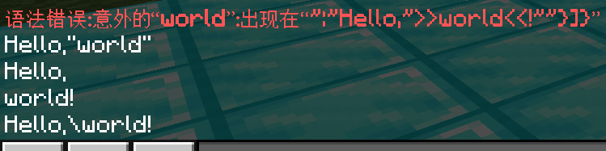

第一条命令希望打印`Hello,"world!"`，也就是希望打印出双引号。但是为什么报错了呢？

我们可以看到，这些内容整个就是包裹在一个双引号里面的，也就是`"Hello,"world!""`，代表这是一个字符串。然而，程序在解析这些东西的时候，会先在`"Hello,"`这里解析到一个完整的字符串，它会将中间的那个引号视作字符串的结束！结果，字符串结束之后，后面不是预期的`,`或`}`，所以这条命令才会报错。

因此，我们要告诉程序，中间的两个引号不是字符串的结束，而是要把这两个引号也视作字符串的一部分。这时我们需要在引号前面插入一个反斜杠`\`，告诉程序`\"`是字符串的一部分，将这个引号打印出来。这个过程叫做**转义（Escape）**，反斜杠在字符串内称作**转义符（Escape Character）**。

转义在程序设计中具有非常重要的意义，有多种转义搭配可供使用。在基岩版的命令中，主要支持这么几种转义：

- `\n`，代表换行符。在命令中要输出换行的消息、标题，都可以通过`\n`来换行。
- `\"`或`\'`，代表在字符串中打印出引号。
- `\\`，代表在字符串中打印出反斜杠`\\`。反斜杠接上任意字符都会导致这个字符的转义，然而大部分情况下，这些字符并不会有任何其他含义，最后反而会因为不支持这样的转义符而报错。所以，为了打印出反斜杠，需要用转义符把转义符转义掉。听起来可能会拗口一些？:)

### 格式化代码

既然讲了转义符，我们不妨再来接触另一种适用于游戏各处的符号：**格式化代码（Formatting Code）**。在其他很多地图中，你能看到字体以各种颜色和格式出现，比如粗体、斜体、绿色、黄色等等……它们都是依靠一个符号：章节号`§`来实现的。

如果你用电脑，打出“zjh”的时候理应就能在你的输入法上看到这个符号：


在游戏中，“§”后面跟一个数字或者小写的英文字母，就能够使文字更改颜色，或者格式。常见的格式化代码如下图所示：

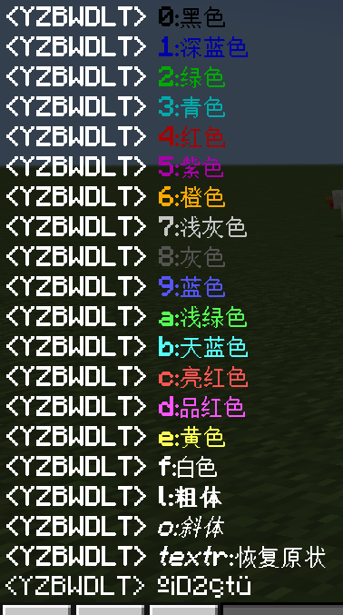

:::tip[实验 2.9-5]

这东西可不是命令！到处都能用，然而我们还是要来做一个实验\~

找一个告示牌，然后按下面的格式打字并使其发光（*当然基岩版没有`/back`这种命令哈*）：

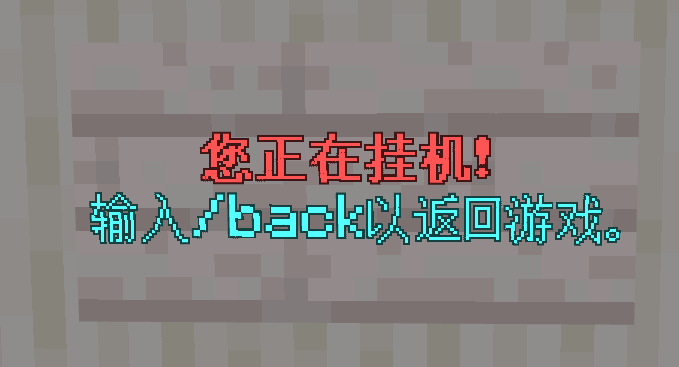

如果你想不清楚怎么打出来的，可以参考下面：

```text title="告示牌文字"

§c§l您正在挂机！
§r§b输入/back以返回游戏。
```

:::

因为成为格式化代码后，就不会显示出来，所以你可以利用这个特性实现 **“只输出”副标题的效果**！

```mcfunction
title @a title §1
title @a subtitle 这是一段只有副标题的内容！
```

关于格式化代码的更多信息，详见[格式化代码 - 中文 Minecraft Wiki](https://zh.minecraft.wiki/w/格式化代码)。

### 实体名组件`selector`

好，看完了转义符和格式化代码，现在我们要继续回归正题了。`/say`里面的`message`类型的参数是允许输出实体名的，比如`/say @a`会打印所有玩家的名字。我们在文本组件中，**用实体名组件`selector`实现打印实体名字的功能**。

```json title="selector组件"
{"selector":"<目标: target>"}
```

我们来试一试这个组件吧！

:::tip[实验 2.9-6]

执行命令：

1. `/tellraw @a {"rawtext":[{"text":"Hello,"},{"selector":"@a"}]}`
2. `/tellraw @a {"rawtext":[{"text":"Hello,"},{"selector":"@e"}]}`

:::

执行的结果如下：

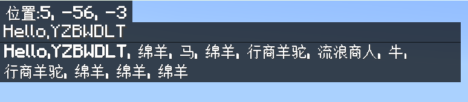

原理上和`text`是类似的，这两条命令都有两个组件，一个是`text`，输出`Hello,`；另一个是`selector`，输出所有符合条件的实体名字，例如`YZBWDLT`,将这两个组件前后组合起来就是`Hello,YZBWDLT`了。

你甚至可以利用这个原理恶搞一下你的好友：

```mcfunction
/tellraw @a {"rawtext":[{"text":"§e"},{"selector":"@s"},{"text":" 退出了游戏"}]}
```


然而其实你根本就没有退出！哈哈！

### 分数组件`score`

和传统的`message`类型不同的是，文本组件还能够**输出分数，也就是分数组件`score`**。只是它的格式略微复杂一些：

```json title="score组件"
{"score":{"objective":"<记分项: string>","name":"<追踪对象: target>"}}
```

也就是说，`score`组件需要同时接收两个参数`objective`和`name`才能完整地打印分数，正如我们在 2.4 中讲过的那样。

:::tip[实验 2.9-7]

将你在`data`上的分数设为`3`，将`data.x`设为`13`，然后执行命令：

1. `/tellraw @s {"rawtext":[{"text":"你的分数是："},{"score":{"objective":"data","name":"@s"}}]}`
2. `/tellraw @s {"rawtext":[{"text":"x的分数是："},{"score":{"objective":"data","name":"x"}}]}`

:::

我们可以看到，最终的执行效果如下：

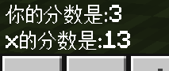

这两条命令的执行原理比较清楚，想必我们也无需再多说什么了。需要注意的是，如果这些分数碰到章节号，依然是会生效并转化为格式化代码的：

```mcfunction
/tellraw @a {"rawtext":[{"text":"§"},{"score":{"objective":"data","name":"x"}}]}
```

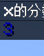

这是因为，左边`text`组件返回`§`，右边`score`组件返回分值`13`，组合在一起就是`§13`，然后`§1`成为深蓝色的格式化代码，所以最后输出深蓝色的 3。依据这个原理，你甚至可以做一个自动彩虹文本（只是颜色比较匮乏罢了）！

```mcfunction
scoreboard players add formatCode data 1
execute unless score formatCode data matches 0..9 run scoreboard players set formatCode data 0
titleraw @a actionbar {"rawtext":[{"text":"§"},{"score":{"objective":"data","name":"formatCode"}},{"text":"这是一段会自动变色的彩虹文本！"}]}
```

### 翻译组件`translate`与`with`

翻译组件能够输出语言文件的键名对应的值、或是进行文本格式化处理。可能你目前还没看懂这两个东西是干什么用的，这很正常。

对于语言文件，目前我们没什么值得多说的，不是因为它不重要（它其实很重要），而是因为这东西对于普通的命令玩家来说实在是已经超纲了。在模块 2，你就会看到语言文件`*.lang`的用途。我们给你展示一个例子：

```mcfunction
/tellraw @a {"rawtext":[{"translate":"item.stick.name"}]}
```


神奇吧？看不懂吧？看不懂就对了，看得懂的话你还来看命令干嘛（bushi

我们的重点在于后面的那个文本格式化。什么叫格式化？你可能在清空一整个硬盘的时候听说过格式化这个名字，知道把硬盘格式化的时候就代表里面所有的数据都灰飞烟灭了。但是在字符串中，格式化却不是消灭所有字符的意思。它代表的是按照特定的格式和模板输出字符串，你可以把格式化理解为模板化。如果你有一张中国移动的 SIM 卡，你经常会收到这样的提示消息：

```text
【流量提醒】尊敬的客户，您好！截止(xx)月(xx)日(xx)点(xx)分，您(xxx)本月移动上网流量已使用(xx.xx)GB，……
```

对于这种高度模板化的消息，不难发现我们只需要插入一些特定的数值，就能够组成一句语意通畅、数据清晰的话。再比如上文我们用来恶搞的那个字符串，也可以总结出一个模板：

```text
§e(xxx) 退出了游戏
```

这里，我们只需要插入一个玩家的名字，然而我们却插入了 3 个文本组件用来表达这个意思，难免会降低易读性。这里还是只插入一个名字，万一你要显示的是插入一堆数值的字符串呢？

```text
§l§b 关卡 (xx)-(xx) | 怪物数 (xx) | 玩家数 (xx) | 波数 (xx) | ……
```

这种情况下，插入 5 个值，你就要引入 11 个文本组件，实现起来的效果类似于

```text
titleraw @a actionbar {"rawtext":[{"text":"§l§b 关卡 "},{"score":{"objective":"...","name":"..."}},{"text":"-"},{"score":{"objective":"...","name":"..."}},{"text":" | 怪物数 "},{"score":{"objective":"...","name":"..."}},{"text":" | 玩家数 "},{"score":{"objective":"...","name":"..."}},{"text":" | 波数 "},{"score":{"objective":"...","name":"..."}},{"text":" | ……"}]}
```

请问，如果接下来要插入什么值，在什么地方插入什么数值，在哪里插入什么空格，望着这样的一坨“史山”，你还能分清要加在哪里吗？这还只是 5 个值而已，如果是更多的值呢？所以，我们需要一种在复杂情形下也能够让我们分清哪里有值、哪里的数值该插入在哪里的方法，这就是`translate`做的事情。

翻译组件`translate`支持 3 个语法：

```json title="translate组件" showLineNumbers
{"translate":"(语言文件键名或文本)"}
{"translate":"(语言文件键名或文本)","with":["(值1)","(值2)",...]}
{"translate":"(语言文件键名或文本)","with":{"rawtext":[(组件1),(组件2),...]}}
```

其中第一个语法，如果输入的不是语言文件允许的语言文件键名，这组件和`text`没什么太大的区别。我们重点来讲后两个语法。

上面我们提到了模板字符串，那么插入值该如何表示呢？在基岩版，我们有两种表示方法：

- `%%s`：将`with`中的值或组件按顺序依次代入。
  - 例如`with`下有 3 个值`["1","2","3"]`，那么代入到`"%%s, %%s, %%s"`时就变为`"1,2,3"`。
- `%%(整数)`：将`with`中的值或组件按索引代入。注意：第一个元素的索引是`1`。
  - 例如`with`下有 3 个值`["1","2","3"]`，那么代入到`"%%1，%%3，%%2"`时就变为`"1,3,2"`。

这么说还是太抽象了，我们来做几个小实验来体验一下吧！

:::tip[实验 2.9-8]

执行下面的命令：

1. `/tellraw @a {"rawtext":[{"translate":"§e%%s 加入了游戏"}]}`
2. `/tellraw @a {"rawtext":[{"translate":"§e%%s 加入了游戏","with":["Steve"]}]}`
3. `/tellraw @a {"rawtext":[{"translate":"§e%%s 加入了游戏","with":["@s"]}]}`
4. `/tellraw @a {"rawtext":[{"translate":"§e%%s 加入了游戏","with":{"rawtext":[{"selector":"@s"}]}}]}`

这 3 条命令，是为了让你体会 3 种不同的`translate`的文本组件的用法。它们的执行结果如下：

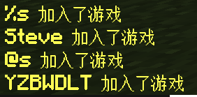

现在我们再来体会不同插入方法所带来的不同效果。执行下面的命令：

1. `/tellraw @a {"rawtext":[{"translate":"%%s在%%s的评分是%%s","with":["Steve","score","3.0"]}]}`
2. `/tellraw @a {"rawtext":[{"translate":"%%1在%%2的评分是%%3","with":["Steve","score","3.0"]}]}`
3. `/tellraw @a {"rawtext":[{"translate":"%%2在%%3的评分是%%1","with":["Steve","score","3.0"]}]}`

执行结果如下：

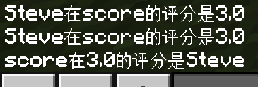

:::

我们来分析这些命令。

关于第 1 条命令，就已经“初见端倪”。明明我们输入了 2 个`%`，最后显示出来却只有 1 个。所以，**在`translate`语法中，`%%`代表`%`**。如果读者愿意再尝试一下的话，比如`"translate":"100%"`，最后会只返回为`100`。只有输入为`"translate":"100%%"`，才能正确地返回为`100%`。因此，虽然说单独使用`translate`的效果和`text`没有太大区别，但区别主要就体现在这些细节的地方上。

第 2 条命令中，`%%s`会开始寻找`with`中的对应的值。因为是第一次出现`%%s`，所以寻找到第 1 个值`Steve`并代入到`%%s`中去，结果，`§e%%s 加入了游戏`变为了`§eSteve 加入了游戏`。

第 3 条命令也是同理的，输出了`§e@s 加入了游戏`。换言之，**如果使用第二种组件的`"with":[...]`，其中的内容是不会解析的，原样输出**。所以，`"@s"`同样不会解析，原样输出。

第 4 条命令中，`with`使用了一个新的文本组件，并且在这些文本组件中，只有一个组件`{"selector":"@s"}`，它被解析为`YZBWDLT`（玩家名），然后替换到`%%s`中去，变成`§eYZBWDLT 加入了游戏`。你可以这么认为：**第二种组件的`"with":["文本1","文本2",...]`和第三种组件的`"with":{"rawtext":[{"text":"文本1"},{"text":"文本2"},...]}`是同义的**，因此，第二种组件的实际应用也是很少的。

第 5 条命令中，使用了三个`%%s`。它解析的大体流程是：

- 先从第一个`%%s`开始，找到第一个值为`Steve`，代入回去变成`Steve在%%s的评分是%%s`。
- 然后检查第二个`%%s`，找到下一个值为`score`，代入回去变成`Steve在score的评分是%%s`。
- 然后检查第三个`%%s`，找到下一个值为`3.0`，代入回去变成`Steve在score的评分是3.0`。

第 6 条命令中，使用了`%%1`、`%%2`、`%%3`，它们分别在`with`中同时找到第一个、第二个、第三个参数，并分别代入，得到`Steve在score的评分是3.0`。

第 7 条命令中，类似地代入便可得到`score在3.0的评分是Steve`。

**在实际的应用中，最多的是使用`%%s`，而`%%(索引)`只在很少数的情况下才能用得到**。可以说，有了这些基础知识，已经足够你编写出一个漂亮的文本组件。如果你想更进一步，可以参考[文本组件#格式化字符串 - 中文 Minecraft Wiki](https://zh.minecraft.wiki/w/文本组件#格式化字符串)，里面讲解了许多更深入的理论供你参考，当然，难度也更高。

例如，在一开头的例子中，我们提到下面的字符串模板

```text
§l§b 关卡 (xx)-(xx) | 怪物数 (xx) | 玩家数 (xx) | 波数 (xx) | ……
```

在以前写为

```text
titleraw @a actionbar {"rawtext":[{"text":"§l§b 关卡 "},{"score":{"objective":"...","name":"..."}},{"text":"-"},{"score":{"objective":"...","name":"..."}},{"text":" | 怪物数 "},{"score":{"objective":"...","name":"..."}},{"text":" | 玩家数 "},{"score":{"objective":"...","name":"..."}},{"text":" | 波数 "},{"score":{"objective":"...","name":"..."}},{"text":" | ……"}]}
```

而现在，我们则可以写为

```text
titleraw @a actionbar {"rawtext":[{"translate":"§l§b 关卡 %%s-%%s | 怪物数 %%s | 玩家数 %%s | 波数 %%s | ……","with":{"rawtext":[{"score":{"objective":"...","name":"..."}},{"score":{"objective":"...","name":"..."}},{"score":{"objective":"...","name":"..."}},{"score":{"objective":"...","name":"..."}},{"score":{"objective":"...","name":"..."}}]}}]}
```

很显然，相比于以前的写法，易读性提升了不少。不过，使用了翻译组件的最后那一堆括号`}}]}}]}`常常成为各路开发者的梦魇，毕竟丢了一个都会导致语法错误，**所以我们建议还是先打括号再写内容，就基本上万无一失了**。当然，如何使用文本组件，还是看你个人喜好。

`/tellraw`会了之后，那么`/titleraw`对你来说也不是什么难事了。将文本组件应用到`/titleraw`上，就成为命令玩家口中常说的“T显”，其中，`translate`用法在需要大量数值插入的时候，也是最常见的。

---

## 总结与练习

本节我们主要讲了标题和文本组件的用法。对于`/tell`或`/me`这种小众命令，现如今已经不在我们的讨论范围内。使用`/tellraw`可以规定任意样式的文本信息，是远强于这些小众命令的。实际工程中，也是`/tellraw`这种命令要用的更多。

- **标题（Title）**
  - 主标题：在屏幕正中间显示的大文字
  - 副标题：在主标题下方显示的问题，必须依托主标题存在
  - 快捷栏标题：在快捷栏上方的小文字，淡入淡出停留时间不受控制
- **转义（Escape）**
  - 在字符串内用来表达特殊字符时，需要使用转义以防程序误判
  - 常用的转义符有：
    - `\"`或`\'`：在字符串内的引号，防止被解析为字符串的结束
    - `\n`：换行符
    - `\\`：在字符串内的反斜杠，防止被解析为转义符
- **格式化代码（Formatting Code）**
  - 在 Minecraft 中用来表达文本特殊格式的代码
  - 格式是`§(0-9,a-z)`。
  - 常用的格式化代码包括：`§l`粗体、`§o`斜体、`§r`复原颜色和正体、`§2`绿色、`§3`青色、`§6`橙色、`§7`浅灰色、`§9`蓝色、`§a`浅绿色、`§b`天蓝色、`§c`亮红色、`§e`黄色、`§f`白色、等
- **文本组件（Text Component）**（或**原始 JSON 文本，Raw JSON Text**）
  - 一种用来表达特定文本的组件，使用 JSON 格式
  - 使用文本组件能够打印特定文本、实体名称、分值、或者使用格式化的文本
  - 一切的文本组件都要以`rawtext`格式开头
    - 其中，`...`为不同组件的集合`组件1,组件2,...`

  ```json title="rawtext文本组件"
  {"rawtext":[...]}
  ```

  - 普通文本组件为`text`，用于原样输出文本

  ```json title="text组件"
  {"text":"(文本)"}
  ```

  - 选择器组件为`selector`，用于输出符合特定条件实体的名字

  ```json title="selector组件"
  {"selector":"(选择器)"}
  ```

  - 分数组件为`score`，用于输出特定的分数

  ```json title="score组件"
  {"score":{"objective":"(记分项)","name":"(玩家)"}}
  ```

  - 翻译组件为`translate`，用于输出语言文件的键名或格式化的文本
    - 其中，`"with":["(值1)","(值2)",...]`的用法不会解析其中特殊值（例如`@s`等选择器）的含义，可将其视为`"with":{"rawtext":[{"text":"(值1)"},{"text":"(值2)"},...]}`
    - 文本中会查找`%%s`或`%%(索引)`格式，并将`with`里面在特定索引下的值代入
    - `%%`代表一个`%`，例如要输出`100%`，应写为`100%%`

  ```json title="translate组件"
  {"translate":"(键名或文本)"}
  {"translate":"(键名或文本)","with":["(值1)","(值2)",...]}
  {"translate":"(键名或文本)","with":{"rawtext":[...]}}
  ```

- **新命令部分**

  | 命令 | 含义 | 备注 |
  | --- | --- | --- |
  | `/title <玩家: target> <title\|subtitle\|actionbar> <标题信息: message>` | 对`玩家`在对应位置显示`标题信息` | 对应位置如下：`title`：主标题、`subtitle`：副标题、`actionbar`：快捷栏标题 |
  | `/title <玩家: target> times <淡入: int> <停留: int> <淡出: int>` | 将标题播放时间改为淡入`淡入`游戏刻、停留`停留`游戏刻、淡出`淡出`游戏刻 | 默认值为`10 70 20`，对快捷栏标题无效，和`/titleraw通用` |
  | `/tellraw <玩家: target> <原始JSON文本: json>` | 对`玩家`在聊天栏输出`原始JSON文本` | |
  | `/titleraw <玩家: target> <title\|subtitle\|actionbar> <原始JSON文本: json>` | 和`title`同义，改为显示`原始JSON文本` | |

:::info[练习 2.9-1]

1. 回顾练习 2.3-1 的第 8 题：检测所有下界的生物，并让每个下界的生物执行`/say 你们好，主世界的生物们！`命令。  
   现在我们要修改题干描述为：检测所有下界的生物，并让每个下界的生物对主世界的玩家私聊“你们好，主世界的生物们！”。允许使用多条命令，试用`/tellraw`实现之。下面是练习 2.3-1 第 8 题的参考答案：

   ```mcfunction title="练习 2.3-1 第 8 题的参考答案" showLineNumbers
   execute in nether as @e[rm=0] run say 你们好，主世界的生物们！
   ```

2. 回顾练习 2.4-4 的第 4 题：在起床战争中，假定红队的床在(30,65,30)上，当床被破坏后则标记为红队的床被破坏。假定`data.redBedState`为标记红队床状态的变量，记`0`=被破坏，`1`=未被破坏，并且其初始值为`1`。写 2 条命令，当红队的床被破坏后公告全体玩家“§c红队的床已被破坏！”并标记红队的床为被破坏状态。  
   当时，我们使用的是`/say`命令公告。现在我们要更进一步，假设`team.@s`（玩家在`team`记分板上的分数）为 `1` 的玩家为红队玩家，通知红队玩家“§c你的床已被破坏！”，而通知其他玩家“§c红队的床已被破坏！”。试用`/tellraw`实现之。此外，对红队玩家播放标题“§l床已被破坏！”。下面是练习 2.4-4 第 4 题的参考答案：

   ```mcfunction title="练习 2.4-4 第 4 题的参考答案" showLineNumbers
   execute if block 30 65 60 air if score redBedState data matches 1 run say §c红队的床已被破坏！
   execute if block 30 65 60 air if score redBedState data matches 1 run scoreboard players set redBedState data 0
   ```

3. 回顾练习 2.4-4 的第 7 题：若新进入服务器的玩家拥有标签`vip`，则全服公告“欢迎玩家 xxx 回到服务器”，自定义变量和记分板，用命令实现之。用`/say`实现公告效果。  
   当时，我们使用的是`/say`命令公告。现在我们要更进一步，使用`/tellraw`输出“§lxxx服务器 >> §r§e欢迎 (玩家名) 回到服务器”，并为该玩家播放主标题“§b欢迎回到服务器！”。下面是练习 2.4-4 的第 7 题的参考答案：

   ```mcfunction title="练习 2.4-4 第 7 题的参考答案" showLineNumbers
   scoreboard players add @a isOnline 0
   execute as @a[scores={isOnline=0},tag=vip] run say 欢迎玩家 @s 回到服务器
   scoreboard objectives remove isOnline
   scoreboard objectives add isOnline dummy "在线数据"
   scoreboard players set @a isOnline 1
   ```

4. 回顾练习 2.4-4 的第 8 题：若玩家在一次跑酷中死亡超过 5 次，则公告“xxx 闯关失败”，自定义变量和记分板，用命令实现之。用`/say`实现公告效果。  
   当时，我们使用的是`/say`命令公告。现在我们要更进一步，当玩家在跑酷过程中死亡，提示玩家“§7你已经死亡 (`deathCount.@s`) 次了，再死亡 (`5-deathCount.@s`) 次你将失败！”；死亡超过 5 次后，不必公告，直接提示该玩家“§c闯关失败！重来一次吧！”，并为该玩家播放标题“§l§c闯关失败！”和副标题“§7重来一次吧！”。试实现之，允许额外定义变量，输出到聊天栏的消息使用`/tellraw`。下面是练习 2.4-4 的第 8 题的参考答案：

   ```mcfunction title="练习 2.4-4 第 8 题的参考答案" showLineNumbers
   scoreboard players set @a[scores={deathState=!2}] deathState 1
   scoreboard players set @e[type=player] deathState 0
   scoreboard players add @a[scores={deathState=1}] deathCount 1
   scoreboard players set @a[scores={deathState=1}] deathState 2
   execute as @a[scores={deathCount=5..}] run say @s 闯关失败
   scoreboard players set @a[scores={deathCount=5..}] deathCount 0
   ```

   以下是你可以写入的命令。

   ```mcfunction title="变量定义，命令条数任意" showLineNumbers


   ```

   ```mcfunction title="循环执行，无需修改" showLineNumbers
   scoreboard players set @a[scores={deathState=!2}] deathState 1
   scoreboard players set @e[type=player] deathState 0
   scoreboard players add @a[scores={deathState=1}] deathCount 1
   execute as @a[scores={deathState=1}] at @s run (执行到下面的*玩家死亡时执行*上)
   scoreboard players set @a[scores={deathState=1}] deathState 2
   ```

   ```mcfunction title="玩家死亡时执行，命令条数任意" showLineNumbers


   ```

5. 为还原独立游戏《Dark Deception》的效果，当有僵尸在玩家 7 格以内时，对玩家播放“§c§l跑！”的副标题，但不要播放主标题阻挡玩家的视线。试实现之。提示：记得不要引入淡入效果。

   ```mcfunction title="每游戏刻执行" showLineNumbers


   ```

6. 试实现播放主标题“§l主 线 已 完 成”的 2 秒后播放副标题“§b结束屋已开放”。你可以使用变量`time.timeline`。

   ```mcfunction title="每游戏刻执行" showLineNumbers


   ```

7. 假设`record.@s`为玩家跑酷时长记录，单位为游戏刻，试对玩家返回其使用的游戏记录，格式为“§b你的记录为(分钟):(秒数).(毫秒数)”。可额外定义变量。可不考虑输出类似于“1:09.05”这种十位数为 0 的情况。只考虑最近的一名玩家（`@p`）。

   ```mcfunction title="单次执行，命令条数任意" showLineNumbers


   ```

8. 定义`coin.@s`为玩家的金币数、`killAmount.@s`为玩家的击杀数、`deathCount.@s`为玩家的死亡数、`team.@s`为玩家所在队伍，`0`=红队，`1`=蓝队。现在需要计算不同队伍的金币数总和并进行比对，在快捷栏标题上输出玩家信息和优势队伍如下：

   ```text
   你的名字 (玩家名) | 金币 (金币数) | 击杀 (击杀数) | 死亡 (死亡数) | 优势队伍 (红队|蓝队)
   ```

   试实现之。

   ```mcfunction title="单次执行" showLineNumbers


   ```

:::
