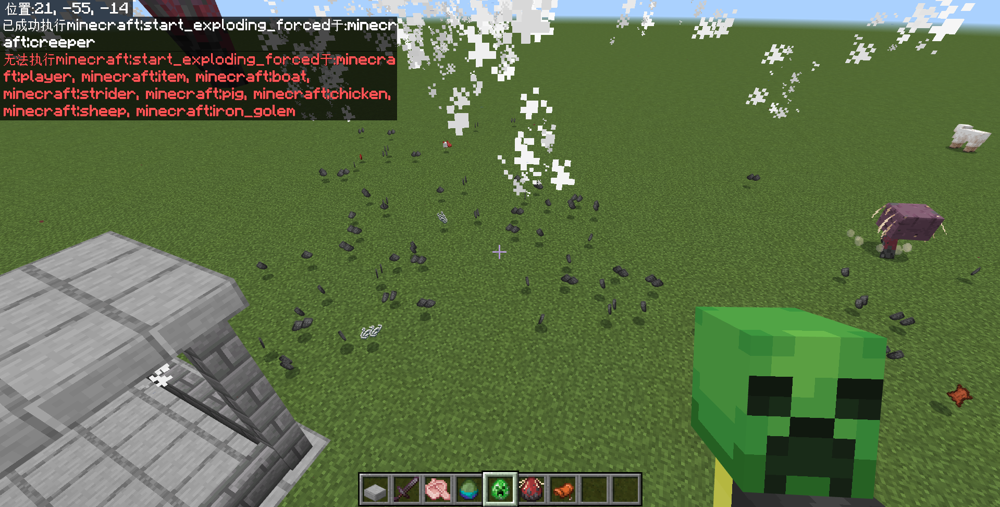

# 第二章小结

:::note[温馨提醒]

来看练习题答案的读者，[点我快速跳转](#练习问题答案)。

:::

好啦！到这里我们总算“费劲巴力”地把整个命令体系都给学习了一遍，相信你已经对命令能做到什么有了一个大体的印象。祝贺你！

我们这一章学习了非常非常多的命令，其中受限于没有对附加包的了解，所以我们在这一章也同样跳过了很多东西，但这并不妨碍你制作一张优秀的地图，或一个优秀的服务器的命令系统。

那么，学习了这么多的命令，你可能会想：我前脚刚学完，后脚就把语法给忘了，怎么办？

我跟你讲，**语法从来就不是限制你开发的最大阻碍**，不知道工具如何使用以及不知道如何写出一个完整的逻辑才是关键问题之所在。

整个第二章，我们只做了一件事——了解命令系统能做到什么。只有先有了一个基础了解，你才能不卡壳，不绕远路。在下一章，我们就要解决另一大难题——如何写出一个完整可靠的系统。

那么，现在我们来对这一整章的知识点进行回顾。

## 全部命令的语法

虽然说语法本身并不重要，但是在关键时刻能查到语法的能力却很重要。在前面经历了大大小小的练习的摧残之后，你现在是一定能看懂命令基础的语法的，比如参数描述、参数类型等等，知道什么地方应该填什么值。

**我们在这篇文档为你准备了一个工具——[附录：全部命令汇总](../appendix/all_commands)，其中我们详细地给出了极大多数的基岩版可用的命令，包括你已经学过的、没学过的，都在这里面，并且附带了详细的语法含义、教程位置、Wiki 链接等信息**。如果你使用电脑，你可以使用 Ctrl+F 快捷键快速查找你所需要的命令。

欢迎收藏这个网站哦 UwU

## 命令执行上下文

:::info[教程链接]

相关知识点位于 [2.3.1](./section3/subsection1) 和 [2.10](./section10#命令的权限等级)。见[命令上下文 - 中文 Minecraft Wiki](https://zh.minecraft.wiki/w/命令上下文) 了解更多。

:::

### 执行者

代表执行命令的对象。迄今为止我们学习的都是玩家作为原执行者。使用`/execute as`可以更改执行者为特定的实体。**应注意`as`不会改变其他上下文**。

### 执行环境参数

包括执行位置、执行朝向、执行维度。

执行位置是命令执行的位置，会影响`~~~`和`^^^`的判定方法，会影响诸多`位置: x y z`类型的参数的默认值，会影响目标选择器`x`、`y`、`z`的判定方法。使用`/execute`的`as`、`positioned`、`align`、`anchored`子命令都会改变执行位置。在很多情况下，执行者和执行位置要放在一起更改。

执行朝向是命令执行的朝向，会影响`^^^`的判定方法，会影响涉及到朝向的命令。使用`/execute`的`as`、`rotated`、`facing`子命令都会改变执行朝向。**应注意这些子命令不会改变执行者的朝向，必须使用`/tp`等命令更改**。

执行维度是命令执行的维度，会影响执行位置的判定方法。使用`/execute`的`as`、`in`子命令会改变执行维度。**应注意执行维度通常都要配合对应的位置参数使用**。

### 执行权限等级

决定命令是否能被特定的执行者执行。每条命令都有权限等级需求，只有执行者的权限等级大于等于该命令的需求时才能执行命令。绝大多数的命令的权限等级需求均为`1`，且要求开启作弊。

### 执行输出反馈

我们暂时还没有讲过这个，等到讲了命令方块之后你就能看到它的用途。不过目前，你只需要知道我们执行的绝大部分命令都会给你一个文本反馈，那也是输出反馈的一部分。

## 物品、方块和实体的状态表达

### 物品数据值

:::info[教程链接]

相关知识点位于 [2.2](./section2#物品数据值)。

:::

物品数据值（Item Aux Data）表达物品的不同状态。类型为`int`。

- 对于工具、盔甲等具有耐久值的物品来说，数据值等同于这个工具的损坏值。
- 对于一些具有历史遗留性的物品 ID，它们甚至可能会表达不同 ID 该物品。
  - 这是因为，后来这些物品的 ID 被拆分。
  - 例如桶`minecraft:bucket`，不同的数据值可能表达水桶、熔岩桶等。
- 其他普通的物品也可以拥有不同的数据值，只是不同数据值下的该物品表现为不可堆叠和可被检测之外，没有任何其他功能上的差别。
  - 例如钻石`minecraft:diamond`，不同数据值下的该物品仅仅表现为不可堆叠。

在各项命令中，物品数据值都要写入类似于`数据值: int`的参数中。

`-1`表达一切状态下的该物品。但是，这种写法仅限检测时可用。

常见的可用物品数据值的命令包括：`/give`、`/clear`、`/replaceitem`。

常见的可用物品数据值的目标选择器包括：`hasitem`的`data`参数。

### 方块状态

:::info[教程链接]

相关知识点位于 [2.8](./section8#方块状态)。

:::

方块状态（Block States）用于进一步定义方块的外观和行为，部分方块需要方块状态才能完全定义。在 Wiki 的特定的方块条目来查询方块状态允许的值，也可以使用 Minecraft 自带的自动补全。

方块状态需要以中括号包括，不同的方块状态需要以逗号分隔。每一个方块状态需要以`状态=值`的方法来表达，需要注意值的类型，为布尔值或数字时不能带上引号。即：`[<状态1>=<值1>,<状态2>=<值2>,...]`的写法。

方块状态往往不是必须的，通常可以不指定方块状态（无论这个参数在命令的什么位置），这时候游戏将选择一个默认值。例如，`<方块> <方块状态>`参数同时出现时，往往还有一个另一个语法可以只指定`<方块>`，所以事实上地来看，`方块状态`通常是一个可选参数。

### 目标选择器

本章学习的目标选择器参数主要为：

| 目标选择器参数（`参数=值`） | 取自于 | 意义 | 分类依据 | 备注 |
| :---: | --- | --- | :---: | --- |
| `m=<游戏模式: int\|GameMode>` | **M**ode | 筛选`游戏模式`的玩家 | 玩家数据 | |
| `rx=<x旋转最大值: float>` | **x R**otation | 筛选 x 旋转值小于`rx`的玩家 | 实体数据 | 永远不会到达`90` |
| `ry=<y旋转最大值: float>` | **y R**otation | 筛选 y 旋转值小于`ry`的玩家 | 实体数据 | |
| `rxm=<x旋转最小值: float>` | **M**inimum **x R**otation | 筛选 x 旋转值大于`rxm`的玩家 | 实体数据 | 永远不会到达`-90` |
| `rym=<x旋转最小值: float>` | **M**inimum **y R**otation | 筛选 y 旋转值大于`rym`的玩家 | 实体数据 | |
| `hasitem={...}`或`hasitem=[{...},{...},...]` | **Has Item** | 筛选满足`{...}`要求的物品的实体 | 实体数据 | `{...}`的含义见表格末尾 |
| `tag=<标签: string>` | **Tag** | 筛选拥有`标签`的实体 | 记分板参数 | 允许反选 |
| `scores={<记分项: string>=<值: integer range>,...}` | **Scores** | 筛选在`记分项`上的分数满足`值`的要求的实体 | 记分板参数 | |
| `haspermission={<权限: permission>=<状态: disabled\|enabled>,...}` | **Has Permission** | 筛选`权限`为`状态`的玩家 | 玩家数据 | |
| `l=<最大经验等级: int>` | **L**evel | 筛选经验等级小于等于`最大经验等级`的玩家 | 玩家数据 | |
| `lm=<最小经验等级: int>` | **M**inimum **L**evel | 筛选经验等级大于等于`最小经验等级`的玩家 | 玩家数据 | |

其中，`{...}`接受 5 个参数：

- `item`：**必选**，`Item`类型，指代检测的物品。
- `quantity`：可选，`integer range`类型，指代检测的物品数目。
- `location`：可选，`EntityEquipmentSlot`类型，指代检测的物品所在的槽位。
- `slot`：可选，`integer range`类型，必须搭配`location`使用，指代检测的物品所在的槽位的位置。
- `data`：可选，`int`类型，指代检测的物品的数据值。

## 旋转角度

:::info[教程链接]

相关知识点位于 [2.2](./section2#旋转角度)。

:::

用两组数值`y旋转`和`x旋转`可以确定一个实体的朝向信息，称为旋转角度。

`y旋转`代表在实体朝向的水平分量按顺时针顺序和南方组成的夹角。例如，北方为 180°，西方为 90°，东方为 -90°或270°。

`x旋转`代表在实体朝向的水平分量按顺时针顺序和南方组成的夹角。例如：完全抬头为 -90°，平视为 0°，完全低头为 90°（实际上不可能做到完全抬头或低头）。

常见的可用`y旋转`和`x旋转`的命令包括：`/execute rotated`、`/tp`、`/summon`、`/camera set`。

常见的可用物品数据值的目标选择器包括`rx`、`ry`、`rxm`、`rym`。

## 两种 JSON 组件

### 物品组件

:::info[教程链接]

相关知识点位于 [2.7](./section7#物品组件)。

:::

物品组件（Item Component）是用于进一步定义物品行为的组件。物品可以拥有（冒险模式）可破坏、（冒险模式）可放置、物品锁定、死亡保留，一共 4 种物品组件。各个物品组件写在花括号`{}`内，并由逗号分隔。

它们的类型为`json`，格式是固定的，分别为：

```json title="可破坏组件"
"can_destroy":{"blocks":["方块ID1","方块ID2",...]}
```

```json title="可放置组件"
"can_place_on":{"blocks":["方块ID1","方块ID2",...]}
```

```json title="物品锁定组件：锁定在物品栏"
"item_lock":{"mode":"lock_in_inventory"}
```

```json title="物品锁定组件：锁定在槽位"
"item_lock":{"mode":"lock_in_slot"}
```

```json title="死亡保留组件"
"keep_on_death":{}
```

### 文本组件

:::info[教程链接]

相关知识点位于 [2.9](./section9/subsection1#文本组件)。

:::

文本组件（Text Component）（或原始 JSON 文本，Raw JSON Text）是一种用来表达特定文本的组件，使用 JSON 格式。使用文本组件能够打印特定文本、实体名称、分值、或者使用格式化的文本。

一切的文本组件都要以`rawtext`格式开头，如下所示，其中`...`为不同组件的集合`组件1,组件2,...`：

```json title="rawtext文本组件"
{"rawtext":[...]}
```

普通文本组件为`text`，用于原样输出文本。

```json title="text组件"
{"text":"(文本)"}
```

选择器组件为`selector`，用于输出符合特定条件实体的名字。

```json title="selector组件"
{"selector":"(选择器)"}
```

分数组件为`score`，用于输出特定的分数。

```json title="score组件"
{"score":{"objective":"(记分项)","name":"(玩家)"}}
```

翻译组件为`translate`，用于输出语言文件的键名或格式化的文本。
    - 其中，`"with":["(值1)","(值2)",...]`的用法不会解析其中特殊值（例如`@s`等选择器）的含义，可将其视为`"with":{"rawtext":[{"text":"(值1)"},{"text":"(值2)"},...]}`
    - 文本中会查找`%%s`或`%%(索引)`格式，并将`with`里面在特定索引下的值代入
    - `%%`代表一个`%`，例如要输出`100%`，应写为`100%%`

```json title="translate组件"
{"translate":"(键名或文本)"}
{"translate":"(键名或文本)","with":["(值1)","(值2)",...]}
{"translate":"(键名或文本)","with":{"rawtext":[...]}}
```

## 游戏内时间的表达

Minecraft 中的一天，对应现实是 20 分钟，也就是 1200 秒，24000 游戏刻。

每 1000 游戏刻对应现实世界的 1 小时，并且 0 游戏刻对应 6:00。例如，游戏中的 12:00 对应为 6000 游戏刻。

## ID 查询工具

本章还介绍了一种由 ProjectXero 开发的 MCBEID 查询网站，开发者可以在这里快速地查询自己想要的 ID。地址为[https://ca.projectxero.top/idlist/](https://ca.projectxero.top/idlist/)。

---

## 思考问题答案

### 思考 2.2-1

> 为什么这里必须代表损坏值而非耐久值呢？

我们反过来想，如果是耐久值会出现什么后果？例如`/give @s diamond_sword`，这样的话，因为数据值默认为`0`，所以它会给你一把已经几乎没有耐久的剑，这并非我们预期的结果。不同的工具，耐久值都大不相同，如果要给一把满耐久的工具，就必须记住它的满耐久值；而且，实际应用中也是给予满耐久工具的情况居多。因此，数据值就必须代表损坏值。

顺带一提，在 Java 版中，物品并没有数据值一说（详见 2.2 关于物品数据值的历史问题），损坏值是用物品组件来指代的。可能在基岩版未来的某一天，数据值也会被移除，其中的特殊数据可能就会用`组件`来代替。不过可以肯定的是，现在离那一天应该还早。

### 思考 2.2-2

> `/give`能否给予一个负数值数据值的物品，例如`/give @a apple 1 -1`？试分析之并在游戏中验证你的想法。

答案是：不能。否则，`/give @a apple 1 -1`的含义就将变为给予所有玩家一个*任意数据值*的物品。反正换作让你干这活，你也得懵，所以游戏只能报错。给予一个物品必须给定一个特定的数据值，而不能是任意的数据值，这道理是很简单的。

### 思考 2.2-3

> 如果`m`能够指定多次，`@a[m=creative,m=survival,m=spectator]`能否实现`@a[m=!adventure]`相同的效果？

答案是：不能。这个目标选择器无论如何也找不到这样的玩家：既是创造模式、又是生存模式、又是旁观模式。不要忘记：**目标选择器参数之间的关系是“和”的关系，而不是“或”**。

### 思考 2.2-4

> 按照前文的逻辑，你能否分析`/tp Alex`的含义？提示：该命令中，`Alex`并不是`目标`。

答案：该命令将传送自己到 Alex 的位置上去。因为我们在前文中说，`目标`只要为`@s`时，这些命令就和没有`目标`的另外 5 条语法等价。

考虑到 5 条扩展语法中，都至少需要接收 2 个必选参数，而在这条命令中只给定了 1 个参数`Alex`，说明这里用的应当是不含`目标`的语法：

```text title="/tp传送执行者的语法" showLineNumbers
/tp <位置: target>
/tp <位置: x y z> [检查卡墙: Boolean]
/tp <位置: x y z> [y旋转: value] [x旋转: value] [检查卡墙: Boolean]
/tp <位置: x y z> facing <面向实体: target> [检查卡墙: Boolean]
/tp <位置: x y z> facing <面向坐标: x y z> [检查卡墙: Boolean]
```

其中，第一个参数接受`target`的语法，仅有`/tp <位置: target>`符合条件。因此，该命令将传送自己到 Alex 的位置上去。

需要注意的是，这条命令经常容易和`/tp <目标: target> <位置: target> [检查卡墙: Boolean]`搞混，尤其是在使用游戏给的 UI 时，即使不指定“何处”玩家，也能够成功执行，并且一般执行效果都是背离执行者的预期的（即误将待传送人指定为执行者，而传送位置误指定为待传送人的位置）。


### 思考 2.4-1

> 这时执行`/execute if entity @s[scores={data=!10..}]`是执行成功还是失败？试分析之并在游戏内验证。

答案：执行失败。因为此时`data.@s`=`15`，但该参数将找到**不**大于等于 10 的分数，也就是小于等于 9 分的分数，所以会执行失败。

### 思考 2.4-2

> 你可以只用`/scoreboard players operation`命令，完成两个变量的大小比较吗？比如，当`data.x`>`data.y`时，执行命令`/say 1`，但是不能用`/execute if score x data > y data`去检测！

答案：数学上存在一个公理：当 a-b>0 时，则 a>b。所以，在新版`/execute`更新之前，开发者们都是利用减法操作来判断变量的大小关系的。

所以，对于这里给出的问题，我们可以引入一个临时变量`data.temp`，让它等于`data.x`-`data.y`，如果这个临时变量等于 0，则证明它们相等；大于 0，则证明`data.x`>`data.y`；大于等于 0 则证明`data.x`≥`data.y`。

```mcfunction showLineNumbers
/scoreboard players operation temp data = x data
/scoreboard players operation temp data -= y data
/execute if score temp data matches 1.. run say 1
/scoreboard players reset temp data
```

当然，实际情况会比上面列出的还要复杂——如果考虑旧版`/execute`的环境的话，用假名这件事本身都会造成不便，所以通常`data.temp`是依附在一些实体上的分数，例如使用盔甲架。

### 思考 2.4-3

> 根据上面的思路，补齐检测爬行和睡觉的玩家的命令。

答案：

```mcfunction showLineNumbers
execute as @a at @s if entity @s[y=~1.6,dy=0.1] run scoreboard players set @s state 0
execute as @a at @s if entity @s[y=~1.3,dy=0.1] unless entity @s[y=~1.6,dy=0.1] run scoreboard players set @s state 1
execute as @a at @s if entity @s[y=~0.5,dy=0.1] unless entity @s[y=~1.3,dy=0.1] run scoreboard players set @s state 1
execute as @a at @s if entity @s[y=~0.1,dy=0.1] unless entity @s[y=~0.5,dy=0.1] run scoreboard players set @s state 1
```

### 思考 2.4-4

> 根据上面的思路，补齐小时的计时器的检测。使用分数`time.hour`。

答案：

```mcfunction showLineNumbers
execute if score minute time matches 60.. run scoreboard players add hour time 1
execute if score minute time matches 60.. run scoreboard players remove minute time 60
```

### 思考 2.4-5

> 这里，我们同样也使用了`reset *`的方法。按照前文所述的逻辑，在出现大量追踪对象的情况下，会造成很严重的卡顿。你能否按照前文所述的逻辑，对防退出重进逻辑的命令进行优化呢？

答案：同样采用直接移除记分板再添加的方法解决。

```mcfunction showLineNumbers
scoreboard players add @a isOnline 0
scoreboard objectives remove isOnline
scoreboard objectives add isOnline dummy "在线数据"
scoreboard players set @a isOnline 1
```

### 思考 2.6-1

> 执行`/summon armor_stand "a"`。你能看出这是使用了哪个语法吗？试分析这条命令的含义。

显然，这是使用了第一个语法`/summon <实体: EntityType> <名称: string> [生成位置: x y z]`，因为其他命令的第二个参数类型都是`x y z`，而`"a"`是一个`string`。

所以，这条命令是，在执行者的位置生成一个名为“a”的盔甲架。

### 思考 2.8-1

> 如果(0,-60,0)的方块是玻璃，执行`/setblock 0 -60 0 air destroy`会掉落什么出来？如果是黑曜石呢？基岩呢？做个实验来验证你的想法！

答案：玻璃和基岩不会掉落任何物品，黑曜石将原样掉落。玻璃和黑曜石无需多解释，因为基岩是无法被镐子破坏的，所以也不会掉落。

## 练习问题答案

### 练习 2.2

1. `/give @a[m=survival,rxm=85] dandelion 10`。注意低头的 x 旋转值范围为 85~90，所以我们需要指定`rxm`最小值为 85，而最大值 90 是永远不可能达到的，所以无需指定。
2. `/clear (玩家) dandelion -1 10`，数据值写为`0`亦可，因为一般而言，默认状态下的物品的数据值都是`0`。
3. （1）可行。因为玩家没有钻石时，`/clear`将执行失败；有 1 个钻石时，`/clear`将清除玩家的 1 个钻石并成功执行，因此能够按照预期执行；有大于 1 个钻石时，`/clear`将至多清除 1 颗钻石并成功执行，也能够按照预期执行。上述情况全部可以按照预期执行，因此可行。  
（2）不可行。玩家没有钻石时和玩家的钻石数量大于等于 2 时，这个逻辑都按照预期执行。然而，若玩家只有 1 颗钻石时，命令同样成功执行，这时玩家只需要用 1 颗钻石即可兑换，背离预期。在以前没有`hasitem`的时代，这也是在进行大数量清除时不能直接使用这套逻辑做商店的根本原因。
4. `/tp @a ~~~ -135 0`或`/tp @a ~~~ 225 0`，当然这条命令将会导致玩家的位置改变到你的位置上，不过正视东北方向还是正视了的。
5. `/weather clear`、`/time set noon`（为白天范围即可）
6. 命令 A：`/gamemode survival @a[m=creative]`  
命令 B：`/say §c你不能开启创造模式！`  
7. `/gamemode creative @a[m=spectator,rx=-85]`。注意抬头的 x 旋转值范围为 -90~-85，最小值为 -90 不可能达到，所以无需指定`rxm`；而最大值 -85 则用`rx=-85`指定。
8. `/kill @e[type=item]`

### 练习 2.3-1

1. `/execute as @a at @s run tp @s ~~~ -135 0`
2. `/execute as @e[type=enderman] at @s as @a[r=5] anchored eyes run tp @s ~~~`，注意末影人周围 5 格是针对其脚部位置而言的。
3. `/execute as @e[type=villager] at @s run kill @e[type=zombie,r=5]`
4. `/execute as @e[type=zombie] at @s rotated as @e[type=villager,name=Alex,c=1] run tp @s ~~~ ~~`（注意千万不要忘记后面的`~~`，更改执行朝向不等同于更改执行者的朝向！）
5. `/execute as @e[type=villager] at @s align xz positioned ~0.5~~0.5 run summon zombie`
6. `/execute as @e[type=sheep] at @s positioned as @e[type=cow,c=1] facing entity @e[x=0,y=0,z=0,c=1,type=pig] feet run tp @s ~~~~~`  
  或`/execute as @e[type=sheep] at @s positioned as @e[type=cow,c=1] run tp @s ~~~ facing @e[x=0,y=0,z=0,c=1,type=pig]`，答案不唯一。
7. 从左向右分析。  
第一条命令先更改执行者为所有实体，后更改执行环境参数为执行者的环境参数，执行将所有执行者向前传送 1 格的命令，因此该命令的含义为*将所有实体向其前方传送 1 格*。  
第二条命令的`at @s`没什么意义，可忽略（因为执行环境参数本身就已经是执行者的环境参数了），然后设置执行者为所有实体，执行将所有执行者向前传送 1 格的命令，因此该命令的含义为*将所有实体传送到原执行者前方 1 格*。
8. 进入下界：`/execute in nether run tp @s ~~~`  
  检测下界生物：`/execute in nether as @e[rm=0] run say 你们好，主世界的生物们！`
9. 命令 1：`/execute as @a[x=0,y=-60,z=0,r=1] run gamemode survival @s[m=creative]`  
  命令 2：`/execute as @a[x=0,y=-60,z=0,r=1] run tp 0 -60 3`  
  倒转后，因为先执行了`tp`命令导致玩家位置发生变化，一定会致使目标选择器检测失败，从而使得`gamemode`无法执行。因此，如果两条命令的顺序倒转，就无法再实现预定效果。

### 练习 2.3-2

1. `/execute if blocks -1 22 85 -1 22 85 10 5 7 all unless entity @e[type=item] if entity @e[type=skeleton] unless entity @a[hasitem={item=skeleton_spawn_egg}] run say 恭喜你获取进度！`  
  其中，`if blocks`写为`10 5 7 10 5 7 -1 22 85`也是正确的。
2. `/execute if block 73 0 -64 green_wool run say 恭喜你们获取了绿色羊毛，你离通关更近了一步！`
3. `/execute as @a at @s if block ~~-1~ red_concrete run kill @s`
4. `/execute if blocks 0 0 0 30 20 30 10000 0 10000`，答案合理即可。注意检测点的最高高度不得高于 300，因为该检测区域高达 20 格。
5. 命令 1：`/execute positioned 0 -60 0 if entity @a[r=2,hasitem={item=tripwire_hook}] run setblock 0 -61 0 redstone_block`  
  命令 2：`/execute positioned 0 -60 0 as @a[r=2,hasitem={item=tripwire_hook}] run clear @s tripwire_hook`  
  答案不唯一，合理即可。
6. `/execute if blocks -50 19 92 -50 19 92 -54 10 87 if block 19 22 7 cyan_terracotta run say [C3]通过本关后将获得纪念品[金锭]`
7. `/execute positioned -244 32 23 if entity @e[r=2,type=snowball] run tp @a ~~-2~ 180 0`

### 练习 2.4-1

1. 命令 1：`/execute as @e[type=snowball] at @s run tag @p[r=2] add menu`  
   命令 2：`/kill @e[type=snowball]`  
2. 命令 1：`/tag @a remove isAlive`  
   命令 2：`/tag @e[type=player] add isAlive`  
   命令 3：`/execute if entity @e[tag=!isAlive] run setblock 56 43 -79 redstone_block`
3. 命令 1：`give @a[tag=hasPickaxeUpgrade] diamond_pickaxe`  
   命令 2：`give @a[tag=!hasPickaxeUpgrade] iron_pickaxe`

### 练习 2.4-2

1. `/scoreboard objectives add time dummy "时间数据"`或`/scoreboard objectives add timeData dummy "时间数据"`
2. `/scoreboard objectives setdisplay sidebar time`或`/scoreboard objectives setdisplay sidebar timeData`
3. `/scoreboard objectives remove time`或`/scoreboard objectives remove timeData`

### 练习 2.4-3

1. `/execute if entity @a[tag=isAlive] if entity @a[tag=isInNether] run scoreboard players set advTemp data 0`
2. `/scoreboard players add tick time 1`
3. `/scoreboard players random luckyBlockEvent data 1 47`，只要范围内的数为 47 个即可。如果从 0 开始，应设置为`0 46`。
4. 1. `/scoreboard players add @a isOnline 0`  
   2. `/scoreboard players remove * isOnline`，**注意实际工程中一定要指代`isOnline`，否则将波及到其他记分板**！  
   3. `/scoreboard players set @a isOnline 1`  
   4. 退出重进玩家的`isOnline.@s`=`0`，应在第一条命令执行后执行该命令，因为在后两条命令中，将会影响所有玩家，使筛选出的分值的信息丢失。  
5. `/scoreboard players operation x data *= x data`
6. 1. `/scoreboard players operation x data += x data`  
   2. 不能用一条命令实现。可以用两条命令实现之：  
      1. `/scoreboard players set const10 data 10`
      2. `/scoreboard players operation x data *= const10 data`
7. 1. `/scoreboard players operation c data = a data`
   2. `/scoreboard players operation c data += b data`
8. 1. `/execute as @a at @s if block 0 -64 0 bedrock if block 0 128 0 air run scoreboard players set @s dimension 0`
   2. `/execute as @a at @s if block ~~-1~ netherrack run scoreboard players set @s dimension 1`
   3. `/execute as @a in the_end if entity @s[rm=0] run scoreboard players set @s dimension 2`

   显然，第 3 种原理更好，因为它不需要依靠任何外部条件（即世界中的方块），它们随时可能会被更改导致检测出现偏差。
9. `/execute if entity @a[tag=teamRed,hasitem={item=emerald}] run scoreboard players operation @r[tag=teamRed] data >< @r[tag=teamBlue] data`
10. `/scoreboard players operation teamRed teamScore -= teamBlue bedAmount`
11. 题目中出现了 3 个常数：3、-5和 100，先分别定义之：  

   ```mcfunction showLineNumbers
   /scoreboard players set const3 data 3
   /scoreboard players set const-5 data -5
   /scoreboard players set const100 data 100
   ```

   然后，分别计算第一项、第二项和第三项：

   ```mcfunction showLineNumbers
   /scoreboard players operation firstTerm data = x data
   /scoreboard players operation firstTerm data *= firstTerm data
   /scoreboard players operation firstTerm data *= firstTerm data
   /scoreboard players operation firstTerm data *= const3 data

   /scoreboard players operation secondTerm data = x data
   /scoreboard players operation secondTerm data *= const-5 data

   /scoreboard players operation thirdTerm data = const100 data
   /scoreboard players operation thirdTerm data /= x data
   ```

   最后，分别相加之：

   ```mcfunction showLineNumbers
   /scoreboard players operation y data += firstTerm data
   /scoreboard players operation y data += secondTerm data
   /scoreboard players operation y data += thirdTerm data
   ```

12. 对于这种数值分解，基本思路是：  
    （1）对于个位数，直接用 10 取模，例如 456%10=45……6，很快得到个位数 6；  
    （2）对于十位数，先用 10 整除，例如 456/10=45，然后将这个数用 10 取模，例如 45%10=4……5，得到十位数 5；  
    （3）对于百位以上数，直接用 100 整除，例如 3456/100=34，得到百位以上数字 34；  
    基于此，可以写出如下的代码。  

   ```mcfunction showLineNumbers
   # 定义常量 10 和 100
   /scoreboard players set const10 data 10
   /scoreboard players set const100 data 100
   # 个位数：data.gameId%10
   /scoreboard players operation singleDigit data = gameId data
   /scoreboard players operation singleDigit data %= const10 data
   # 十位数：data.gameId/10%10
   /scoreboard players operation demicalDigit data = gameId data
   /scoreboard players operation demicalDigit data /= const10 data
   /scoreboard players operation demicalDigit data %= const10 data
   # 百位数：data.gameId/100
   /scoreboard players operation hundredthDigit data = gameId data
   /scoreboard players operation hundredthDigit data /= const100 data
   ```

   事实上，这就是《冒险小世界：剑之试炼》使用的数值分解方法。

### 练习 2.4-4

1. `/execute if score adv1 advancement matches 0 if score adv0 advancement matches 1 if blocks -1 22 85 -1 22 85 10 5 7 all unless entity @e[type=item] if entity @e[type=skeleton] unless entity @a[hasitem={item=skeleton_spawn_egg}] run say 恭喜你获取进度！`
2. `/execute if score timeline time < parkour data run scoreboard players operation parkour data = timeline time`
3. 1. `/scoreboard players set playerAmount data 0`
   2. `/execute as @a run scoreboard players add playerAmount data 1`
   3. `/execute if score playerAmount data matches 14.. run scoreboard players remove startCountdown time 1`
   4. `/execute unless score playerAmount data matches 14.. run scoreboard players set startCountdown time 400`
4. 1. `/execute if block 30 65 60 air if score redBedState data matches 1 run say §c红队的床已被破坏！`，注意要加上`if score`的检测，否则循环执行时会导致该队床在被破坏情况下不断公告。
   2. `/execute if block 30 65 60 air if score redBedState data matches 1 run scoreboard players set redBedState data 0`
5. 1. `/tag @a remove isAlive`
   2. `/tag @e[type=player] add isAlive`
   3. `/execute as @a[tag=!isAlive,tag=teamRed,tag=!isEliminated] if score redBedState data matches 0 run tag @s add isEliminated`
6. 1. `/scoreboard players add tick time 1`
   2. `/execute if score tick time matches 60 run say Hello,world!`
7. 1. `/scoreboard players add @a isOnline 0`
   2. `/execute as @a[scores={isOnline=0},tag=vip] run say 欢迎玩家 @s 回到服务器`
   3. `/scoreboard players reset * isOnline`，这里也可以改为`scoreboard objectives remove isOnline`和`scoreboard objectives add isOnline dummy "在线数据"`，以防止追踪对象过多导致运行负载过大
   4. `/scoreboard players set @a isOnline 1`
8. 1. `/scoreboard players set @a[scores={deathState=!2}] deathState 1`
   2. `/scoreboard players set @e[type=player] deathState 0`
   3. `/scoreboard players add @a[scores={deathState=1}] deathCount 1`
   4. `/scoreboard players set @a[scores={deathState=1}] deathState 2`
   5. `/execute as @a[scores={deathCount=5..}] run say @s 闯关失败`
   6. `/scoreboard players set @a[scores={deathCount=5..}] deathCount 0`，以使玩家能够重新回到游戏。当然，按照题意，也可以不写这条命令。
9. 1. `/execute as @p if entity @s[hasitem={item=dirt}] run tag @s add lottery`
   2. `/execute as @p[tag=lottery] run scoreboard players random lottery data 1 10000`
   3. `/execute as @p[tag=lottery] if score lottery data matches 1 run give @s enchanted_golden_apple`
   4. `/execute as @p[tag=lottery] run clear @s dirt`
   5. `/tag @a remove lottery`
10. 1. `/scoreboard players set deadPlayerAmount data 0`
    2. `/tag @a remove isAlive`
    3. `/tag @e[type=player] add isAlive`
    4. `/execute as @a[tag=!isAlive] run scoreboard players add deadPlayerAmount data 1`
11. 事实上，这是地图中《冒险世界：筑梦》中的划船小游戏的基本原理。每通过一个记录点，就为`boatRace.@s`添加 1 分，达到 9 分时则通过。依据此原理，可以写出下面的命令。  
    首先，先写出经过第一个检查点的命令。在检查点附近检查记录为 0 的玩家，以及玩家附近是否有船，如果有则添加 1 分。

```mcfunction
execute positioned -52 60 82 as @a[r=2,scores={boatRace=0}] at @s if entity @e[type=boat,r=0.5] run scoreboard players add @s boatRace 1
```

这样，我们可以把另外 8 个检查点写出来。

```mcfunction title="参考答案1" showLineNumbers
execute positioned -52 60 82 as @a[r=2,scores={boatRace=0}] at @s if entity @e[type=boat,r=0.5] run scoreboard players add @s boatRace 1
execute positioned -4 60 76 as @a[r=2,scores={boatRace=1}] at @s if entity @e[type=boat,r=0.5] run scoreboard players add @s boatRace 1
execute positioned -63 60 106 as @a[r=2,scores={boatRace=2}] at @s if entity @e[type=boat,r=0.5] run scoreboard players add @s boatRace 1
execute positioned -52 60 82 as @a[r=2,scores={boatRace=3}] at @s if entity @e[type=boat,r=0.5] run scoreboard players add @s boatRace 1
execute positioned -4 60 76 as @a[r=2,scores={boatRace=4}] at @s if entity @e[type=boat,r=0.5] run scoreboard players add @s boatRace 1
execute positioned -63 60 106 as @a[r=2,scores={boatRace=5}] at @s if entity @e[type=boat,r=0.5] run scoreboard players add @s boatRace 1
execute positioned -52 60 82 as @a[r=2,scores={boatRace=6}] at @s if entity @e[type=boat,r=0.5] run scoreboard players add @s boatRace 1
execute positioned -4 60 76 as @a[r=2,scores={boatRace=7}] at @s if entity @e[type=boat,r=0.5] run scoreboard players add @s boatRace 1
execute positioned -63 60 106 as @a[r=2,scores={boatRace=8}] at @s if entity @e[type=boat,r=0.5] run say @s 完成了比赛！
```

现在我们寻求简化命令写法的方法。注意到`boatRace`=`0`、`3`、`6`时，其他执行环境都是类似的，因此我们可以用`boatRace=0..8,boatRace=!1..2,boatRace=!4..5,boatRace=!7..8`的方法来简化几条命令。同样的方法，也可以简化其他命令如下：

```mcfunction title="参考答案2" showLineNumbers
execute positioned -52 60 82 as @a[r=2,scores={boatRace=0..6,boatRace=!1..2,boatRace=!4..5}] at @s if entity @e[type=boat,r=0.5] run scoreboard players add @s boatRace 1
execute positioned -4 60 76 as @a[r=2,scores={boatRace=1..7,boatRace=!2..3,boatRace=!5..6}] at @s if entity @e[type=boat,r=0.5] run scoreboard players add @s boatRace 1
execute positioned -63 60 106 as @a[r=2,scores={boatRace=2..8,boatRace=!3..4,boatRace=!6..7}] at @s if entity @e[type=boat,r=0.5] run scoreboard players add @s boatRace 1
```

你可以看到上面和我们前面的推理稍微有些差别，但原理是类似的，你可以自行分析。我们还看到`as @a at @s if entity @e[type=boat,r=0.5]`的部分是类似的，都是用于检测玩家附近是否有船，即是否乘船的。这样，我们可以为这样的玩家添加一个标签：

```mcfunction title="参考答案3" showLineNumbers
tag @a remove ridingBoat
execute as @a at @s if entity @e[type=boat,r=0.5] run tag @s add ridingBoat
execute positioned -52 60 82 as @a[r=2,tag=ridingBoat,scores={boatRace=0..6,boatRace=!1..2,boatRace=!4..5}] run scoreboard players add @s boatRace 1
execute positioned -4 60 76 as @a[r=2,tag=ridingBoat,scores={boatRace=1..7,boatRace=!2..3,boatRace=!5..6}] run scoreboard players add @s boatRace 1
execute positioned -63 60 106 as @a[r=2,tag=ridingBoat,scores={boatRace=2..8,boatRace=!3..4,boatRace=!6..7}] run scoreboard players add @s boatRace 1
```

上面的答案都是可用的，使用何种思路看个人喜好。

12. 如果什么都不做，很显然这样的玩家加入后会错误地加入到下一局已经分配好的队伍中，导致队伍中凭空多出一人。而且，如果加入了本局中本不存在的队伍，有导致程序崩溃的风险。因此，必须处理退出重进的玩家的数据。

方法是，可以为每一局的游戏分配一个`gameId`，并让每名玩家分配与本局`gameId`相同的`gameId`。如果`gameId`不相同，则阻止玩家加入进游戏中，并移除该玩家的队伍信息等信息。这样，就可以防止退出重进的玩家影响下一局的情况发生。

首先是，对每局随机一个`gameId`。为了随机不会与以前重复，随机的范围要大，这里取 1000~9999。

```mcfunction
scoreboard players random this gameId 1000 9999
scoreboard players operation @a gameId = this gameId
```

这样，正常情况下，`gameId.@s`=`gameId.this`，其中`gameId.this`代表本局的`gameId`，而`gameId.@s`代表玩家的`gameId`。

如果玩家的`gameId`不符，则将其设为旁观者，并移除其其他信息。

```mcfunction
execute as @a unless score @s gameId = this gameId run gamemode spectator @s
execute as @a unless score @s gameId = this gameId run (移除数据的命令)
execute as @a unless score @s gameId = this gameId run scoreboard players operation @a gameId = this gameId
```

当然，这些可以放在退出重进的玩家的检测中。综上，只需要将以下的命令循环执行即可。

```mcfunction title="本题参考答案"
scoreboard players random this gameId 1000 9999
scoreboard players operation @a gameId = this gameId

scoreboard players add @a isOnline 0
execute as @a[scores={isOnline=0}] unless score @s gameId = this gameId run gamemode spectator @s
execute as @a[scores={isOnline=0}] unless score @s gameId = this gameId run (移除数据的命令)
execute as @a[scores={isOnline=0}] unless score @s gameId = this gameId run scoreboard players operation @a gameId = this gameId
scoreboard players reset * isOnline
# 或者可以使用下面两条命令
# scoreboard objectives remove isOnline
# scoreboard objectives add isOnline dummy "在线数据"
scoreboard players set @a isOnline 1
```

### 练习 2.5

1. 下面的命令，游戏规则写为全小写也是正确的，因为基岩版并不区分大小写。
   1. `/gamerule keepInventory true`
   2. `/gamerule doDayLightCycle false`和`/gamerule doWeatherCycle false`
   3. `/gamerule doMobSpawning false`和`/gamerule mobGriefing false`
   4. `/gamerule tntExplodes false`
   5. `/gamerule doMobLoot false`和`/gamerule doEntityDrops true`
   6. `/gamerule doImmediateRespawn true`
   7. `/gamerule showCoordinates true`和`/gamerule showDaysPlayed true`
   8. `/gamerule fallDamage false`、`/gamerule drowningDamage false`、`/gamerule fireDamage false`和`/gamerule freezeDamage true`
   9. `/gamerule sendCommandFeedBack false`
   10. `/mobevent minecraft:wandering_trader_event false`
2. `/tickingarea add 50 0 50 90 0 90 example`
3. `/execute if score level data matches 24 run difficulty easy`
4. 1. `/scoreboard players random weather data 1 3`
   2. `/execute if score weather data matches 1 run weather clear`
   3. `/execute if score weather data matches 2 run weather rain`
   4. `/execute if score weather data matches 3 run weather thunder`
5. `/time add 120`，因为一天为 24000 游戏刻，10 秒为 200 游戏刻，所以每一个游戏刻都要让世界时间加快 24000/200=120 游戏刻。

### 练习 2.6-1

1. 命令如下。高亮部分为假名的写法。和假名对比，还是假名更加便捷一些，然而如果要调用分数的时候，则将数据存储在实体上可能会具有独特的优势。

```mcfunction showLineNumbers {4-5}
/summon armor_stand playerAmount 0 0 0
/scoreboard players set @e[name=playerAmount,type=armor_stand] data 0
/execute as @a run scoreboard players add @e[name=playerAmount,type=armor_stand] data 1
/scoreboard players set playerAmount data 0
/execute as @a run scoreboard players add playerAmount data 1
```

2. `/summon villager ~~~~~ minecraft:spawn_librarian`
3. `/summon tnt ~~~~~ from_explosion`
4. 命令如下。

```mcfunction showLineNumbers
/execute as @e[name=spawner] at @s run summon creeper ~~~
/kill @e[name=spawner]
```

### 练习 2.6-2

1. `/event entity @e[type=creeper] minecraft:start_exploding`或`/event entity @e[type=creeper] minecraft:start_exploding_force`  
   嗯……我是不会告诉你我其实是个熊孩子的！（资源包为 Actions&Stuff）  
   
2. `/execute as @a at @s if entity @a[rm=0.01,r=1] run effect @s invisibility 1 0 true`
3. `/effect @a instant_health 5 100 true`和`/damage @a 15`
4. `/effect @a clear poison`和`/effect @a poison 0 100 true`
5. `/damage @e[type=drowned] 1 drowning`和`/damage @e[type=chicken] 1 fall`，其中对鸡的伤害是无效的。失败原因在模块 3 会详细说明——这是由`minecraft:damage_sensor`组件决定的。

### 练习 2.6-3

1. 1. `/execute as @a[x=0,y=-60,z=0,r=2] run inputpermission set @s movement disabled`
   2. `/execute as @a[x=0,y=-60,z=0,r=2] run inputpermission set @s camera disabled`
   3. `/execute as @a[x=0,y=-60,z=0,r=2] at @s run tp @s ~~~ facing @e[type=villager,c=1]`
2. `/scoreboard players set @a[haspermission={sneak=disabled}] state 0`
3. `/execute as @a[x=0,y=26,z=0,r=2] if score allowCheat data matches 0 run gamemode adventure @s`
4. 1. `/xp 1L @a[hasitem={item=iron_ingot}]`、`/clear @a[hasitem={item=iron_ingot}] iron_ingot -1 1`
   2. `/execute as @p run give @s[lm=400] diamond_sword`、`/execute as @p run xp -400L @s[lm=400]`，套一个`/execute as @p`的主要理由是，`@p[lm=400]`会直接找到最近的经验等级为 400 的玩家，而不是检查最近的玩家是否拥有 400 经验。
5. 1. `/gamerule doImmediateRespawn true`、`/spawnpoint @a 0 100 0`
   2. `/tag @a remove isAlive`、`/tag @e[type=player] add isAlive`、`/scoreboard players set @a[tag=!isAlive,scores={team=1}] respawn 100`、`/gamemode spectator @a[tag=!isAlive,scores={team=1}`
   3. `/scoreboard players remove @a[scores={team=1,respawn=1..}] respawn 1`（注意写为`respawn=1..`，因为题干要求是大于而非大于等于）
   4. `/tp @a[scores={team=1,respawn=0},m=spectator] 30 60 30`、`/gamemode adventure @a[scores={team=1,respawn=0},m=spectator]`（注意`gamemode`写在后面，否则条件的变更会导致`tp`执行失败）
6. `/setworldspawn 0 -60 0`
7. 1. `/summon armor_stand "spawnpoint"`
   2. `/spreadplayers 0 0 0 10000 @e[type=armor_stand,name=spawnpoint]`
   3. `/execute as @e[type=armor_stand,name=spawnpoint] at @s run spawnpoint @a ~~~`

   但是，这个原理实际上无法奏效，因为区块未加载时也同样检测不到符合要求的实体。这个思路仍需优化才能实际应用。

### 练习 2.7

1. 命令如下：

   ```mcfunction showLineNumbers
   tag @a[hasitem={item=crafting_table}] add hasCraftingTable
   clear @a[tag=hasCraftingTable] crafting_table
   give @a[tag=hasCraftingTable] crafting_table 1 0 {"can_place_on":{"blocks":["emerald_block"]}}
   ```

   需要注意`/clear`必须写在`/give`的前面，否则后执行`/clear`的话存在将刚给予的工作台清除的风险。因此，不能直接写为`give @a[hasitem={item=crafting_table}] ...`，因为此时工作台已被清除。
2. `/give @a[hasitem=[{item=wooden_sword,quantity=0},{item=stone_sword,quantity=0}]] wooden_sword 1 0 {"item_lock":{"mode":"lock_in_inventory"}}`
3. `/replaceitem entity @a slot.hotbar 8 snowball 2 0 {"item_lock":{"mode":"lock_in_slot"}}`  
   为了防止`/replaceitem`始终执行，可以加一个限定条件，仅限最后一位非 2 个雪球的玩家执行，而有 2 个雪球的玩家则阻止其执行：  
   `/replaceitem entity @a[hasitem={item=snowball,quantity=!2,location=slot.hotbar,slot=8}] slot.hotbar 8 snowball 2 0 {"item_lock":{"mode":"lock_in_slot"}}`
4. 命令如下，这是检测玩家是否没有物品的一个思路。注意：考虑到循环执行时，`replaceitem`命令会不断执行，而且一直给予基岩会让玩家看出检测痕迹，所以这三条命令不能循环执行，只能视情况一次执行。

   ```mcfunction showLineNumbers
   replaceitem entity @a slot.weapon.mainhand 0 keep bedrock
   tag @a[hasitem={item=bedrock}] add mainhandWithNoItem
   clear @a[hasitem={item=bedrock}] bedrock
   ```

5. `/replaceitem block 0 -60 0 slot.container 22 beacon`，将 22 改为 31 亦可，将`0 -60 0`改为`1 -60 0`亦可。
6. `/enchant @a lure 3`
7. `/give @a[hasitem={item=iron_pickaxe,quantity=0}] iron_pickaxe 1 0 {"can_destroy":{"blocks":["stone","decorated_pot"]}}`
8. 命令如下：

   ```mcfunction showLineNumbers
   tag @a[hasitem=[{item=diamond_helmet},{item=diamond_helmet,quantity=0,location=slot.armor.head}]] add notWearingHelmet
   clear @a[tag=notWearingHelmet] diamond_helmet
   replaceitem entity @a[tag=notWearingHelmet] slot.armor.head 0 diamond_helmet
   tag @a remove notWearingHelmet
   ```

### 练习 2.8

1. `/execute positioned -13 2 86 if block ~~~ stone_button ["facing_direction"=2,"button_pressed_bit"=true] run setblock ~~~ stone_button ["facing_direction"=2]`
2. 1. `/execute if score timeline time matches 120 run fill -40 12 28 -9 9 26 air destroy`
   2. `/execute if score timeline time matches 120 run kill @e[type=item]`
3. `/execute if block -46 21 55 lit_redstone_lamp positioned -49 25 60 if block ~~~ magma run setblock ~~~ flowing_lava`
4. `/execute if score getDiamondPickaxe data matches 1 if entity @a[hasitem={item=diamond_pickaxe,quantity=0}] positioned -257 -32 106 run clone ~~~~~~~~3~`
5. `/execute positioned -145 -43 -33 if block ~~~ stone_button ["facing_direction"=1,"button_pressed_bit"=true] run summon minecart ~1~-1~`
6. `/execute unless block -2 26 3 redstone_wire ["redstone_signal"=0] if block 20 22 7 quartz_pillar ["pillar_axis"="y"] run say 已解锁新关卡`

### 练习 2.9-1

1. ```mcfunction title="高亮部分为相比于给定的参考答案改动的地方" showLineNumbers {1-3}
   tag @a remove overworld
   execute in overworld as @a[rm=0] run tag @a add overworld
   execute in nether as @e[rm=0] run tellraw @a[tag=overworld] {"rawtext":[{"text":"你们好，主世界的生物们！"}]}
   ```

2. ```mcfunction title="高亮部分为相比于给定的参考答案改动的地方" showLineNumbers {1-3}
   execute if block 30 65 60 air if score redBedState data matches 1 run tellraw @a[scores={team=1}] {"rawtext":[{"text":"§c你的床已被破坏！"}]}
   execute if block 30 65 60 air if score redBedState data matches 1 run tellraw @a[scores={team=!1}] {"rawtext":[{"text":"§c红队的床已被破坏！"}]}
   execute if block 30 65 60 air if score redBedState data matches 1 run title @a[scores={team=1}] title §l床已被破坏！
   execute if block 30 65 60 air if score redBedState data matches 1 run scoreboard players set redBedState data 0
   ```

3. ```mcfunction title="高亮部分为相比于给定的参考答案改动的地方" showLineNumbers {2-3}
   scoreboard players add @a isOnline 0
   execute as @a[scores={isOnline=0},tag=vip] run tellraw @a {"rawtext":[{"translate":"§lxxx服务器 >> §r§e欢迎 %%s 回到服务器","with":{"rawtext":[{"selector":"@s"}]}}]}
   execute as @a[scores={isOnline=0},tag=vip] run title @a title §b欢迎回到服务器！
   scoreboard objectives remove isOnline
   scoreboard objectives add isOnline dummy "在线数据"
   scoreboard players set @a isOnline 1
   ```

4. ```mcfunction title="变量定义" showLineNumbers
   scoreboard objectives add health dummy "剩余生命"
   scoreboard players set const5 health 5
   ```

   ```mcfunction title="玩家死亡时执行" showLineNumbers
   execute as @a[scores={deathCount=1..4}] run scoreboard players operation @s health = const5 health
   execute as @a[scores={deathCount=1..4}] run scoreboard players operation @s health -= @s deathCount
   execute as @a[scores={deathCount=1..4}] run tellraw @s {"rawtext":[{"translate":"§7你已经死亡 %%s 次了，再死亡 %%s 次你将失败！","with":{"rawtext":[{"score":{"objective":"deathCount","name":"@s"}},{"score":{"objective":"health","name":"@s"}}]}}]}

   execute as @a[scores={deathCount=5..}] run tellraw @s {"rawtext":[{"text":"§c闯关失败！重来一次吧！"}]}
   execute as @a[scores={deathCount=5..}] run title @s title §l§c闯关失败！
   execute as @a[scores={deathCount=5..}] run §7重来一次吧！
   execute as @a[scores={deathCount=5..}] run scoreboard players set @s deathCount 0
   ```

5. ```mcfunction showLineNumbers
   title @a times 0 60 0
   execute as @a at @s if entity @e[type=zombie,r=7] run title @s title §1
   execute as @a at @s if entity @e[type=zombie,r=7] run title @s subtitle §c§l跑！
   ```

6. ```mcfunction showLineNumbers
   scoreboard players add timeline time 1
   execute if score timeline time matches 1 run title @a title §l主 线 已 完 成
   execute if score timeline time matches 41 run title @a subtitle §b结束屋已开放
   ```

7. ```mcfunction showLineNumbers
   scoreboard players set const60 record 60
   scoreboard players set const20 record 20
   scoreboard players set const5 record 5
   ## 获取秒数，为游戏刻数/20（例如810刻/20=40秒）
   scoreboard players operation second record = @p record
   scoreboard players operation second record /= const20 record
   ## 获取毫秒数，为游戏刻数%20*5（例如810刻%20=10,10*5=50毫秒）
   scoreboard players operation millisecond record = @p record
   scoreboard players operation millisecond record %= const20 record
   scoreboard players operation millisecond record *= const5 record
   ## 获取分钟，为秒数/60（例如125秒/60=2分钟）
   scoreboard players operation minute record = second record
   scoreboard players operation minute record /= const60 record
   ## 输出
   tellraw @a {"rawtext":[{"translate":"§b你的记录为%%s:%%s.%%s","with":{"rawtext":[{"score":{"objective":"record","name":"minute"}},{"score":{"objective":"record","name":"second"}},{"score":{"objective":"record","name":"millisecond"}}]}}]}
   ```

8. ```mcfunction showLineNumbers
   ## 计算两队分数
   execute as @a[scores={team=0}] run scoreboard players operation redTeam coin += @s coin
   execute as @a[scores={team=1}] run scoreboard players operation blueTeam coin += @s coin
   ## 比对后显示分数
   execute if score redTeam coin > blueTeam coin as @a run titleraw @s actionbar {"rawtext":[{"translate":"你的名字 %%s | 金币 %%s | 击杀 %%s | 死亡 %%s | 优势队伍 红队","with":{"rawtext":[{"selector":"@s"},{"score":{"objective":"coin","name":"@s"}},{"score":{"objective":"killCount","name":"@s"}},{"score":{"objective":"deathCount","name":"@s"}}]}}]}
   execute if score redTeam coin < blueTeam coin as @a run titleraw @s actionbar {"rawtext":[{"translate":"你的名字 %%s | 金币 %%s | 击杀 %%s | 死亡 %%s | 优势队伍 蓝队","with":{"rawtext":[{"selector":"@s"},{"score":{"objective":"coin","name":"@s"}},{"score":{"objective":"killCount","name":"@s"}},{"score":{"objective":"deathCount","name":"@s"}}]}}]}
   ```

### 练习 2.9-2

1. `/camera @s fade time 1 9 1 color 11 45 14`，注意`time`必须写在`color`前面，别被这条命令臭懵了。>:)
2. `/camera @s set minecraft:third_person`
3. `/camera @s set minecraft:free ease 3 in_out_sine pos 17 -24 89 facing 17 -24 95`
4. `/camera @s set minecraft:free ease 3 in_quad pos 17 -24 89 rot 90 0`
5. `/camera @s set minecraft:free ease 3 linear pos 17 -24 89 facing 17 -60 89`
6. `/camerashake @s 1 6 rotational`
7. `/hud @s hide health`

8. ```text title="每游戏刻执行，命令条数要求固定" showLineNumbers
   execute if score timeline time matches 1060 run camera @a set minecraft:free ease 3 in_out_quad pos -237 33 130 facing -247 35 130
   execute if score timeline time matches 1420 as @a at @s anchored eyes run camera @a set minecraft:free ease 3 in_out_quad pos ^^^0.5 facing ^^^1
   execute if score timeline time matches 1460 run camera @a clear
   execute if score timeline time matches 1460 run inputpermission set @a camera enabled
   execute if score timeline time matches 1460 run inputpermission set @a movement enabled
   ```

### 练习 2.9-3

1. ```text showLineNumbers
   scoreboard players add sound time 1
   execute if score sound time matches 3 as @a at @s run playsound random.orb @s ~~~
   ```

   必须加`as @a at @s`，如果只写为`... matches 3 run playsound ... @a ~~~`视为错误。读者可自行分析其中缘由。

2. `playsound beacon.activate`
3. `playsound random.glass`

4. ```text showLineNumbers
   playsound random.explode @a 10 10 10
   particle minecraft:huge_explosion_emitter 10 10 10
   ```

   使用的粒子合理即可，但必须经过游戏内验证。

5. `/execute as @e[type=snowball] at @s run particle minecraft:endrod`
