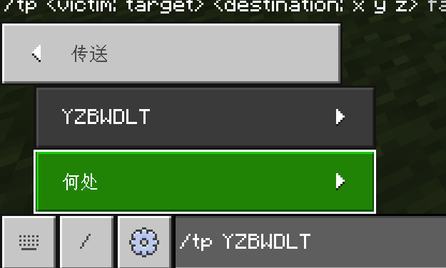

# 第二章小结

## 思考问题答案

:::info[思考 2.2-1：为什么`数据值`必须代表损坏值而不能代表耐久值？]

> 为什么这里必须代表损坏值而非耐久值呢？

我们反过来想，如果是耐久值会出现什么后果？例如`/give @s diamond_sword`，这样的话，因为数据值默认为`0`，所以它会给你一把已经几乎没有耐久的剑，这并非我们预期的结果。不同的工具，耐久值都大不相同，如果要给一把满耐久的工具，就必须记住它的满耐久值；而且，实际应用中也是给予满耐久工具的情况居多。因此，数据值就必须代表损坏值。

顺带一提，在 Java 版中，物品并没有数据值一说（详见上文关于物品数据值的历史问题），损坏值是用物品组件来指代的。可能在基岩版未来的某一天，数据值也会被移除，其中的特殊数据可能就会用`组件`来代替。不过可以肯定的是，现在离那一天应该还早。

:::

:::info[思考 2.2-2]

> `/give`能否给予一个负数值数据值的物品，例如`/give @a apple 1 -1`？试分析之并在游戏中验证你的想法。

答案是：不能。否则，`/give @a apple 1 -1`的含义就将变为给予所有玩家一个*任意数据值*的物品。反正换作让你干这活，你也得懵，所以游戏只能报错。给予一个物品必须给定一个特定的数据值，而不能是任意的数据值，这道理是很简单的。

:::

:::info[思考 2.2-3]

> 如果`m`能够指定多次，`@a[m=creative,m=survival,m=spectator]`能否实现`@a[m=!adventure]`相同的效果？

答案是：不能。这个目标选择器无论如何也找不到这样的玩家：既是创造模式、又是生存模式、又是旁观模式。不要忘记：**目标选择器参数之间的关系是“和”的关系，而不是“或”**。

:::

:::info[思考 2.2-4]

> 按照前文的逻辑，你能否分析`/tp Alex`的含义？提示：该命令中，`Alex`并不是`目标`。

答案：该命令将传送自己到 Alex 的位置上去。因为我们在前文中说，`目标`只要为`@s`时，这些命令就和没有`目标`的另外 5 条语法等价。

考虑到 5 条扩展语法中，都至少需要接收 2 个必选参数，而在这条命令中只给定了 1 个参数`Alex`，说明这里用的应当是不含`目标`的语法：

```text title="/tp传送执行者的语法" showLineNumbers
/tp <位置: target>
/tp <位置: x y z> [检查卡墙: Boolean]
/tp <位置: x y z> [y旋转: value] [x旋转: value] [检查卡墙: Boolean]
/tp <位置: x y z> facing <面向实体: target> [检查卡墙: Boolean]
/tp <位置: x y z> facing <面向坐标: x y z> [检查卡墙: Boolean]
```

其中，第一个参数接受`target`的语法，仅有`/tp <位置: target>`符合条件。因此，该命令将传送自己到 Alex 的位置上去。

需要注意的是，这条命令经常容易和`/tp <目标: target> <位置: target> [检查卡墙: Boolean]`搞混，尤其是在使用游戏给的 UI 时，即使不指定“何处”玩家，也能够成功执行，并且一般执行效果都是背离执行者的预期的（即误将待传送人指定为执行者，而传送位置误指定为待传送人的位置）。



:::

:::info[思考 2.4-1]

> 这时执行`/execute if entity @s[scores={data=!10..}]`是执行成功还是失败？试分析之并在游戏内验证。

答案：执行失败。因为此时`data.@s`=`15`，但该参数将找到**不**大于等于 10 的分数，也就是小于等于 9 分的分数，所以会执行失败。

:::

:::info[思考 2.4-2]

> 你可以只用`/scoreboard players operation`命令，完成两个变量的大小比较吗？比如，当`data.x`>`data.y`时，执行命令`/say 1`，但是不能用`/execute if score x data > y data`去检测！

答案：数学上存在一个公理：当 a-b>0 时，则 a>b。所以，在新版`/execute`更新之前，开发者们都是利用减法操作来判断变量的大小关系的。

所以，对于这里给出的问题，我们可以引入一个临时变量`data.temp`，让它等于`data.x`-`data.y`，如果这个临时变量等于 0，则证明它们相等；大于 0，则证明`data.x`>`data.y`；大于等于 0 则证明`data.x`≥`data.y`。

```mcfunction showLineNumbers
/scoreboard players operation temp data = x data
/scoreboard players operation temp data -= y data
/execute if score temp data matches 1.. run say 1
/scoreboard players reset temp data
```

当然，实际情况会比上面列出的还要复杂——如果考虑旧版`/execute`的环境的话，用假名这件事本身都会造成不便，所以通常`data.temp`是依附在一些实体上的分数，例如使用盔甲架。

:::

:::info[思考 2.4-3]

> 根据上面的思路，补齐检测爬行和睡觉的玩家的命令。

答案：

```mcfunction showLineNumbers
execute as @a at @s if entity @s[y=~1.6,dy=0.1] run scoreboard players set @s state 0
execute as @a at @s if entity @s[y=~1.3,dy=0.1] unless entity @s[y=~1.6,dy=0.1] run scoreboard players set @s state 1
execute as @a at @s if entity @s[y=~0.5,dy=0.1] unless entity @s[y=~1.3,dy=0.1] run scoreboard players set @s state 1
execute as @a at @s if entity @s[y=~0.1,dy=0.1] unless entity @s[y=~0.5,dy=0.1] run scoreboard players set @s state 1
```

:::

:::info[思考 2.4-4]

> 根据上面的思路，补齐小时的计时器的检测。使用分数`time.hour`。

答案：

```mcfunction showLineNumbers
execute if score minute time matches 60.. run scoreboard players add hour time 1
execute if score minute time matches 60.. run scoreboard players remove minute time 60
```

:::

:::info[思考 2.4-5]

> 这里，我们同样也使用了`reset *`的方法。按照前文所述的逻辑，在出现大量追踪对象的情况下，会造成很严重的卡顿。你能否按照前文所述的逻辑，对防退出重进逻辑的命令进行优化呢？

答案：同样采用直接移除记分板再添加的方法解决。

```mcfunction showLineNumbers
scoreboard players add @a isOnline 0
scoreboard objectives remove isOnline
scoreboard objectives add isOnline dummy "在线数据"
scoreboard players set @a isOnline 1
```

:::

## 练习问题答案

:::info[练习 2.2]

1. `/give @a[m=survival,rxm=85] dandelion 10`。注意低头的 x 旋转值范围为 85~90，所以我们需要指定`rxm`最小值为 85，而最大值 90 是永远不可能达到的，所以无需指定。
2. `/clear (玩家) dandelion -1 10`，数据值写为`0`亦可，因为一般而言，默认状态下的物品的数据值都是`0`。
3. （1）可行。因为玩家没有钻石时，`/clear`将执行失败；有 1 个钻石时，`/clear`将清除玩家的 1 个钻石并成功执行，因此能够按照预期执行；有大于 1 个钻石时，`/clear`将至多清除 1 颗钻石并成功执行，也能够按照预期执行。上述情况全部可以按照预期执行，因此可行。  
（2）不可行。玩家没有钻石时和玩家的钻石数量大于等于 2 时，这个逻辑都按照预期执行。然而，若玩家只有 1 颗钻石时，命令同样成功执行，这时玩家只需要用 1 颗钻石即可兑换，背离预期。在以前没有`hasitem`的时代，这也是在进行大数量清除时不能直接使用这套逻辑做商店的根本原因。
4. `/tp @a ~~~ -135 0`或`/tp @a ~~~ 225 0`，当然这条命令将会导致玩家的位置改变到你的位置上，不过正视东北方向还是正视了的。
5. `/weather clear`、`/time set noon`（为白天范围即可）
6. 命令 A：`/gamemode survival @a[m=creative]`  
命令 B：`/say §c你不能开启创造模式！`  
7. `/gamemode creative @a[m=spectator,rx=-85]`。注意抬头的 x 旋转值范围为 -90~-85，最小值为 -90 不可能达到，所以无需指定`rxm`；而最大值 -85 则用`rx=-85`指定。
8. `/kill @e[type=item]`

:::

:::info[练习 2.3-1]

1. `/execute as @a at @s run tp @s ~~~ -135 0`
2. `/execute as @e[type=enderman] at @s as @a[r=5] anchored eyes run tp @s ~~~`，注意末影人周围 5 格是针对其脚部位置而言的。
3. `/execute as @e[type=villager] at @s run kill @e[type=zombie,r=5]`
4. `/execute as @e[type=zombie] at @s rotated as @e[type=villager,name=Alex,c=1] run tp @s ~~~ ~~`（注意千万不要忘记后面的`~~`，更改执行朝向不等同于更改执行者的朝向！）
5. `/execute as @e[type=villager] at @s align xz positioned ~0.5~~0.5 run summon zombie`
6. `/execute as @e[type=sheep] at @s positioned as @e[type=cow,c=1] facing entity @e[x=0,y=0,z=0,c=1,type=pig] feet run tp @s ~~~~~`  
  或`/execute as @e[type=sheep] at @s positioned as @e[type=cow,c=1] run tp @s ~~~ facing @e[x=0,y=0,z=0,c=1,type=pig]`，答案不唯一。
7. 从左向右分析。  
第一条命令先更改执行者为所有实体，后更改执行环境参数为执行者的环境参数，执行将所有执行者向前传送 1 格的命令，因此该命令的含义为*将所有实体向其前方传送 1 格*。  
第二条命令的`at @s`没什么意义，可忽略（因为执行环境参数本身就已经是执行者的环境参数了），然后设置执行者为所有实体，执行将所有执行者向前传送 1 格的命令，因此该命令的含义为*将所有实体传送到原执行者前方 1 格*。
8. 进入下界：`/execute in nether run tp @s ~~~`  
  检测下界生物：`/execute in nether as @e[rm=0] run say 你们好，主世界的生物们！`
9. 命令 1：`/execute as @a[x=0,y=-60,z=0,r=1] run gamemode survival @s[m=creative]`  
  命令 2：`/execute as @a[x=0,y=-60,z=0,r=1] run tp 0 -60 3`  
  倒转后，因为先执行了`tp`命令导致玩家位置发生变化，一定会致使目标选择器检测失败，从而使得`gamemode`无法执行。因此，如果两条命令的顺序倒转，就无法再实现预定效果。

:::

:::info[练习 2.3-2]

1. `/execute if blocks -1 22 85 -1 22 85 10 5 7 all unless entity @e[type=item] if entity @e[type=skeleton] unless entity @a[hasitem={item=skeleton_spawn_egg}] run say 恭喜你获取进度！`  
  其中，`if blocks`写为`10 5 7 10 5 7 -1 22 85`也是正确的。
2. `/execute if block 73 0 -64 green_wool run say 恭喜你们获取了绿色羊毛，你离通关更近了一步！`
3. `/execute as @a at @s if block ~~-1~ red_concrete run kill @s`
4. `/execute if blocks 0 0 0 30 20 30 10000 0 10000`，答案合理即可。注意检测点的最高高度不得高于 300，因为该检测区域高达 20 格。
5. 命令 1：`/execute positioned 0 -60 0 if entity @a[r=2,hasitem={item=tripwire_hook}] run setblock 0 -61 0 redstone_block`  
  命令 2：`/execute positioned 0 -60 0 as @a[r=2,hasitem={item=tripwire_hook}] run clear @s tripwire_hook`  
  答案不唯一，合理即可。
6. `/execute if blocks -50 19 92 -50 19 92 -54 10 87 if block 19 22 7 cyan_terracotta run say [C3]通过本关后将获得纪念品[金锭]`
7. `/execute positioned -244 32 23 if entity @e[r=2,type=snowball] run tp @a ~~-2~ 180 0`

:::

:::info[练习 2.4-1]

1. 命令 1：`/execute as @e[type=snowball] at @s run tag @p[r=2] add menu`  
   命令 2：`/kill @e[type=snowball]`  
2. 命令 1：`/tag @a remove isAlive`  
   命令 2：`/tag @e[type=player] add isAlive`  
   命令 3：`/execute if entity @e[tag=!isAlive] run setblock 56 43 -79 redstone_block`
3. 命令 1：`give @a[tag=hasPickaxeUpgrade] diamond_pickaxe`  
   命令 2：`give @a[tag=!hasPickaxeUpgrade] iron_pickaxe`

:::

:::info[练习 2.4-2]

1. `/scoreboard objectives add time dummy "时间数据"`或`/scoreboard objectives add timeData dummy "时间数据"`
2. `/scoreboard objectives setdisplay sidebar time`或`/scoreboard objectives setdisplay sidebar timeData`
3. `/scoreboard objectives remove time`或`/scoreboard objectives remove timeData`

:::

:::info[练习 2.4-3]

1. `/execute if entity @a[tag=isAlive] if entity @a[tag=isInNether] run scoreboard players set advTemp data 0`
2. `/scoreboard players add tick time 1`
3. `/scoreboard players random luckyBlockEvent data 1 47`，只要范围内的数为 47 个即可。如果从 0 开始，应设置为`0 46`。
4. 1. `/scoreboard players add @a isOnline 0`  
   2. `/scoreboard players remove * isOnline`，**注意实际工程中一定要指代`isOnline`，否则将波及到其他记分板**！  
   3. `/scoreboard players set @a isOnline 1`  
   4. 退出重进玩家的`isOnline.@s`=`0`，应在第一条命令执行后执行该命令，因为在后两条命令中，将会影响所有玩家，使筛选出的分值的信息丢失。  
5. `/scoreboard players operation x data *= x data`
6. 1. `/scoreboard players operation x data += x data`  
   2. 不能用一条命令实现。可以用两条命令实现之：  
      1. `/scoreboard players set const10 data 10`
      2. `/scoreboard players operation x data *= const10 data`
7. 1. `/scoreboard players operation c data = a data`
   2. `/scoreboard players operation c data += b data`
8. 1. `/execute as @a at @s if block 0 -64 0 bedrock if block 0 128 0 air run scoreboard players set @s dimension 0`
   2. `/execute as @a at @s if block ~~-1~ netherrack run scoreboard players set @s dimension 1`
   3. `/execute as @a in the_end if entity @s[rm=0] run scoreboard players set @s dimension 2`  
   显然，第 3 种原理更好，因为它不需要依靠任何外部条件（即世界中的方块），它们随时可能会被更改导致检测出现偏差。
9. `/execute if entity @a[tag=teamRed,hasitem={item=emerald}] run scoreboard players operation @r[tag=teamRed] data >< @r[tag=teamBlue] data`
10. `/scoreboard players operation teamRed teamScore -= teamBlue bedAmount`
11. 题目中出现了 3 个常数：3、-5和 100，先分别定义之：  

   ```mcfunction showLineNumbers
   /scoreboard players set const3 data 3
   /scoreboard players set const-5 data -5
   /scoreboard players set const100 data 100
   ```

   然后，分别计算第一项、第二项和第三项：

   ```mcfunction showLineNumbers
   /scoreboard players operation firstTerm data = x data
   /scoreboard players operation firstTerm data *= firstTerm data
   /scoreboard players operation firstTerm data *= firstTerm data
   /scoreboard players operation firstTerm data *= const3 data

   /scoreboard players operation secondTerm data = x data
   /scoreboard players operation secondTerm data *= const-5 data

   /scoreboard players operation thirdTerm data = const100 data
   /scoreboard players operation thirdTerm data /= x data
   ```

   最后，分别相加之：

   ```mcfunction showLineNumbers
   /scoreboard players operation y data += firstTerm data
   /scoreboard players operation y data += secondTerm data
   /scoreboard players operation y data += thirdTerm data
   ```

12. 对于这种数值分解，基本思路是：  
    （1）对于个位数，直接用 10 取模，例如 456%10=45……6，很快得到个位数 6；  
    （2）对于十位数，先用 10 整除，例如 456/10=45，然后将这个数用 10 取模，例如 45%10=4……5，得到十位数 5；  
    （3）对于百位以上数，直接用 100 整除，例如 3456/100=34，得到百位以上数字 34；  
    基于此，可以写出如下的代码。  

   ```mcfunction showLineNumbers
   # 定义常量 10 和 100
   /scoreboard players set const10 data 10
   /scoreboard players set const100 data 100
   # 个位数：data.gameId%10
   /scoreboard players operation singleDigit data = gameId data
   /scoreboard players operation singleDigit data %= const10 data
   # 十位数：data.gameId/10%10
   /scoreboard players operation demicalDigit data = gameId data
   /scoreboard players operation demicalDigit data /= const10 data
   /scoreboard players operation demicalDigit data %= const10 data
   # 百位数：data.gameId/100
   /scoreboard players operation hundredthDigit data = gameId data
   /scoreboard players operation hundredthDigit data /= const100 data
   ```

   事实上，这就是《冒险小世界：剑之试炼》使用的数值分解方法。

:::

:::info[练习 2.4-4]

1. `/execute if score adv1 advancement matches 0 if score adv0 advancement matches 1 if blocks -1 22 85 -1 22 85 10 5 7 all unless entity @e[type=item] if entity @e[type=skeleton] unless entity @a[hasitem={item=skeleton_spawn_egg}] run say 恭喜你获取进度！`
2. `/execute if score timeline time < parkour data run scoreboard players operation parkour data = timeline time`
3. 1. `/scoreboard players set playerAmount data 0`
   2. `/execute as @a run scoreboard players add playerAmount data 1`
   3. `/execute if score playerAmount data matches 14.. run scoreboard players remove startCountdown time 1`
   4. `/execute unless score playerAmount data matches 14.. run scoreboard players set startCountdown time 400`
4. 1. `/execute if block 30 65 60 air if score redBedState data matches 1 run say §c红队的床已被破坏！`，注意要加上`if score`的检测，否则循环执行时会导致该队床在被破坏情况下不断公告。
   2. `/execute if block 30 65 60 air if score redBedState data matches 1 run scoreboard players set redBedState data 0`
5. 1. `/tag @a remove isAlive`
   2. `/tag @e[type=player] add isAlive`
   3. `/execute as @a[tag=!isAlive,tag=teamRed,tag=!isEliminated] if score redBedState data matches 0 run tag @s add isEliminated`
6. 1. `/scoreboard players add tick time 1`
   2. `/execute if score tick time matches 60 run say Hello,world!`
7. 1. `/scoreboard players add @a isOnline 0`
   2. `/execute as @a[scores={isOnline=0},tag=vip] run say 欢迎玩家 @s 回到服务器`
   3. `/scoreboard players reset * isOnline`，这里也可以改为`scoreboard objectives remove isOnline`和`scoreboard objectives add isOnline dummy "在线数据"`，以防止追踪对象过多导致运行负载过大
   4. `/scoreboard players set @a isOnline 1`
8. 1. `/scoreboard players set @a[scores={deathState=!2}] deathState 1`
   2. `/scoreboard players set @e[type=player] deathState 0`
   3. `/scoreboard players add @a[scores={deathState=1}] deathCount 1`
   4. `/scoreboard players set @a[scores={deathState=1}] deathState 2`
   5. `/execute as @a[scores={deathCount=5..}] run @s 闯关失败`
   6. `/scoreboard players set @a[scores={deathCount=5..}] deathCount 0`，以使玩家能够重新回到游戏。当然，按照题意，也可以不写这条命令。
9. 1. `/execute as @p if entity @s[hasitem={item=dirt}] run tag @s add lottery`
   2. `/execute as @p[tag=lottery] run scoreboard players random lottery data 1 10000`
   3. `/execute as @p[tag=lottery] if score lottery data matches 1 run give @s enchanted_golden_apple`
   4. `/execute as @p[tag=lottery] run clear @s dirt`
   5. `/tag @a remove lottery`
10. 1. `/scoreboard players set deadPlayerAmount data 0`
    2. `/tag @a remove isAlive`
    3. `/tag @e[type=player] add isAlive`
    4. `/execute as @a[tag=!isAlive] run scoreboard players add deadPlayerAmount data 1`
11. 事实上，这是地图中《冒险世界：筑梦》中的划船小游戏的基本原理。每通过一个记录点，就为`boatRace.@s`添加 1 分，达到 9 分时则通过。依据此原理，可以写出下面的命令。  
    首先，先写出经过第一个检查点的命令。在检查点附近检查记录为 0 的玩家，以及玩家附近是否有船，如果有则添加 1 分。

```mcfunction
execute positioned -52 60 82 as @a[r=2,scores={boatRace=0}] at @s if entity @e[type=boat,r=0.5] run scoreboard players add @s boatRace 1
```

这样，我们可以把另外 8 个检查点写出来。

```mcfunction title="参考答案1" showLineNumbers
execute positioned -52 60 82 as @a[r=2,scores={boatRace=0}] at @s if entity @e[type=boat,r=0.5] run scoreboard players add @s boatRace 1
execute positioned -4 60 76 as @a[r=2,scores={boatRace=1}] at @s if entity @e[type=boat,r=0.5] run scoreboard players add @s boatRace 1
execute positioned -63 60 106 as @a[r=2,scores={boatRace=2}] at @s if entity @e[type=boat,r=0.5] run scoreboard players add @s boatRace 1
execute positioned -52 60 82 as @a[r=2,scores={boatRace=3}] at @s if entity @e[type=boat,r=0.5] run scoreboard players add @s boatRace 1
execute positioned -4 60 76 as @a[r=2,scores={boatRace=4}] at @s if entity @e[type=boat,r=0.5] run scoreboard players add @s boatRace 1
execute positioned -63 60 106 as @a[r=2,scores={boatRace=5}] at @s if entity @e[type=boat,r=0.5] run scoreboard players add @s boatRace 1
execute positioned -52 60 82 as @a[r=2,scores={boatRace=6}] at @s if entity @e[type=boat,r=0.5] run scoreboard players add @s boatRace 1
execute positioned -4 60 76 as @a[r=2,scores={boatRace=7}] at @s if entity @e[type=boat,r=0.5] run scoreboard players add @s boatRace 1
execute positioned -63 60 106 as @a[r=2,scores={boatRace=8}] at @s if entity @e[type=boat,r=0.5] run say @s 完成了比赛！
```

现在我们寻求简化命令写法的方法。注意到`boatRace`=`0`、`3`、`6`时，其他执行环境都是类似的，因此我们可以用`boatRace=0..8,boatRace=!1..2,boatRace=!4..5,boatRace=!7..8`的方法来简化几条命令。同样的方法，也可以简化其他命令如下：

```mcfunction title="参考答案2" showLineNumbers
execute positioned -52 60 82 as @a[r=2,scores={boatRace=0..6,boatRace=!1..2,boatRace=!4..5}] at @s if entity @e[type=boat,r=0.5] run scoreboard players add @s boatRace 1
execute positioned -4 60 76 as @a[r=2,scores={boatRace=1..7,boatRace=!2..3,boatRace=!5..6}] at @s if entity @e[type=boat,r=0.5] run scoreboard players add @s boatRace 1
execute positioned -63 60 106 as @a[r=2,scores={boatRace=2..8,boatRace=!3..4,boatRace=!6..7}] at @s if entity @e[type=boat,r=0.5] run scoreboard players add @s boatRace 1
```

你可以看到上面和我们前面的推理稍微有些差别，但原理是类似的，你可以自行分析。我们还看到`as @a at @s if entity @e[type=boat,r=0.5]`的部分是类似的，都是用于检测玩家附近是否有船，即是否乘船的。这样，我们可以为这样的玩家添加一个标签：

```mcfunction title="参考答案3" showLineNumbers
tag @a remove ridingBoat
execute as @a at @s if entity @e[type=boat,r=0.5] run tag @s add ridingBoat
execute positioned -52 60 82 as @a[r=2,tag=ridingBoat,scores={boatRace=0..6,boatRace=!1..2,boatRace=!4..5}] run scoreboard players add @s boatRace 1
execute positioned -4 60 76 as @a[r=2,tag=ridingBoat,scores={boatRace=1..7,boatRace=!2..3,boatRace=!5..6}] run scoreboard players add @s boatRace 1
execute positioned -63 60 106 as @a[r=2,tag=ridingBoat,scores={boatRace=2..8,boatRace=!3..4,boatRace=!6..7}] run scoreboard players add @s boatRace 1
```

上面的答案都是可用的，使用何种思路看个人喜好。

12. 如果什么都不做，很显然这样的玩家加入后会错误地加入到下一局已经分配好的队伍中，导致队伍中凭空多出一人。而且，如果加入了本局中本不存在的队伍，有导致程序崩溃的风险。因此，必须处理退出重进的玩家的数据。

方法是，可以为每一局的游戏分配一个`gameId`，并让每名玩家分配与本局`gameId`相同的`gameId`。如果`gameId`不相同，则阻止玩家加入进游戏中，并移除该玩家的队伍信息等信息。这样，就可以防止退出重进的玩家影响下一局的情况发生。

首先是，对每局随机一个`gameId`。为了随机不会与以前重复，随机的范围要大，这里取 1000~9999。

```mcfunction
scoreboard players random this gameId 1000 9999
scoreboard players operation @a gameId = this gameId
```

这样，正常情况下，`gameId.@s`=`gameId.this`，其中`gameId.this`代表本局的`gameId`，而`gameId.@s`代表玩家的`gameId`。

如果玩家的`gameId`不符，则将其设为旁观者，并移除其其他信息。

```mcfunction
execute as @a unless score @s gameId = this gameId run gamemode spectator @s
execute as @a unless score @s gameId = this gameId run (移除数据的命令)
execute as @a unless score @s gameId = this gameId run scoreboard players operation @a gameId = this gameId
```

当然，这些可以放在退出重进的玩家的检测中。综上，只需要将以下的命令循环执行即可。

```mcfunction title="本题参考答案"
scoreboard players random this gameId 1000 9999
scoreboard players operation @a gameId = this gameId

scoreboard players add @a isOnline 0
execute as @a[scores={isOnline=0}] unless score @s gameId = this gameId run gamemode spectator @s
execute as @a[scores={isOnline=0}] unless score @s gameId = this gameId run (移除数据的命令)
execute as @a[scores={isOnline=0}] unless score @s gameId = this gameId run scoreboard players operation @a gameId = this gameId
scoreboard players reset * isOnline
# 或者可以使用下面两条命令
# scoreboard objectives remove isOnline
# scoreboard objectives add isOnline dummy "在线数据"
scoreboard players set @a isOnline 1
```

:::

:::info[练习 2.5]

1. 下面的命令，游戏规则写为全小写也是正确的，因为基岩版并不区分大小写。
   1. `/gamerule keepInventory true`
   2. `/gamerule doDayLightCycle false`和`/gamerule doWeatherCycle false`
   3. `/gamerule doMobSpawning false`和`/gamerule mobGriefing false`
   4. `/gamerule tntExplodes false`
   5. `/gamerule doMobLoot false`和`/gamerule doEntityDrops true`
   6. `/gamerule doImmediateRespawn true`
   7. `/gamerule showCoordinates true`和`/gamerule showDaysPlayed true`
   8. `/gamerule fallDamage false`、`/gamerule drowningDamage false`、`/gamerule fireDamage false`和`/gamerule freezeDamage true`
   9. `/gamerule sendCommandFeedBack false`
   10. `/mobevent minecraft:wandering_trader_event false`
2. `/tickingarea add 50 0 50 90 0 90 example`
3. `/execute if score level data matches 24 run difficulty easy`
4. 1. `/scoreboard players random weather data 1 3`
   2. `/execute if score weather data matches 1 run weather clear`
   3. `/execute if score weather data matches 2 run weather rain`
   4. `/execute if score weather data matches 3 run weather thunder`
5. `/time add 120`，因为一天为 24000 游戏刻，10 秒为 200 游戏刻，所以每一个游戏刻都要让世界时间加快 24000/200=120 游戏刻。

:::
