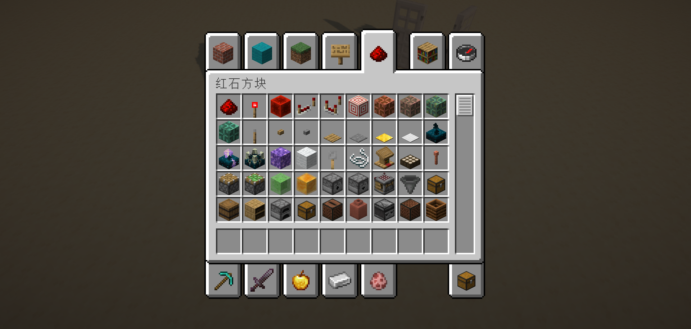

# 3.1 红石原理基础

在上一章，我们已经介绍了基岩版命令的一个整体框架。读者能够从第二章中了解到基岩版整体的命令体系。接下来在第三章，我们要正式开始学习如何使用这个命令体系构建一个属于自己的命令系统。

在这个模块中，我们不会脱离原版所给出的机制和体系，我们将从原版最有魅力和深度的其中一个玩法——红石系统作为基础，以各种深藏于命令之中的开发方块作为载体，学会制作属于我们自己的命令系统，并将其应用到自己的地图或服务器中。

---

这一节，我们将要从红石系统的基础机制出发，学习一些必要的红石知识。红石系统类似于现实生活中的电路系统，利用红石元件的各种机制，我们可以制作出各种各样的电路、机器甚至是计算机。这些知识在后续无论是系统设计还是玩法设计上，都是很重要的。不过，我们这一节并不是冲着制作各种复杂机器去的，我们只要简单了解各种元件的原理，就足够我们的开发使用了。

下面的内容，基本上对基岩版和 Java 版都是通用的，因此下面会使用一些来自 Java 版的截图。虽然两个版本的复杂红石电路的运行原理相差甚远，但基本红石元件的运作逻辑还是一致的。

## 红石元件

Minecraft 中，有各种各样形形色色的方块，可以搭建红石电路系统，这些方块就叫做**红石元件（Redstone Components）**。和现实生活中的电路的三大基本组成部分：*电源*、*导线等中间环节*和*用电器*类似，在 MC 中的红石电路也由对应的三部分组成：**电源**、**传输元件**、**机械元件**。

在 Java 版中，创造模式的物品栏已经有了一个专门的红石元件分类。

例如，读者应当已经知道，拉杆和铁门之间可以连接红石线，从而实现通过电路开门的效果。我们注意到，MC 中的电路并不像现实生活中一样要求闭合，只要信号能够通过传输元件传输过去，就能够组成一个完整的红石电路。

红石灯也是一种检测红石信号的常用方块。接收到信号之后，红石灯就会亮起，而未接收到信号时，红石灯就会熄灭。

在现实生活中，我们知道有*电源插孔*、*电池*等可以提供电能的电源。在 MC 中，类似地，**能够提供红石信号（类比于电能）的元件，称为电源（Source Components）**。例如，上面的两个示例中，拉杆能够提供红石信号，就是一种电源。

而现实生活中的*电线*，负责将电能传输给用电器。类似地，**将信号传输到其他元件的元件，称为传输元件（Transmission Components）**。例如，上面的两个示例中，红石粉能够将拉杆产生的红石信号提供给其他红石粉和红石灯，所以红石粉是典型的传输元件。

现实生活中的*电灯泡*，负责消耗电能并转化为光能，称为*用电器*。类似地，**接收红石信号并干涉世界运行的元件，称为机械元件（Mechanism Components）**。例如，上面的两个示例中，铁门接收到红石信号后改变了它的碰撞箱，进而改变了这个位置的可通达性；而红石灯接收到红石信号后发出 15 级的强光，这两个元件都干涉了世界的运行，因此都是机械元件。

## 红石导体 充能

在红石系统中，哪怕是普通的方块本身也可以成为很重要的一环。我们来看下面这个例子：

:::tip[实验 3.1-1]

在地上放一个拉杆，连接红石粉，红石粉的末端放置一个平滑石头，上面放一个红石灯。再如法炮制造另一个电路，只把平滑石头换成玻璃。

拉下拉杆，观察实验现象。

:::

我们注意到：垫上玻璃的红石灯并没有亮，而垫上了平滑石头的红石灯却亮了起来。

这种没有直接将红石信号作用到红石灯上，却能让红石灯亮起来的现象，正是**充能（Power）** 所引起的。许多方块（尤其是许多不透明方块）在被红石信号作用后，能够激活毗邻（上下东西南北）的红石元件，这时我们称这个方块为**红石导体（Redstone Conductive Block）**，这个方块正处于**被充能（Powered）** 的状态。而许多方块（尤其是许多透明方块）被红石信号作用后，不能激活毗邻的红石元件，这时我们称这个方块为**红石绝缘体（或非红石导体，Redstone Non-conductive Block）**。

在上面的例子中，平滑石头就是一种红石导体，它被红石信号作用之后可以激活毗邻的红石灯，所以平滑石头是红石导体，且处于被充能状态；而玻璃被红石信号作用之后不能毗邻红石灯，所以玻璃是红石绝缘体。

## 强充能与弱充能

MC 中有很多种红石电源，它们对红石导体的作用效果，也就是充能的效果，其实是不太一样的。我们来看下面一组实验。

:::tip[实验 3.1-2]

按照下图的方式搭建两个红石电路。其中，一个为通过拉杆连接红石线对平滑石头充能（下图左，情况 A），另一个为拉杆直接放在平滑石头上面（下图右，情况 B）。

拉下两个拉杆，观察实验现象。

:::

我们立刻观察到，情况 B （右）能够点亮红石灯，而情况 A （左）却不能。

在情况 A 中，红石粉的红石信号作用于平滑石头，可见其应该处于被充能状态；而在情况 B 中，拉杆本身就是电源，它的红石信号也作用于平滑石头，平滑石头也是被充能状态。看来，即使两种情况的平滑石头都是被充能状态，也有差别，很明显，情况 B 的充能是更强的，强到足以在中间阻隔了一个方块的情况下继续传导红石信号。

我们说，像情况 A 这种，红石导体被充能后不能激活毗邻的红石粉的充能称为**弱充能（Weakly Powered）**；而像情况 B 这种，红石导体被充能后还能激活毗邻的红石粉的充能称为**强充能（Strongly Powered）**。

弱充能和强充能是由电源和传导部分的性质决定的。一些电源可以做到强充能，另一些电源就只能实现弱充能。红石粉作用于红石导体只能实现弱充能，但后面我们会知道红石中继器、红石比较器就能实现强充能。

## 红石信号强度

和现实世界不同，电能在导线中虽然有能量损耗，但是这能量损耗是相对比较小的，所以通电后，电信号可以传导到很远的距离。然而在 Minecraft 中却并不是如此，红石信号的衰减是肉眼可见的。

:::tip[实验 3.1-3]

现在我们来探究红石信号的衰减规律。使用拉杆作为电源，不同长度的红石粉作为传输电路。不断加长红石粉的长度，观察加长到什么时候不再能使红石灯被点亮。

:::

我们观察到，无论红石粉的线路怎么拐，怎么摆，都会在长度到达 16 格的时候衰减到无信号的状态。看来，这个红石信号只能传输 15 格远。

这样，我们便可以定义**电源所提供的红石信号的强度（Redstone Signal Strength），是这个红石信号所能传输的最远的格数**，并且，**红石粉每传输 1 格，信号就衰减 1 级**。红石信号强度也经常被简述为红石信号，例如社区经常说“15 级红石信号”甚至“15 级信号”，读者应当能看懂这说的便是红石信号强度。

在上个例子中，拉杆所能提供的红石信号强度为 15 级。实际上，15 级已经是所有电源中所能提供的信号强度的最大值，换言之：**使用红石粉传输的信号，一定会在超过 15 格后衰减为 0**。

## 各种电源及其性质

下面仅对常见的电源进行介绍。如果读者对电源类型的红石元件感兴趣，可以阅读[红石元件列表#电源 - 中文 Minecraft Wiki](https://zh.minecraft.wiki/w/红石元件列表#电源)。

### 红石块

红石块是一种能够提供 **15 级红石信号强度**的电源。同时，它也是在命令方块系统中应用最多的一种信号源。

红石块能够为毗邻的红石元件提供信号，然而它并**不会充能毗邻的红石导体**。

### 拉杆

拉杆是一种能够提供 **15 级红石信号强度**的电源。拉下后能够提供红石信号，再拉回来则停止提供红石信号。*（有些类似于现实世界的电源和单刀单掷开关的合体）*

拉杆能够为毗邻的红石元件提供信号，还能够**强充能其附着的红石导体**。

### 按钮

按钮是一种能够提供 **15 级红石信号强度**的电源。在按下后的短暂时间间隔内能够提供红石信号，随后自身回弹并停止提供信号。

按钮能够为毗邻的红石元件提供信号，还能够**强充能其附着的红石导体**。

按钮分为木质按钮和石质按钮。石质按钮回弹更快一些（1 秒），提供信号的时间也更短。木质按钮不仅提供的信号长（1.5 秒），而且箭和三叉戟在射中木质按钮后还能提供更持久的信号（可以长达 1 分钟）。

### 压力板

压力板是一种电源。在有生物踩过压力板后提供红石信号。

压力板能够为毗邻的红石元件提供信号，还能够**强充能其附着的红石导体**。

压力板有 4 种类型：木质压力板、石质压力板、轻质测重压力板（金）、重质测重压力板（铁）。其中，木质压力板和石质压力板能够在被踩之后提供 **15 级红石信号强度**，而两种测重压力板在被踩之后则是**按照踩中压力板的生物数量输出信号强度**的，轻质每增加 1 个生物就多输出 1 级红石信号强度，而重质则每增加 10 个生物才多输出 1 级红石信号强度。

和按钮类似，除了石质压力板外，其他压力板不光可以被生物触发，还能被掉落物、箭等其他实体触发。在下图中，每种压力板上面都插了 15 根箭，它们的输出结果分别如图所示。

### 侦测器

### 陷阱箱

### 绊线钩

### 讲台

### 标靶

### 探测铁轨

## 红石刻

## 各种传输元件及其性质

### 红石火把

### 红石中继器

### 红石比较器

## 各种机械元件及其性质

### 活塞与黏性活塞

### 铜灯

### 铁轨、动力铁轨与激活铁轨

### 发射器与投掷器

### 门、活板门与栅栏门

### 漏斗

### 音符盒

### 红石灯

### TNT

## 逻辑电路

### 非门

### 或门

### 与门

## *红石电路的各种分支领域简介

### 数电与模电

### 械电

### 生电

---

## 总结与练习
