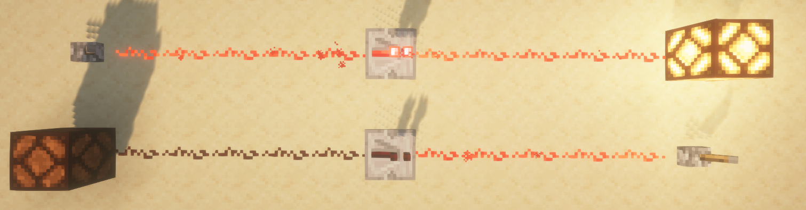

# 3.1 红石原理基础

在上一章，我们已经介绍了基岩版命令的一个整体框架。读者能够从第二章中了解到基岩版整体的命令体系。接下来在第三章，我们要正式开始学习如何使用这个命令体系构建一个属于自己的命令系统。

在这个模块中，我们不会脱离原版所给出的机制和体系，我们将从原版最有魅力和深度的其中一个玩法——红石系统作为基础，以各种深藏于命令之中的开发方块作为载体，学会制作属于我们自己的命令系统，并将其应用到自己的地图或服务器中。

---

这一节，我们将要从红石系统的基础机制出发，学习一些必要的红石知识。红石系统类似于现实生活中的电路系统，利用红石元件的各种机制，我们可以制作出各种各样的电路、机器甚至是计算机。这些知识在后续无论是系统设计还是玩法设计上，都是很重要的。不过，我们这一节并不是冲着制作各种复杂机器去的，我们只要简单了解各种元件的原理，就足够我们的开发使用了。*如果你是追求更专业的红石教程，应当以 Wiki 的相关文章作为参考*。

下面的内容，基本上对基岩版和 Java 版都是通用的，因此下面会使用一些来自 Java 版的截图。虽然两个版本的复杂红石电路的运行原理相差甚远，但基本红石元件的运作逻辑还是一致的。

## 红石元件

Minecraft 中，有各种各样形形色色的方块，可以搭建红石电路系统，这些方块就叫做**红石元件（Redstone Components）**。和现实生活中的电路的三大基本组成部分：*电源*、*导线等中间环节*和*用电器*类似，在 MC 中的红石电路也由对应的三部分组成：**电源**、**传输元件**、**机械元件**。

在 Java 版中，创造模式的物品栏已经有了一个专门的红石元件分类。

例如，读者应当已经知道，拉杆和铁门之间可以连接红石线，从而实现通过电路开门的效果。我们注意到，MC 中的电路并不像现实生活中一样要求闭合，只要信号能够通过传输元件传输过去，就能够组成一个完整的红石电路。

红石灯也是一种检测红石信号的常用方块。接收到信号之后，红石灯就会亮起，而未接收到信号时，红石灯就会熄灭。

在现实生活中，我们知道有*电源插孔*、*电池*等可以提供电能的电源。在 MC 中，类似地，**能够提供红石信号（类比于电能）的元件，称为电源（Source Components）**。例如，上面的两个示例中，拉杆能够提供红石信号，就是一种电源。

而现实生活中的*电线*，负责将电能传输给用电器。类似地，**将信号传输到其他元件的元件，称为传输元件（Transmission Components）**。例如，上面的两个示例中，红石粉能够将拉杆产生的红石信号提供给其他红石粉和红石灯，所以红石粉是典型的传输元件。

现实生活中的*电灯泡*，负责消耗电能并转化为光能，称为*用电器*。类似地，**接收红石信号并干涉世界运行的元件，称为机械元件（Mechanism Components）**。例如，上面的两个示例中，铁门接收到红石信号后改变了它的碰撞箱，进而改变了这个位置的可通达性；而红石灯接收到红石信号后发出 15 级的强光，这两个元件都干涉了世界的运行，因此都是机械元件。

## 红石导体 充能

在红石系统中，哪怕是普通的方块本身也可以成为很重要的一环。我们来看下面这个例子：

:::tip[实验 3.1-1]

在地上放一个拉杆，连接红石粉，红石粉的末端放置一个平滑石头，上面放一个红石灯。再如法炮制造另一个电路，只把平滑石头换成玻璃。

拉下拉杆，观察实验现象。

:::

我们注意到：垫上玻璃的红石灯并没有亮，而垫上了平滑石头的红石灯却亮了起来。

这种没有直接将红石信号作用到红石灯上，却能让红石灯亮起来的现象，正是**充能（Power）** 所引起的。许多方块（尤其是许多不透明方块）在被红石信号作用后，能够激活毗邻（上下东西南北）的红石元件，这时我们称这个方块为**红石导体（Redstone Conductive Block）**，这个方块正处于**被充能（Powered）** 的状态。而许多方块（尤其是许多透明方块）被红石信号作用后，不能激活毗邻的红石元件，这时我们称这个方块为**红石绝缘体（或非红石导体，Redstone Non-conductive Block）**。

在上面的例子中，平滑石头就是一种红石导体，它被红石信号作用之后可以激活毗邻的红石灯，所以平滑石头是红石导体，且处于被充能状态；而玻璃被红石信号作用之后不能毗邻红石灯，所以玻璃是红石绝缘体。

## 强充能与弱充能

MC 中有很多种红石电源，它们对红石导体的作用效果，也就是充能的效果，其实是不太一样的。我们来看下面一组实验。

:::tip[实验 3.1-2]

按照下图的方式搭建两个红石电路。其中，一个为通过拉杆连接红石线对平滑石头充能（下图左，情况 A），另一个为拉杆直接放在平滑石头上面（下图右，情况 B）。

拉下两个拉杆，观察实验现象。

:::

我们立刻观察到，情况 B （右）能够点亮红石灯，而情况 A （左）却不能。

在情况 A 中，红石粉的红石信号作用于平滑石头，可见其应该处于被充能状态；而在情况 B 中，拉杆本身就是电源，它的红石信号也作用于平滑石头，平滑石头也是被充能状态。看来，即使两种情况的平滑石头都是被充能状态，也有差别，很明显，情况 B 的充能是更强的，强到足以在中间阻隔了一个方块的情况下继续传导红石信号。

我们说，像情况 A 这种，红石导体被充能后不能激活毗邻的红石粉的充能称为**弱充能（Weakly Powered）**；而像情况 B 这种，红石导体被充能后还能激活毗邻的红石粉的充能称为**强充能（Strongly Powered）**。

弱充能和强充能是由电源和传导部分的性质决定的。一些电源可以做到强充能，另一些电源就只能实现弱充能。红石粉作用于红石导体只能实现弱充能，但后面我们会知道红石中继器、红石比较器就能实现强充能。

## 红石信号强度

和现实世界不同，电能在导线中虽然有能量损耗，但是这能量损耗是相对比较小的，所以通电后，电信号可以传导到很远的距离。然而在 Minecraft 中却并不是如此，红石信号的衰减是肉眼可见的。

:::tip[实验 3.1-3]

现在我们来探究红石信号的衰减规律。使用拉杆作为电源，不同长度的红石粉作为传输电路。不断加长红石粉的长度，观察加长到什么时候不再能使红石灯被点亮。

:::

我们观察到，无论红石粉的线路怎么拐，怎么摆，都会在长度到达 16 格的时候衰减到无信号的状态。看来，这个红石信号只能传输 15 格远。

这样，我们便可以定义**电源所提供的红石信号的强度（Redstone Signal Strength），是这个红石信号所能传输的最远的格数**，并且，**红石粉每传输 1 格，信号就衰减 1 级**。红石信号强度也经常被简述为红石信号，例如社区经常说“15 级红石信号”甚至“15 级信号”，读者应当能看懂这说的便是红石信号强度。

在上个例子中，拉杆所能提供的红石信号强度为 15 级。实际上，15 级已经是所有电源中所能提供的信号强度的最大值，换言之：**使用红石粉传输的信号，一定会在超过 15 格后衰减为 0**。

## 各种电源及其性质

下面仅对常见的电源进行介绍。如果读者对电源类型的红石元件感兴趣，可以阅读[红石元件列表#电源 - 中文 Minecraft Wiki](https://zh.minecraft.wiki/w/红石元件列表#电源)。

绝大多数的电源，都能够为毗邻的红石元件提供信号，并强充能特定位置的红石导体。

:::tip[实验 3.1-4]

在“各种电源及其性质”这一部分，请通过下文所示的图片示例，分别搭建对应的电路，体验一下各个电源的用法。

:::

### 红石块

红石块**无条件地输出信号，强度为 15**。红石块会为毗邻元件提供信号，但是不会强充能毗邻的红石导体。

红石块也是在命令方块系统中应用最多的一种信号源。

  

### 拉杆

拉杆**拉下后提供信号，再拉回来则停止提供信号，强度为 15**。拉杆会为毗邻元件提供信号，还会强充能附着的红石导体。

拉杆是最简单的电源之一，*有些类似于现实世界的电源和单刀单掷开关的合体*。

### 按钮

按钮**在按下后的短暂时间间隔内能够提供信号，随后自身回弹并停止提供信号，强度为 15**。按钮会为毗邻元件提供信号，还会强充能附着的红石导体。

按钮分为木质按钮和石质按钮。**石质按钮提供信号的时间短（1 秒），木质按钮提供信号的时间长（1.5 秒）。箭和三叉戟在射中木质按钮后还能提供更持久的信号（长达 1 分钟）**。

  
箭射中木质按钮后会持续激活木质按钮

### 压力板

压力板**在实体踩踏压力板后提供信号**。

压力板分为 4 种：木质压力板、石质压力板、轻质测重压力板（金）和重质测重压力板（铁）。其中，**石质压力板是比较特殊的，它必须在普通生物踩踏后激活，其他实体（例如箭、掉落物）踩踏则不激活**。

输出信号强度方面：

- **木质压力板和石质压力板被踩踏后都会输出 15 信号**。
- 轻质测重压力板每多一个实体踩踏就多输出 1 信号，最大输出 15。
- 而重质测重压力板则需要每多 10 个实体踩踏多输出 1 信号，最大输出 15。
  - 例如 8 个实体踩踏输出 1 信号，73 个实体踩踏输出 8 信号。

压力板会为毗邻元件提供信号，还会强充能附着的（下方的）红石导体。

  
1 个盔甲架踩踏 4 种压力板的表现

  
15 根箭（非生物）踩踏 4 种压力板的表现

### 侦测器

侦测器**在检测（脸）端检查到方块有变化的时候，在输出端输出一个时长为 0.1 秒的瞬时信号，强度为 15**。侦测器只会为输出端面对的红石元件提供信号，也只强充能输出端面对的红石导体。

  
一种高频输出信号的简易装置，即两个侦测器的脸部正对

### 陷阱箱

陷阱箱**在箱子打开时输出信号，强度等同于开箱人数，最大输出 15**。陷阱箱会为毗邻元件提供信号，还会强充能下方的红石导体。

陷阱箱常常用于下方埋 TNT 或者隔一个方块埋 TNT 做陷阱。因为往往只输出 1 的信号强度（毕竟大多数时候只有 1 人开箱），如果使用陷阱箱做机关应该务必注意到这点。

### 绊线钩

绊线钩**在实体经过绊线时输出信号，强度为 15**。绊线钩会为毗邻元件提供信号，还会强充能附着的红石导体。

绊线钩在实体离开后会过段时间恢复回原状，并停止提供信号。此外，绊线钩还会在绊线被非剪刀破坏时，输出一个 0.5 秒的瞬时信号。

  
绊线钩上卡着一个掉落物，触发信号

### 讲台

讲台**在翻页时输出一个 0.1 秒的瞬时信号，强度为 15**。讲台会为毗邻元件提供信号，还会强充能下方的红石导体。

### 标靶

标靶**被弹射物击中时输出瞬时信号，强度由击中位置决定，越靠近中心则信号强度越大，范围从 1~15**。标靶会为毗邻元件提供信号，但是不会强充能毗邻的红石导体。

瞬时信号时长由弹射物类型决定，箭和三叉戟为 1 秒，其余为 0.4 秒。

  
击中了标靶的三叉戟，但因为是瞬时信号，所以此时已不输出

此外，标靶还常常用于改变红石线路走向的红石导体。只要标靶不被弹射物击中，有时也可以认为标靶也是一种良好的传输元件。

  
标靶可以改变线路走向

### 探测铁轨

探测铁轨**在有矿车经过时提供信号，强度为 15**。探测铁轨会为毗邻元件提供信号，还会强充能下方的红石导体。

## 红石刻

上文，我们看到很多能够输出瞬时信号的元件。你发现了吗——这些瞬时信号的最短值是 0.1 秒，并且所有这些信号的时长都是 0.1 秒的倍数。

事实上，在红石系统领域，存在一个和游戏刻同等重要的类似概念，**红石系统的响应速度都是以 0.1 秒为单位的，一切的红石元件的响应时长都是 0.1 秒的倍数**，我们称 0.1 秒为**1 个红石刻（Redstone Tick）**。显然地，和以前的游戏刻的概念结合起来看，我们就能得到**1 秒= 10 红石刻（Redstone Tick, RT）= 20 游戏刻（Game Tick, GT）**，或**0.1 秒= 2 游戏刻= 1 红石刻**。这是时间转换原理的完全体，是极其重要的。

## 各种传输元件及其性质

传输元件的类型虽然相对较少，但是它们的特性却一个比一个复杂，用法一个比一个多变。

:::tip[实验 3.1-5]

在“各种传输元件及其性质”这一部分，请通过下文所示的图片示例，分别搭建对应的电路，体验一下各个电源的用法。

:::

### 红石粉

红石粉是最基础的传输信号的元件。对于水平方向的布置，我们已无需多言，现在主要强调在竖直方向上红石粉的工作机理。对于众多红石机器、生电机器或命令系统来说，往往不是局限在一个水平面上的，总要存在竖直方向上的变化。

对于竖直信号的传递，主要分两种情况：爬升（向上传输）和降落（向下传输）。红石粉的爬升是比较简单的，例如：

但是，红石粉在爬升的时候，如果上方出现不透明方块阻挡，则会中断；而类似于树叶、玻璃等透明方块阻挡则不会中断。例如：

所以，一种常见的省空间的红石信号爬升方式就如下图所示：

红石粉还可以放在不完整方块的上表面，例如台阶或者楼梯，使用这些也可以实现信号的爬升。

对于红石粉的降落，基岩版和 Java 版则存在一些差异，这里我们只谈基岩版。红石粉的降落必须要保证其侧面不能是中断的。红石导体自不必多说，对于红石绝缘体来说，常用的侧面不中断的方块是玻璃。读者也可以在下面这张图中看到信号爬升和信号降落之间的区别。

  
楼梯和台阶可以胜任信号爬升的工作，然而因为侧面中断，所以信号不能降落；玻璃的侧面则是良好连接的，所以信号可以正确降落。*这点和 Java 版是不一样的，Java 版只要是红石绝缘体，信号就都不能降落（因此这张图是在基岩版截的，没有光影）*。

### 红石火把

红石火把不仅是一种传输元件，同时也是一种电源。

我们现在来快速阐述一下红石火把的作为电源的性质。红石火把**输出 15 信号**，会激活**除附着之外的毗邻红石元件**，并**强充能其上方的红石导体**。

  
左 1 我们看到红石火把所附着的红石灯并没有亮，而其上方和侧边的红石灯却亮了起来；左 2 和左 3 则表明，不论如何摆放红石火把，都是强充能其上方的红石导体，而侧面的红石导体则不会被充能。

红石火把作为传输元件的基本特性在于**充能熄灭**。**如果其所附着的红石导体被充能，那么红石火把就会熄灭**。

这个特性是极其有意义的，它已延伸出诸多有用的特性，例如信号中继，利用两个红石火把延续信号；竖直传递信号，尤其是高度差较高的时候；以及取逻辑非，等等情况。

读者应当注意一个很关键的问题：**红石火把熄灭与重燃的响应时间是 0.1 秒，也就是 1 红石刻**。例如在上图的中继器的设计中，拉下拉杆后需要 2 红石刻才能点亮红石灯；而上图的竖直爬升的设计则需要 4 红石刻才能点亮红石灯。这在红石系统领域中有一个专门的领域叫做**延迟（Delay）**，例如上面两个例子就分别是 2 红石刻的延迟和 4 红石刻的延迟。

### 红石中继器

红石中继器是由 2 根红石火把、1 个红石和 3 个石头合成的传输元件。显然，在上面的例子中，它至少有两个作用：中继信号和引入延迟。但其实至少有 4 个作用，我们来一一说明。

在了解它的作用之前，我们必须先看懂它。下面是一个红石中继器，我们看到有两个火把状的东西。固定火把的一端称为**输出端（Output）**，而可变火把的一端称为**输入端（Input）**。你也可以通过中继器的一个形似三角形的图案看到它的端口。

现在我们就可以了解它的作用了。第一个作用，是**中继信号**。它能够将任意的信号扩大到 15 信号并继续传播。通过上面红石火把的例子，读者应该已经能轻松地了解这个作用。

第二个作用就是**引入延迟**。在红石火把的例子中，我们提到引入那样一个中继装置需要引入 2 刻的延迟。对于红石中继器而言，则要更加灵活。它一共有 4 个档位，通过调整火把之间的间距来控制档位，每调高一个档位就会多引入 1 刻的延迟，而最低的 1 档是 1 刻的延迟。对应关系如下图所示。所以，常用 2 个 4 档的中继器和 1 个 2 档的中继器来制作一个 1 秒的延时器。

第三个作用是**单向传输**。中继器只能从输入端接收信号并在输出端输出，不能从输出端接收信号。这个阻止反向信号的特性十分类似于现实世界的二极管，只是中继器还同时兼备了放大信号的作用。例如在下图中，我们只希望信号从左向右传输，就可以通过引入一个中继器的方法来阻止反向信号的输入。

第四个作用是**锁存信号**。当它的侧面有一个红石中继器或红石比较器来输入信号的时候，就会进入**锁存状态（Signal Locking）**。这种状态下，无论输入端是开是关，都不影响中继器本身的状态，而是锁定为这个中继器在锁定之前的状态。

此外，作为第一种方法的扩展，红石中继器作为一种非红石粉的红石元件，自然能够**从充能的红石导体获得信号**。所以，借助红石中继器的这些性质，可以造出各种各样的传输装置。

### 红石比较器

## 各种机械元件及其性质

### 活塞与黏性活塞

### 铜灯

### 铁轨、动力铁轨与激活铁轨

### 发射器与投掷器

### 门、活板门与栅栏门

### 漏斗

### 音符盒

### 红石灯

### TNT

## 高频电路

### 基于红石火把的高频电路

### 基于红石比较器的高频电路

### 基于侦测器的高频电路

原理是，当放下第二个侦测器的一瞬间，第一个侦测器检查到有方块变化，输出红石信号，同时自身产生变化，被第二个侦测器检测到，所以第二个侦测器也开始输出红石信号，同时自身产生变化，如此循环，输出稳定高频。

## 逻辑电路

### 非门

### 或门

### 与门

## *红石电路的各种分支领域简介

### 数电与模电

### 械电

### 生电

---

## 总结与练习
