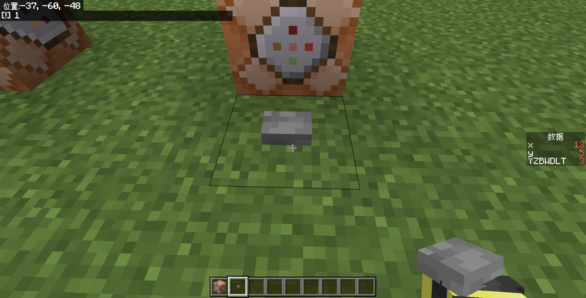

# 3.2 命令方块

本节我们开始介绍开发最常用的一种开发方块——命令方块。前面我们一直提到命令方块、命令方块，你一定非常好奇这究竟是何方神圣，当然或许你也可能早已有所耳闻。

---

## 命令方块

**命令方块（Command Block，简称 CB）是一种能够自动按需求执行预设命令的红石元件**。毕竟在各路地图服务器中，你不能让服主手动打命令执行代码，所以必须寻求一种自动执行命令的方式。现如今，在多数情况下，地图和服务器的开发者们还是会首选命令方块作为这个自动执行命令的方式，因为它简单、易懂、好上手，也是所有开发者的必修课程。对于这些开发者，尤其是追求用命令设计复杂程序的开发者，社区内通常会亲切地用“cber”来称呼这些他们。

然而，如果不是 Java 版的话，你不会在创造模式的物品栏里看见这个东西，因为命令方块属于**管理员用品**，它只能由创造模式的管理员使用，在基岩版则是隐藏到命令中。后续我们还会接触到更多的管理员用品。通常来说，我们用命令来获取命令方块：

:::tip[实验 3.2-1]

命令方块的物品 ID 和方块 ID 都是`command_block`，选择一条你喜欢的命令自行给予自己一个命令方块。

:::

获得命令方块之后，放下来，右键看看它的 UI 吧：


你可以看到设置项是很多的，但是不必心急，我们很快就会依次介绍它们的作用。

---

## CB 的基本用法

在下文中，如果看到 CB，这是命令方块的简写。在社区内，CB 是一种很常用的简写。

### 输入命令并执行

使用命令方块执行命令非常简单。在下图所示的这个区域，就是输入命令的区域：


因为命令方块是专门执行命令的，所以没有必要使用`/`专门指代这条消息是一条命令，因此在命令方块内可以不写`/`。

命令方块的本质是一种红石元件，这也是我们 3.1 先讲了红石原理基础的理由。在写了一条命令之后，你可以像点亮红石灯一样启动一个命令方块。

:::tip[实验 3.2-2]

放下一个命令方块，在“控制台命令”下输入

```text
say 1
```

可以不带斜杠。然后，按下右上角的“x”，或者按下“ESC”键，它会自动保存你写的命令，并在左上角提示。


试着启动命令方块，观察它的执行效果！

:::

我们看到，左上角返回了一个`[!]1`，其中`!`的问题我们稍后会强调，但不论如何，它确实成功执行了`/say`命令并输出！



命令输入区还有两个有用的按钮，第一个按钮是粘贴剪切板的内容，结合复制坐标 UI 会非常有用；而第二个按钮（“+”）就是放大命令输入区的 UI，对于输入长命令时会很有用。但是，因为基岩版的 bug，在输入长命令时，实际的光标位置和显示的光标位置是存在偏移的，这就导致在命令方块输入长命令（尤其是`/tellraw`等）往往是一种很痛苦的体验。


### 保存与取消

刚刚在实验中，我们提到**按下右上角的“x”或者按下“ESC”键都会保存命令**。然而，如果输错了命令怎么办呢？放心，这点手机和电脑倒是一视同仁——电脑也不支持 Ctrl+Z 撤销的操作。这时候，你可以直接使用命令方块左侧栏的“取消”按钮，这样就不会保存你输入错误的命令了。


### 添加注释

一个很现实的问题是：命令方块并不会将命令外显出来，要事先知晓命令方块里面究竟写了什么东西是很麻烦的，必须点开来看里面写了什么命令，甚至有时候需要放大命令输入区才能看清命令。

这个时候，我们就需要使用 UI 左上角的那个“悬停注释”，来标记这个命令方块里面写入的内容。在“悬停注释”里面写入内容并保存后，会使你的准心在面对命令方块的时候显示出来。

  


在写大型项目的时候，为代码添加注释总是良好的习惯。我们也鼓励你在必要的时候为命令方块添加注释，这样便于你的后期维护和架构调整，同时大幅提高可读性。

### 常用的快捷键

:::note[注意]

本部分内容仅限 Windows 玩家可用。

:::

掌握一些常见的快捷键是很重要的。以下是一些电脑上可用的快捷键：

- `Ctrl`+`A`：全选
- `Ctrl`+`C`：复制
- `Ctrl`+`V`：粘贴

如果你要问只有这些了吗，嗯对，只有这些。它甚至连剪切（`Ctrl`+`X`）都不支持，就更不要提什么保存（`Ctrl`+`S`）撤销（`Ctrl`+`Z`）之类的了……

---

## CB 的命令上下文

了解命令方块的命令上下文是非常重要且关键的，因为上下文直接决定命令的执行效果。在命令方块执行命令和在聊天栏执行命令在很多情况下的确是一致的，然而还是有诸多不同。在第二章，我们学习到命令上下文由 4 部分组成：执行者、执行环境参数、执行权限等级、执行输出反馈。接下来我们一一来看命令方块的命令上下文设定会对实际的执行效果产生什么影响，正好也借着这个机会进一步加深对命令上下文的理解，和扩展我们曾经在 2.3 所讲过的命令上下文的概念。

### CB 的执行者

**命令方块的执行者，是空。没错，使用命令方块执行命令不存在执行者**，当然你可以通过左上角的“悬停注释”指代一个执行者的名字。

:::tip[实验 3.2-3]

分别在 4 个命令方块内输入命令：

```text title="将这个命令方块的悬停注释留空"
say 1
```

```text title="将这个命令方块的悬停注释改为【测试】"
say 2
```

```text
give @a apple
```

```text
give @s apple
```

启动这 4 个命令方块，观察执行结果。

:::

我们看到下面的结果：


事实上，**执行者这个上下文是可以细分为执行者实体和执行者名称的**。只是在聊天栏执行命令的时候，执行者实体和执行者名称无一例外都是相互吻合的。但是对于命令方块而言，因为**命令方块本身是个方块，不是实体，所以执行者实体是不存在的，执行者名称没有办法对应到一个执行者实体上**。这样，命令方块就只能默认地将执行者名称设置为`!`。在 Java 版和更古早的基岩版中，默认的执行者名称都是`@`。

所以，在两个`/say`命令中，第一条命令的默认执行者名称是`!`，因此输出`[!] 1`；而第二条命令通过“悬停注释”设定了一个执行者名称`测试`，因此输出`[测试] 2`。

执行者实体不存在的另一个重大影响在于`@s`是不能直接指定命令方块本体的。因为`@s`归根结底是目标选择器，它的任务是找到符合条件的实体，而执行者实体并不存在，所以`give @s apple`无论如何都不会成功执行。更何况，就算是存在，这条命令也必须指定玩家类型的实体。

所以，在执行者方面的重大不同，很大程度上导致了用 CB 的执行效果和用聊天栏的执行效果是很不一样的。

然而，一些开发者却对执行者实体不存在这个问题存在一些误解，他们误认为命令方块内无论如何都不能出现`@s`字样，这归根结底是对`/execute`命令不熟悉所导致的。因为`/execute`命令的`as`子命令可以指定一个有效的执行者实体，在后面再出现`@s`就是可以接受的了。例如，不能用 CB 直接执行`give @s apple`，却可以用 CB 执行`execute as @a run give @s apple`。

### CB 的执行环境参数

基岩版的执行环境参数包括执行位置、执行朝向和执行维度，这个概念并没有什么好扩展的。CB 的默认执行位置和执行维度也是很显然的为 CB 所在的位置和维度。然而执行朝向该怎么区分呢？

:::tip[实验 3.2-4]

使用 CB 执行下面几条命令：

1. `tp @p ~~1~ ~~`
2. `tp @p ~~1~ 0 0`
3. `tp @p ~~1~ 90 0`

:::

通过上面的实验，你也许已经看出命令 1 和命令 2 的执行效果是一致的。是的，命令方块的默认执行朝向`(xRot, yRot)`是`(0,0)`。

### CB 的执行权限等级

### CB 的执行输出反馈

---

## 控制 CB 运行的四条游戏规则

### `commandBlockOutPut`

### `commandBlocksEnabled`

### `sendCommandFeedBack`

### `maxCommandChainLength`

---

## CB 类型

### 脉冲型命令方块

### 连锁型命令方块

### 循环型命令方块

---

## CB 执行条件

### 条件制约

### 不受制约

---

## CB 启动条件

### 红石控制

### 始终执行

---

## CB 延迟执行

### 在首刻执行

### 延迟刻数

---

## 总结与练习
