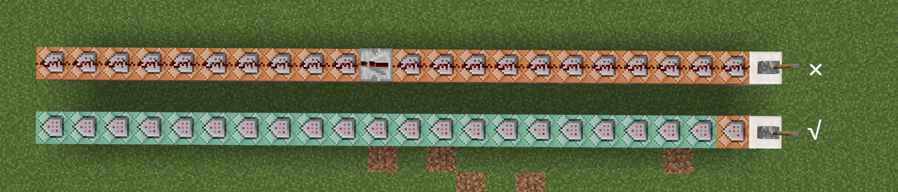

# 3.2 命令方块

本节我们开始介绍开发最常用的一种开发方块——命令方块。前面我们一直提到命令方块、命令方块，你一定非常好奇这究竟是何方神圣，当然或许你也可能早已有所耳闻。

---

## 命令方块

**命令方块（Command Block，简称 CB）是一种能够自动按需求执行预设命令的红石元件**。毕竟在各路地图服务器中，你不能让服主手动打命令执行代码，所以必须寻求一种自动执行命令的方式。现如今，在多数情况下，地图和服务器的开发者们还是会首选命令方块作为这个自动执行命令的方式，因为它简单、易懂、好上手，也是所有开发者的必修课程。对于这些开发者，尤其是追求用命令设计复杂程序的开发者，社区内通常会亲切地用“cber”来称呼这些他们。

然而，如果不是 Java 版的话，你不会在创造模式的物品栏里看见这个东西，因为命令方块属于**管理员用品**，它只能由创造模式的管理员使用，在基岩版则是隐藏到命令中。后续我们还会接触到更多的管理员用品。通常来说，我们用命令来获取命令方块：

:::tip[实验 3.2-1]

命令方块的物品 ID 和方块 ID 都是`command_block`，选择一条你喜欢的命令自行给予自己一个命令方块。

:::

获得命令方块之后，放下来，右键看看它的 UI 吧：


你可以看到设置项是很多的，但是不必心急，我们很快就会依次介绍它们的作用。

---

## CB 的基本用法

在下文中，如果看到 CB，这是命令方块的简写。在社区内，CB 是一种很常用的简写。

### 输入命令并执行

使用命令方块执行命令非常简单。在下图所示的这个区域，就是输入命令的区域：


因为命令方块是专门执行命令的，所以没有必要使用`/`专门指代这条消息是一条命令，因此在命令方块内可以不写`/`。

命令方块的本质是一种红石元件，这也是我们 3.1 先讲了红石原理基础的理由。在写了一条命令之后，你可以像点亮红石灯一样启动一个命令方块。

:::tip[实验 3.2-2]

放下一个命令方块，在“控制台命令”下输入

```text
say 1
```

可以不带斜杠。然后，按下右上角的“x”，或者按下“ESC”键，它会自动保存你写的命令，并在左上角提示。


试着启动命令方块，观察它的执行效果！

:::

我们看到，左上角返回了一个`[!]1`，其中`!`的问题我们稍后会强调，但不论如何，它确实成功执行了`/say`命令并输出！


命令输入区还有两个有用的按钮，第一个按钮是粘贴剪切板的内容，结合复制坐标 UI 会非常有用；而第二个按钮（“+”）就是放大命令输入区的 UI，对于输入长命令时会很有用。但是，因为基岩版的 bug，在输入长命令时，实际的光标位置和显示的光标位置是存在偏移的，这就导致在命令方块输入长命令（尤其是`/tellraw`等）往往是一种很痛苦的体验。


### 保存与取消

刚刚在实验中，我们提到**按下右上角的“x”或者按下“ESC”键都会保存命令**。然而，如果输错了命令怎么办呢？放心，这点手机和电脑倒是一视同仁——电脑也不支持 Ctrl+Z 撤销的操作。这时候，你可以直接使用命令方块左侧栏的“取消”按钮，这样就不会保存你输入错误的命令了。


### 添加注释

一个很现实的问题是：命令方块并不会将命令外显出来，要事先知晓命令方块里面究竟写了什么东西是很麻烦的，必须点开来看里面写了什么命令，甚至有时候需要放大命令输入区才能看清命令。

这个时候，我们就需要使用 UI 左上角的那个“悬停注释”，来标记这个命令方块里面写入的内容。在“悬停注释”里面写入内容并保存后，会使你的准心在面对命令方块的时候显示出来。

  


在写大型项目的时候，为代码添加注释总是良好的习惯。我们也鼓励你在必要的时候为命令方块添加注释，这样便于你的后期维护和架构调整，同时大幅提高可读性。

### 常用的快捷键

:::note[注意]

本部分内容仅限 Windows 玩家可用。

:::

掌握一些常见的快捷键是很重要的。以下是一些电脑上可用的快捷键：

- `Ctrl`+`A`：全选
- `Ctrl`+`C`：复制
- `Ctrl`+`V`：粘贴

如果你要问只有这些了吗，嗯对，只有这些。它甚至连剪切（`Ctrl`+`X`）都不支持，就更不要提什么保存（`Ctrl`+`S`）撤销（`Ctrl`+`Z`）之类的了……

---

## CB 的命令上下文

了解命令方块的命令上下文是非常重要且关键的，因为上下文直接决定命令的执行效果。在命令方块执行命令和在聊天栏执行命令在很多情况下的确是一致的，然而还是有诸多不同。在第二章，我们学习到命令上下文由 4 部分组成：执行者、执行环境参数、执行权限等级、执行输出反馈。接下来我们一一来看命令方块的命令上下文设定会对实际的执行效果产生什么影响，正好也借着这个机会进一步加深对命令上下文的理解，和扩展我们曾经在 2.3 所讲过的命令上下文的概念。

### CB 的执行者

**命令方块的执行者，是空。没错，使用命令方块执行命令不存在执行者**，当然你可以通过左上角的“悬停注释”指代一个执行者的名字。

:::tip[实验 3.2-3]

分别在 4 个命令方块内输入命令：

```text title="将这个命令方块的悬停注释留空"
say 1
```

```text title="将这个命令方块的悬停注释改为【测试】"
say 2
```

```text
give @a apple
```

```text
give @s apple
```

启动这 4 个命令方块，观察执行结果。

:::

我们看到下面的结果：


事实上，**执行者这个上下文是可以细分为执行者实体和执行者名称的**。只是在聊天栏执行命令的时候，执行者实体和执行者名称无一例外都是相互吻合的。但是对于命令方块而言，因为**命令方块本身是个方块，不是实体，所以执行者实体是不存在的，执行者名称没有办法对应到一个执行者实体上**。这样，命令方块就只能默认地将执行者名称设置为`!`。在 Java 版和更古早的基岩版中，默认的执行者名称都是`@`。

所以，在两个`/say`命令中，第一条命令的默认执行者名称是`!`，因此输出`[!] 1`；而第二条命令通过“悬停注释”设定了一个执行者名称`测试`，因此输出`[测试] 2`。

执行者实体不存在的另一个重大影响在于`@s`是不能直接指定命令方块本体的。因为`@s`归根结底是目标选择器，它的任务是找到符合条件的实体，而执行者实体并不存在，所以`give @s apple`无论如何都不会成功执行。更何况，就算是存在，这条命令也必须指定玩家类型的实体。

所以，在执行者方面的重大不同，很大程度上导致了用 CB 的执行效果和用聊天栏的执行效果是很不一样的。

然而，一些开发者却对执行者实体不存在这个问题存在一些误解，他们误认为命令方块内无论如何都不能出现`@s`字样，这归根结底是对`/execute`命令不熟悉所导致的。因为`/execute`命令的`as`子命令可以指定一个有效的执行者实体，在后面再出现`@s`就是可以接受的了。例如，不能用 CB 直接执行`give @s apple`，却可以用 CB 执行`execute as @a run give @s apple`。

### CB 的执行环境参数

基岩版的执行环境参数包括执行位置、执行朝向和执行维度，这个概念并没有什么好扩展的。CB 的默认执行位置和执行维度也是很显然的为 CB 所在的位置和维度。然而执行朝向该怎么区分呢？

:::tip[实验 3.2-4]

使用 CB 执行下面几条命令：

1. `tp @p ~~1~ ~~`
2. `tp @p ~~1~ 0 0`
3. `tp @p ~~1~ 90 0`

:::

通过上面的实验，你也许已经看出命令 1 和命令 2 的执行效果是一致的。是的，命令方块的默认执行朝向`(xRot, yRot)`是`(0,0)`。

### CB 的执行权限等级

在 2.10 的时候，我们简单提过一下权限等级这个概念，知道所有的执行者都有一个权限等级，而所有的命令都有对应的权限等级需求。在基岩版中，绝大部分的命令都需要`1`的权限等级，而**命令方块的权限等级正是`1`，所以命令方块就可以执行绝大多数的命令**。关于命令方块不能执行哪些命令，我们在[附录：全部命令汇总](../appendix/all_commands)这篇文档性质的附录里面详细地给出了所有命令的权限等级，并对一些命令方块无法使用的命令做了警告，读者可以简单查阅一下。主要需要注意的是`/op`、`/deop`这些服务器命令常常不能通过命令方块执行，以及`/kick`命令是反而可以通过命令方块执行的。

### CB 的执行输出反馈

事实上，命令的执行效果不仅有**是否执行成功**的概念，还有**执行成功次数（Success Count）** 的概念。如果执行命令`/testfor @e`，那么命令将会这么反馈：


这说明，这条命令不仅成功执行了，而且成功执行了 7 次（因为检查到了 7 个实体）。

执行成功次数有什么用呢？基岩版要想读取成功次数，就必须使用命令方块或者 ScriptAPI。对于命令方块，后面接一个红石比较器就可以检查成功次数了：


**对于绝大多数的命令来说，执行成功次数只有`0`和`1`的区别，换言之执行失败就不输出红石信号，而执行成功就输出强度为 1 的红石信号**。少部分的命令可能影响多个玩家、或者多个方块，所以执行成功次数可能会多一些，例如`/testfor @a`就可以用来快速地检查玩家数目，也是它相比于`/execute if entity @a`唯一的优势（输出固定为 1）。**大多数的情况下，还是只用这个机制检查命令是否成功执行**。

如果读者想要了解那些不止输出`0`或`1`的命令，请查阅各命令条目下的“输出”一节。例如，下面是`/fill`的输出数据。

  
↑ `/fill`的成功次数，可见只有`0`和`1`的区别

---

## 控制 CB 运行的四条游戏规则

### `commandBlockOutPut`

这个游戏规则会**控制命令方块是否输出反馈消息到聊天栏**。在初次使用命令方块的时候，你可能常常会被命令方块在聊天栏的自动输出所困扰。

  
↑ 这些 *[!:……]* 就是命令方块输出的消息

将这个游戏规则关掉，就可以禁用这些消息。在开发过程中，可能会有部分开发者需要开启命令方块的反馈，但在正式发布地图前，或者在服务器中，都请把这个游戏规则关闭掉，因为玩家是不需要这些信息的。

### `commandBlocksEnabled`

这个游戏规则会**控制命令方块是否启用**。如果关闭这个游戏规则，那么命令方块就不再会通过红石或者其他方式激活并执行命令。

通常来说，这个选项都是需要开启的，毕竟如果关闭就会导致基于命令方块的系统直接瘫痪，在很多情况下恐怕不是什么好事哦。

一个坏坏的小提示：对于某些强行开启了反作弊的地图，可以考虑暂时关闭命令方块来开作弊拆地图。不过这么做一定会破坏你的游戏体验，所以请在游玩完地图后再备份一张地图，然后再考虑用这种方法拆图会更好一些。

### `sendCommandFeedBack`

这个游戏规则会控制**命令执行效果是否在聊天栏反馈**。请注意，这个反馈和刚刚的**命令方块的反馈**不一样，这是**命令的反馈**。

一些命令在涉及到多名玩家之后，会通知该玩家发生了什么变化，比如给予了玩家物品、传送了玩家等，这些变化信息即使在关闭命令方块的情况下也会提示，所以通常在正式发布地图前也应关闭该游戏规则。

  
↑ 即使关闭命令方块反馈之后，使用命令方块传送还是会返回信息，这时必须将`sendCommandFeedBack`游戏规则关闭才能彻底关闭所有命令反馈

### `maxCommandChainLength`

这个游戏规则控制一个命令方块链至多执行多少个命令方块。命令方块链的问题我们马上就会说到。默认值是`65535`，这在几乎所有场景下都已经足够使用。调低这个数值可以导致命令方块链执行的命令方块数减少，然而这可能会导致命令系统的瘫痪，所以请谨慎调整该数值。

---

## CB 类型

现在开始，我们来关注命令方块的各设置项。这里面几乎每个设置项都很实用，所以请务必多练习多实践哦！

我们先来关注命令方块 UI 的左侧的类型设置，可以看到命令方块一共有 3 种类型：脉冲、连锁、循环。

  
↑ 命令方块的 3 种类型

命令方块的类型区别可以说是各个命令方块的最本质的区别，所以它们之间的差异也是最明显的——就是颜色差异。

  
↑ 从左到右，依次为：脉冲型命令方块（橙色）、连锁型命令方块（青色）、循环型命令方块（紫色）

现在，我们来看看这 3 种命令方块的功能吧！

### （脉冲型）命令方块

（脉冲型）命令方块也是默认的命令方块类型。**当激活（脉冲型）命令方块一次后，这个命令方块就执行一次**。

:::tip[实验 3.2-5]

使用拉杆激活命令方块并执行命令`say 1`，然后关闭，再打开，如此重复几次，观察命令方块执行效果。

:::


我们看到，当拉杆给一次红石信号后，（脉冲型）命令方块就执行一次，此后就不再执行命令了。关闭拉杆后，再打开，命令方块就又执行命令。所以，只有给出新的红石信号后，才能让命令方块重新执行命令。

### 连锁型命令方块

**连锁型命令方块（Chain Command Block，简称 CCB）** 的作用是，当指向它的命令方块执行后，执行 CCB 内的内容。

这里，我们必须首先强调命令方块的方向问题。所谓指向，就是指代命令方块的方向。命令方块的方向可以从其贴图中心图案的尖端看出来，尖端指向的方向就是这个命令方块的方向。

  
↑ 命令方块的朝向判断

所以，连锁型命令方块会在指向它的命令方块执行后执行。这话听起来比较拗口，我们给个示例你就可以明白了：


在上图的这个例子中，我们给出了命令方块的标号。可以看到①指向的命令方块是②，②指向的命令方块是③，③指向④，④指向⑤，这里尤其注意，**虽然在⑤那里转变了方向，但是④的方向依然是指向到⑤身上的**；然后，⑤指向⑥，⑥指向⑦，⑦指向⑧。这 8 个命令方块如果被同时激活，那么就会一连串执行 8 条命令，这种由 1 个非 CCB 和若干个 CCB 组成的完整的命令方块链条，行业内通常称为**命令方块链（CB 链）**。上文所提到的`maxCommandChainLength`就是控制这个的。

使用 CB 链的意义何在呢？可能你会说，我全用脉冲型命令方块，接上红石粉不是一样的吗，为什么要舍近求远用不同类型的命令方块呢？还真不一样。请不要忘记：红石粉最多传输 15 格距离，如果再远就要使用中继器传输信号，而这会带来至少 2 游戏刻的延迟，在很多情况下这并不是我们想要的，光是延迟的这 0.1 秒，可能就发生了很多事情，这样做会很耽误事。对于比较复杂的逻辑链条来说，只有 15 个命令方块是不够用的。

  
↑ 行业内通常采用基于 CCB 的 CB 链的形式，在适合的条件下，无需额外布线即可批量无延迟地执行命令，而且便于命令的编辑

  
↑ 此外，很多开发者也会采用这种纵向布置 CB 链的形式

:::info[思考 3.2-1]

直接激活单个的连锁型命令方块，能激活这个命令方块吗？如果一个 CB 链的起点也是连锁型命令方块，能激活这个 CB 链吗？

:::

使用`/give @s chain_command_block`可以直接获取连锁型命令方块。你会发现直接获取的 CCB 除了类型和标准的命令方块不一样之外，红石控制模式也和标准的不一样，是“保持开启”，这个问题我们在后面再详细说明。也正因如此，接下来请读者使用这条命令获取现成的 CCB，来做下面的实验。

:::tip[实验 3.2-6]

按你的喜好搭建一个长度为 5 的 CB 链，然后分别执行命令`say 1`、`say 2`、`say 3`、`say 4`、`say 5`。

<details>

<summary>点我查看答案</summary>


注意所有的 CCB，都应该额外将红石控制模式调整为“保持开启”。

在拉下拉杆后，应该同时显示 5 条聊天信息。


</details>

:::

### 循环型命令方块

**循环型命令方块（Repeating Command Block，简称 RCB）** 的作用是，**当处于激活状态时则一直尝试执行命令**。

:::tip[实验 3.2-7]

使用拉杆激活 RCB 并执行命令`say 1`，执行一小会儿后就立刻关闭，观察命令方块执行效果。

:::

你可以看到，激活 RCB 后，左上角就开始有大量的“消息轰炸”。这就是 RCB 的作用，还是很易懂的吧？


不知道你是否还记得，在第 2 章的时候，我们曾经布置了很多习题，说一些命令是每游戏刻都执行的。当时你可能不知道这是怎么实现的，而现在你就已经了解了第一种能每游戏刻执行命令的工具——循环型命令方块。在默认情况下，**循环型命令方块正是每游戏刻执行一次命令的**。结合 CB 链，就可以做到每游戏刻执行多条命令。

---

## CB 执行条件

### 条件制约

### 不受制约

---

## CB 启动条件

### 红石控制

### 保持开启

---

## CB 延迟执行

### 在首刻执行

### 延迟刻数

---

## 总结与练习
