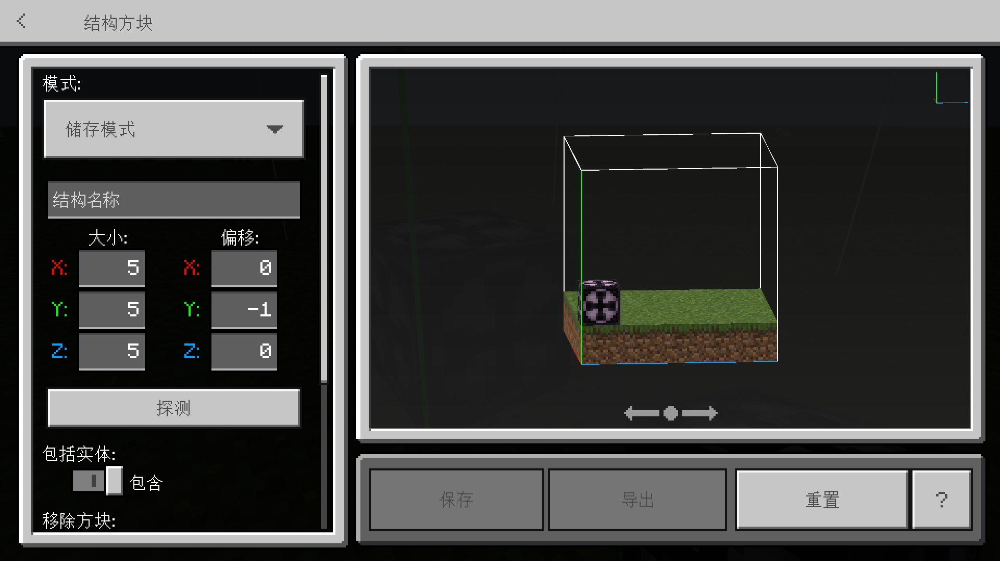
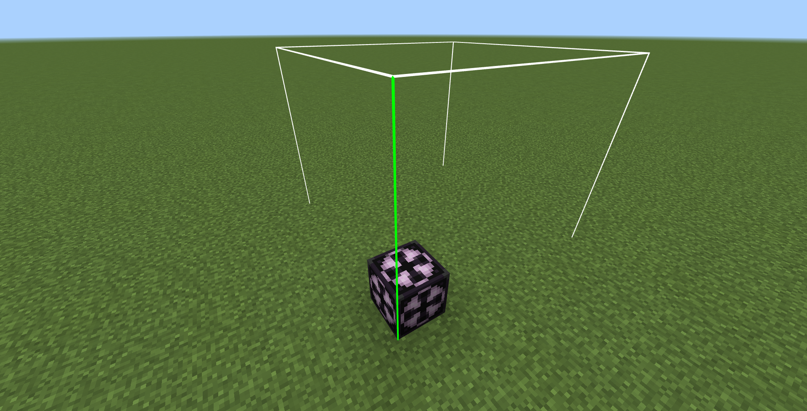
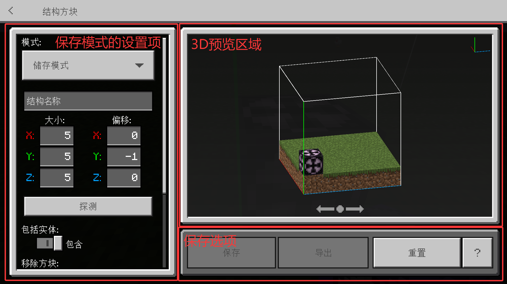
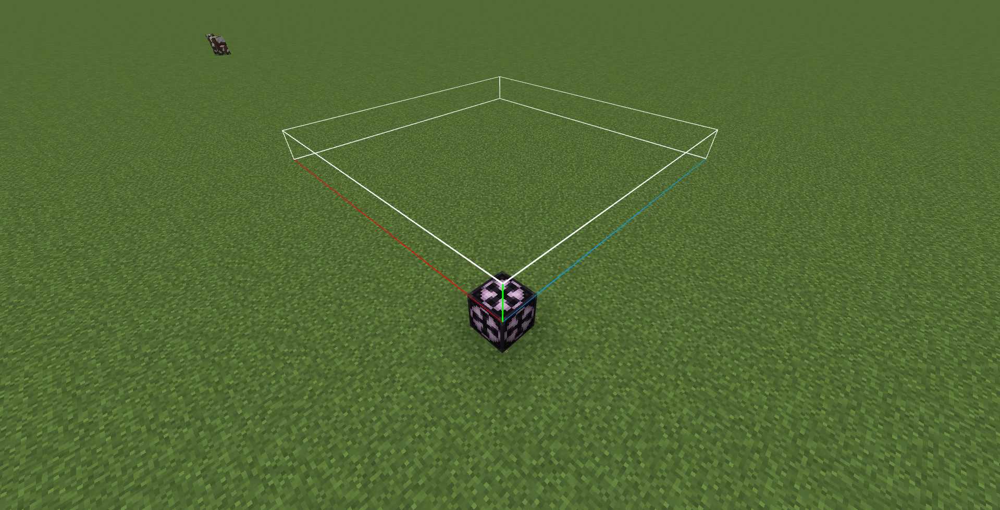
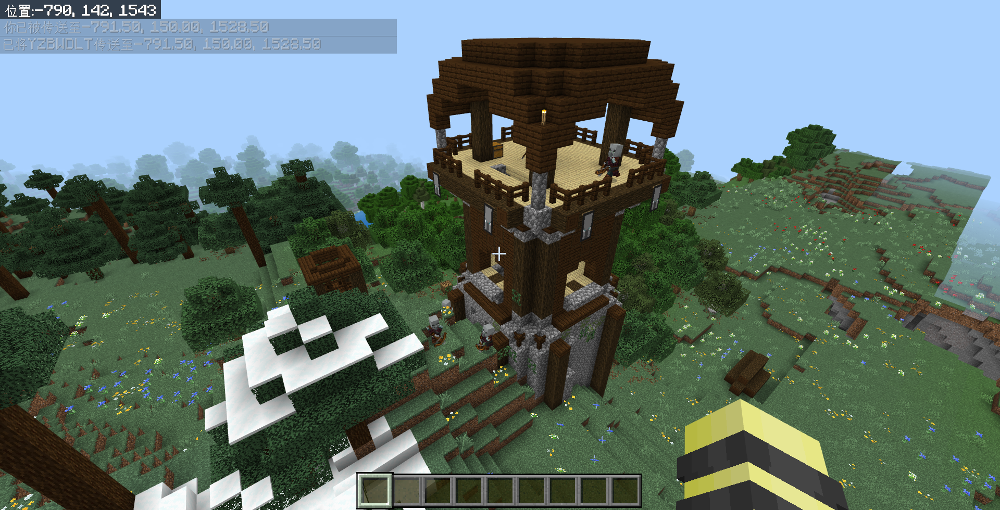
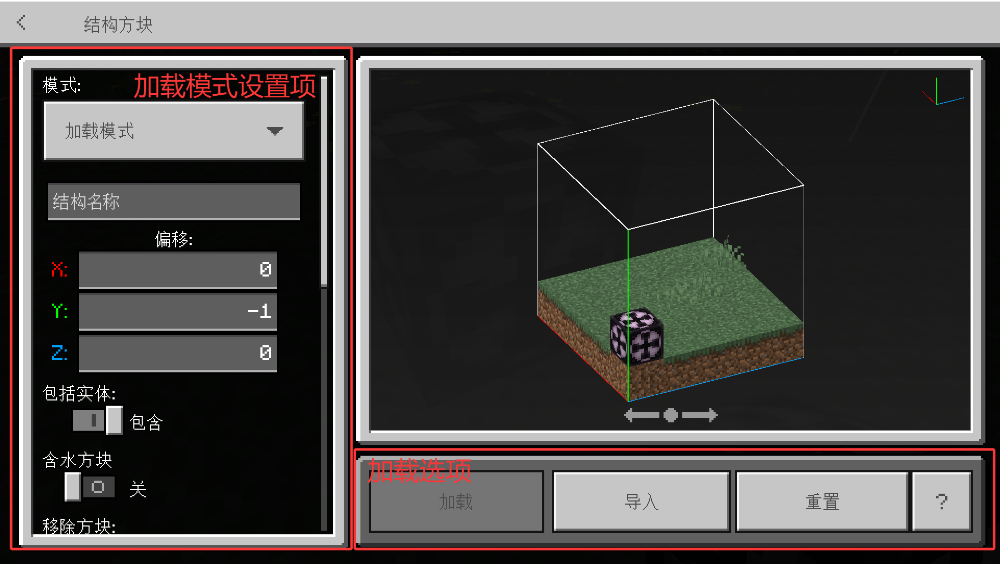
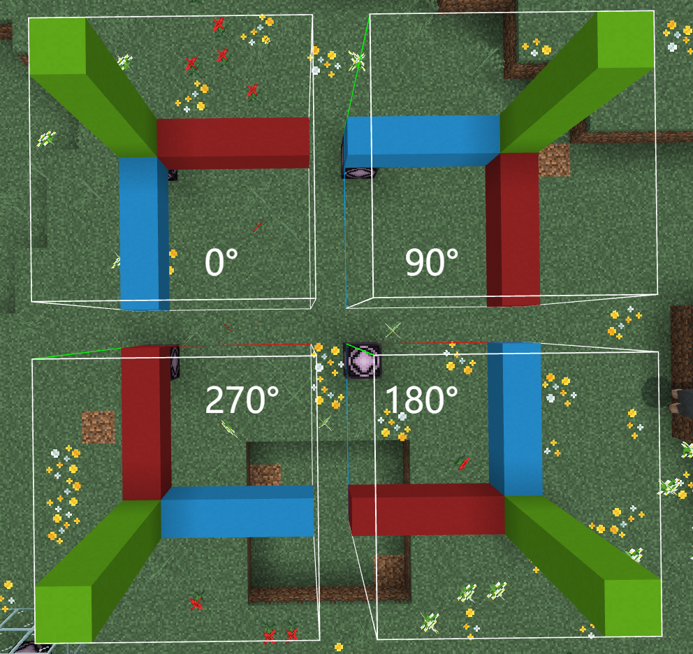
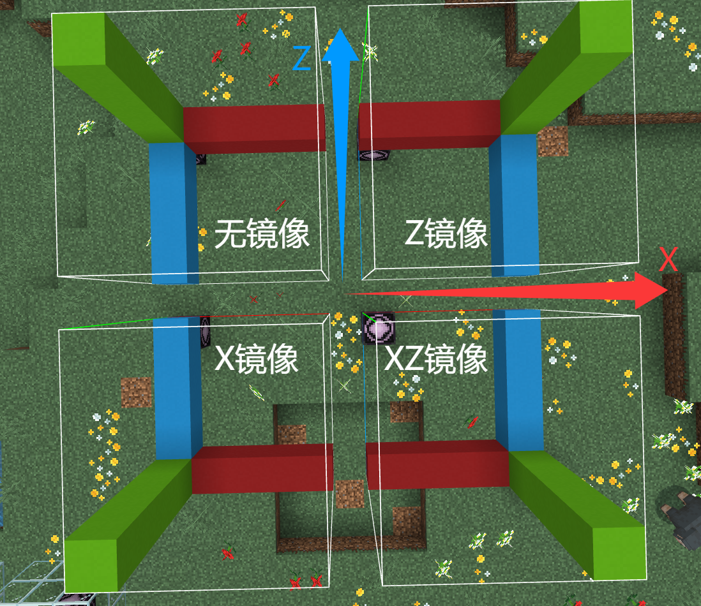
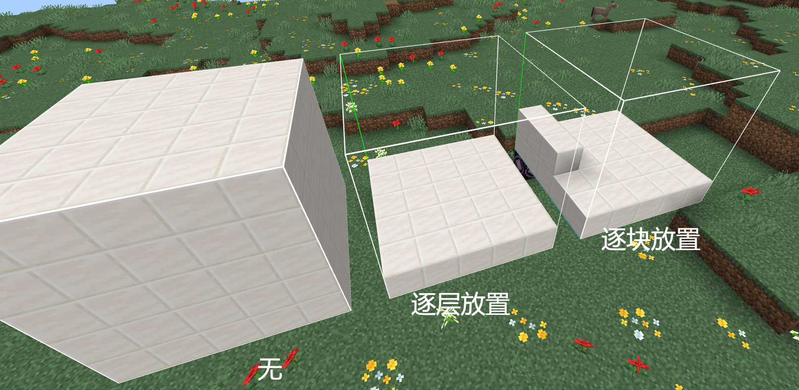

# 3.3 结构方块与结构空位

现在，我们已掌握了绝大多数的基岩版命令领域的核心内容。可以说，掌握了 3.2 之前的内容，你就已经可以制作一张精致且优良的地图了。不过，现在我们要更进一步，继续掌握更多的管理员用品，来为你的项目锦上添花。

这一节，我们要学习的是结构方块和结构空位。在前面，我们已学习过`/clone`命令，这条命令是用来复制粘贴一片区域的方块的。在这里，我们可以明确地告诉你，**结构方块和结构空位也是用来复制粘贴方块的**。虽然`/clone`也同样称得上是高频命令，但是它通常适用于那种简单的、小范围的复制粘贴需求，而结构方块及其配套的`/structure`命令，则可以用来实现更复杂的、大范围的复制粘贴需求。

## 结构方块

**结构方块（Structure Block**，*~这里社区内通常不用简写了，但我不说为啥~*）**是一种用于保存、加载结构，或对结构进行特殊操作的红石元件**。什么是结构？可以说，任何形式的建筑都可以是结构。在使用`/clone`的时候，我们可以复制任意一种区域，甚至可以只复制一个方块，这都可以称之为结构。毕竟，structure 这个单词除了结构之外，还可以翻译为建筑，你也可以理解为是对各式各样的建筑进行操作的方块。

:::note[扩展：生成结构]

说起结构这个概念，就不得不提及**生成结构**了。所谓生成结构，就是在 Minecraft 世界中自然生成的建筑，比如村庄、要塞、堡垒遗迹、远古城市等。生成结构的定义是，在 Java 版世界创建界面的“生成结构”选项关闭时会被禁用的任何结构。

使用`/locate`命令所定位的结构`structure`，就指的是这种生成结构。

读者若感兴趣，可以在[生成结构 - 中文 Minecraft Wiki](https://zh.minecraft.wiki/w/生成结构) 中了解更多。

:::

结构方块和命令方块类似，不能在创造模式物品栏中找到，只能使用命令获取。

:::tip[实验 3.3-1]

使用`give @s structure_block`，获取结构方块。

:::

拿到结构方块之后，我们来看看结构方块的 UI 吧：

并且，结构方块会默认把自己要操作的区域的边框呈现在世界中，这大幅提高了待操作区域的可见性，比`/clone`要清晰直观得多：

---

在基岩版，结构方块和命令方块的 3 种类型类似，有 4 种操作模式：**保存模式、加载模式、角落模式和 3D 输出模式**。其中，前两种模式是我们这一节要讲解的核心所在。结构方块复制粘贴结构的逻辑和`/clone`略有不同，`/clone`是不存在中间状态的，直接暴力把一个区域直接粘贴到另一个区域；而结构方块则需要先用保存模式保存一个结构，然后再用加载模式加载结构出来，是存在一个中间状态的。所以，才说`/clone`更适合简单的、小范围的复制粘贴需求。

## 保存模式

保存模式是用于保存结构的模式。在上面的 UI 图中，我们已经看到保存模式的 UI。除了可选定结构方块的模式之外，右侧有一个结构方块选定方块区域的 3D 预览图，右下角可以选择保存结构或导出结构，而左侧则是保存模式的众多设置。

我们现在来关注左侧的各项设置。下面的选项中，**需要格外强调的选项我们已粗体标注，这些是结构方块最核心的功能**。

- **结构名称**：**待保存的结构的名称**。之后加载结构的时候，就要指定这个结构名称。
  - 请注意：*没有任何命令可以查询地图中当前可用的结构，所以请牢记你的结构名称*，如果忘了的话，就只能硬碰硬去试了。同样地，可以考虑使用驼峰命名法或下划线命名法来命名。
  - 注：允许特定的命名空间，比如`doc:test`，其中的`doc`就是命名空间。如果不指定的话，会默认设置为`mystructure`。
- **大小（X Y Z）**：**待保存的结构的大小**，默认为（5, 5, 5）。最大为（64, 320, 64）。
- **偏移（X Y Z）**：**待保存的结构的位置相对于结构方块的位置的偏移**，默认为（0, -1, 0）。
  - 我们曾经讲过，要唯一地指定一个区域，需要指定一个位置，然后从这个位置延伸出大小。所以，偏移就是指定位置的，而大小就是指定大小。读者可以尝试多次调整大小和偏移，体会大小和偏移的作用。
  - 例如，大小设置为（10, 1, 10），偏移设置为（0, 1, 0），效果如下图所示，其中红色代表 X 轴正方向，绿色表示 Y 轴正方向，蓝色表示 Z 轴正方向。  
    ‘
- 探测：这个设置要配合角落模式使用，我们稍后再强调。
- **包括实体**：**待保存的结构是否要包含实体**。默认值为`true`。
  - 是的，结构是允许自含实体的！这是相对于`/clone`的一个重大优势。通常也用这种方法来加载现成的掉落物。
- 移除方块：待保存的结构是否不包含方块。默认值为`false`。
  - 是的，结构方块也可以不保存结构的方块，不过绝大多数情况下都不会有这个需求。
- 红石保存模式：当结构方块被红石信号激活时，是保存在内存中还是保存在硬盘。默认值为保存在内存中。
  - 这个选项常常会引起很多人的困惑，但事实上在大多数情况下这个选项没有什么影响。首先，我们要知道结构方块的本质也是一种红石元件，所以可以通过红石激活，也可以直接通过结构方块的 UI 来手动激活。这个选项就是仅限于红石激活的，如果手动激活就只会保存在硬盘中。大多数情况下我们就是直接手动激活结构方块的。
  - 保存在内存中，是指当使用红石信号激活结构方块后，启用该设置后将创建一个临时结构，这个临时结构会在世界关闭后被销毁。
  - 而保存在硬盘中，是指当使用红石信号激活结构方块后，启用该设置后将创建一个稳定结构，这个稳定结构就不会在世界关闭后被销毁。
  - 要深刻的理解二者的区别，你可以想象一下你的手机的内存和闪存配置，比如 12+256 GB，那个 12GB 就是指代的内存，代表软件在内存这个临时存储空间提取的数据；而 256GB 就是你的硬盘空间。CPU 从来不是直接通过硬盘、闪存读取数据的，是通过内存和缓存这个临时空间读取的数据。所以，使用“保存在内存中”这个选项时，地图关闭后，这个临时的数据就会丢失。
- 显示边框：顾名思义，是否在世界中显示选中区域的边框。默认值为`true`。

所以基本上，**在保存模式下，我们通过大小、偏移和结构名来完整地定义一个结构，并使用结构方块提供的其他设置来对这个结构进行修饰**。

现在，我们再来关注一下底下的这三个按钮：

- **保存**：顾名思义，直接保存结构。注意这里无论如何都是保存到硬盘中。
- **导出**：使用导出按钮后，将把这个结构以`.mcstructure`文件的形式导出出去，供其他地图的结构方块和行为包使用。  
  
  - 这个选项只有 Windows 版本有，手机端是没有的。*~我们手机玩家招你惹你了~*
- 重置：将左侧的设置回退到上一次更改的设置，类似于撤销的操作。

所以，使用结构方块保存结构的大概步骤就是，**设定结构的名称、大小和位置，进行一些杂项设置后，点击保存按钮即可**，必要时还可以导出结构。不过，保存结构有一个很关键的原则就是——不要在结构中带上结构方块，否则在加载的时候也会把这个结构方块加载出来，通常这并不是我们想要的结果，所以一定要谨慎调整偏移量。

:::tip[实验 3.3-2]

新开一张地图，默认世界（不开超平坦）、打开作弊、开创造、显示坐标、关闭天气更替、终为白日，然后使用`/locate structure minecraft:pillager_outpost`寻找掠夺者哨塔，然后用结构方块保存这个结构。注意保存的结构里面不要带上结构方块。

  

保存完了之后就先放这儿，一会儿另有他用……（坏笑）

:::

## 加载模式

现在我们来看加载模式。将左上角的模式从保存模式改为加载模式后，我们可以看到左边的设置项和右下角的几个按钮都发生了变化。

  

对于右下角的三个加载选项，想必你很快就能理解：

- **加载**：加载指定名称的结构。
- **导入**：从导出的`.mcstructure`文件导入结构。这样就可以实现跨存档转换结构了。
  - 这个功能也是仅限 Windows，并且在 1.20.50 才加入。目前的中国版也是可用的了。
- **重置**：将左侧的设置回退到上一次更改的设置。

关键在于左边的设置项。可以看到这里为我们提供了非常多的设置项，我们挨个来分析一下：

- **结构名称**：毫无疑问，这是**待加载的结构的名称**，直接写入保存时使用的结构名称即可。
- **偏移（X Y Z）**：**待保存的结构的位置相对于结构方块的位置的偏移**，默认为（0, -1, 0）。
  - 这里之所以不指定大小，是因为结构本身已经保存了大小信息，这个逻辑是很类似于`/clone`的。
- **包括实体**：**是否将结构内的实体加载出来**，默认为`true`。
- 含水方块：加载结构时，使可含水方块在加载区域的水源方块上可以加载为含水方块。否则，可含水方块会取代水源方块而加载为普通方块。默认为`false`。
  - 然而，如果你加载结构的区域存在水源的话，我们强烈建议你开启这个选项。因为如果不开启这个选项的话，在水源中加载可含水方块并不会像预期的那样取代水源方块，或者更准确地说是“取代了但没完全取代”，具体表现就是这个方块加载为了一种可以像水源一样减速玩家，外观上和普通的含水方块一致，却不像水源方块一样流出水，也不判定为含水方块的 bug 方块，我们称这种现象为“假水”现象。这是一个 bug，所以请不要轻易地尝试利用这个漏洞开发玩法。在后面的模块 5，脚本 API 前事件中，我们还会再看到一次这个 bug。祝愿此漏洞可以早日修复。
- 移除方块：加载结构时，不加载方块。默认为`false`。
- **完整性**：**决定一个结构大约加载其中百分之多少的方块**，默认为`100.00`。
  - 完整性在结构加载中是非常重要的，很多地方都会需要完整性，比如建筑做旧、平台随机挖空、等等。
  - 这里还有一期[由 @小mcblac 制作的一种非常巧妙的随机箱子设计的视频](https://www.bilibili.com/video/BV1ko4y1T7EB)，其中的核心之一就使用了结构加载的完整性的思路，而且即便是读到这里的初学者也可以较好地用我们之前讲解过的理论理解视频中的内容，感兴趣的读者可以看一下。但其中的旧版`/execute`可能需要额外反应一下，读者只需要知道视频中所展现的`detect`是核心，等同于`if block`，以及断链法基本上就等于是无延迟的红石比较器就可以了。两节之后我们就会讲到社区常用的断链法。
- 种子：决定完整性这个选项如何加载其中的方块。即使同样都是 20%，不同的种子也会导致不同的加载效果。
  - 通常我们更关心完整度，不太关心种子。每次加载都会重新生成一个新的种子。
- **旋转**：**决定一个结构以多少度旋转的方式加载**，默认为`0`°。旋转的方向为以 Y 轴为旋转轴时俯瞰的**顺时针**。下图是一个旋转加载的示例，读者可以看到90°、180°、270°顺时针旋转加载所带来的不同效果。  
  
- **镜像（X,Z）**：**决定一个结构以哪个轴作为对称轴加载**，默认为`x`和`z`均不勾选。话不多说，我们直接看实例：  
    
  读者可以清楚地看到以 X、Z 轴为对称轴加载所带来的影响。同时，读者还能注意到这些加载效果和旋转很类似，但实际上却并不一样，所以不可以将旋转和镜像混为一谈，不能直接认为特定的旋转等同于特定的镜像（比如 X 镜像等同于 270° 旋转就是错误的）。
- **动画**：**决定如何加载这个结构，是一层一层加载、一个一个方块加载还是直接一口气加载完，以及加载时间**。分为动画模式（`无`、`逐层放置`、`逐块放置`，默认为`无`）和动画时长（可填写为浮点数，默认为`0.0`）。对于一些大型结构来说，延长动画时长可以防止瞬间加载大量方块所造成的卡顿。下图是一个动画的示例，逐层和逐块放置均设置为 100 秒的动画。
  
- 显示边框：是否在世界中显示选中区域的边框。默认值为`true`。

可以说，只要你愿意动手挨个去试一试，很快就能发现这些设置的用途。所以，使用结构方块加载结构的大概步骤就是，**设定结构的名称和位置，进行一些杂项设置后，点击加载按钮即可**。

## 角落模式

## *3D 输出模式

## 结构空位及其另类用途

## 结构命令`/structure`

---

## 总结与练习
