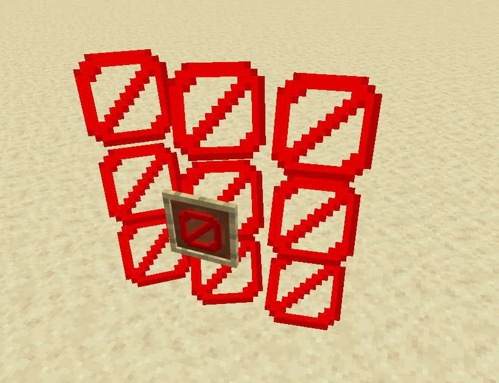
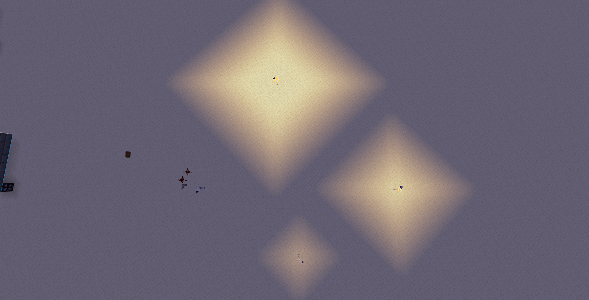
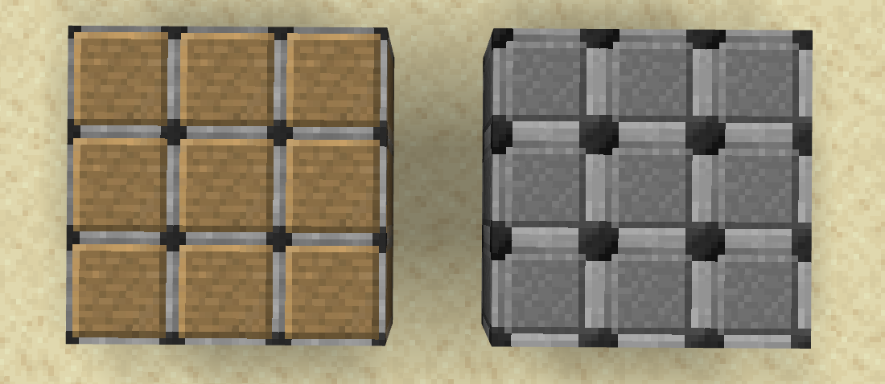
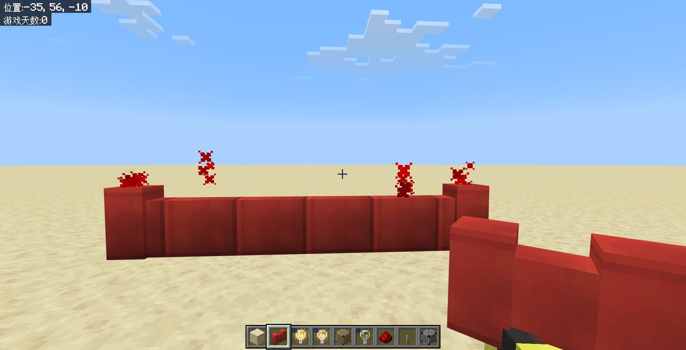

# 3.4 其他管理员用品

在这一节，我们来了解一些其他常见的管理员用品，这些管理员用品都是隐藏在命令中的，用法很简单，而且在实际工程中都有十分常见的应用。

---

## 屏障

**屏障（Barrier）是一种能够阻挡玩家的隐形方块**。*~换言之，空气墙~*

屏障的 ID 是`barrier`，所以要获得屏障可以使用下面的命令：

```text
/give @s barrier
```

屏障的外观如下图所示，为一个红色的禁止图案。和结构空位类似，都是只有创造模式的玩家拿在手上的时候可见。



和结构空位完全相反的是，**它无法被非创造模式的玩家破坏，也不能穿过，所以常常作为隐形的阻挡玩家前进的方块**。

因为其特殊的图案，开发者们也常常在冒险模式下将玩家的特定槽位填充锁定槽位的屏障，代表该槽位已被禁用。不在生存模式这么做的理由是，生存模式的玩家也可以放下屏障。

此外，和结构空位相反的是，屏障是一种红石导体。很反直觉吧？一种完全不可见的方块居然是红石导体哦。

读者应在开发过程中注意：好的地图和游戏设计不应当过多地依赖于空气墙，而应该着重关注地形本身的设计，使地图的表现更加自然。

:::note[扩展：隐形基岩]

曾经玩过基岩版远古版本——携带版的玩家对这种方块一定不陌生。在“有限”世界还存在的时候，这种世界的边界就是由隐形基岩组成的。

隐形基岩和屏障类似，都是不可见且会阻挡玩家移动的方块。而不同点在于，其是真正的完全不可见——即使手持隐形基岩也不会显示隐形基岩出来。而且，它不存在选择箱，也就是说这种方块是无法选中的，所以哪怕是创造模式的玩家也无法破坏这种方块，只能用`/fill`命令强行填充为空气。有些开发者使用这种特性，制作了玩家能够“穿墙”操作却不能进入墙里的机制。

然而，使用隐形基岩却是有风险的。首先，隐形基岩自始至终就不能通过正常的方式（包括命令）获取，而且随着扁平化的进行，隐形基岩可能会在高版本中被直接移除并在新版的世界中解析为屏障，这可能会破坏一些开发者的设计。我们建议开发者可以在学习模块 3 的相关知识后使用自定义方块来实现有碰撞箱但无选择箱的隐形方块。

:::

## 光源方块

光源方块（Light）是一种隐形的自发光方块，有 16 种发光等级。

光源方块的 ID 是`light_block_(光照强度)`，所以要获得光源方块（例如 15 级）可以使用下面的命令：

```text
/give @s light_block_15
```

:::warning[版本适用性警告]

该方块的 ID 于基岩版 1.21.20 拆分。所以，使用更低版本的玩家应当使用更旧的物品 ID 为`light_block`，使用数据值指定其光照强度。例如

```text
/give @s light_block 1 15
```

光源方块曾使用方块状态`block_light_level`，允许从`0`~`15`的整数值。例如，放置一个光照强度为 15 的光源方块为

```text
/setblock ~~~ light_block ["block_light_level"=15]
```

:::

顾名思义，**光源方块能够提供特定的光照强度**。



和屏障、结构空位类似，必须在创造模式下手持才可见此方块。

直接在光源方块上放置其他方块会顶替掉光源方块，和空气类似。某种意义上来说，0 级的光源方块更接近于空气的表现。但特殊地，手持光源方块时与光源方块交互会改变光源方块的亮度。

## 允许方块与拒绝方块

允许方块（Allow）允许玩家挖掘和破坏其上方的方块，而拒绝方块（Deny）则反之。

二者的 ID 分别为`allow`和`deny`。下面的两条命令可供参考。

```text
/give @s allow
```

```text
/give @s deny
```

这里所指的玩家，指代的是非管理员或者非创造模式的玩家。只有创造模式的管理员才能放置允许方块和拒绝方块，并在这两种方块上随意地放置或破坏方块。

这两种方块的外观如下图所示，左边为允许方块，显示为类似于木板的颜色；而右边为拒绝方块，显示为灰色。



对于允许方块而言，无论该玩家处于何种游戏模式下（哪怕是冒险模式），也能随意地在允许方块上方放置方块或破坏方块。所以，**允许方块的摆放通常设计为使冒险模式的玩家拥有类似于生存模式的体验**，并且可以只限定在一个特定的范围内。

而对于拒绝方块而言，无论该玩家处于何种游戏模式下（哪怕是生存模式），也不能随意地在允许方块上方放置方块或破坏方块。所以，**拒绝方块的摆放通常设计到服务器的大厅底部，或者是一些无论如何也不希望玩家破坏的区域上**。一般来说，拒绝方块是更常用的。

允许方块和拒绝方块都无法被非管理员或者非创造模式的玩家破坏。允许方块和拒绝方块都不会影响其下方的区域。

## 边界

边界（Border）是**阻挡玩家或生物从其上方或下方越过的方块**。这里谈的玩家和允许方块、拒绝方块那里的玩家类似，都是非管理员或者非创造模式的玩家。创造模式的管理员可以从其上下方随意地穿过。

边界的 ID 比较特殊，为`border_block`。下面的两条命令可供参考。

```text
/give @s border_block
```

边界的外观类似于红色的墙，如下图所示。边界还会释放出红色的粒子，这个粒子可以由`showBorderEffect`游戏规则控制。



显然，边界的用途和屏障是很类似的，都是阻挡玩家或生物通过。但是读者应当注意，虽然边界可以防止生物越过，但不能阻止弹射物（例如末影珍珠、雪球、鸡蛋等）越过。在一些必要情况下，可能还是需要使用屏障。

---

## 总结

这节我们简单了解了 5 种基岩版的常用管理员用品。我们来简单回顾一下：

- 屏障（Barrier，`barrier`）：用于阻挡玩家的隐形方块。创造模式的玩家手持屏障会显示屏障。
- 光源方块（Light，`light_block_(光照强度)`）：用于发光的隐形方块。创造模式的玩家手持光源方块会显示光源方块。手持光源方块时对光源方块交互可以改变其光照亮度。
- 允许方块（Allow，`allow`）：无论玩家处于何种游戏模式下（哪怕是冒险模式），也能随意地在允许方块上方放置方块或破坏方块。
  - 常用于使冒险模式的玩家在特定区域内拥有类似于生存模式的体验。
- 拒绝方块（Deny，`deny`）：无论玩家处于何种游戏模式下（哪怕是生存模式），也不能随意地在允许方块上方放置方块或破坏方块。
  - 常用于服务器的大厅底部，或者是一些无论如何也不希望玩家破坏的区域上。
- 边界（Border，`border_block`）：阻挡玩家或生物从其上方或下方越过的方块。

本节不设习题，因为这些方块的用法足够简单。读者只需要知道该在什么情况下用这些方块即可。
