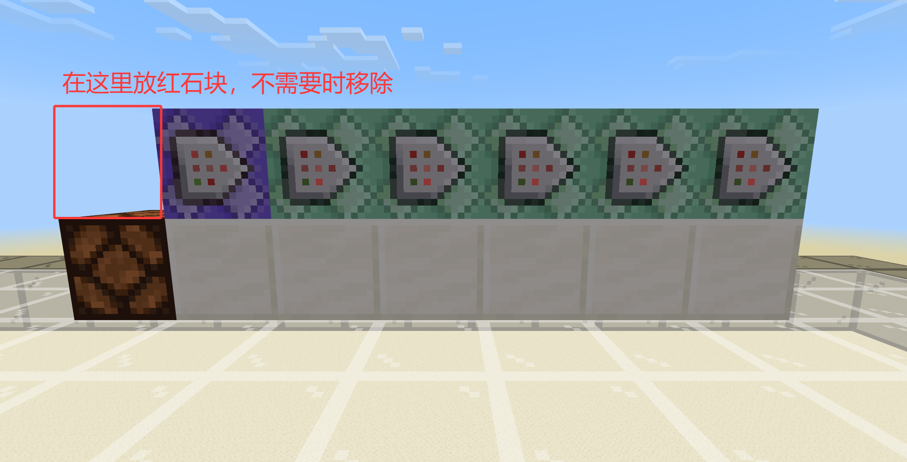

# 3.5 基于命令方块的命令系统

在 3.2 中，我们已经了解了各种各样的命令方块，并且通过命令方块搭建了一个个的简单的命令逻辑。其实，这些**由 CB（链）和红石元件组成的，以实现特定逻辑的装置就可以认为是一种小型的命令系统**。为支撑一个服务器或者地图的运行，只有一个小型的命令系统是不够的，还需要有若干个这样的小型命令系统组合成为一个大型的命令系统。

## 关卡与底层系统的概念

各位开发者在正式进入开发之前，一定都玩过许多优质地图或服务器。这些地图或服务器可以为我们的开发提供一些思路。下面，我们来讲讲在玩法地图中的“关卡”的概念。这里，我们以几张我们和其他开发者的经典或优质地图为例来介绍。

- 以我们的《30 种死法》为例，显然地，这里面有 30 个关卡，还有一个开始屋、一个结束屋和一个用来统计玩家使用提示、跳过情况的统计屋。这 30 个关卡，使用了结构类似的命令系统，而另外 3 种情况则分别采用了 3 种不同的命令系统，其中普通关卡还与统计系统有联动。
- 以著名开发者 @E尘 的恐怖地图《寂静岭》为例，该地图是由多个循环的房间串联而成的，并且存在一个起始屋、一个结束特效。虽然该地图后续的更新不再使用常规的命令系统来实现关卡逻辑，但是我们可以看到这多个房间却满足类似的逻辑，而起始和结束特效则采用不同的逻辑。

上面的两张地图，是一种类似于《植物大战僵尸》冒险模式的，**纯线性**（从头打到尾，不能中途选关）的，经典的分关卡类型的地图。**这些关卡都共享类似的逻辑**，也直接导致它们有着类似的命令系统和类似的功能（但不可能完全一样）。

下面我们再来看几张地图。

- 以我们的《冒险世界：苏醒》为例，这张地图是一张经典的非线性地图（可以中途跳到其他关卡），有着不同的地牢和地牢外的场景。显然，地牢和地牢之间可以使用类似的关卡逻辑，但不同的地牢和地牢外是不可能共用类似逻辑的命令系统或关卡逻辑的，至少从关卡设计上就不是如此，地牢内是各种各样要开门的迷宫（类似于《塞尔达传说：织梦岛》的设计），而地牢外则是连通一个个地牢的大场景；在该作者的后续作品《冒险世界：筑梦》中，这种外部场景和地牢的逻辑差异进一步地放大。
- 以开发者 @绿叶 的《触发》为例，这张地图是一张解谜地图。虽然同样是分关卡的地图，却并不是线性的。因为存在一个大厅，使得玩家可以自由选关，并选择各种各样的关卡分支（有些类似于《植物大战僵尸 2》）。显然，这个大厅也不能和常规关卡一样，共用一个逻辑。

这几张地图，都展现了他们的**非线性**的特点，并且存在一种或多种和常规关卡不共用逻辑的场景，可能是大厅、可能是外部场景、也可能是什么什么的……但最大的特点在于**不共用逻辑**，所以它们的命令系统设计和功能设计也截然不同。

所以，我们可以抽象出在这个教程系列中，**关卡的定义是使用类似逻辑的场景**。因为使用了类似的逻辑，所以在用命令系统实现这些逻辑的时候也必然展现出高度的一致性。而在上面的非线性关卡中，虽然大厅这种场景看起来并不像是常规的关卡，我们也可以认为大厅是一种特殊的关卡。所以，我们可以说，非线性地图是由几种不同类型的关卡所组成的。

谈这么抽象的概念有什么意义呢？

第一，**不同类型的关卡意味着不同的逻辑，这势必会导致不同的命令系统设计**。所以，我们要有意识地了解到并提取出我们的地图或服务器中的相似部分的内容。或是采用关卡模板的方式，或是采用函数调用的方式，总之**要提取出这里面重复的内容完成关卡设计的模板化，这样可以帮助我们快速地根据模板来完成关卡的设计**。

第二，我们来谈谈对于不同类型关卡而言的常用逻辑。考虑一个解密地图，一个关卡会有什么逻辑？**进入**一个关卡、**退出**一个关卡、以及这个**关卡所独有的功能的运行**。如果说完成一个关卡，这也可以是一个基本逻辑，不过本质上完成关卡通常都属于退出关卡的逻辑。所以，大部分的关卡逻辑都可以由至少 3 个 CB 链解决：

- 一个进入关卡执行的逻辑，也就是这个关卡的初始化；
- 一个退出关卡的逻辑，本质上是进入另一个不同类型的关卡（比如大厅）；
- 一个循环执行的逻辑，满足特殊关卡的特殊需求。

大体上，一个关卡的命令系统是类似于下图的构造：


视关卡需求的不同，这三个基本逻辑可以分化出其他逻辑，从而帮助你建立一个复杂的命令系统。

第三，在一些地图中难免会有一些全局都要适用的命令系统，比如在《30 种死法 2》中所采用的时间线系统等，这些系统无论玩家处在什么情况、什么关卡类型下，都在执行，我们称这种**能够影响大多数关卡或大多数类型的关卡运行的系统为底层系统**。底层系统在复杂地图或服务器中可以说是极其常见，哪怕只是循环添加一个饱和效果，都可以认为是底层系统的一环。因为对全局生效，所以底层系统对整个关卡、整个地图（或服务器）的运行都是至关重要的，更改底层系统的行为就是“牵一发而动全身”，很有可能在意外的地方会产生意外的效果。所以，**在设计底层系统的时候应当尽可能地多考虑，尽可能地防止“重构代码”的情况出现**。

特别地，因为关卡模板会影响大部分的关卡，我们也可以认为关卡模板是底层系统的一部分。

对于服务器服主，尤其是租赁服而言，底层系统的设计就显得尤为重要。因为服务器会涌进大量的玩家，而在玩家数量比较多的时候本身就会对服务器的性能提出比较高的要求，这时候我们应当尽可能地优化命令系统，使得其占用尽可能地小。优化的基本原则是，尽可能少运行命令方块，以及尽可能少使用消耗高的命令（比如`/clone`、`/fill`等）。对于一些不必要时时刻刻执行的命令，最好分刻或者延迟执行等。

## CB 区

现在我们来讲讲命令方块区的概念。很多时候，我们都不希望玩家看到裸露的命令方块，除了有被破坏、被利用、造成运行不稳定的风险之外，也不美观，而且随处乱放的命令方块会在玩家远离的时候停止运行，这时候就必须要加常加载区域了。要知道的是常加载区域会导致整个区块被加载，性能消耗是很大的，而且最多也只能添加 10 个常加载区域。所以，我们会寻求一种需求常加载区域少、玩家不可见且整合度高的一种方法，显然，**在玩家难以到达的远处，单开一个区域专门放命令方块就是我们寻求的答案，这就是命令方块区（CB 区，也可称命令区）**。

命令方块区通常的选取原则是：

1. 远。最好远到让玩家看不见。例如对于一些起床战争、空岛战争服务器来说，就绝不能将 CB 区拉近，一旦被玩家破坏，哪怕只是不小心把一个中继器调档，后果都可能是相当严重的。如果不得已要拉近的话，至少也应当让普通玩家看不见，起码放在玩家不可及的地方。
2. 便。因为距离足够远，至少应当选一个方便的坐标以传送到 CB 区里。可想而知，CB 区内的命令是常常需要维护的，如果连自己都找不到 CB 区的话，未免有些太荒诞了。可以选取一个坐标值较大的整数，比如（10000, ?, 10000）这种，这样就算有恶意玩家想爆破，想走到这么远的地方也绝非易事，可以再结合拒绝方块，只有创造模式的管理员才能编辑，效果更佳。
3. 小。不要把 CB 区搞得太大，通常我们会采用 1×1 个区块（16×16 的区域）到 2×2 个区块（32×32 的区域）之间的大小，然后为这些区块添加常加载区域。常加载区域面积太大会对性能造成明显的负担。  
     
   然后，根据常加载区域命令返回的坐标，进行 CB 区的圈地。写命令系统的时候，我们通常采用叠层的方法来容纳我们的复杂逻辑。例如下面的这种 CB 区（仅作为一种示例）。  
   

## 常见的命令系统结构

在上图中我们已经看到一些比较奇特的 CB 链的摆放方式，现在我们来介绍一下比较常见的命令方块摆放方法，以实现我们的不同需求。

### 脉冲链

脉冲链是用于**执行一次我们希望执行的逻辑的**。它的基本构造是，一个信号源下方的 CB 和一个脉冲 CB 链，如下图所示。


在下方那个 CB 写入命令`setblock ~~1~ air`，上面放红石块的时候可以在激活 CB 链的同时清除红石块，这样就便于下一次的重复执行。每次执行时，只要在对应位置放上红石块即可，就不用再考虑清除的问题了。

### 循环链

循环链的构造要更简单一些，它是用于**多次执行我们希望执行的逻辑的**。在 3.2，我们已经详细地讲过循环链的构造和延迟表现，这里便不再过多赘述。



不过，话虽这么说，有一种结构却是我们常常遇到的。通常情况下，大多数有功能的命令（即会对世界运行做出明显改变）是不应该循环执行的，比如`fill`、`kill`等，它们的执行通常在实际工程中都要寻求一个外部条件，一般来说这个外部条件是由**循环检测**来检查的。大多数循环检测的命令的性能消耗都很小，所以只要检测项目没有多到过于逆天的程度，其实不必太过担心性能问题。

所以，很多情况下循环链的起始 RCB 往往是一条循环检测的命令，然后后接大片的条件制约 CCB（以扔出雪球后回复消息为例）：

```text title="高亮部分为条件制约" {2-3} showLineNumbers
execute if entity @e[type=snowball]
say 你丢出了雪球！
kill @e[type=snowball]
```

也可能是所有命令全部使用一个共用的条件：

```text showLineNumbers
execute if entity @e[type=snowball] run say 你丢出了雪球！
execute if entity @e[type=snowball] run kill @e[type=snowball]
```

我们可以专门定义这种循环链叫做**检测 - 循环链**，也就是先进行循环检测，在检测成功后执行一个循环链的结构。

### 检测 - 脉冲链

检测 - 脉冲链是一种先进行循环检测，在检测成功后执行一次命令的命令链。如果读者做过我们的 3.2 习题并看过答案的话，对这种结构一定不会陌生，我们现在就正式介绍这种检测 - 脉冲链。

最常见的方法是，在 RCB 中写入检测项目，然后通过红石比较器检查项目是否成功检测，最后通过红石比较器输出信号并执行一个脉冲 CB 链，如下图所示：


这个原理是很清晰易懂的。还是以扔出雪球后回复消息为例，这时上图的结构可以只简化为 3 个 CB，从左到右的命令为：

```text showLineNumbers
execute if entity @e[type=snowball]
say 你丢出了雪球！
kill @e[type=snowball]
```

### *断链法

在上面的方法中，红石比较器会有 2 游戏刻的延迟，有时我们并不想要这个延迟。如何解决这个问题呢？幸运的是，在 [@小mcblac 的这期视频中](https://www.bilibili.com/video/BV1qG411G7Tz)，给出了一种基于条件制约的 CCB 来代替红石比较器的方法，现在社区称之为**断链法**。

首先我们需要知道的是，只是单纯地在原来的命令方块的位置进行`/setblock ... chain_command_block`的话，并不会更改其中的内容。这样，我们可以用一个条件制约的 CCB 放在 RCB 的后面（也就是下图的②号），前面的命令①：

- 如果执行成功，则将③改为向右，此时 CB 链正确连接，所以后续的命令将会执行；同时，为了防止命令在后续始终执行成功，需要在执行成功后再改变③的方向为断开。
- 如果执行失败，②不会执行，后续命令都不会执行。


因为②和③在这其中约等于扮演红石比较器的作用，检测成功则允许后续命令执行，检测失败则保持断开状态而不允许后续命令执行，所以称之为断链法。

**断链法的本质，其实是一种检测 - 循环链**，如果后续的命令不对先前的检测条件进行更改，那么它的表现和检测 - 循环链是一致的，也就是检测成功后始终执行，而非和检测 - 脉冲链一样是检测成功后只执行一次。例如同样以扔出雪球后回复消息为例，命令分别如下（其中，②号的位置和方向视情况而定）：

```text title="高亮部分为条件制约" {2} showLineNumbers
execute if entity @e[type=snowball]
setblock ~~~1 chain_command_block ["facing_direction"=2]
setblock ~~~ chain_command_block
say 你丢出了雪球！
kill @e[type=snowball]
```

如果在检测 - 脉冲链的例子中和上例中删除`kill @e[type=snowball]`这种会影响检测条件运行的命令，这时检测 - 脉冲链会在有雪球时只执行一次，直到下次出现雪球，而断链法则会不断发送消息。可见，这符合检测 - 循环链的运行方式。

断链法的优势，是能够用类似于检测 - 脉冲链的结构来实现检测 - 循环链，比起所有命令全部套上一个检测的子命令或者全部改为条件制约的 CCB 来说，这样做更符合直觉，而且在链比较长的情况下，这样做可以有效减少触发的命令方块数量，达到一定的优化效果。但是调整命令方块的朝向，以及②号方块后方的方块位置常常也是一个恼人的工作；此外在大多数需求下，这个延迟也确实不会造成太多影响，所以读者应当在这方面做好取舍，目前来说检测 - 脉冲链仍然是最常用的一种检测结构，在大多数需求下它已经足够使用。

## 基于命令方块的命令系统的一个实例：旋转动画

在前面的`/camera`中，我们已经学习了一种绝佳的运镜手法。然而，从`/camera`的运行方式中我们不难看出，在`ease`用法里面的坐标和朝向变化都是线性变化的。什么意思呢？假如说你的相机要从（0, 0, 0）运行到（5, 0, 5），那么`/camera`会把你的相机位置从（0, 0, 0）按照两点所成线段的路径运动到（5, 0, 5），显然这个运动路径在一条直线上而不是曲线上，所以称之为线性变化。那如何实现路径为圆周的效果呢？这时，我们可以使用一个辅助实体来解决。在 3.2 的一个练习题中，我们已经看到让盔甲架原地旋转的命令：

```text showLineNumbers
execute as @e[type=armor_stand] at @s run tp @s ~~~ ~1
```

那么，我们只需要把玩家的相机设置为这个盔甲架前方几格，不就能够实现旋转动画了吗？说干就干，我们首先要有一个旋转的盔甲架，这需要使用 RCB 链来解决。在我们要使玩家旋转面向的那个点生成一个盔甲架，并命名为`facingPos`：

```text showLineNumbers
/execute align xz positioned ~0.5~~0.5 run summon armor_stand facingPos
```


然后在一个 2 CB 的 RCB 链里面写入下面的命令：

```text showLineNumbers
execute as @e[name=facingPos] at @s run tp @s ~~~ ~1
execute as @e[name=facingPos] at @s positioned ^^^5 run camera @a set minecraft:free ease 0.1 linear pos ~~~ facing @s
```


其中，第一条命令读者已经清楚，而第二条命令的含义则是令玩家的相机时刻在盔甲架前方 5 格，并紧盯盔甲架。这样，盔甲架转起来，玩家的相机不就转起来了吗？但是到这里先别急着启动，如果启动了我们就必须用`/camera @a clear`来恢复视角，但是命令方块可是始终执行的，它会重新设置你的视角，就卡在这里了。这里主要请各位注意的是：**启用循环型命令方块之前请务必谨慎**。看来我们要有一个启用视角动画的条件，我们在这里先采用手持钻石好了。这却不难，我们用一个`hasitem`即可解决。

```text showLineNumbers
execute as @e[name=facingPos] at @s run tp @s ~~~ ~1
execute as @e[name=facingPos] at @s positioned ^^^5 run camera @a[hasitem={item=diamond,location=slot.weapon.mainhand}] set minecraft:free ease 0.1 linear pos ~~~ facing @s
```

然后，再加一个恢复视角的命令，也就是当玩家不再手持钻石时就复原视角：

```text showLineNumbers
execute as @e[name=facingPos] at @s run tp @s ~~~ ~1
execute as @e[name=facingPos] at @s positioned ^^^5 run camera @a[hasitem={item=diamond,location=slot.weapon.mainhand}] set minecraft:free ease 0.1 linear pos ~~~ facing @s
camera @a[hasitem={item=diamond,location=slot.weapon.mainhand,quantity=0}] clear
```

现在我们可以启用这个循环链了，看来运行的很好哦！


如果我们要改变一下观察半径，比如采用一个略微俯视的较远的视角，可以改变第二条命令的`^^^5`，比如`^^5^15`（别忘了~坐上钱~左上前），就得到这样的效果：


以及，如果要改变旋转的角速度，可以改变第一条命令的`~1`。

通常我们不希望盔甲架显示出来，这时候可以对盔甲架采用隐身效果。

```text showLineNumbers
execute as @e[name=facingPos] at @s run tp @s ~~~ ~1
execute as @e[name=facingPos] at @s positioned ^^^5 run camera @a[hasitem={item=diamond,location=slot.weapon.mainhand}] set minecraft:free ease 0.1 linear pos ~~~ facing @s
camera @a[hasitem={item=diamond,location=slot.weapon.mainhand,quantity=0}] clear
effect @e[name=facingPos] invisibility 1 0 true
```


这样，我们就用 4 个 CB 实现了旋转视角动画。

## 常见错误的排查方法

在命令系统的编写过程中，我们总是会遇到大大小小的各种错误，也就是我们常常说的“bug”。这是非常正常的，任何程序都是有 bug 的，这无可厚非。那如何排查命令系统中的错误呢？下面介绍几种命令系统的常见错误，供读者参考。

### 语法错误

语法错误是最容易解决的错误。因为语法错误都会明确地给出错误原因和错误位置，比如下面这种语法错误：

```text
effect give @a invisibility
```

我们知道正确的命令应该是`effect @a invisibility`，这里它会返回一个报错：`语法错误：意外的“@a”，出现在“fect give >>@a<< invisibil”`，**观察`>><<`中所包裹的内容**，我们看到这条命令在解析`@a`的时候出现了问题。**遇到这种问题，首先我们要结合语法**，我们不难发现这里将第二个参数解析为了名为`give`的玩家，添加了一个`@a`的状态效果，所以这个状态效果会因为无效而报错。因此，这是一个**因参数对应错误而导致的语法问题**。

有时候，命令也会因为拼写错误而报错，例如

```text
effect @a invisibilty
```

返回一个报错：`语法错误：意外的“invisibilty”，出现在“effect @a >>invisibilty<<”`，经过对比语法我们看到此处确实应该填写为状态效果 ID，所以参数对应没有问题；接下来我们要关注拼写问题，在多数情况下我们能通过报错信息一眼看出拼写问题，但对于这种略微复杂一点点的单词可能就有人看不出这里的拼写错误，建议此时再根据正确的拼写认真拼写一次，就不会出太大问题了。**通过先检查参数对应，再检查拼写错误的思路来检查，基本可以解决 99% 的语法错误的问题**。

有时候我们也会遇到所谓的未知命令的问题，常常出现在越级执行命令的时候，例如用命令方块执行

```text
op @a
```

会报错：`以下命令的权限等级不正确：op。`（以前会报错为：`未知的命令：op，请检查该命令是否存在，以及你对它是否拥有使用权限。`）遇到这种情况，就直接放弃使用命令方块执行吧，毕竟权限等级不适合的话无论如何也是没办法的。

此外还有一些显然的语法指向问题，比如`tp @a ~~~ facing @e[type=pig]`会报错`与选择器匹配的目标过多`等情况，这时候只需要控制`@e[type=pig,c=1]`使其只对一只猪执行即可，等等，这里便不再过多赘述。总之，**读者应当在不断的实践中学会报错信息的看法**。

### 在聊天栏运行成功，而在命令方块运行失败

通常为了调试，我们总是会将命令放在聊天栏中执行来试试效果，然后确认可行之后放在命令方块中执行，然而有时候却发现命令方块执行的效果和聊天栏不一样，通常甚至根本无法执行。出现这种情况，**就要检查执行者和执行环境参数是否出现了问题**。不要忘了，命令方块执行是不等于我们自己执行的，从执行者到执行位置、执行朝向、执行维度往往都不相同。

例如，假设要传送所有玩家，调试的时候用的是`/tp @s ...`，复制到命令方块的时候则需要改成`/tp @a ...`；而尤其是涉及到`/execute`的时候，就更是要慎之又慎。如果不确定具体要怎么做，可以先加一个`/execute as @a at @s run ...`做个嵌套，然后再看看需要怎么改。

### 逻辑性的错误

往往我们遇到的更多问题则是逻辑性的错误，也就是不外显任何语法错误、也往往不会毫无响应（当然有的时候确实也表现为毫无响应），而是确实有执行效果，但执行效果偏离甚至完全背离我们的预期。例如在 3.2 中我们讲过的那个商店就是这样的，会在最后一次能交易的时候同时出现交易成功和交易失败的消息。

对于逻辑性的问题，我们**首先一定要十分明确错误的表现形式**，比如上面的错误是同时出现交易成功和交易失败的消息，然后把我们自己想象成计算机，想象**挨个执行命令的效果是怎么样的，以确定问题根源**，比如在上面的例子中我们发现会先进行清除之后再触发失败消息，所以同时出现交易成功和交易失败的消息。最后，**找到一个解决问题的方案**。大多数情况下，可能只是因为我们的疏忽或者没有考虑到类似的问题，所以**只需要打个补丁，比如加个变量、调换一下命令的顺序就能解决**。当然，有时候也有可能是我们的底层系统设计不周导致的，这时候想要解决类似的问题就十分复杂，**读者应综合考量修复的效益是否和其严重性、难易程度匹配**，如果是不太严重的问题，修复难度还高，那么通常我们就不会修复这样的问题；而如果是修复难度低的问题，或者问题严重到必须修复的情形下，我们才会选择修复这些问题。

---

## 总结

在本节中，我们介绍了基于命令方块的命令系统，主要介绍了**关卡与底层系统的概念、CB 区、常见的 CB 链构造、以及常见的错误解决方法**。这些是我们在实际工程中常常用到的方案，读者可以参考。同时，本节还简单提到了一些实际工程中会遇到的问题，希望对读者未来的地图开发有所帮助。
