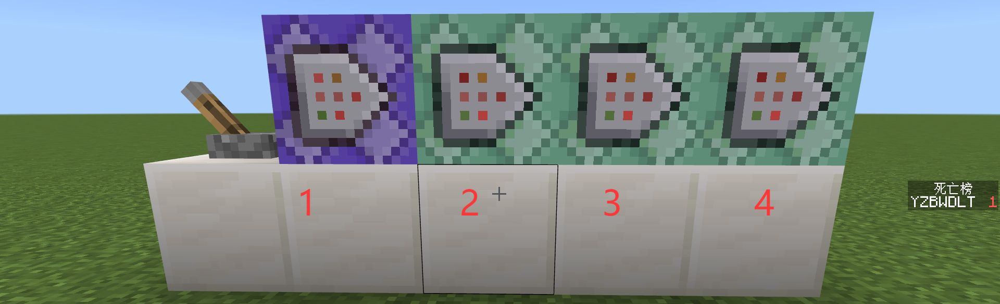
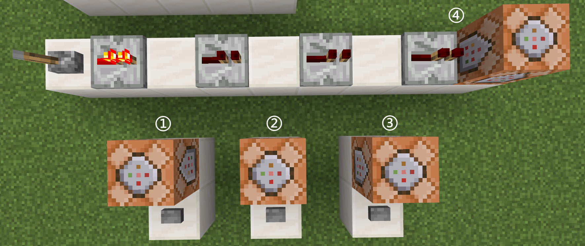
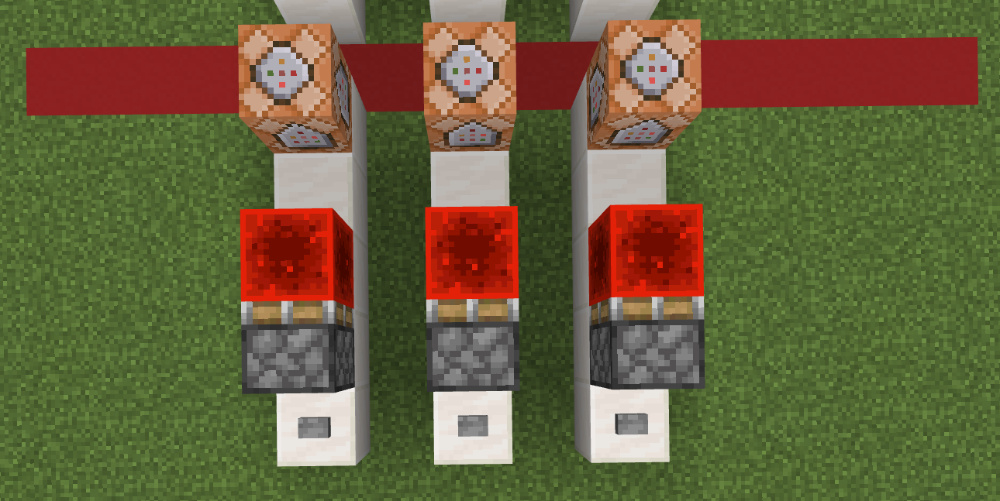
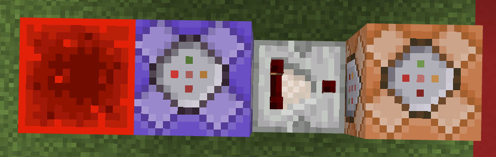
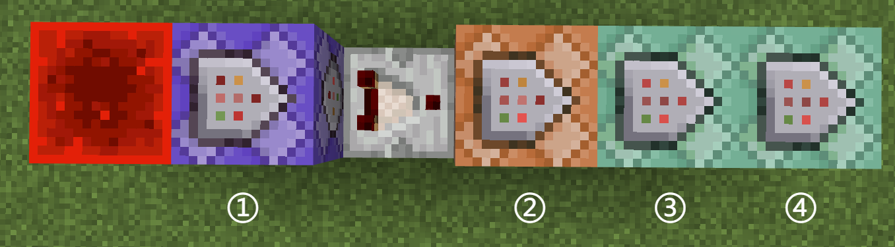
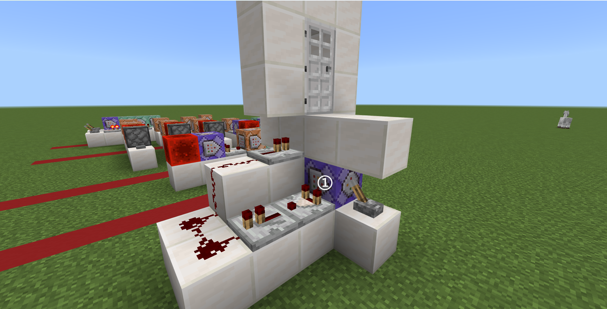

# 第三章小结

## 思考问题答案

### 思考 3.2-1

> 直接激活单个的连锁型命令方块，能激活这个命令方块吗？如果一个 CB 链的起点也是连锁型命令方块，能激活这个 CB 链吗？

答案：不能。单个的连锁型命令方块没有任何指向它的命令方块执行，所以激活单个 CCB 是不会有任何反应的。同理地，如果 CB 链的起点是 CCB，因为没有任何指向它的 CB 被执行，所以无论如何这个 CB 链都是无法被激活的。

很多初学者都会在无指导的情况下，使用拉杆等电源直接激活这三种命令方块，结果发现 CCB 是没有任何反应的，所以有些初学者会错认为这种命令方块是没什么效果的，这种想法是不正确的。

### 思考 3.2-2

> 然而，这样做会存在一个问题：当玩家在购买后正好触发了不足条件，比如剩余 4 颗绿宝石后购买，先触发成功条件，变为 1 颗，然后又会触发失败条件，最终导致成功购买后同时出现购买成功和购买失败的提示。如何才能解决这个问题？

答案：将命令 5\~6 和命令 1\~4 调换即可，先判断是否失败，然后再判断是否成功。

```text showLineNumbers title="高亮部分为条件制约型命令方块" {2,4-6}
execute as @p unless entity @s[hasitem={item=emerald,quantity=3..}]
tellraw @p {"rawtext":[{"text":"§c绿宝石不足！"}]}
execute as @p if entity @s[hasitem={item=emerald,quantity=3..}]
clear @p emerald -1 3
give @p golden_apple 15
tellraw @p {"rawtext":[{"text":"成功购买了金苹果 * 15"}]}
```

### 思考 3.2-3

> 根据上文的 RCB 链的运行逻辑，思考在上例中如何调整 RCB 的延迟刻数，才能让 RCB 链每秒稳定输出下一个数，并在达到`1`后重新输出`5`，实现一个循环？

答案：将 RCB 的延迟改为 100 游戏刻。

## 练习问题答案

### 练习 3.2

注意：命令系统的设计并不是唯一的，所以下面的大部分答案也都是不唯一的，仅供参考。命令系统设计的一些优化原则是：能少用命令方块就少用命令方块；能只执行一次的命令就不要重复执行；尽量把开销大的命令（例如`/fill`、`/clone`）分片分时执行等。总之，能少执行就少执行为好。

1. 将给定命令按照下列 RCB 链排列即可：  
   
2. 设计下图所示的命令系统：
     
   然后，按编号写入下面的命令，其中`...`分别指代其对应的红石导体的位置：

   ```text showLineNumbers
   setblock ... stone
   setblock ... stone 
   setblock ... stone
   say 本章已完成
   ```

3. 这里采用`data.levelCompleted`来指代关卡完成数。显然，当完成一关后，应该为该值加 1。为了防止一个关卡能重复完成多次，可以采用始终激活 CB 的方式，确保它只执行一次。当关卡完成后，就在一个位置上放上红石块，这可以满足我们的需求。最后，检测到满足条件后，应该执行`say 本章已完成`的命令，但是只能执行一次。

   首先，对于红石块的需求，我们可以采用活塞解决：  
     
   这里的每个命令方块的命令都是`scoreboard players add levelCompleted data 1`。

   然后，检测到条件满足后执行一次`say 本章已完成`。检测通常是需要循环执行的，而待执行的命令只能执行一次，这是一个经典的矛盾问题。这里有两种可以考虑的方法：

   1. 使用红石比较器连接：  
        
      其中，RCB 的命令为`execute if score levelCompleted data matches 3..`，CB 的命令为`say 本章已完成`。
   2. 直接在检测成功后停止执行命令：  
        
      其中，RCB 的命令为`execute if score levelCompleted data matches 3.. run say 本章已完成`，CCB 的命令为`setblock ... air`，其中`...`为红石块的坐标。这种方案的优势在于不会在检测成功后引入额外延迟，但缺点在于待执行的命令不能过于复杂，否则会导致后面的命令方块都带上长长的检测条件，并且因为要中间插入命令方块，也不利于后续维护。

   将关卡完成的活塞装置和上面两种检测装置的任意一种拿出来并组合一下，就得到题意需要的命令系统。

4. 和第 3 问类似，这里同样面临检测的循环和给予物品的单次执行的矛盾。这里我们采用经典的红石比较器的思路。检测到物品后，激活 CB 链，清除玩家的原物品并给予一个新物品。然后，为了防止玩家刷物品，可以在给予后就直接停止检测。这样，我们就得到下图的命令系统：
     
   然后，按编号写入下面的命令，其中`...`指代红石块的位置：

   ```text showLineNumbers
   execute if entity @a[hasitem={item=crafting_table}]
   clear @a crafting_table
   give @a crafting_table 1 0 {"can_place_on":{"blocks":["emerald_block"]}}
   setblock ... air
   ```

   视情况，可以继续优化这个逻辑，例如多人适配、或者添加提示语、音效等。

5. 这里可以结合红石系统。此处，设计了如下图的一种感应门，当玩家到 RCB（`testfor @a[y=~2,dy=0]`）上方 2 格时，门会自动打开。注意：这里此时只有一名玩家，所以必须使用红石中继器延续信号。
     
