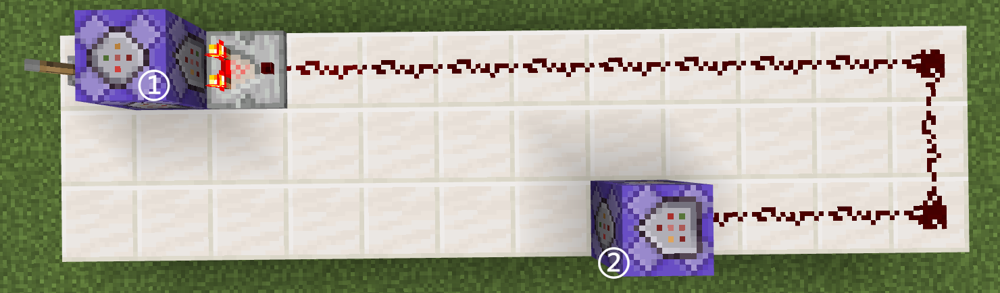
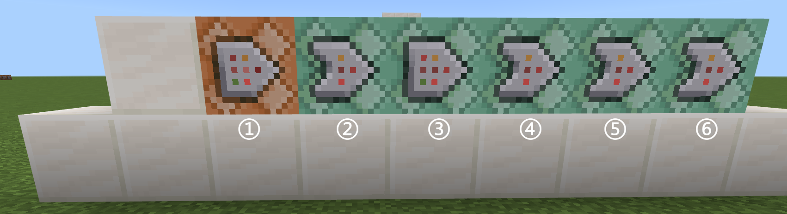

# 第三章小结

很快啊，我们的第三章也已经宣告结束了！至此，在模块 1 中基本上所有命令系统的知识框架你已经系统学习过，凭借这些知识，可以帮助你迅速上手实际工程并展开应用。**在看完本章小结之后，你便可以投入一张地图或者服务器的开发，利用这些理论知识已经足够支撑你尝试制作一个优秀作品出来了**。或者，也接下去来看模块 2 的附加包，也就是基岩版中的模组。**模块 1 完结撒花**！我们现在就开始小结吧！

## 红石原理基础

- 红石元件：是用于搭建红石系统的元件，分为三类：
  - 电源：能够提供红石信号的元件
  - 传输元件：将信号传输到其他元件的元件
  - 机械元件：接收红石信号并干涉世界运行的元件
- 红石导体：被红石信号作用后能够激活毗邻（上下东西南北）的红石元件的方块
- 红石绝缘体（非红石导体）：被红石信号作用后不能够激活毗邻（上下东西南北）的红石元件的方块
- 充能：被红石信号作用后的红石导体，称之为充能状态
  - 根据红石导体的定义，充能的红石导体能够激活毗邻的红石元件
  - 强充能：能激活毗邻的红石粉的充能
  - 弱充能：不能激活毗邻的红石粉的充能，都是由红石粉的信号直接作用引起的充能
- 红石信号强度：红石信号所能传输的最远的格数
  - 红石粉每传输 1 格，信号就衰减 1 级
  - 使用红石粉传输的信号，一定会在超过 15 格后衰减为 0
- 红石刻：红石系统的响应速度都是以 0.1 秒为单位的，一切的红石元件的响应时长都是 0.1 秒的倍数，称 0.1 秒为 1 个红石刻
  - **1 秒= 10 红石刻= 20 游戏刻，或 0.1 秒= 2 游戏刻= 1 红石刻（这个很重要！！！）**
- 高频电路：能以高频率输出脉冲信号的电路
- 逻辑电路：最基础的逻辑电路分为与门、或门、非门
  - 下面的 0 代表无信号（低电平），1 代表有信号（高电平）
  - 非门：输入为 1 时，输出为 0；输入为 0 时，输出为 1
  - 或门：存在一个输入为 1 时，输出为 1；全部输入为 0 时，输出为 0
  - 与门：只有全部输入为 1 时，输出为 1；存在输入为 0 时，输出为 0
- 对于各元件的用法总结，请读者在 [3.1](section1) 的对应部分进行实验并自行理解，这里不再过多赘述。

## 命令方块

- 命令方块是一种用于执行提前写入的命令的红石元件。
- 命令方块的上下文信息：
  - 执行者：不存在执行者实体，执行者名称为“悬停注释”的名称，默认为`!`。
  - 执行环境参数：执行位置为命令方块的位置，执行朝向为`(xRot=0,yRot=0)`，执行维度为命令方块所在的维度。
  - 执行权限等级：为`1`。
  - 执行输出反馈：内容写入到“上一次输出”中，并将执行成功次数保存到命令方块的信息中，可用红石比较器读取。
- 针对命令方块的 4 种常用游戏规则：
  - `commandBlockOutPut`：控制命令方块的执行效果是否输出到聊天栏。通常关闭。*毕竟你也不希望开循环型命令方块的时候被消息轰炸吧？*
  - `sendCommandFeedBack`：控制命令的反馈效果是否输出到聊天栏。通常在开发过程中，需要的时候开启，其余情况下关闭。
  - `commandBlocksEnabled`：控制命令方块是否启用。通常开启，因为关掉就不能用命令方块了。
  - `maxCommandChainLength`：控制命令方块链的最大长度。通常保持为默认值`65535`。
- 命令方块的命令输入区和保存、取消方法：
  - 在右上角的命令输入区中写入命令，可以不带`/`。
  - 命令输入区的左数第一个定位按钮为粘贴剪切板的内容，第二个加号按钮为展开命令输入区。
    - 在展开的情况下，点击右上角的减号可以收缩命令输入区。
  - 按下`ESC`或右上角的`x`可以保存命令方块的更改并退出命令方块的界面。
  - 按下左下角的`取消`不会保存命令方块的更改并退出命令方块的界面。
- 命令方块的悬停注释：
  - 可以在“悬停注释”中添加命令方块的简要注释，在指向命令方块的时候会像物品展示框一样展示这段注释。
  - 会将命令方块的执行者名称改为这个值。
- 命令方块的类型：
  - 脉冲型：激活一次就执行一次。
  - 连锁型（Chain Command Block，简称CCB）：**指向**连锁型命令方块的命令方块**执行**后执行。
  - 循环型（Repeating Command Block，简称RCB）：激活状态下循环执行。
- 命令方块的执行条件：
  - 不受制约：不论命令方块背后是否有命令方块，也不论命令方块背后的命令方块是否成功执行，都在激活后执行
  - 条件制约：只有命令方块**背后**的命令方块**成功执行**后执行。
    - 请注意不要和连锁型命令方块的执行条件混淆，需要注意的点已经粗体标出。
- 命令方块的红石控制（启动条件）：
  - 红石控制：只有接收到红石信号后激活。
    - 脉冲型命令方块通常使用这个模式；推荐循环型命令方块使用这个模式。
  - 保持开启：无论是否接收到红石信号，都始终激活。
    - 连锁型命令方块通常使用这个模式。
- 命令方块链（CB 链）：
  - 由一个脉冲型或循环型命令方块开头，后接若干个保持开启的连锁型命令方块的结构。
  - 通常采用平放或竖直放置的方式，可以拐弯甚至蛇形走位。
  - 相比于红石布线使大量命令方块按顺序执行的方式，命令方块链在易编辑性、延迟表现、摆放方式等方面都显著更优。
- 命令方块的延迟执行：
  - 延迟刻数：
    - 在这个命令方块被激活的状态下，要延迟多久才执行一次命令。
    - 对于脉冲和循环这两种类型的命令方块，`0`和`1`是等价的，都是在激活后的下一个游戏刻执行；而对于连锁型命令方块，`0`和`1`并不等价，`1`会展现出它的延迟特性。
    - 对于命令方块链，各命令方块依次延迟执行，但循环型命令方块的延迟执行是独立的。所以，对于循环型命令方块链，通常将起始的循环型命令方块的延迟设置为大于其他连锁型命令方块的延迟刻数的总和，以使其执行效果不会发生混乱。
  - 在首刻执行：
    - 只能用于循环型命令方块，决定是否在启动后就立刻执行。
- 常用的命令方块快捷键：
  - 可以用`Ctrl`+`A`全选、`Ctrl`+`C`复制、`Ctrl`+`V`粘贴。
  - 可以用`Ctrl`+`鼠标中键`选取带有相同信息的命令方块。

## 结构方块、结构空位与命令`/structure`

- 结构方块（Structure Block）
  - 是一种对结构（建筑）进行操作（主要是复制粘贴）的红石元件。必须通过命令（ID：`structure_block`）获取。
  - 和`/clone`的关系
    - 都用于复制粘贴特定区域的建筑（结构）。
    - 结构方块的优势：相比于`/clone`，结构方块能够保存结构里的实体、能够按照特定的旋转、镜像、完整度、动画加载、以及有清晰的边框反映结构方块影响的区域，所以功能性上是远强于`/clone`的。
    - 结构方块的劣势：但是，因为存在一个“中间状态”，使得复制粘贴小范围的方块的时候并没有`/clone`来的方便。
  - 有 4 种模式：保存模式、加载模式、角落模式和 3D 输出模式。
    - 保存模式：**用于保存结构的模式**，通过**大小**、**偏移**和**结构名**来完整地定义一个结构，并使用结构方块提供的其他设置（**包括实体**、移除方块、红石保存模式、显示边框）来对这个结构进行修饰，最后通过保存按钮来保存结构，也可以通过导出按钮导出一个`.mcstructure`结构文件。*注意一个保存原则是：不要在结构内保存结构方块。*
    - 加载模式：**用于加载刚刚保存的，或从外部导入的结构的模式**。通过**偏移**和**结构名**定义加载的结构及其位置，并使用结构方块提供的其他设置（**包括实体**、含水方块、移除方块、**完整性**、种子、**旋转**、**镜像**、**动画模式**、**动画时长**、显示边框）来对这个结构进行修饰，最后通过加载按钮来加载结构。
    - 角落模式：和保存模式联合使用，用于确定一个区域的两个角落。
    - 3D 输出模式：用于导出一个`.glb`的 3D 模型文件。
- 结构空位（Structure Void）
  - **标记加载结构时不替换某一位置的方块**。必须通过命令获取。
  - 是一种完整方块，一些可附着方块（灯笼、告示牌等）可以附着在其表面形成稳定的悬空方块。
  - 具有一些和空气类似的性质，可穿过且特定情况下不可见。但是，可以在生存模式下被破坏，也因为其完整方块的性质而不允许其他方块直接替换。
- 结构命令`/structure`
  - 分为`save`、`load`、`delete`用法。
  - 其中，`save`和`load`用法的功能都来自于结构方块。
  - 而`delete`用法则清除特定名称的结构。

## 屏障、光源方块、允许与拒绝方块、边界

- 屏障（Barrier，`barrier`）：用于阻挡玩家的隐形方块。创造模式的玩家手持屏障会显示屏障。
- 光源方块（Light，`light_block_(光照强度)`）：用于发光的隐形方块。创造模式的玩家手持光源方块会显示光源方块。手持光源方块时对光源方块交互可以改变其光照亮度。
- 允许方块（Allow，`allow`）：无论玩家处于何种游戏模式下（哪怕是冒险模式），也能随意地在允许方块上方放置方块或破坏方块。
  - 常用于使冒险模式的玩家在特定区域内拥有类似于生存模式的体验。
- 拒绝方块（Deny，`deny`）：无论玩家处于何种游戏模式下（哪怕是生存模式），也不能随意地在允许方块上方放置方块或破坏方块。
  - 常用于服务器的大厅底部，或者是一些无论如何也不希望玩家破坏的区域上。
- 边界（Border，`border_block`）：阻挡玩家或生物从其上方或下方越过的方块。

## 基于命令方块的命令系统

- 由 CB（链）和红石元件组成的，以实现特定逻辑的装置就可以认为是一种小型的命令系统。
- 在地图制作中，使用类似逻辑的场景就可以认为是一类**关卡**。
  - 不同类型的关卡意味着不同的逻辑，这势必会导致不同的命令系统设计。
  - 要提取出这里面重复的内容完成关卡设计的模板化，这样可以帮助我们快速地根据模板来完成关卡的设计。
  - 一个关卡的基本逻辑大概分为三种：进入、退出、关卡独有功能的运行，其他逻辑都可以从这三个基本逻辑分化而来。
- 能够影响大多数关卡或大多数类型的关卡运行的系统为**底层系统**。
- 在玩家难以到达的远处，单开一个区域专门放命令方块，就是命令方块区（CB 区，也可称命令区）。
- 命令系统常见结构
  - 脉冲链：用于执行一次希望执行的逻辑，基本构造是一个信号源下方的 CB（写入`setblock ~~1~ air`）和一个脉冲 CB 链。
  - 循环链：用于多次执行希望执行的逻辑，基本构造就是循环 CB 链。
  - 检测 - 脉冲链：先进行循环检测，在检测成功后激活脉冲链，基本构造是在 RCB 中写入检测项目，然后通过红石比较器检查项目是否成功检测，最后通过红石比较器输出信号并执行一个脉冲 CB 链。
  - 检测 - 循环链：先进行循环检测，在检测成功后激活循环链。检测 - 循环链中往往有大量的条件制约型 CCB。
    - 社区中所说的断链法本质上也是一种检测 - 循环链，只是其程序编写逻辑更类似于检测 - 脉冲链。
- 常见错误的排查方法
  - 语法问题：通过先检查参数对应，再检查拼写错误的思路来检查，基本可以解决 99% 的语法错误的问题。
  - 在聊天栏运行成功，而在命令方块运行失败：检查执行者和执行环境参数是否出现了问题，可考虑套用`/execute`以纠正执行环境的问题。
  - 逻辑错误：先明确错误的表现形式；然后挨个执行命令的效果是怎么样的，以确定问题根源；最后找到一个解决问题的方案，通常只需要打个补丁，比如加个变量、调换一下命令的顺序就能解决。
  - 读者还应综合考量修复的效益是否和其严重性、难易程度匹配，如果问题不严重修复还难，通常我们就不会修复。

## 思考问题答案

### 思考 3.2-1

> 直接激活单个的连锁型命令方块，能激活这个命令方块吗？如果一个 CB 链的起点也是连锁型命令方块，能激活这个 CB 链吗？

答案：不能。单个的连锁型命令方块没有任何指向它的命令方块执行，所以激活单个 CCB 是不会有任何反应的。同理地，如果 CB 链的起点是 CCB，因为没有任何指向它的 CB 被执行，所以无论如何这个 CB 链都是无法被激活的。

很多初学者都会在无指导的情况下，使用拉杆等电源直接激活这三种命令方块，结果发现 CCB 是没有任何反应的，所以有些初学者会错认为这种命令方块是没什么效果的，这种想法是不正确的。

### 思考 3.2-2

> 然而，这样做会存在一个问题：当玩家在购买后正好触发了不足条件，比如剩余 4 颗绿宝石后购买，先触发成功条件，变为 1 颗，然后又会触发失败条件，最终导致成功购买后同时出现购买成功和购买失败的提示。如何才能解决这个问题？

答案：将命令 5\~6 和命令 1\~4 调换即可，先判断是否失败，然后再判断是否成功。

```text showLineNumbers title="高亮部分为条件制约型命令方块" {2,4-6}
execute as @p unless entity @s[hasitem={item=emerald,quantity=3..}]
tellraw @p {"rawtext":[{"text":"§c绿宝石不足！"}]}
execute as @p if entity @s[hasitem={item=emerald,quantity=3..}]
clear @p emerald -1 3
give @p golden_apple 15
tellraw @p {"rawtext":[{"text":"成功购买了金苹果 * 15"}]}
```

### 思考 3.2-3

> 根据上文的 RCB 链的运行逻辑，思考在上例中如何调整 RCB 的延迟刻数，才能让 RCB 链每秒稳定输出下一个数，并在达到`1`后重新输出`5`，实现一个循环？

答案：将 RCB 的延迟改为 100 游戏刻。

## 练习问题答案

### 练习 3.2

注意：命令系统的设计并不是唯一的，所以下面的大部分答案也都是不唯一的，仅供参考。命令系统设计的一些优化原则是：能少用命令方块就少用命令方块；能只执行一次的命令就不要重复执行；尽量把开销大的命令（例如`/fill`、`/clone`）分片分时执行等。总之，能少执行就少执行为好。

1. 将给定命令按照下列 RCB 链排列即可：  
   
2. 设计下图所示的命令系统：
     
   然后，按编号写入下面的命令，其中`...`分别指代其对应的红石导体的位置：

   ```text showLineNumbers
   setblock ... stone
   setblock ... stone 
   setblock ... stone
   say 本章已完成
   ```

3. 这里采用`data.levelCompleted`来指代关卡完成数。显然，当完成一关后，应该为该值加 1。为了防止一个关卡能重复完成多次，可以采用始终激活 CB 的方式，确保它只执行一次。当关卡完成后，就在一个位置上放上红石块，这可以满足我们的需求。最后，检测到满足条件后，应该执行`say 本章已完成`的命令，但是只能执行一次。

   首先，对于红石块的需求，我们可以采用活塞解决：  
     
   这里的每个命令方块的命令都是`scoreboard players add levelCompleted data 1`。

   然后，检测到条件满足后执行一次`say 本章已完成`。检测通常是需要循环执行的，而待执行的命令只能执行一次，这是一个经典的矛盾问题。这里有两种可以考虑的方法：

   1. 使用红石比较器连接：  
        
      其中，RCB 的命令为`execute if score levelCompleted data matches 3..`，CB 的命令为`say 本章已完成`。
   2. 直接在检测成功后停止执行命令：  
        
      其中，RCB 的命令为`execute if score levelCompleted data matches 3.. run say 本章已完成`，CCB 的命令为`setblock ... air`，其中`...`为红石块的坐标。这种方案的优势在于不会在检测成功后引入额外延迟，但缺点在于待执行的命令不能过于复杂，否则会导致后面的命令方块都带上长长的检测条件，并且因为要中间插入命令方块，也不利于后续维护。

   将关卡完成的活塞装置和上面两种检测装置的任意一种拿出来并组合一下，就得到题意需要的命令系统。

4. 和第 3 问类似，这里同样面临检测的循环和给予物品的单次执行的矛盾。这里我们采用经典的红石比较器的思路。检测到物品后，激活 CB 链，清除玩家的原物品并给予一个新物品。然后，为了防止玩家刷物品，可以在给予后就直接停止检测。这样，我们就得到下图的命令系统：
     
   然后，按编号写入下面的命令，其中`...`指代红石块的位置：

   ```text showLineNumbers
   execute if entity @a[hasitem={item=crafting_table}]
   clear @a crafting_table
   give @a crafting_table 1 0 {"can_place_on":{"blocks":["emerald_block"]}}
   setblock ... air
   ```

   视情况，可以继续优化这个逻辑，例如多人适配、或者添加提示语、音效等。

5. 这里可以结合红石系统。此处，设计了如下图的一种感应门，当玩家到 RCB（`testfor @a[y=~2,dy=0]`）上方 2 格时，门会自动打开。注意：这里此时只有一名玩家，所以必须使用红石中继器延续信号。
   

6. 这一问的要求开始变得复杂起来，主要是因为这是实际工程中常用的与 NPC 交互的逻辑。首先，我们需要明确目标：我们要实现村民的检测，然后后续调整权限、传送、对话这些操作都只需要执行一次即可。只需要将我们后续那个比较复杂的需求按顺序写成一个 CB 链即可解决。为此，我们还是设计如下图的命令系统：
   
   然后，按编号写入下面的命令，其中第 6~11 个命令方块应设置为 80 刻的延迟刻数：

   ```text showLineNumbers
   execute as @e[type=villager] at @s if entity @a[r=3]
   execute as @e[type=villager] at @s run tp @a ^^^3
   execute as @a at @s run tp @s ~~~ facing @e[type=villager,c=1]
   inputpermission set @a movement disabled
   inputpermission set @a camera disabled
   execute as @e[type=villager] run say 这是第一句话
   execute as @e[type=villager] run say 这是第二句话
   execute as @e[type=villager] run say 这是第三句话
   execute as @e[type=villager] run say 这是第四句话
   execute as @e[type=villager] run say 这是第五句话
   inputpermission set @a movement enabled
   inputpermission set @a camera enabled
   ```

   命令逻辑是比较简单的，这里不再详细解析。无法理解上述命令含义的读者请回顾第 2 章的内容。

7. 这个问题非常简单，命令方块写入`setblock ~~1~ air`即可。通常来说，结合 CB 链可以实现多次的 CB 链调用，例如下图的结构中可以通过多次放置红石块的方式来多次调用这个 CB 链，因此这种结构是一种很常见的扩展版 CB 链结构。  
   

8. 不使用记分板检查玩家，可以使用`/testfor @a`+红石比较器检测的方法。注意：这里不能使用`/execute if entity @a`了，因为这条命令的执行成功次数固定为 1。
     
   注意红石线路的长度为 14。然后，按编号写入下面的命令，其中第 2 个命令方块应该设置为 20 刻的延迟刻数：

   ```text showLineNumbers
   testfor @a
   scoreboard players remove startCountdown time 1
   ```

9. 这里我们需要检测玩家是否扔出钓竿，然后执行单次的命令。很经典的循环与单次的矛盾，所以采用红石比较器结构。检测钓竿可以使用`execute if entity`命令检查浮漂，然后检查到之后将距离浮漂最近的玩家传送，并立刻移除浮漂以防误判，这就是最基础的“钓竿回城”了。
   

   ```text showLineNumbers
   execute if entity @e[type=fishing_hook]
   execute as @e[type=fishing_hook] at @s run tp @p 0 128 0
   kill @e[type=fishing_hook]
   ```

   不过这样做，会导致额外的延迟。事实上我们注意到，在我们这个思路的最后，移除了浮漂，**这直接影响了一开始的检测条件**，所以哪怕后面两条命令循环执行，最后的传送效果也是单次的传送。所以，这个思路可以继续优化为
   

   ```text showLineNumbers {2} title="高亮部分为条件制约型命令方块"
   execute as @e[type=fishing_hook] at @s run tp @p 0 128 0
   kill @e[type=fishing_hook]
   ```

   这里不使用条件制约也是可以的，这个小优化只是为了每游戏刻少执行一些命令而已。

10. 商店的逻辑已在实验 3.2-8 中讲过，这里不再赘述，直接给出命令系统和答案。
    

    ```text showLineNumbers {2,4-6} title="高亮部分为条件制约型命令方块"
    execute as @p unless entity @s[hasitem={item=rotten_flesh,quantity=36..}]
    tellraw @p {"rawtext":[{"text":"§c腐肉不足！"}]}
    execute as @p if entity @s[hasitem={item=rotten_flesh,quantity=36..}]
    clear @p rotten_flesh -1 36
    give @p emerald 1
    tellraw @p {"rawtext":[{"text":"成功购买了绿宝石 * 1"}]}
    ```

    顺带一提，可以将实验 3.2-8 中第 1\~2 条命令和第 3\~6 条命令调换的理论基础，也是检测条件会在物品清除时被更改。请注意，**要格外关注检测条件会在执行逻辑中被更改的问题，这往往会导致一系列的意外问题**。

11. 这里首先要进行玩家的维度检测，这在我们讲记分板（练习 2.4-3 第 8 题）的时候曾经提过，可以用`dimension.@s`记录玩家的维度信息，然后基于`execute in`和`rm`目标选择器参数来进行检测：
    

    ```text showLineNumbers
    execute in overworld run scoreboard players set @a[rm=0] dimension 0
    execute in nether run scoreboard players set @a[rm=0] dimension 1
    execute in the_end run scoreboard players set @a[rm=0] dimension 2
    ```

    接下来，我们需要找到刚进下界的玩家，将其传送到(0,128,0)。我们可以想到，只要检测到`dimension.@s`不为`1`的玩家在下界里面，不就是刚进下界么？但是，单开一个 RCB 链却不太现实，因为我们不敢保证是上面的 RCB 链先执行还是我们新加的 RCB 链先执行。所以，我们必须基于上面的 RCB 链进行改进，在第一个命令方块前面新增检测和传送命令，然后再更改状态，就能保证先后的逻辑问题。综上，答案为  
    

    ```text showLineNumbers
    execute in nether run tp @a[rm=0,scores={dimension=!1}] 0 128 0
    execute in overworld run scoreboard players set @a[rm=0] dimension 0
    execute in nether run scoreboard players set @a[rm=0] dimension 1
    execute in the_end run scoreboard players set @a[rm=0] dimension 2
    ```

    注意为保证这个命令系统在维度切换的时候依然能正常运行，必须使用`/tickingarea`添加一个常加载区域，使这个 CB 链常加载。在这里，基于命令方块的命令系统的一些弊端可以说是已经初见端倪，你已经能看到基于已经成型的命令方块进行改进还是有些麻烦的，尤其是中间插入命令的时候。所以，事先做好命令设计还是比较重要的。

12. 这题很简单，用`tp`命令就好了。注意命令方块的上下文，所以需要套一个`execute`。综上，答案为：
    

    ```text showLineNumbers
    execute as @e[type=armor_stand] at @s run tp @s ~~~ ~1
    ```

    更改`~1`为别的值可以变换自转的角速度，而改为负数则可以变换旋转方向。

13. 新增一个 T 显即可。答案为：
      
    新增的 CCB 的命令：

    ```text showLineNumbers
    titleraw @a actionbar {"rawtext":[{"translate":"§c%%s§e秒后开始游戏！","with":{"rawtext":[{"score":{"objective":"time","name":"startCountdown"}}]}}]}
    ```

14. 同理地，检测用`/execute if blocks`，而执行脉冲 CB 链只执行一次，所以用红石比较器结构。
      
    具体命令不再给出，因为题干并没有明确指定确定的空区域，读者能够理解其中的意思即可。
