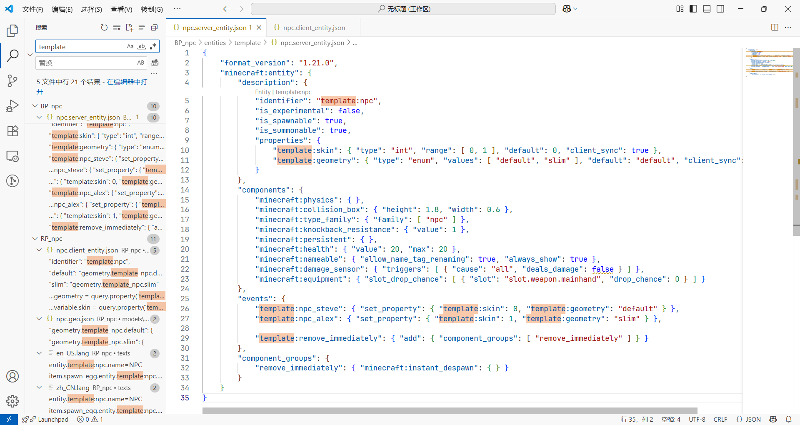

# 主包 v2

import '/src/css/treeview.css';
import FileType from "/src/components/type/file"
import Download from "/src/components/highlight/download"

<Download url="https://app.nekodrive.net/s/XdquY"/>

**本包用于创建在玩法地图中常见的实体：NPC**。

现在的地图常常使用盔甲架、村民等实体作为地图中的 NPC。虽然可以实现最基础的功能，能够让玩家联想到这是一个 NPC，然而并不优雅，实现效果也很一般。

为此，本包添加了一种独立于原版的实体，这种实体拥有玩家的实体模型，并且添加了尽可能少的行为，是实现 NPC 及其相关功能的优良选择。

本包为**行为包**和**资源包**组合的包。

:::warning[温馨提示]

本文假定您已经能够独立编写属于自己的自定义实体。如果您还不能编写自定义实体，请阅读模块 2 的教程：[5.3.1 数据驱动实体](/docs/tutorials/a2_addons/b5_combined_addons/3_custom_entities/1_data_driven_entities)。

:::

:::warning[功能扩展提示]

本包仅添加了 NPC 的最基础的功能。如果您需要更多有关 NPC 的功能（例如更多动作、互动等），请在安装此包后查看其他 NPC 相关的包以扩展功能。

:::

---

## 文件架构

下面的文件架构中，粗体部分代表本包的核心文件。在您合并包时应当着重关注下面被粗体的文件。

其中可能会出现多个文件冲突。如果在粘贴过程中遇到冲突，**请务必选择跳过这些文件而非覆盖您原有的文件**，并按照下面可能需要修改的文件列表进行选择性粘贴。

<treeview>

- <FileType type="folder" name="BP_npc"/>：行为包根目录
  - <FileType type="folder" name="entities"/>：实体服务端定义
    - <FileType type="folder" name="template"/>：（*建议换名*）分类
      - <FileType type="file" name="npc.server_entity.json"/>：**NPC 的行为包定义**
  - <FileType type="file" name="manifest.json"/>：（*有冲突风险*）清单文件
  - <FileType type="image" name="pack_icon.png"/>：包图标
- <FileType type="folder" name="RP_npc"/>：资源包根目录
  - <FileType type="folder" name="entity"/>：实体客户端定义
    - <FileType type="file" name="npc.client_entity.json"/>：**NPC 的资源包定义**
  - <FileType type="folder" name="models"/>：模型
    - <FileType type="folder" name="entity"/>：实体模型
      - <FileType type="file" name="npc.geo.json"/>：**NPC 的模型**
  - <FileType type="folder" name="render_controllers"/>：渲染控制器
    - <FileType type="file" name="npc.render_controllers.json"/>：**NPC 的渲染控制器**
  - <FileType type="folder" name="texts"/>：文本
    - <FileType type="file" name="zh_CN.lang"/>：**（*有冲突风险*）中文翻译文本**
    - <FileType type="file" name="en_US.lang"/>：**（*有冲突风险*）英文翻译文本**
  - <FileType type="folder" name="textures"/>：贴图
    - <FileType type="folder" name="entity"/>：实体贴图
      - <FileType type="folder" name="npc"/>：NPC 贴图
        - <FileType type="image" name="0.png"/>：**NPC 0 的贴图（Steve）**
        - <FileType type="image" name="1.png"/>：**NPC 1 的贴图（Alex）**
  - <FileType type="file" name="manifest.json"/>：（*有冲突风险*）清单文件
  - <FileType type="image" name="pack_icon.png"/>：包图标

</treeview>

### 合并时可能需要修改的文件

以下文件可能和您已有的包产生冲突。在复制这些文件时，如果产生冲突，请注意**以下文件不能直接复制，需要视情况手动粘贴其中的内容**。

- `RP/texts/*.lang`

以下文件中的自定义内容使用了字段`template`，然而**我们不推荐您在您的作品中使用该字段**。在正式使用本包之前，您应当将这些字段按您的需求进行改动。

- 全部核心文件。

> 提示：您可以使用 VSC 的全局搜索功能，将所有的`template`更改为您的命名空间。
> 

## 使用方法

合并完成之后，您就可以使用下面的功能。

### 生成 NPC

您可以在创造模式物品栏的刷怪蛋中找到 NPC 刷怪蛋，也可以使用`/summon`命令生成。示例如下：

```mcfunction
summon template:npc ~~~
```

请注意命名空间应当随着您使用的命名空间而变动。

NPC 可以命名，且其名称为始终显示。您可以使用命令`/summon`直接生成一个带有名称的 NPC。示例如下：

```mcfunction
summon template:npc "Steve" ~~~
```

### 移除 NPC

您当然可以直接使用`/kill`命令直接清除一个 NPC。然而，这会导致其在死亡后产生死亡动画效果、死亡音效和死亡白雾，可能会影响视觉效果。

如果您不希望其在死亡时产生这些动画效果，可以调用下面的事件直接移除之。

| 事件名 | 描述 |
| --- | --- |
| `template:remove_immediately` | 立刻移除该实体。 |

这样，该实体会在调用该事件时毫无声息地被立刻移除。示例如下：

```mcfunction
event entity @e[type=template:npc] template:remove_immediately
```

### 使 NPC 行走

NPC 在移动时，会显现出行走动画。您可以使用`/tp`命令使 NPC 行走。

### 使 NPC 手持物品

NPC 能够显示其主手及副手的物品，显示方式和玩家一致。您可以使用`/replaceitem`命令使 NPC 手持物品。

> 这是通过客户端实体文件的`enable_attachables`字段实现的。

### 使 NPC 面向玩家

默认情况下，NPC 不会面向玩家。您可以为 NPC 添加[`minecraft:behavior.look_at_player`](https://learn.microsoft.com/en-us/minecraft/creator/reference/content/entityreference/examples/entitygoals/minecraftbehavior_look_at_player?view=minecraft-bedrock-stable)组件以使 NPC 面向玩家。

### 设置 NPC 的皮肤

我们在实例中给出了两个 NPC 的预设皮肤，分别是默认手臂模型的 Steve 和纤细手臂模型的 Alex。您可以调用下面的事件，以显示这两个皮肤：

| 事件名 | 描述 |
| --- | --- |
| `template:npc_steve` | 设置 NPC 的皮肤为 Steve，模型为默认手臂模型。 |
| `template:npc_alex` | 设置 NPC 的皮肤为 Alex，模型为纤细手臂模型。 |

例如，设置 NPC 的皮肤为 Alex 的示例如下：

```mcfunction
event entity @e[type=template:npc] template:npc_alex
```

### 在命令中获取 NPC 的皮肤和模型信息

您可以使用`has_property`以获取 NPC 的皮肤和模型。

| 实体属性 | 类型 | 描述 |
| --- | :---: | --- |
| `template:skin` | 整数 | NPC 的皮肤信息。在我们给出的预设中，`0`为 Steve，`1`为 Alex。 |
| `template:geometry` | `default`或`slim` | NPC 的模型信息。 |

例如，下面的命令会让所有默认手臂模型的 NPC 执行命令：

```mcfunction
execute as @e[has_property={template:geometry="default"}] run say 我是默认手臂模型的 NPC！
```

## 自定义 NPC 的新皮肤

基于我们的预设，您完全可以自行设定任意数量的新皮肤的 NPC。但在此之前，您需要先准备一个或多个皮肤文件。

下面的教程中，我们假设准备了一个默认手臂模型的皮肤<FileType type="image" name="xiaoming.png"/>，代表小明的皮肤；和一个纤细手臂模型的皮肤<FileType type="image" name="xiaoli.png"/>，代表小丽的皮肤，并将它们加入到游戏中。

1. 打开服务端（行为包）实体文件<FileType type="file" name="npc.server_entity.json"/>，找到`minecraft:entity` - `description` - `properties` - `template:skin`，因为我们是新增 2 个皮肤，带上预设的 2 个，总共为 4 个皮肤，所以可能的皮肤 ID 应该为`0`-`3`，我们只需要把`range`改动为`[ 0, 3 ]`即可。

    ```json showLineNumbers title="BP_npc/entities/template/npc.server_entity.json" {7}
    {
        "format_version": "1.21.0",
        "minecraft:entity": {
            "description": {
                ...,
                "properties": {
                    "template:skin": { "type": "int", "range": [ 0, 3 ], "default": 0, "client_sync": true },
                    ...
                }
            },
            ...
        }
    }
    ```

2. 然后，在事件中定义 2 个新事件`template:npc_(NPC 的名称)`，分别代表 NPC 的 2 个新皮肤。我们分别设置为：

    - 小明（默认手臂，皮肤设为`2`，模型设为`default`）
    - 小丽（纤细手臂，皮肤设为`3`，模型设为`slim`）

   则更改如下所示：

    ```json showLineNumbers title="BP_npc/entities/template/npc.server_entity.json" {8-9}
    {
        "format_version": "1.21.0",
        "minecraft:entity": {
            ...,
            "events": {
                "template:npc_steve": { "set_property": { "template:skin": 0, "template:geometry": "default" } },
                "template:npc_alex": { "set_property": { "template:skin": 1, "template:geometry": "slim" } },
                "template:npc_xiaoming": { "set_property": { "template:skin": 2, "template:geometry": "default" } },
                "template:npc_xiaoli": { "set_property": { "template:skin": 3, "template:geometry": "slim" } },
                ...
            }
        }
    }
    ```

3. 将<FileType type="image" name="xiaoming.png"/>和<FileType type="image" name="xiaoli.png"/>分别命名为`2.png`和`3.png`，分别代表小明和小丽的贴图，然后放到下面的路径中：

    <treeview>

    - <FileType type="folder" name="RP_npc"/>：资源包根目录
      - <FileType type="folder" name="textures"/>：贴图
        - <FileType type="folder" name="entity"/>：实体贴图
          - <FileType type="folder" name="npc"/>：NPC 贴图
            - <FileType type="image" name="0.png"/>：NPC 0 的贴图（Steve）
            - <FileType type="image" name="1.png"/>：NPC 1 的贴图（Alex）
            - **<FileType type="image" name="2.png"/>：NPC 2 的贴图（小明）**
            - **<FileType type="image" name="3.png"/>：NPC 3 的贴图（小丽）**

    </treeview>

4. 打开客户端（资源包）实体文件<FileType type="file" name="npc.client_entity.json"/>，找到`minecraft:client_entity` - `description` - `textures`，新增刚刚添加的两个皮肤路径。

    ```json showLineNumbers title="RP_npc/entity/npc.client_entity.json" {9-10}
    {
        "format_version": "1.10.0",
        "minecraft:client_entity": {
            "description": {
                ...,
                "textures": {
                    "skin_0": "textures/entity/npc/0",
                    "skin_1": "textures/entity/npc/1",
                    "skin_2": "textures/entity/npc/2",
                    "skin_3": "textures/entity/npc/3"
                }
            }
        }
    }
    ```

5. 打开渲染控制器文件<FileType type="file" name="npc.render_controllers.json"/>，找到`render_controllers` - `controller.render.custom_npc` - `arrays` - `textures` - `array.skins`，新增刚刚在客户端（资源包）实体文件中定义的`skin_2`和`skin_3`：

    ```json showLineNumbers title="RP_npc/entity/npc.render_controllers.json" {11-12}
    {
        "format_version": "1.10.0",
        "render_controllers": {
            "controller.render.custom_npc": {
                ...,
                "arrays": {
                    "textures": {
                        "array.skins": [
                            "texture.skin_0",
                            "texture.skin_1",
                            "texture.skin_2",
                            "texture.skin_3"
                        ]
                    },
                    ...
                }
            }
        }
    }
    ```

6. 打开游戏，使用命令

    ```mcfunction
    event entity @e[template:npc] template:npc_xiaoming
    ```

   就可以将 NPC 的皮肤设置为小明的皮肤。使用命令

    ```mcfunction
    event entity @e[template:npc] template:npc_xiaoli
    ```

   就可以将 NPC 的皮肤设置为小丽的皮肤。您可以使用上面的方法添加任意个皮肤。

## 更新日志

相比于 v1 版本，v2 版本主要进行了如下更改：

- 提升了最低版本需求为 1.21.0。
- 现在可以使用`minecraft:instant_despawn`来无声地移除 NPC。
- 将 NPC 与交互实体分离，不再使用同一个文档。
- 新增了对实体属性的支持。
  - 使用实体属性`template:skin`和`template:geometry`设置 NPC 的皮肤和模型，不再使用`minecraft:variant`组件。
  - 在渲染控制器以`template:geometry`为基准决定采用的模型，不再由 NPC 的皮肤或种类决定。

## 过往版本下载

您可以在这里下载到过往版本。然而，我们已不再推荐使用这些旧版本。

<Download text="下载 v1 版本" url="https://app.nekodrive.net/s/ZmbFw" isInline/>

*备注：v1 版本将同时下载 NPC 与交互实体*。

import GiscusComment from "/src/components/comment/giscus.js"

<GiscusComment/>
