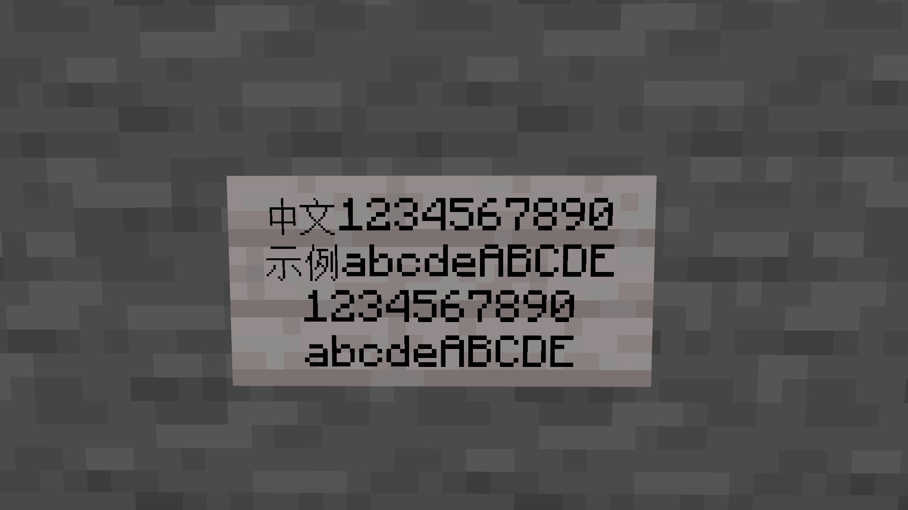
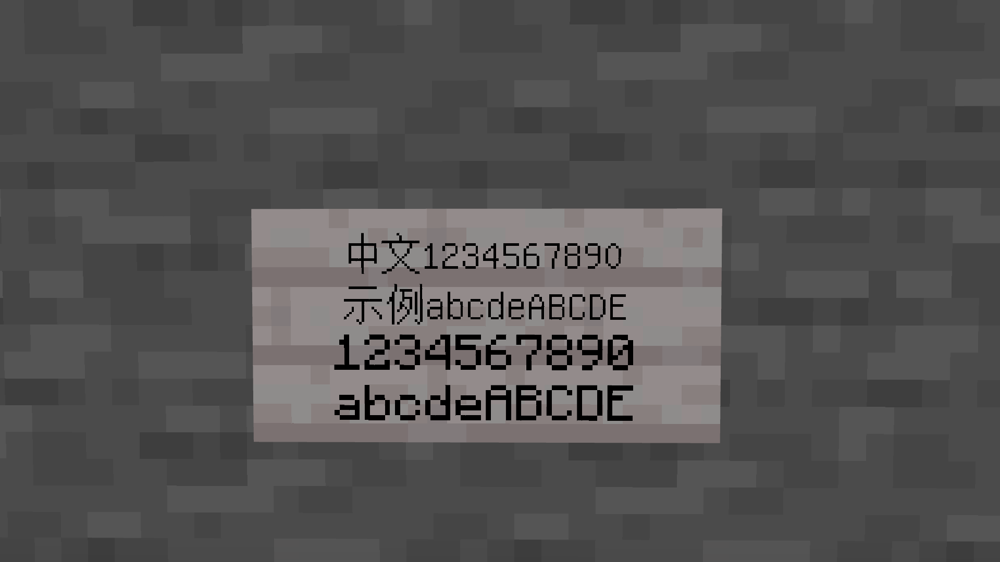
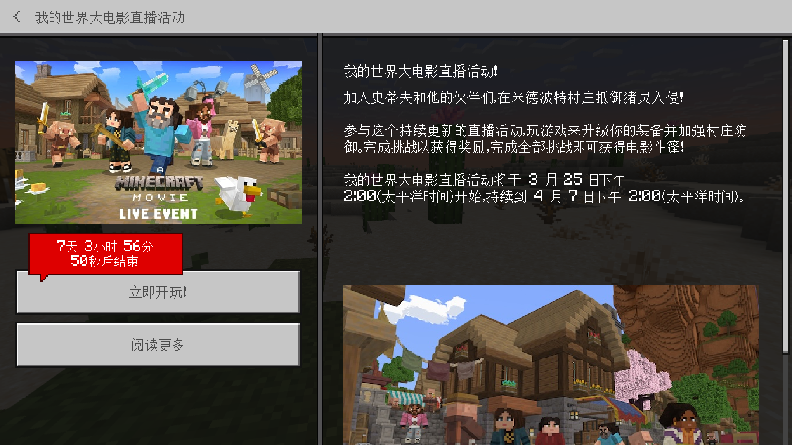
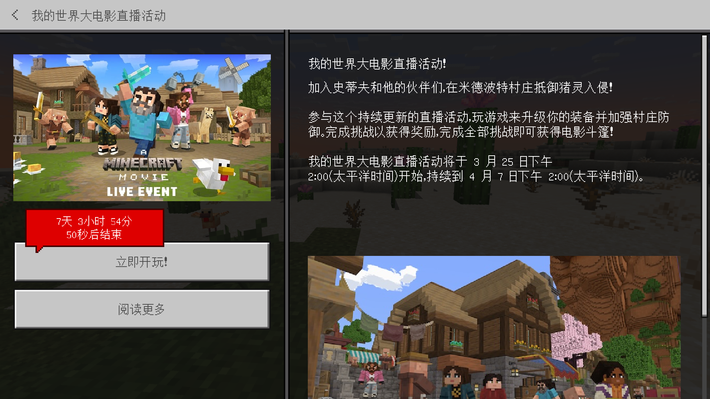

# 强制 Mojangles 字体 v2

export const Highlight = ({children, color}) => (
   {}}>
    {children}
  
);

## [<Highlight color="#25c2a0">下载</Highlight>](https://app.nekodrive.net/s/r45uO)

本包将**常用的英文和数字字体强制更改为了 Mojangles 字体**，以保证在有其他 GNU Unifont 字体（例如中文）出现时能够和纯英文字段保持一致。

本包为**资源包**。

## 使用方法

下载本包后，将`fonts`文件夹复制到您的资源包中，即可生效。装载本包之后，将在您的世界强制使用 Minecraft 风格的英文、数字和 § 字体（即 Mojangles 字体）。

### 效果展示

下图为同一段文字的对比：

- 使用此包的效果
  
- 默认的效果
  

下图为同一个 UI 的对比：

- 使用此包的效果
  
- 默认的效果
  

### 注意事项：在切换或卸载资源包时可能会导致的间距错乱

在退出装载了此包的地图后，您可能会看到英文、数字等被更改的字体在转换后会以不正确的间距显示的问题。

- 卸载资源包的效果，数字以不正确的间距显示。
  

这是因为，本包更改了这些字体会不可避免地更改它们的宽度，所以在本包被卸载后将会以 Mojangles 字体的宽度显示默认的字体。这个问题可通过重启游戏解决，但是如果您不能忍受此问题，请勿装载此包。

将本包改为全局资源包，可以有效缓解类似问题。

## 参考文档

您可以在下面这篇（些）文档中，了解更多有关字体的信息。

- [字体 - 中文 Minecraft Wiki](https://zh.minecraft.wiki/w/字体)

## 更新日志

相比于 v1 版本，新增了对 § 字体的支持
