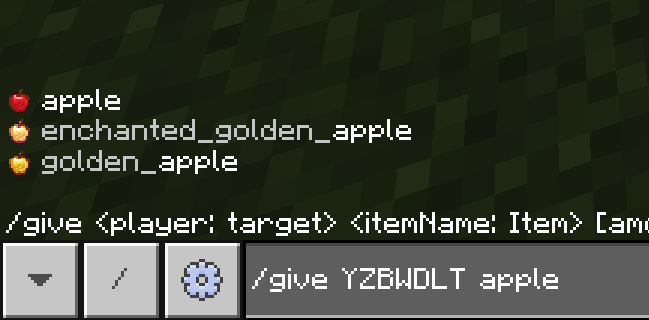
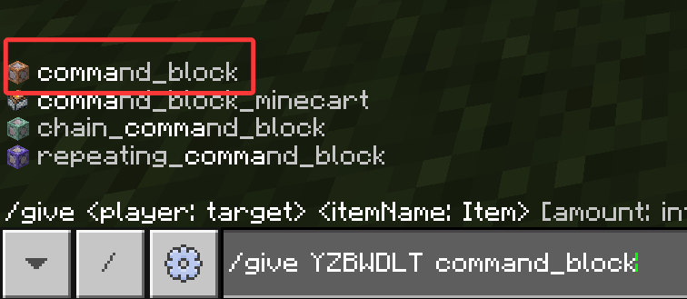
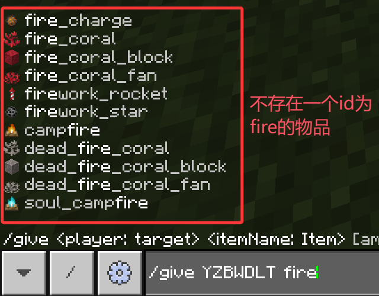

# 1.4 物品

本节，我们主要介绍物品的概念。虽然但是，你可能会说：

> 物品谁不知道？木棍、雪球、那物品栏里的东西不都是物品吗？

那么，请问如果把木棍扔在地上，它还是物品吗？如果你给出“是”的回答，那么就需要好好理清下面的概念了。

---

## 物品

我们要强调的是，这里的物品的概念，**特指物品栏中的物品**。即：

- 我们**不考虑物品的方块性**，比如物品栏中的草方块，我们不认为它是方块，只要它在物品栏中，没有存在于这个世界上，那么它就是物品。
- 我们**也不考虑物品的实体性**，典例就是掉落物形态的物品，因为这时候的“物品”本质上是实体，而不是物品。

结合起来说，凡是在物品栏中的物品就是物品，不在物品栏中的物品就不是物品。

---

## 物品 ID

和实体 ID 类似，木棍就是木棍，雪球就是雪球，不可能存在一个物品既是木棍又是雪球。因此，对于物品我们同样需要一个唯一标识符来指代物品的类型，这就是物品 ID。好消息是：物品 ID 的一般命名规律和实体 ID 是高度类似的：

- 知道这个物品的英文名。例如钻石剑（Diamond Sword）。
- 全部改为小写，然后将空格`Space`换为下划线`_`。例如钻石剑的 ID 为`diamond_sword`。

同样地，少数物品因为某些原因，不满足上面的一般规律。

什么地方可以用到这些物品 ID 呢？一个是目标选择器的`hasitem`参数，当然这也是后话了；一个就是`类型`为`Item`的命令参数，拥有这样的命令参数的命令有 3 条：`/give`、`/clear`、`/replaceitem`。在本节中，我们以`/give`为例进行更加深入的讨论。

---

## 给予物品的命令：`/give`

你可能早已听说过这条命令的鼎鼎大名！可能在你查阅其他的命令教程的时候，就已经知道有这样一条命令：`/give @s command_block`。但我们先不管这些，先来研究它的语法：

```text
/give <玩家: target> <物品: Item>
```

等一下，这个`target`是什么东西？先不要慌，这个参数让我们来提前“剧透”一下，它是可以填为你的游戏昵称的。因此，看到`target`类型的参数，你可以放心地填写为你的游戏昵称，但如果你的你的昵称包含特殊字符（例如`/`、空格、中文），记得加上英文引号，例如`"中文昵称"`、`"name with space"`。至于这个`Item`，就是填写为物品 ID 了。换言之，这条命令的含义是：

给予`<玩家>` 1 个`<物品>`。

为什么是 1 个？这一点我们先不探究那么多，总之目前请你先接受这一点。知道这些之后，我们就来用一条命令做个实验吧！

:::tip[实验 1.4-1]

执行`/give "(你的昵称)" apple`。如果上面有自动补全，那就没问题了！



:::

想必你猜都猜到了，你的物品栏会多出一个苹果，就是这么简单！

### `/give`命令能够给予创造模式物品栏中所不存在的物品

也许你之前就听说过一种方块叫做“命令方块”，但是你在创造模式物品栏找了半天却找不到。为什么？这是因为，它们被特意设置为“**在创造模式物品栏中隐藏**”，换言之，本来就在创造模式物品栏里找不到，它们被特意藏起来了！

但哪怕被藏起来，你也是可以使用`/give`获取到它们的。例如命令方块的 ID 为`command_block`。你可以尝试获取命令方块然后简单摆弄摆弄，不过我们也会在第 3 章详细地介绍如何使用命令方块、结构方块、屏障等开发用方块。



### 部分物品不能`/give`

`/give`并不是万能的！虽然它可以给予创造模式物品栏中的所有物品，甚至可以给予物品栏中没有的物品，但不代表所有物品都能给予。例如，很少有人知道火是具有物品形式的，然而你使用`/give @s fire`，迎接你的只有报错。



再比如，有一些藏得更深的方块，例如下界反应核、隐形基岩等，目前事实上仍然存在于底层代码之中，但是我们无法通过`/give`获取它们。

---

## 总结

- 命令中的物品概念，专门指代物品栏中的物品。
- 物品 ID 与实体 ID 类似，都是为了在代码中表示这个物品的种类而设置的唯一标识符。绝大部分的物品 ID 也都是其英文名改写来的。少数物品因为历史原因，其 ID 与其英文名并不完全一致。
- `/give <玩家: target> <物品: Item>`是一条可以给予`玩家` 1 个`物品`，其中`玩家`的类型是`target`，可以填写为玩家昵称；`物品`的类型是`Item`，可以填入物品 ID。
- `/give`命令能够给予创造模式物品栏中所不存在的物品，但是仍然有部分物品是不能`/give`的。

## 练习

:::info[练习 1.4]

1. 给予你自己一颗钻石（Diamond）。已知该物品的命名规律满足一般命名规律。
2. 给予你自己一个屏障（Barrier）。已知该物品的命名规律满足一般命名规律。
3. 然后再给你自己一个钻石块吧！该物品的命名规律不满足一般命名规律，试着先打一个`diamond`然后找找看它的 ID。

:::

<details>

<summary>练习题答案</summary>

1. `/give "你的昵称" diamond`
2. `/give "你的昵称" barrier`
3. `/give "你的昵称" diamond_block`

</details>

import GiscusComponent from "/src/components/GiscusComponent/component.js"

<GiscusComponent/>
