# 2.2 简单命令

本节，我们将带你来了解 9 条你可能早已听说的命令。这些命令出名到什么地步？甚至连一些不搞开发的 UP 主、普通玩家、生存玩家，都对这些命令有所耳闻。你也很可能听过这些命令的鼎鼎大名。那我们一起来看一看吧！

---

## 帮助命令：`/help`

这条命令，我们曾在第一章时讲过，**它会返回特定页码或命令的帮助信息**。它有两条语法：

```text title="/help的语法" showLineNumbers
/help <页码: int>
/help [命令: CommandName]
```

例如，我们在 1.1 曾经布置了一道练习，要求你利用`/help`自学`/difficulty`。是否有印象呢？这里我们就是利用了第二条命令。

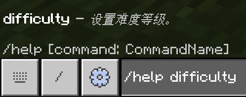

这条命令还需要再介绍吗？我们认为应该无需多言了。

讲两句题外话。其实，我们认为这条命令的必选和可选参数的信息，可能有标注错误的嫌疑。实际的语法应该是

```text title="/help的实际语法" showLineNumbers
/help [页码: int]
/help <命令: CommandName>
```

这样，当你只输入`/help`的时候，页码默认为 1，所以返回第 1 页的信息；而查询命令则必须要你写入一条命令的名字。想想是不是这个道理？

---

## 给予玩家物品的命令：`/give`

嘿嘿，这位也是老朋友啦。我们曾经在讲物品这个概念的时候，学习过`/give`的语法。

还记得是什么语法吗？其实不记得也不要紧。真的！因为你随时都可以查文档，在实际运用的时候，旁边不会有监考老师监督你去做命令或者做什么，所以更重要的是你要知道这条命令能做什么，然后多加运用，你想记不下来都难！

那我们现在把这条命令的语法贴出：

```text title="/give的基本语法" showLineNumbers
/give <玩家: target> <物品: Item>
```

例如，`/give @a apple`，这里`玩家`是所有玩家（`@a`），`物品`是苹果（`apple`），所以是给予所有玩家苹果。有印象了吧！那我们接下来就要进行扩展了。

### `/give`的扩展语法

还记得吗？我们曾经介绍基本语法的时候说，这条命令将给予`玩家` 1 个`物品`。为什么是 1 个？来，我们看看这个基本用法的命令参数。发现有什么特点了吗？没错，都是必选参数！这条命令后面还跟了三个可选参数，其中一个就是指代物品数量的。我们来看看这条扩展语法：

```text title="/give的扩展语法" showLineNumbers
/give <玩家: target> <物品: Item> [数量: int] [数据值: int] [组件: json]
```

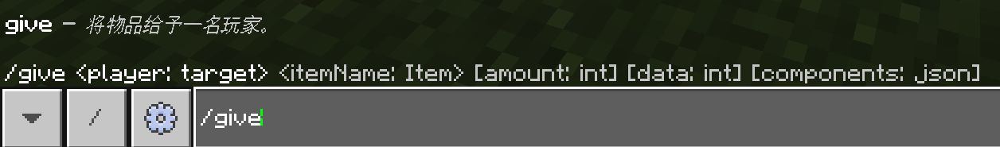

感觉除了`数量`都看不懂？没事，我们先来看`数量`，剩下两个我们一会儿解释。你可以看到，它接受一个`int`类型的参数，也就是整数。这很好理解，毕竟你不能给予 1.5 个苹果，对吧？`数量`是一个可选参数，这就是我们不指定也能成功运行的原因。**对于每一个可选参数，都存在一个默认值**。在这里，默认值就是`1`。也就是说，如果你不填写，它就只给予 1 个苹果。很简单吧？我们来实战一下。

:::tip[实验 2.2-1]

尝试写一条命令，给予你一组钻石。执行之以验证你的想法！

<details>

<summary> 点我查看答案！ </summary>

`/give @s diamond 64`

</details>

:::

因此，现在你就知道：`/give`是能够给予`数量`个物品的。

### 物品数据值

物品数据值的概念稍微复杂一点。一个物品，也是可能具有多个状态的。例如，当你使用一把钻石剑杀死了一只僵尸，这把剑的耐久度会降低，也就是说不同的耐久度定义了同一个物品的不同状态。像这样，**同一个物品的不同状态就用数据值（Data Value）来记录**。特殊地，我们这里说的数据值指代的是物品数据值。

我们看到，`数据值`的类型是`int`，并且为可选参数。相信看到这里，不用我们说，你也知道这个参数该填什么了。该参数的默认值是`0`。

一切物品都可以拥有数据值，不同数据值的同类物品，在物品栏也不能合并。特殊地，对于工具，数据值就代表着它的损坏值。例如，在 [Wiki](https://zh.minecraft.wiki/w/剑) 中可以查到钻石剑的耐久是 1561 点，那么使用`/give @s diamond_sword 1 1000`就会给予你一把损坏了 1000 点耐久值，也就是剩余 561 点耐久的剑。

:::info[思考 2.2-1]

为什么这里必须代表损坏值而非耐久值呢？

<details>

<summary>答案（思考过后再翻看哦~）</summary>

我们反过来想，如果是耐久值会出现什么后果？例如`/give @s diamond_sword`，这样的话，因为数据值默认为`0`，所以它会给你一把已经几乎没有耐久的剑，这并非我们预期的结果。不同的工具，耐久值都大不相同，如果要给一把满耐久的工具，就必须记住它的满耐久值；而且，实际应用中也是给予满耐久工具的情况居多。因此，数据值就必须代表损坏值。

顺带一提，在 Java 版中，物品并没有数据值一说（详见 2.2 关于物品数据值的历史问题），损坏值是用物品组件来指代的。可能在基岩版未来的某一天，数据值也会被移除，其中的特殊数据可能就会用`组件`来代替。不过可以肯定的是，现在离那一天应该还早。

</details>

:::

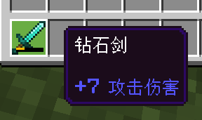

至于`组件`，我们认为现在聊这些还太早，我们希望等到你有更多的基础之后再来聊这些，不过你很快就会再次见到它的身影！

至此，我们可以给`/give`命令的含义做一个完全的总结：**`/give`将给予`玩家` `数量`个含有特定`组件`、特定`数据值`的`物品`**。

:::note[扩展：关于物品数据值的历史问题]

我们现在已经知道，数据值用来储存同一个物品的不同状态。刚刚我们列举了一个耐久度（或者准确来说叫做损坏值）的例子，和不同数据值的物品来和正常的物品作区分的例子。目前的数据值大体上也就只有这点应用了。

但是在以前，数据值的应用极为广泛，这里就不得不说到**扁平化（Flattening）** 所带来的影响了。如你所知，现在红色羊毛的 id 为`red_wool`、蓝色羊毛的 id 为`blue_wool`、等等等等，但是在以前，这些所有颜色的羊毛统称为`wool`，那么如何指定羊毛颜色呢？比如红色，我们就指定`wool`的数据值为`14`，黄绿色是`5`、黄色是`4`，以此类推。好记吗？当然不好记！所以常用的做法是，要么试，要么查。很明显，**扁平化就是把这种*压缩的 id* 给扩展开来，展开为多个不需要数据值也能良好定义的物品 id**。

这样做的好处当然是很明显的，**代码变得更易读**：相比于`/give @a wool 1 14`，显然`/give @a red_wool`更能让人一眼看懂这条命令的含义。当然缺点也是有的，因为 id 的变化，导致老 id 在`hasitem`目标选择器参数的高版本适配中表现不佳；而且对于手机版玩家来说，要打的字又变多了，会更麻烦。

扁平化这个概念，最早出现在隔壁的 Java 版。在 Java 版 1.13，Mojang 将所有物品、方块（是的，以前方块也有数据值）的数据值通通消灭，全部进行了扁平化，特殊状态则转而使用 NBT 来代替。这也是当时的模组难以转换到高版本的一个重要原因，因为原版 ID 几乎是被重写了一轮，所以 Forge 没有办法及时作出适配。这也是很多模组玩家至今卡在 Java 版 1.12.2 的原因，因为很多模组从那之后就停更了，或者不愿再对高版本做出适配。

基岩版的扁平化则是从 1.19.70 的一次物品、方块 ID 拆分悄然开始的，直到现在，已经渐渐接近尾声。与 Java 版大刀阔斧地改，全然不顾向下兼容性不同，基岩版并没有任意选择版本的功能，因此 Mojang 为了对旧版地图、附加包有一定的适配，不至于让它们报废，这些老 id 还是可用的，不过自动补全就不会帮上你了。**我们现在使用新版本时，还是尽可能地使用新版 id，适配性更好的同时也更加易读**。

:::

---

## 清除物品的命令：`/clear`

说到物品操作，有给予就必定要有清除。我们现在就来介绍这条**清除物品的命令**：`/clear`。它的语法是：

```text title="/clear的语法" showLineNumbers
/clear [玩家: target] [物品: Item] [数据值: int] [最大数量: int]
```

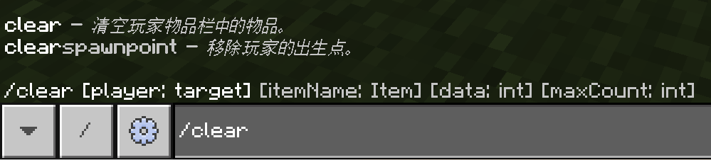

**这条命令将清除`玩家`至多`最大数量`个数据值为`数据值`的`物品`**。

可以看到，这条命令和`/give`有很多相似处。

:::tip[实验 2.2-2]

我们现在要给予自己一个苹果，再移除自己的苹果。这可以写为

```text showLineNumbers
/give @s apple
/clear @s apple
```

试执行之，体验一下这两条命令。在物品栏里再拿出一组苹果，然后再执行一次，体验一下`最大数量`的含义。

:::

关于`数据值`，这是一个`int`类型的可选参数。其基本含义和`/give`是一致的，例如可能代表物品的状态、损坏值等等。但是，这里和`/give`有一点是不同的。我们可以试想一个情况：如果要清除玩家的钻石剑，但是玩家有多把钻石剑，损坏值或为 500，或为 1000，或为 1500 等数值，这种要穷举每种损坏值的情况自然是不现实的。因此，**我们可以使用一个负数值来代表任意数据值的情况**。例如：`/clear @a diamond_sword -1`就将移除所有玩家在任意损坏值的钻石剑。显然，`数据值`的默认值应当是一个负数，事实上其默认值为`-1`。

:::info[思考 2.2-2]

`/give`能否给予一个负数值数据值的物品，例如`/give @a apple 1 -1`？试分析之并在游戏中验证你的想法。

<details>

<summary>答案（思考过后再翻看哦~）</summary>

答案是：不能。否则，`/give @a apple 1 -1`的含义就将变为给予所有玩家一个*任意数据值*的物品。反正换作让你干这活，你也得懵，所以游戏只能报错。给予一个物品必须给定一个特定的数据值，而不能是任意的数据值，这道理是很简单的。

</details>

:::

而`最大数量`则被设立为第 4 个参数，这和`/give`是不同的（`/give`的`数量`参数是第 3 个参数），因此这也是该命令使用的一个常错点。此外，注意该参数的描述为`最大数量`。和目标选择器参数`c`类似，即使物品数量少于这个值，也能够执行。我们以`/clear @a apple -1 3`为例：

- 如果你有 20 个苹果，那么最多清除 3 个，所以最终你有 17 个苹果；
- 如果你有 2 个苹果，那么最多清除 3 个，所以全部清除，你有 0 个苹果。

特别地，`最大数量`可以被填写为`0`。你可能会问：清除`0`个物品有什么意义？事实上，如果你拥有这个物品，这条命令不会清除你的物品，但是成功执行；而如果你没有这个物品，这条命令就将执行失败。换言之，`最大数量`为`0`时，这条命令将起到检测物品作用。这在 1.18.30 之前，没有`hasitem`的时候是很常用的检测物品的手段。


---

## 更改玩家游戏模式的命令：`/gamemode`

这条命令你很可能已耳熟能详！很多人初接触命令时，可能就是先接触的这条命令。废话少说，我们直接上语法：

```text title="/gamemode的语法" showLineNumbers
/gamemode <游戏模式: int|GameMode> [玩家: target]
```

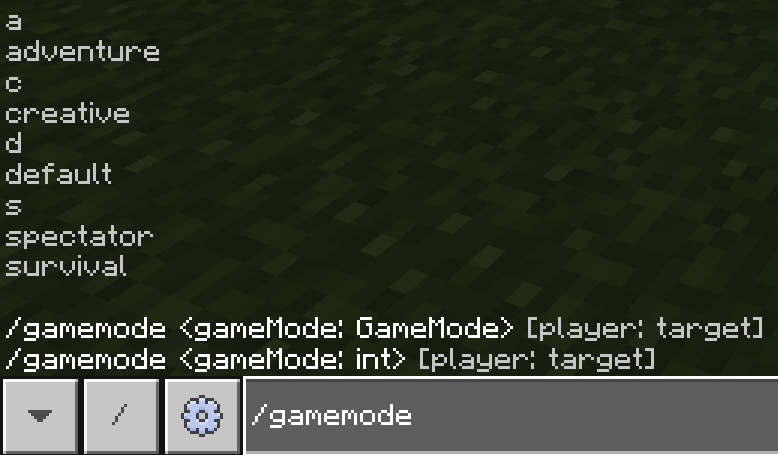

**这条命令将把`玩家`调整为`游戏模式`**。特别简单易懂的命令！

在游戏中，给出了两条语法。实际上，你可以看到它们之间只有接受类型的不同，因此我们在上面将两种类型`int|GameMode`合并到一个参数，代表该参数既接受`int`类型，也能接受`GameMode`类型，希望你能理解。

这个命令参数的类型是我们未曾遇到过的，然而自动补全已经告诉你可以填写什么。很显然，这个参数接受简写或全称的游戏模式的写法。因为首字母大写，这是一个穷举参数，意义是很明确的。我们在下文给出一个表，作为对应。

| 游戏模式 | `GameMode`的全称写法 | `GameMode`的简称写法 | 对应的`int` |
| :---: | :---: | :---: | :---: |
| 生存模式 | `survival` | `s` | `0` |
| 创造模式 | `creative` | `c` | `1` |
| 冒险模式 | `adventure` | `a` | `2` |
| 默认模式 | `default` | `d` | `5` |
| 旁观模式 | `spectator` | — | — |

:::tip[实验 2.2-3]

例如，调整 Alex 为生存模式，就可以用`/gamemode survival Alex`。当然，`/gamemode s Alex`和`/gamemode 0 Alex`都是可以的。试执行下面的命令，体验一下这条命令。如果害怕被史莱姆攻击影响输入命令，可以开和平。

```text
/gamemode survival @s
```

:::

其中，旁观模式不存在简称写法和对应的`int`。本教程一贯建议：为顺应 Java 版的趋势，**游戏模式应写为全称写法**。

:::note[扩展：为什么旁观模式不存在简称和数字写法？]

这是因为，Java 版自 1.13 后，该命令仅支持全称写法，而旁观模式在基岩版加入时间较晚，所以为了顺应 Java 版的趋势，就不再允许该模式写为简称或数字。旁观模式在 Java 版 1.12 以前的简称写法为`sp`。基岩版在刚加入旁观模式时，允许使用数字`6`指代该模式。

:::

### 默认游戏模式

默认模式的概念其实特别简单。每个世界都存在一个默认游戏模式，每个玩家都可能是特定的游戏模式，也可能是默认游戏模式。只要你是默认游戏模式，就跟随这个世界的默认游戏模式来确定你的游戏模式。然而，这个概念确实是很少提及，也不太常用的。

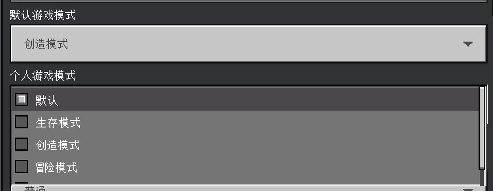

### 冒险模式

冒险模式是一种类似于生存模式的游戏模式。然而，与生存模式不同的是：**你不能随意地破坏方块、或者放置方块**。只有使用命令给予的含有特定`组件`的物品，或者在允许方块之上，才能够进行放置、破坏等操作。

其中，`组件`这个东西已经被我们按下不表，我们打算在后续章节再和你谈这些。不过你可以先看到这些物品大体的特征如下：

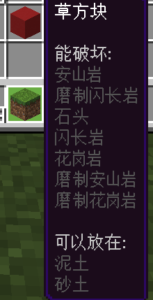

而允许方块，则是我们在第 3 章要着重介绍的东西。

### 旁观模式

旁观模式是一种允许玩家进行世界旁观的模式。在该模式下，玩家将能够飞行、允许穿墙、不能对世界进行任何操作等诸多重要特性。如果你正在做一张多人地图、或者希望玩家能够参观此地图、或者就是单纯地想找找地下的一些结构，等等需求，那么你很可能会用到这个模式！

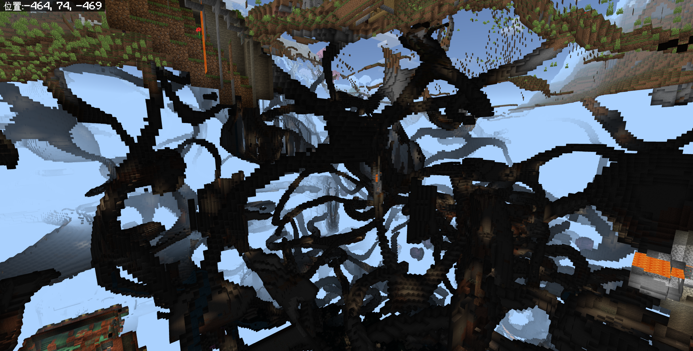

:::note[扩展：Java 版的旁观模式]

Java 版的旁观模式还能够通过鼠标滚轮改变飞行速度，以及能够进入生物（包括玩家）的视角。很遗憾，基岩版并没有这些。

:::

### 目标选择器参数`m`

`m`取自于**M**ode，即**查找特定游戏模式的玩家**。其语法为：

```text title="目标选择器参数m的语法" showLineNumbers
m=<游戏模式: int|GameMode>
```

例如：`@a[m=creative]`将找到所有创造模式的玩家，`@a[m=c]`或`@a[m=1]`也是同样的效果。

:::tip[实验 2.2-4]

依次执行下面的命令。

```text showLineNumbers
/testfor @s[m=creative]
/gamemode creative @s
/testfor @s[m=creative]
```

:::

该参数支持反选，例如你可以使用`@a[m=!adventure]`来找到所有不是冒险模式的玩家。

`m`只能指定一次。

:::info[思考 2.2-3]

如果`m`能够指定多次，`@a[m=creative,m=survival,m=spectator]`能否实现`@a[m=!adventure]`相同的效果？

<details>

<summary>答案（思考过后再翻看哦~）</summary>

答案是：不能。这个目标选择器无论如何也找不到这样的玩家：既是创造模式、又是生存模式、又是旁观模式。不要忘记：**目标选择器参数之间的关系是“和”的关系，而不是“或”**。

</details>

:::

---

## 清除实体的命令：`/kill`

我们曾经学习过`/summon`是生成实体的命令。`/kill`则是与`/summon`相反的命令，**用于清除特定的实体**。语法为

```text title="/kill的语法" showLineNumbers
/kill [目标: target]
```

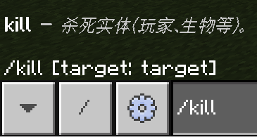

**这条命令将杀死`目标`**。

`目标`的默认值为`@s`。这个语法已经简单到无需我们再多说什么了。直接上实例：

- `/kill`：杀死执行者自身。当然，如果你是创造模式，那么你是无法被杀死的。
- `/kill @e`：杀死所有实体。**当心！这在很多地图、模组中都是很危险的行为！**
- `/kill @e[type=sheep]`：杀死所有绵羊。
- `/kill @e[type=item]`：清除所有掉落物。别忘了掉落物也是实体哦！

---

## 调整时间的命令：`/time`

`/time`是用于调整时间的命令。这条命令之所以“人尽皆知”，主要是因为基岩版有一个快速的自动命令输入功能：

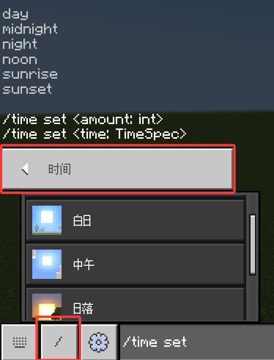

这个界面可以让一名完全不懂命令的玩家也能轻易地更改时间。但是，我们现在并不能说自己完全不懂命令，我们的目标不应当局限于此。我们来看一下这条命令的语法：

```text title="/time的语法" showLineNumbers
/time add <数值: int>
/time query <day|daytime|gametime>
/time set <数值: int>
/time set <时间: TimeSpec>
```

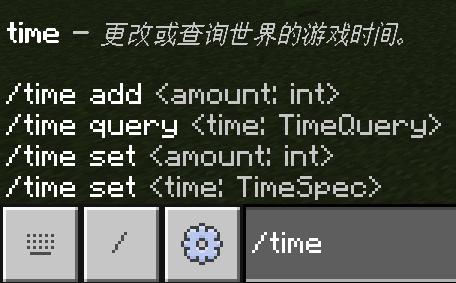

上面我们给出的语法中，和游戏内并不完全一致，这是因为`TimeQuery`类型是一个穷举参数，仅支持 3 种穷举条目：`day`、`daytime`和`gametime`，所以我们直接展开写。

这条命令一共有 4 条语法，但事实上只有 3 个用法：`add`、`set`和`query`。我们挨个来解释。

### 设置时间

设置时间是我们最常用的用法，也就是`set`的那两条语法。我们看到`/time set <数值: int|时间: TimeSpec>`（这里也采用合并式写法）应当是接受一个数值或一个`TimeSpec`类型的参数的。

`数值`上，我们需要简单讲一讲。首先，有两个原理需要你了解：

1. Minecraft 中的一天，对应现实是 20 分钟，也就是 1200 秒。
2. Minecraft 存在一种叫做“游戏刻”的概念。游戏刻（Game Tick，简称 gt）简单来说，是指 Minecraft 完成一次代码循环所需的时间。对于 Minecraft，**1 秒 = 20 游戏刻**。这是**极其重要的时间换算原理**，因为在后面的`/scoreboard`、命令方块、函数、脚本等各方面，这个原理都无处不在，我们会在后面遇到的时候反复提及。执行一条命令所需要消耗的时间就是 1 游戏刻。关于游戏刻的更多说明，你可以参见 [Wiki 的这个页面](https://zh.minecraft.wiki/w/刻)。

因此，换算为游戏刻，Minecraft 的一天就是 1200×20=24000 游戏刻。`数值`所接受的就是以游戏刻为单位的整数。Minecraft 的白昼和黑夜几乎是一样长的，因此，`0`代表着一天初始；`12000`代表着黄昏，一天的夜晚即将到来；`6000`就是正午；而`18000`就是午夜时分。每`1000`游戏刻，在 Minecraft 中就代表着过去了 1 个小时。关于昼夜更替，你也可以参见 [Wiki 的这个页面](https://zh.minecraft.wiki/w/昼夜更替)。

而`TimeSpec`，事实上它也是一种穷举参数，能够接受 6 种特殊时间。对应表格如下：

| 时间 | `数值: int` | `时间: TimeSpec` | 备注 |
| :---: | :---: | :---: | --- |
| 日出 | `23000` | `sunrise` | 早上 5:00，注意不是早上 6:00 |
| 早上 | `1000` | `day` | 早上 7:00 |
| 正午 | `6000` | `noon` | 中午 12:00 |
| 日落 | `12000` | `sunset` | 晚上 6:00 |
| 晚上 | `13000` | `night` | 晚上 7:00 |
| 午夜 | `18000` | `midnight` | 0:00 |

我们来举几个例子：

- `/time set 0`：设置为早上 6:00。
- `/time set noon`或`/time set 6000`：二者完全等价，设置为正午。
- `/time set 36000`：设置为第 2 天的日落时分。注意 36000 是第二天的时间范围。

### 增加时间

如果你理解了设置时间的那些内容的话，那么增加时间对你来说已经不再是一个难题。原理上来说，数值计算都是一样的。我们直接以例子讲解：

- `/time add 1`：时间加快 1 游戏刻。
- `/time add -1`：时间倒退 1 游戏刻。
- `/time add 24000`：迅速经过一天。如果为夜晚，你可以用这条命令观察到月亮的变化哦！

### 查询时间

查询时间，也就是`/time query <day|daytime|gametime>`，允许你查询这个世界目前所处于第几天（`day`）、什么时间（`daytime`）、以及这个世界总共运行了多久（`gametime`）。如果你想跟你的小伙伴“吹嘘”自己的世界玩了多久的话，不妨来试试这条命令吧！

:::tip[实验 2.2-5]

依次执行下面的命令。

```text showLineNumbers
/time query day
/time query daytime
/time query gametime
```

:::

最终，游戏将返回给你下面这个类似的消息：

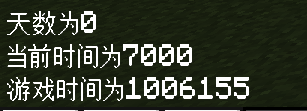

天数和当前时间都是好理解的。而对于游戏时间，依据时间换算原理（1 秒 = 20 游戏刻），你可以将这个值除以 20，就是你这个世界所启动了的秒数。

---

## 传送玩家的命令：`/tp`（或`/teleport`）

我们在第 1 章时曾介绍过，`/tp`是用于传送特定实体到特定位置的命令。然而我们在介绍此命令时曾说过，这条命令有多达 10 条语法，其中我们当时曾说，因为`目标`可以指定为`@s`，此时`/tp ~~~`和`/tp @s ~~~`是等效的，这样 10 条语法中只需要理解 5 条带`目标`的语法即可。我们现在把这 5 条语法都放在这里：

```text title="/tp的语法" showLineNumbers
/tp <目标: target> <位置: target> [检查卡墙: Boolean]
/tp <目标: target> <位置: x y z> [检查卡墙: Boolean]
/tp <目标: target> <位置: x y z> [y旋转: value] [x旋转: value] [检查卡墙: Boolean]
/tp <目标: target> <位置: x y z> facing <面向实体: target> [检查卡墙: Boolean]
/tp <目标: target> <位置: x y z> facing <面向坐标: x y z> [检查卡墙: Boolean]
```

显然，我们以前所学习的语法是第 2 条语法。现在，让我们来看看其他的语法吧！

:::note[扩展：`/tp`的别名]

`/tp`事实上有一个全称写法为`/teleport`，二者用法等同。对于写法方面，本教程不作任何建议，但根据[附录 1](../appendix/command_frequency_table)发现，实际工程中使用`/tp`字段的频率要远远高于`/teleport`字段。

这种现象在其他命令中也很常见，例如`/tell`，也可以用`/w`、`/msg`，三者用法等同；`/?`和`/help`等同；`/alwaysday`和`/daylock`也是等同的。至于为什么需要有这种等同含义的命令……这个还是去问 Mojang 吧。

:::

### 可选参数：是否卡墙？

我们先来看第 2 条命令，相比于我们以前学习的命令，多了一个参数`[检查卡墙: Boolean]`。这个参数在其他语法中也同样存在。指定这个参数将让 Minecraft 检查传送的位置是否有方块，导致目标卡墙或卡在地里，如果有，则阻止之。该参数的默认值为`false`。例如：

- `/tp @s 0 -62 0 true`：因为超平坦模式下一般而言，(0,-62,0)为泥土层，所以该命令会执行失败。
- `/tp @s 0 -62 0`：游戏不会检查该位置是否有方块，并将玩家直接传送到土里。


### 传送到特定实体的位置

现在我们观察`/tp`的 5 条语法。注意到只有第 1 条命令的`位置`参数接受`target`类型，代表它接受一个实体。事实上，这条命令的`位置`指代的实体，含义很明确，就是该实体所在的位置。

:::tip[实验 2.2-6]

执行命令`/tp @s @e[type=sheep,c=1]`，观察自己的位置变化。这里指代`c=1`，是为了让命令能够更可控，按照预期执行。如果没有绵羊，可以手动生成一只。

![/tp @s @e[type=sheep,c=1]](./img/c2_simple_cmds/tp_sheep.png)

:::

:::info[思考 2.2-4]

按照前文的逻辑，你能否分析`/tp Alex`的含义？提示：该命令中，`Alex`并不是`目标`。

<details>

<summary>答案（思考过后再翻看哦~）</summary>

该命令将传送自己到 Alex 的位置上去。因为我们在前文中说，`目标`只要为`@s`时，这些命令就和没有`目标`的另外 5 条语法等价。

考虑到 5 条扩展语法中，都至少需要接收 2 个必选参数，而在这条命令中只给定了 1 个参数`Alex`，说明这里用的应当是不含`目标`的语法：

```text title="/tp传送执行者的语法" showLineNumbers
/tp <位置: target>
/tp <位置: x y z> [检查卡墙: Boolean]
/tp <位置: x y z> [y旋转: value] [x旋转: value] [检查卡墙: Boolean]
/tp <位置: x y z> facing <面向实体: target> [检查卡墙: Boolean]
/tp <位置: x y z> facing <面向坐标: x y z> [检查卡墙: Boolean]
```

其中，第一个参数接受`target`的语法，仅有`/tp <位置: target>`符合条件。因此，该命令将传送自己到 Alex 的位置上去。

需要注意的是，这条命令经常容易和`/tp <目标: target> <位置: target> [检查卡墙: Boolean]`搞混，尤其是在使用游戏给的 UI 时，即使不指定“何处”玩家，也能够成功执行，并且一般执行效果都是背离执行者的预期的（即误将待传送人指定为执行者，而传送位置误指定为待传送人的位置）。

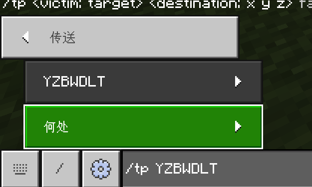

</details>

:::

### 以特定视角传送到特定位置

接下来我们关注`/tp`剩下 3 条语法。事实上，剩下的 3 条语法都是指定玩家**以何种朝向**传送到什么位置的。我们先来关注两个`facing`：

```text title="指定朝向的/tp的语法" showLineNumbers
/tp <目标: target> <位置: x y z> facing <面向实体: target|面向坐标: x y z> [检查卡墙: Boolean]
```

同样地，为了简化到 1 条命令中，采用这种写法，代表该参数可能代表`面向实体: target`或`面向坐标: x y z`，这种写法在本教程的后文中将不再赘述。如果不考虑`检查卡墙`（因为前文已经提过，这里也不再赘述），这条命令的含义是：

**将`目标`以面向`面向实体`或`面向坐标`的朝向传送到`位置`上**。

如果这么说，我们相信你应该已经掌握了该命令的用法。只是有一点需要注意：`面向实体`必须指定为 1 个，否则游戏将会报错。这是一个常错点。

:::tip[实验 2.2-7]

1. 执行命令`/tp @s ~~~ facing @e[type=sheep,c=1]`，这条命令应当将你传送到原位，但是强制令你面向附近的绵羊。
2. 执行命令`/tp @s ~~~ facing 0 -60 0`，同样，这条命令将让你面向坐标(0,-60,0)。

:::

### 旋转角度

然后我们再来关注剩下的那个语法。

```text title="指定朝向的/tp的语法2" showLineNumbers
/tp <目标: target> <位置: x y z> [y旋转: value] [x旋转: value] [检查卡墙: Boolean]
```

这里的`y旋转`和`x旋转`是什么意思？

我们说，为完全地表示一名玩家在空间中的信息，只有玩家的空间位置是不够的，玩家的朝向也是很重要的。表示玩家的朝向可以用两组数`yRot` `xRot`来表示，这叫做**旋转角度**。

我们如何用 2 个值就确定玩家的朝向？现在我们不妨先只考虑平视的情况。在 Minecraft 中，玩家的视角可以用一个单位向量（也就是一个长度为 1 的有方向的量）去表示，我们看到*在平视的状态*下，无论玩家如何旋转自己的视角，**这个朝向的向量永远是绕着 y 轴旋转的**。选定向南为 0°，顺时针方向记为正，这个向量与 0° 所成的夹角就是`y旋转`（`yRot`，y Rotation）：

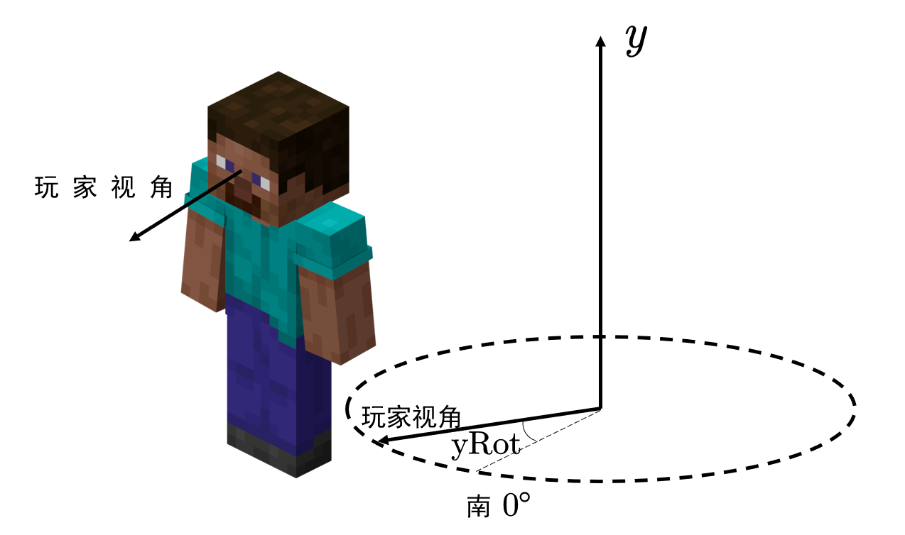

这样，向西就是 90°，向北就是 180°，向东就是 270°。因为角绕始边转一圈后，终边位置不变，所以加减 360° 的结果是一样的，比如向东还可以表示为 -90°。

同样地，如果玩家向上或向下看，这时就认为玩家的朝向向量绕着 x 轴旋转，也就是`x旋转`（`xRot`，x Rotation）。选定水平为 0°，顺时针方向记为正，则望向天空为 -90°，望向地面为 90°。

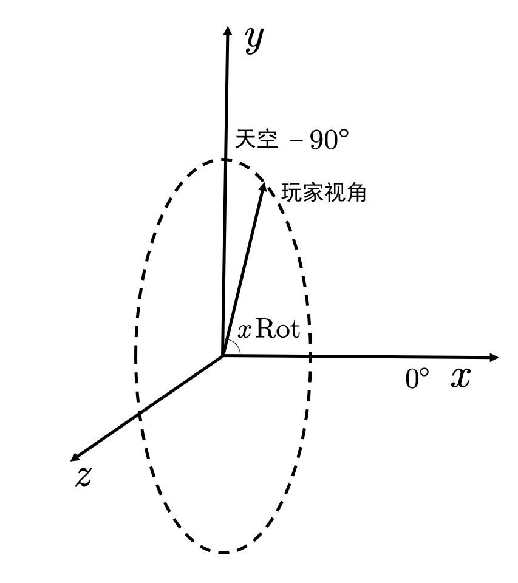

这样，平视和俯视的角度一结合，我们就可以用 2 个值确定玩家的朝向。至此，你已经完全了解了这两个值的含义。此外，这两个值同样支持波浪线写法，即`~+(value)`的写法。

:::tip[实验 2.2-8]

1. 执行命令`/tp @s ~~~ 90 0`。易知，该命令将使你平视面向西方。
2. 执行命令`/tp @s ~~~ ~1`。该命令将使你在 y 轴旋转上再加 1°。甚至于，如果你能每游戏刻执行此命令一次，你将能够以 20°/s 的角速度，在 18s 内原地转完一圈！类似的原理在`/camera`加入之前被经常应用，以实现转圈的动画效果。

:::

### 目标选择器参数`rx`、`rxm`、`ry`、`rym`

这四个参数是比较容易和`r`、`rm`搞混的，其实它们完全不是同一个概念。它们主要负责检测玩家的朝向信息。刚刚我们讲到，用`y旋转`和`x旋转`可以确定玩家的朝向信息，而这四个参数主要负责检测玩家的朝向信息。是的，这里的 r 并不指代 Radius，而是 Rotation。它们的语法如下：

```text title="目标选择器参数rx、rxm、ry、rym" showLineNumbers
rx=<x旋转最大值: float>
ry=<y旋转最大值: float>
rxm=<x旋转最小值: float>
rym=<x旋转最小值: float>
```

与`rm`类似，这里的 m 仍然指代最小值 Minimum。很多抬头检测、低头检测，就是基于这个目标选择器参数检测的。

:::tip[实验 2.2-9]

执行命令`/testfor @a[rx=-85]`。这条命令将检测所有抬头望向天空的玩家。

因为望向天空的 x 旋转值为 -90°，所以我们要检测 -90° 的玩家。但是，经过实验证明，玩家的 x 旋转角度不可能为极限值 -90°，所以我们需要确定一个大致的范围，这里采用 -85°~-90°，这时无需指定`rxm`，因为 -90° 已经到底；所以指定`rx=-85`。

:::

---

## 发送消息的命令：`/say`

`/say`这条命令真的特别简单。听说过学话游戏吗？这条命令就是做这个用的：原封不动地把你写的说出去。语法为：

```text title="/say的语法" showLineNumbers
/say <消息: message>
```

**这条命令将在全局发送`消息`**。这个消息的类型是`message`，其实你可以认为它就是不带引号的`string`。不过需要注意，`message`类型也可以含有目标选择器，并返回目标选择器所选定的实体的名称。

我们来举两个例子：

- `/say Hello,world!`：在全服说`[(你的名字)] Hello,world！`
- `/say @e`：在全服说`[(你的名字)] (所有实体的名字)`，下图为示例。

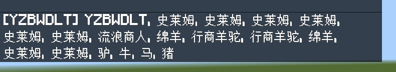

---

## 调整天气的命令：`/weather`

`/weather`是用于调整天气的命令。同样地，这条命令也含有一个 UI 可供你快速调整。它的语法为：

```text title="/weather的语法" showLineNumbers
/weather <clear|rain|thunder> [时长: int]
/weather query
```

可见，`/weather`有两条语法。第 1 条语法的含义为**设置特定的天气为`时长`游戏刻**。第 2 条语法的含义为**查询天气**。两条命令的语法都很简单，对吧？同样地，我们举两个例子：

- `/weather clear`：设置为晴天。这个`时长`是在 6000\~18000（即 5\~15 分钟）随机取值的。所以使用这条命令后，你会感到雨可能没一会儿就开始下，而且很频繁。我们有一个办法可以设置为永久晴天，不过这就是后话了。
- `/weather query`：查询当前的天气。例如，如果是晴天，就返回`天气状态是：晴天`，对，就这些。这条命令的意义大不大嘛……反正看个乐吧。

---

## 总结

我们本节学习了很多基础概念和基础命令。为什么单独把这 9 条命令挑出来呢？因为掌握这 9 条命令，至少可以保证你能做一个最基础、最简陋的地图出来，它们足够简单、功能也比较强、而且流传度也比较高，有助于你上手命令。那么，现在我们就开始总结这节的内容吧！

另外我们还是要再三强调：**实践是很重要的**！请动脑思考并完成我们布置的练习，熟能生巧。**我们不会要求你完全掌握语法**，尤其是参数顺序之类的，毕竟各大文档都查得到这些东西，现学也赶趟。**但是会要求你多练习**，新手和老手之间的差别，就在于这经验上。

### 原理

- **物品数据值**：用于指代物品状态的一个数值。对于工具，用于指代损坏值。一切物品都可以拥有数据值，不同数据值的物品的状态不同，一般不可堆叠。允许时，`-1`代表任意数据值的该物品。
- **冒险模式**：类似于生存模式的游戏模式，但是不能随意地破坏方块、或者放置方块。只有使用命令给予的含有特定`组件`的物品，或者在允许方块之上，才能够进行放置、破坏等操作。
- **旁观模式**：允许玩家进行世界旁观的模式，能够飞行、允许穿墙、不能对世界进行任何操作等。
- **游戏刻**：Minecraft 完成一次代码循环所需的时间。
  - **时间换算原理**：**1 秒 = 20 游戏刻**，牢记！
- **游戏内的时间**：Minecraft 中，一天为 20 分钟，24000 游戏刻。
- **旋转角度**：玩家的视角向量可以分解为平视方向的向量和上下方向的向量，它们分别绕 y 轴旋转和绕 x 轴旋转，所以用**这两组数表示玩家的朝向**。均以顺时针为正方向。平视时，向南为 0°；上下方向上，水平为 0°。

### 命令

以下标粗的命令，为中频或更高频的命令，为重点掌握的命令。

| 命令 | 含义 | 备注 |
| --- | --- | --- |
| `/help <页码: int>` | 返回第`页码`页的帮助信息 | |
| `/help [命令: CommandName]` | 返回`命令`的帮助信息 | |
| **`/give <玩家: target> <物品: Item> [数量: int] [数据值: int] [组件: json]`** | 给予`玩家` `数量`个含有特定`组件`和`数据值`的`物品` | 注意`/clear`和`/give`的参数顺序 |
| **`/clear [玩家: target] [物品: Item] [数据值: int] [最大数量: int]`** | 清除`玩家`至多`最大数量`个数据值为`数据值`的`物品` | 注意`/clear`和`/give`的参数顺序；物品不足`最大数量`亦可成功执行；`最大数量`可以为 0 |
| `/gamemode <游戏模式: int\|GameMode> [玩家: target]` | 把`玩家`调整为`游戏模式` | `游戏模式`建议使用全称 |
| **`/kill [目标: target]`** | 杀死`目标` | 谨慎使用`/kill @e` |
| `/time add <数值: int>` | 加快`数值`游戏刻的时间 | |
| `/time query <day\|daytime\|gametime>` | 查询世界处于第几天、或时间、或存在总时长 | |
| **`/time set <数值: int\|时间: TimeSpec>`** | 设置世界的时间为`数值`（或`时间`） | |
| `/tp <目标: target> <位置: target> [检查卡墙: Boolean]` | 传送`目标`到`位置`实体处的位置，检查`检查卡墙` | |
| `/tp <目标: target> <位置: x y z> [检查卡墙: Boolean]` | 传送`目标`到`位置`坐标处的位置，检查`检查卡墙` | |
| **`/tp <目标: target> <位置: x y z> [y旋转: value] [x旋转: value] [检查卡墙: Boolean]`** | 按照旋转角度`y旋转`和`x旋转`传送`目标`到`位置`坐标处的位置，检查`检查卡墙` | |
| **`/tp <目标: target> <位置: x y z> facing <面向实体: target\|面向坐标: x y z> [检查卡墙: Boolean]`** | 按照面向`面向实体`（或`面向坐标`）的朝向传送`目标`到`位置`坐标处的位置，检查`检查卡墙` | `面向实体`至多指代 1 个 |
| **`/say <消息: message>`** | 在全服务器发送`消息` | |
| `/weather <clear\|rain\|thunder> [时长: int]` | 设置特定的天气为`时长`游戏刻 | |
| `/weather query` | 查询天气 | |

### 目标选择器参数

| 目标选择器参数 | 取自 | 意义 | 备注 |
| --- | --- | --- | --- |
| `m=<游戏模式: int\|GameMode>` | **M**ode | 查找`m`的玩家 | 允许反选，只能指定一次 |
| `rx=<x旋转最大值: float>` | **x R**otation | 查找 x 旋转值小于`rx`的玩家 | |
| `ry=<y旋转最大值: float>` | **y R**otation | 查找 y 旋转值小于`ry`的玩家 | |
| `rxm=<x旋转最小值: float>` | **M**inimum **x R**otation | 查找 x 旋转值大于`rxm`的玩家 | |
| `rym=<x旋转最小值: float>` | **M**inimum **y R**otation | 查找 y 旋转值大于`rym`的玩家 | |

## 练习

:::info[练习 2.2]

1. 写一条命令以给予全体生存模式下，低头的玩家 10 朵蒲公英（`dandelion`）。
2. 写一条命令以清除玩家的至多 10 朵蒲公英。
3. 开发者 A 希望制作一个商店系统。现在我们假设 A 想要实现的效果为 1 颗钻石兑换 5 个草方块，他的思路如下：  
第一步，用`/clear (玩家) diamond -1 1`清除玩家的钻石；  
第二步，如果这条命令执行成功，就执行`/give (玩家) grass_block 5`以给予玩家 5 个草方块，从而达成兑换效果。请问：  
（1）这样做是否可行？为什么？  
（2）如果不是 1 颗钻石兑换，而是 2 颗，那么执行`/clear (玩家) diamond -1 2`，成功后再执行`/give (玩家) grass_block 5`，这时是否可行？为什么？
4. 写一条命令以使所有玩家都正视东北方向。
5. 很多地图事先都要经过这样的初始化：调整天气为晴天，并调整时间为白天。试用两条命令执行之。后面你会学到用`/gamerule`命令阻止天气和时间变化的方法。
6. 现在要实现这样的逻辑：如果有玩家开了创造，就将这个玩家调整为生存，并警告这个玩家。我们将这条命令分为 2 个部分：  
命令 A：实现“如果有玩家开了创造，就将这个玩家调整为生存”的功能；  
命令 B：如果命令 A 成功执行，实现“警告这个玩家”的功能。  
事实上，这就是大多数地图采用的防作弊系统。请试写出这两条命令，警告消息可以写为“§c你不能开启创造模式！”
7. 我们曾经在我们的作品中实现了这样的功能：玩家处于旁观模式时，抬头即可切换为创造模式。试写出这条命令。
8. 很多服务器都会采用定时清理掉落物的功能，试写出清除所有掉落物的命令。

:::

<details>

<summary>练习题答案</summary>

1. `/give @a[m=survival,rxm=85] dandelion 10`。注意低头的 x 旋转值范围为 85~90，所以我们需要指定`rxm`最小值为 85，而最大值 90 是永远不可能达到的，所以无需指定。
2. `/clear (玩家) dandelion -1 10`，数据值写为`0`亦可，因为一般而言，默认状态下的物品的数据值都是`0`。
3. （1）可行。因为玩家没有钻石时，`/clear`将执行失败；有 1 个钻石时，`/clear`将清除玩家的 1 个钻石并成功执行，因此能够按照预期执行；有大于 1 个钻石时，`/clear`将至多清除 1 颗钻石并成功执行，也能够按照预期执行。上述情况全部可以按照预期执行，因此可行。  
（2）不可行。玩家没有钻石时和玩家的钻石数量大于等于 2 时，这个逻辑都按照预期执行。然而，若玩家只有 1 颗钻石时，命令同样成功执行，这时玩家只需要用 1 颗钻石即可兑换，背离预期。在以前没有`hasitem`的时代，这也是在进行大数量清除时不能直接使用这套逻辑做商店的根本原因。
4. `/tp @a ~~~ -135 0`或`/tp @a ~~~ 225 0`，当然这条命令将会导致玩家的位置改变到你的位置上，不过正视东北方向还是正视了的。
5. `/weather clear`、`/time set noon`（为白天范围即可）
6. 命令 A：`/gamemode survival @a[m=creative]`  
命令 B：`/say §c你不能开启创造模式！`  
7. `/gamemode creative @a[m=spectator,rx=-85]`。注意抬头的 x 旋转值范围为 -90~-85，最小值为 -90 不可能达到，所以无需指定`rxm`；而最大值 -85 则用`rx=-85`指定。
8. `/kill @e[type=item]`

</details>

import GiscusComponent from "/src/components/GiscusComponent/component.js"

<GiscusComponent/>
