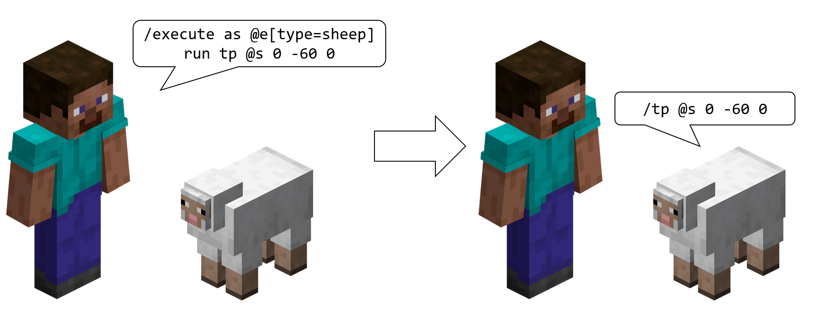
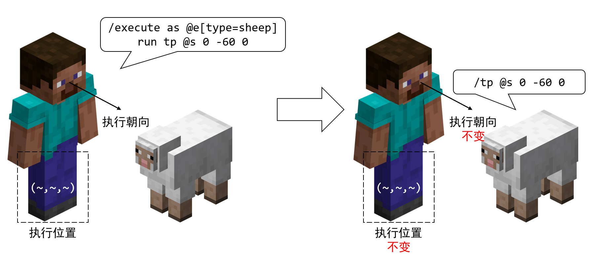
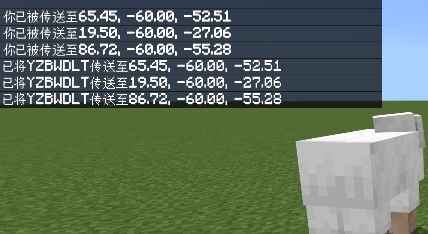
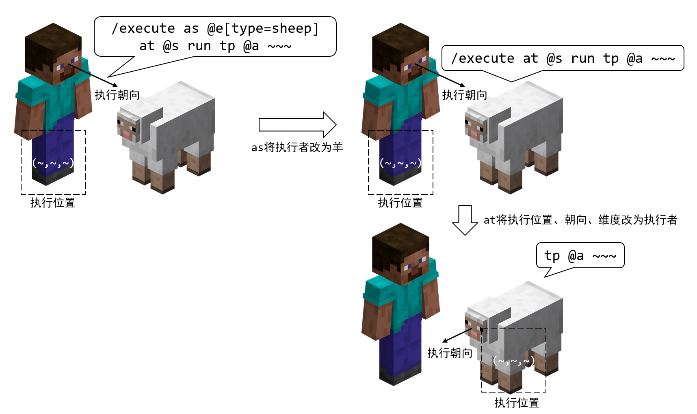
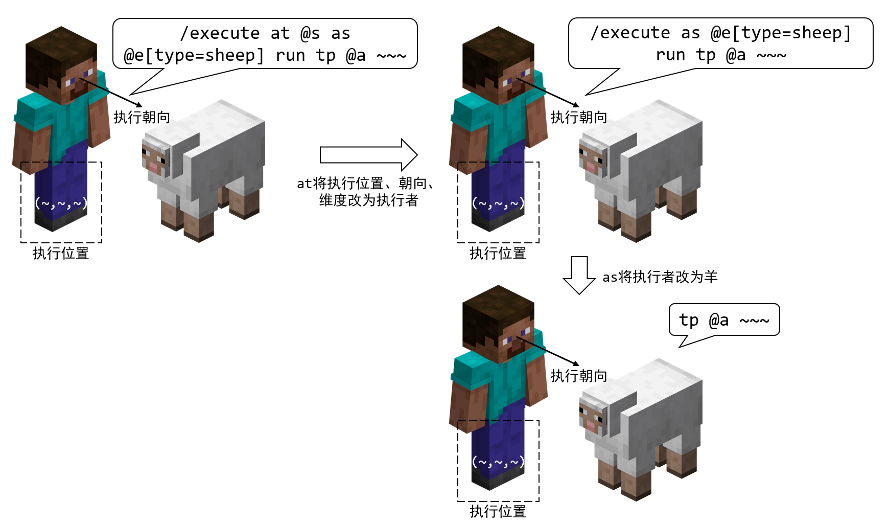
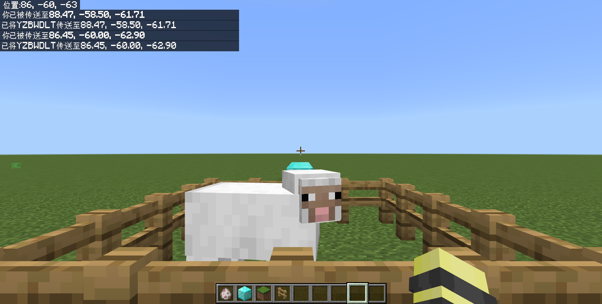
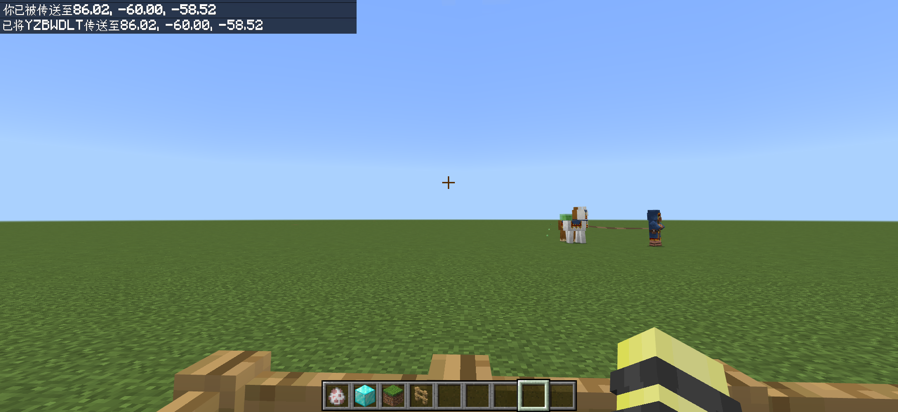
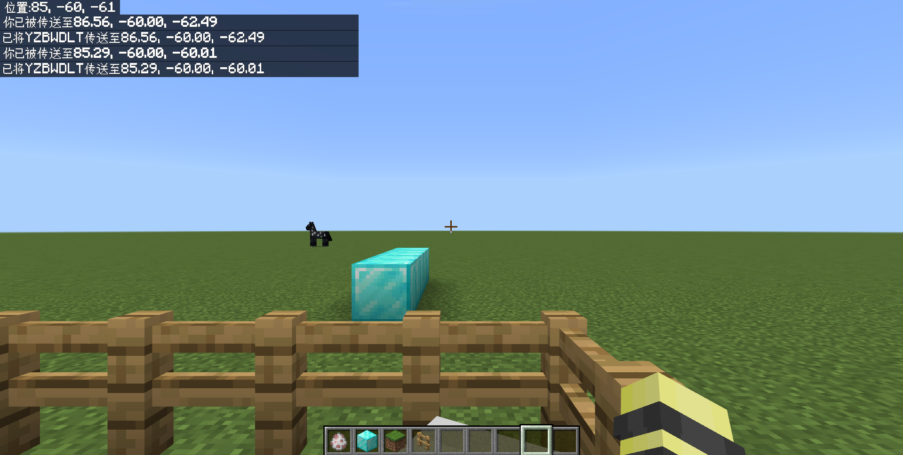
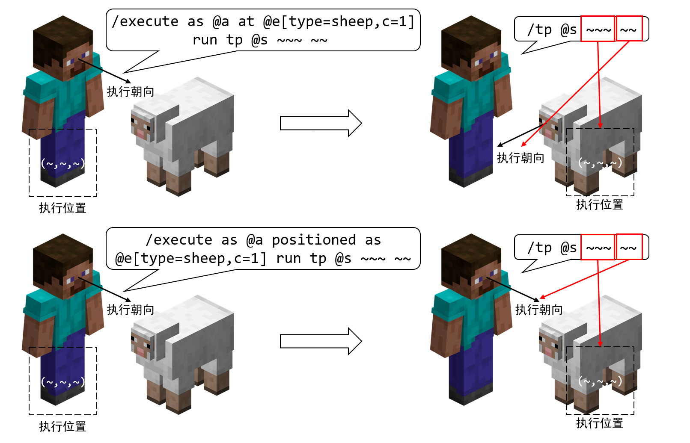
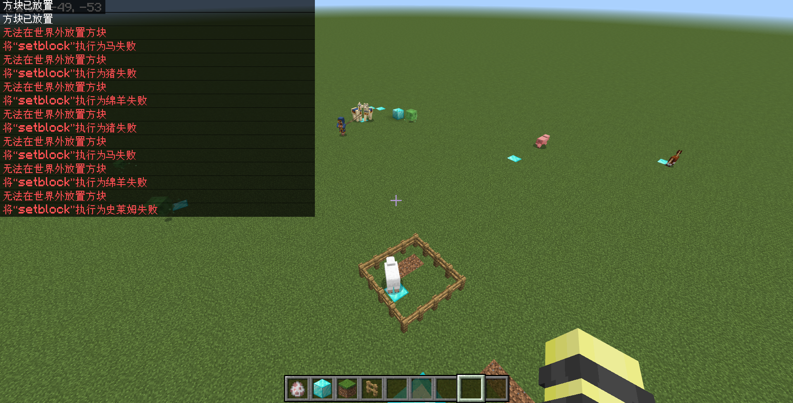

# 2.3.2 修饰子命令和`run`子命令

话现在说到这里，我们就该正式了解这个玩家圈子内所说的“高级命令”：`/execute`了。

**`/execute`用于按照特定的上下文和特定的条件执行命令**。下面有非常非常多的命令，刚接触到的玩家看到下面这些东西一定会眼花缭乱：

```text title="/execute的语法" showLineNumbers
/execute <子命令: if|unless> block <位置: x y z> <方块: Block> <方块状态: block states> [子命令: ExecuteChainedOption_0]
/execute <子命令: if|unless> block <位置: x y z> <方块: Block> [子命令: ExecuteChainedOption_0]
/execute <子命令: if|unless> blocks <起点: x y z> <终点: x y z> <目标点: x y z> <扫描模式: all|masked> [子命令: ExecuteChainedOption_0]
/execute <子命令: if|unless> entity <目标: target> [子命令: ExecuteChainedOption_0]
/execute <子命令: if|unless> score <目标: target> <记分项: string> <操作方法: compare operator> <源目标: target> <记分项: string> [子命令: ExecuteChainedOption_0]
/execute <子命令: if|unless> score <目标: target> <记分项: string> matches <范围: integer range> [子命令: ExecuteChainedOption_0]
/execute align <坐标轴: string> <子命令: ExecuteChainedOption_0>
/execute anchored <eyes|feet> <子命令: ExecuteChainedOption_0>
/execute as <源目标: target> <子命令: ExecuteChainedOption_0>
/execute at <源目标: target> <子命令: ExecuteChainedOption_0>
/execute facing <位置: x y z> <子命令: ExecuteChainedOption_0>
/execute facing entity <源目标: target> <eyes|feet> <子命令: ExecuteChainedOption_0>
/execute in <维度: Dimension> <子命令: ExecuteChainedOption_0>
/execute positioned <位置: x y z> <子命令: ExecuteChainedOption_0>
/execute positioned as <源目标: target> <子命令: ExecuteChainedOption_0>
/execute rotated <y旋转: value> <x旋转: value> <子命令: ExecuteChainedOption_0>
/execute rotated as <源目标: target> <子命令: ExecuteChainedOption_0>
/execute run <命令: command>
```

天哪！这么多……18 条语法，怎么办呢？不要紧，我们来带你分析。

---

## 子命令

还记得 Wiki 一开始的定义吗？

> /execute 是各不同功能的子命令的集合，用于改变命令上下文（修饰子命令），执行逻辑判断（条件子命令），并在此基础上执行任意其他命令。

所以，这些语法拆开来看就是各式各样的**子命令（Subcommand）**。

首先，我们先关注`/execute`后面所跟的东西，那就是子命令。在基岩版，目前**一共有 11 条子命令**，分别是：`align`、`anchored`、`as`、`at`、`facing`、`in`、`positioned`、`rotated`、`if`、`unless`、`run`。换言之，我们这一节就是学习这 11 条子命令的。

接下来我们继续来看，除了`run`之外，每个语法后面都有一个`子命令: ExecuteChainedOption_0`，对吧？换句话说，这些子命令中除了`run`之外，我们可以把这些所有的语法统一写为

```text title="/execute的通用语法" showLineNumbers
execute <子命令> -> execute
```

这里的`-> execute`是 Java 版惯用的写法，基岩版写为`子命令: ExecuteChainedOption_0`，不过它太长了，所以**我们用`-> execute`，来表示这是下一个子命令的起点，本教程都将使用`-> execute`来指代`子命令: ExecuteChainedOption_0`**。

也就是说，**`/execute`是允许子命令嵌套下去的**。例如`/execute as @a if entity @e[name=a]`，就是在`at`的子命令结束后接上了一个`if`子命令，而`if`子命令还可以再接下去。

这么多的子命令，可以分为 3 类：**修饰子命令、条件子命令、`run`子命令**。除`run`、`if`、`unless`外，其他的所有子命令都是修饰子命令。

如你所见：

- 所有的修饰子命令的`-> execute`都是必选参数；
- 所有的条件子命令的`-> execute`都是可选参数；
- `run`不以`-> execute`为结尾。

这也就是说，**`/execute`必须以条件子命令或`run`子命令收尾**。如果不这么做，也就是以修饰子命令为结尾，将会导致语法错误，因为修饰子命令的`-> execute`是必选参数。

## 修饰子命令和`run`子命令

刚刚你已经了解了命令执行原理，知道命令的执行效果是根据执行环境而定的，而**修饰子命令就可以修改这些环境**。在前面我们提到，**修饰子命令能够修改执行者和执行环境参数（也就是执行位置、执行朝向和执行维度）**。

**修改了这些上下文之后，就由`run`来负责把这些上下文信息传递给一般的命令**。例如，修饰子命令在修改了执行者为羊后，再执行`tp @s 0 0 0`，就把执行者从玩家改成了羊，这条命令所传送的实体也就变成了羊。

我们刚刚说：子命令是可以嵌套的。那么 Minecraft 读取一条嵌套很长的`/execute`是如何读取的呢？事实上，不光是`run`，其实后面的子命令也受到修饰子命令的影响。举一个例子，对于命令`/execute (子命令1) (子命令2) ...`来说，`子命令1`修改的信息也会影响`子命令2`的判断，所以**读一条`/execute`命令应该从左往右读**。这也就导致，`/execute (子命令1) (子命令2) ...`和`/execute (子命令2) (子命令1) ...`的执行效果往往不一样。

接下来，我们开始逐个突破，教你学会使用这些神奇的子命令。

---

## 更改执行者的子命令：`as`

`as`是一条更改执行者的子命令。它的语法为

```text title="/execute as的语法" showLineNumbers
as <源目标: target> -> execute
```

**更改命令执行者为`源目标`**。它的类型为`target`，所以接受实体。相信了解了上下文机制的你，对此已经不会认为这是难点了。我们来做个实验吧！

:::tip[实验 2.3-1]

分别执行`/tp @s 0 -60 0`和`/execute as @e[type=sheep] run tp @s 0 -60 0`。观察效果，你会立刻发现`as @e[type=sheep]`的作用。

:::

执行`/tp @s 0 -60 0`之后，将你传送到了(0,-60,0)，你对这命令已不陌生。

而执行`/execute as @e[type=sheep] run tp @s 0 -60 0`，从左往右读，我们看到执行者改成了所有的羊，然后再执行*将所有执行者传送到(0,-60,0)的命令*，所以，这就会导致将所有的羊传送到(0,-60,0)。

我们用下面这张图来反映这个子命令究竟做了什么：



不过！这张图有一点并没有说清楚……这张图似乎隐晦地传达了一个信息：难道更改执行者就会把执行位置、执行朝向和执行维度全部改过去吗？事实上，这种想法是错误的。何以见得？我们来做下一个实验，你就会看到这点。

:::tip[实验 2.3-2]

执行`/execute as @e[type=sheep] run tp @a ~~~`。

如果`as`更改了执行位置，玩家应当传送到羊的身上，反之玩家的位置则不动（因为执行位置默认为玩家的位置）。

:::

实验结果如下图：


看来，结果是显然的：**`as`更改且仅更改执行者**。换言之，**执行环境参数不受影响**，这张图的更完整的画法应当为：



我们着重强调这点，就是为了提醒你：务必注意这些子命令都会更改什么上下文，以及它们可能会带来什么影响，不会带来什么影响。尤其对于`as`，因为它不改变执行位置，很多开发者会错误地认为它更改了执行者之后，就认为是该实体完全执行此命令，隐晦地认为这条命令更改执行位置（哪怕他们明确地知道这条命令不更改执行位置），这是不正确的。

## 更改执行位置、朝向、维度的子命令：`at`

`at`会完全改变命令的执行环境参数。它的语法是：

```text title="/execute at的语法" showLineNumbers
at <源目标: target> -> execute
```

**更改执行环境参数（位置、朝向、维度）为`源目标`的环境参数**。同样，`target`类型代表它接受实体。因此，如果`as`和`at`配合，可以达成一条命令完全由其他实体执行的效果。

:::tip[实验 2.3-3]

分别执行下面两条命令：

- `/execute as @e[type=sheep] run tp @a ~~~`。在实验 2.2-2 中，你已经知道这条命令会导致所有的羊执行“*将玩家传送到执行位置（原执行者的位置）*”的命令。
- `/execute as @e[type=sheep] at @s run tp @a ~~~`。观察效果，你可以将这条命令的执行效果和上面进行对比，尝试分析`at @s`的作用。

:::

类似于前文的分析方法，我们仍旧**从左到右读后面的这条命令**：

- `as @e[type=sheep]`，更改执行者为所有的羊；
- `at @s`，令所有的执行者（即所有的羊）把执行环境参数（位置、朝向、维度）改为自己的环境；
- `run tp @a ~~~`，执行“*将所有玩家传送到执行位置（也就是所有羊）*”的命令。

所以，所有的玩家都将传送到所有羊（事实上是所有羊执行一遍，依次执行，并执行到最后那只羊身上）的位置上。



上面这个过程，可以用下面这张图来表示。



我们也不妨来看一下，如果对调`as @e[type=sheep]`和`at @s`，出现的将会是下图的局面。换言之，这条命令就将*把所有的玩家传送到原执行者玩家身上*了。可见，子命令的顺序是不能任意调换的。



## 更改执行位置的子命令：`positioned`、`align`、`anchored`

可能你会说，`at`更改的上下文太多了，总共学了 4 个，它就居然会改 3 个，不利于精细调控。那么，现在我们来学习只更改执行位置的子命令。这样的子命令一共有 3 条：`positioned`、`align`和`anchored`。它们的语法分别如下：

```text title="/execute positioned、align、anchored的语法" showLineNumbers
align <坐标轴: string> -> execute
anchored <eyes|feet> -> execute
positioned <位置: x y z> -> execute
positioned as <源目标: target> -> execute
```

### `positioned as`：更改执行位置为特定实体位置

我们先来学习`positioned as`，因为这是最简单的。刚刚你已经学习了`at`，我们可以说，在大多数情况下，它和`at`的含义其实是近似相同的，**`positioned as`会更改命令的执行位置到`源目标`的位置上**，但是与`at`不同的是，**执行朝向和维度不会发生变化**。

之所以说“在大多数情况下”，是因为我们使用局部坐标和`/tp`朝向语法的时候并没有那么频繁，所以执行朝向也就用得不太频繁；而一般情况下，很多地图都并不涉及维度的变化，因此执行维度的问题考虑的也不会很多，所以很多开发者可能会混用`positioned as`和`at`，在大多数情况下这是没有问题的。但是，我们仍然要强调的是，仍然不乏有少数场景中，你会需要考虑到朝向和维度的问题，比如在不同维度下的执行者，会触发不同的效果，这时候就要充分考虑`positioned as`和`at`之间的区别。

:::tip[实验 2.3-3]

分别执行下面两组命令：

- 先执行`/tp @s ~~~ 0 0`矫正朝向，然后执行`/execute as @a at @e[type=sheep,c=1] run tp @s ~~~ ~~`，注意别忘了最后两个`~~`；
- 先执行`/tp @s ~~~ 0 0`矫正朝向，然后执行`/execute as @a positioned as @e[type=sheep,c=1] run tp @s ~~~ ~~`。

在矫正朝向之前，你可以用一些标记方块来指示你的朝向变化：



:::

通过实验，你可以看到两条命令的执行效果如下：

1. `/execute as @a at @e[type=sheep,c=1] run tp @s ~~~ ~~`的执行效果，它把玩家传送到羊的身上，并且朝向也改为羊的朝向：  
  
2. `/execute as @a positioned as @e[type=sheep,c=1] run tp @s ~~~ ~~`的执行效果，它把玩家传送到羊的身上，但是朝向仍然为玩家原来的朝向：  
  

这样，你便看到这两条命令的异同点。它们都修改了执行位置为最近的羊，所以`tp @s ~~~`都传送玩家到相同的位置；但`positioned as`并不改变执行朝向，所以`tp`命令后面的两个`~~`就认定执行朝向仍为原执行者的朝向。



讲一句题外话。如果我们执行的命令不是`/tp @s ~~~ ~~`，而是`/tp @s ~~~`，那么这时候朝向无论如何都是玩家原来的朝向，这是因为这时候调用的不是`/tp`更改朝向的命令，**`/tp @s ~~~`只单纯地指定执行位置，所以更改执行朝向并不能影响这条命令的执行效果**。很多开发者都会在使用这条命令时，错误地认为更改执行朝向会一同改变被传送者的朝向，这是不正确的。

### `positioned`：更改执行位置为特定位置

如果你已经理解了`positioned as`，那么相信我，`positioned`事实上你也早已掌握。因为它只需要指定一个确定的位置：

```text title="positioned的语法" showLineNumbers
positioned <位置: x y z> -> execute
```

*令所有生物脚下放置一个钻石块*这样的例子，是`/execute`命令的一个基本示例，或许你在听说这条命令之前，对于它这样的应用也有所耳闻。那么我们来做一个实验来实现这一点！

:::tip[实验 2.3-4]

执行命令`/execute as @e at @s positioned ~~-1~ run setblock ~~~ diamond_block`。

:::



好像报了很多错，但不要紧，仔细一看就知道这是`/setblock`试图在未加载的区域放置方块，从而报错，其实就是离得太远了。我们后面会学习到`/tickingarea`命令，用它来添加一个常加载区域，就可以在足够远的同时使这些操作方块的命令生效。

让我们回到正题，很显然你的世界中所有的实体脚下都出现了一个钻石块。耶！就是这么简单！让我们简单分析一下命令：`as @e at @s`相当于所有实体都按自己的环境执行后续命令，然后用`positioned ~~-1~`来将执行位置修正到各实体脚下 1 格，最后在这个位置放置钻石块，大功告成！

不过细心的小伙伴可能也会想：不借助于`positioned`，直接`/execute as @e at @s run setblock ~~-1~ diamond_block`不行吗？这当然可以了，二者是同义的，不过有时候你可能会用它来执行一些打包的命令（日后你将认识到`/function`就是这样的命令），这时候它们就可以共享这样的执行环境。不过极大多数情况下这二者是完全同义的。

### `align`：自动对齐

接下来让我们认识一下`align`。align 有“对齐”的意思，它会自动矫正执行位置，将执行位置修正到一个附近坐标轴凑整的位置上：

```text title="align的语法" showLineNumbers
align <坐标轴: string> -> execute
```

其中，`坐标轴`可以写为`x`、`y`、`z`三个字符串的任意排列组合（每个字符只能出现 1 次），例如`yx`、`z`、`xyz`。**`align`将会把出现的坐标轴对应的坐标向下取整**。

:::tip[实验 2.3-6]

执行命令`/execute positioned 0.75 -59.5 0.25 align xyz run tp @s ~~~`，观察自己被传送到什么位置上。

:::

执行后，这条命令的执行结果为：


可以看到，`positioned`指定的执行位置(0.75,-59.5,0.25)被`align`修正为了(0.0,-60.0,0.0)。因为`align`指定为了`xyz`，所以 3 个坐标均被修正并向下取整。

不过有一点需要当心！你可以看到你被传送到的位置是 4 个方块的交界处，换言之：(0.0,-60.0,0.0)并不处于方块的正中心。很多情况下，你要在一个方块的正中心召唤生物，或者做一些事情的话，不要忘了分别给`x`和`z`坐标加一个`0.5`的修正，例如：<code>/execute positioned 0.75 -59.5 0.25 align xyz <strong>positioned ~0.5~~0.5</strong> run tp @s ~~~</code>。

这条子命令的使用频次很低，但它总有少数特定情况是可以派得上用场的，做简单了解即可。

### `anchored`：调整执行位置

我们知道一个实体所处的位置位于它的脚部，所以使用`~~~`自然指代的也是这个实体的脚部。然而，有时候我们希望把执行位置传送到眼部的位置，这时就需要用`anchored`来实现这样的效果。

```text title="anchored的语法" showLineNumbers
anchored <eyes|feet> -> execute
```

**`anchored`将把执行位置改为自己的脚部或眼部的位置**。这条子命令也常用于判断玩家是否处于游泳、潜行等状态。同样地，这条子命令的使用频次也很低，做简单了解即可。

## 更改执行朝向的子命令：`facing`、`rotated`

刚刚我们已经学习了更改执行位置的子命令，现在我们再来了解一下更改执行朝向的子命令：`facing`和`rotated`。

```text title="facing和rotated的语法" showLineNumbers
facing <位置: x y z> -> execute
facing entity <源目标: target> <eyes|feet> -> execute
rotated <y旋转: value> <x旋转: value> -> execute
rotated as <源目标: target> -> execute
```

怎么说呢……看到这 4 条命令，你很可能已经会了 3 个了。可能你自己都要问，我什么时候会的 3 个？我们不妨来仔细看看：

- **`facing <位置: x y z> -> execute`**：
  - 请联想`/tp <目标: target> <位置: x y z> facing <面向坐标: x y z> [检查卡墙: Boolean]`。
  - 所以这条子命令的意义是：**执行朝向改为面向`位置`**。
- **`facing entity <源目标: target> <eyes|feet> -> execute`**：
  - 请联想`/tp <目标: target> <位置: x y z> facing <面向实体: target> [检查卡墙: Boolean]`
  - 所以这条子命令的意义是：**执行朝向改为面向`源目标`的眼睛或脚部**。
- **`rotated <y旋转: value> <x旋转: value> -> execute`**：
  - 请联想`/tp <目标: target> <位置: x y z> [y旋转: value] [x旋转: value] [检查卡墙: Boolean]`。
  - 所以这条子命令的意义是：**执行朝向改为指定的旋转角度**。

看！很简单吧，因为你已经学会了`/tp`，所以这三个自然是手到擒来！

至于最后一个 **`rotated as`**，则是和`positioned as`类似，**直接把执行朝向改为`源目标`的朝向**。

不过需要当心一点：在前面我们也曾提到过这一点，**更改执行朝向，并不意味着更改执行者的朝向**！只有你真正地指代了局部坐标或者`/tp`的朝向信息时，它们才会起到用途。

由于执行朝向在实际应用中并不太常见，而且刚刚也有一些关于执行朝向的举例示例，我们就不再在这些命令上花篇幅举例了，读者感兴趣的话可以自己举例了解。

## 更改执行维度的子命令：`in`

最后，是更改执行维度的子命令`in`。它的语法为

```text title="in的语法" showLineNumbers
in <维度: Dimension> -> execute
```

**`in`更改执行维度到`维度`上**。这是一个新的参数类型`Dimension`，是一个穷举参数，支持`overworld`、`nether`和`the_end` 3 个参数。

:::tip[实验 2.3-7]

执行命令`/execute in the_end run tp 0 64 0`。试试不通过传送门就直接去末地有多刺激吧！

:::

我们来简单分析这条命令：首先`in the_end`将执行维度变为末地，然后`tp 0 64 0`会将执行者传送到位于执行维度的该位置，也就是末地的(0, 64, 0)。很简单吧！

这条子命令常用于维度之间的变换。需要注意的是，下界和其他维度存在坐标的 8 倍变换关系，这在这条命令中也同样适用。

请注意一点：我们在很多情况下都希望选中特定维度的实体。然而，**`in`更改的执行维度并不会影响`@a`、`@e`选中其他维度的实体，因此往往需要使用`rm=0`来限定位置信息**。例如，`/execute in nether as @e run say 1`会导致主世界的生物也说`1`，只有`/execute in nether as @e[rm=0] run say 1`时才能限定下界的生物说`1`。

---

## 总结

在本小节，我们学习了`/execute`的一些基本概念、修饰子命令和`run`子命令的用法。

### 基本概念

- `/execute`用于按照特定的上下文和特定的条件执行命令。
- `/execute`是各式各样的子命令的集合，一共有 11 条子命令。
  - 其中，有 8 条：`align`、`anchored`、`as`、`at`、`facing`、`in`、`positioned`、`rotated`用于**修改命令上下文**，称为**修饰子命令**。
  - 有 2 条：`if`、`unless`用于条件判断，称为**条件子命令**。
  - 剩下的`run`，按照所给的命令上下文，和条件子命令所判断的通过条件执行后续命令。
- `/execute`的通用语法为`execute <子命令> -> execute`（其中`run`除外）。
  - `-> execute`表示这是下一个子命令的起点。
  - 这也意味着，`/execute`是允许多条子命令嵌套的。
- `/execute`不得以修饰子命令收尾，必须以条件子命令或`run`收尾。
- 因为修饰子命令会修改命令上下文，影响后续子命令和命令的执行环境，所以一条`/execute`应该从左往右读。
  - 所以，子命令之间不可随意对调，往往会产生很大的不同。
  - 设计一条`/execute`命令时，应当注意子命令之间的顺序关系。
- 修饰子命令修改命令上下文不会更改其他不该改的上下文，尤其是对于`as`需要注意这一点。
- 需要注意：修改执行朝向不等同于修改执行者的朝向！

### 子命令列表

| 子命令 | 含义 | 备注 |
| --- | --- | --- |
| `as <源目标: target> -> execute` | 更改命令执行者为`源目标`。 | |
| `at <源目标: target> -> execute` | 更改执行环境参数（位置、朝向、维度）为`源目标`的环境参数 | |
| `positioned as <源目标: target> -> execute` | 更改命令的执行位置为`源目标`的位置 | |
| `positioned <位置: x y z> -> execute` | 更改命令的执行位置为`位置` | |
| `align <坐标轴: string> -> execute` | 将`坐标轴`对应的执行位置坐标向下取整 | `x`、`y`、`z`各只能出现一次；修正的位置非方块中心，而为方块角落 |
| `anchored <eyes\|feet> -> execute` | 更改执行位置为执行者的脚部或眼部的位置 | |
| `facing <位置: x y z> -> execute` | 更改执行朝向为面向`位置` | |
| `facing entity <源目标: target> <eyes\|feet> -> execute` | 更改执行朝向为面向`源目标`的眼睛或脚部 | |
| `rotated <y旋转: value> <x旋转: value> -> execute` | 更改执行朝向为指定的旋转角度 | |
| `rotated as <源目标: target> -> execute` | 更改执行朝向为`源目标`的朝向 | |
| `in <维度: Dimension> -> execute` | 更改执行维度为`维度` | 不同维度的坐标应予以变换 |

其中，在实际工程中，最常用的子命令为`as`、`at`和`positioned`。

## 练习

:::info[练习 2.3-1]

1. 还记得练习 2.2 中的第 4 个问题吗？写一条命令以使所有玩家都正视东北方向，但这次不得影响所有玩家原本的位置信息，只更改他们的朝向。
2. 写一条命令，将所有末影人附近 5 格的玩家传送到末影人的眼部位置。
3. 写一条“勇敢的村民”的命令——杀死所有村民附近 5 格的僵尸！
4. 你也许玩过一种“木乃伊抓人游戏”：木乃伊的行走速度更快，但它与你的方向始终一致，通过一些挡板来挡住木乃伊的步伐并找到出口。现在，我们来简单模拟一下这个基本原理，写一条命令以让所有僵尸的方向与一位名为 Alex 的村民一致。
5. 写一条命令，在所有村民所在方块的正中心位置生成一只僵尸。
6. 写一条命令，令所有羊传送到它们附近的一只牛的位置，并面向离(0,0,0)最近的一只猪。这都什么鬼要求啊……
7. 试分析 Wiki 中给出的两条命令示例：`/execute as @e at @s run tp ^^^1`和`/execute at @s as @e run tp ^^^1`，并用语言表述它们的含义。
8. 检测所有下界的生物，并让每个下界的生物执行`/say 你们好，主世界的生物们！`命令。  
  你可能会发现这条命令因为下界未加载而执行失败，那就进下界执行这条命令吧（不过不要用下界传送门）！
9. 让进入了(0,-60,0)附近 1 格范围的创造模式玩家改为生存模式，并将他传送到(0,-60,3)的位置上。这个功能需要使用 2 条命令解决，先执行命令 1 再执行命令 2。  
  命令 1：\_\_\_\_\_  
  命令 2：\_\_\_\_\_  
  如果两条命令的顺序倒转，还能否实现预定效果？为什么？

:::

<details>

<summary>练习题答案</summary>

1. `/execute as @a at @s run tp @s ~~~ -135 0`
2. `/execute as @e[type=enderman] at @s as @a[r=5] anchored eyes run tp @s ~~~`，注意末影人周围 5 格是针对其脚部位置而言的。
3. `/execute as @e[type=villager] at @s run kill @e[type=zombie,r=5]`
4. `/execute as @e[type=zombie] at @s rotated as @e[type=villager,name=Alex,c=1] run tp @s ~~~ ~~`（注意千万不要忘记后面的`~~`，更改执行朝向不等同于更改执行者的朝向！）
5. `/execute as @e[type=villager] at @s align xz positioned ~0.5~~0.5 run summon zombie`
6. `/execute as @e[type=sheep] at @s positioned as @e[type=cow,c=1] facing entity @e[x=0,y=0,z=0,c=1,type=pig] feet run tp @s ~~~~~`  
  或`/execute as @e[type=sheep] at @s positioned as @e[type=cow,c=1] run tp @s ~~~ facing @e[x=0,y=0,z=0,c=1,type=pig]`，答案不唯一。
7. 从左向右分析。  
第一条命令先更改执行者为所有实体，后更改执行环境参数为执行者的环境参数，执行将所有执行者向前传送 1 格的命令，因此该命令的含义为*将所有实体向其前方传送 1 格*。  
第二条命令的`at @s`没什么意义，可忽略（因为执行环境参数本身就已经是执行者的环境参数了），然后设置执行者为所有实体，执行将所有执行者向前传送 1 格的命令，因此该命令的含义为*将所有实体传送到原执行者前方 1 格*。
8. 进入下界：`/execute in nether run tp @s ~~~`  
  检测下界生物：`/execute in nether as @e[rm=0] run say 你们好，主世界的生物们！`
9. 命令 1：`/execute as @a[x=0,y=-60,z=0,r=1] run gamemode survival @s[m=creative]`  
  命令 2：`/execute as @a[x=0,y=-60,z=0,r=1] run tp 0 -60 3`  
  倒转后，因为先执行了`tp`命令导致玩家位置发生变化，一定会致使目标选择器检测失败，从而使得`gamemode`无法执行。因此，如果两条命令的顺序倒转，就无法再实现预定效果。

</details>

import GiscusComponent from "/src/components/GiscusComponent/component.js"

<GiscusComponent/>
