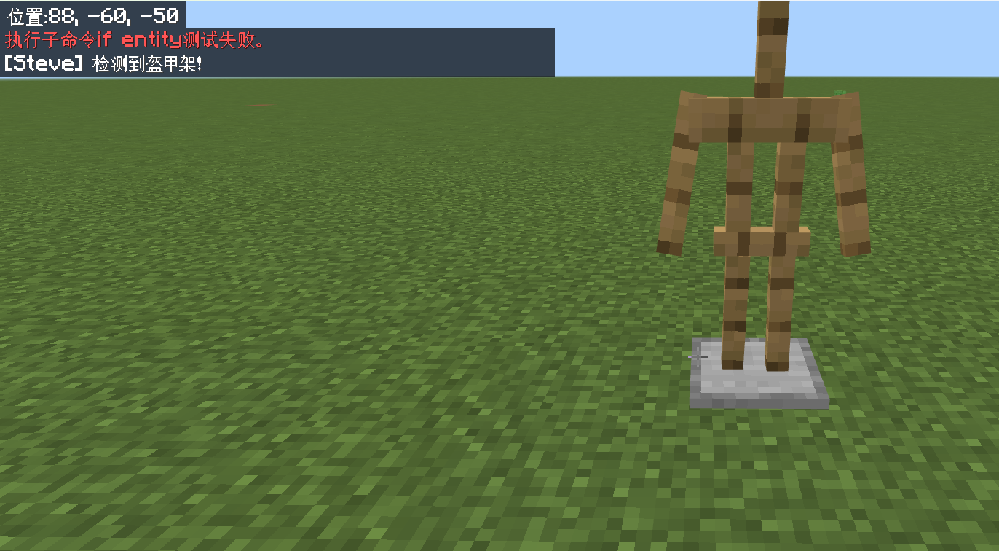
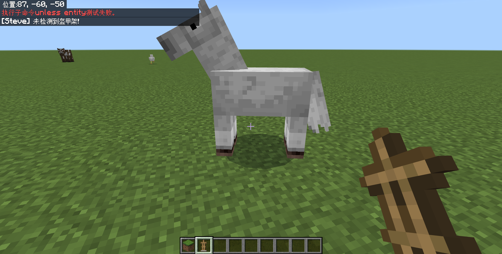
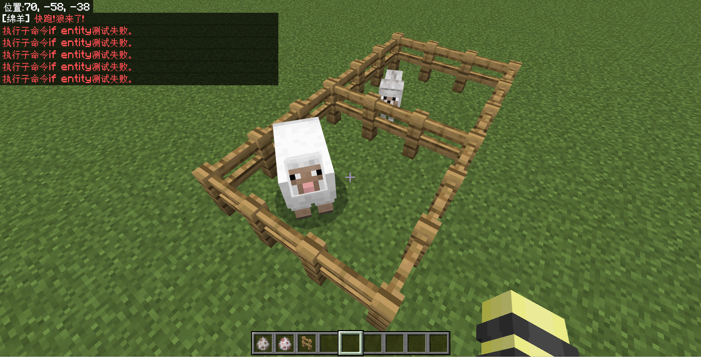
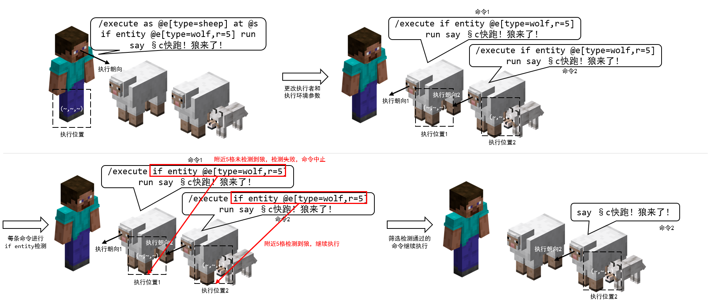
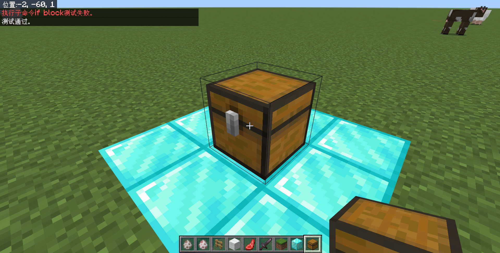
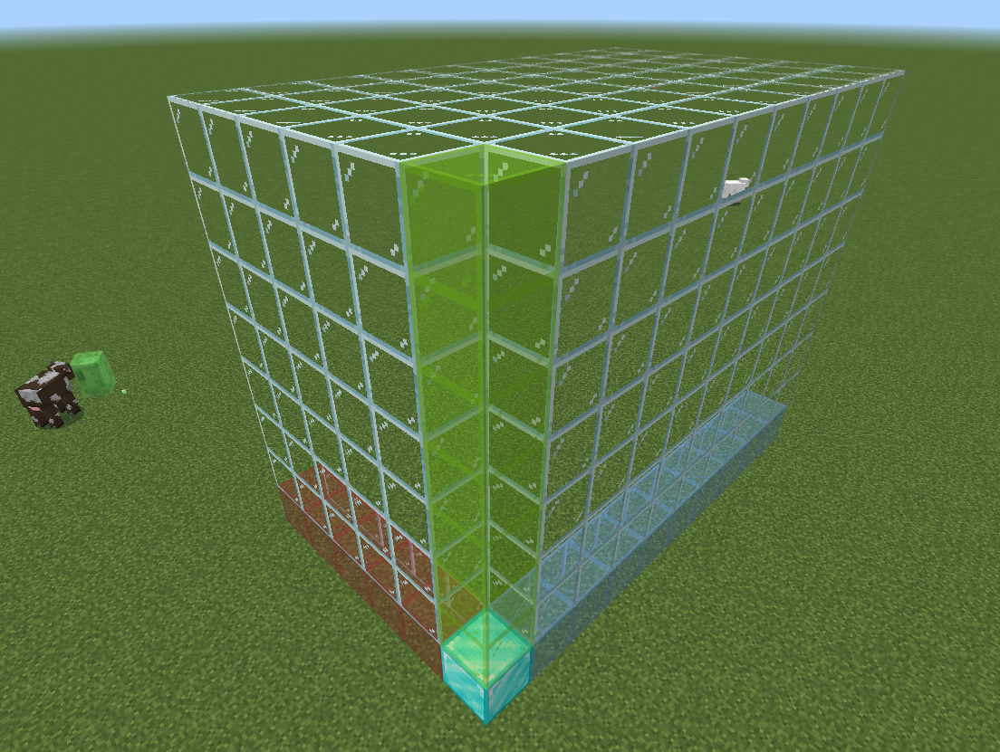
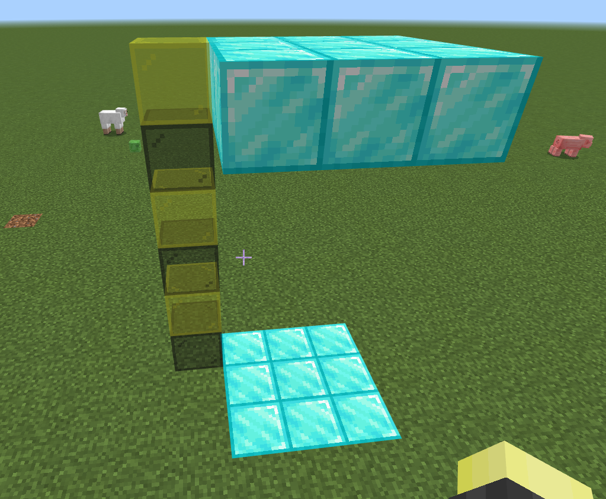
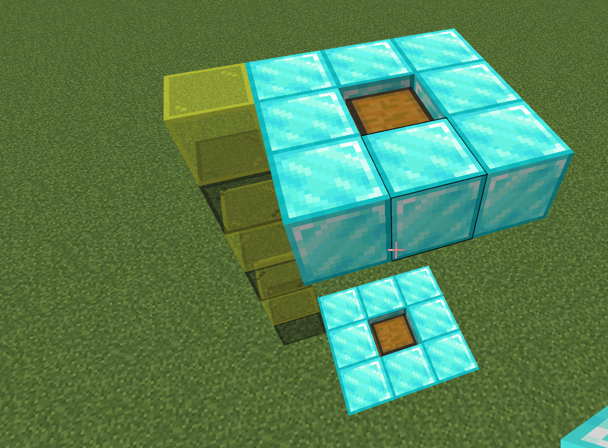
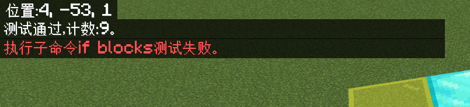

# 2.3.3 条件子命令

刚刚的部分中，我们已经介绍了 8 条能够更改命令上下文的修饰子命令。此外，`/execute`还可以**进行条件检测与判断**，这就是**条件子命令**的作用。

条件子命令只有 2 条：`if`和`unless`。让我们来看看它们的语法：

```text title="if|unless的语法" showLineNumbers
<if|unless> block <位置: x y z> <方块: Block> <方块状态: block states> -> execute
<if|unless> block <位置: x y z> <方块: Block> -> execute
<if|unless> blocks <起点: x y z> <终点: x y z> <目标点: x y z> <扫描模式: all|masked> -> execute
<if|unless> entity <目标: target> -> execute
<if|unless> score <目标: target> <记分项: string> <操作方法: compare operator> <源目标: target> <记分项: string> -> execute
<if|unless> score <目标: target> <记分项: string> matches <范围: integer range> -> execute
```

可以看到，它们后面所跟随的检测项目`block`、`blocks`、`entity`、`score`都是一样的，我们可以把它们写成一个更统一的格式：

```text title="if|unless的通用语法" showLineNumbers
<if|unless> <检测项目> -> execute
```

其中，如果`检测项目`给出的条件成立，那么`if`和`unless`将分别表现为：

- `if 检测项目`将检测通过，继续执行`-> execute`的内容；
- `unless 检测项目`将检测不通过，命令执行失败并中断。

显然，**`if`和`unless`就是“是”与“非”的关系，它们的执行效果是完全相反的**。例如，`execute if (项目1) run say 1`会在`项目1`成立时执行`say 1`，而`execute unless (项目2) run say 2`反而会在`项目2`不成立时执行`say 2`。

因为`score`目前来讲已经“超纲”了，我们本节暂且先按下不表。不过，下一节我们就将看到它的用法。接下来，我们来看看剩下 3 个检测项目怎么使用吧！

## 检测实体的子命令：`<if|unless> entity`

`execute if entity`用于检测实体。

```text title="if|unless entity的语法" showLineNumbers
<if|unless> entity <目标: target> -> execute
```

**检查`目标`是否存在**。你应该还记得，我们在第 1 章曾经学过一个`/testfor <目标: target>`的命令，这条命令的用法和它的用法完全一致，功能上则“有过之而无不及”，不要忘了`/execute`可是能多次嵌套的，`/execute`能够在检测成功的同时执行一条命令，而`/testfor`是做不到这一点的，它只有检测功能。

:::tip[实验 2.3-8]

执行命令`/execute if entity @e[type=armor_stand] run say 检测到盔甲架！`，在有盔甲架和无盔甲架时分别执行一次，体验`if entity`的效果。

然后，再执行一次命令`/execute unless entity @e[type=armor_stand] run say 未检测到盔甲架！`，在有盔甲架和无盔甲架时分别执行一次，体验`unless`和`if`的区别。

:::

通过实验，我们看到只有检测到盔甲架时，`/execute if entity @e[type=armor_stand] run say 检测到盔甲架！`才能够检测通过，并输出`检测到盔甲架`。



而只有检测**不**到盔甲架时，`/execute unless entity @e[type=armor_stand] run say 未检测到盔甲架！`才能够检测通过，并输出`未检测到盔甲架`。相信通过这个例子，你已经深刻地了解了`if`和`unless`的区别，我们后文也都不再会强调它们的异同，而是更关注这些检测项目。



接下来，让我们和修饰子命令联用，看看修饰子命令对后续条件子命令的影响如何。

:::tip[实验 2.3-9]

执行命令`/execute as @e[type=sheep] at @s if entity @e[type=wolf,r=5] run say §c快跑！狼来了！`。你能试着分析一下这条命令吗？

:::



我们可以看到，只有 1 只绵羊说了一句`§c快跑！狼来了！`，而其他的羊都返回`if entity`测试失败。我们来简单分析一下这条命令执行的全过程：



1. `as @e[type=sheep] at @s`先把执行者和执行环境参数全部改为所有羊。因为世界可能存在多只羊，所以所有羊依次执行后续命令。
2. `if entity @e[type=wolf,r=5]`为在所有羊附近 5 格范围内寻找是否有狼的存在。如果有则继续执行，如果没有则命令中止执行。
3. `run say §c快跑！狼来了！`让绵羊说出这句话。

可见，**前文的修饰子命令同样也会影响后续的条件子命令**。

:::info[思考 2.3-1]

将`if entity @e[type=wolf,r=5]`和`as @e[type=sheep] at @s`调换，将得到完全不同的结果。试自行分析该命令的含义和两条命令之间的不同。

<details>

<summary>答案（思考过后再翻看哦~）</summary>

调换后，命令成为`/execute if entity @e[type=wolf,r=5] as @e[type=sheep] at @s run say §c快跑！狼来了！`，将以原执行者（也就是玩家）的位置为基准检查附近 5 格是否存在狼，如果检查到玩家附近有狼就令所有羊执行`/say`命令。可以看到，执行效果还是很不一样的。

</details>

:::

## 检测方块的子命令：`<if|unless> block`

`/execute if block`检测一个位置是否为特定方块。它的语法是：

```text title="if|unless block的语法" showLineNumbers
<if|unless> block <位置: x y z> <方块: Block> <方块状态: block states> -> execute
<if|unless> block <位置: x y z> <方块: Block> -> execute
```

**检查`位置`是否为（`方块状态`的）`方块`**。关于方块状态的问题，我们会在讲到方块操作的相关命令的时候细谈。现在，我们重点关注第二条语法。

:::tip[实验 2.3-10]

执行命令`/execute if block 0 -60 0 chest`。这条命令将检查(0,-60,0)的位置是否为一个箱子。你可以放一个箱子后再挖掉，观察执行效果。

此外，在这个例子中，你也可以看到`/execute`并不必以`run`结尾，以条件子命令结尾也是可以的。

:::



很简单的命令，对吧？

:::note[扩展：命令`/testforblock`]

在`/execute`更新前，我们往往使用一条命令检测方块——`/testforblock`。这条命令的语法和`/execute if block`完全一致：

```text title="/testforblock的语法" showNumberLines
/testforblock <位置: x y z> <方块: Block> [方块状态: block states]
```

曾经的 Java 版中，也有`/testfor`和`/testforblock`，不过随着 Java 版 1.13 的`/execute`更新，这两条命令被完全移除，而基岩版则考虑到向下兼容的问题而没有移除。但是随着基岩版`/execute`也得到了更新，这条命令也已在基岩版慢慢淡出了大家的视野。

:::

## 检测区域的子命令：`<if|unless> blocks`

`/execcute if blocks`则能够检测一片区域内的方块是否完全一致。

```text title="if|unless blocks的语法" showLineNumbers
<if|unless> blocks <起点: x y z> <终点: x y z> <目标点: x y z> <扫描模式: all|masked> -> execute
```

**检查`起点`与`终点`确定的长方体区域的所有（或除空气外的）方块是否与`目标点`确定的长方体区域一致**。

首先我们在第一章的时候已经学过两点确定长方体区域的原理，知道`起点`和`终点`所组成的区域是一个长方体区域，这是好理解的。但是为什么一个单一的`目标点`也能确定一个长方体区域呢？

我们不妨考虑一下，确定一个长方体区域需要什么参量？无非也就是大小和基准点。假如你已经确定了一个基准点(0,0,0)，并且指定一个 x 正方向为 5 格、y 正方向为 7 格，z 正方向为 9 格的长方体区域，不难发现这个区域是完全确定的。



而在`起点`和`终点`所组成的区域中，我们已经知道了需要比较的区域的大小，所以如果要确定另一个需要比较的区域，就只需要找到这个基准点即可。这个基准点就是`目标点`。

:::tip[实验 2.3-11]

回到(0,-60,0)的位置，在脚下挖一个 3×3 的区域并放上钻石块，中心点为(0,-61,0)。然后，向上搭 6 格，搭一个 3×3 的平台。就像下图这样：



接下来，执行命令`/execute if blocks -1 -61 -1 1 -61 1 -1 -55 -1 all`。

实验完之后不要拆，后面还用得到。

:::

我们来分析一下这条命令。`-1 -61 -1 1 -61 1`，确定了一个由(-1,-61,-1)和(1,-61,1)组成的 3×1×3 的区域，也就是地面上的那些钻石块。然后，`-1 -55 -1`确定了要比较的第二个区域的基准点为(-1,-55,-1)，结合前面的 3×1×3 区域，它会自动计算出第二个区域另一个角落的坐标为(1,-55,1)，也就是天上的钻石块平台。这两个区域进行对比，结果完全符合，所以执行通过。

你也不妨把其中一个方块挖掉，再执行一次上面的命令并观察返回的执行结果。

这条命令还有一个重要的用途。我们很多时候，都可能会有*检测一个箱子内的物品是否被拿走*这样的需求。然而，我们所学习的命令中没有任何一条能够检测箱子内的物品，事实上，可以说除了我们所学的命令之外，也确实几乎没有其他命令能够检测一个容器内的物品信息。因此，我们就需要用`/execute if blocks`来比对箱子的信息。很多方块都拥有特定的存储信息，例如所存放的物品、所记载的文本等等，**`/execute if blocks`不仅会检测这些方块的种类相同，包括它们的状态和内部存储的数据都必须完全符合，才能检测通过**。

:::tip[实验 2.3-12]

现在，把两个平台中心的钻石块挖掉，换成朝向相同的箱子。



执行命令`/execute if blocks -1 -61 -1 1 -61 1 -1 -55 -1 all`，它应该仍然成功执行。

在箱子里放一个物品后，再执行一次该命令。

:::

在执行此命令后，你会看到一开始是执行成功的，但是放入一个物品后，就执行失败了。因此，我们常检测两个区域的箱子等容器是否完全一致，来判断箱子内的物品是否被拿走。



接下来我们再简单聊聊`扫描模式`的问题。扫描模式分为 2 种：`all`和`masked`。`all`将检测包括空气方块在内的所有方块，而`masked`则排除由`起点`和`终点`组成的检测区域中的空气的检测。例如，如果`起点`和`终点`组成的检测区域全部都是空气，此时采用`masked`进行检测，无论如何都将检测通过。在实际工程中，常用`all`进行检测。

:::note[扩展：命令`/testforblocks`]

和`/testfor`、`/testforblock`类似，在`/execute`更新前，我们也往往使用一条命令检测区域——`/testforblocks`。这条命令的语法和`/execute if blocks`也完全一致（除了这里的`扫描模式`是可选的）：

```text title="/testforblocks的语法" showNumberLines
/testforblocks <起点: x y z> <终点: x y z> <目标点: x y z> [masked|all]
```

和另外两条命令类似，`/testforblocks`也在 Java 版 1.13 被完全移除，并且也已在基岩版变得没那么常用。

之所以`/execute if blocks`中，`扫描模式`常用`all`来处理，主要是因为在这条命令的可选参数`[masked|all]`中，其默认参数就是`all`。

:::

---

## 总结

在本小节，我们学习了`/execute`的两条条件子命令和它们的 3 个检测项目。

### 基本概念

- `if`和`unless`是“是”与“非”的关系，它们的执行效果完全相反。
  - `if 检测项目`在`检测项目`成立时检测通过，继续执行`-> execute`的内容；`检测项目`不成立时检测不通过，中止执行后续命令。
  - `unless 检测项目`在`检测项目`成立时检测不通过，中止执行后续命令；`检测项目`不成立时检测通过，继续执行`-> execute`的内容。
- 前文的修饰子命令同样也会影响后续的条件子命令。

### 子命令列表

| 子命令 | 含义 | 备注 |
| --- | --- | --- |
| `<if\|unless> entity <目标: target> -> execute` | 检查`目标`是否存在 | |
| `<if\|unless> block <位置: x y z> <方块: Block> -> execute` | 检查`位置`是否为`方块` | |
| `<if\|unless> blocks <起点: x y z> <终点: x y z> <目标点: x y z> <扫描模式: all\|masked> -> execute` | 检查`起点`与`终点`确定的长方体区域的所有（或除空气外的）方块是否与`目标点`确定的长方体区域一致 | 会同时检查容器、告示牌等特定方块的数据是否完全一致 |

`if score`，是我们在 2.4 中要进一步学习的内容。

## 练习

:::info[练习 2.3-2]

1. 在地图《30 种死法 2》的第 17 关中，有一个进度要求玩家放下所有刷怪蛋。这个进度要获取的条件有 5 条：  
  （1）所给出的箱子（位于(-1,22,85)）被玩家拿空；  
  （2）检测不到任何掉落物存在（防止玩家扔出物品触发进度）；  
  （3）检测到存在骷髅；  
  （4）检测不到物品栏有骷髅刷怪蛋的玩家；  
  （5）该进度尚未获取；  
  （6）上一个进度已经获取，  
  全部满足时，则获取该进度。现在我们忽略第（5）和第（6）个条件，当符合前 4 个条件时，执行命令`/say 恭喜你获取进度！`。试写出该命令。已知可供用于检测的空箱子位于(10,5,7)。
2. 有一类地图叫做「纪念碑地图」，它们经常要求玩家通过一些巨型的地牢、迷宫，来获取 16 色的羊毛以求通关。假设(73,0,-64)是要放置绿色羊毛的地方，如果玩家在此处放置绿色羊毛则通报消息“恭喜你们获取了绿色羊毛，你离通关更近了一步！” 试写出此命令。
3. 跑酷地图中经常用到这样的手段：如果检测到玩家脚下是红色混凝土，则杀死之。试写出此命令。
4. 为了判断一个区域是否被清空，我们可以用一个小手段：将一个区域和非常高的地方、或者非常远的地方进行对比，这些区域一般为空气。假设我们要检测(0,0,0)~(30,20,30)所成的区域是否为空气，并且假设为纯虚空地图，不考虑检测位置过远造成的影响，请试写出一条命令来实现这个功能。
5. 我们现在假设要使用绊线钩实现这样的开门效果：当玩家靠近铁门 2 格以内，并且背包中有绊线钩时，则在门的下方放置一个红石块以开门，并清除玩家的绊线钩。假设铁门的位置位于(0,-60,0)，试写出两条命令，依次执行，以符合需求。  
  命令 1：\_\_\_\_\_  
  命令 2：\_\_\_\_\_
6. 在地图《触发》中，如果在关卡 C3 中，满足以下所有条件时：  
  （1）玩家拿走了木桶（位于(-50,19,92)）的金锭；  
  （2）位于(19,22,7)的方块为青色陶瓦（即该关卡未解锁）；  
  （3）物品获取标记为未获取时，  
  则通知玩家通关后获取纪念物品金锭。现在我们只考虑前两个条件，若符合这两个条件则通报“[C3]通过本关后将获得纪念品[金锭]”。试写出此命令。已知可供用于检测的空木桶位于(-54,10,87)。
7. 在地图《冒险世界：筑梦》中，有一种道具为「御风珠」，当它砸中淡蓝色带釉陶瓦时，则会将所有玩家传送到附近。现在我们简化这个需求，假设有一个淡蓝色带釉陶瓦位于(-244,32,23)，当检测到该位置附近 2 格内有雪球时，则传送所有玩家到该陶瓦下方 3 格，并面向正北方。试写出此命令。

:::

<details>

<summary>练习题答案</summary>

1. `/execute if blocks -1 22 85 -1 22 85 10 5 7 all unless entity @e[type=item] if entity @e[type=skeleton] unless entity @a[hasitem={item=skeleton_spawn_egg}] run say 恭喜你获取进度！`  
  其中，`if blocks`写为`10 5 7 10 5 7 -1 22 85`也是正确的。
2. `/execute if block 73 0 -64 green_wool run say 恭喜你们获取了绿色羊毛，你离通关更近了一步！`
3. `/execute as @a at @s if block ~~-1~ red_concrete run kill @s`
4. `/execute if blocks 0 0 0 30 20 30 10000 0 10000`，答案合理即可。注意检测点的最高高度不得高于 300，因为该检测区域高达 20 格。
5. 命令 1：`/execute positioned 0 -60 0 if entity @a[r=2,hasitem={item=tripwire_hook}] run setblock 0 -61 0 redstone_block`  
  命令 2：`/execute positioned 0 -60 0 as @a[r=2,hasitem={item=tripwire_hook}] run clear @s tripwire_hook`  
  答案不唯一，合理即可。
6. `/execute if blocks -50 19 92 -50 19 92 -54 10 87 if block 19 22 7 cyan_terracotta run say [C3]通过本关后将获得纪念品[金锭]`
7. `/execute positioned -244 32 23 if entity @e[r=2,type=snowball] run tp @a ~~-2~ 180 0`

</details>

import GiscusComment from "/src/components/comment/giscus.js"

<GiscusComment/>
