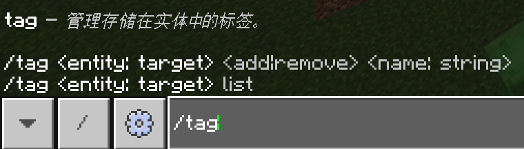
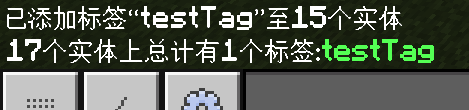
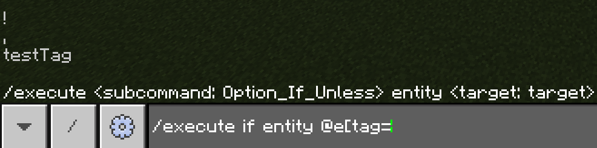

# 2.4.1 标签命令

在实际的工程中，我们总是希望对一些符合我们所给出的条件的玩家进行一些标记，以便让他们执行后续命令。比如，标记存活的玩家、或者标记一个满足了非常苛刻条件的玩家、标记扔出雪球的玩家等等。

## 使用标签的必要性

例如，你可能很早之前就听说过“雪球菜单”——这是一类玩家扔出雪球就对其触发菜单的功能，玩家可能通过抬头低头等操作选择物品。对于这种复杂场景，如何确定哪个玩家扔出了雪球是很重要的。常用的方法是在雪球扔出的一瞬间，使用`@p`确定最近的玩家是扔出雪球的玩家，然后立刻销毁雪球（因为这东西会动，不能让它影响到沿途没有扔雪球的玩家）。对于**这种瞬间的判定和玩家持续的选择之间的矛盾，我们就可以先标记一下哪个玩家使用了雪球**，毕竟这些条件后续将不复存在。

面对这种类似的复杂需求的时候，就难免需要进行标签。何时使用标签，在你的实际工程中视情况而定，当需要用到标签的时候，你自会意识到这一点。

---

## 标记命令`/tag`的语法

我们可以使用`/tag`命令来对特定的实体添加标签，从而进行标记。

```mcfunction title="/tag的语法" showLineNumbers
/tag <实体: target> <add|remove> <名称: string>
/tag <实体: target> list
```



这些语法是很直观的。第一个语法的含义是，**为`实体`添加（`add`）或移除（`remove`）名为`名称`的标签**。第二个语法，则是**在聊天栏返回`实体`的所有标签**。添加这些标签不会对实体的运行有任何影响和变化，它仅仅作为在命令或底层上的标记。

:::tip[实验 2.4-1]

执行命令`/tag @e add testTag`，它将为所有实体添加一个名为`testTag`的标签。你可以观察这些实体是否发生变化。

然后，执行命令`/tag @e list`。

:::

下面是执行结果。你可以看到，执行这条命令对实体的行为并没有任何影响，只是简单地添加了一个标记。



## 目标选择器参数`tag`

既然标签并不会对实体有任何的影响，而只是添加一个标记，那么我们就需要一个方法来检测并选中有特定标签的实体。这就是我们接下来的重点：目标选择器参数`tag`。它的语法为

```mcfunction showLineNumbers
tag=<标签: string>
```

例如，查找所有具有`testTag`标签的实体，就是`@e[tag=testTag]`。



`tag`是支持反选的。例如`@e[tag=!testTag]`就寻找没有`testTag`标签的实体。

:::tip[实验 2.4-2]

现在假设我们有一个需求，对脚下 5 格均为玻璃的玩家执行若干条命令。传统的方法，是使用`execute if block`进行检测并执行命令，例如：

```mcfunction showLineNumbers
execute as @a at @s if block ~~-1~ glass if block ~~-2~ glass if block ~~-3~ glass if block ~~-4~ glass if block ~~-5~ glass run say 1
execute as @a at @s if block ~~-1~ glass if block ~~-2~ glass if block ~~-3~ glass if block ~~-4~ glass if block ~~-5~ glass run say 2
execute as @a at @s if block ~~-1~ glass if block ~~-2~ glass if block ~~-3~ glass if block ~~-4~ glass if block ~~-5~ glass run say 3
execute as @a at @s if block ~~-1~ glass if block ~~-2~ glass if block ~~-3~ glass if block ~~-4~ glass if block ~~-5~ glass run say 4
execute as @a at @s if block ~~-1~ glass if block ~~-2~ glass if block ~~-3~ glass if block ~~-4~ glass if block ~~-5~ glass run say 5
```

然而，我们可以使用标签简化它们。对比上面和下面的命令，你也可以试执行之以体验使用标签的意义，效果是一样的。

```mcfunction showLineNumbers
tag @a remove glassBelow
execute as @a at @s if block ~~-1~ glass if block ~~-2~ glass if block ~~-3~ glass if block ~~-4~ glass if block ~~-5~ glass run tag @s add glassBelow
execute as @a[tag=glassBelow] run say 1
execute as @a[tag=glassBelow] run say 2
execute as @a[tag=glassBelow] run say 3
execute as @a[tag=glassBelow] run say 4
execute as @a[tag=glassBelow] run say 5
```

在这里，我们用`glassBelow`标签来表示玩家脚下有玻璃。

- 第 1 行，用于清除所有玩家的`glassBelow`标签，防止上一次执行这个逻辑时，有玩家脚下为玻璃而现在没有，导致的执行错误。
- 第 2 行，检查脚下为玻璃的玩家并加上`glassBelow`标签，这样有这个标签的玩家就是满足这些条件的玩家，后续就不需要再写这些条件了。
- 第 3\~7 行，则是以前的写法执行的命令。

之后，在模块 2 学习函数的时候，你可以了解到一种更简单的执行方式。

:::

---

## 运用标签的实例

其中一个常用的实例，是检测存活的玩家。你是否还记得我们在第一章时曾讲过，`@a`会选中存活的玩家，而`@e[type=player]`并不会。那么，我们以`isAlive`作为存活玩家的标签，有这个标签代表存活，而没有这个标签则代表处于死亡状态。和实验 2.4-2 类似，我们先进行初始化，无论死活，移除标签：

```mcfunction showLineNumbers
tag @a remove isAlive
```

然后，通过`@e[type=player]`只对存活的玩家添加回标签：

```mcfunction showLineNumbers
tag @e[type=player] add isAlive
```

这两条命令一般通过命令方块或函数循环执行。

---

## 总结与练习

- 标签可以对实体进行一些特殊标记，常常用于一些分类情况或者复杂情形。
- 标签命令的语法有两条：
  - `/tag <实体: target> <add|remove> <名称: string>`：为`实体`添加（`add`）或移除（`remove`）名为`名称`的标签。
  - `/tag <实体: target> list`：在聊天栏返回`实体`的所有标签。
- 使用目标选择器参数`tag`来检测具有特定标签的实体，支持反选。

:::info[练习 2.4-1]

1. 写两条命令，为雪球附近 2 格的一名玩家添加标签`menu`，然后移除雪球。  
   命令 1：\_\_\_\_\_  
   命令 2：\_\_\_\_\_
2. 写 3 条命令，当有玩家死亡后，在(56,43,-79)放置红石块。  
   命令 1：\_\_\_\_\_  
   命令 2：\_\_\_\_\_  
   命令 3：\_\_\_\_\_
3. 写 2 条命令，当玩家拥有`hasPickaxeUpgrade`标签时，给予其一把钻石镐，否则给予一把铁镐。  
   命令 1：\_\_\_\_\_  
   命令 2：\_\_\_\_\_

:::

import GiscusComponent from "/src/components/GiscusComponent/component.js"

<GiscusComponent/>
