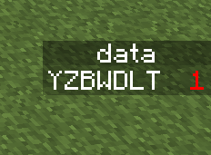
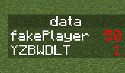

# 2.4.2 记分板

在本节，我们就要开始正式接触记分板了。如你所知，在正规的编程语言中，数值计算是少不了的。实际工程中，无论是地图还是模组，我们也同样总是会需要一些数值计算和状态标记。在命令中，我们就使用**记分板**（Scoreboard）来进行这样的数值计算。

---

## 记分板

**记分板是一种使用记分项（Scoreboard Objective）来追踪特定对象（也称分数持有者，Score Holder）的分数的工具**。在 Wiki 上，如此给出定义：

> 记分板（Scoreboard）系统是一套通过命令操纵的复杂游戏机制。主要为地图作者与服务器运营者准备，记分板可用多种形式追踪、设置并列出玩家及实体的分数。

和标签类似，分数本身并不会对实体的行为产生任何影响，而只是作为一种标记和记录。

### 记分项

要想追踪一个对象的分数，首先我们必须搞清楚一个问题——这个分数需要记在哪里？

可能你会说：那不就是记在记分板上吗？其实这么说似乎也没错，但是现在假如说有两个小游戏，要分别记录同一个玩家在两个小游戏中的不同分数，那么这时候只有一个记分板，就很明显不太够用了。所以我们需要“多个记分板”来记录这种情况的分数，或者更严谨来说，需要多个**记分项**来记录这些分数。

我们假设 Steve 在空岛战争的连胜局数是 3 局，在起床战争的连胜局数是 6 局，那么这种情况下，我们说 Steve 的连胜局数是 3 局就是不准确的——哪个游戏是连胜 3 局呢？

同理地，放在记分板上也是类似的，说 Steve 有 3 分这种说法是没有意义的——你必须指定一个记分项，并说明 Steve 的分数是多少分，例如，Steve 在`a`记分项上的分数是 3 分，这才是完整的说法。

从上面的例子我们看出，**记分项的作用就是用于记录分数的一个“载体”**。并且，我们在谈及分数的时候，就必须要讨论到具体的记分项上面去。

在后面的一节，我们将看到如何显示一个记分板。记分板显示出来的效果大约是下图的效果：

它表示，YZBWDLT 在`data`记分板上的分数为 1 分——**记分项、玩家和分数缺一不可**，它们是描述分数信息的重要内容。

以及，很多服务器都使用记分板来作为信息的承载体（这里显示了一个 Java 版服务器的记分板）：

### 追踪对象

例如在上文中所说的“*Steve 在`a`记分项上的分数是 3 分*”这个例子中，Steve 就是一个追踪对象。换言之，**只要是有分数的，就是追踪对象**。

**所有的实体都可以成为追踪对象**。需要注意的是，实体并非一开始就是具有分数的，只有通过加分、设分等方式先提前设定一个分数，才能被称为追踪对象。**没有分数的实体不能被称为追踪对象**。

哪怕追踪对象指代的玩家不存在，例如你要强行给一个本来不存在的 Alex 添加分数，这种情况也是允许的，它会给一个名为 Alex 的虚拟玩家添加分数。换言之，**追踪对象不必是真实存在的实体**，这样的追踪对象我们常称之为**假名或者虚拟玩家（Fake Player）**。

假名的应用是十分广泛的。因为它不必受到实际实体存在的约束，可以免去很多麻烦，无论是初始化还是分数操作，都是极为简便的。

例如在图中，`fakePlayer`就是一个假名，服务器中并不存在名为 fakePlayer 的玩家，它在`data`记分板上的分数是 50 分。

以后，**在本教程系列中为了表述方便，我们把`objective`记分项上名为`name`的追踪对象的分数`score`，简写为`objective.name`=`score`**。例如，上面的例子中，我们会简记为`data.fakePlayer`=`50`，`data.YZBWDLT`=`1`。

这套记号可以帮助我们用很短的文本就展示出足够的信息，毕竟总是按第一种说法说实在过于冗长：

1. 在`objective`记分项上名为`name`的追踪对象的分数为`score`分
2. `objective.name`=`score`

虽然这并不是*行业惯例*，只是为了简化写法，但是因为记分板到处都要用到，当这套记号出现时，请各位读者要能够知晓，在未特殊说明的情况下，本教程中这是用于表述记分板的分数的。

---

## 总结

- 记分板是一种用于追踪、设置并列出追踪对象的分数的工具。
- 记分板由 3 部分组成：记分项、追踪对象和分值。
  - 记分项用于记录分数，追踪被追踪对象的分数。
  - 追踪对象是拥有分数的实体或玩家。但是这玩家也可以不存在，称之为假名或虚拟玩家。
  - 分值是在特定记分项上，追踪对象的分数。
- 要准确地描述一个被追踪对象的分数，记分项、追踪对象和分数缺一不可。
  - 在本教程系列中，描述`objective`记分项上名为`name`的追踪对象的分数`score`将简写为`objective.name`=`score`。
  - 这并不是*行业惯例*，只是出于简化考虑。

import GiscusComment from "/src/components/comment/giscus.js"

<GiscusComment/>
