# 2.4.4 记分板的追踪对象命令

在学会如何操作一个记分项之后，接下来我们就正式开始学习如何进行分数的操作吧。我们现在来回顾上一节所提到的所有记分板命令：

```mcfunction title="/scoreboard的语法" showLineNumbers {6-11}
/scoreboard objectives add <记分项: string> dummy [显示名称: string]
/scoreboard objectives list
/scoreboard objectives remove <记分项: string>
/scoreboard objectives setdisplay <list|sidebar> [记分项: string] [ascending|descending]
/scoreboard objectives setdisplay belowname [记分项: string]
/scoreboard players <set|add|remove> <玩家: target> <记分项: string> <数值: int>
/scoreboard players list [玩家名称: target]
/scoreboard players operation <目标名称: target> <目标记分项: string> <操作: operator> <选择器: target> <记分项: string>
/scoreboard players random <玩家: target> <记分项: string> <最小值: int> <最大值: int>
/scoreboard players reset <玩家: target> [记分项: string]
/scoreboard players test <玩家: target> <记分项: string> <最小值: wildcard int> [最大值: wildcard int]
```

在这一节我们就学习剩下的 6 条命令。还是类似地，我们关注追踪对象命令的第二个参数，它们的用途如下所示，我们一一解析。

- `add`：添加分数，`remove`：减少分数
- `set`：设置分数
- `reset`：移除分数
- `list`：查询所有追踪对象，或查询分数
- `random`：随机分数
- `test`：检测分数
- `operation`：对分数进行运算操作

---

## 增加或减少分数

我们现在来看`add`和`remove`的语法：

```mcfunction showLineNumbers
/scoreboard players <add|remove> <玩家: target> <记分项: string> <数值: int>
```

它表示，**为`玩家`在`记分项`上的分数加上（`add`）或减去（`remove`）`数值`分**。加减法是我们在小学就学过的一种基本运算，所以理解这条命令对你来说应该不会有任何难度。

:::tip[实验 2.4-9]

接下来的所有实验，我们都要以`data`记分项为基准。请你写两条命令新建一个`data`记分项并将其显示在侧边栏。如果你还没有掌握其用法，请见上一节。

然后，先执行命令`/scoreboard players add @s data 1`，后执行命令`/scoreboard players remove @s data 1`。

:::

我们看到，在执行`/scoreboard players add @s data 1`后，右侧的记分板显示我们的分数为 1 分。

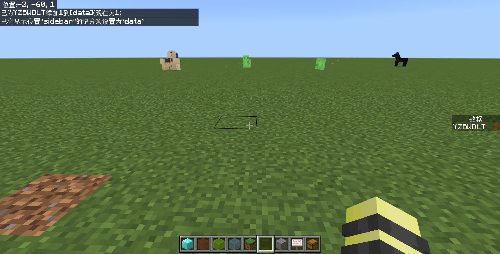

而执行`/scoreboard players remove @s data 1`后，右侧的记分板则显示我们的分数为 0 分。

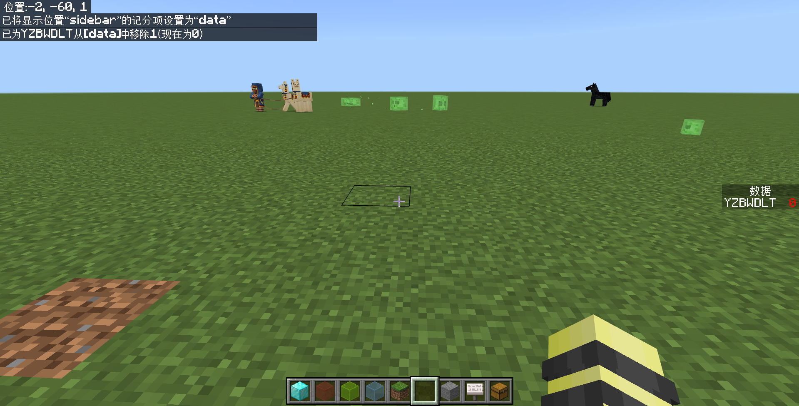

很简单吧？相信你已经理解了这个语法。和`/tag`类似，记分板同样作为一种标记，不会对实体的行为有任何影响。

一般，我们也用这个语法来**为未被追踪的实体设置追踪状态**，方法很简单——为所有玩家加 0 分，即`/scoreboard players add @a ... 0`，这样既不影响已有分数的玩家的分数，同时还能给未被追踪的玩家添加分数。

### 负数可加性

`数值`是可以填为负数的。我们知道，加上一个负数 -a 就相当于减去一个正数 a，所以这两条命令是完全等价的：

- `/scoreboard players add @a data -1`
- `/scoreboard players remove @a data 1`

因此，在基岩版的实际应用中，因为`remove`能做的`add`也能做，所以`remove`的应用极少。

:::note[扩展：`remove`的存在意义是什么？]

既然`remove`就是`add`了一个负值，那 Mojang 为什么还要添加`remove`的语法呢？

*事出反常必有妖*，我们来看看 Java 版`add` -1 的效果如何：

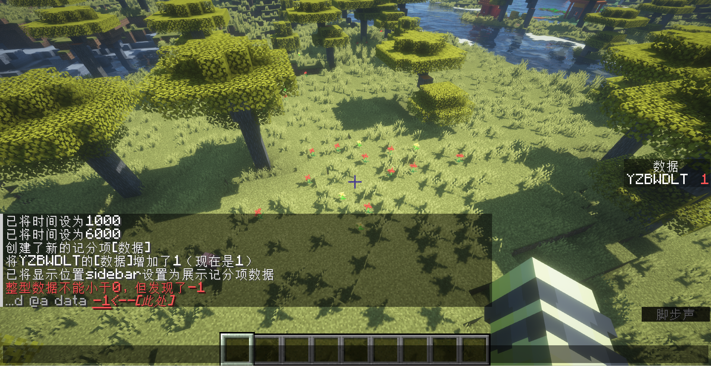

看来这就是 Mojang 添加`remove`语法的理由——因为 Java 版不支持添加负数。当然，如果你不放心，担心未来的基岩版会开倒车禁止填写为负数的话，那么在涉及减分操作时就用`remove`吧。

:::

### 假名

我们在 [2.4.2](./d2_scoreboard) 曾讲过，这里的`玩家`允许为一个*不存在的玩家*。也就是说，你可以为一个任意的名称的玩家加分。

:::tip[实验 2.4-10]

执行命令`/scoreboard players add test data -5`。

:::

我们清楚地看到，世界中并不存在任何一名名字叫做“test”的玩家，然而这条命令还是成功执行，并显示在了侧边栏上。这就是为一个假名添加分数的方法。

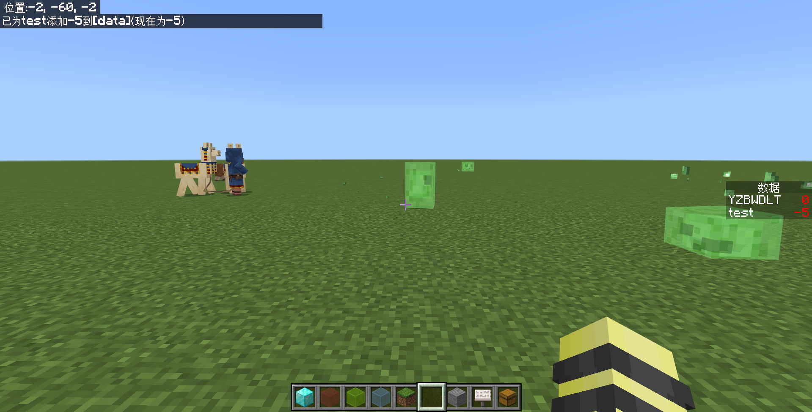

### 针对所有追踪对象的操作

如果要对所有的，包括假名在内的追踪对象添加分数，该怎么办呢？用`@e`吗？但是，仔细想一下就不难发现，`@e`只寻找全部的实体，这些实体是必须真实存在的，而假名对应的“玩家”并不存在于世界之中。如果贸然使用`/scoreboard players add @e data 1`这样的命令的话，反而会导致其他未被追踪的实体进入记分项的追踪范围，这并不是我们想要的结果。

:::tip[实验 2.4-11]

执行命令`/scoreboard players add * data 100`。执行完之后，试思考一下这里`*`的含义。

:::

我们看到，包括假名在内的所有被追踪对象都增加了 100 分，同时其他实体却不受影响。但是，**这么做也同时影响其他记分项上的被追踪对象**，例如在下图中，被`test`记分项追踪的假名也同样受到了影响并显现在`data`中。

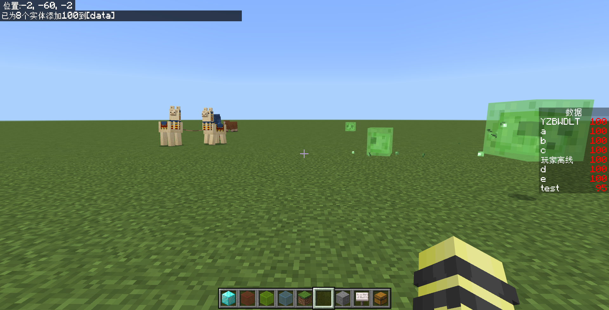

实际情况下，`*`的使用应当慎之又慎，因为它不像目标选择器一样，它没有任何筛选手段。

## 设置分数

如果你能理解增加或减少分数，那么设置分数就更简单了。

```mcfunction showLineNumbers
/scoreboard players set <玩家: target> <记分项: string> <数值: int>
```

它表示，**直接设置`玩家`在`记分项`上的分数为`数值`分**。

:::tip[实验 2.4-12]

执行命令`/scoreboard players set @s data -5`。无论你的分数当前为多少，哪怕处于未追踪状态，它也会将你在`data`上的分数设置为 -5 分。

:::

这条命令不仅简单，而且用途也极为广泛。关于记分板在实际工程运用的实例，我们在下一节统一介绍。

## 移除分数

所谓的移除分数，本质上就是取消追踪对象的被追踪状态。

```mcfunction showLineNumbers
/scoreboard players reset <玩家: target> [记分项: string]
```

它表示，**移除`玩家`在`记分项`上的分数**。如果`记分项`不指定，则移除`玩家`在所有记分项的分数。

:::tip[实验 2.4-13]

执行命令`/scoreboard players set test data 1`。这将指定一个假名分数`data.test`=`1`。

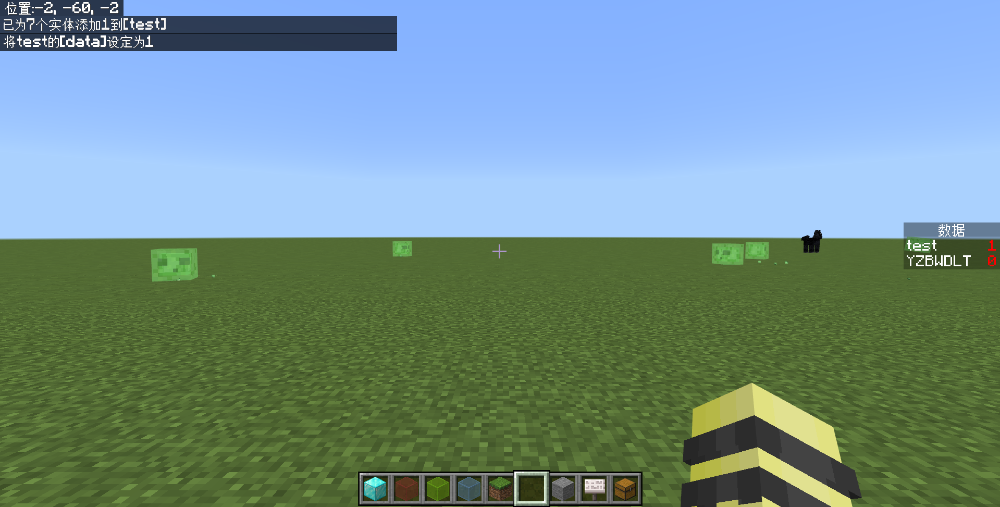

然后，用`/scoreboard players reset test data`移除它的分数。

:::

你会看到，`data.test`从记分板上消失，代表它不再被追踪。在某些情况下，这条命令是比较有用的，例如要抛弃一个变量或者处理“玩家下线”问题时，这些问题我们都会在下一节详细讲讲。

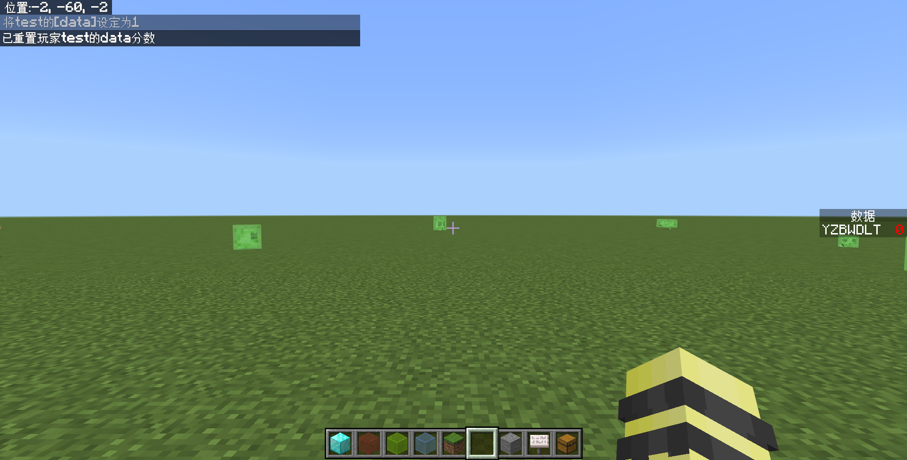

## 随机分数

除了简单的加减法和修改之外，追踪对象命令还能够在特定范围中取随机数。这对于一些需要随机的场景和需求中，是十分重要的。

```mcfunction showLineNumbers
/scoreboard players random <玩家: target> <记分项: string> <最小值: int> <最大值: int>
```

**将`玩家`在`记分项`上的分数在`最小值`和`最大值`之间随机取值，含两端**。

:::tip[实验 2.4-14]

执行命令`/scoreboard players random test data 1 100`。这将指定`data.test`在[1,100]之间随机取值。

*备注：如果你不知道[1,100]是什么意思，它代表 1≤`data.test`≤100。数学上，[a,b]代表两端取值的**区间**。x∈[a,b]的含义等同于 a≤x≤b。后面我们可能经常采用这样的表述，详见[区间 - 百度百科](https://baike.baidu.com/item/区间/1273117)。*

:::

可以看到，这次的执行随机取值为了 56。你也可以多尝试几次这条命令，感受随机取值的特点。

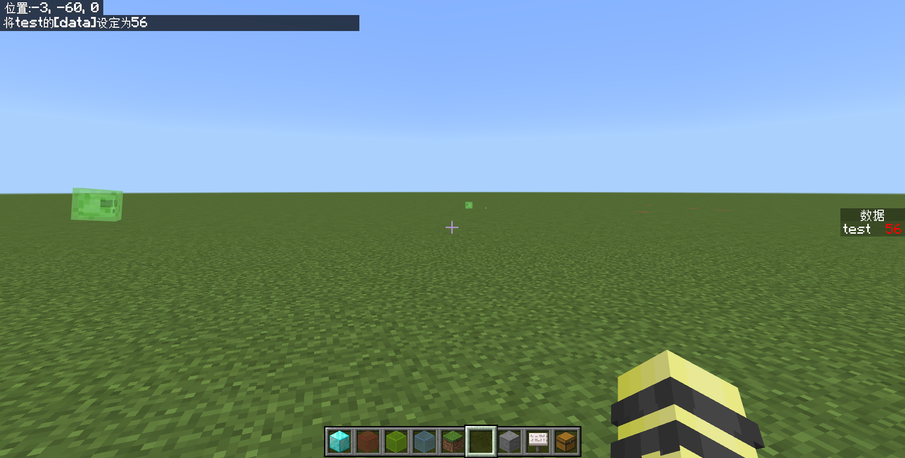

随机取值在许多情况下都拥有它独特的意义，例如幸运方块、抽奖机等需要涉及概率、随机事件的情况。从更底层一点的机制上来说，诸如苦力怕爆炸掉落方块、发射器投掷器发射物品、甚至于我们曾学过的`@r`都需要用到随机。可见，无论是实际工程中还是游戏中，随机都无处不在。

## *检测分数

:::warning[温馨提示]

在这之前，请先注意一点：**本节只专注于记分板的追踪对象命令**。更系统的检测方法，我们会在下一节提及。

:::

你可以使用下面的方法来检测玩家的分数是否在特定范围内。

```mcfunction showLineNumbers
/scoreboard players test <玩家: target> <记分项: string> <最小值: wildcard int> [最大值: wildcard int]
```

**检测`玩家`在`记分项`上的分数是否在`最小值`到`最大值`之间，含两端**。如果检测到在特定范围内，则执行成功，否则就执行失败。但是，现在的实际工程中，早已不再使用这种方法，因为它和`/testfor`等命令一样——只能检测而不能执行命令。这就使其实际用途大打折扣。

:::note[扩展：`wildcard int`类型是什么？]

有一点值得说道说道：`wildcard int`类型是我们不曾遇到的类型。其实没什么神秘的——它只是在`int`类型的基础上增加了一个`*`的支持，称为**通配型整数**，代表任意的整数均可。

在这条命令中，如果最小值写为`*`，就代表最小值取任何值检测通过，换言之，当分数范围在(-∞,`最大值`][^1]时则检测通过。同样地，如果最大值写为`*`，则分数范围在[`最小值`,+∞)[^1]时检测通过。

[^1]: 事实上这里的-∞并不是真正意义上的负无穷。Minecraft 只允许记分板的分值在[-2147483648, 2147483647]之间（2,147,483,648=2的32次方）。但是，实际工程中除了极少数的特殊需求，这个范围已经足够大，很少有能超过这个取值的情况。

示例：

- `/scoreboard players test @s data 1 10`：当`data.@s`（执行者在`data`上的分数）在 1~10 分之间时，检测通过。
- `/scoreboard players test @s data * 10`：当`data.@s`小于等于 10 分时，检测通过。
- `/scoreboard players test @s data 1`：当`data.@s`大于等于 1 分时，检测通过。

:::

## *查询追踪对象及其分数

```mcfunction showLineNumbers
/scoreboard players list [玩家名称: target]
```

**这条命令将返回所有的追踪对象。如果指定了`玩家名称`的话，就专门返回该追踪对象在特定记分项上的分数**。下图是执行了`/scoreboard players list`和`scoreboard players list @s`的结果。

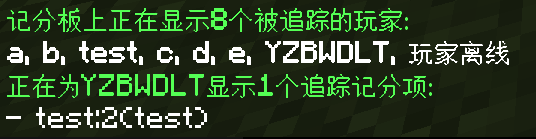

## 对分数进行运算操作

到此为止，我们已经学习了一些修改分数的方法，包括加一个固定值、减一个固定值、直接更改为一个固定值、或者在特定范围内随机。但是，只是加加减减很明显无法满足我们的全部需求——它甚至连乘除都不能解决！实际工程中，在这些要求之外，要实现一些复杂运算，例如乘除的时候，我们就需要用运算语法`/scoreboard players operation`了。

### 编程上的常用运算符

在实际接触这条命令之前，我们认为有必要向你科普一下在计算机领域中，常用的几种运算符。在 Python、JavaScript、C 语言等众多常见的编程语言中，存在这样的一种运算符——**赋值运算符**，它们会先进行运算，然后赋值，格式一般为

```text
(变量1) (赋值运算符) (变量2)
```

在 Minecraft 中，支持的赋值运算符有以下几类。假设我们有两个整数型变量`x=1`和`y=2`。

| 赋值运算符 | 含义 | 示例 |
| :---: | --- | --- |
| `=` | 直接将右边的值赋给左边 | `x=y`，则`x=2`，`y=2` |
| `+=` | 将左边加上右边的值赋给左边 | `x+=y`，等效于`x=x+y`，因此`x=3`（1+2），`y=2` |
| `-=` | 将左边减去右边的值赋给左边 | `x-=y`，等效于`x=x-y`，因此`x=-1`（1-2），`y=2` |
| `*=` | 将左边乘上右边的值赋给左边 | `x*=y`，等效于`x=x*y`，因此`x=2`（1*2），`y=2` |
| `/=` | 将左边除以右边的值赋给左边 | `x/=y`，等效于`x=x/y`，因此`x=0.5`（1/2），`y=2` |
| `%=` | 将左边除以右边的模赋给左边 | `x%=y`，等效于`x=x%y`，因此`x=1`（1/2=0……**1**），`y=2` |

特别地，`/=`可能得到小数，所以在记分板的操作中，这种情况统一向零取整，例如 14/5=2, -14/5=-2。而且我们看到，这种赋值运算符都是不影响右边的数的。

### 运算命令语法

现在，我们就可以来关注这个运算命令了。它的语法是：

```mcfunction showLineNumbers
/scoreboard players operation <目标名称: target> <目标记分项: string> <操作: operator> <选择器: target> <记分项: string>
```

**将`目标名称`在`目标记分项`上的分数和`选择器`在`记分项`上的分数进行`操作`**。

为了表述简便，在下文我们就把`目标名称`在`目标记分项`上的分数记为`obj1.name1`=`score1`；把`选择器`在`记分项`上的分数记为`obj2.name2`=`score2`，以区分左右关系。

`操作`分以下几类，它们是进行复杂运算的一些基础运算方法。

- 赋值运算符：`=`、`+=`、`-=`、`*=`、`/=`、`%=`
- 关系运算符：`<`、`>`
- 对调运算符：`><`

### 运算并赋值

如果`操作`指定为了上面的赋值运算符（`=`、`+=`、`-=`、`*=`、`/=`、`%=`），那么它们的用途和我们一开始科普的那些赋值运算符的用途是一致的。

:::tip[实验 2.4-15]

我们先定义两个分值：`data.x`=`100`,`data.y`=`5`。

```mcfunction
/scoreboard players set x data 100
/scoreboard players set y data 5
```

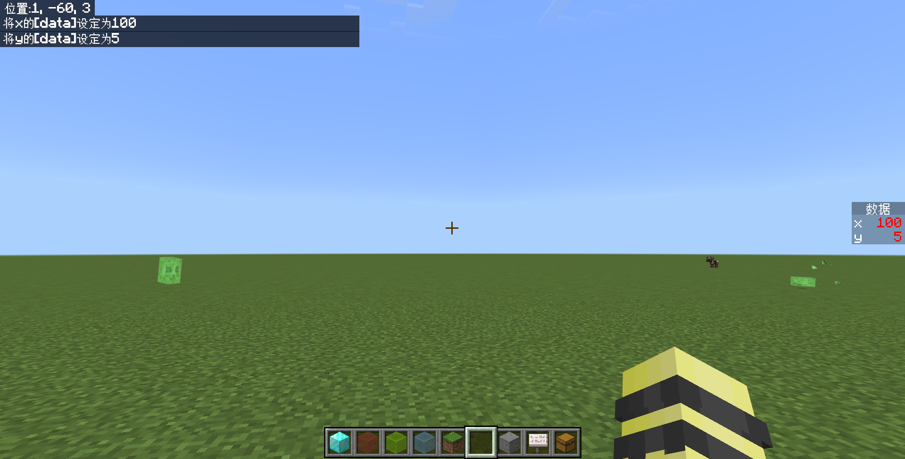

然后，执行下面的每一条命令，执行每一条命令结束后，观察两个变量发生的变化，然后**再执行一次上面的两条命令以复原原有的值**。

1. `/scoreboard players operation x data = y data`
2. `/scoreboard players operation x data += y data`
3. `/scoreboard players operation x data -= y data`
4. `/scoreboard players operation x data *= y data`
5. `/scoreboard players operation x data /= y data`
6. `/scoreboard players operation x data %= y data`

:::

我们依次来解释这些结果：

- `=`进行的操作是`obj1.name1=obj2.name2`，也就是将右边的值赋给左边。在这个例子中，执行命令 1 后就是`data.x=data.y`，所以`data.x`变为 5。

  

- `+=`进行的操作是`obj1.name1+=obj2.name2`，也就是将左加右赋给左边。在这个例子中，执行命令 2 后就是`data.x+=data.y`，所以`data.x`变为 100+5=105。

  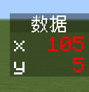

- `-=`进行的操作是`obj1.name1-=obj2.name2`，也就是将左减右赋给左边。在这个例子中，执行命令 3 后就是`data.x-=data.y`，所以`data.x`变为 100-5=95。

  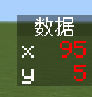

- `*=`进行的操作是`obj1.name1*=obj2.name2`，也就是将左乘右赋给左边。在这个例子中，执行命令 4 后就是`data.x*=data.y`，所以`data.x`变为 100×5=500。

  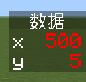

- `/=`进行的操作是`obj1.name1/=obj2.name2`，也就是将左除以右赋给左边。在这个例子中，执行命令 5 后就是`data.x/=data.y`，所以`data.x`变为 100/5=20。
  - 请注意：记分板的值不允许小数，所以**计算得到的小数将会全部向零取整**。例如，如果是 48/5=9.6 ，那么最终得到的结果就是 9。
  - 我们在小学时就学过，除数不能为 0。但是，在基岩版中，除以 0 并不会报错，而是不计算，什么也不会发生。

  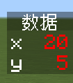

- `%=`进行的操作是`obj1.name1%=obj2.name2`，也就是将左除以右的模赋给左边。在这个例子中，执行命令 6 后就是`data.x%=data.y`，所以`data.x`变为 100/5=20……0 的 0。
  - 如果你忘记了模是什么的话，定义 x÷y=a……b 的 b 为模。例如，48÷5=9……3，那么这里的模就是 3。
  - 和`/=`类似，除以 0 则什么也不会发生。

  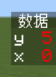

### 比较并赋值

如果`操作`指定为了上面的关系运算符（`>`、`<`），这时候就和编程上的关系运算符不一致了。在编程上，这两个运算符只是用作比较并常常用在`if`等条件语句中，然而在这里，它们还额外被配备了赋值的作用。

:::tip[实验 2.4-16]

和实验 2.4-15 类似，我们先定义两个分值：`data.x`=`100`,`data.y`=`5`。

```mcfunction
/scoreboard players set x data 100
/scoreboard players set y data 5
```

然后，执行下面的每一条命令，执行每一条命令结束后，观察两个变量发生的变化，然后**再执行一次上面的两条命令以复原原有的值**。

1. `/scoreboard players operation x data > y data`
2. `/scoreboard players operation x data < y data`

:::

我们看到，在这个实验中，执行命令 1 后看似什么也没有发生？

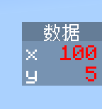

其实不然。实际上，`>`进行的操作是**两值取大赋给左边**，即`obj1.name1=max(obj1.name1,obj2.name2)`，这里的`max(a,b)`是返回 a 和 b 中的最大值，常用于数学和计算机领域。所以，在上面的例子中，执行命令 1 之后，先对`data.x`和`data.y`进行比较，发现 100>5，所以把 100 赋给`data.x`。

同样，`<`进行的操作是**两值取小赋给左边**，即`obj1.name1=min(obj1.name1,obj2.name2)`，这里的`min(a,b)`是返回 a 和 b 中的最小值。在上面的例子中，执行命令 2 之后，对`data.x`和`data.y`比较发现 100\<5，所以把 5 赋给`data.x`。

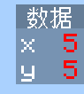

### 对调分数

剩下的运算符`><`，就是用于对调分数的了。

:::tip[实验 2.4-17]

依次执行下面的命令。注意运算符的大于和小于号的位置，不要打成`<>`了。

```mcfunction
/scoreboard players set x data 100
/scoreboard players set y data 5
/scoreboard players operation x data >< y data
```

:::

这条命令的含义，则是相当清晰的，简单地对调分数。它也是唯一一个能影响右边分数`obj2.name2`的操作。

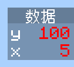

---

## 总结

本节，我们学习了如何操作追踪对象的分数，主要涉及到增加、减少、设定、随机和复杂运算等操作。让我们一起来回顾一下这一节的内容吧！

- 本节所学习的命令如下表：
  - 其中，`玩家`可以指定为假名。用`*`来表示所有被追踪的对象。

| 命令 | 含义 | 备注 |
| --- | --- | --- |
| `/scoreboard players set <玩家: target> <记分项: string> <数值: int>` | 设置`玩家`在`记分项`上的分数为`数值` | |
| `/scoreboard players add <玩家: target> <记分项: string> <数值: int>` | 为`玩家`在`记分项`上的分数加`数值`分 | |
| `/scoreboard players remove <玩家: target> <记分项: string> <数值: int>` | 为`玩家`在`记分项`上的分数减`数值`分 | 等同于`add`一个负的`数值`分 |
| `/scoreboard players random <玩家: target> <记分项: string> <最小值: int> <最大值: int>` | 为`玩家`在`记分项`上的分数在`最小值`到`最大值`之间随机取值 | 含两端 |
| `/scoreboard players operation <目标名称: target> <目标记分项: string> <操作: operator> <选择器: target> <记分项: string>` | 将两个分数进行运算 | 运算符见下表 |
| `/scoreboard players reset <玩家: target> [记分项: string]` | 移除`玩家`在`记分项`上的分数 | 如果不指定`记分项`，移除`玩家`在所有记分项上的分数 |
| `/scoreboard players list [玩家名称: target]` | 查询全部追踪对象，以及返回该追踪对象在所有记分项上的分数 | |
| `/scoreboard players test <玩家: target> <记分项: string> <最小值: wildcard int> [最大值: wildcard int]` | 检测`玩家`在`记分项`上的分数是否在`最小值`到`最大值`之间 | 含两端，`最小值`和`最大值`可用`*`代替，不常用 |

- 在上表中，所有`<操作: operator>`可用的操作符及含义如下表所示：
  - 下表中，分数 1 是`<目标名称: target> <目标记分项: string>`对应的分数（操作符左边），而分数 2 是`<选择器: target> <记分项: string>`对应的分数（操作符右边）。

| 运算符 | 含义 | 示例 | 备注 |
| :---: | --- | --- | --- |
| `=` | 将右边的值赋给左边 | 分数 1 = 分数 2 | |
| `+=` | 将左加右赋给左边 | 分数 1 = 分数 1 + 分数 2 | |
| `-=` | 将左减右赋给左边 | 分数 1 = 分数 1 - 分数 2 | |
| `*=` | 将左乘右赋给左边 | 分数 1 = 分数 1 * 分数 2 | |
| `/=` | 将左除以右赋给左边 | 分数 1 = 分数 1 / 分数 2 | 分数 2 为 0 时，什么也不发生；结果向零取整 |
| `%=` | 将左除以右的模赋给左边 | 分数 1 = 分数 1 % 分数 2 | 分数 2 为 0 时，什么也不发生 |
| `>` | 左右取大赋给左边 | 分数 1 = max(分数 1, 分数 2) | |
| `<` | 左右取小赋给左边 | 分数 1 = min(分数 1, 分数 2) | |
| `><` | 左右分数对调 | 分数 1和分数 2 对调 | 唯一能影响分数 2 的运算 |

## 练习

:::info[练习 2.4-3]

再次强调：在本教程系列中为了表述方便，我们把`objective`记分项上名为`name`的追踪对象的分数`score`，简写为`objective.name`=`score`。

1. 用一条命令实现：若同时检测到存在`isAlive`标签的玩家和存在`isInNether`标签的玩家，则设定`data.advTemp`=`0`。  
   *备注：不是检测到同时存在`isAlive`标签和`isInNether`标签的单个玩家，假如一个玩家有`isAlive`标签，另一个玩家有`isInNether`标签时，也是检测通过。*
2. 用一条命令实现：`time.tick`加 1 分。日后你会看到，如果做到每游戏刻都实现这条命令，便是计时器的基础原理。
3. 你一定听说过在 Minecraft 中，有一种很出名的模组称为幸运方块。我们假设现在有一个幸运方块执行的事件受到`data.luckyBlockEvent`调控，当其被破坏时，可以执行一条命令将此值取随机值。假设这个幸运方块一共有 47 个事件，并且每个事件发生的概率为等概率，写一条命令以取得合适的随机值。
4. 假设现在有一个记分项`isOnline`，用于检测退出重进游戏的玩家。回答下列问题：  
   1. 写一条命令，使所有玩家均处于被`isOnline`记分项追踪的状态，而不影响所有玩家原有的分值。  
   2. 写一条命令，移除所有追踪对象在`isOnline`的分值。  
   3. 写一条命令，使所有玩家在`isOnline`的分值为`1`。  
   4. 若将上面 3 条命令循环执行，你能否分析出那个退出重进玩家在`isOnline`上的分值是多少？如果能够使得这个分值的玩家执行特定命令，这条命令应当在上面 3 条命令中的哪条命令执行后执行？
5. 写一条命令，把`data.x`的值改为它原本的平方。
6. 1. 写一条命令，把`data.x`的值改为它原本的 2 倍。  
   2. 如果改为 10 倍，还能否用一条命令实现？如果不能，用尽可能少的命令数目实现之。允许额外定义变量。  
7. 写两条命令，使`data.c`输出为`data.a`+`data.b`的值，但不得更改`data.a`和`data.b`的值。
8. 写三条命令，要求：  
   1. 当玩家所处维度的(0,-64,0)为基岩，且(0,128,0)为空气时，设置`dimension.@s`=`0`（这里`dimension.@s`指代该玩家在`dimension`记分项上的分数，不考虑距离过远造成的影响）：\_\_\_\_\_
   2. 当玩家脚下为下界岩时，设置`dimension.@s`=`1`：\_\_\_\_\_
   3. 当玩家位于末地时，设置`dimension.@s`=`2`，使用`execute in`和`rm`目标选择器参数解决：\_\_\_\_\_  
   你看出这三条命令是做什么用的了吗？上面 3 条命令都是为了同一个功能服务，但是使用了 3 个不同的原理。你认为哪种原理更好？
9. 写一条命令，若检测到拥有`teamRed`标签的玩家拥有绿宝石时，则调换任意一名拥有`teamRed`标签的玩家在`data`上的分数和任意一名拥有`teamBlue`标签的玩家在`data`上的分数。
10. 写一条命令，将`teamScore.teamRed`的分数减去`bedAmount.teamBlue`。
11. （难度较高，选做）实现函数f(x)=3x³-5x+100/x的功能。换言之，假设输入变量为`data.x`，输出变量`data.y`应为 3 倍的`data.x`的立方减去 5 倍的`data.x`再加上`data.x`分之 100。你可以使用多条命令解决，允许额外定义变量，但不得更改`data.x`原有的值。  
    备注：100/x项可以向零取整。
12. （难度较高，选做）给定一个 3 位或更多位的数字`data.gameId`，输出其个位数`data.singleDigit`，十位数`data.decimalDigit`和百位以上的数`data.hundredthDigit`。你可以使用多条命令解决，允许额外定义变量，但不得更改`data.gameId`原有的值。例：
    1. 对于`data.gameId`=456，输出`data.singleDigit`=6，`data.decimalDigit`=5，`data.hundredthDigit`=4
    2. 对于`data.gameId`=3456，输出`data.singleDigit`=6，`data.decimalDigit`=5，`data.hundredthDigit`=34

:::

<details>

<summary>练习题答案</summary>

1. `/execute if entity @a[tag=isAlive] if entity @a[tag=isInNether] run scoreboard players set advTemp data 0`
2. `/scoreboard players add tick time 1`
3. `/scoreboard players random luckyBlockEvent data 1 47`，只要范围内的数为 47 个即可。如果从 0 开始，应设置为`0 46`。
4. 1. `/scoreboard players add @a isOnline 0`  
   2. `/scoreboard players remove * isOnline`，**注意实际工程中一定要指代`isOnline`，否则将波及到其他记分板**！  
   3. `/scoreboard players set @a isOnline 1`  
   4. 退出重进玩家的`isOnline.@s`=`0`，应在第一条命令执行后执行该命令，因为在后两条命令中，将会影响所有玩家，使筛选出的分值的信息丢失。  
5. `/scoreboard players operation x data *= x data`
6. 1. `/scoreboard players operation x data += x data`  
   2. 不能用一条命令实现。可以用两条命令实现之：  
      1. `/scoreboard players set const10 data 10`
      2. `/scoreboard players operation x data *= const10 data`
7. 1. `/scoreboard players operation c data = a data`
   2. `/scoreboard players operation c data += b data`
8. 1. `/execute as @a at @s if block 0 -64 0 bedrock if block 0 128 0 air run scoreboard players set @s dimension 0`
   2. `/execute as @a at @s if block ~~-1~ netherrack run scoreboard players set @s dimension 1`
   3. `/execute as @a in the_end if entity @s[rm=0] run scoreboard players set @s dimension 2`

   显然，第 3 种原理更好，因为它不需要依靠任何外部条件（即世界中的方块），它们随时可能会被更改导致检测出现偏差。
9. `/execute if entity @a[tag=teamRed,hasitem={item=emerald}] run scoreboard players operation @r[tag=teamRed] data >< @r[tag=teamBlue] data`
10. `/scoreboard players operation teamRed teamScore -= teamBlue bedAmount`
11. 题目中出现了 3 个常数：3、-5和 100，先分别定义之：  

   ```mcfunction showLineNumbers
   /scoreboard players set const3 data 3
   /scoreboard players set const-5 data -5
   /scoreboard players set const100 data 100
   ```

   然后，分别计算第一项、第二项和第三项：

   ```mcfunction showLineNumbers
   /scoreboard players operation firstTerm data = x data
   /scoreboard players operation firstTerm data *= firstTerm data
   /scoreboard players operation firstTerm data *= firstTerm data
   /scoreboard players operation firstTerm data *= const3 data

   /scoreboard players operation secondTerm data = x data
   /scoreboard players operation secondTerm data *= const-5 data

   /scoreboard players operation thirdTerm data = const100 data
   /scoreboard players operation thirdTerm data /= x data
   ```

   最后，分别相加之：

   ```mcfunction showLineNumbers
   /scoreboard players operation y data += firstTerm data
   /scoreboard players operation y data += secondTerm data
   /scoreboard players operation y data += thirdTerm data
   ```

12. 对于这种数值分解，基本思路是：  
    （1）对于个位数，直接用 10 取模，例如 456%10=45……6，很快得到个位数 6；  
    （2）对于十位数，先用 10 整除，例如 456/10=45，然后将这个数用 10 取模，例如 45%10=4……5，得到十位数 5；  
    （3）对于百位以上数，直接用 100 整除，例如 3456/100=34，得到百位以上数字 34；  
    基于此，可以写出如下的代码。  

   ```mcfunction showLineNumbers
   # 定义常量 10 和 100
   /scoreboard players set const10 data 10
   /scoreboard players set const100 data 100
   # 个位数：data.gameId%10
   /scoreboard players operation singleDigit data = gameId data
   /scoreboard players operation singleDigit data %= const10 data
   # 十位数：data.gameId/10%10
   /scoreboard players operation demicalDigit data = gameId data
   /scoreboard players operation demicalDigit data /= const10 data
   /scoreboard players operation demicalDigit data %= const10 data
   # 百位数：data.gameId/100
   /scoreboard players operation hundredthDigit data = gameId data
   /scoreboard players operation hundredthDigit data /= const100 data
   ```

   事实上，这就是《冒险小世界：剑之试炼》使用的数值分解方法。

</details>

import GiscusComponent from "/src/components/GiscusComponent/component.js"

<GiscusComponent/>
