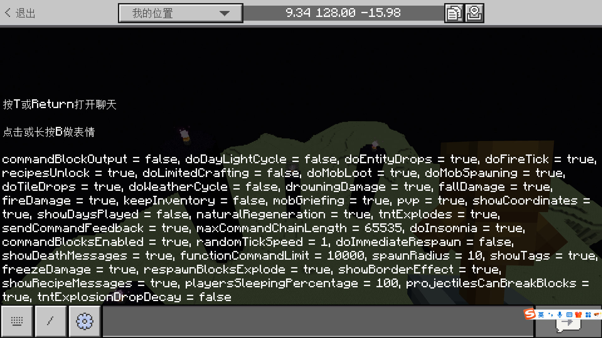
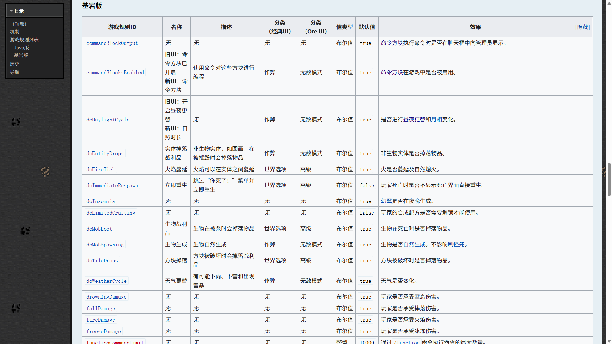
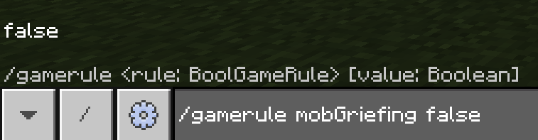
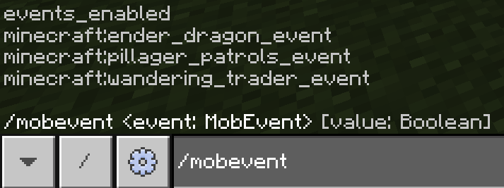
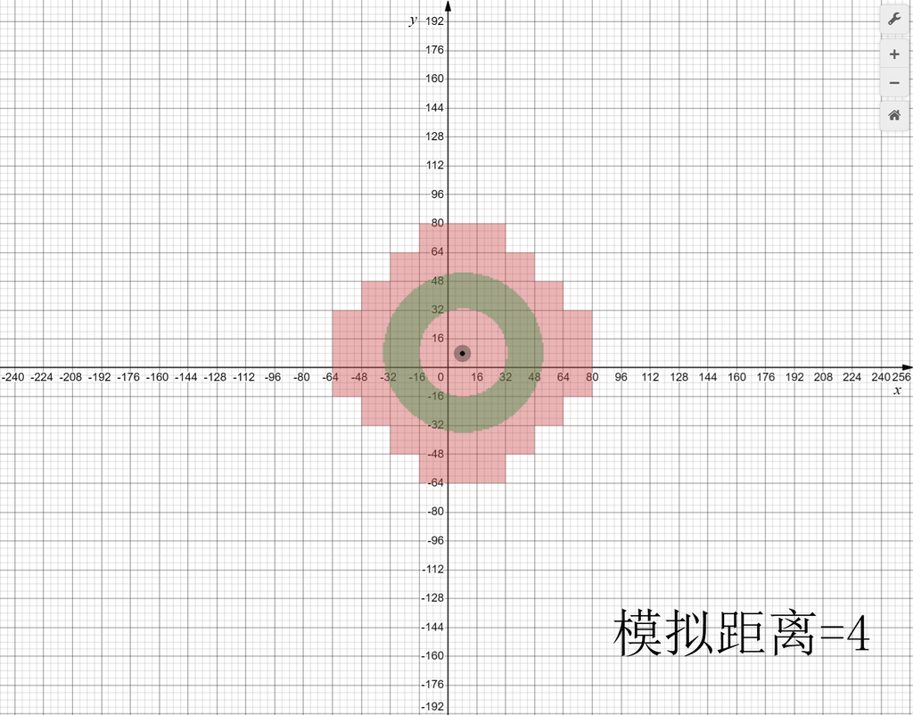
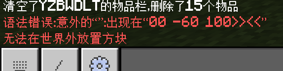
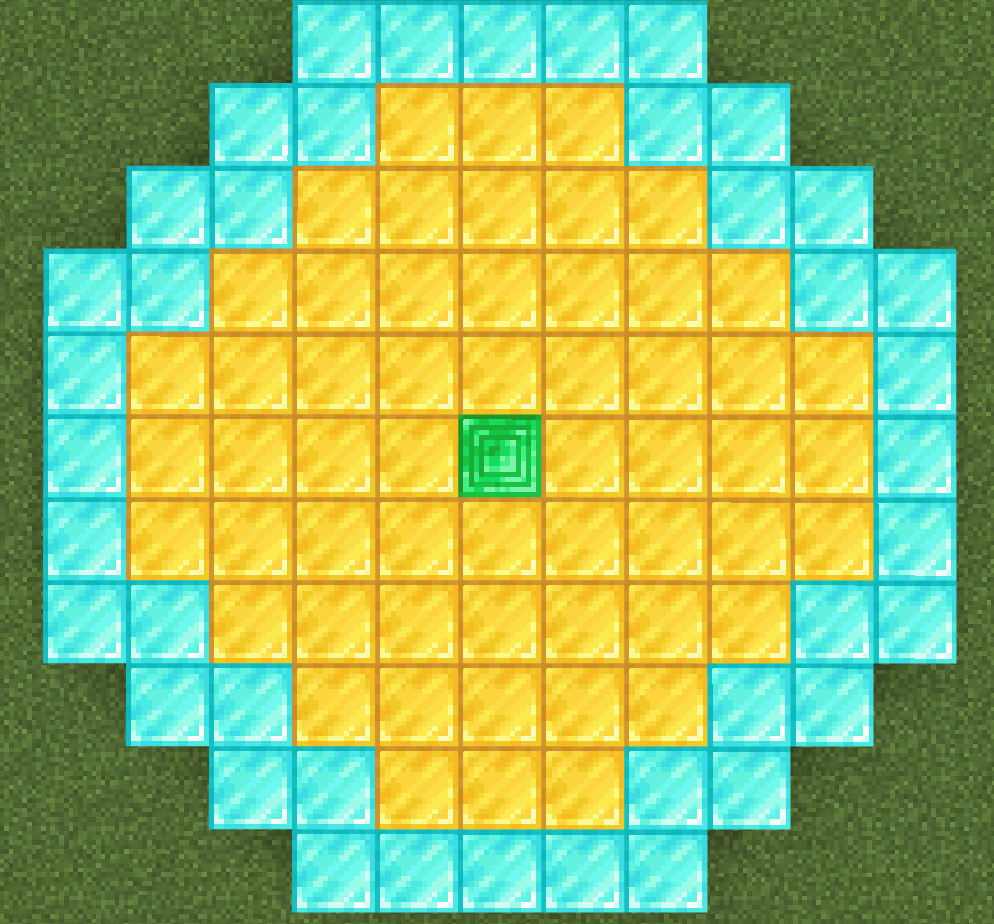

# 2.5 世界操作命令

在经过了 2.3 和 2.4 的两条高难命令`/execute`和`/scoreboard`（是的，其实这两条命令在社区中普遍认为是高难命令，而且通常被认为是最难掌握的命令）的摧残后，相信你已经对命令有了很多更加深刻的认识。理解这两条命令能够帮助你更灵活地执行其他命令。如果说，这两条命令主要是探索命令的深度的话，那么接下来我们要学习的几乎所有命令就是尽可能以知道它们做什么为主，也就是以广度为主了。放心吧，剩下的命令都要简单得多了！

在这一节，我们按照 2.1 的按用途分类方法，主要来聊一些能够改变世界规则和运行方式的命令。

---

## 更改世界规则的命令

世界规则，就是能够影响到世界运行方式的规则。其实，在你创建世界时，你所看到的一些“作弊选项”本质上就是更改了这些规则。


在基岩版中，世界规则主要由两条命令控制：`/gamerule`和`/mobevent`。其中，`/gamerule`是我们这一节的重点内容，而`/mobevent`相对来说，使用频次就要低得多了。

### 更改游戏规则的命令：`/gamerule`

我们先来看`/gamerule`的语法：

```mcfunction title="/gamerule的语法" showLineNumbers
/gamerule
/gamerule <规则: BoolGameRule> [值: Boolean]
/gamerule <规则: IntGameRule> [值: int]
```

我们看到`/gamerule`实际上只有两个用法。

第一种，可以直接写为`/gamerule`，来**查询当前所有的游戏规则**。



我们看到可用的游戏规则还是很多的。第二种，就是语法 2 和 3 的含义：`/gamerule <规则> [值]`，**将`规则`改为`值`，如果`值`未指定就改为查询**。只是规则分为布尔值的规则和整数的规则，所以值也对应地调整为布尔值和整数。

这些游戏规则都有什么用处呢？现在，请你在 [Wiki 给出的所有游戏规则](https://zh.minecraft.wiki/w/游戏规则#基岩版)的表里面查看更具体的细节，Wiki 给出的列表可谓十分详细，无需我们再额外强调什么。这张表怎么看？很简单，我们只需要关注“游戏规则 ID”、“默认值”和“效果”这几列就行。



当然，这个表格中有些规则你可能目前还看不懂，比如`commandBlockOutPut`、或者`functionCommandLimit`等涉及到你还没有接触到的概念，如果看不懂，就直接跳过去，我们在讲到相关内容的时候会简单谈谈这些游戏规则。但是，其中的大多数内容，你应该已经能看懂了。

**要好好看哦~练习的时候会用到的**！

:::tip[实验 2.5-1]

在对所有游戏规则进行简单了解后，执行命令`/gamerule mobGriefing false`，然后点燃一只苦力怕，看看效果如何。



:::

这时，苦力怕将无法对地形造成任何破坏。对于希望防止地图场景遭到破坏的地图而言，这条游戏规则极为重要。

游戏规则是一直处于更新状态的，如果你正在使用旧版本，Wiki 中列出的一些游戏规则可能并不适用于你所用的版本，所以请以你自身使用的版本为准。

有几点是需要额外强调的：

1. 关于各类掉落物的问题，你可以看到有 3 条改变掉落物行为的游戏规则，这 3 条游戏规则常常有开发者搞混，务必注意区分。
   1. `doMobLoot`，**控制生物类型的实体**，比如羊、猪、苦力怕、僵尸等实体被杀死后是否掉落掉落物；
   2. `doEntityDrops`，则**控制非生物类型的实体**，比如画被打掉后是否掉落掉落物；
   3. `doTileDrops`则是**控制方块被挖掘后**是否掉落掉落物。
2. 如你所见，`sendCommandFeedBack`是控制“玩家执行命令的返回信息是否在聊天框中显示”功能的，也就是说**迄今为止我们所学习的所有跟`list`有关的命令，都会受到这条游戏规则的影响**。**它还会影响例如传送位置反馈、游戏模式设置反馈等诸多反馈**，而这些反馈在实际的地图、模组中，我们是不希望玩家看到的，所以**往往都在正式发布地图前关闭这个游戏规则**。但是，在开发过程中，是否启用这个游戏规则则因人而异，有时候一些很重要的信息必须通过`list`类命令查看的时候，就不得不短暂开启这个游戏规则。在后面的教程中，**除必要情况的话我们先不关闭这个游戏规则，但你要知道什么时候该关闭它**。
3. 关于随机刻更改`randomTickSpeed`的问题，它主要**控制一些方块的随机事件发生得有多快**，比如小麦生长、藤蔓蔓延、冰块融化等等。务必注意它只更改方块的随机事件发生的速度，而且**务必注意把这个值调的过高会导致游戏的卡顿**！这个值调整成`0`，就会禁用这些方块的随机事件了。

### 更改世界生物生成事件的命令：`/mobevent`

`/mobevent`可以认为是游戏规则的另一个小分支。类似于幻翼是否能生成的游戏规则`doInsomnia`，这里的几个事件都是控制实体能否自然生成的，**主要控制初次进入末地时是否生成末影龙、是否自然生成流浪商人和是否自然生成灾厄巡逻队，或者同时禁用这三种生成事件**。语法为：

```mcfunction
/mobevent <事件: MobEvent> [值: Boolean]
```

关于这条命令更加详细的解释，参见[命令/mobevent - 中文 Minecraft Wiki](https://zh.minecraft.wiki/w/命令/mobevent)。当然，就算不看 Wiki，实际想要掌握这条命令也是非常简单的，用法和`/gamerule`如出一辙。考虑到这条命令实际并不常用，在这里我们就不再赘述太多了。



:::note[扩展：关于`/mobevent`存在意义的讨论]

其实，显然这些规则本来应该全部归入到`/gamerule`中去，因为幻翼生成就是通过`/gamerule`来控制的。而且，在 Java 版中除了末影龙生成之外，另外两个本来就是使用`/gamerule doPatrolSpawning`和`/gamerule doTraderSpawning`控制的。

所以，不知道出于什么原因使得基岩版单开了一条命令，所以权且接受吧。你是怎么看的呢？

:::

---

## 更改世界常加载区域的命令：`/tickingarea`

你可能已经知道，当你快速跑图的时候，比如使用鞘翅跑图，总能看到世界不断加载的痕迹。Minecraft 的世界几乎是无限大的，如果要时时刻刻加载所有的区块（备注：一个区块是 16×16 的大小），就算上了超算也算不过来。所以显然，为了优化性能，游戏就只能加载那些玩家附近的区块。距离玩家过远的区块就停止加载，或称为**区块卸载**。

然而，不乏有一些命令要进行远距操作，比如放置方块、传送玩家等等，如果操作到未加载的区块上，就会带来很大的麻烦。而且，现在很多开发者仍然使用命令方块进行开发，一旦玩家离开命令方块过远，导致其所在的区块卸载，命令方块就会停止运行，严重影响游戏体验。

:::note[扩展：模拟距离]

在创建世界时，我们可以看到这个世界在一开始就要求我们指定一个模拟距离。很多人并不理解怎么回事，然而你现在可能已经有了一点头绪。是的，**模拟距离控制着玩家附近的范围，有多远的区块会被加载，有多远的生物会不断地运行**。如果你是生电（生存电路）玩家，对这个名词必然不陌生。模拟距离如果不特别指定，一般是 4 个区块，代表玩家所在区块以外延伸的 4 个区块都会加载。下图来源于[模拟距离 - 中文 Minecraft Wiki](https://zh.minecraft.wiki/w/模拟距离)，可能对你理解这个概念有所帮助。



我们再来扩展一点小知识，关于实体的自然生成、自然消失和持久性。

- **自然生成**就是指距离玩家特定距离的位置，可能会突然生成符合条件的实体。我们通常所说的“刷怪”，就是指怪物类型的实体在特定范围自然生成。对于模拟区块为 4 个区块（生电领域普遍简称模拟 4）的情况来说，实体会在距离玩家 24~44 格范围时自然生成，也就是上图中绿色区域所指代的范围，这是很多刷怪塔建立挂机点的基本原理。
- **自然消失**就是指距离玩家特定距离的位置，一些实体可能会突然消失。例如，在生存模式下，如果遇到了很难缠的怪物，就可以跑得离它远一些，这样它就有很大概率会自然消失。对于模拟 4，如果实体在玩家 44 格之外，就一定会直接消失。
- 然而，有一些实体却不能如此。例如盔甲架，你也不会希望放到盔甲架上的盔甲在 44 格之外就突然消失，所以部分生物是具有**持久性**的，也就是无论离得多远都不会自然消失，它们只是不再运行特定的代码，不会消耗过多的性能，而不会像很多实体一样为了优化性能而直接消失。

拉大模拟距离，可能可以解决区块卸载导致命令方块无法运行的问题，然而这么做的效果终究还是太有限，如果地图涉及的范围很大，那么模拟距离无论拉到多大也没用。

:::

接下来我们要学习的命令，就是**保持区块加载所用的常用命令`/tickingarea`**。它的语法为

```mcfunction title="/tickingarea的语法" showLineNumbers
/tickingarea add <起点: x y z> <终点: x y z> [名称: string] [预加载: Boolean]
/tickingarea add circle <中心: x y z> <半径: int> [名称: string] [预加载: Boolean]
/tickingarea list [维度: AllDimensions]
/tickingarea preload <名称: string> [预加载: Boolean]
/tickingarea preload <位置: x y z> [预加载: Boolean]
/tickingarea remove <名称: string>
/tickingarea remove <位置: x y z>
/tickingarea remove_all
```

语法还是挺多的，但我们从“增删改查”的角度可以迅速讲这些命令分解为：

- “增”：`/tickingarea add ...`，显然这就是添加常加载区域的命令。
- “删”：`/tickingarea remove ...`和`/tickingarea remove_all`，这就是移除常加载区域的命令。
- “改”：`/tickingarea preload ...`，这些命令是用来更改常加载区域为预加载区块的。然而，现在理解预加载区块对你来说理解难度可能过高，如果你感兴趣，可以在这篇[附录](../appendix/preload_chunk)中了解到一些细节。预加载区块在实际工程中使用的频率很低，所以本节不再赘述相关事宜。
- “查”：`/tickingarea list ...`，这就是查询所有常加载区域的命令。

我们一个个来说。

### “增”：添加常加载区域

添加常加载区域的命令有两条：

```mcfunction title="/tickingarea add的语法" showLineNumbers
/tickingarea add <起点: x y z> <终点: x y z> [名称: string] [预加载: Boolean]
/tickingarea add circle <中心: x y z> <半径: int> [名称: string] [预加载: Boolean]
```

语法 1，是添加与`起点`和`终点`所组成的长方体区域有重叠部分的所有区块组成的，名为`名称`的常加载区域。例如，如果我们要添加 (0,?,0)~(15,?,15) 的区块为常加载区域，我们就可以用

```mcfunction
/tickingarea add 0 0 0 15 0 15 myTickingarea
```

你可以注意到，我们并没有特别说明这个“?”该填写什么，这是因为**对于加载的区块而言，全高度都是处于加载状态的**，所以事实上在上面的命令中，两个`y`是没有任何用途的，然而类型要求`x y z`，所以`y`还必须指定。所以，对于所有的`y`，我们只需要写为`0`就可以了。

:::tip[实验 2.5-2]

先将你自己传送到(0,-60,0)的位置处，尝试在(100,-60,100)放置一块石头。

然后执行命令`/tickingarea add 100 0 100 200 0 200 test`，再在(100,-60,100)放置石头试试看。

:::

在上面的例子中，如果我们直接在(0,-60,0)放置石头，`/setblock`会提示我们无法在世界外放置方块，这便是区块仍处于卸载状态的缘故。不光是`/setblock`，还有众多涉及方块操作的命令例如`/execute if block`和`/execute if blocks`等，都会在对应位置的区块卸载时执行失败。



我们还看到，添加了常加载区域之后，游戏返回的信息并不是添加了(100,0,100)\~(200,0,200)的常加载区域，而是(96,0,96)\~(207,0,207)。这是因为，每一个区块占地面积都是 16×16，所以区块的边界坐标并不是一个任意的整数，而是 16 的倍数，例如这里 96 就是 16 的倍数，而 x=207 和 x=96 之间相隔的方块数量 207-96+1 也是 16 的倍数。所以这里你就理解，“长方体区域有重叠部分的所有区块”的含义，其实就是含这些坐标的区块。


在添加常加载区域后，再次放置石头就能够执行成功了。

而语法 2，则是以`中心`和`半径`作圆，添加一个圆形的常加载区域。语法 1 则是添加矩形的常加载区域。

需要注意的一点是，每次添加常加载区域，不能超过 100 个区块，否则会执行失败。而对于语法 2 而言，因为半径超过 5 会导致添加的区块数量超过 100，因此`半径`最大为 4。这也就导致我们通常使用添加矩形常加载区域的语法 1，而非实际上添加很少常加载区域的语法 2。



*备注：本图仅为示意*。

常加载区域不仅可以添加在主世界，也同样可以添加其他维度，使这些维度的部分区块处于加载状态。具体原理，可以直接使用`execute in ... run tickingarea add ...`的方法解决。

### “删”：移除常加载区域

移除常加载区域的命令有 3 条：

```mcfunction title="/tickingarea的语法" showLineNumbers
/tickingarea remove <名称: string>
/tickingarea remove <位置: x y z>
/tickingarea remove_all
```

语法 1，是**移除特定`名称`的常加载区域**，也就是你在添加时所指定的那个名称。

语法 2，是**移除含有`位置`的常加载区域**。例如，假如我们在上面的例子中移除了含有(100,0,100)的常加载区域，那么连带地，其他所有常加载区块都会立刻卸载。

语法 3 就很简单了，它直接**移除所有常加载区域**。

这些命令还是很简单的，相信不需要什么实验，你也可以立刻理解。

通常情况下，常加载区域是没必要移除的，但是遇到以下两种情况的时候，你可能就需要移除功能了：

1. 常加载区域的数量已经达到 10 个，**因为常加载区域封顶的数量只能 10 个**。
2. 因为添加常加载区域，导致游戏开始变卡。这是很显然的道理，区块加载必然带来额外的负载，常加载区域面积过大自然会导致卡顿。

所以，谨慎添加常加载区域，不要滥用。

### *“查”：查询常加载区域

```mcfunction title="/tickingarea list的语法" showLineNumbers
/tickingarea list [维度: AllDimensions]
```

往往查询功能通常都不是我们介绍的重点，你只需要知道可以通过这个方法**查询`维度`的常加载区域**就好了。如果不指定维度，它就返回所有常加载区域的信息。

---

## 更改世界难度的命令：`/difficulty`

这条命令应该也无需我们过多介绍，因为它实在是过于直观——就是更改难度。

```mcfunction showLineNumbers title="/difficulty的语法"
/difficulty <难度: Difficulty>
/difficulty <难度: int>
```

**更改游戏难度为`难度`**，就是这么回事。和`/gamemode`类似，它也同样支持整数型和简写，但**我们仍然建议采用全称写法**。下面是对应表格。

| 全称 | 简写 | 数字 |
| :---: | :---: | :---: |
| `peaceful` | `p` | `0` |
| `easy` | `e` | `1` |
| `normal` | `n` | `2` |
| `hard` | `h` | `3` |

例如，更改游戏难度为简单，就使用`/difficulty easy`就可以了。在语法上和功能上完全无需我们过多强调，你很快就能理解。

## 更改世界时间的命令

更改时间的命令，我们在 [2.2](./c2_simple_cmds#调整时间的命令time) 便已经详细地讲过了`/time`。让我们再回忆一下时间命令的语法：

```text title="/time的语法" showLineNumbers
/time add <数值: int>
/time query <day|daytime|gametime>
/time set <数值: int>
/time set <时间: TimeSpec>
```

有印象了吗？如果还没有的话，记得回去看一下哦。

### *设置终为白日：`/alwaysday`

当然了，我们有一条专门启用“终为白日”的命令`/alwaysday`，它还有另一个形式是`/daylock`，二者同义，和`/tp`与`teleport`、`/?`与`/help`的含义类似。它们的语法都是

```text title="/time的语法" showLineNumbers
/alwaysday [是否锁定: Boolean]
/daylock [是否锁定: Boolean]
```

如果`是否锁定`指定为`true`，就启用终为白日，否则就时间流逝。如果`是否锁定`没有指定，就查询是否启用了终为白日。

这（两）条命令之所以没什么意思，主要是因为用下面的两条命令就能完全实现它的效果：

```mcfunction showLineNumbers
gamerule doDayLightCycle false
time set 6000
```

再者，启用终为白日后就不能自由掌控时间了，所以实际工程几乎不用这（两）条命令，从来都是用`/gamerule`和`/time`代替，所以这（两）条命令作简单了解即可。

## 更改世界天气的命令

和更改时间的命令`/time`一样，更改天气的命令`/weather`我们也简单提及过了，如果没有印象还是回到 [2.2](./c2_simple_cmds#调整天气的命令weather) 复习，我们再来看一眼这条命令的语法，就翻篇了。

```text title="/weather的语法" showLineNumbers
/weather <clear|rain|thunder> [时长: int]
/weather query
```

### *切换天气：`/toggledownfall`

在实际工程中，我们更改天气的需求可以说少之又少，大家往往都愿意把时间设置为晴天。但如果真的有需求，`/toggledownfall`就是切换天气的命令。如果为晴天，更改为雨天或雷雨天；如果为雨天或雷雨天，更改为晴天。语法也是极为简单，它甚至不需要传入任何参数：

```text title="/toggledownfall的语法" showLineNumbers
/toggledownfall
```

但还是那句话，因为相关需求极其少见，所以这条命令几乎没什么人用。如果要更改为特定天气，直接用`/weather`就是了。

---

## 总结

本节，我们主要介绍了一些操作世界的命令，尤其是`/gamerule`和`/tickingarea`是需要重点关注的命令。

| 命令 | 含义 | 备注 |
| --- | --- | --- |
| `/gamerule` | 查询所有游戏规则的信息 | |
| `/gamerule <规则: BoolGameRule\|IntGameRule> [值: Boolean\|int]` | 将`规则`设置为`值`，不设定`值`则查询`规则` | |
| `/mobevent <事件: MobEvent> [值: Boolean]` | 将`事件`设置为`值`，不设定`值`则查询`事件` | 与`/gamerule`系出同源 |
| `/tickingarea add <起点: x y z> <终点: x y z> [名称: string] [预加载: Boolean]` | 添加含`起点`到`终点`组成的长方体区域的所有区块为常加载区域，并设定名称为`名称`和预加载信息为`预加载` | `y`无意义，但必须指定 |
| `/tickingarea add circle <中心: x y z> <半径: int> [名称: string] [预加载: Boolean]` | 添加由`中心`和`半径`确定的圆形区块为常加载区域，并设定名称为`名称`和预加载信息为`预加载` | `半径`必须小于等于`4` |
| `/tickingarea remove <名称: string>` | 移除名为`名称`的常加载区域 | |
| `/tickingarea remove <位置: x y z>` | 移除包含`位置`的常加载区域 | |
| `/tickingarea remove_all` | 移除所有常加载区域 | |
| `/difficulty <难度: Difficulty\|int>` | 更改游戏难度为`难度` | |

需要注意，常加载区域最多只能添加 10 个，并且每次添加常加载区域的区块数量不能超过 100 个。

在 2.2 中学习过的命令不再列出；扩展章节的命令（例如`/alwaysday`）亦不列出，仅要求简单了解，不必完全掌握。

## 练习

:::info[练习 2.5]

1. 按照要求写出更改游戏规则的命令。你可以在[Wiki 给出的游戏规则表](https://zh.minecraft.wiki/w/游戏规则#基岩版)中查看这些游戏规则的意义。
   1. 启用死亡不掉落。
   2. 禁止昼夜更替和天气更替
   3. 禁止生物生成和生物破坏方块。
   4. 禁止 TNT 被点燃。
   5. 禁止生物实体（例如羊）掉落物品，但允许非生物实体（例如画）掉落物品。
   6. 启用立即重生。
   7. 启用坐标和游戏天数显示。
   8. 禁止摔落伤害、溺水伤害、火焰伤害，但启用冰冻伤害。
   9. 禁用命令在聊天栏的反馈。
   10. 禁止流浪商人生成。提示：这个用`/mobevent`。
2. 写一条命令，新增一个从(50,?,50)~(90,?,90)的下界常加载区域，名称自定。
3. 写一条命令，当`data.level`=`24`时，更改游戏难度为简单。
4. 写 4 条命令，写一个随机切换天气的逻辑。你可以使用记分板变量`data.weather`。
5. 写 1 条命令，假设该命令每游戏刻执行一次，要求其在现实世界的 10 秒内就迅速流逝游戏内的一天。提示：用`/time add`。

:::

<details>

<summary>练习题答案</summary>

1. 下面的命令，游戏规则写为全小写也是正确的，因为基岩版并不区分大小写。
   1. `/gamerule keepInventory true`
   2. `/gamerule doDayLightCycle false`和`/gamerule doWeatherCycle false`
   3. `/gamerule doMobSpawning false`和`/gamerule mobGriefing false`
   4. `/gamerule tntExplodes false`
   5. `/gamerule doMobLoot false`和`/gamerule doEntityDrops true`
   6. `/gamerule doImmediateRespawn true`
   7. `/gamerule showCoordinates true`和`/gamerule showDaysPlayed true`
   8. `/gamerule fallDamage false`、`/gamerule drowningDamage false`、`/gamerule fireDamage false`和`/gamerule freezeDamage true`
   9. `/gamerule sendCommandFeedBack false`
   10. `/mobevent minecraft:wandering_trader_event false`
2. `/execute in nether run tickingarea add 50 0 50 90 0 90 example`
3. `/execute if score level data matches 24 run difficulty easy`
4. 1. `/scoreboard players random weather data 1 3`
   2. `/execute if score weather data matches 1 run weather clear`
   3. `/execute if score weather data matches 2 run weather rain`
   4. `/execute if score weather data matches 3 run weather thunder`
5. `/time add 120`，因为一天为 24000 游戏刻，10 秒为 200 游戏刻，所以每一个游戏刻都要让世界时间加快 24000/200=120 游戏刻。

</details>

import GiscusComponent from "/src/components/GiscusComponent/component.js"

<GiscusComponent/>
