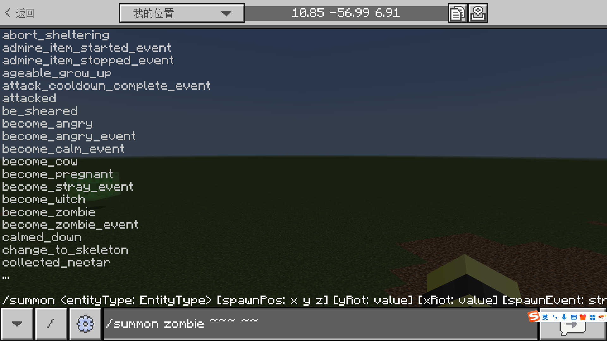
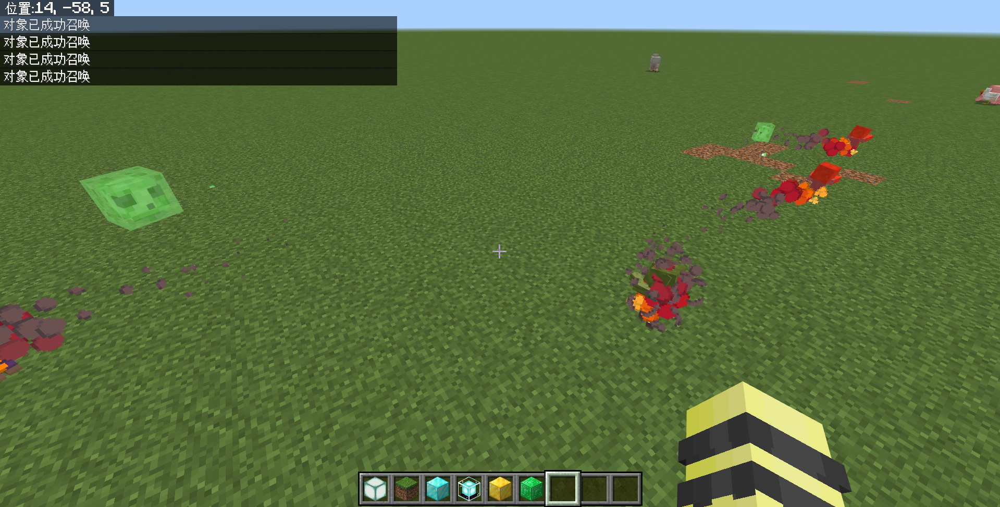

# 2.6.1 “增”“删”实体：生成与清除实体

从这一节开始，我们就要学习如何对实体进行操作。首先，从“增删改查”的角度来讲，新增一个实体和移除一个实体的方法我们已经很熟悉了，它们分别是`/summon`和`/kill`。其中，`/kill`在 [2.2](../c2_simple_cmds#清除实体的命令kill) 中已经讲得比较清晰，这一节便不再过多赘述，但我们还是简单回顾一下它的语法：

```mcfunction title="/kill的语法" showLineNumbers
/kill [目标: target]
```

而对于`/summon`，我们在第一章的时候讲过它的语法：

```mcfunction title="/summon的基础语法" showLineNumbers
/summon <实体: EntityType>
```

然而，当时为了便于读者理解基础概念，故没有过于深入地将全部语法全盘托出。在这一节，我们就来看看`/summon`的全貌。

## `/summon`的全部语法

现在我们来看看召唤生物的全部语法。一共有 4 条：

```mcfunction showLineNumbers title="/summon的语法"
/summon <实体: EntityType> <名称: string> [生成位置: x y z]
/summon <实体: EntityType> [生成位置: x y z] [y旋转: value] [x旋转: value] [生成事件: string] [名称: string]
/summon <实体: EntityType> [生成位置: x y z] facing <面向实体: target> [生成事件: string] [名称: string]
/summon <实体: EntityType> [生成位置: x y z] facing <面向位置: x y z> [生成事件: string] [名称: string]
```

相信在学习了这么多命令命令之后，你对这些参数已经不再陌生了。光是看到参数的描述和类型，你也能一眼看出它们的含义。

- `生成位置: x y z`，很显然，指定这个参数就是指定实体生成的实际位置。
- `名称: string`，这个参数，就是指定实体生成时的名称。也就是说，你可以不依靠命名牌就生成一个特定名称的实体出来！
- `[y旋转: value] [x旋转: value]`，这两个参数我们当时介绍`/tp`命令的时候有讲过，这是旋转角度，使用这两个值就指定了实体生成时的朝向。
- `facing <面向实体|面向位置>`，这两个参数在`/tp`中我们也遇到过，为面向特定的实体或特定的位置，同样地，这里面向的实体只能为 1 个。
- `生成事件: string`，……这个是什么？我们先不管，但接下来我们可以先总结出这 4 条命令的含义：

**以特定朝向在`生成位置`生成名为`名称`的`实体`，并在生成时触发`生成事件`**。

:::tip[实验 2.6-1]

执行`/summon armor_stand "a"`。

:::info[思考 2.6-1]

你能看出这是使用了哪个语法吗？试分析这条命令的含义。

<details>

<summary>答案（思考过后再翻看哦~）</summary>

显然，这是使用了第一个语法`/summon <实体: EntityType> <名称: string> [生成位置: x y z]`，因为其他命令的第二个参数类型都是`x y z`，而`"a"`是一个`string`。

所以，这条命令是，在执行者的位置生成一个名为“a”的盔甲架。

</details>

:::

:::note[扩展：`/summon`的旧语法]

事实上，除了`/execute`以外，`/summon`也是受到更新影响比较大的一条命令，它也同样有新语法和旧语法之分。然而，`/summon`的新语法和旧语法差距并不大，旧语法无非也就是不支持事先指定朝向而已：

```mcfunction showLineNumbers title="/summon的旧语法"
/summon <实体: EntityType> <名称: string> [生成位置: x y z]
/summon <实体: EntityType> [生成位置: x y z] [生成事件: string] [名称: string]
```

然而，因为第三个参数由`string`类型转变为了`value`类型或字面量`facing`，这就导致直接套用旧语法的话会在新语法中报错，因此在刚更新时也让不少开发者感到头疼。

:::

### 生成事件

生成事件，简单来说就是实体所内置的可以触发的事件，这些事件控制着生物的基本属性，比如僵尸的大小、动物的成长、骷髅的转变、苦力怕的爆炸等等。这里的生成事件和`/mobevent`的那个生成实体的事件是不太一样的，请注意区分。

然而，关于生成事件的基本原理，目前我们没有办法给出，因为这涉及到附加包的实体定义的原理，在模块 2 你才能看到它的本质。我们可以简单告诉你的是，每个实体都拥有其自己独有的生成事件，而下图中所列出来的是所有实体可用的生成事件，所以并不是所有的生成事件都是可用的。例如，如果你要强行给僵尸添加一个`calmed_down`事件，企图让僵尸不攻击其他生物，这是不可能实现的，因为僵尸的实体定义并没有这个事件，所以写为`calmed_down`并没有任何效果。



然而，总是有那么几个事件，是大量实体可用甚至是通用的。[Wiki 已经为我们列出了一张表格](https://zh.minecraft.wiki/w/生成事件)，是所有实体对应的生成事件。我们看到，这么几个组件是大量实体都在使用的：

- `minecraft:entity_spawned`，几乎所有实体都在使用，这是实体刚生成时所触发的事件。我们看到`/summon`所有的命令的`生成事件`参数都是可选参数。不严谨一点来说，如果不指定的话，事实上**该参数的默认值就是`minecraft:entity_spawned`**。
- `minecraft:entity_born`，这是实体经过繁殖后，刚出生时所触发的事件。显然，广泛用于可繁殖的动物身上。
- `minecraft:ageable_grow_up`，这是实体从幼年状态成长为成年时所触发的事件。广泛用于可成长的动物身上。

:::tip[实验 2.6-2]

执行`/summon zombie ~~~~~ minecraft:as_baby`，可以多执行几次。

:::

我们看到，使用`minecraft:as_baby`之后，生成的便全是小僵尸。有需要时，你可以参照[生成事件 - 中文 Minecraft Wiki](https://zh.minecraft.wiki/w/生成事件)给出的表格，直接生成一些特殊的实体。



此外，还需要注意一点：**虽然`生成事件: string`可以任意填写，哪怕写为所有实体都没有的生成事件（比如`*`）也能成功执行，但是如果调用了实体所不支持的事件，就会被认为是调用了一个无效的事件**。在这种情况下，**`minecraft:entity_spawned`也不会被调用，这会导致一系列的实体运行的问题**。比如，如果使用`/summon zombie ~~~~~ *`的话，你会发现僵尸的速度变得异常地快，这就是使用了无效的生成事件`*`所导致的未调用`minecraft:entity_spawned`生成事件的后果。

---

## 总结

本节我们重点学习了`/summon`的其他语法，了解了如何使用`/summon`生成特定名称、特定位置和特定朝向的实体，并能够通过调用生成事件来改变实体的属性。现在让我们一起来回顾一下它的语法：

```mcfunction showLineNumbers title="/summon的语法"
/summon <实体: EntityType> <名称: string> [生成位置: x y z]
/summon <实体: EntityType> [生成位置: x y z] [y旋转: value] [x旋转: value] [生成事件: string] [名称: string]
/summon <实体: EntityType> [生成位置: x y z] facing <面向实体: target> [生成事件: string] [名称: string]
/summon <实体: EntityType> [生成位置: x y z] facing <面向位置: x y z> [生成事件: string] [名称: string]
```

其中，生成事件的表可以在 [Wiki](https://zh.minecraft.wiki/w/生成事件) 中找到。`[生成事件: string]`的默认值是`minecraft:entity_spawned`，允许调用实体不支持的事件，但这也会导致`minecraft:entity_spawned`不被调用，使实体的运行出现问题。

## 练习

:::info[练习 2.6-1]

1. 在(0,0,0)处生成一个名为playerAmount的盔甲架，并使用该盔甲架在`data`上的分数记录玩家人数。和假名进行对比，你认为哪种方法更加便捷？
2. 使用命令直接生成一名图书管理员（Librarian）。
3. 使用命令生成一个因爆炸而产生的 TNT。你会发现这种 TNT 的引线时间要短得多。
4. 写两条命令，在名为`spawner`的盔甲架处生成 1 只苦力怕，然后清除`spawner`。

:::

<details>

<summary>练习题答案</summary>

1. 命令如下。高亮部分为假名的写法。和假名对比，还是假名更加便捷一些，然而如果要调用分数的时候，则将数据存储在实体上可能会具有独特的优势。

```mcfunction showLineNumbers {4-5}
/summon armor_stand playerAmount 0 0 0
/scoreboard players set @e[name=playerAmount,type=armor_stand] data 0
/execute as @a run scoreboard players add @e[name=playerAmount,type=armor_stand] data 1
/scoreboard players set playerAmount data 0
/execute as @a run scoreboard players add playerAmount data 1
```

2. `/summon villager ~~~~~ minecraft:spawn_librarian`
3. `/summon tnt ~~~~~ from_explosion`
4. 命令如下。

```mcfunction showLineNumbers
/execute as @e[name=spawner,type=armor_stand] at @s run summon creeper ~~~
/kill @e[name=spawner]
```

</details>

import GiscusComponent from "/src/components/GiscusComponent/component.js"

<GiscusComponent/>
