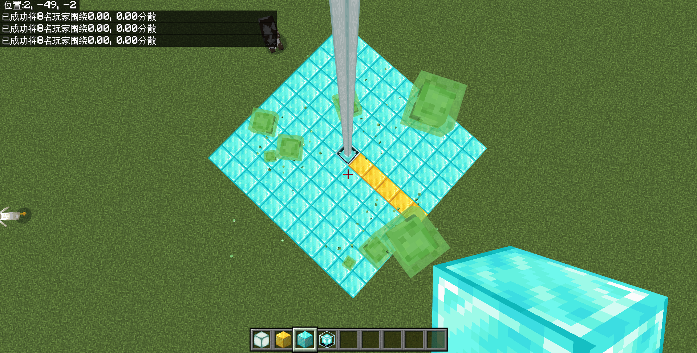
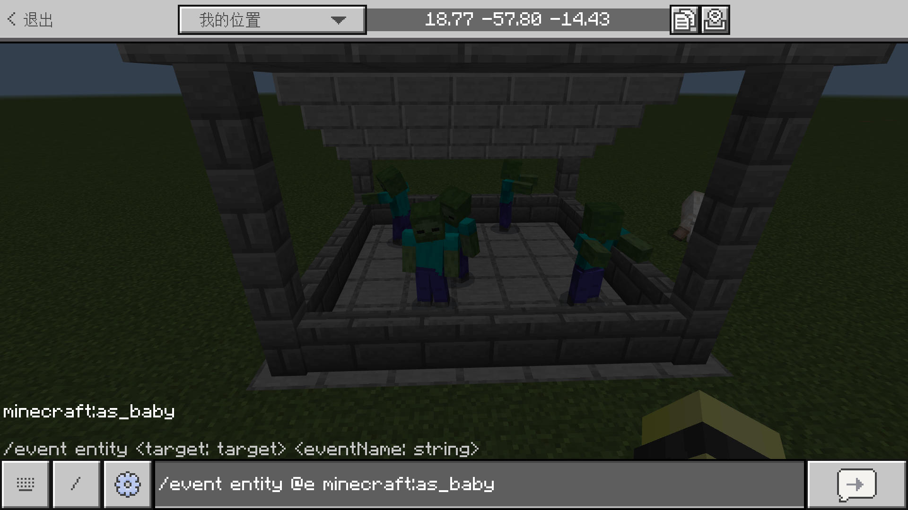
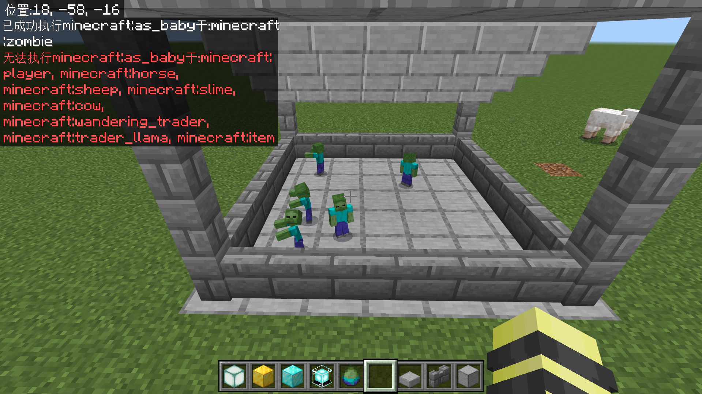
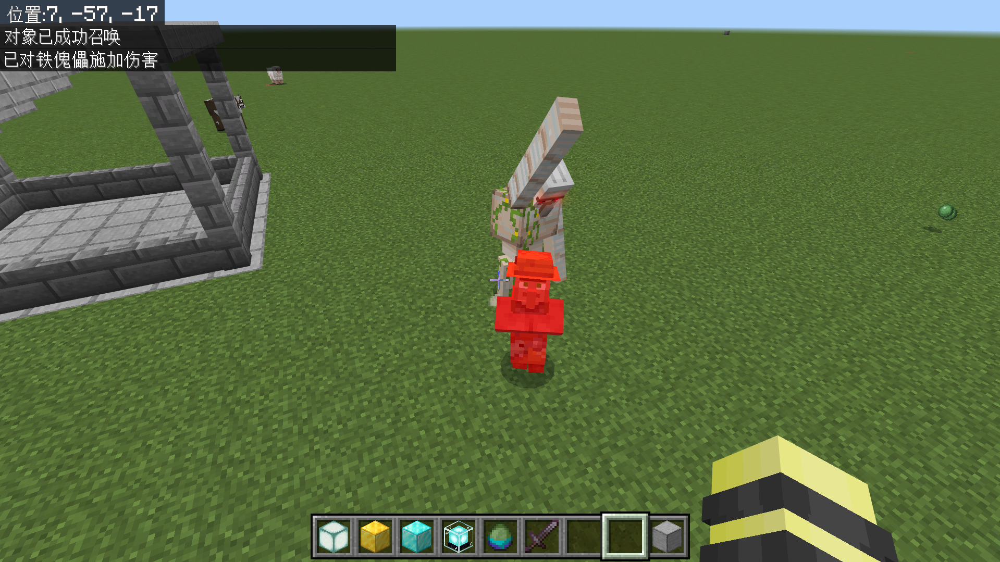

# 2.6.2 “改”实体：位置、朝向与属性操作

“增删改查”的思想还在发力——上一节我们知道了增删实体分别代表`/summon`和`/kill`，查其实无非也就是`/execute if entity`。这一节，我们就要学习如何“改”实体。实体有什么好改的呢？其实很多，比如实体的位置、朝向、血量、速度、状态效果等等。这一节，我们就来学习更改实体的属性的命令。

---

## 更改实体位置

在 [2.2](../c2_simple_cmds) 中，我们曾经学习过更改实体位置和朝向的命令`/tp`。现在让我们来简单回顾一下`/tp`的语法。

```mcfunction title="/tp的语法" showLineNumbers
/tp <位置: target>
/tp <位置: x y z> [检查卡墙: Boolean]
/tp <位置: x y z> [y旋转: value] [x旋转: value] [检查卡墙: Boolean]
/tp <位置: x y z> facing <面向实体: target> [检查卡墙: Boolean]
/tp <位置: x y z> facing <面向坐标: x y z> [检查卡墙: Boolean]
/tp <目标: target> <位置: target> [检查卡墙: Boolean]
/tp <目标: target> <位置: x y z> [检查卡墙: Boolean]
/tp <目标: target> <位置: x y z> [y旋转: value] [x旋转: value] [检查卡墙: Boolean]
/tp <目标: target> <位置: x y z> facing <面向实体: target> [检查卡墙: Boolean]
/tp <目标: target> <位置: x y z> facing <面向坐标: x y z> [检查卡墙: Boolean]
```

如果没有印象的话，请回到 [2.2](../c2_simple_cmds) 重新复习一下这些命令。

### *随机传送玩家：`/spreadplayers`

然而，除了`/tp`之外，我们还有一条可以随机传送玩家的命令：`/spreadplayers`。它的语法为

```mcfunction title="/spreadplayers的语法" showLineNumbers
spreadplayers <x: value> <z: value> <扩散间距: float> <最大范围: float> <目标: target> [最高高度: value]
```

:::warning[版本适用性警告]

`[最高高度: value]`参数仅限 1.21.10+ 版本可用。

:::

将所有`目标`在以中心为(`x`,?,`z`)，半边长为`最大范围`的正方形内随机扩散到地表，并且其最小间距为`扩散间距`，最高高度为`最高高度`。

例如，将所有史莱姆传送到最大范围为 5 的地表上，就是在如图所示的范围内扩散。因为只传送到地表，所以该命令无需指定`y`值。

```mcfunction
/spreadplayers 0 0 0 5 @e[type=slime]
```



该命令在有特殊需求的时候，是可以派上用场的，比如如果要做一个吃鸡游戏，在场地内随机投放一个箱子，就可以用该命令确定一个位置。但总归是传送到一个特定位置的需求更多，所以这条命令也是一条不太常用的命令，仅作简单了解即可，有需求的时候读者可以阅读[命令/spreadplayers - 中文 Minecraft Wiki](https://zh.minecraft.wiki/w/命令/spreadplayers) 来更系统地学习。

## 触发生成事件：`/event`

还记得我们上一节曾讲过的生成事件吗？其实，不光是生成的那个瞬间可以触发这些生成事件，在生成之后也可以触发，这就是`/event`的作用。它的语法是：

```mcfunction title="/event的语法" showLineNumbers
/event entity <目标: target> <生成事件: string>
```

**使`目标`触发`生成事件`**。

:::tip[实验 2.6-3]

为几个成年僵尸搭一个小棚，然后执行命令`/event entity @e minecraft:as_baby`。



备注：不用加`type`，我们稍后分析这条命令。

:::

下图是我们的执行结果。



我们看到，如果施加一个无效的生成事件，那么命令就会执行失败。所以，`@e`最终还是只对僵尸有效。而且，我们还看到本来是成年的僵尸现在全部变成了幼年僵尸，这便是`/event`强行更改属性的功效了。

## 添加状态效果：`/effect`

我们都知道 Minecraft 存在着状态效果（药效）的设定，并且喝下药水可以提供状态效果。很常见的一个需求是添加夜视效果，因为不乏有开发者需要在比较黑暗的地方进行调试，他们需要看清周围的环境，所以通常会喝下夜视药水。然而，夜视药水最长也仅仅 8 分钟的时间，多多少少会带来一些不便，这时候我们就需要`/effect`了。它负责添加状态效果，语法

```mcfunction title="/effect的语法" showLineNumbers
/effect <实体: target> <状态效果: Effect> [秒数: int] [放大倍率: int] [隐藏粒子: Boolean]
/effect <实体: target> <状态效果: Effect> infinite [放大倍率: int] [隐藏粒子: Boolean]
/effect <实体: target> clear [状态效果: Effect]
```

其中，语法 1 和语法 2 是一致的，都是**给予`实体` `秒数`秒（可以是无限时长`infinite`）、`放大倍率`+1 级的`状态效果`。可隐藏药效粒子**。语法 3 则是**移除`实体`的`状态效果`**。

`状态效果`对应的`Effect`是一个新的类型，但也没太多可说的。你可以在[基岩版数据值 - 中文 Minecraft Wiki](https://zh.minecraft.wiki/w/基岩版数据值#状态效果ID) 中看到所有这些 ID。

:::tip[实验 2.6-4]

执行命令`/effect @a jump_boost 30 19 true`，给你自己添加一个 20 级的跳跃提升，看看你能跳多高吧！

:::

你已经注意到，我们上面虽然说是添加 20 级的跳跃提升，但是实际写的却是`19`。是的，**这是一个常错点，很多人误认为`[amplifier: int]`（即`[放大倍率: int]`）直接指代的等级，其实并非如此**。“amplifier”的意思是放大，它和等级的确是有关系的，但是不完全等效，它是基于 1 级去放大效果。例如，如果这个值设定为`0`，那么就添加 1 级的状态效果，代表其没有放大状态效果；如果这个值设定为`2`，那么就添加 3 级的状态效果，代表其基于 1 级的状态效果又放大了 2 级。甚至，哪怕很多开发者就算已经非常清楚这点，却还是会有失误写为欲添加等级的情况，这是要格外注意的。

虽然参数描述上写设定时长的参数为`秒数`，然而还是有特例的存在。那些瞬时的药效，也就是瞬间伤害、瞬间治疗、饱和三个药效，对于它们而言，这里的`秒数`的实际单位是游戏刻。所以，如果你使用`/effect @a instant_health 20`，它不会持续 20 秒添加瞬间治疗，而只会持续 1 秒。

至于隐藏药效粒子的问题，则没什么好说的，做一个小实验马上就能得出结论，我们这里便不再赘述了。

:::note[扩展：`/effect`的新语法]

对，其实`/effect`也有新语法。在 Java 版 1.13（对，又是这个版本）中，`/effect`的语法被改为下面两条：

```mcfunction title="Java版的/effect语法" showLineNumbers
/effect give <targets> <effect> [<seconds>] [<amplifier>] [<hideParticles>]
/effect clear [<targets>] [<effect>]
```

它们清楚地被分为给予和移除两个用法。而在基岩版 1.21.40 版本以前，基岩版的`/effect`则长成这个样子：

```mcfunction title="基岩版1.21.40之前/effect的语法" showLineNumbers
/effect <实体: target> <状态效果: Effect> [秒数: int] [放大倍率: int] [隐藏粒子: Boolean]
/effect <实体: target> clear
```

相比于我们现在所介绍的语法，它不支持添加无限时长，所以以前往往都是使用一个非常长的状态效果代替的；而且，也不支持清除特定状态效果，使用`clear`用法就代表着全盘清除。而且，它和 Java 版还有一个区别就是，`clear`和`实体`的位置是颠倒过来的。

基岩版 1.21.40 更新之后，可以添加无限时长的效果和清除特定效果了。但是在更新之前我们其实也能达到清除特定效果的方法，那就是：加一个 0 秒的更高级的效果！例如，为了移除 I 级的隐身，而不影响其他效果，我们可以直接使用

```mcfunction
/effect @a invisibility 0 2 true
```

来移除隐身药效，这个原理则是巧妙地利用了状态效果的机制。

:::

## 施加特定伤害：`/damage`

刚刚我们讲到实体的血量也是其基本属性之一，然而，基岩版并不存在一条命令可以直接修改实体的血量。不过，虽然不能直接使用命令更改实体的血量，却可以给满血的实体施加特定伤害来间接地限定其血量。`/damage`命令就是这样的命令，可以施加一个特定类型的伤害。其语法为：

```mcfunction
/damage <目标: target> <伤害值: int> <成因: DamageCause> entity <伤害者: target>
/damage <目标: target> <伤害值: int> [成因: DamageCause]
```

它表示，**给`目标`施加伤害类型为`成因`的`伤害值`点伤害，可以指定施加伤害的实体为`伤害者`**。显然这两条语法是同一个作用。让我们来做一个有趣的实验吧！

:::tip[实验 2.6-5]

召唤一个村民和一个铁傀儡，依次执行下面的命令，看它们反目成仇吧！

```mcfunction showLineNumbers
/summon villager
/summon iron_golem
/damage @e[type=iron_golem] 0 entity_attack entity @e[type=villager]
```

:::

哇哦！铁傀儡开始攻击村民了，倒反天罡！哪怕施加的伤害是 0 点，铁傀儡也是反过来攻击了村民，这就是铁傀儡的实体定义所决定的。



关于`成因`所对应的伤害类型，你可以查看[伤害类型 - 中文 Minecraft Wiki](https://zh.minecraft.wiki/w/伤害类型#基岩版)。某种意义上，你可以认为`/kill`的本质，是施加了类型为`self_destruct`的巨大数值的伤害。其他的参数，相信已经无需我们多言了。

## *改变骑乘关系：`/ride`

此外，命令还能够改变生物的骑乘关系，这就是`/ride`。它拥有 5 个用法。然而，**因为`/ride`可以指定的坐骑只局限于能被骑乘的实体**，例如上了鞍的猪、矿车、马等等；而且**这些坐骑所能限定的乘客也是严格限制的**，例如僵尸能骑鸡，而玩家不能；以及**这条命令对乘客数量和坐骑数量常常有严格限制**，所以执行命令经常会执行失败。因此这就直接导致 **`/ride`的局限性极大，在使用时常常是出于特殊需求考虑的**，比如直接召唤鸡骑士，或者取消玩家的骑乘关系等，想要用`/ride`搞出类似于 Java 版叠罗汉的效果，是不可能的。我们下面只介绍这些语法的用途，如果你真的有相关的使用需求的话，可以看[命令/ride - 中文 Minecraft Wiki](https://zh.minecraft.wiki/w/命令/ride)。

```mcfunction
/ride <乘客: target> start_riding <坐骑: target> [传送规则: teleport_ride|teleport_rider] [填充方式: if_group_fits|untill_full]
```

令`乘客`开始骑乘`坐骑`。可设定`传送规则`（传送乘客还是传送坐骑）和`填充方式`（都能骑乘时才允许骑乘还是依次骑乘直到满员）。

例如在有一只鸡和一只僵尸的情况下，使用`/ride @e[type=zombie] start_riding @e[type=chicken,c=1] teleport_rider`可以建立骑乘关系。

```mcfunction
/ride <乘客: target> stop_riding
```

令`乘客`停止骑乘关系。

例如使用`/ride @a stop_riding`可以阻止玩家登船、上车、上马等。

```mcfunction
/ride <坐骑: target> evict_riders
```

令`坐骑`驱赶乘客。

例如使用`/ride @e[type=boat] evict_riders`可以阻止实体上船。

```mcfunction
/ride <乘客: target> summon_ride <坐骑: EntityType> [骑乘规则: no_ride_change|reassign_rides|skip_riders] [生成事件: string] [名称: string]
```

为`乘客`生成一个`坐骑`。可设定`骑乘规则`（仅为既未骑乘也未被骑乘的实体生成乘客，还是让乘客停止骑乘后生成乘客，还是为非乘客生成坐骑）和待生成的坐骑的`生成事件`与`名称`。

总而言之，不可能让一只正在骑乘其他生物的生物同时被骑乘，所以叠罗汉是不可能做到的。

```mcfunction
/ride <坐骑: target> summon_rider <乘客: EntityType> [生成事件: string] [名称: string]
```

为`坐骑`生成一个`乘客`。可设定待生成的乘客的`生成事件`与`名称`。

例如，要生成鸡骑士，也可以先生成一只鸡再为其生成乘客。

---

## 总结与练习

这一节我们学习了一些更改实体属性的命令，其中以触发生成事件`/event`、施加状态效果`/effect`和施加特定伤害`/damage`为重点。让我们来回顾一下它们的语法：

| 命令 | 含义 | 备注 |
| --- | --- | --- |
| `/event entity <目标: target> <生成事件: string>` | 使`目标`触发`生成事件` | |
| `/effect <实体: target> <状态效果: Effect> infinite\|[秒数: int] [放大倍率: int] [隐藏粒子: Boolean]` | 给予`实体` `秒数`秒（或无限时长`infinite`）、`放大倍率`+1 级的`状态效果`，可隐藏药效粒子 | 如果是瞬时药效，`秒数`单位为游戏刻 |
| `/effect <实体: target> clear [状态效果: Effect]` | 移除`实体`的`状态效果` | 不指定`状态效果`则移除所有状态效果 |
| `/damage <目标: target> <伤害值: int> <成因: DamageCause> entity <伤害者: target>` | 给`目标`施加伤害类型为`成因`、施加伤害的实体为`伤害者`的`伤害值`点伤害 | |
| `/damage <目标: target> <伤害值: int> [成因: DamageCause]` | 给`目标`施加伤害类型为`成因`的`伤害值`点伤害 | |

其他本节提到的命令，仅要求简单了解，不要求完全掌握。如果你有需求，可以自行查阅 Wiki 学习。

:::info[练习 2.6-2]

1. 使用`/event`，令所有苦力怕立刻开始爆炸！
2. 当有其他玩家靠近时，则施加隐身效果。提示：用`rm=0.01`来排除玩家自己。
3. 用命令将玩家的血量改为 5 点。请先回满所有血量再施加伤害。
4. 用两种命令方法移除玩家的中毒效果。
5. 为溺尸施加 1 点溺水伤害，为鸡施加 1 点摔落伤害。请通过实验验证哪条命令会执行失败？

:::
