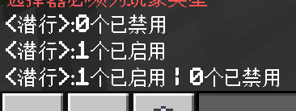

# 2.6.3 特殊的实体：玩家操作

在实体操作的最后一节，我们来学习一种针对特殊实体——玩家的命令。你已经知道，诸如`/give`等命令是不允许指定非玩家实体的，其中的`<玩家: target>`虽然是`target`类型，但是只能指定玩家。

下面这些命令就是只针对玩家的命令，也是用来控制那些玩家才具有的独有的属性的。主要是游戏模式（毕竟其他生物可没有创造模式一说）、权限输入（例如玩家是否能移动，是否能转动视角等）、经验（只有玩家拥有经验）、重生点与出生点（其他生物死了就是死了，而玩家是可以复活的）。

---

## 权限

**权限控制玩家在游戏内所允许的基本操作**。这个概念从 1.19.80 引入，当时只能控制两个权限：`movement`（玩家能否移动）和`camera`（玩家能否转动视角）。1.21.50 之后，引入了更多的权限，可以控制玩家是否能够潜行、跳跃、飞行、骑乘、向前后左右移动，功能又更加丰富了。

这个特性发布之前，玩家想要控制玩家不能移动是非常麻烦的，主要是用到循环`/tp`以阻止玩家活动，这在玩家试图挣脱时总是会出现画面抽动。1.19.80 版本发布不久之后，Mojang 官方开放了《我的世界：传奇》的纪念活动服务器，并且第一次运用了权限控制。在运行动画或对话时，使用这个特性可以极大地降低开发者的工作量。

### 变更权限：`/inputpermission`

使用`/inputpermission`可以变更特定玩家的权限。其语法为：

```mcfunction showLineNumbers title="/inputpermission的语法"
/inputpermission query <玩家: target> <权限: permission> [状态: disabled|enabled]
/inputpermission set <玩家: target> <权限: permission> <状态: disabled|enabled>
```

我们看到有两个用法。第一个用法是**查询有多少`玩家`的`权限`处于`状态`下**，例如查询`sneak`是否启用、禁用，就用`/inputpermission query @a sneak ...`，如果`状态`不指定就全部查询，最后返回有多少玩家启用了潜行，有多少玩家禁用了潜行。



第二个语法是**设定`玩家`的`权限`的状态为`状态`**。

:::tip[实验 2.6-6]

执行命令`/inputpermission set @s camera disabled`，然后转转你的视角试试看。

:::

是的，它会阻止你旋转你的视角。改回`enabled`就是允许旋转视角了。这在一些对话场景中，需要面向 NPC 的场景中，就显得尤为重要了。


关于支持更改的权限，你可以参考[命令/inputpermission - 中文 Minecraft Wiki](https://zh.minecraft.wiki/w/命令/inputpermission)。如果你在使用旧版本的话，则还需要注意版本问题！

### 检查权限的目标选择器参数：`haspermission`

使用`haspermission`目标选择器参数，还允许我们直接查询玩家的权限状态。格式如下：

```mcfunction showLineNumbers title="目标选择器参数haspermission的语法"
haspermission={<权限: permission>=<状态: disabled|enabled>,...}
```

和`scores`类似，它也允许同时查询多个权限。例如`@a[haspermission={camera=disabled,sneak=enabled}]`就是指代禁止旋转视角但允许潜行的玩家。语法比较简单，相信不需要实验，你也可以理解。

## 模式变换：`/gamemode`

`/gamemode`我们曾在 [2.2](../c2_simple_cmds) 时详细地讲过，相信现在已经无需多言。我们直接进行语法回顾，然后迅速跳过这一部分。看，虽然 2.2 讲的命令比较简单，但是要掌握的东西还是很多的！

```text title="/gamemode的语法" showLineNumbers
/gamemode <游戏模式: int|GameMode> [玩家: target]
```

## 经验操作

我们都知道玩家拥有经验，在很多情况下，比如铁砧重命名、或者一些特殊场景下需要用经验作为货币，则需要用命令来检测和控制经验。控制玩家经验的命令就是`/xp`，而检测经验则用目标选择器参数`l`和`lm`。

### 添加或夺走经验：`/xp`

我们现在来看`/xp`的语法：

```text title="/xp的语法" showLineNumbers
/xp <数值: int> [玩家: target]
/xp <数值: int>L [玩家: target]
```

第一条语法，是**给予`玩家` `数值`经验点数**；而第二条语法，则是**给予`玩家` `数值`经验等级**。注意，经验点数和经验等级不是一个概念，在实际应用中，往往都是直接给予经验等级，因为它们足够直观。

:::tip[实验 2.6-7]

先把难度调整为和平，然后调整为生存模式，执行命令`/xp 100L`。这条命令将给予你 100 级的经验。


:::

`数值`也可以是负数。例如`/xp -100L`就是夺走 100 级的经验。所以，你可以把这个数写的大一些，比如`/xp -10000L`，来确保清空玩家的经验值。

### 检查经验的目标选择器参数：`l`与`lm`

使用`l`和`lm`可以检查玩家的**经验等级**，注意哦，不是经验点数，是等级！这个`m`，想必不用我多说你也知道它的含义，它指代的是最小值。它们的语法为

```mcfunction showLineNumbers title="目标选择器参数l和lm的语法"
l=<最大经验等级: int>,lm=<最小经验等级: int>
```

例如，`@a[lm=5,l=10]`就筛选 5~10 级的玩家。很简单吧？

:::note[扩展：Java 版的目标选择器参数]

在 Java 版 1.13（没错，又双叒叕是这个版本，这下你就知道这个版本的影响有多深远了），很多带 m 的目标选择器都被改写，它们所接受的值也都变为范围类型（`integer range`），这就大幅提高了命令的易读性。

- `r`与`rm`：变为`distance`，例如基岩版的`@a[rm=5,r=10]`等效于 Java 版的`@a[distance=5..10]`。
- `rx`与`rxm`：变为`x_rotation`，例如基岩版的`@a[rxm=-30,rx=30]`等效于 Java 版的`@a[x_rotation=-30..30]`。
- `ry`与`rym`：变为`y_rotation`，例如基岩版的`@a[rym=-30,ry=30]`等效于 Java 版的`@a[y_rotation=-30..30]`。
- `l`与`lm`：变为`level`，例如基岩版的`@a[lm=5,l=10]`等效于 Java 版的`@a[level=5..10]`。

而且，相比于基岩版，Java 版还将一些目标选择器写为全称，以及拆分处理。

- `m`：变为`gamemode`，例如基岩版的`@a[m=creative]`等效于 Java 版的`@a[gamemode=creative]`。
- `c`：拆分为`limit`和`sort`，例如基岩版的`@a[c=-4]`等效于 Java 版的`@a[limit=4,sort=furthest]`。Java 版的`sort`还支持按随机排序和按生成时间排序。

你更喜欢哪种表达方式呢？

:::

## 重生点与出生点操作

设置重生点与出生点的重要性，想必已经无需我们多言。然而在这里，我们还要明确重生点与出生点的差异。出生点是**玩家第一次进入世界或服务器时所生成**的位置；而重生点是**玩家死亡并复活后**所在的位置。如果玩家的**重生点丢失**，例如床被挖掉，那么**复活后就直接出生在出生点**。显然，**在复活后，重生点的优先级是要高于出生点的**。有一些开发者会混淆这两个概念，所以可能会仅仅因为一张床就导致设置的“重生点”失效，所以基本概念务必要注意区分。

相信你已经差不多了解了重生点与出生点的差距了。通常在一张地图里面，我们习惯把大厅的位置（如果有大厅或抽象概念的大厅的话）设置为出生点，而把各关（或抽象概念的各关）内的位置分别设置为重生点。设置重生点的命令，是`/spawnpoint`，而设置出生点的命令，是`/setworldspawn`。

### 设置重生点：`/spawnpoint`

现在我们来看`/spawnpoint`的语法：

```text title="/spawnpoint的语法" showLineNumbers
/spawnpoint [玩家: target] [重生点: x y z]
```

**将`玩家`的重生点设置在`重生点`上**。例如，如果要一直指定玩家的重生点在(0,-60,0)上，就只需要循环执行`/spawnpoint @a 0 -60 0`就可以了，这样即使玩家设置了床作为重生点，也一样会更改重生点到(0,-60,0)上。

### 设置出生点：`/setworldspawn`

再来看看`/setworldspawn`的语法。

```text title="/setworldspawn的语法" showLineNumbers
/setworldspawn [出生点: x y z]
```

**将世界出生点的位置设置在`出生点`上**。语法更加简单清晰。相信这两条命令理解起来对你都没有什么难度。

### *清除重生点：`/clearspawnpoint`

清除重生点这个用法我们一般不太常用的。但为特殊需求起见，我们还是来看一下语法。

```text title="/clearspawnpoint的语法" showLineNumbers
/clearspawnpoint [玩家: target]
```

将`玩家`的重生点移除。同样是一条很简单的命令。

---

## 总结与练习

### 一些温馨小提示

不知道你是否发现，我们的教程的讲解速度和节奏已经越来越快啦。这是因为我们假定你在此时已经拥有了分析一条命令最基础的能力：

- 从命令描述、命令类型上能猜出命令的用途；
- 从 Wiki 上查找并学习命令的能力；
- 不断尝试、不断练习、不断实践的能力。

往后，我们的教程节奏会越来越快。要求还是同样的，只要**大概了解这些命令能做什么，以及做好对应的基本实践**就行，部分不常用的命令就留个基本印象，**没有必要死抠语法甚至背语法**。因为实践的时候，除了极个别情况，**在实际项目中不会有任何人阻碍你查资料**。包括我们每节布置的练习题，如果你忘了语法，大可以再查一遍回忆一下；而如果命令能做什么都不知道的话，在实际项目中就很容易“抓瞎”、“绕远路”了。**实践过程和思路是很重要的**！

### 知识点回顾

现在我们来回顾一下本节所学习的内容。本节我们介绍了如何更改并检测玩家的权限、经验，并介绍了设置重生点和出生点的对应操作。让我们再来简单过一遍这些语法，然后就开始练习吧！

- 重生点与出生点
  - 重生点是当玩家死亡后所复活的位置。
  - 出生点是玩家第一次进入世界或服务器所出生的位置。
  - 如果不存在重生点，那么玩家死亡后就复活在出生点。
    - 因此，死亡复活时，重生点的优先级比出生点高。
- 新命令部分

| 命令 | 含义 | 备注 |
| --- | --- | --- |
| `/inputpermission query <玩家: target> <权限: permission> [状态: disabled\|enabled]` | 查询有多少`玩家`的`权限`处于`状态`下 | |
| `/inputpermission set <玩家: target> <权限: permission> <状态: disabled\|enabled>` | 设定`玩家`的`权限`的状态为`状态` | |
| `/xp <数值: int> [玩家: target]` | 给予`玩家` `数值`经验点数 | |
| `/xp <数值: int>L [玩家: target]` | 给予`玩家` `数值`经验等级 | |
| `/spawnpoint [玩家: target] [重生点: x y z]` | 将`玩家`的重生点设置在`重生点`上 | |
| `/setworldspawn [出生点: x y z]` | 将世界出生点的位置设置在`出生点`上 | |

- 新目标选择器参数

| 目标选择器参数（`参数=值`） | 取自于 | 意义 | 分类依据 | 备注 |
| :---: | --- | --- | :---: | --- |
| `haspermission={<权限: permission>=<状态: disabled\|enabled>,...}` | **Has Permission** | 检查`权限`为`状态`的玩家 | 玩家数据 | |
| `l=<最大经验等级: int>` | **L**evel | 检查经验等级小于等于`最大经验等级`的玩家 | 玩家数据 | |
| `lm=<最小经验等级: int>` | **M**inimum **L**evel | 检查经验等级大于等于`最小经验等级`的玩家 | 玩家数据 | |

:::info[练习 2.6-3]

1. 当玩家靠近(0,-60,0)之后则阻止其移动和视角变换，并且使其面向最近的一个村民。假设你写的命令均只执行一次。
2. 写一条命令，如果玩家被禁止潜行，则将其在`state`上的分数改为 0。
3. 写一条命令，当玩家靠近(0,26,0)且允许作弊的变量`data.allowCheat`为`0`时，将玩家设置为冒险模式。
4. 曾经我们实现过记分板商店。现在我们来实现起床战争经验模式的两个简单的基本逻辑：  
   （1）如果玩家有铁锭，则清除玩家的铁锭并给予其 1 点经验；  
   （2）玩家在商店购买钻石剑时，需要花费 400 经验。  
   用命令分别实现上面两个需求。你可以看到其实和记分板商店是如出一辙的。
5. 假设现在我们要实现一个 PVP 地图的战败逻辑：红队（`team.@s`=`1`）玩家死亡后，立即重生在(0,100,0)并设置为旁观模式，在 5 秒后在基地(30,60,30)重生。假设玩家重生倒计时用`respawn.@s`变量记录，存活的玩家均为冒险模式。  
   这个需求是比较复杂的，所以我们在这种情况下应拆解需求。假设下面的所有命令均为循环执行，试写出符合下面各个小要求的命令：  
   （1）立即重生的游戏规则命令，和设置重生点到(0,100,0)的命令。  
   （2）红队玩家死亡后，将`respawn.@s`设为`100`，并立刻设置其为旁观模式。  
   （3）检测到红队玩家的`respawn.@s`>`0`时，每游戏刻减 1 分。  
   （4）检测到红队玩家的`respawn.@s`=`0`，并且为旁观模式时，设置其为冒险模式并将其传送到(30,60,30)。
6. 设置出生点位置为(0,-60,0)。
7. （选做，如果不熟悉`/spreadplayers`的用法可以在上一节或 Wiki 中查询）原理上讲，如果不考虑区块加载的问题，你能用`/spreadplayers`和`/setworldspawn`联合实现类似于 RLCraft 整合包中的随机出生点的效果吗？

:::
