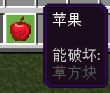
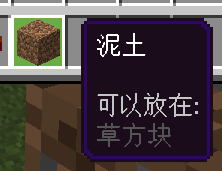
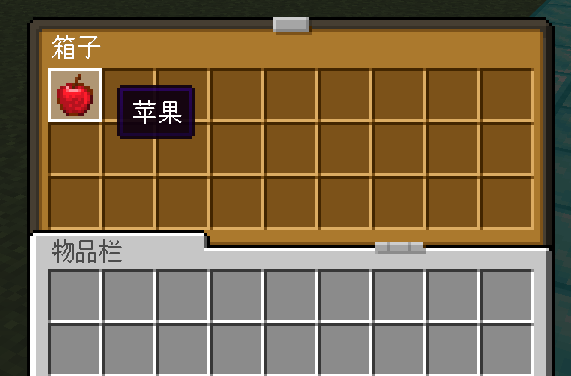
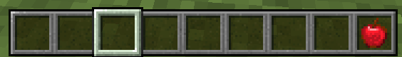
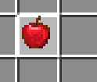

# 2.7 物品操作命令

你是否还记得我们第一章时曾经讲过三个基本概念：实体、物品和方块？是的！2.6~2.8 这三大节，我们就是按照实体操作、物品操作和方块操作来讲解的了。这一节，我们就来学习与物品相关的操作。

其实物品操作你已经掌握了一些，在 2.2，我们已经学习了`/give`和`/clear`。现在，我们从“增删改查”的角度再出发，好好回顾一下这两位老朋友，并认识几位新朋友。

## 物品组件

还记得吗？我们当时在讲 2.2 的`/give`命令的时候，特意把物品组件绕过去了。因为那还是打基础的阶段，而且这里涉及的内容又很多，所以就跳过去了。但是现在，是时候了，我们要开始认识物品组件了。

来重新回顾一下`/give`命令的语法：

```text title="/give的语法" showLineNumbers
/give <玩家: target> <物品: Item> [数量: int] [数据值: int] [组件: json]
```

这里我们看到`json`这个全新的类型。关于 JSON，目前我们认为讲这个对你来说其实是相对比较适合的，但是要涉及的内容还是太多了，所以我们会在模块 2 的第一章系统性地讲解 JSON 的语法。目前，你只需要学会像套公式一样去套物品组件就可以了。

物品组件（Item Component）进一步地决定了物品拥有的行为。对于组件这种陌生的概念，你可以把它理解成是一个器械的不同模块，只要给物品加上一个组件，就代表这个物品拥有这个组件所决定的特性。

### 有哪些物品组件？

对于基岩版来说，现在一共支持 4 类物品组件：**（冒险模式）可破坏、（冒险模式）可放置、物品锁定、死亡保留**。

- 如果你给物品加上一个“可破坏”的组件，那么这个物品**在冒险模式下就拥有了可破坏特定方块的功效**。

  

  - **前提是，这个方块本来就是可破坏的**。加上一个“可破坏”基岩的组件，最后还是无法破坏基岩。
- 同样地，如果加上一个“可放置”的组件，那么这个物品**在冒险模式下就拥有了可放置在特定方块上的功效**。

  

  - **前提是，这个物品本来就是可放置的**。给钻石剑加上一个“可放置”的组件，最后还是无法放置。
- 加上一个“物品锁定”的组件，这个物品**就将无法移除、丢弃、用于合成**，除非使用`/clear`。
  - 这类物品会在其**左上角加一个小三角标识**这是一个被锁定的物品。

    

  - 然而，这类物品**还是可以右键使用的**。比如为雪球加上一个物品锁定，还是可以扔出去。
  - 物品锁定也分为两类：**锁定在物品栏**和**锁定在槽位**。
    - **锁定在物品栏**时，代表这个物品还可以**在物品栏内从一个位置移动到另一个位置**。小三角标识的颜色是黄色。
    - **锁定在槽位**时，这个物品就**完全锁死在这个槽位上无法移动**。小三角标识的颜色是红色。
- 加上一个“死亡保留”的组件，这个物品**就将在玩家死亡后仍然保留**。

  

  - 不过，如果开了死亡不掉落的话，那么这个组件就没什么意义了——反正无论如何，死亡后其他物品也不掉落。

你可以清楚地看到，这些物品组件所添加的信息都会在物品描述中显示出来。但是，如果使用`/gamerule showTags false`的话，那么这些信息就会被隐藏。

:::note[扩展：Java版的物品组件]

Java 版也同样存在物品组件这个概念。在 1.20.5 以前，Java 版还是使用 NBT 存储物品的数据。1.20.5 之后，Java 版更换了一个更统一的写法，并正式升级为**物品堆叠组件（Item Stack Component）**。

格式上，和基岩版可以认为毫无半点关系。功能上，Java 版的物品堆叠组件可实现的功能堪称“吊打”基岩版。基岩版开发者梦寐以求的附魔`enchantments`、命名`item_name`、提示信息`lore`、不可破坏`unbreakable`等等全都未加入。Java 版至今支持数十种物品组件，而遗憾的是，基岩版现如今却只支持 4 种，自 1.16.100 更新以来就再也没有更新过。好在，使用脚本（ScriptAPI）可以一定程度上弥补这种差距。

有趣的是，基岩版现如今支持的 4 种物品组件中，有 2 种是 Java 版所没有的：物品锁定和死亡保留。但反过来说，基岩版命令现如今也只支持 Java 版数十种物品组件的其中 2 个而已，而这两个组件是基岩版 1.1 （2017 年）更新的……

:::

### 如何添加物品组件？

我们稍后会在两条命令中看到需要填写`组件: json`的参数，这就是你可以添加物品组件的地方。

对于`json`，通常我们都需要先写一个大括号`{}`包裹里面的内容，里面就可以添加组件了。这里需要格外注意一点，我们需要再强调一次：**其中会涉及到大量的`[`、`]`、`,`、`"`、`:`等符号，请务必使用英文的半角符号！否则在这里极有可能会出现语法问题**！如果你确信自己没有输入错误，却出现了语法错误，仔细检查语法错误的描述，有时候可能就是因为你误输入了中文的符号导致的。

```json
{(组件1),(组件2),...}
```

接下来，我们直接给出组件的写法：

```json title="可破坏组件"
"can_destroy":{"blocks":["方块ID1","方块ID2",...]}
```

可破坏组件，指代物品可破坏的方块。`can_destroy`也可以写为`minecraft:can_destroy`。**`方块ID`必须是有效的 ID，否则将导致物品组件无法解析**。示例：

- `"can_destroy":{"blocks":["grass_block"]}`：可以破坏草方块。
- `"can_destroy":{"blocks":["grass_block","dirt"]}`：可以破坏草方块和泥土。

一定要注意的一点是，**各项用逗号分隔，但末尾决不能加逗号**！对于 JSON 而言，这叫做**语法错误（Syntax Error）**，会直接导致 JSON 无法解析。

- `["grass_block","dirt"]`：正确写法。
- `["grass_block","dirt",]`：错误写法，`"dirt"`后面多出了一个`,`。

```json title="可放置组件"
"can_place_on":{"blocks":["方块ID1","方块ID2",...]}
```

与可破坏组件类似，指代物品可以放置在何方块上。`can_place_on`也可以写为`minecraft:can_place_on`。示例：

- `"can_place_on":{"blocks":["grass_block"]}`：可以放置到草方块上。
- `"can_place_on":{"blocks":["grass_block","dirt"]}`：可以放置到草方块和泥土上。

```json title="物品锁定组件：锁定在物品栏"
"item_lock":{"mode":"lock_in_inventory"}
```

```json title="物品锁定组件：锁定在槽位"
"item_lock":{"mode":"lock_in_slot"}
```

`item_lock`也可以写为`minecraft:item_lock`。

```json title="死亡保留组件"
"keep_on_death":{}
```

`keep_on_death`也可以写为`minecraft:keep_on_death`。

### 物品组件运用的实例

按照上面所给出的物品组件的格式，将它们拼装到一起即可。以下是`组件: json`的几个示例：

```json title="可破坏泥土"
{"can_destroy":{"blocks":["dirt"]}}
```

其中，`"can_destroy":{"blocks":["dirt"]}`是一个可破坏的组件，将其直接包裹在`{}`里，便构成了一个完整的`组件: json`。

```json title="可破坏泥土、同时可放置在泥土上"
{"can_destroy":{"blocks":["dirt"]},"can_place_on":{"blocks":["dirt"]}}
```

其中，`"can_destroy":{"blocks":["dirt"]}`是一个可破坏的组件，`"can_place_on":{"blocks":["dirt"]}`是一个可放置的组件，这两个组件中间用一个`,`分隔，包裹在`{}`里，便构成了一个完整的`组件: json`。

```json title="锁定在物品栏上、同时死亡保留"
{"item_lock":{"mode":"lock_in_inventory"},"keep_on_death":{}}
```

和上文同理，`"item_lock":{"mode":"lock_in_inventory"}`和`"keep_on_death":{}`是两个组件，中间以`,`分隔并用`{}`包裹。

```json title="可破坏泥土和草方块、可放置在石头上且锁定在槽位上"
{"can_destroy":{"blocks":["dirt","grass_block"]},"can_place_on":{"blocks":["stone"]},"item_lock":{"mode":"lock_in_slot"}}
```

看到这里，想必你自己已经可以进行解析了。现在，对物品组件有一些基本认识了吗？

:::note[扩展：如果将最后一个JSON展开来写……]

在模块 2 我们就会看到附加包的 JSON 都是展开来写的，这样能够有效提升可读性。具体来说就是加缩进以明确上下级的关系：

```json title="添加缩进、换行与空格的写法" showLineNumbers {2-7,13-15}
{
    "can_destroy": {
        "blocks": [
            "dirt", // <- 以逗号分隔
            "grass_block" // 最后一项没有逗号
        ] // 最后一项没有逗号
    }, // <- 以逗号分隔
    "can_place_on": {
        "blocks": [
            "stone" // 最后一项没有逗号
        ] // 最后一项没有逗号
    }, // <- 以逗号分隔
    "item_lock": {
        "mode": "lock_in_slot" // 最后一项没有逗号
    } // 最后一项没有逗号
}
```

不过，命令是不支持缩进和换行滴，死心吧~ 只是给你看个乐呵而已。不过，虽然只是看个乐呵，它却很好地把 JSON 的结构呈现给你，你可以清楚地看到所谓的最后一项，后面是没有逗号的。

:::

### 输入物品组件稳定不出错的小技巧

我们看到这些物品组件里有这么多的乱七八糟的符号，括号都是成对的、引号也是成对的，少打一个就会出现语法错误。条件如此苛刻，该怎么确保不出现问题呢？这里分享两个小技巧。

<details>

<summary>第一个小技巧：直接复制粘贴我们所给的组件</summary>

例如，在打字的时候你可以先打一个花括号，然后复制粘贴一个组件到花括号里，如果需要另一个组件加个逗号就继续复制粘贴，最后，按需修改。例如，如果想实现“可破坏泥土和草方块、可放置在石头上且锁定在槽位上”的效果，可以按如下步骤解决。

```json title="第一步：先打花括号"
{}
```

```json title="第二步：复制第一个组件进去"
{"can_destroy":{"blocks":["方块ID1","方块ID2",...]}}
```

```json title="第三步：在组件后面加逗号，然后复制第二个组件进去"
{"can_destroy":{"blocks":["方块ID1","方块ID2",...]},"can_place_on":{"blocks":["方块ID1","方块ID2",...]}}
```

```json title="第四步：在组件后面加逗号，然后复制第三个组件进去"
{"can_destroy":{"blocks":["方块ID1","方块ID2",...]},"can_place_on":{"blocks":["方块ID1","方块ID2",...]},"item_lock":{"mode":"lock_in_slot"}}
```

```json title="第五步：更改可破坏和可放置组件的值，大功告成！"
{"can_destroy":{"blocks":["dirt","grass_block"]},"can_place_on":{"blocks":["stone"]},"item_lock":{"mode":"lock_in_slot"}}
```

</details>

<details>

<summary>第二个小技巧：先打成对的括号和字符串的引号</summary>

我们注意到这里每个括号都是成对出现的，所以我们可以优先打出各组件的第一级括号，然后第二级括号，以此类推……

```json title="第一步：先打花括号"
{}
```

```json title="第二步：先打各组件的第一级内容和第一对括号"
{"can_destroy":{},"can_place_on":{},"item_lock":{}}
```

```json title="第三步：分别填写第二级内容和第二对括号"
{"can_destroy":{"blocks":[]},"can_place_on":{"blocks":[]},"item_lock":{"mode":""}}
```

```json title="第四步：填写第二级内的内容"
{"can_destroy":{"blocks":["dirt","grass_block"]},"can_place_on":{"blocks":["stone"]},"item_lock":{"mode":"lock_in_slot"}}
```

这种方法通常更适合已经精通这些组件结构和 JSON 语法的“高手”。

</details>

---

## “增”物品：给予物品的命令`/give`

在了解了物品组件后，我们便已经了解了`/give`的全貌。现在让我们回过头来，做一个实验看看。

:::tip[实验 2.7-1]

执行命令`/give @s diamond_shovel 1 0 {"can_destroy":{"blocks":["grass_block"]}}`，它将给予你一把可以在冒险模式破坏草方块的钻石锹。

然后，调整为和平，然后调整自己为冒险模式，在挖掉地表的草方块之后尝试挖泥土看看。

:::

是的，有了物品组件之后，你就可以在冒险模式下放置或破坏方块了。冒险模式是制作地图常常使用的一种游戏模式，它可以防止玩家破坏不该破坏的方块，而你又可以通过给予特定的工具使玩家破坏允许破坏的方块，能够有效地防止玩家破坏地图。例如你可以给予一把剑以允许玩家破坏蜘蛛网，但不允许玩家破坏草方块、泥土这种常见的场景方块。

## “删”物品：移除物品的命令`/clear`

然而，对于“删”物品的`/clear`来说，则没有什么要补充的，因为它毕竟不支持`组件: json`参数，所以我们看看语法简单回顾一下就过了。

```text title="/clear的语法" showLineNumbers
/clear <玩家: target> <物品: Item> [数据值: int] [最大数量: int]
```

## “改”物品：更改物品栏物品的命令`/replaceitem`

命令是允许“改”物品的，也就是**任意更改物品栏槽位里的一个物品**，这就是`/replaceitem`。

```text title="/replaceitem的语法" showLineNumbers
/replaceitem block <位置: x y z> slot.container <槽位ID: int> <物品: Item> [数量: int] [数据值: int] [组件: json]
/replaceitem block <位置: x y z> slot.container <槽位ID: int> <旧物品处理: destroy|keep> <物品: Item> [数量: int] [数据值: int] [组件: json]
/replaceitem entity <目标: target> <槽位类型: EntityEquipmentSlot> <槽位ID: int> <物品: Item> [数量: int] [数据值: int] [组件: json]
/replaceitem entity <目标: target> <槽位类型: EntityEquipmentSlot> <槽位ID: int> <旧物品处理: destroy|keep> <物品: Item> [数量: int] [数据值: int] [组件: json]
```

显然，这条命令有两个用法：更改方块（容器）物品栏的物品`block`用法，和更改实体物品栏的物品`entity`用法。每个用法各有一个`旧物品处理`参数，并且事实上地可以不指定这个参数（不指定时就退化到另一个语法）。所以，不严谨地来讲，我们可以把这条命令简写为

```text title="/replaceitem的语法简写" showLineNumbers
/replaceitem <目标> <槽位> [旧物品处理] <物品>
```

换言之，这条命令**更改`目标`的`槽位`上的`物品`。可选择是否销毁原物品**。其中：

- `<目标>`为`block <位置: x y z>`或`entity <目标: target>`，用于指定对何种对象进行操作，**是容器还是实体**。
- `<槽位>`为`<槽位类型: EntityEquipmentSlot> <槽位ID: int>`，用于指定**对该对象的何槽位以及槽位的何位置进行操作**。
  - 其中，`slot.container`也是一种特殊的槽位类型，只是它仅支持容器。
- `[旧物品处理]`为`<旧物品处理: destroy|keep>`，用于指定指定的槽位**有物品的情况下，是销毁物品还是保留物品**。
  - 其实，可选参数本不应当出现在必选参数的中间，这里只是为了表达它可有可无的性质，以使读者能够更容易地理解这个参数的地位。
- `<物品>`为`<物品: Item> [数量: int] [数据值: int] [组件: json]`，用于指定**在指定的槽位设置为何种物品**。
  - 你可以很快观察到，这几个参数无论是顺序上还是功能上都和`/give`保持一致。所以，`/give`和`/replaceitem`的差距主要在前面的`/replaceitem <目标> <槽位> [旧物品处理]`上，相对地，`/give`的前面为`/give <目标>`，是无需额外指定槽位的。

这些概念有点太抽象了？没关系，我们来做几个实验你就知道该怎么用了。

### 更换方块的物品

:::tip[实验 2.7-2]

用`/setblock 5 -60 5 chest`在(5,-60,5)放上箱子。然后，执行命令`/replaceitem block 5 -60 5 slot.container 0 apple`，打开箱子，这就是这条命令送给你的礼物。

:::



*（请原谅我又加了一个资源包……嘿嘿）*

你可以看到，箱子的第一个槽位上出现了一个苹果。我们来分析一下这条命令：

- 这条命令先用`block 5 -60 5`指定了这个位于(5,-60,5)的箱子（注意一定要是容器）。
  - 注意：指定的方块一定要是容器。
- 然后，用`slot.container 0`指定了箱子的第一个槽位。
  - 其中，`slot.container`是方块类型的目标唯一可用的槽位，所以直接写为`slot.container`。
  - 第一个槽位是从`0`记起的，所以写为第 n 个槽位，`槽位ID`应该写为`n-1`。
    - 例如中间的槽位是第 14 个槽位，所以`槽位ID`应该填写为`13`。
    - 最后一个槽位是第 27 个槽位，所以`槽位ID`应该填写为`26`。
- 最后，直接用`apple`指代了要替换的物品。

### `[旧方块处理]`的作用

上面的命令，和`/replaceitem block 5 -60 5 slot.container 0 destroy apple`是同义的。相比于上面的命令，这里多写了一个`destroy`。这说明，在指定`旧物品处理`时，如果不写就默认为`destroy`，也就是默认销毁原来的物品。而如果指定为了`keep`，在原槽位已经有物品时，就不会强制销毁原有物品。

你可以在刚刚的箱子中，将第一个物品替换为钻石剑，然后执行`/replaceitem block 5 -60 5 slot.container 0 keep apple`，在`keep`模式下，钻石剑不会被替换，而在`destroy`模式下，钻石剑就会被替换为苹果。


*（命令反馈表述抽风也是常有的事，知道它什么意思就好了，毕竟汉字的序顺不影响读阅）*

这个功能在以前常常用来判断特定槽位上是否有特定物品。现在你依然可以用这个功能来判断玩家的特定槽位是否有物品。在稍后的`hasitem`中，我们将认识到这一点。

### 更换实体的物品

现在，我们再来看看实体操作吧！

:::tip[实验 2.7-3]

执行命令`/replaceitem entity @s slot.hotbar 8 apple`，然后注意你的快捷栏在什么位置上多出了一个苹果。

:::



执行这条命令后，我们的快捷栏的最后一位获得了苹果。我们还是来分析一下这条命令：

- `entity @s`：指定更换自己的槽位。这里是更改实体的用法。
- `slot.hotbar 8`：这是更换了快捷栏的槽位，根据前文所述，`8`指代第 9 个槽位，所以最后一位被换为苹果。
  - **关于实体可用的槽位，请你查看[命令/replaceitem - 中文 Minecraft Wiki](https://zh.minecraft.wiki/w/命令/replaceitem#参数) 的表述，本教程不再赘述**。总的来说，**可以指定的槽位类型包括盔甲、物品栏、主手副手、快捷栏、末影箱等重要位置**。
- `apple`：替换为苹果。

结合前面的关于文本组件的表述，相信这条命令现在你已经完全掌握它的用法了，不过仍然需要多试多练习哦。

:::warning[警告：不要循环执行`/replaceitem`]

我们必须提醒你的是，在使用`/replaceitem`的时候，切记不要每游戏刻都循环执行这条命令。经过多次的实际工程证明，这样做会导致玩家难以切换快捷栏槽位，这种卡快捷栏问题对于实际游戏体验的影响极大！

:::

## “查”物品：目标选择器参数`hasitem`

在 [1.6](./../b1_concepts/c6_target_selector#hasitem指定拥有特定物品的实体)，我们曾经学过`hasitem`是用来检测玩家是否存在物品的。然而，它并不仅仅是检测是否有物品那么简单。实际上，在 1.18.30 添加这条选择器参数时，基岩版的命令玩家无不为之欢欣雀跃，因为基岩版终于有一个像样的成熟的检测物品的方式了，检测物品的方法也得到了大幅简化，并且拥有更优良的可读性。

`hasitem`能够检测玩家**在特定位置**是否拥有**特定数量**、**特定数据值**的**特定物品**，并且支持**同时检测多个物品**。所以才说，它可不只是只检测是否有物品那么简单。它有两条语法，我们一条一条来说。

### 单物品检测

```text title="目标选择器参数hasitem的用法：单物品检测" showLineNumbers
hasitem={item=<物品: Item>,quantity=[数量: integer range],location=[槽位类型: EntityEquipmentSlot],slot=[槽位ID: integer range],data=[数据值: int]}
```

哎哟！这条语法可是长得很。我们来分析一下，在这条长长的检测项目中，我们看到`{}`里面所指代的都是针对同一个物品的检测，并且有很多可选值。其中它们的类型，我们都已经见过了。我们来一一介绍一下这个检测项目的各个参数：

- `item`：**指代要检测的物品**。它接受`Item`类型，也就是物品ID。这是一个**必选**项目，*~毕竟连物品都不特别指定的话，那究竟是在检测拥有什么物品呢？~*
  - 例如，`@a[hasitem={item=diamond}]`找到有钻石的玩家。
- `quantity`：**指代要检测的物品的数目，可选**。它接受`integer range`类型，也就是我们曾经讲过的范围表达。
  - 例如，`@a[hasitem={item=diamond,quantity=5..10}]`就找到有 5~10 颗钻石的玩家。
  - 如果不指定的话，只要有这个物品就检测通过，可以认为默认值是`1..`。
  - 特别地，**指代`quantity`为`0`就找到没有这个物品的玩家**。例如`@a[hasitem={item=diamond,quantity=5..10}]`就找到没有钻石的玩家。
- `location`：**指代要检测的物品所在的槽位，可选**。它接受`EntityEquipmentSlot`类型，这是我们刚学过的`槽位类型`的表达。
  - *所以不要觉得我们没有列出来的东西就是非重点哦\~通常我们给出Wiki链接就是让你自学相关内容的，也是重要的内容。如果你没有看的话，建议还是点开那个Wiki链接看看为好哦*。
  - 例如，`@a[hasitem={item=diamond_helmet,location=slot.armor.head}]`就找到戴着钻石头盔的玩家。这里要求玩家不光光只是拥有钻石头盔，必须是戴着才能检查通过。
  - 不指定`location`的时候，默认为检测所有槽位（但不包括末影箱，必须是“传统的”物品栏的组成部分）。
- `slot`：**指代要检测的物品所在的槽位位置，可选，但指定`slot`时必须要指定`location`**。同样接受范围表达。
  - 例如，`@a[hasitem={item=snowball,location=slot.hotbar,slot=7..8}]`就找到快捷栏后两位有雪球的玩家。
- `data`：**指代要检测的物品所拥有的数据值，可选**。只支持`int`，很遗憾，它不支持范围表达。
  - 例如，`@a[hasitem={item=diamond_sword,data=1000}]`就找到拥有损坏值为 1000 的钻石剑的玩家。

不用我多说你也知道，物品检测在很多情况下都很重要，经常有着很大的需求。想必你一定已经迫不及待地想要上手试一试了！

:::tip[实验 2.7-4]

准备一组钻石，放到你的一号快捷栏上，但不要手持。然后执行下面的命令。在执行命令之前，可以按照前面的参数思考一下下面的命令的意义，以及它们是否会执行成功。

- `/execute if entity @s[hasitem={item=diamond}]`
- `/execute if entity @s[hasitem={item=diamond,quantity=5..10}]`
- `/execute if entity @s[hasitem={item=diamond,quantity=5..}]`
- `/execute if entity @s[hasitem={item=diamond,quantity=!5..10}]`
- `/execute if entity @s[hasitem={item=diamond,location=slot.weapon.mainhand}]`
- `/execute if entity @s[hasitem={item=diamond,location=slot.hotbar}]`
- `/execute if entity @s[hasitem={item=diamond,location=slot.inventory}]`
- `/execute if entity @s[hasitem={item=diamond,location=slot.hotbar,slot=5..8}]`
- `/execute if entity @s[hasitem={item=diamond,location=slot.hotbar,slot=1..4}]`

:::

此外，这条命令有一个常错点就是，很多人会下意识地用`item=air`来判断一个位置是否没有物品。但是，事实上却不存在一个“空气”物品（严谨来说，“空气”物品是不允许在命令内被调用的）。**换言之，`item=air`是无效的**。也就是说，你可以检测一个槽位是否没有什么特定的物品，但你确实不能直接用`hasitem`检测一个槽位是否没有物品。

### 多物品检测

刚刚我们学习了如何检测玩家拥有一个物品。而检测玩家是否拥有多个物品的方法，则用下面的方法来表示：

```text title="目标选择器参数hasitem的用法：多物品检测" showLineNumbers
hasitem=[{item=...,...},{item=...,...},...]
```

也就是说，刚刚的那一大堆检测项目，假如说标记为`{...}`的话，那么`hasitem`允许使用`[]`来包括多个检测项目`{...}`，并且用逗号分隔。我们下面就来写一条超级长的命令，检测玩家是否穿着全套的钻石套！

:::tip[实验 2.7-5]

执行命令`/execute if entity @a[hasitem=[{item=diamond_helmet,location=slot.armor.head},{item=diamond_chestplate,location=slot.armor.chest},{item=diamond_leggings,location=slot.armor.legs},{item=diamond_boots,location=slot.armor.feet}]]`。这个时候，但凡钻石四件套没有穿上一件，就会执行失败。

:::

在上面的命令中，分别存在 4 个检测项目：

- `{item=diamond_helmet,location=slot.armor.head}`
- `{item=diamond_chestplate,location=slot.armor.chest}`
- `{item=diamond_leggings,location=slot.armor.legs}`
- `{item=diamond_boots,location=slot.armor.feet}`

这 4 个项目通过逗号分隔，并通过一个`[]`包裹。这样，我们就实现了检测玩家的全套盔甲！

## 为物品附魔的命令`/enchant`

接下来我们学一条简单的小命令，为玩家手持的物品进行附魔：`/enchant`。

```text title="/enchant的语法" showLineNumbers
/enchant <玩家: target> <附魔: Enchant|int> [等级: int]
```

**将`玩家`手持的物品设置为`等级`的`附魔`**。因为只能限定手持、只能附魔可附魔的物品、而且附魔的等级不允许超出可附魔的最大等级，所以这条命令的局限性还是比较大的。但有少部分时候可以派得上用场。

`Enchant`是一个新的类型，然而它无非也就是枚举值而已，读者可以在游戏中自行实验。至于`int`类型，因为附魔种类多达几十种，数值与附魔之间难以记忆和对应，因此我们不推荐使用数值写法。

:::tip[实验 2.7-6]

执行命令`/enchant @s sharpness 5`，然后手持一把剑。你会发现它给你的剑附魔了锋利 V。

:::

在没有加入`hasitem`之前，很多开发者常常使用该命令判断玩家手持物品的类型。因为可以检测手持，所以以前还是比较常用的。然而现在这些用法已经是过去式了。

## *战利品命令`/loot`

战利品命令只是一条低频使用的命令，它负责调用战利品表。所谓的战利品表，就是当你杀死了一只实体、或者破坏了一个方块、等行为所可能掉落出来的东西的一个列表。例如，杀死苦力怕，就调用苦力怕的战利品表，也就是掉落火药出来。

如果只是普通的，不结合附加包使用的`/loot`的话，其实是没什么吸引力的。如果结合附加包使用，那么它的潜力就非常的大。我们会在模块 2 进行进一步的讲解，但现在我们只来看它的其中一个基础用法：

```text title="/loot的生成物品语法1" showLineNumbers
/loot spawn <位置: x y z> kill <实体: target>
```

它表示，模拟杀死`实体`后掉落的掉落物，生成到`位置`上。这是一种直接生成掉落物的有力工具，因为使用其他方法生成掉落物都相当麻烦。此外，这条命令仅代表模拟杀死实体，而并不真的杀死实体。例如，`/loot spawn 0 -60 0 kill @e[type=sheep,c=1]`将把杀死羊的掉落物生成在(0,-60,0)上面，但不会真的杀死羊。

事实上，它有十多条语法，但是现在谈这些还为时尚早，所以我们就点到为止，对这条命令简单留个印象就好了。

## *配方表命令`/recipe`

基岩版在 1.20.30 时，新增了配方解锁机制，新的配方可以在获取对应材料后慢慢解锁，而不是一口气全部解锁。配方表命令`/recipe`就是负责控制玩家的配方表获取进度的。

```text title="/recipe的语法" showLineNumbers
/recipe give <玩家: target> <配方: string>
/recipe take <玩家: target> <配方: string>
```

两条语法分别代表给予和夺走`玩家`的`配方`。然而，光是夺走玩家的配方表还不够，因为无法阻止玩家获取配方，所以这条命令的实际意义可能在一些生存服务器会更大一些，实际工程是不太用这条命令的。

有几个游戏规则可以控制配方的行为：

- `recipesUnlock`：是否启用配方解锁机制。
- `showRecipeMessages`：是否在获取新配方时弹出窗口显示获取的配方。
- `doLimitedCrafting`：是否限制玩家在获取配方后才能合成。然而，这条游戏规则无法阻止玩家获取新的配方。

---

## 总结与练习

本节，我们学习了物品组件、`/replaceitem`、`hasitem`的扩展语法和`/enchant` 4 个重要的知识点。让我们一起来回顾一下这些知识点：

- 物品组件
  - 进一步地决定物品拥有的行为。
  - 物品可以拥有（冒险模式）可破坏、（冒险模式）可放置、物品锁定、死亡保留，一共 4 种物品组件。
  - 各个物品组件写在花括号`{}`内，并由逗号分隔。
  - 它们的类型为`json`，格式是固定的，分别为：

  ```json title="可破坏组件"
  "can_destroy":{"blocks":["方块ID1","方块ID2",...]}
  ```

  ```json title="可放置组件"
  "can_place_on":{"blocks":["方块ID1","方块ID2",...]}
  ```

  ```json title="物品锁定组件：锁定在物品栏"
  "item_lock":{"mode":"lock_in_inventory"}
  ```

  ```json title="物品锁定组件：锁定在槽位"
  "item_lock":{"mode":"lock_in_slot"}
  ```

  ```json title="死亡保留组件"
  "keep_on_death":{}
  ```

  - 一些细节性的问题以及示例，请回到讲解处查看，这里便不再过多赘述。

- 新命令部分

| 命令 | 含义 | 备注 |
| --- | --- | --- |
| `/replaceitem block <位置: x y z> slot.container <槽位ID: int> <物品: Item> [数量: int] [数据值: int] [组件: json]` | 将`位置`处的容器的第(`槽位ID`+1)个槽位设置为特定物品 | `槽位ID`从 0 记起 |
| `/replaceitem block <位置: x y z> slot.container <槽位ID: int> <旧物品处理: destroy\|keep> <物品: Item> [数量: int] [数据值: int] [组件: json]` | 意义同上，可选择旧物品处理方式 | |
| `/replaceitem entity <目标: target> <槽位类型: EntityEquipmentSlot> <槽位ID: int> <物品: Item> [数量: int] [数据值: int] [组件: json]` | 将`实体`的`槽位类型`的第(`槽位ID`+1)个槽位设置为特定物品 | |
| `/replaceitem entity <目标: target> <槽位类型: EntityEquipmentSlot> <槽位ID: int> <旧物品处理: destroy\|keep> <物品: Item> [数量: int] [数据值: int] [组件: json]` | 意义同上，可选择旧物品处理方式 | |
| `/enchant <玩家: target> <附魔: Enchant\|int> [等级: int]` | 将`玩家`手持的物品设置为`等级`的`附魔` | 附魔有严格限制 |

- 目标选择器参数`hasitem`
  - 检测玩家在特定位置是否拥有特定数量、特定数据值的特定物品，并且支持同时检测多个物品。
  - 有两条语法：
    - `hasitem={...}`：检测单物品
    - `hasitem=[{...},{...},...]`：检测多物品
  - 其中，每条`{...}`都接受 5 个参数：
    - `item`：**必选**，`Item`类型，指代检测的物品。
    - `quantity`：可选，`integer range`类型，指代检测的物品数目。
    - `location`：可选，`EntityEquipmentSlot`类型，指代检测的物品所在的槽位。
    - `slot`：可选，`integer range`类型，必须搭配`location`使用，指代检测的物品所在的槽位的位置。
    - `data`：可选，`int`类型，指代检测的物品的数据值。

:::info[练习 2.7]

1. 当玩家获得工作台后，清除之并给予其一个新的可放置在绿宝石块上的工作台。你写的命令均无条件按顺序执行，允许额外创建变量。
2. 当玩家没有木剑和石剑的时候，给予其一把锁定在物品栏的木剑。
3. 在玩家的快捷栏最后一位放置 2 个锁定在槽位的雪球。如果这条命令要循环执行，有什么优化空间？
4. 在玩家的主手尝试以`keep`模式放置一个基岩。如果该玩家不可能以正常途径获取基岩的情况下，基于这个思路为原来主手没有物品的玩家添加一个标签`mainhandWithNoItem`，并移除该基岩。
5. 在一个大箱子的中间槽位放置一个信标。假设大箱子占据的坐标分别为(0,-60,0)和(1,-60,0)。
6. 为玩家的钓鱼竿添加饵钓 III。
7. 当玩家没有铁镐时，给予其一把可以破坏石头和饰纹陶罐的铁镐。
8. 现在已知`hasitem`可以检测到鼠标在物品栏中拿起来的物品——这类物品不属于任何一种已列出的槽位类型，但是可以被`hasitem`检测得到。当玩家拿起自己头上的钻石头盔时，清除玩家所有的钻石头盔并重新放一个回去。
   

:::
