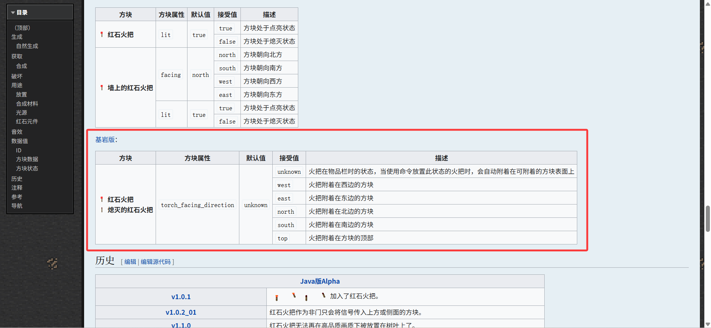
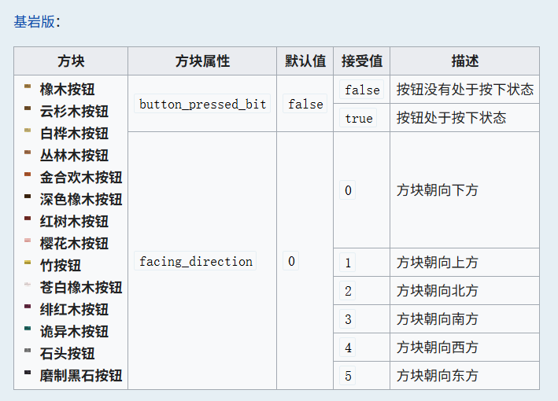
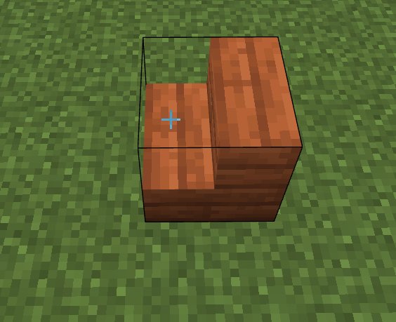
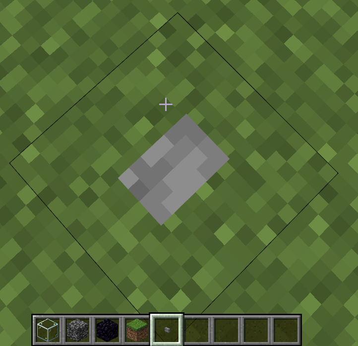
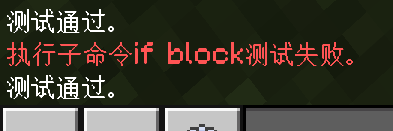
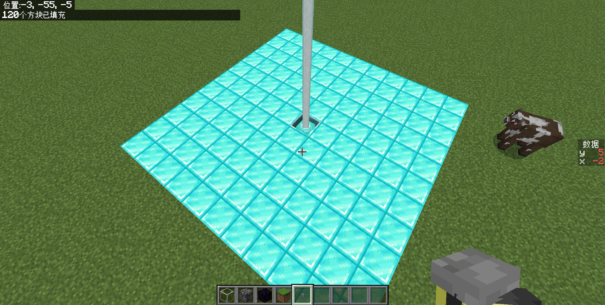
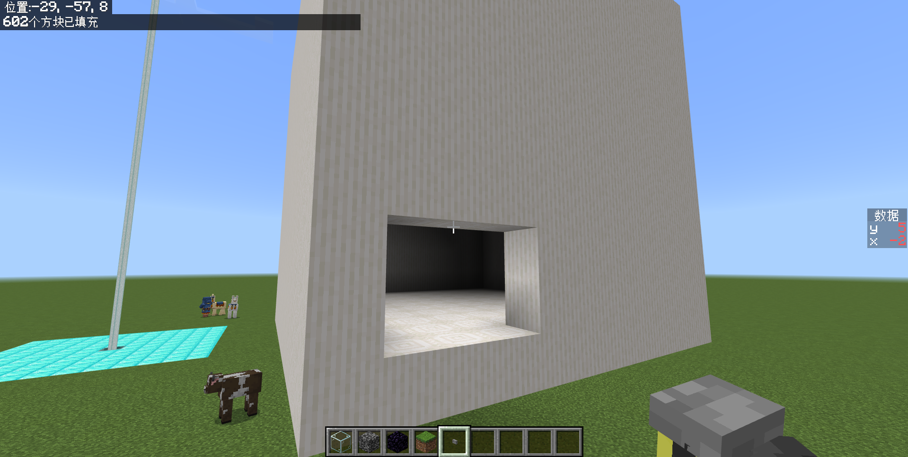

# 2.8 方块操作命令

接下来我们来谈谈实体物品方块三兄弟的最后一位：有关方块的操作命令。

## 方块状态

**方块状态（Block States）是用于进一步定义方块的外观和行为的参数**。哪怕是同一个方块，也可能有许许多多不同的状态。比如，楼梯的方向、按钮的方向、红石的能量、等等。为了表达同一种方块的不同状态，我们就要使用方块状态了。

方块状态常常用于很多类型的方块上，所以查文档通常是必要的。在这篇 Wiki：[方块状态 - 中文 Minecraft Wiki](https://zh.minecraft.wiki/w/方块状态) 中详细地给出了所有的方块状态。但不幸的是，该篇 Wiki 的排版做的并不好，因为没有标题指引，你可能很难找到你要找的内容，甚至连找到基岩版是从什么地方开始的都要耗半天时间。

所以，我们更建议在你要查找方块状态的时候，直接在对应的方块条目下查找。例如，查找红石火把的方块状态，就直接在 Wiki 中搜索红石火把：



:::note[扩展：方块状态的历史]

方块状态大约是在 1.16 时期（因为缺少资料，可能不准确）开始应用在命令上的。在这之前，以及之后的很长一段时间，我们都是用方块数据值（Block Aux Value）来定义方块的不同状态的。例如，定义红色羊毛，就是数据值为 14 的羊毛。

对这东西是不是很眼熟？没错！这和现在物品仍在使用的数据值在很多地方上面是共通的，都是用来定义不同状态的物品或方块的。

然而，在现在，你几乎已经看不到方块数据值的身影了。可以说方块状态正在等待一个“篡位”的时机，等待一个能够完全代替方块数据值的时机。终于，在 1.19.70，Mojang 移除了方块数据值，全面使用方块状态代替。从此，方块数据值成为历史。

在 2.3.4 讲解旧版`/execute`语法的时候，你还能看见它的身影，然而现在已经全部成为了过去式。

然而，在 1.19.70 刚开始替代全部的方块状态的时候，有一个致命缺陷：它在命令中没有自动补全！这就让很多开发者在当时变得“手足无措”，因为只要没有填到可允许的值上就不会生效，不像`int`类型至少知道该填什么，这个问题在当时是十分灾难性的。好在仅仅隔了一个版本，1.19.80 中，Mojang 就加入了对方块状态的自动补全的支持。

:::

### 方块状态的写法

**方块状态通常是写在`block states`参数类型里面的**。知道了一个方块有何种类型的方块状态之后，接下来就该了解这个参数的格式该怎么写了。例如对于红石火把，它的方块状态`torch_facing_direction`允许的值有`west`、`east`、`south`、`north`、`top`、`unknown`，其中的含义 Wiki 已经给得很清楚。那么，如果要表达它面朝西方，就写为

```text
["torch_facing_direction"="west"]
```

也就是，用一个中括号`[]`包裹，等号左边写上它的状态，右边写上它的值。

那么如果一个方块拥有多种方块状态呢？例如按钮：



可以看到，它允许两种方块状态：`button_pressed_bit`和`facing_direction`。假设我们要检测特定朝向的已经按下的按钮，就可以写为

```text
[`button_pressed_bit`=true,`facing_direction`=0]
```

也就是，将两种方块状态用逗号隔开即可。不过，这里需要注意一些问题：你可以看到这里我们写为了`true`而不是`"true"`、写为了`0`而不是`"0"`——请注意，**务必注意方块状态的不同类型**，把布尔值类型、整数类型和字符串类型区分开！`true`不等于`"true"`，`0`也不等于`"0"`！一般**在 Wiki 给出的众多允许值里面，除了整数和布尔值（`true`、`false`）之外，其他的可允许值都是字符串**，例如`"west"`。

:::note[扩展：方块状态写法的历史]

嗯对，连这东西也有点历史。在 1.20.10 之前，方块状态和值中间的符号不是`=`，而是`:`。

不过，中国版在 3.0 版本将自己的版本直接从 1.18.30 直接一步到位提升到 1.20.10，所以中国版玩家也自然无须担心这些问题了。

:::

---

## 放置方块的命令`/setblock`

有了上面的方块状态的基础之后，我们便可以来看`/setblock`的完整语法。

```text title="/setblock的语法" showLineNumbers
/setblock <位置: x y z> <方块: Block> <方块状态: block states> [replace|destroy|keep]
/setblock <位置: x y z> <方块: Block> [replace|destroy|keep]
```

它表示，**在`位置`放置`方块`，且可选择旧方块处理方式和`方块状态`**。其中，方块状态我们刚刚已经讲过。来做个实验体验一下吧！

:::tip[实验 2.8-1]

执行命令`/setblock ~~~ acacia_stairs["upside_down_bit"=false,"weirdo_direction"=3]`。它将放置一个面朝南方且正置的金合欢木楼梯。



:::

而参数`replace|destroy|keep`的效果，则是给定如何处理原来的位置的方块。

- `replace`：（默认值）替换原来的旧方块。假设(0,-60,0)有一个草方块，使用`/setblock 0 -60 0 dirt replace`就会强制将它替换为泥土。因为是默认值，所以`/setblock 0 -60 0 dirt replace`和`/setblock 0 -60 0 dirt`同义。
- `destroy`：破坏原来的旧方块。假设(0,-60,0)有一个草方块，使用`/setblock 0 -60 0 dirt destroy`会先将草方块破坏掉，然后再放置泥土。破坏的标准，是模拟使用最高等级无附魔的镐子（也就是白板下界合金镐）破坏的，所以掉落物就是泥土。
  - 因为能够模拟方块破坏的效果（包括粒子和音效），所以一些开发者常常使用这个方法搭配`kill @e[type=item]`来还原方块被破坏的效果。
- `keep`：如果原来的位置有方块，则不会重置方块。假设(0,-60,0)有一个草方块，使用`/setblock 0 -60 0 dirt keep`就不会执行了。

:::info[思考 2.8-1]

如果(0,-60,0)的方块是玻璃，执行`/setblock 0 -60 0 air destroy`会掉落什么出来？如果是黑曜石呢？基岩呢？做个实验来验证你的想法！

<details>

<summary>答案（思考过后再翻看哦~）</summary>

玻璃和基岩不会掉落任何物品，黑曜石将原样掉落。玻璃和黑曜石无需多解释，因为基岩是无法被镐子破坏的，所以也不会掉落。

</details>

:::

## 检查方块的命令`/execute if block`

曾经我们在介绍`execute if block`的时候跳过了一个语法，现在我们也可以看懂了：

```text title="execute if|unless block的语法" showLineNumbers
<if|unless> block <位置: x y z> <方块: Block> <方块状态: block states> -> execute
<if|unless> block <位置: x y z> <方块: Block> -> execute
```

当初我们并没有讲过方块状态，所以没有讲第一个语法。但是，现在它对于你来说应该是很简单的。我们来做一个小实验吧！

:::tip[实验 2.8-2]

在你脚下放一个石按钮，然后执行`/execute if block ~~~ stone_button`，它会执行通过。



然后，执行`/execute if block ~~~ stone_button ["facing_direction"=0]`，它的测试还通过吗？如果不通过，把 0 换成其它的状态，看看躺在地上的按钮的朝向应该是什么值？

:::



- 在执行`/execute if block ~~~ stone_button`后，测试通过，这是很显然的。
- 然后，执行`/execute if block ~~~ stone_button ["facing_direction"=0]`，测试失败，说明此时这个按钮的朝向信息不是`0`。
- 接下来尝试`1`，执行`/execute if block ~~~ stone_button ["facing_direction"=1]`之后就测试通过，看来此时这个按钮的朝向信息便是`1`了。所以，有时候想要获取特定方块的状态，不需要非得查 wiki，多试几次往往能很快得到结果。

---

接下来我们再看两条方块操作命令：`/fill`和`/clone`，这两条命令都是大规模大范围地批量操作方块，而不是只像`/setblock`一样小打小闹。不过也请注意一点，这两条因为控制大范围的方块，所以执行的时候会消耗很多性能，**请不要高频执行这两条命令，你的设备会吃不消的**！

至于在 2.1 中所提到的那条`/structure`，我们现在暂且不提。不是因为它不重要——相反，它太重要了，但现在讲这个还不是时候，等到我们在第三章讲到结构方块的时候，会一起讲掉这条命令。

## 批量填充方块的命令`/fill`

`/fill`用于在一大片区域里面填充方块。它的语法是：

```text title="/fill的语法" showLineNumbers
/fill <起点: x y z> <终点: x y z> <方块: Block> <方块状态: block states> [旧方块处理: FillMode]
/fill <起点: x y z> <终点: x y z> <方块: Block> <方块状态: block states> replace [替换方块: Block] [替换方块状态: block states]
/fill <起点: x y z> <终点: x y z> <方块: Block> [旧方块处理: FillMode]
/fill <起点: x y z> <终点: x y z> <方块: Block> replace [替换方块: Block] [替换方块状态: block states]
```

虽然语法很多，有 4 条，但我们不难发现语法 1-2 和语法 3-4 的差别只在`方块状态`上，这和`/setblock`、`/execute if block`是很类似的，都提示我们指代一个方块无需指定方块状态，也就是说我们大可以把`<方块> <方块状态>`和`<方块>`看成是一个整体。

而再来看语法 1 和语法 2 的差别，只在`[旧方块处理]`和`replace [替换方块] [替换方块状态]`上。在学过前面的`/setblock`之后，你可能已经猜到——`replace`本身也是一种旧方块处理方式，只不过只有它支持后续参数而已。那这样的话，我们大体上就知道了`/fill`的语法结构：

```text
/fill <区域> <方块> [旧方块处理方式]
```

**在`区域`内以`旧方块处理方式`填充`方块`**。其中：

- **`<区域>`**：`<起点: x y z> <终点: x y z>`，**由`起点`和`终点`确定的区域**。
- **`<方块>`**：`<方块: Block> [方块状态: block states]`：**由`方块`和`方块状态`确定的要填充的方块**。
  - 这里，`方块状态`写为可选参数主要是因为语法 1-2 和语法 3-4 所决定的，代表指定方块不必指定方块状态。
- **`[旧方块处理方式]`**：`destroy|hollow|outline|keep`或`replace [替换方块: Block] [替换方块状态: block states]`，**如何处理区域内原有的方块**。
  - `destroy`：破坏原有的方块后再填充，和`/setblock`类似。
  - `keep`：保留原有区域的方块，填充没有方块（空气）的区域，和`/setblock`也是类似的。
  - `outline`：填充外壳，但内部不受影响。
  - `hollow`：填充外壳，内部镂空。
  - `replace [替换方块: Block] [替换方块状态: block states]`：（默认值）替换掉原区域符合`替换方块`和`替换方块状态`的方块。

上面的旧方块处理方式其实和`/setblock`有相似之处，但也有一些不同。例如多了两种针对外壳的处理方法，以及`replace`支持替换特定方块。所以有时候会根据特殊需求选用`/fill`命令填充同一个位置而非使用`/setblock`，这样可以筛选需要替换的方块。

我们来做一个简单的小实验看看吧！

:::tip[实验 2.8-3]

在(0,-61,0)放置一个信标（如果你想的话也可以激活之），然后执行命令`/fill -5 -61 -5 5 -61 5 diamond_block replace grass_block`，观察执行效果。

如果你仍在使用旧版，上面的命令将执行失败。因为`grass_block`是草方块的 ID，在旧版中它的 ID 是`grass`。

:::

我们看到，由(-5,-61,-5)到(5,-61,5)组成的区域的草方块，全部被替换为了钻石块。



接下来，我们再来体验一下加上方块状态的效果吧！

:::tip[实验 2.8-4]

执行命令`/fill ~~~~10~10~10 quartz_pillar ["pillar_axis"="y"] hollow`，观察实验效果。

:::

在执行上面的命令之后，我们得到了一个长宽高均为 11 的石英柱外壳，因为使用了`hollow`参数，所以是空心的。而因为指定了一个方块状态`["pillar_axis"="y"]`，所以放置了竖向的石英柱。



此外在使用时需要注意，**`/fill`允许同时填充的最大方块数是 32767**，这个上限并不算很高，所以很多开发者在执行这条命令的时候常常会因为超限而报错。

## 复制一片区域的命令`/clone`

除了直接填充一片区域之外，命令还允许将一片区域的方块复制到另一片区域上。它的语法为

```text title="/clone的语法" showLineNumbers
/clone <起点: x y z> <终点: x y z> <目的地: x y z> [masked|replace] [force|move|normal]
/clone <起点: x y z> <终点: x y z> <目的地: x y z> filtered <force|move|normal> <方块: Block> [方块状态: block states]
```

同样地，类似于`/fill`，我们也可以找到这两条命令的共同点。从`force|move|normal`出发，不难猜出`filtered`和`masked`、`replace`是类似的功能，事实上，它们都负责过滤要复制的方块。而`force|move|normal`则是控制如何复制的。因此，可以归类这些参数为下面的功能：

| | `源区域` | `目标区域` | `过滤与复制模式` |
| :---: | --- | --- | --- |
| 语法1 | `<起点> <终点>` | `<目的地>` | `[masked\|replace] [force\|move\|normal]` |
| 语法2 | `<起点> <终点>` | `<目的地>` | `filtered <force\|move\|normal> <方块> [方块状态]` |

因此，这条命令**将源区域（`起点`和`终点`）确定的区域复制到`<目的地>`上，并能够选择过滤与复制模式**。

这条命令放到现在来说，已经不算是那么重要了。在后面我们会学习到一条更加强大的命令：`/structure`，它的功能性几乎可以说是“秒杀”`/clone`。然而，对于一些简单的需求，`/clone`还是有意义的。

如果你还在疑惑为什么目标区域只需要一个坐标即可确定，请见 2.3.3 的`/execute if blocks`。举例来说，如果起点和终点确定了(0,0,0)\~(5,5,5)的 6×6×6 的区域，那么`目的地`就已经有了大小和位置信息，可以唯一地确定一个区域，例如目的地取到(10,10,10)，那么目标区域就选定(10,10,10)\~(15,15,15)的同样大小的区域。可见，**如果在已经确定了目标区域的情况下，需要找到这个区域的坐标值最小的坐标点，才能正确复制**。这一点十分重要，否则控制不好，你就有可能会因为这条命令毁了你的地图。

:::tip[实验 2.8-4]

先在(5,5,5)\~(10,10,10)范围内填充石头，然后执行命令`/clone 5 5 5 10 10 10 15 15 15`，观察复制命令的规律。

:::

接下来我们简单看看`过滤模式`和`复制模式`。

- **过滤模式**：
  - `filtered ... <方块> [方块状态]`：源区域的方块中，只有`方块`会被复制过去。
  - `masked`：源区域的方块中，只有非空气方块会被复制过去。
  - `replace`：（默认值）源区域的方块中，全部方块都复制过去。
- **复制模式**：
  - `force`：强制复制，哪怕目标区域与源区域重叠。
    - 是的，如果目标区域与源区域重叠，正常来讲就无法执行复制命令了。所以这种情况必须指定`force`参数。
  - `move`：移动，即在复制到目标区域后，完全清除源区域。（类似于剪切粘贴）
  - `normal`：正常复制。

考虑到实际工程中`/clone`的使用频率并不高，因此这些模式就留给你自己来探索了。下面的练习中，也不会出太多难题来“难为”你，但是到后面的结构方块和`/structure`部分，可就要认真学习了哦。

---

## 总结

本节我们学习了方块状态的定义，掌握了 4 条命令：如何设置一个特定位置的方块的命令`/setblock`，检测特定位置的方块的命令`/execute if block`、填充特定区域的命令`/fill`，和复制一个特定区域到另一个区域的命令`/clone`。我们现在来总结一下：

- **方块状态**
  - 用于进一步定义方块的外观和行为，部分方块需要方块状态才能完全定义
    - 但是，方块状态却往往不是必须的，通常可以不指定方块状态（无论这个参数在命令的什么位置），这时候游戏将选择一个默认值
  - 在 Wiki 的特定的方块条目来查询方块状态允许的值，也可以使用 Minecraft 自带的自动补全
  - 方块状态需要以中括号包括，不同的方块状态需要以逗号分隔
  - 每一个方块状态需要以`状态=值`的方法来表达，需要注意值的类型，为布尔值或数字时不能带上引号
  - 即：`[<状态1>=<值1>,<状态2>=<值2>,...]`的写法
- 新命令部分

| 命令 | 含义 | 备注 |
| --- | --- | --- |
| `/setblock <位置: x y z> <方块: Block> <方块状态: block states> [replace\|destroy\|keep]` | 在`位置`放置`方块状态`的`方块`，并选定旧方块处理方式（`replace\|destroy\|keep`） | |
| `/setblock <位置: x y z> <方块: Block> [replace\|destroy\|keep]` | 在`位置`放置`方块`，并选定旧方块处理方式（`replace\|destroy\|keep`） | |
| `/execute <if\|unless> block <位置: x y z> <方块: Block> <方块状态: block states> -> execute` | 检查`位置`是否为`方块状态`的`方块` | |
| `/fill <起点: x y z> <终点: x y z> <方块: Block> <方块状态: block states> [旧方块处理: FillMode]` | 将从`起点`到`终点`组成的区域按照`旧方块处理`方式填充`方块状态`的`方块` | |
| `/fill <起点: x y z> <终点: x y z> <方块: Block> <方块状态: block states> replace [替换方块: Block] [替换方块状态: block states]` | 将从`起点`到`终点`组成的区域将`替换方块状态`的`替换方块`替换为`方块状态`的`方块` | |
| `/fill <起点: x y z> <终点: x y z> <方块: Block> [旧方块处理: FillMode]` | 将从`起点`到`终点`组成的区域按照`旧方块处理`方式填充`方块` | |
| `/fill <起点: x y z> <终点: x y z> <方块: Block> replace [替换方块: Block] [替换方块状态: block states]` | 将从`起点`到`终点`组成的区域将`替换方块状态`的`替换方块`替换为`方块` | |
| `/clone <起点: x y z> <终点: x y z> <目的地: x y z> [masked\|replace] [force\|move\|normal]` | 将从`起点`到`终点`组成的源区域按照过滤模式（`masked\|replace`）和复制模式（`force\|move\|normal`）复制到`目的地`决定的目标区域 | |
| `/clone <起点: x y z> <终点: x y z> <目的地: x y z> filtered <force\|move\|normal> <方块: Block> [方块状态: block states]` | 将从`起点`到`终点`组成的源区域中的`方块状态`的`方块`按照复制模式（`force\|move\|normal`）复制到`目的地`决定的目标区域 | |

## 练习

:::info[练习 2.8]

下面的所有题目均从实际工程中改编。

1. 写一条命令，当玩家按下位于(-13,2,86)的朝向为 2 的石按钮时，立刻将其改为未按下的状态。
2. 写两条命令，当`time.timeline`=`120`时，将(-40,12,28)和(-39,9,26)组成的区域按照`destroy`的模式清除，并清除产生的掉落物。
3. 当(-46,21,55)为亮起的红石灯时，并且(-49,25,60)为岩浆块时，将岩浆块替换为流动的熔岩。注意：不要直接写为`lava`，这样的熔岩不会流动。
4. 当`data.getDiamondPickaxe`=`1`时，如果玩家的钻石镐丢失，则将(-257,-32,106)的箱子替换到(-257,-29,106)的位置上。
5. 当玩家按下位于(-145,-43,-33)的朝向为 1 的石按钮时，在(-144,-42,-33)生成一辆矿车。
6. 当(-2,26,3)的红石粉有红石信号时，并且位于(20,22,7)石英柱的朝向为上下朝向时，提醒所有玩家“已解锁新关卡”。

:::

<details>

<summary>练习题答案</summary>

1. `/execute positioned -13 2 86 if block ~~~ stone_button ["facing_direction"=2,"button_pressed_bit"=true] run setblock ~~~ stone_button ["facing_direction"=2]`
2. 1. `/execute if score timeline time matches 120 run fill -40 12 28 -9 9 26 air destroy`
   2. `/execute if score timeline time matches 120 run kill @e[type=item]`
3. `/execute if block -46 21 55 lit_redstone_lamp positioned -49 25 60 if block ~~~ magma run setblock ~~~ flowing_lava`
4. `/execute if score getDiamondPickaxe data matches 1 if entity @a[hasitem={item=diamond_pickaxe,quantity=0}] positioned -257 -32 106 run clone ~~~~~~~~3~`
5. `/execute positioned -145 -43 -33 if block ~~~ stone_button ["facing_direction"=1,"button_pressed_bit"=true] run summon minecart ~1~-1~`
6. `/execute unless block -2 26 3 redstone_wire ["redstone_signal"=0] if block 20 22 7 quartz_pillar ["pillar_axis"="y"] run say 已解锁新关卡`

</details>

import GiscusComponent from "/src/components/GiscusComponent/component.js"

<GiscusComponent/>
