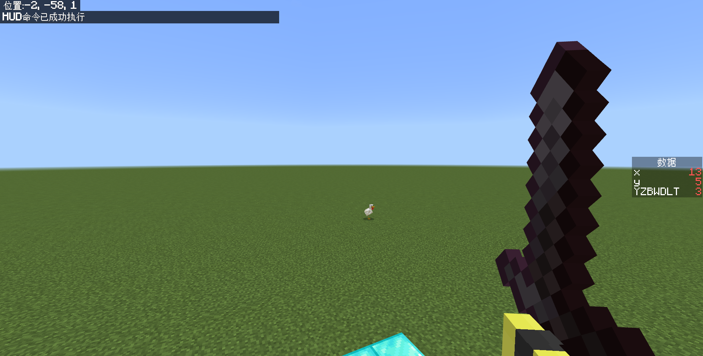

# 2.9.2 屏幕控制命令

上一节，我们已经学习了文本操控命令，了解了如何能够“精彩”地把想要呈现的文本呈现到玩家面前。这一节，我们就来学习一下玩家的屏幕控制。

## 相机命令`/camera`

:::warning[注意]

本部分所介绍的内容可能有一小部分是中国版尚未加入的内容，请注意甄别，以自己的实际体验为准。详情可见[附录：全部命令汇总](/docs/docs/commands/all_commands#camera)。

:::

我们总是会在玩 MC 的时候谈“第一人称视角”、“第三人称视角”等，这些视角以不同的角度观察着同一名玩家的行动，仿佛有一个“跟踪狂”架着一台相机一直观察着你一样。

事实上，在各种大大小小游戏中，尤其是 3D 游戏中，都存在**相机（Camera）** 这个概念。相机负责把游戏中捕捉到的画面传递给屏幕，这样你就能看到游戏中究竟发生了什么。第一人称视角，就是把相机绑定到你所操控的玩家的眼睛上，这样就能模拟出第一人称“我”的感觉；而第三人称视角就是从其他人的角度观察，把相机绑定到玩家眼睛的前面或者后面，模拟出第三人称“他”的感觉。不同游戏中的相机绑定方法也不一样，比如绑定到玩家操控角色的肩部右后方、或者绑定到右侧、等等……

我们可以想一想……相机真的一定就要绑定到玩家身上吗？比如满大街都能看得到的监控摄像头，即使你不在画面里头，这个相机也照常运转。是的，相机其实根本没必要和玩家绑定，绑定到你的眼睛上无非就是方便你操控你正在操控的那个玩家而已。甚至于，相机里头都不一定要有画面——监控摄像头关了，它也依旧是监控摄像头，它至少还是个相机。

到这里，你其实就已经明白了 Minecraft，甚至推广到大部分 3D 游戏的相机大体上是怎么运行的了。在基岩版，控制相机运行的命令叫做`/camera`。它的语法如下：

```text title="/camera的语法" showLineNumbers
camera <玩家: target> clear
camera <玩家: target> fade
camera <玩家: target> fade color <红: int> <绿: int> <蓝: int>
camera <玩家: target> fade time <淡入秒数: float> <持续秒数: float> <淡出秒数: float>
camera <玩家: target> fade time <淡入秒数: float> <持续秒数: float> <淡出秒数: float> color <红: int> <绿: int> <蓝: int>
camera <玩家: target> remove_target
camera <玩家: target> set <预设: string> [默认: default]
camera <玩家: target> set <预设: string> ease <缓动时间: float> <缓动类型: Easing> [默认: default]
camera <玩家: target> set <预设: string> ease <缓动时间: float> <缓动类型: Easing> facing <面向实体: target>
camera <玩家: target> set <预设: string> ease <缓动时间: float> <缓动类型: Easing> facing <面向坐标: x y z>
camera <玩家: target> set <预设: string> ease <缓动时间: float> <缓动类型: Easing> pos <位置: x y z>
camera <玩家: target> set <预设: string> ease <缓动时间: float> <缓动类型: Easing> pos <位置: x y z> facing <面向实体: target>
camera <玩家: target> set <预设: string> ease <缓动时间: float> <缓动类型: Easing> pos <位置: x y z> facing <面向坐标: x y z>
camera <玩家: target> set <预设: string> ease <缓动时间: float> <缓动类型: Easing> pos <位置: x y z> rot <x旋转: value> <y旋转: value>
camera <玩家: target> set <预设: string> ease <缓动时间: float> <缓动类型: Easing> rot <x旋转: value> <y旋转: value>
camera <玩家: target> set <预设: string> entity_offset <x实体偏移: float> <y实体偏移: float> <z实体偏移: float>
camera <玩家: target> set <预设: string> facing <面向实体: target>
camera <玩家: target> set <预设: string> facing <面向坐标: x y z>
camera <玩家: target> set <预设: string> pos <位置: x y z>
camera <玩家: target> set <预设: string> pos <位置: x y z> facing <面向实体: target>
camera <玩家: target> set <预设: string> pos <位置: x y z> facing <面向坐标: x y z>
camera <玩家: target> set <预设: string> pos <位置: x y z> rot <x旋转: value> <y旋转: value>
camera <玩家: target> set <预设: string> rot <x旋转: value> <y旋转: value>
camera <玩家: target> set <预设: string> rot <x旋转: value> <y旋转: value> entity_offset <x实体偏移: float> <y实体偏移: float> <z实体偏移: float>
camera <玩家: target> set <预设: string> rot <x旋转: value> <y旋转: value> view_offset <x视角偏移: float> <y视角偏移: float>
camera <玩家: target> set <预设: string> rot <x旋转: value> <y旋转: value> view_offset <x视角偏移: float> <y视角偏移: float> entity_offset <x实体偏移: float> <y实体偏移: float> <z实体偏移: float>
camera <玩家: target> set <预设: string> view_offset <x视角偏移: float> <y视角偏移: float>
camera <玩家: target> set <预设: string> view_offset <x视角偏移: float> <y视角偏移: float> entity_offset <x实体偏移: float> <y实体偏移: float> <z实体偏移: float>
camera <玩家: target> target_entity <实体: target>
camera <玩家: target> target_entity <实体: target> target_center_offset <x目标中心偏移: float> <y目标中心偏移: float> <z目标中心偏移: float>
```

等等，多少？？30 条语法？这简直比`/execute`还要逆天，人家才 18 条语法而已！但是，不要心急，这条命令反而没有`/execute`难。就像当时分析`/execute`一样，我们来找一些共同点，然后你就会发现这条命令完全就是纸老虎了。

首先，第一个参数全是`玩家`，看来是指定哪个玩家的相机要被更改，这是好理解的。从第二个参数开始判断，很明显这条命令实际上只有一下这么几种用法：`fade`、`set`、`clear`、`remove_target`、`target_entity`了。

### 相机清除语法：`/camera ... clear`

```text title="/camera ... clear的语法" showLineNumbers
camera <玩家: target> clear
```

其实这条命令没什么多说的，如果使用了这条命令，就把相机归回默认状态。很简单的一条命令。

### 相机渐变用法：`/camera ... fade`

单独抽出渐变语法，我们可以看到有以下这么几条：

```text title="/camera ... fade的语法" showLineNumbers
camera <玩家: target> fade
camera <玩家: target> fade color <红: int> <绿: int> <蓝: int>
camera <玩家: target> fade time <淡入秒数: float> <持续秒数: float> <淡出秒数: float>
camera <玩家: target> fade time <淡入秒数: float> <持续秒数: float> <淡出秒数: float> color <红: int> <绿: int> <蓝: int>
```

整体来说，**这条命令是控制玩家相机渐变为某个纯色的命令**。执行效果大概如下图所示：


注意哦！这可不是把玩家关到黑色混凝土做成的小黑屋里，这是真正地把玩家的视角直接改为纯色的黑色。

现在我们来看这些语法。虽然看起来比较长，但是我们可以立刻找到有两段共同点：

| 完整语法 | 简写语法 | 描述 |
| --- | :---: | --- |
| `color <红: int> <绿: int> <蓝: int>` | `<颜色>` | 很显然，这些参数能够修改玩家的屏幕颜色，并遵循 RGB 颜色的组合方法 |
| `time <淡入秒数: float> <持续秒数: float> <淡出秒数: float>` | `<渐变时间>` | 这些参数能够修改相机淡入淡出和持续的时间，类似于`/title` |

所以，这些渐变命令实际上可以简化为下面的命令：

```text title="/camera ... fade的简化语法" showLineNumbers
camera <玩家> fade
camera <玩家> fade <颜色>
camera <玩家> fade <渐变时间>
camera <玩家> fade <渐变时间> <颜色>
```

不难看出，**`fade`是通过调控`渐变时间`和`颜色`来使玩家的屏幕播放不同纯色的**。然而，和`/execute`不同，这些子命令的顺序并不能随心调整，而且可以看出这些语法无非就是简单粗暴的排列组合而已。不指定颜色的时候，默认为黑色（0,0,0）；不指定渐变时间的时候，大约是（1.5s,0s,1.5s）。虽然名义上它们都是必选的，然而，事实上却全是可选的，毕竟你确实可以不指定颜色或不指定渐变时间，这条命令照样能够运行。事实上来讲，这四个语法都可以进一步地简化为

```text title="/camera ... fade的最简化语法" showLineNumbers
camera <玩家> fade [渐变时间] [颜色]
```

:::note[扩展：RGB 简介]

初中物理就已经通过三棱镜实验告诉我们：白光可以通过三棱镜分解为各种不同颜色的光，即白光是各种颜色光的叠加；而黑色则是物体吸收了所有光所呈现出的结果，没有任何光线从这些物质中反射出来。

“三原色”概念就这样被开发出来：任何颜色都可以通过不同强度的三原色所叠加出来，同等强度的三原色的叠加，就是白色。而如果三原色全部消失，就是黑色。在不同领域中，三原色的组合不尽相同，比如有红绿蓝、红黄蓝、甚至黄绿蓝等。我们现实生活中的一些屏幕，例如手机、电脑屏幕，就是通过许多非常细小的红、绿、蓝三色的 LED 灯珠，通过不同强度的电流之后，照射出不同强度的三原色，再叠加之后入射到人眼，形成形形色色的颜色。如果你有硬件条件的话，你可以通过微距相机拍下你的屏幕，你会看到这些颜色的小 LED 灯珠以不同排列方式排列。红绿蓝，也是计算机领域中所使用的三原色的组合，分别取其简写：Red, Green, Blue，所以 RGB 颜色组合方法就是这么出现的。你在一些其他软件上，例如 Photoshop、PowerPoint 等地方可能都看到过基于 RGB 调色的功能。

然而，计算机并不能处理连续的值，哪怕精度再高，计算机所计算的数据也都是由 0 和 1 组成的数据，不可能达到真正的连续。因此，所使用的电流强度、三原色的光强也只能是一个个分立的值。在计算机领域，通常三原色的每个颜色取 256 种不同的强度，这样可以组合出一共 16,777,216 种颜色。如果采用 16 进制，那么 256 种颜色就从十进制的 3 位数压缩到 2 位数（由 00 到 FF，详情请了解有关进制的计算方法）。现在最常用的也更为人所熟知的颜色代码就是这么出现的，例如`#FF00FF`就代表红色（第 1\~2 位）取到最大强度`FF`（255）、绿色（第 3\~4 位）取到最小强度`00`（0）、蓝色（第 5\~6 位）取到最大强度`FF`（255），这样，红色和蓝色组合出的颜色就是紫色，所以`#FF00FF`的含义就是紫色。

在`/camera`命令中，使用的`int`是十进制的，所以范围是从`0`~`255`。

:::

:::tip[实验 2.9-9]

执行下面的命令，体验一下不同参数的相机效果。

- `/camera @s fade color 255 255 255`：白屏
- `/camera @s fade time 3 5 3`：黑屏，渐入 3 秒、保持 5 秒、渐出 3 秒
- `/camera @s fade time 3 5 3 color 0 0 255`：蓝屏，渐入 3 秒、保持 5 秒、渐出 3 秒

:::


这个蓝屏，在蓝下去的那一瞬间是不是感受到了从小被 Windows 蓝屏支配的恐惧？（笑）

### 相机设置视角：`/camera ... set`

接下来才是重头戏。我们来看看设置相机视角的命令`/camera ... set`吧。

<details>

<summary>/camera ... set的语法</summary>

```text showLineNumbers
camera <玩家: target> set <预设: string> [默认: default]
camera <玩家: target> set <预设: string> ease <缓动时间: float> <缓动类型: Easing> [默认: default]
camera <玩家: target> set <预设: string> ease <缓动时间: float> <缓动类型: Easing> facing <面向实体: target>
camera <玩家: target> set <预设: string> ease <缓动时间: float> <缓动类型: Easing> facing <面向坐标: x y z>
camera <玩家: target> set <预设: string> ease <缓动时间: float> <缓动类型: Easing> pos <位置: x y z>
camera <玩家: target> set <预设: string> ease <缓动时间: float> <缓动类型: Easing> pos <位置: x y z> facing <面向实体: target>
camera <玩家: target> set <预设: string> ease <缓动时间: float> <缓动类型: Easing> pos <位置: x y z> facing <面向坐标: x y z>
camera <玩家: target> set <预设: string> ease <缓动时间: float> <缓动类型: Easing> pos <位置: x y z> rot <x旋转: value> <y旋转: value>
camera <玩家: target> set <预设: string> ease <缓动时间: float> <缓动类型: Easing> rot <x旋转: value> <y旋转: value>
camera <玩家: target> set <预设: string> entity_offset <x实体偏移: float> <y实体偏移: float> <z实体偏移: float>
camera <玩家: target> set <预设: string> facing <面向实体: target>
camera <玩家: target> set <预设: string> facing <面向坐标: x y z>
camera <玩家: target> set <预设: string> pos <位置: x y z>
camera <玩家: target> set <预设: string> pos <位置: x y z> facing <面向实体: target>
camera <玩家: target> set <预设: string> pos <位置: x y z> facing <面向坐标: x y z>
camera <玩家: target> set <预设: string> pos <位置: x y z> rot <x旋转: value> <y旋转: value>
camera <玩家: target> set <预设: string> rot <x旋转: value> <y旋转: value>
camera <玩家: target> set <预设: string> rot <x旋转: value> <y旋转: value> entity_offset <x实体偏移: float> <y实体偏移: float> <z实体偏移: float>
camera <玩家: target> set <预设: string> rot <x旋转: value> <y旋转: value> view_offset <x视角偏移: float> <y视角偏移: float>
camera <玩家: target> set <预设: string> rot <x旋转: value> <y旋转: value> view_offset <x视角偏移: float> <y视角偏移: float> entity_offset <x实体偏移: float> <y实体偏移: float> <z实体偏移: float>
camera <玩家: target> set <预设: string> view_offset <x视角偏移: float> <y视角偏移: float>
camera <玩家: target> set <预设: string> view_offset <x视角偏移: float> <y视角偏移: float> entity_offset <x实体偏移: float> <y实体偏移: float> <z实体偏移: float>
```

</details>

我们看到，这 22 条语法全部要求我们指定一个`预设`，也就是相机的运行方式。这里的预设可以选择为：

- `minecraft:first_person`：第一人称
- `minecraft:third_person`：第三人称背面
- `minecraft:third_person_front`：第三人称正面
- `minecraft:follow_orbit`：第三人称，轨道相机
- `minecraft:fixed_boom`：第三人称，锁定视角相机
- `minecraft:free`：自由视角

以上的预设均不能通过 F5 调整视角。相信你现在可能除了三个熟悉的第一和第三人称视角之外，剩下三个都看不懂。这很正常，因为另外三个都需要额外搭配参数才能真正发挥其威力。接下来我们像`fade`那样来看看这里面都支持哪些参数吧。

| 完整语法 | 简写语法 | 描述 |
| --- | :---: | --- |
| `ease <缓动时间: float> <缓动类型: Easing>` | `<缓动>` | 设置相机缓动，稍后我们会介绍更多有关缓动的东西，但总之先知道它是控制相机缓动的 |
| `facing <面向实体: target>`或`facing <面向坐标: x y z>`或`rot <x旋转: value> <y旋转: value>` | `<朝向>` | 设置相机朝向。这三位朋友可都是很眼熟了，见过不止一次了，应该不用再多说什么了吧？ |
| `pos <位置: x y z>` | `<位置>` | 设置相机位置 |

现在我们先不看`view_offset`和`entity_offset`，后面再讲。如果我们只看由上面 3 种子命令（`缓动`、`朝向`、`位置`）组成的语法，就已经占了这条命令的半壁江山了。一共有这些语法：

<details>

<summary>/camera ... set的语法（仅含缓动、朝向、位置）</summary>

```text showLineNumbers
camera <玩家: target> set <预设: string> [默认: default]
camera <玩家: target> set <预设: string> ease <缓动时间: float> <缓动类型: Easing> [默认: default]
camera <玩家: target> set <预设: string> ease <缓动时间: float> <缓动类型: Easing> facing <面向实体: target>
camera <玩家: target> set <预设: string> ease <缓动时间: float> <缓动类型: Easing> facing <面向坐标: x y z>
camera <玩家: target> set <预设: string> ease <缓动时间: float> <缓动类型: Easing> pos <位置: x y z>
camera <玩家: target> set <预设: string> ease <缓动时间: float> <缓动类型: Easing> pos <位置: x y z> facing <面向实体: target>
camera <玩家: target> set <预设: string> ease <缓动时间: float> <缓动类型: Easing> pos <位置: x y z> facing <面向坐标: x y z>
camera <玩家: target> set <预设: string> ease <缓动时间: float> <缓动类型: Easing> pos <位置: x y z> rot <x旋转: value> <y旋转: value>
camera <玩家: target> set <预设: string> ease <缓动时间: float> <缓动类型: Easing> rot <x旋转: value> <y旋转: value>
camera <玩家: target> set <预设: string> facing <面向实体: target>
camera <玩家: target> set <预设: string> facing <面向坐标: x y z>
camera <玩家: target> set <预设: string> pos <位置: x y z>
camera <玩家: target> set <预设: string> pos <位置: x y z> facing <面向实体: target>
camera <玩家: target> set <预设: string> pos <位置: x y z> facing <面向坐标: x y z>
camera <玩家: target> set <预设: string> pos <位置: x y z> rot <x旋转: value> <y旋转: value>
camera <玩家: target> set <预设: string> rot <x旋转: value> <y旋转: value>
```

</details>

我们不管`默认: default`，它只能填写为`default`，修改相机视角为相机文件所指定的默认值。如果你看不懂的话，那就不要用，反正这东西的运行结果通常都不会符合你的预期。

那么，上面的这 16 条语法可以直接简写为

<details>

<summary>/camera ... set的最简语法（仅含缓动、朝向、位置）</summary>

```text showLineNumbers
camera <玩家> set <预设>
camera <玩家> set <预设> <缓动>
camera <玩家> set <预设> <缓动> <朝向>
camera <玩家> set <预设> <缓动> <位置>
camera <玩家> set <预设> <缓动> <位置> <朝向>
camera <玩家> set <预设> <朝向>
camera <玩家> set <预设> <位置>
camera <玩家> set <预设> <位置> <朝向>
```

</details>

可以看到，上面的 16 条语法完全是`<缓动>`、`<朝向>`和`<位置>`三个子命令的暴力排列组合，而且事实上这三个子命令也和`fade`的那两个子命令一样，名义上必选，事实上可选！从功能性上讲，这 16 条语法就进一步简化为

```text title="/camera ... set的最简语法（仅含缓动、朝向、位置）" showLineNumbers
camera <玩家> set <预设> [缓动] [位置] [朝向]
```

但是，先等一下，暂且先不论还没有被我们提及的剩下 6 条语法，我们现在就谈这 16 条语法的话，如果锁定为第一或第三人称视角，怎么才能按照确定的位置和朝向固定相机呢？这不是矛盾了吗？这种顾虑不无道理，然而不要忘了我们可是有 6 种预设！这 16 种语法，实际上是为了自由视角`minecraft:free`而服务的。我们来做一些实验吧！

:::tip[实验 2.9-10]

- `/camera @s set minecraft:first_person`：强制第一人称视角
  - 虽然看起来没什么变化，你可以试一下按 F5，或是在设置里调控一下视角，然后你就会发现它们都不起作用。
- `/camera @s set minecraft:free`：自由视角（默认）。
  - 此时你会发现，你的相机和你操控的玩家之间已经没有任何必然联系。
- `/camera @s set minecraft:free pos 5 -30 5 facing 5 -60 5`：从(5,-30,5)面向(5,-60,5)的相机视角。  
  
- `/camera @s set minecraft:free pos ^-2^2^-4 facing ^^^5`：这是 Wiki 给出的示例，实现越肩视角！
  

:::

想必到了这里，你已经可以理解`<位置>`和`<朝向>`的作用了。

### 相机缓动

下一个问题：`<缓动>`是什么？

如果你有摄影、或者剪辑的经验的话，你应该知道运镜的作用。在刚刚的实验 2.9-10 中，我们的所有相机视角的切换，全部都是非常生硬地瞬间切过去的，没有给玩家留下一点点的反应时间。这未必是一件坏事，然而当我们需要一些镜头的平滑过渡的时候，生硬的切换就很显然不符合我们的要求。可能你会问：那每游戏刻执行一次不行吗？我可以先明确地告诉你答案：行，但是会有一种很严重的不连续感。为了实现连续而平滑的切换，我们就需要**缓动（或渐变，Ease）** 来实现我们的运镜需求。我们来做一个小实验来体会一下缓动的魅力。

:::tip[实验 2.9-11]

先执行`/camera @s clear`，清除你的相机样式，然后执行`/camera @s set minecraft:free ease 5 in_out_sine pos ^-2^2^-4 facing ^^^5`，看看平滑过渡到越肩视角的效果如何！

:::

因为这个缓动过程需要一段视频，这里就不放了，需要你自己来测试。但总而言之，你会看到一段非常高级的运镜效果！在上面的命令中，相比于实验 2.9-10，无非多了一段`ease 5 in_out_sine`而已。其中，`5`的含义你已经清楚，就是缓动的秒数。那么`in_out_sine`是什么呢？

这个东西，叫做**缓动函数（Easing Function）**。缓动函数在动画制作中是很常见的一种函数，它可以允许开发者自定义某些参数随时间而变化的速率。在[缓动函数速查表](https://easings.net/zh-cn)这个网站里，详细地给出了它的应用场景和可用的所有缓动函数，帮助你快速地确定你要使用的缓动函数。

> 现实生活中，物体并不是突然启动或者停止，当然也不可能一直保持匀速移动。就像我们打开抽屉的过程那样，刚开始拉的那一下动作很快， 但是当抽屉被拉出来之后我们会不自觉的放慢动作。或是掉落在地板上的物体，一开始下降的速度很快，接着就会在地板上来回反弹直到停止。

这些缓动函数中，`in_xxx`是在动画的一开始有一个较慢的渐变，但在动画结束的时候往往速度很快，在`/camera`中就表现为一开始运镜较慢，但越来越快；而`out_xxx`则相反，一开始比较快，但最后比较慢；`in_out_xxx`则代表中间过程可能比较快，而开始和结束时都比较慢。


当然，我们还有一种函数，`linear`，为全程的线性变化。如果你觉得其他的缓动函数不好把控，可以考虑使用单纯的线性变化函数`linear`。

:::tip[实验 2.9-12]

依次执行下面的命令，体会不同缓动函数的区别。

```text showLineNumbers
/camera @s clear
/camera @s set minecraft:free ease 2 linear pos ^-2^2^-4 facing ^^^5
/camera @s clear
/camera @s set minecraft:free ease 2 in_out_sine pos ^-2^2^-4 facing ^^^5
/camera @s clear
/camera @s set minecraft:free ease 2 in_sine pos ^-2^2^-4 facing ^^^5
/camera @s clear
/camera @s set minecraft:free ease 2 out_sine pos ^-2^2^-4 facing ^^^5
/camera @s clear
/camera @s set minecraft:free ease 2 in_out_circ pos ^-2^2^-4 facing ^^^5
/camera @s clear
/camera @s set minecraft:free ease 2 in_circ pos ^-2^2^-4 facing ^^^5
/camera @s clear
/camera @s set minecraft:free ease 2 out_circ pos ^-2^2^-4 facing ^^^5
/camera @s clear
/camera @s set minecraft:free ease 2 in_out_bounce pos ^-2^2^-4 facing ^^^5
/camera @s clear
/camera @s set minecraft:free ease 2 in_bounce pos ^-2^2^-4 facing ^^^5
/camera @s clear
/camera @s set minecraft:free ease 2 out_bounce pos ^-2^2^-4 facing ^^^5
```

:::

自由视角相机在许多特效中都大有用途，它可以极大地减少开发者使用命令制作一个视角动画的工作量。因为这是一条全新的命令，各个子命令的实际使用频率不容易统计，但`minecraft:free`的自由视角可以解决绝大部分的相机问题。在后面的练习题中，我们主要会针对自由相机视角进行练习。

通过大量的实验证实，在`set`中的另外两条子命令`view_offset`和`entity_offset`对自由相机视角无效；而所有的子命令对默认的第一、第三人称全部无效。也就是说：

| | `ease` | `facing` | `rot` | `pos` | `view_offset` | `entity_offset` |
| --- | :---: | :---: | :---: | :---: | :---: | :---: |
| `minecraft:first_person` | ❌ | ❌ | ❌ | ❌ | ❌ | ❌ |
| `minecraft:third_person` | ❌ | ❌ | ❌ | ❌ | ❌ | ❌ |
| `minecraft:third_person_front` | ❌ | ❌ | ❌ | ❌ | ❌ | ❌ |
| `minecraft:free` | ✔️ | ✔️ | ✔️ | ✔️ | ❌ | ❌ |

那`view_offset`和`entity_offset`有什么用？我们继续看……

### 更多的第三人称预设：轨道相机

:::warning[版本适用性]

本部分涉及 1.21.40 和 1.21.50 新增的内容。

:::

接下来我们来看看上面没有提到的 6 条`set`语法，它们都是为另外两种第三人称预设而服务的。

其中一种第三人称预设是轨道相机：`minecraft:follow_orbit`。从 Wiki 给出的历史记载中可以看到，这个预设是随着`view_offset`和`entity_offset`一起加入到游戏的实验性玩法“创作者相机：新的第三人称视角”里的。看来这两个子命令应该是只适用于这两种第三人称预设的。

实际上，它支持的语法不止 6 种，经过大量的实验可以知道，准确来说`minecraft:follow_orbit`支持 8 种语法。

```text title="/camera的语法（适用于minecraft:follow_orbit）" showLineNumbers
camera <玩家: target> set minecraft:follow_orbit
camera <玩家: target> set minecraft:follow_orbit entity_offset <x实体偏移: float> <y实体偏移: float> <z实体偏移: float>
camera <玩家: target> set minecraft:follow_orbit rot <x旋转: value> <y旋转: value>
camera <玩家: target> set minecraft:follow_orbit rot <x旋转: value> <y旋转: value> entity_offset <x实体偏移: float> <y实体偏移: float> <z实体偏移: float>
camera <玩家: target> set minecraft:follow_orbit rot <x旋转: value> <y旋转: value> view_offset <x视角偏移: float> <y视角偏移: float>
camera <玩家: target> set minecraft:follow_orbit rot <x旋转: value> <y旋转: value> view_offset <x视角偏移: float> <y视角偏移: float> entity_offset <x实体偏移: float> <y实体偏移: float> <z实体偏移: float>
camera <玩家: target> set minecraft:follow_orbit view_offset <x视角偏移: float> <y视角偏移: float>
camera <玩家: target> set minecraft:follow_orbit view_offset <x视角偏移: float> <y视角偏移: float> entity_offset <x实体偏移: float> <y实体偏移: float> <z实体偏移: float>
```

这里，我们把`<预设: string>`写为了`minecraft:follow_orbit`。类似地，我们分别把其中重复的子命令提取出来：

| 完整语法 | 简写语法 | 描述 |
| --- | :---: | --- |
| `rot <x旋转: value> <y旋转: value>` | `<rot朝向>` | 相机旋转角度 |
| `entity_offset <x实体偏移: float> <y实体偏移: float> <z实体偏移: float>` | `<实体偏移>` | 相机焦点相对于玩家位置的偏移 |
| `view_offset <x视角偏移: float> <y视角偏移: float>` | `<视角偏移>` | 相机焦点相对于玩家视角的偏移 |

| | `ease` | `facing` | `rot` | `pos` | `view_offset` | `entity_offset` |
| --- | :---: | :---: | :---: | :---: | :---: | :---: |
| `minecraft:follow_orbit` | ❌ | ❌ | ✔️ | ❌ | ✔️ | ✔️ |
| `minecraft:fixed_boom` | ❌ | ❌ | ✔️ | ❌ | ✔️ | ✔️ |

等下，不知道你发现没有：`facing`去哪儿了？其实，经过实验，这个子命令并不适用于这个预设。然后，我们把上面的子命令提取出来得到

```text title="/camera的简化语法（适用于minecraft:follow_orbit）" showLineNumbers
camera <玩家: target> set minecraft:follow_orbit
camera <玩家: target> set minecraft:follow_orbit <实体偏移>
camera <玩家: target> set minecraft:follow_orbit <视角偏移>
camera <玩家: target> set minecraft:follow_orbit <视角偏移> <实体偏移>
camera <玩家: target> set minecraft:follow_orbit <rot朝向>
camera <玩家: target> set minecraft:follow_orbit <rot朝向> <实体偏移>
camera <玩家: target> set minecraft:follow_orbit <rot朝向> <视角偏移>
camera <玩家: target> set minecraft:follow_orbit <rot朝向> <视角偏移> <实体偏移>
```

确认过眼神——又是三条子命令的暴力排列组合，掌握这些子命令就掌握了这条命令。所以这命令真没有那么神秘吧？我们来做两个实验。

:::tip[实验 2.9-13]

执行下面的命令，体验轨道相机预设的运作方式。在执行一条命令之后，可以转转视角体验一下。

```text showLineNumbers
camera @s set minecraft:follow_orbit
camera @s set minecraft:follow_orbit rot 0 0
camera @s set minecraft:follow_orbit rot 90 0
camera @s set minecraft:follow_orbit entity_offset 1 0 0 
camera @s set minecraft:follow_orbit entity_offset 0 1 0 
camera @s set minecraft:follow_orbit entity_offset 0 0 1 
camera @s set minecraft:follow_orbit view_offset 1 0
camera @s set minecraft:follow_orbit view_offset 0 1
```

执行`/camera @s set minecraft:follow_orbit rot 90 0 view_offset 2 2`后的效果：


:::

你可能已经注意到了一点：在这里，更改`rot`参数会直接导致玩家的朝向也随之变化。这是因为，虽然`/camera`只调控相机，然而作为一种特殊的第三人称视角，相机朝向和玩家朝向是绑定的，所以更改相机朝向的同时也会改变玩家朝向。

请注意：该命令的`rot`解析疑似存在问题。使用波浪线表述的情况下，无论写为何值（哪怕是`~~`），都会导致玩家的水平朝向顺时针旋转 90°，而竖直朝向无变化。读者在应用该命令时，应尽可能避免使用`~~`写法，除非有所需要。

### 更多的第三人称预设：锁定视角

:::warning[版本适用性]

本部分涉及 1.21.70 新增的内容。

:::

另一种第三人称预设，就是锁定视角`minecraft:fixed_boom`。它和`minecraft:follow_orbit`其实很类似，不同点在于它不能调控视角，仿佛使用了`/inputpermission`命令禁用了`camera`权限一样。

:::tip[实验 2.9-14]

执行下面的命令，体验锁定视角预设的运作方式。在执行一条命令之后，可以转转视角体验一下。

```text showLineNumbers
camera @s set minecraft:fixed_boom
camera @s set minecraft:fixed_boom rot 0 0
camera @s set minecraft:fixed_boom rot 90 0
camera @s set minecraft:fixed_boom rot 0 45
```

:::

到此，我们就把`set`的所有语法都给研究完了，其实只涉及到 6 条子命令，但是组合出了 22 条语法而已。其中还**当属自由视角的用途最为广泛且实用**。在实际工程中，使用自由视角已完全够用。在结尾的总结部分，我们还会带你总结子命令与预设的可用关系。

### 聚焦实体的相机：`/camera ... target_entity`与`/camera ... reset_target`

:::warning[版本适用性]

本部分涉及 1.21.60 新增的内容。

:::

现在我们来看`/camera`的最后三个语法：

```text title="/camera的语法" showLineNumbers
/camera <玩家: target> remove_target
/camera <玩家: target> target_entity <实体: target>
/camera <玩家: target> target_entity <实体: target> target_center_offset <x目标中心偏移: float> <y目标中心偏移: float> <z目标中心偏移: float>
```

经过实验知道，**这三个语法必须搭配自由相机视角`minecraft:free`才能使用**。我们可以假设一个特定位置的自由视角，然后看看这些语法都有什么用途。

:::tip[实验 2.9-15]

将自由相机假设在自己的头上：

```text
/camera @s set minecraft:free pos ~~10~
```

然后，执行下面的命令

```text
/camera @s target_entity @s
```

然后，尝试着跑动跑动，观察现象。

:::

通过实验我们观测到，相机的焦点会一直指向玩家的位置，这就是`target_entity`所带来的效果。如果改写为`target_entity @e[c=1,type=!player]`，就将观测玩家附近的一个生物。


而`target_center_offset`用法，则是指定相机观测位置相对于特定实体位置的偏移如何。

`remove_target`语法和`target_entity`是对应的，代表清除玩家相机的跟踪实体的状态。需要注意的是，跟踪目标是持续的，哪怕已经撤除了自由视角相机。要想在使用新的自由视角时不再跟踪实体，就必须使用`remove_target`解除跟踪。

## 相机摇晃命令`/camerashake`

:::note[备注]

如果你的相机没有归位的话，请先用`/camera @s clear`使相机归位。

:::

相比于`/camera`的群魔乱舞的语法，`/camerashake`就要友好的多了。它会将玩家的相机按照一定的强度进行摇晃。想象一下你是一台监控摄像头，现在发生了地震，你会随着建筑的轻微震动而开始震动，这就是相机摇晃的效果。它的语法为：

```text title="/camerashake的语法" showLineNumbers
/camerashake add <玩家: target> [强度: float] [秒数: float] [摇晃类型: CameraShakeType]
/camerashake stop [玩家: target]
```

可见，这条命令有两个语法。其中`stop`猜也猜得到，它负责停止摇晃相机。而`add`就是添加一种摇晃了。我们来做个实验简单体验一下这三个参数：

:::tip[实验 2.9-16]

注意！如果感觉不适，请立刻停止游戏。

执行下面的命令以体验不同的强度的效果：

```text showLineNumbers
/camerashake add @s
/camerashake add @s 1
/camerashake add @s 10
```

执行下面的命令以体验不同的时长的效果：

```text showLineNumbers
/camerashake add @s 0.5 0.5
/camerashake add @s 0.5 1
/camerashake add @s 0.5 5
```

执行下面的命令以体验不同的类型的效果：

```text showLineNumbers
/camerashake add @s 0.5 1 positional
/camerashake add @s 0.5 1 rotational
```

:::

利用这条命令，可以模拟地震、地面塌陷等等不同的效果。不过，这条命令必须在玩家开启了“视角摇晃”设置后才有效。

## HUD 显示命令`/hud`

:::warning[版本适用性]

本部分涉及 1.20.80 新增的内容。

:::

HUD 是平视显示器（Heads-Up Display）的缩写。在你屏幕中的可见的 UI 元素都属于 HUD 的一部分，例如物品栏、生命值、经验条、十字准心、聊天栏等。关于 HUD 的更多信息，详见[平视显示器 - 中文 Minecraft Wiki](https://zh.minecraft.wiki/w/平视显示器)。

`/hud`可以控制这些元素的可见性。语法如下：

```text title="/hud的语法" showLineNumbers
hud <玩家: target> <hide|reset> [HUD元素: HudElement]
```

隐藏或恢复`玩家`的`HUD元素`。这条命令在一些特定的场景下（比如过场动画）可能会有用。

:::tip[实验 2.9-17]

- 执行命令`/hud @s hide hotbar`，你会发现你的快捷栏不再显示。  
  
- 执行命令`/hud @s hide crosshair`，十字准心也不再显示。  
  
- 执行命令`/hud @s hide all`，隐藏所有 HUD。  
  
  - 其实，还是可以看到有一些内容并没有隐藏，这是因为`/hud`只能隐藏自己支持的项目，不能把 UI 中的每一个元素都隐藏。
- 最后，执行命令`/hud @s reset all`，复原所有 HUD。
  

:::

关于`/hud`支持哪些项目，你可以在自动补全中查看，或者在[命令/hud - 中文 Minecraft Wiki](https://zh.minecraft.wiki/w/命令/hud) 中查看。

## *迷雾命令`/fog`

迷雾是一种能够影响玩家视野的机制。关于迷雾的机制，我们目前暂时不会多说什么，在模块 2 你就会看到迷雾的基本运行原理。你只需要知道的是，迷雾可以有效地降低玩家面向远处的能见度，例如在下界的绯红森林中会显示红色的迷雾，阻止玩家看到更远处的地形。

我们可以使用`/fog`来调用这些迷雾。`/fog`采用堆栈的方式来自定义对玩家显示的迷雾。

比如，目前玩家显示的是默认的迷雾，此时对玩家显示一个新的迷雾`a`，我们说这叫做**推入（Push）迷雾`a`**，玩家当前显示的迷雾的列表就变为了`[a]`；如果再显示一个新的迷雾`b`，也就是推入迷雾`b`，玩家当前显示迷雾的列表就变为`[a,b]`；同理地，再推入一个新的迷雾`c`，就变为`[a,b,c]`，以此类推。推入同一种迷雾也是可以的，比如再推入两次`c`，就变为`[a,b,c,c,c]`。

这种迷雾栈有什么用呢？答案在于移除迷雾的时候。如果这时候我们要移除刚刚推入的`a`，这个列表就变为`[b,c,c,c]`，这时候玩家显示的还是最新推入的`c`。但如果要移除`c`的时候，我们就要问：移除哪个？对于这种迷雾栈，我们有两个选择。第一种叫做**弹出（Pop）迷雾**，也就是移除第一个符合条件的迷雾，比如弹出迷雾`c`，这时候列表就剩下`[b,c,c]`。第二种叫做**移除（Remove）所有符合的迷雾**，比如移除`c`，就把栈中所有的迷雾全部移除掉，这时候就剩下`[b]`，此时对玩家也改为显示迷雾`b`。

知道了迷雾命令的运行原理之后，我们再来看语法便没有那么难了。

```text title="/fog的语法" showLineNumbers
fog <玩家: target> push <迷雾设定ID: string> <用户提供ID: string>
fog <玩家: target> <pop|remove> <用户提供ID: string>
```

其中，`用户提供ID`就是你自定义的一个标记名，例如确实可以标记为`a`，不过我们一向建议你使用意义明确且简洁的 ID，并使用驼峰命名法或下划线命名法。唯一的问题在于：`迷雾设定`是个什么东东？对于这个问题，我们建议你先不用思考那么多。所有的迷雾设定都在[命令/fog - 中文 Minecraft Wiki](https://zh.minecraft.wiki/w/命令/fog) 里面，直接拿来用就行。我们在模块 2 就会学到迷雾设定，这条命令搭配资源包才能发挥出真正的威力。

> 事实上，大部分的迷雾设置都只会影响水中的迷雾，只有下界和末地的生物群系对应的迷雾ID才会影响天边交界处的颜色。—— Wiki

---

## 总结

这一节终于要结束啦！我们再来回顾一下这一节所学习的知识。这一节，我们主要讲了相机命令`/camera`、及其相关命令（例如`/camerashake`和`/fog`（非重点）），此外还学习了`/hud`。在这些命令中，唯独`/camera`是比较难的，所以我们在这里为你专门总结一下`/camera`的语法结构和用法。

### `/camera`

`/camera`一共有 30 条语法，然而其中大部分的内容都是重复出现的字段，不难发现这些结构是类似于`/execute`的子命令，所以我们同样定义其为`/camera`的子命令。为简单起见，下面把`/camera`涉及的所有子命令按照下面的方式简写：

| 完整语法 | 简写语法 | 可用用法 | 备注 |
| --- | :---: | :---: | --- |
| `color <红: int> <绿: int> <蓝: int>` | `<颜色>` | `fade` | |
| `time <淡入秒数: float> <持续秒数: float> <淡出秒数: float>` | `<渐变时间>` | `fade` | |
| `ease <缓动时间: float> <缓动类型: Easing>` | `<缓动>` | `set` | |
| `facing <面向实体: target>`或`facing <面向坐标: x y z>` | `<facing朝向>` | `set` | |
| `rot <x旋转: value> <y旋转: value>` | `<rot朝向>` | `set` | |
| `pos <位置: x y z>` | `<位置>` | `set` | |
| `entity_offset <x实体偏移: float> <y实体偏移: float> <z实体偏移: float>` | `<实体偏移>` | `set` | 仅 1.21.40+ |
| `view_offset <x视角偏移: float> <y视角偏移: float>` | `<视角偏移>` | `set` | 仅 1.21.50+ |
| `target_center_offset <x目标中心偏移: float> <y目标中心偏移: float> <z目标中心偏移: float>` | `<目标中心偏移>` | `target_entity` | 仅 1.21.60+ |

按照最简写法来表示的话，这 30 条语法可以简化为

```text title="/camera的最简语法" showLineNumbers
## 用法1（重要）：清除玩家的自定义相机
camera <玩家> clear

## 用法2（重要）：使玩家的自定义相机渐变到某个颜色再渐变回来
camera <玩家> fade [渐变时间] [颜色]

## 用法3（重要）：使玩家的自定义相机按照特定的缓动动画移动到特定位置和朝向（只适用于minecraft:free预设）
camera <玩家> set <预设> [缓动] [位置] [facing朝向|rot朝向]

## 用法4：使玩家的轨道相机改为特定的朝向，并且使用特定的偏移（只适用于minecraft:follow_orbit和minecraft:fixed_boom）
camera <玩家> set <预设> [rot朝向] [视角偏移] [实体偏移]

## 用法5：使自由视角相机锁定一个实体焦点
camera <玩家> target_entity <实体> [目标中心偏移]

## 用法6：移除实体焦点
camera <玩家> remove_target
```

**我们希望读者额外注意：这些最简写法只是为了让你了解`/camera`可以调控的子命令，例如`[缓动] [位置] [朝向]`要表达的含义是：你可以不指定这三个子命令的一项或若干项，这条命令依然能够运行。但是必须按照这个顺序来写**。

:::warning[版本适用性]

其中，第 4~6 条用法仅限高版本（1.21.40+）版本使用，详见上文的子命令表。

:::

使用`/camera ... set`用法的时候，需要选择一个相机预设。除了我们所熟知的第一人称和第三人称的三个视角外，还有：

- 自由视角相机`minecraft:free`，可以随心所欲地设定相机的位置和朝向，以及利用缓动制作运镜动画；
- 轨道相机`minecraft:follow_orbit`，是一种特殊的第三人称相机，能够调整一些参数使其在第三人称的情况下有所改进；
- 锁定视角`minecraft:fixed_boom`，是一种特殊类型的轨道相机（也是第三人称相机），不同点在于它是锁定视角的。

上面涉及到的所有子命令，并不都适用于所有的预设。经过大量的实验，所有预设可用的（有效的）子命令如下表所示。

| | `缓动` | `facing` | `rot` | `位置` | `实体偏移` | `视角偏移` |
| --- | :---: | :---: | :---: | :---: | :---: | :---: |
| `minecraft:first_person` | ❌ | ❌ | ❌ | ❌ | ❌ | ❌ |
| `minecraft:third_person` | ❌ | ❌ | ❌ | ❌ | ❌ | ❌ |
| `minecraft:third_person_front` | ❌ | ❌ | ❌ | ❌ | ❌ | ❌ |
| `minecraft:follow_orbit` | ❌ | ❌ | ✔️ | ❌ | ✔️ | ✔️ |
| `minecraft:fixed_boom` | ❌ | ❌ | ✔️ | ❌ | ✔️ | ✔️ |
| `minecraft:free` | ✔️ | ✔️ | ✔️ | ✔️ | ❌ | ❌ |

### 其他命令

| 命令 | 含义 | 备注 |
| --- | --- | --- |
| `/camerashake add <玩家: target> [强度: float] [秒数: float] [摇晃类型: CameraShakeType]` | 对`玩家`施加`秒数`秒的、强度为`强度`的`摇晃类型`视角摇晃 | |
| `/camerashake stop [玩家: target]` | 立刻停止`玩家`的视角摇晃 | |
| `/hud <玩家: target> <hide\|reset> [HUD元素: HudElement]` | 隐藏或恢复`玩家`的`HUD元素` | |

## 练习

:::info[练习 2.9-2]

1. 播放一个 RGB 组合为(11,45,14)，淡入 1 秒，保持 9 秒，淡出 1 秒的`/camera`转场（喜）
2. 将相机视角切换为第三人称背面。
3. 将相机视角按照正弦淡入淡出（`in_out_sine`）的缓动函数，缓动到(17,-24,89)的位置上，并面向(17,-24,95)。
4. 将相机视角按照二次方淡入（`in_quad`）的缓动函数，缓动到(17,-24,89)的位置上，旋转角度(90,0)。
5. 将相机视角按照线性（`linear`）的缓动函数，缓动到(17,-24,89)的位置上，并面向(17,-60,89)。
6. 施加一个时长为 6 秒、强度为 1 的角度式（`rotational`）相机摇晃。
7. （中国版玩家选做）隐藏血条。
8. 当`time.timeline`为`1060`时，将所有玩家的相机视角在 3 秒内按照二次方淡入淡出的缓动函数，缓动到(-237,33,130)的位置上，并面向(-247,35,130)。然后，当`time.timeline`为`1420`时，将所有玩家的相机视角在 3 秒内按照二次方淡入淡出的缓动函数，缓动到玩家眼部前方 0.5 格的位置上，并和玩家朝向一致。然后，在`time.timeline`为`1460`时，清除玩家的视角并将玩家的相机和移动权限复原。（题目基于《冒险世界：筑梦》命令系统，有删改）  

    ```text title="每游戏刻执行，命令条数要求固定" showLineNumbers


    ```

:::

<details>

<summary>练习题答案</summary>

1. `/camera @s fade time 1 9 1 color 11 45 14`，注意`time`必须写在`color`前面，别被这条命令臭懵了。>:)
2. `/camera @s set minecraft:third_person`
3. `/camera @s set minecraft:free ease 3 in_out_sine pos 17 -24 89 facing 17 -24 95`
4. `/camera @s set minecraft:free ease 3 in_quad pos 17 -24 89 rot 90 0`
5. `/camera @s set minecraft:free ease 3 linear pos 17 -24 89 facing 17 -60 89`
6. `/camerashake add @s 1 6 rotational`
7. `/hud @s hide health`

8. ```text title="每游戏刻执行，命令条数要求固定" showLineNumbers
   execute if score timeline time matches 1060 run camera @a set minecraft:free ease 3 in_out_quad pos -237 33 130 facing -247 35 130
   execute if score timeline time matches 1420 as @a at @s anchored eyes run camera @a set minecraft:free ease 3 in_out_quad pos ^^^0.5 facing ^^^1
   execute if score timeline time matches 1460 run camera @a clear
   execute if score timeline time matches 1460 run inputpermission set @a camera enabled
   execute if score timeline time matches 1460 run inputpermission set @a movement enabled
   ```

</details>

import GiscusComment from "/src/components/comment/giscus.js"

<GiscusComment/>
