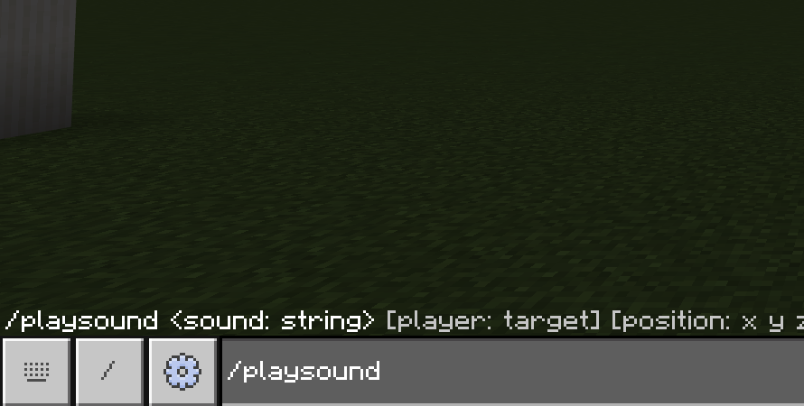
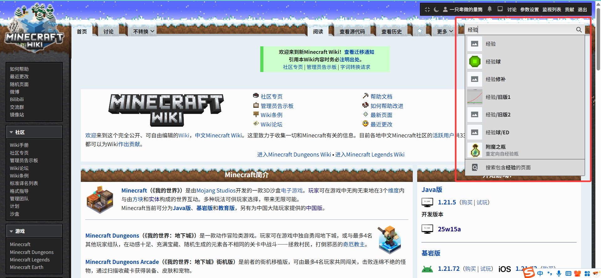
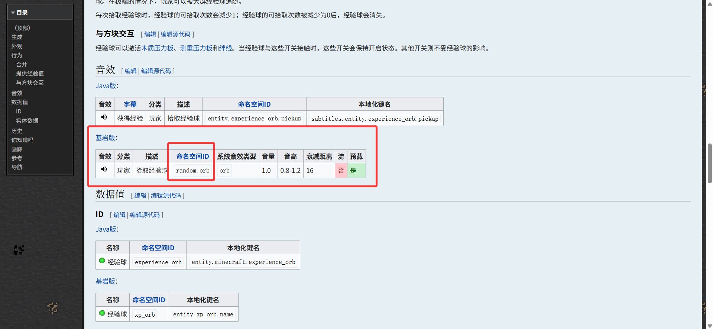
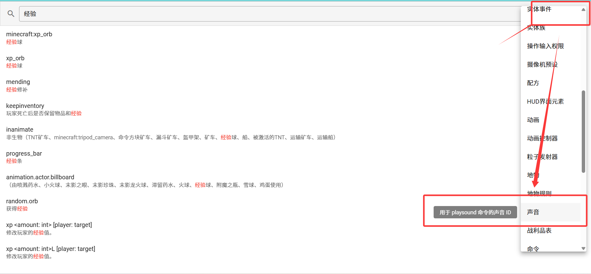
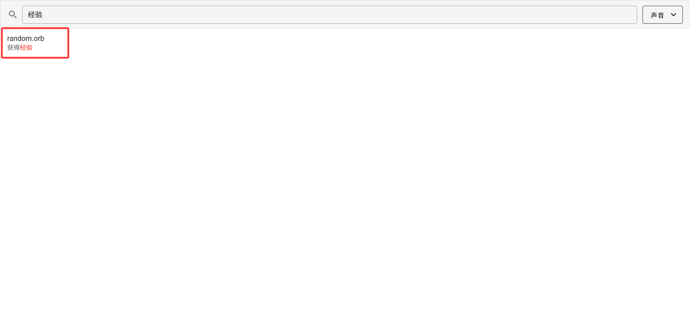
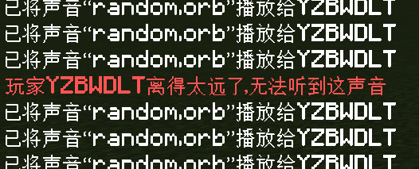
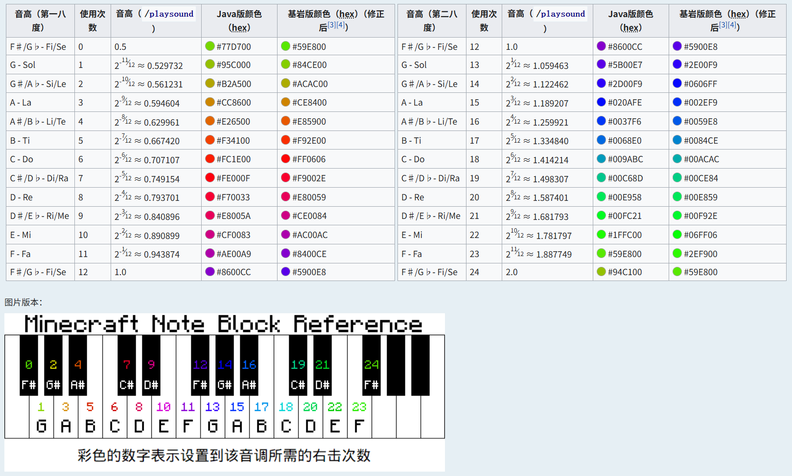
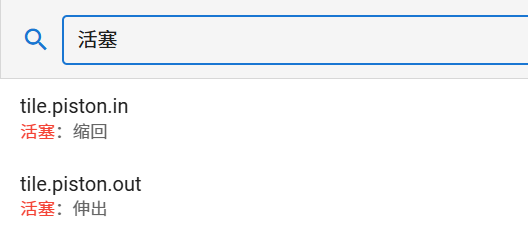
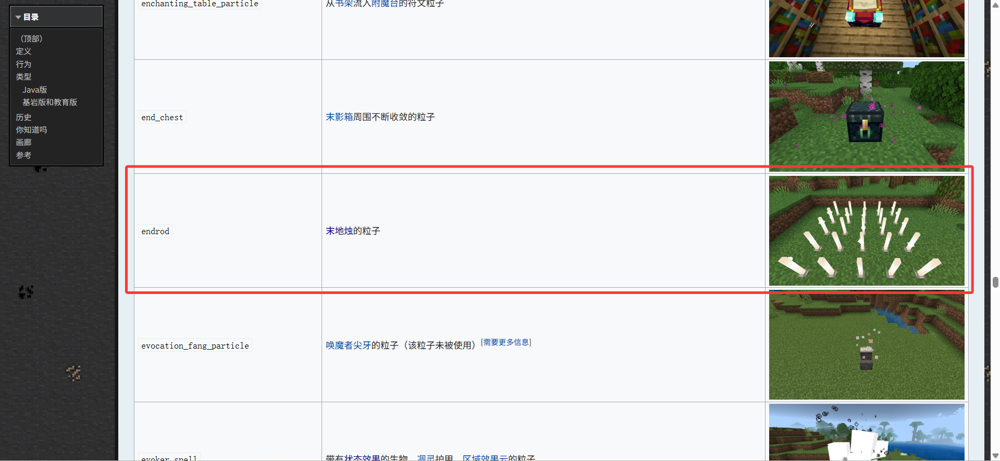
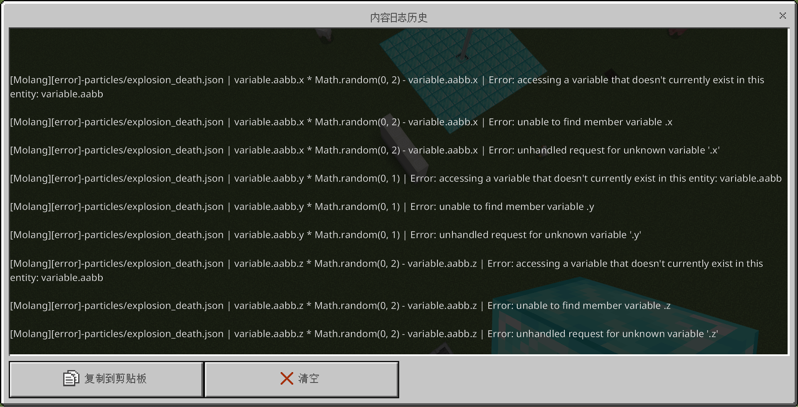

# 2.9.3 音效与粒子命令

这一节，我们来学习一些其他的特效手段，也就是经典的声音和粒子。

## 控制音效

音效是一个游戏的重要组成部分，画面和文字如果搭配音效，就可以有很出色的反馈了。在 Minecraft 中，也存在各种形形色色的音效。我们接下来就来介绍一下如何对玩家播放音效和如何对玩家停止播放音效。

### 播放音效的命令`/playsound`

`/playsound`是用来对玩家播放音效的命令。它的语法为

```text title="/playsound的语法" showLineNumbers
/playsound <音效: string> [玩家: target] [位置: x y z] [音量: float] [音调: float] [最低音量: float]
```

只有一个语法，还是很简单的哦。但是，获取音效却并不是什么简单的事情。我们可以看到在打出`/playsound`之后，没有任何自动补全。



这是因为，`/playsound`对应的音效是一种资源包决定的客户端行为，而这种枚举值一律没有自动补全。这句话暂时看不懂也不要紧，在模块 2 你就能看懂了。既然没有自动补全，我们该怎么办呢？

一个办法是，我们可以找 Wiki 的对应条目，获取到音效 ID。例如，经验球的音效和升级的音效是比较常用的，我们不知道该填什么的时候，可以在 Wiki 中搜索“经验球”的相关条目：



点一下经验球这个条目进去看看有没有我们需要的信息……



太好了！看来确实有，这个命名空间 ID 正是我们需要的！我们看到它的 ID 是`random.orb`，所以只需要在游戏内写入`/playsound random.orb`，就可以向玩家播放经验球的音效了。

另一个办法是，我们可以借助社区的力量！在前些年，一款安卓软件“命令助手”是很流行的。其开发者 ProjectXero 不仅开发了这款软件，还开发了一款可以快捷查询所有 ID 的网站：[MCBEID 查询表](https://ca.projectxero.top/idlist/)。我们要找音效的话，先在右上角指定寻找声音：



然后可以直接找播放经验的相关条目：



看，一下子就找到了！这个网站建议收藏下来，对你可能很有帮助。未来，在使用 Visual Studio Code 写函数的时候，我们还会了解到更多的自动补全的方法。

:::tip[实验 2.9-18]

播放末影龙吼叫的声音。在[中文 Minecraft Wiki](https://zh.minecraft.wiki)或[MCBEID 查询表](https://ca.projectxero.top/idlist/)里面查询声音，然后代入到`/playsound (音效ID)`中。在没有找到答案并实验成功之前，不要看下面的答案！

**警告！末影龙的麦很炸！播放音效之前务必调小音量（但不用调成零）！不要怪我们没有警告你！**

<details>

<summary>答案</summary>

`/playsound mob.enderdragon.growl`

</details>

:::

解决了音效 ID 的问题之后，剩下的问题就简单了。

`玩家`自不必多说，就是指定谁能听到这个音效。

`位置`则指代声音播放的位置，通常情况下`位置`离玩家越远，这个音效就越难听清（其实有例外，但目前请读者先这么理解吧），远到一定距离的时候，这条命令甚至会报错：



所以，**一般情况下，我们想要让玩家听到音效，通常都需要套一个`/execute`，将执行位置改为玩家的位置，再播放音效，玩家才容易听见**。

`音量`一般就设成 1 即可。虽然音量可以事实上地增大玩家可以听见声音的范围（也就是可闻范围），但是增大音量到 1.0 以上并不会再实际地增大音量了，只是增大范围而已。读者可以试一试`/playsound random.orb`和`/playsound random.orb ^^^20 @s 100000`的音量差别，差距是相当明显的，所以一般不用这种方法，一般采用的方法还是`/execute as @a at @s run playsound ...`。

`音调`则是控制音效的音调的，默认是 1，调整为小于 1 的值会拉长音效，而大于 1 则缩短音效。许多音效在更改了音调之后，都会有一些很神奇的音效表现。其实，有时候在 Minecraft 里面调音，本质上就是在调这个音调，尤其是在播放音符盒的音效的时候，调这东西还是一门学问，有讲究的哦。读者如果感兴趣，甚至可以尝试结合`/execute`、`/scoreboard`和这篇文献：[音符盒 - 中文 Minecraft Wiki](https://zh.minecraft.wiki/w/音符盒#用途)，在学习了命令方块和函数之后自己写一个红石音乐！



:::tip[实验 2.9-19]

分别执行命令`/playsound random.levelup @s ~~~ 1 1`、`/playsound random.levelup @s ~~~ 1 2`、`/playsound random.levelup @s ~~~ 1 0.5`，听听不同音调的升级音效是什么表现吧！

:::

至于`最小音量`，经过实际的试验之后……没什么用，放弃吧。它并不能起到你想象中的那个最低音量的作用。

所以，使用这条命令，主要要求我们能够查找想要的音效 ID，以及特定的音调信息，至于位置什么的就可以交给`/execute`来搞定。要多听，多试，才能找到你心目中的音效哦。

读者应注意：使用`/playsound`音效的时候是可能会叠加的，在播放长音效甚至音乐的时候要尤其注意。

### 停止音效的命令`/stopsound`

`/stopsound`就是停止对玩家播放音效。例如如果你嫌活塞的声音太吵，或者不想让玩家听到游戏 BGM 的声音，就可以考虑用这条命令了。它的语法也很简单：

```text title="/playsound的语法" showLineNumbers
/stopsound <玩家: target> [音效: string]
```

停止对`玩家`播放的`音效`。应该不用多说什么了吧？例如，停止活塞的音效就是`/stopsound @a tile.piston.in`和`/stopsound @a tile.piston.out`。当然啦，灵活使用查询表或 Wiki 查这些 ID！



### 播放音乐的命令`/music`

如果你有播放长音乐的需求，那么`/music`就非常适合你。相比于`/playsound`，`/music`有一套非常成熟的音乐管理机制，它可以循环播放音乐，或者队列播放音乐，并且能够自行判断音乐何时结束播放，然后自动播放下一个音乐。使用`/music`能够保证同时只播放一个音乐，而不会像`/playsound`一样可能导致重叠。

不过，如果你以为`/music`都是优点的话，那你可就错了。根据实验可知，**`/music`只支持播放音乐和唱片机类型的音效**，也就是说，像是那些杂碎的音效比如活塞、末影龙、经验球等，都是不生效的。而且，有时候在两段音乐的过渡部分，我们可能还是需要一小段重叠，来让整段音乐听起来更加平滑的。此外，`/music`是对所有玩家生效，所有玩家都必须强制听你点的歌。所以，`/music`虽然在一定程度上是很强大的，可它也并不是万能的。

我们现在来看它的语法：

```text title="/music的语法" showLineNumbers
/music play <音轨名: string> [音量: float] [淡入淡出秒数: float] [play_once|loop]
/music queue <音轨名: string> [音量: float] [淡入淡出秒数: float] [play_once|loop]
/music stop [淡出秒数: float]
/music volume <音量: float>
```

首先，语法 3 和语法 4 自不必多说，显然是停止音乐和调整音量的语法。而且，在停止音乐后，在队列中的音乐都一并停止。

第一条语法，则是立刻播放一个音乐或唱片。后面的`play_once`和`loop`分别代表是只播放一次还是循环播放。

第二条语法，是将一个音乐或唱片加入到播放队列中去，等到正在播放的音乐已经放完了再放这首。很显然地，你不能在一首正在循环播放的歌曲后面添加队列，因为正在循环播放的歌曲永远不会停止循环，就轮不到下一首歌，所以这么做是没有意义的。

因为原版可用的音乐或唱片并不多，我们这里就不做实验演示了。在模块 2 我们学习了如何自定义音乐之后，再回过头来看看这条命令。

## 释放粒子的命令`/particle`

最后，就是释放粒子的命令了。要释放一个粒子，需要使用`/particle`命令：

```text title="/particle的语法" showLineNumbers
/particle <粒子效果: string> [位置: x y z]
```

在`位置`释放`粒子效果`。和`/playsound`类似，可用的粒子也需要查表。Wiki 上的[粒子 - 中文 Minecraft Wiki](https://zh.minecraft.wiki/w/粒子#基岩版和教育版)为你提供了一个可用的粒子表格，**但其中的`ID名`必须在前面加上`minecraft:`才能使用**。在模块 2 你就会知道，这叫做**命名空间（Namespace）**。[MCBEID 查询表](https://ca.projectxero.top/idlist/)也可以用来查询。

:::tip[实验 2.9-20]

执行命令`/particle minecraft:endrod ~~-5~`，这条命令会在你脚下 5 格的位置生成末地烛的粒子。记住这个粒子，它很常用！



:::

不过，因为基岩版粒子的运行机制，它注定无法做到像 Java 版那么自由。基岩版的粒子都是通过资源包写的，很多粒子都需要充足的上下文信息才能正确显示，否则就会显示异常。例如，在释放粒子`minecraft:death_explosion_emitter`的时候，游戏就通过内容日志报了一大堆错误：



如果你不知道这是什么，不要紧，知道这并不是一个什么好的征兆，就足够了。这就是因为命令不能提供粒子所需的上下文所导致的。

---

## 总结

恭喜你！在学习完这一节之后，不光是了解了所有特效命令，你此时**也已经建立了一套相对完整的命令体系，基本上常用的命令你已经都很熟悉了**。在 2.10 以及后续的教程中，我们会渐渐了解那些我们还没有讲过的更*高级*一些的命令，也就是和附加包联动的命令。此外，我们在后面也将要学到红石系统、结构方块和最重要的命令方块，有了这些东西，你就可以真正地开始投入到项目（尤其是地图）的开发中去了！

到这里，不知道你有没有看出命令系统那很大的局限性。我们最近总是在说“等到模块 X 你就了解了……”这种话，其实，虽然命令系统的确能做到很多事情，但是局限性也确实是真的大，如果你真正地参与一个实际工程你就会明白，很多你想做的事情都会因为命令系统本身做不到，而被迫改方向或者写得非常复杂。所以，在后面，我们会看到更多可用且好用的工具向我们招手。

我们来回顾一下本节所学的命令：

| 命令 | 含义 | 备注 |
| --- | --- | --- |
| `/playsound <音效: string> [玩家: target] [位置: x y z] [音量: float] [音调: float] [最低音量: float]` | 对`玩家`在`位置`播放音量为`音量`、音调为`音调`、（可闻范围内）最低音量为`最低音量`、音效 ID 为`音效`的音效 | |
| `/stopsound <玩家: target> [音效: string]` | 停止对`玩家`播放`音效` | |
| `/music play <音轨名: string> [音量: float] [淡入淡出秒数: float] [play_once\|loop]` | 对全体玩家立刻播放音乐`音轨名`，音量为`音量`，在刚开始或即将结束时以`淡入淡出秒数`秒淡入淡出，且可指定是循环播放还是只播放一次 | |
| `/music queue <音轨名: string> [音量: float] [淡入淡出秒数: float] [play_once\|loop]` | 对全体玩家将音乐`音轨名`排到播放队列中，音量为`音量`，在刚开始或即将结束时以`淡入淡出秒数`秒淡入淡出，且可指定是循环播放还是只播放一次 | 不能将队列指定到循环播放的音乐后面去，这样做没有意义 |
| `/music stop [淡出秒数: float]` | 以`淡出秒数`秒淡出停止音乐 | |
| `/music volume <音量: float>` | 调整音乐的音量为`音量` | |
| `/particle <粒子效果: string> [位置: x y z]` | 在`位置`释放`粒子` | |

## 练习

:::info[练习 2.9-3]

1. 延时 3 游戏刻对所有玩家播放音效`random.orb`。要求所有玩家都必须听得见。

   ```text title="单次执行，无需更改" showLineNumbers
   scoreboard players set sound time 0
   ```

   ```text title="循环执行，在上面的命令执行后执行，命令条数固定" showLineNumbers


   ```

2. 播放信标的激活音效。自己在可靠途径查找 ID。
3. 播放玻璃破碎音效。自己在可靠途径查找 ID。
4. 在(10,10,10)播放爆炸音效和爆炸粒子以模拟爆炸效果。自己在可靠途径查找 ID。

   ```text title="单次执行，命令条数固定" showLineNumbers


   ```

5. 在雪球经过的路径上播放末地烛的粒子效果。每游戏刻循环执行。

:::

<details>

<summary>练习题答案</summary>

1. ```text showLineNumbers
   scoreboard players add sound time 1
   execute if score sound time matches 3 as @a at @s run playsound random.orb @s ~~~
   ```

   必须加`as @a at @s`，如果只写为`... matches 3 run playsound ... @a ~~~`视为错误。读者可自行分析其中缘由。

2. `playsound beacon.activate`
3. `playsound random.glass`

4. ```text showLineNumbers
   playsound random.explode @a 10 10 10
   particle minecraft:huge_explosion_emitter 10 10 10
   ```

   使用的粒子合理即可，但必须经过游戏内验证。

5. `/execute as @e[type=snowball] at @s run particle minecraft:endrod`

</details>

import GiscusComment from "/src/components/comment/giscus.js"

<GiscusComment/>
