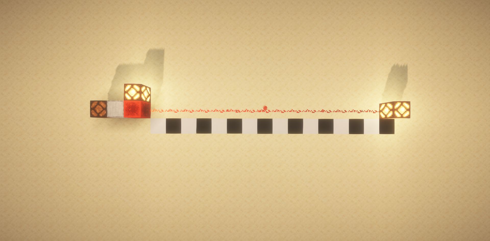
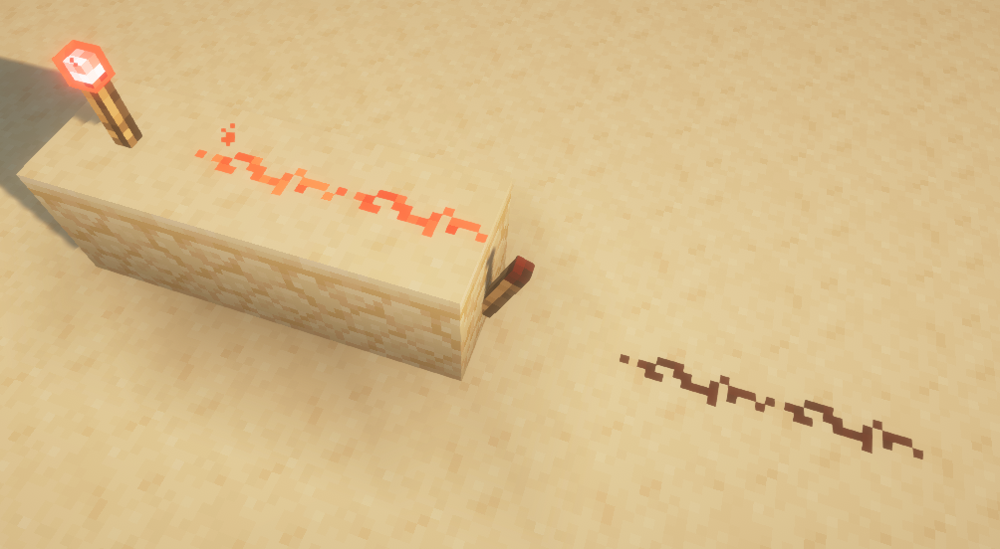

# 3.1 红石原理基础

在上一章，我们已经介绍了基岩版命令的一个整体框架。读者能够从第二章中了解到基岩版整体的命令体系。接下来在第三章，我们要正式开始学习如何使用这个命令体系构建一个属于自己的命令系统。

在这个模块中，我们不会脱离原版所给出的机制和体系，我们将从原版最有魅力和深度的其中一个玩法——红石系统作为基础，以各种深藏于命令之中的开发方块作为载体，学会制作属于我们自己的命令系统，并将其应用到自己的地图或服务器中。

---

这一节，我们将要从红石系统的基础机制出发，学习一些必要的红石知识。红石系统类似于现实生活中的电路系统，利用红石元件的各种机制，我们可以制作出各种各样的电路、机器甚至是计算机。这些知识在后续无论是系统设计还是玩法设计上，都是很重要的。不过，我们这一节并不是冲着制作各种复杂机器去的，我们只要简单了解各种元件的原理，就足够我们的开发使用了。*如果你是追求更专业的红石教程，应当以 Wiki 的相关文章作为参考*。

下面的内容，基本上对基岩版和 Java 版都是通用的，因此下面会使用一些来自 Java 版的截图。虽然两个版本的复杂红石电路的运行原理相差甚远，但基本红石元件的运作逻辑还是一致的。

---

## 红石元件

Minecraft 中，有各种各样形形色色的方块，可以搭建红石电路系统，这些方块就叫做**红石元件（Redstone Components）**。和现实生活中的电路的三大基本组成部分：*电源*、*导线等中间环节*和*用电器*类似，在 MC 中的红石电路也由对应的三部分组成：**电源**、**传输元件**、**机械元件**。

在 Java 版中，创造模式的物品栏已经有了一个专门的红石元件分类。

例如，读者应当已经知道，拉杆和铁门之间可以连接红石线，从而实现通过电路开门的效果。我们注意到，MC 中的电路并不像现实生活中一样要求闭合，只要信号能够通过传输元件传输过去，就能够组成一个完整的红石电路。

红石灯也是一种检测红石信号的常用方块。接收到信号之后，红石灯就会亮起，而未接收到信号时，红石灯就会熄灭。

在现实生活中，我们知道有*电源插孔*、*电池*等可以提供电能的电源。在 MC 中，类似地，**能够提供红石信号（类比于电能）的元件，称为电源（Source Components）**。例如，上面的两个示例中，拉杆能够提供红石信号，就是一种电源。

而现实生活中的*电线*，负责将电能传输给用电器。类似地，**将信号传输到其他元件的元件，称为传输元件（Transmission Components）**。例如，上面的两个示例中，红石粉能够将拉杆产生的红石信号提供给其他红石粉和红石灯，所以红石粉是典型的传输元件。

现实生活中的*电灯泡*，负责消耗电能并转化为光能，称为*用电器*。类似地，**接收红石信号并干涉世界运行的元件，称为机械元件（Mechanism Components）**。例如，上面的两个示例中，铁门接收到红石信号后改变了它的碰撞箱，进而改变了这个位置的可通达性；而红石灯接收到红石信号后发出 15 级的强光，这两个元件都干涉了世界的运行，因此都是机械元件。

---

## 红石导体 充能

在红石系统中，哪怕是普通的方块本身也可以成为很重要的一环。我们来看下面这个例子：

:::tip[实验 3.1-1]

在地上放一个拉杆，连接红石粉，红石粉的末端放置一个平滑石头，上面放一个红石灯。再如法炮制造另一个电路，只把平滑石头换成玻璃。

拉下拉杆，观察实验现象。

:::

我们注意到：垫上玻璃的红石灯并没有亮，而垫上了平滑石头的红石灯却亮了起来。

这种没有直接将红石信号作用到红石灯上，却能让红石灯亮起来的现象，正是**充能（Power）** 所引起的。许多方块（尤其是许多不透明方块）在被红石信号作用后，能够激活毗邻（上下东西南北）的红石元件，这时我们称这个方块为**红石导体（Redstone Conductive Block）**，这个方块正处于**被充能（Powered）** 的状态。而许多方块（尤其是许多透明方块）被红石信号作用后，不能激活毗邻的红石元件，这时我们称这个方块为**红石绝缘体（或非红石导体，Redstone Non-conductive Block）**。

在上面的例子中，平滑石头就是一种红石导体，它被红石信号作用之后可以激活毗邻的红石灯，所以平滑石头是红石导体，且处于被充能状态；而玻璃被红石信号作用之后不能毗邻红石灯，所以玻璃是红石绝缘体。

---

## 强充能与弱充能

MC 中有很多种红石电源，它们对红石导体的作用效果，也就是充能的效果，其实是不太一样的。我们来看下面一组实验。

:::tip[实验 3.1-2]

按照下图的方式搭建两个红石电路。其中，一个为通过拉杆连接红石线对平滑石头充能（下图左，情况 A），另一个为拉杆直接放在平滑石头上面（下图右，情况 B）。

拉下两个拉杆，观察实验现象。

:::

我们立刻观察到，情况 B （右）能够点亮红石灯，而情况 A （左）却不能。

在情况 A 中，红石粉的红石信号作用于平滑石头，可见其应该处于被充能状态；而在情况 B 中，拉杆本身就是电源，它的红石信号也作用于平滑石头，平滑石头也是被充能状态。看来，即使两种情况的平滑石头都是被充能状态，也有差别，很明显，情况 B 的充能是更强的，强到足以在中间阻隔了一个方块的情况下继续传导红石信号。

我们说，像情况 A 这种，红石导体被充能后不能激活毗邻的红石粉的充能称为**弱充能（Weakly Powered）**；而像情况 B 这种，红石导体被充能后还能激活毗邻的红石粉的充能称为**强充能（Strongly Powered）**。

弱充能和强充能是由电源和传导部分的性质决定的。一些电源可以做到强充能，另一些电源就只能实现弱充能。红石粉作用于红石导体只能实现弱充能，但后面我们会知道红石中继器、红石比较器就能实现强充能。

---

## 红石信号强度

和现实世界不同，电能在导线中虽然有能量损耗，但是这能量损耗是相对比较小的，所以通电后，电信号可以传导到很远的距离。然而在 Minecraft 中却并不是如此，红石信号的衰减是肉眼可见的。

:::tip[实验 3.1-3]

现在我们来探究红石信号的衰减规律。使用拉杆作为电源，不同长度的红石粉作为传输电路。不断加长红石粉的长度，观察加长到什么时候不再能使红石灯被点亮。

:::

我们观察到，无论红石粉的线路怎么拐，怎么摆，都会在长度到达 16 格的时候衰减到无信号的状态。看来，这个红石信号只能传输 15 格远。

这样，我们便可以定义**电源所提供的红石信号的强度（Redstone Signal Strength），是这个红石信号所能传输的最远的格数**，并且，**红石粉每传输 1 格，信号就衰减 1 级**。红石信号强度也经常被简述为红石信号，例如社区经常说“15 级红石信号”甚至“15 级信号”，读者应当能看懂这说的便是红石信号强度。

在上个例子中，拉杆所能提供的红石信号强度为 15 级。实际上，15 级已经是所有电源中所能提供的信号强度的最大值，换言之：**使用红石粉传输的信号，一定会在超过 15 格后衰减为 0**。

---

## 各种电源及其性质

下面仅对常见的电源进行介绍。如果读者对电源类型的红石元件感兴趣，可以阅读[红石元件列表#电源 - 中文 Minecraft Wiki](https://zh.minecraft.wiki/w/红石元件列表#电源)。

绝大多数的电源，都能够为毗邻的红石元件提供信号，并强充能特定位置的红石导体。

:::tip[实验 3.1-4]

在“各种电源及其性质”这一部分，请通过下文所示的图片示例，分别搭建对应的电路，体验一下各个电源的用法。

:::

### 红石块

红石块**无条件地输出信号，强度为 15**。红石块会为毗邻元件提供信号，但是不会强充能毗邻的红石导体。

红石块也是在命令方块系统中应用最多的一种信号源。

  

### 拉杆

拉杆**拉下后提供信号，再拉回来则停止提供信号，强度为 15**。拉杆会为毗邻元件提供信号，还会强充能附着的红石导体。

拉杆是最简单的电源之一，*有些类似于现实世界的电源和单刀单掷开关的合体*。

### 按钮

按钮**在按下后的短暂时间间隔内能够提供信号，随后自身回弹并停止提供信号，强度为 15**。按钮会为毗邻元件提供信号，还会强充能附着的红石导体。

按钮分为木质按钮和石质按钮。**石质按钮提供信号的时间短（1 秒），木质按钮提供信号的时间长（1.5 秒）。箭和三叉戟在射中木质按钮后还能提供更持久的信号（长达 1 分钟）**。

  
箭射中木质按钮后会持续激活木质按钮

### 压力板

压力板**在实体踩踏压力板后提供信号**。

压力板分为 4 种：木质压力板、石质压力板、轻质测重压力板（金）和重质测重压力板（铁）。其中，**石质压力板是比较特殊的，它必须在普通生物踩踏后激活，其他实体（例如箭、掉落物）踩踏则不激活**。

输出信号强度方面：

- **木质压力板和石质压力板被踩踏后都会输出 15 信号**。
- 轻质测重压力板每多一个实体踩踏就多输出 1 信号，最大输出 15。
- 而重质测重压力板则需要每多 10 个实体踩踏多输出 1 信号，最大输出 15。
  - 例如 8 个实体踩踏输出 1 信号，73 个实体踩踏输出 8 信号。

压力板会为毗邻元件提供信号，还会强充能附着的（下方的）红石导体。

  
1 个盔甲架踩踏 4 种压力板的表现

  
15 根箭（非生物）踩踏 4 种压力板的表现

### 侦测器

侦测器**在检测（脸）端检查到方块有变化的时候，在输出端输出一个时长为 0.1 秒的瞬时信号，强度为 15**。侦测器只会为输出端面对的红石元件提供信号，也只强充能输出端面对的红石导体。

  
一种高频输出信号的简易装置，即两个侦测器的脸部正对

### 陷阱箱

陷阱箱**在箱子打开时输出信号，强度等同于开箱人数，最大输出 15**。陷阱箱会为毗邻元件提供信号，还会强充能下方的红石导体。

陷阱箱常常用于下方埋 TNT 或者隔一个方块埋 TNT 做陷阱。因为往往只输出 1 的信号强度（毕竟大多数时候只有 1 人开箱），如果使用陷阱箱做机关应该务必注意到这点。

### 绊线钩

绊线钩**在实体经过绊线时输出信号，强度为 15**。绊线钩会为毗邻元件提供信号，还会强充能附着的红石导体。

绊线钩在实体离开后会过段时间恢复回原状，并停止提供信号。此外，绊线钩还会在绊线被非剪刀破坏时，输出一个 0.5 秒的瞬时信号。

  
绊线钩上卡着一个掉落物，触发信号

### 讲台

讲台**在翻页时输出一个 0.1 秒的瞬时信号，强度为 15**。讲台会为毗邻元件提供信号，还会强充能下方的红石导体。

### 标靶

标靶**被弹射物击中时输出瞬时信号，强度由击中位置决定，越靠近中心则信号强度越大，范围从 1~15**。标靶会为毗邻元件提供信号，但是不会强充能毗邻的红石导体。

瞬时信号时长由弹射物类型决定，箭和三叉戟为 1 秒，其余为 0.4 秒。

  
击中了标靶的三叉戟，但因为是瞬时信号，所以此时已不输出

此外，标靶还常常用于改变红石线路走向的红石导体。只要标靶不被弹射物击中，有时也可以认为标靶也是一种良好的传输元件。

  
标靶可以改变线路走向

### 探测铁轨

探测铁轨**在有矿车经过时提供信号，强度为 15**。探测铁轨会为毗邻元件提供信号，还会强充能下方的红石导体。

---

## 红石刻

上文，我们看到很多能够输出瞬时信号的元件。你发现了吗——这些瞬时信号的最短值是 0.1 秒，并且所有这些信号的时长都是 0.1 秒的倍数。

事实上，在红石系统领域，存在一个和游戏刻同等重要的类似概念，**红石系统的响应速度都是以 0.1 秒为单位的，一切的红石元件的响应时长都是 0.1 秒的倍数**，我们称 0.1 秒为**1 个红石刻（Redstone Tick）**。显然地，和以前的游戏刻的概念结合起来看，我们就能得到**1 秒= 10 红石刻（Redstone Tick, RT）= 20 游戏刻（Game Tick, GT）**，或**0.1 秒= 2 游戏刻= 1 红石刻**。这是时间转换原理的完全体，是极其重要的。

---

## 各种传输元件及其性质

传输元件的类型虽然相对较少，但是它们的特性却一个比一个复杂，用法一个比一个多变。下面仅介绍这些传输元件最常见的性质。如果读者对传输元件类型的红石元件感兴趣，可以阅读[红石元件列表#传输元件 - 中文 Minecraft Wiki](https://zh.minecraft.wiki/w/红石元件列表#传输元件)。

:::tip[实验 3.1-5]

在“各种传输元件及其性质”这一部分，请通过下文所示的图片示例，分别搭建对应的电路，体验一下各个传输元件的用法。

:::

### 红石粉

红石粉是最基础的传输信号的元件。对于水平方向的布置，我们已无需多言，现在主要强调在竖直方向上红石粉的工作机理。对于众多红石机器、生电机器或命令系统来说，往往不是局限在一个水平面上的，总要存在竖直方向上的变化。

对于竖直信号的传递，主要分两种情况：爬升（向上传输）和降落（向下传输）。红石粉的爬升是比较简单的，例如：

但是，红石粉在爬升的时候，如果上方出现不透明方块阻挡，则会中断；而类似于树叶、玻璃等透明方块阻挡则不会中断。例如：

所以，一种常见的省空间的红石信号爬升方式就如下图所示：

红石粉还可以放在不完整方块的上表面，例如台阶或者楼梯，使用这些也可以实现信号的爬升。

对于红石粉的降落，基岩版和 Java 版则存在一些差异，这里我们只谈基岩版。红石粉的降落必须要保证其侧面不能是中断的。红石导体自不必多说，对于红石绝缘体来说，常用的侧面不中断的方块是玻璃。读者也可以在下面这张图中看到信号爬升和信号降落之间的区别。

  
楼梯和台阶可以胜任信号爬升的工作，然而因为侧面中断，所以信号不能降落；玻璃的侧面则是良好连接的，所以信号可以正确降落。*这点和 Java 版是不一样的，Java 版只要是红石绝缘体，信号就都不能降落（因此这张图是在基岩版截的，没有光影）*。

### 红石火把

红石火把不仅是一种传输元件，同时也是一种电源。

我们现在来快速阐述一下红石火把的作为电源的性质。红石火把**输出 15 信号**，会激活**除附着之外的毗邻红石元件**，并**强充能其上方的红石导体**。

  
左 1 我们看到红石火把所附着的红石灯并没有亮，而其上方和侧边的红石灯却亮了起来；左 2 和左 3 则表明，不论如何摆放红石火把，都是强充能其上方的红石导体，而侧面的红石导体则不会被充能。

红石火把作为传输元件的基本特性在于**充能熄灭**。**如果其所附着的红石导体被充能，那么红石火把就会熄灭**。

这个特性是极其有意义的，它已延伸出诸多有用的特性，例如信号中继，利用两个红石火把延续信号；竖直传递信号，尤其是高度差较高的时候；以及取逻辑非，等等情况。

读者应当注意一个很关键的问题：**红石火把熄灭与重燃的响应时间是 0.1 秒，也就是 1 红石刻**。例如在上图的中继器的设计中，拉下拉杆后需要 2 红石刻才能点亮红石灯；而上图的竖直爬升的设计则需要 4 红石刻才能点亮红石灯。这在红石系统领域中有一个专门的领域叫做**延迟（Delay）**，例如上面两个例子就分别是 2 红石刻的延迟和 4 红石刻的延迟。

### 红石中继器

红石中继器是由 2 根红石火把、1 个红石和 3 个石头合成的传输元件。显然，在上面的例子中，它至少有两个作用：中继信号和引入延迟。但其实至少有 4 个作用，我们来一一说明。

在了解它的作用之前，我们必须先看懂它。下面是一个红石中继器，我们看到有两个火把状的东西。固定火把的一端称为**输出端（Output）**，而可变火把的一端称为**输入端（Input）**。你也可以通过中继器的一个形似三角形的图案看到它的端口。

现在我们就可以了解它的作用了。第一个作用，是**中继信号**。它能够将任意的信号扩大到 15 信号并继续传播。通过上面红石火把的例子，读者应该已经能轻松地了解这个作用。

第二个作用就是**引入延迟**。在红石火把的例子中，我们提到引入那样一个中继装置需要引入 2 刻的延迟。对于红石中继器而言，则要更加灵活。它一共有 4 个档位，通过调整火把之间的间距来控制档位，每调高一个档位就会多引入 1 刻的延迟，而最低的 1 档是 1 刻的延迟。对应关系如下图所示。所以，常用 2 个 4 档的中继器和 1 个 2 档的中继器来制作一个 1 秒的延时器。

第三个作用是**单向传输**。中继器只能从输入端接收信号并在输出端输出，不能从输出端接收信号。这个阻止反向信号的特性十分类似于现实世界的二极管，只是中继器还同时兼备了放大信号的作用。例如在下图中，我们只希望信号从左向右传输，就可以通过引入一个中继器的方法来阻止反向信号的输入。

第四个作用是**锁存信号**。当它的侧面有一个红石中继器或红石比较器来输入信号的时候，就会进入**锁存状态（Signal Locking）**。这种状态下，无论输入端是开是关，都不影响中继器本身的状态，而是锁定为这个中继器在锁定之前的状态。

此外，作为第一种方法的扩展，红石中继器作为一种非红石粉的红石元件，自然能够**从充能的红石导体获得信号**。所以，借助红石中继器的这些性质，可以造出各种各样的传输装置。

### 红石比较器

红石比较器是一种多功能的红石元件，它可以用于比较信号大小、对信号相减运算、检查容器装载情况、检查方块状态。现在我们来一一说明。

和红石中继器类似，我们要先看懂红石比较器的构造。红石比较器有 **3 种端口：靠近两根火把的主输入端 I、侧边的副输入端 C、靠近一根火把的输出端 O**。你也可以看到类似于红石中继器的三角图案，指代方向。

红石比较器有两种模式，**比较模式和减法模式**，两种模式依靠手动切换。比较模式下输出端的红石火把是熄灭状态，而减法模式则是亮起状态。

和红石火把、红石中继器类似地，**红石比较器也会引入一个红石刻的延迟**。

现在我们来关注比较器的作用。比较器的第一种作用是**比较信号**，这需要比较器在**比较模式**下工作。如果在主输入端输入一个强度为 I 的信号，而在副输入端输入一个强度为 C 的信号，那么比较器会比较 I 和 C 的大小。如果在副输入端的信号过于“强势”，就会阻止主输入端的信号输出，也就是说，**当 I \< C 的时候，输出信号为 0**。而如果副输入端的信号没有那么强，那么主输入端的信号就全部输出，也就是说**当 I > C 的时候，输出信号为 I**。

  
上图中，主输入 I=14，副输入 C=13，因为 I>C，所以输出信号为 14。

  
上图中，主输入 I=14，副输入 C=15，因为 I\<C，所以输出信号为 0。

作为比较模式的一种特殊应用，**如果副输入端不输入任何信号，也不接入任何线路，这时比较器将原样地输出其接受的信号**。也许你并不理解为什么要单独拿出这种特殊情况提一下，但事实上这个应用在红石领域有着很专业而深入的应用，它可以保证输入的信号能够通过远距离传输而不衰减。此外，使用多个比较器串联还可以引入延迟，有些计时器就是通过大量的比较器而制成的，这种计时器具备随输入信号大小而控制时长的特点。

  
上图中，拉杆处于关闭状态，这个装置内的信号会不断衰减，一段时间过后才不再输出信号。这比较类似于现实世界的储能元件，例如电容或电感。

第二种作用是进行**信号运算**。在上面的两个例子中，如果我们把比较器换为**减法模式**，就将得到完全不一样的输出效果。在减法模式下，比较器**将运算主输入端减去副输入端的信号，并输出到输出端上**，也就是说输出的信号为 I-C。当然，输出信号不可能小于 0。

  
上图中，主输入 I=14，副输入 C=13，所以输出信号为 14-13=1。

  
上图中，主输入 I=14，副输入 C=15，输出信号本应为 14-15=-1，但输出信号不可能为负数，所以无输出。

这两种运算方式将仅基于红石系统的计算机变成可能。通过不同的信号输入和运算，理论上可以通过减法的逆运算实现加法，再将加减法升级为乘除法等，理论上是可以实现完全的计算机系统的，但是这需要一些数字电路、模拟电路的专业知识，限于本教程的用途和笔者的专业水平，这里便不再赘述。感兴趣的读者可以在 Wiki 中进行学习。

第三种作用，也是比较器在命令系统中最常见的作用，就是**检查容器装载状态和方块状态**，当然，这个检查是有局限性的，不可能做到任何方块的方块状态都能被红石比较器检测。容器就是指那些可以存储物品的方块，包括但不限于箱子、木桶、漏斗、熔炉等。红石比较器可以检查它们装填的进度，从而输出红石信号，并且还可以隔墙检测。

  
上图展示了两种不同的检测方法，其中一种是直接检测，另一种是隔墙检测，二者的输出效果等效。并且，上方的箱子只放了一个拉杆，而下方的箱子充满拉杆，读者可以看到两个输出效果是天差地别的。

部分方块的方块状态也可以通过红石比较器检测，例如讲台、物品展示框、甚至命令方块。除了命令方块的输出是我们下一节的重点之外，其他方块如果读者感兴趣，可以在 Wiki 中自学，这里不再过多强调。

---

## 各种机械元件及其性质

现在我们来认识一些常见的机械元件。下面仅对常见的机械元件进行介绍。如果读者对机械元件类型的红石元件感兴趣，可以阅读[红石元件列表#机械元件 - 中文 Minecraft Wiki](https://zh.minecraft.wiki/w/红石元件列表#机械元件)。

:::tip[实验 3.1-6]

在“各种机械元件及其性质”这一部分，请通过下文所示的图片示例，分别搭建对应的电路，体验一下各个机械元件的用法。

:::

### 红石灯

红石灯在接收到红石信号的时候，会**发出 15 级（最强）的光照强度**。这个东西前文一直在提及，想必已经无需多言了。

### 活塞与黏性活塞

活塞**在接收到红石信号的时候，会伸展活塞臂，并把其前方的方块或实体推开**。在接收不到红石信号的时候，就会收回活塞臂。黏性活塞与活塞类似，但不同的是，**在收回活塞臂的时候，黏性活塞会把前方的方块给拉回来**。

然而，一些方块是不能被活塞推走的，比如基岩、黑曜石等，这些方块挡在活塞前面的时候，即使是接收了红石信号活塞也不会响应。如果活塞前面有多个方块，会把它们一起推开，但是这是有上限的，活塞不能推动超过 12 个方块。

使用黏液块可以使活塞推动临近的方块，但是这在命令系统中应用并不广泛。读者可以自行尝试。

### 铜灯

:::warning[版本适用性警告]

铜灯于 1.21+ 版本加入，实际是否可用请以你的实际游戏体验为准。

:::

铜灯和其他的铜制品一样有 4 种氧化版本和 2 种涂蜡版本，随着氧化进程的增加可以发出不同强度的光。和红石灯不一样，铜灯并不是有信号就亮没信号就灭，而是随着信号的输入改变状态。熄灭的铜灯在接收到一次信号之后变亮，再接收到一次信号就熄灭。而且，铜灯的状态可以被红石比较器检测到，凭借其小巧的体积，它可以大幅简化以前占地较大的锁存器设计，成为新一代的锁存器、数据存储器的良好材料。

  
铜灯的亮灭与当前是否有信号无关，只取决于信号脉冲

### 铁轨、动力铁轨与激活铁轨

这三种铁轨都是用来跑矿车的，这点已经无需多言。这里只强调它们接收红石信号的不同响应。

在丁字路口处对铁轨施加红石信号，可以令其转向。

而动力铁轨和激活铁轨都是需要接收信号才能工作的。动力铁轨如果没有信号，会成为阻碍矿车运动的铁轨，使矿车大幅减速；施加信号则会成为促进矿车运动的铁轨，使矿车大幅加速。激活铁轨在没有信号的时候和普通铁轨类似，而在有信号的时候则会触发矿车的特殊功能，例如会让普通的矿车卸下运送的乘客、或者引爆 TNT 矿车等。

激活的动力铁轨或激活铁轨会同时激活临近的动力铁轨或激活铁轨，最远可以激活 8 个动力铁轨或激活铁轨。

### 发射器与投掷器

发射器与投掷器是一种特殊的容器，在接收到信号的时候会将存储的物品随机地投掷出去一次。因此，在需要处理大量物品的时候应当高频率地启动关闭发射器或投掷器。

这两个东西的最大不同点在于，发射器不只是简单地投掷物品，对于一些特殊物品，它可能会以实体的形式发射出去，例如箭、船、TNT 或者各种刷怪蛋；而且一些物品可能会对实体进行一些操作，例如穿上盔甲、剪掉羊毛等操作。所以，发射器也是陷阱的常客。在生电领域里面，投掷器是运输装置的常客，因为它一视同仁地喷出物品，而不会进行额外的操作。

发射器和投掷器在面对另一个容器的时候，会直接将物品喷进容器内部，而不再以掉落物的形式喷出去。

因为发射器和投掷器是随机地在 9 个格子中选取一个格子喷出，所以具有一定的随机性，在记分板加入到游戏之前常常使用发射器和投掷器的性质制作随机数发生器，但现在已经几乎不用了。

### 门、活板门与栅栏门

这几种门都是在有信号时开，无信号时关。对于铁门、铁活板门来说，它们不能手动开关，而只能通过红石信号开关。

所以，常常采用按钮搭配门、或者压力板搭配门的方式来开关门，尤其是铁门。具体原理的话，**就是按钮可以强充能背后的红石导体，从而激活临近的红石元件，也就是门，达到开门的效果**。所以哪怕是你可能早已熟知的一个操作，背后的原理可能也并不那么显然，毕竟还需要用到充能的原理来解释。

### 漏斗

漏斗是一种容器，它可以将内容物漏向其所指向的容器、或者将上方的容器的内容物漏向自己、或者吸收上方的掉落物。在 MC 知名 UP 主籽岷的视频中经常出现的“倒斗”一词，就是利用漏斗从底部吸收大箱子的内容物的方法。

  
漏斗运输物品的三种常见方法，从左到右第一种吸收上面的箱子的物品并漏向下面的箱子；第二种上面的漏斗吸收箱子的物品，同时下面的漏斗吸收上面的漏斗的物品，最终送到最下面的箱子；第三种则是直接吸收掉落物。

当漏斗接收到红石信号的时候，它就不再会吸收物品，这时称漏斗为**锁定状态**。利用这个原理，在生电领域常常用来做物品分类机。

### 音符盒

直接右键音符盒会升高音符盒的音调并播放，直到升高到最高音调后回到最低音调。音符盒的音色由其下方的方块决定，读者若感兴趣可以查看 Wiki。为音符盒引入红石系统的意义在于，音符盒在接收到红石信号后不会改变音调，而直接播放。所以，引入合适的延迟和音色，可以做出一些出色的红石音乐。

### TNT

TNT 在接受到红石信号后会点燃，从发射器射出的 TNT 也是点燃状态。引入合适的延迟、水流和其他 TNT 的冲击力，就可以用来做 TNT 大炮，当然，用 TNT 搞破坏的也的确不在少数。

---

## 高频电路

在红石电路的实际应用中，难免需要用到一些能够高频率输出信号的信号发生器。这里介绍 3 种常见的高频电路。更多的高频电路可见[Tutorial:高频电路 - 中文 Minecraft Wiki](https://zh.minecraft.wiki/w/Tutorial:高频电路)。

### 基于红石火把的高频电路

一种基于红石火把特性的高频电路如图所示：

原理是，红石火把强充能上方的方块，导致红石中继器获得信号，强充能其输出端的方块，激活下方的红石粉，所以弱充能临近的方块，导致红石火把熄灭，红石中继器熄灭，红石粉熄灭，红石火把重新点亮，如此循环往复成为高频。

而拉杆的作用，就是关闭高频，它不断提供信号给红石粉，从而使得红石火把一直熄灭，中继器一直熄灭。

这种机器的输出端在红石火把，从红石火把引出线路，就可以用来将高频电路引入其他线路了。

可以调控这种高频电路的红石中继器的档位，来调控这种高频电路的闪烁周期，但是应当注意：因为红石火把存在过高频闪烁会烧毁的特性，所以不能将中继器的档位调的过低。

### 基于红石比较器的高频电路

一种基于红石比较器的减法模式的高频电路如图所示：

原理是，红石比较器在主输入端接收到 I=15 的信号，此时侧端信号为 C=0，所以输出信号为 O=15；然后，输出信号将信号反馈给侧端，导致此时侧端有 13 的信号，结果导致输出信号变为 O=2，此时侧端信号衰减为 C=0，所以继续输出 O=15，如此往复循环。

这种高频电路的频率比上面的基于红石火把的高频电路的频率要高得多，可想而知对性能要求也更高，使用时应当考虑到这一点。

### 基于侦测器的高频电路

在介绍侦测器的时候，我们曾说过可以令侦测器脸对脸产生高频。

原理是，当放下第二个侦测器的一瞬间，第一个侦测器检查到有方块变化，输出红石信号，同时自身产生变化，被第二个侦测器检测到，所以第二个侦测器也开始输出红石信号，同时自身产生变化，如此循环，输出稳定高频。

这种高频电路体积更加小巧，频率也很高，应视个人需求使用。如果需要关闭高频，可以引入一个活塞推开侦测器。

---

## 逻辑电路

在数字电路的领域中，常常涉及到一些涉及基本逻辑的电路。在上一章中，我们在讲到`/execute if|unless`的时候提到了是非关系，事实上那就是一个基本逻辑。在我们人类的语言逻辑中，一般在条件判断上有三种关联多个事物的基本逻辑：非、或、与。

例如，人们说，“只要不下雨，我就出门”，这里就是一个“非”的关系，如果下雨是`true`，那么出门就是`false`。**对于任意的“非”关系，输入和输出总是相反的，输入为`true`输出就为`false`**。在数学上，用“¬”来表示一个命题的“非”关系。

而家长答应孩子时称“只要你能考到 90 分以上，或考到年级前 10，我就给你买零食”，这就是“或”的关系，只要考到 90 分以上为`true`，或年级前 10 为`true`，那么买零食就是`true`。同样地，对于任意的“或”关系，**只要两个或者多个输入存在`true`，输出就是`true`；而全都不满足时才输出`false`**。在数学上，用“∃”表示命题的存在关系，也就是“或”的关系。

有些家长要求高一些，“你要考到 90 分以上，并且考到年级前 10，我才给你买零食”，这就是“与”的关系，只有这两个条件同时为`true`时，才返回`true`，否则就返回`false`。**对于任意的“与”关系，只有所有输入均为`true`时输出才为`true`，否则就是`false`**。在数学上，用“∀”表示命题的全称关系，也就是“与”的关系。

### 非门

非门（NOT Gate）是一种满足“非”关系的逻辑电路。它的构造原理是很简单的。假设拉杆是输入端，而红石灯是输出端，那么中间蓝色的电路就是一种典型的非门电路。这时，没有落下拉杆时代表输入为`0`（无信号），结果红石灯亮起，代表输出为`1`（有信号）。

### 或门

或门（OR Gate）是一种满足“或”关系的逻辑电路，它的构造原理也很简单。这种电路甚至都不需要什么额外的元件，直接连接就能满足“或”的关系。这样，只要有`1`的输入，就有`1`的输出。中间绿色部分的电路就是或门。

### 与门

与门（AND Gate）是一种满足“和”关系的逻辑电路，它的构造原理稍微复杂一些，占地面积也稍微大一些。这样，只有全都有`1`的输入，才有`1`的输出。中间黄色部分的电路就是与门。

将非门、或门、与门进行组合，就可以得到另外三种逻辑门：或非门、与非门、与或门。读者可以自行尝试构建这几种逻辑门。逻辑门在命令方块系统中的应用还是比较常见的，所以读者要清楚这几种逻辑门的含义以及电路的构造方法。

---

## *红石电路的各种分支领域简介

红石系统是一个独立的领域。就像物理学有力学、电磁学、光学、量子力学等各种庞大而复杂的分支一样，红石电路也有着各种各样的不同研究分支。在命令系统中，我们之所以要讲红石电路，就是因为命令方块是一种特殊的红石元件。但是，命令系统并不能认为是红石系统的一个分支，因为命令并不只有命令方块这么一种执行途径，所以只能认为命令方块系统是命令系统的一个特殊研究分支。命令系统和红石系统的关系有些类似于现实世界中的“学科融合”，例如物理学需要使用数学作为基础一样，读者也或许感受过在化学试卷上时不时会出现一点物理的东西，类似地，接下来的命令方块系统需要使用红石作为基础，有些类似于 MC 的“学科融合”。所以，这里的内容仅作为扩展，带读者简单了解一下红石系统的几个有趣分支。

### 数电与模电

数字电路（数电）和模拟电路（模电）是现实世界中存在的真实学科，在很多大学的理工科专业中，这些课程甚至是必修课程。

模电主要研究的问题是电路小信号放大和连续的信号变化处理和运算。例如输入电压从 11.45V 变为 14.19 V，这中间的电压变化是连续的。当然，在 Minecraft 中并不存在真正意义的连续信号，只有分立的从 0 到 15 变化的信号，也称之为**离散信号**。

但是，数电主要研究的问题是高电平和低电平之间的信号变化处理和逻辑运算，这主要是由于运算放大器在不同的工作电压范围下所产生的不同响应特性导致的。数电通常研究的是 0（低电平） 和 1（高电平） 这种有无信号的信号处理，因此对于这种情况来说，Minecraft 的 0 到 15 变化的信号甚至已经可以称得上是比较连续了。

读者如果感兴趣，欢迎阅读相关专业书籍和 Wiki 的简单介绍，了解数电和模电在 Minecraft 的实现甚至应用。

### 械电

机械电路（械电）就是读者可能在各路视频网站上看到的各种大小的活塞门的一个缩影。Wiki 中如此给出械电的研究范围：

> 根据设计目标，可分为高速械电和高压械电等。高速械电优先追求速度，其次追求减小体积（比如0.15s开门的2×2无痕玻璃门）。高压械电优先追求减小体积，其次追求速度，所以通常时序复杂（比如体积仅760方块的6×6活塞门，开关门共75分钟）。

### 生电

生存实用电路（生电）是你可能听说过的更深刻的一个名词，它是红石电路在生存模式下的一个强势应用领域，用于方便地量产物资。如果你玩过一个长时间的生存档，对“猪人塔”、“村民交易所”这种“机器”应该并不陌生。这种机器无论是否运用到红石电路，事实上都属于生电的范围（而且大部分本来就需要用到红石电路）。生电在 Minecraft 生存模式中的应用，读者可以在 Wiki 和各路视频网站了解到一些。

---

## 总结

这一节我们不设习题，只要求读者对红石系统、基本概念和各红石元件有基本的了解。在命令领域中，最重要的红石元件主要是红石块、红石粉、红石中继器、红石比较器、红石火把和活塞。但这并不意味着其他元件的原理就不重要，读者应当多了解一些红石元件的原理，这在 Minecraft 的各方面，包括生存、红石、陷阱、玩法设计、命令系统设计等方面都有重要应用。下面我们对所涉及到的专业概念做一些总结：

- 红石元件：是用于搭建红石系统的元件，分为三类：
  - 电源：能够提供红石信号的元件
  - 传输元件：将信号传输到其他元件的元件
  - 机械元件：接收红石信号并干涉世界运行的元件
- 红石导体：被红石信号作用后能够激活毗邻（上下东西南北）的红石元件的方块
- 红石绝缘体（非红石导体）：被红石信号作用后不能够激活毗邻（上下东西南北）的红石元件的方块
- 充能：被红石信号作用后的红石导体，称之为充能状态
  - 根据红石导体的定义，充能的红石导体能够激活毗邻的红石元件
  - 强充能：能激活毗邻的红石粉的充能
  - 弱充能：不能激活毗邻的红石粉的充能，都是由红石粉的信号直接作用引起的充能
- 红石信号强度：红石信号所能传输的最远的格数
  - 红石粉每传输 1 格，信号就衰减 1 级
  - 使用红石粉传输的信号，一定会在超过 15 格后衰减为 0
- 红石刻：红石系统的响应速度都是以 0.1 秒为单位的，一切的红石元件的响应时长都是 0.1 秒的倍数，称 0.1 秒为 1 个红石刻
  - **1 秒= 10 红石刻= 20 游戏刻，或 0.1 秒= 2 游戏刻= 1 红石刻（这个很重要！！！）**
- 高频电路：能以高频率输出脉冲信号的电路
- 逻辑电路：最基础的逻辑电路分为与门、或门、非门
  - 下面的 0 代表无信号（低电平），1 代表有信号（高电平）
  - 非门：输入为 1 时，输出为 0；输入为 0 时，输出为 1
  - 或门：存在一个输入为 1 时，输出为 1；全部输入为 0 时，输出为 0
  - 与门：只有全部输入为 1 时，输出为 1；存在输入为 0 时，输出为 0
- 对于各元件的用法总结，请读者在对应部分进行实验并自行理解，这里不再过多赘述。

import GiscusComponent from "/src/components/GiscusComponent/component.js"

<GiscusComponent/>
