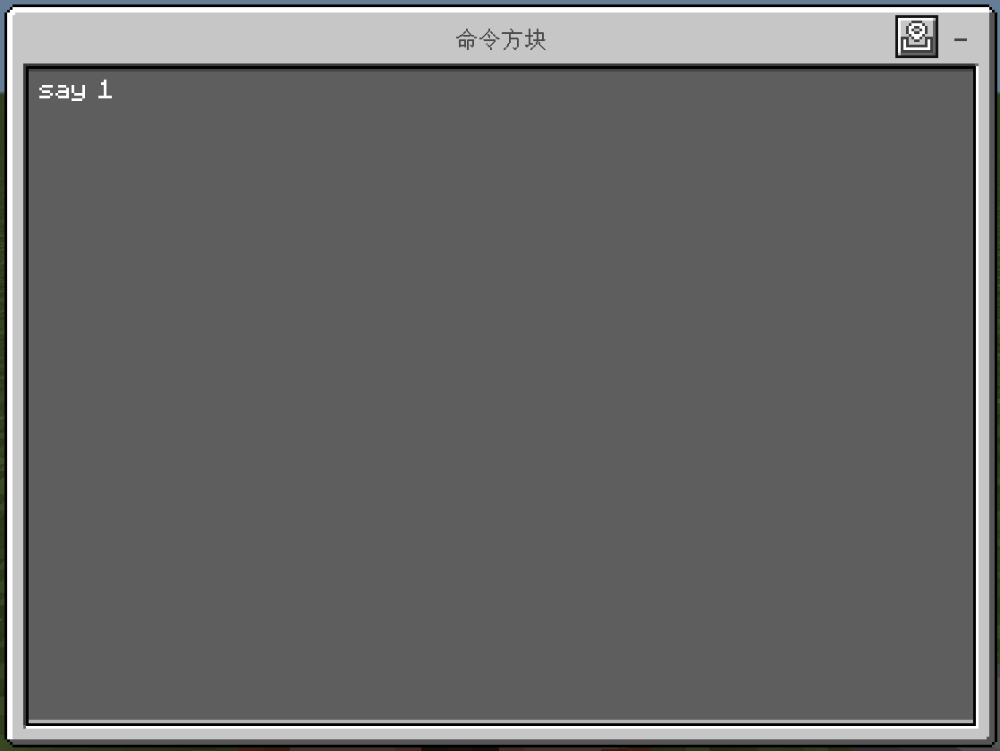
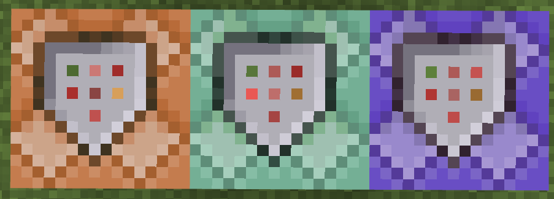

# 3.2 命令方块

本节我们开始介绍开发最常用的一种开发方块——命令方块。前面我们一直提到命令方块、命令方块，你一定非常好奇这究竟是何方神圣，当然或许你也可能早已有所耳闻。

---

## 命令方块

**命令方块（Command Block，简称 CB）是一种能够自动按需求执行预设命令的红石元件**。毕竟在各路地图服务器中，你不能让服主手动打命令执行代码，所以必须寻求一种自动执行命令的方式。现如今，在多数情况下，地图和服务器的开发者们还是会首选命令方块作为这个自动执行命令的方式，因为它简单、易懂、好上手，也是所有开发者的必修课程。对于这些开发者，尤其是追求用命令设计复杂程序的开发者，社区内通常会亲切地用“cber”来称呼他们。

然而，如果不是 Java 版的话，你不会在创造模式的物品栏里看见这个东西，因为命令方块属于**管理员用品**，它只能由创造模式的管理员使用，在基岩版则是隐藏到命令中。后续我们还会接触到更多的管理员用品。通常来说，我们用命令来获取命令方块：

:::tip[实验 3.2-1]

命令方块的物品 ID 和方块 ID 都是`command_block`，选择一条你喜欢的命令自行给予自己一个命令方块。

:::

获得命令方块之后，放下来，右键看看它的 UI 吧：


你可以看到设置项是很多的，但是不必心急，我们很快就会依次介绍它们的作用。

---

## CB 的基本用法

在下文中，如果看到 CB，这是命令方块的简写。在社区内，CB 是一种很常用的简写。

### 输入命令并执行

使用命令方块执行命令非常简单。在下图所示的这个区域，就是输入命令的区域：


因为命令方块是专门执行命令的，所以没有必要使用`/`专门指代这条消息是一条命令，因此在命令方块内可以不写`/`。

命令方块的本质是一种红石元件，这也是我们 3.1 先讲了红石原理基础的理由。在写了一条命令之后，你可以像点亮红石灯一样启动一个命令方块。

:::tip[实验 3.2-2]

放下一个命令方块，在“控制台命令”下输入

```text
say 1
```

可以不带斜杠。然后，按下右上角的“x”，或者按下“ESC”键，它会自动保存你写的命令，并在左上角提示。


试着启动命令方块，观察它的执行效果！

:::

我们看到，左上角返回了一个`[!]1`，其中`!`的问题我们稍后会强调，但不论如何，它确实成功执行了`/say`命令并输出！


命令输入区还有两个有用的按钮，第一个按钮是粘贴剪切板的内容，结合复制坐标 UI 会非常有用；而第二个按钮（“+”）就是放大命令输入区的 UI，对于输入长命令时会很有用。但是，因为基岩版的 bug，在输入长命令时，实际的光标位置和显示的光标位置是存在偏移的，这就导致在命令方块输入长命令（尤其是`/tellraw`等）往往是一种很痛苦的体验。



### 保存与取消

刚刚在实验中，我们提到**按下右上角的“x”或者按下“ESC”键都会保存命令**。然而，如果输错了命令怎么办呢？放心，这点手机和电脑倒是一视同仁——电脑也不支持 <kbd>Ctrl</kbd>+<kbd>Z</kbd> 撤销的操作。这时候，你可以直接使用命令方块左侧栏的“取消”按钮，这样就不会保存你输入错误的命令了。


### 添加注释

一个很现实的问题是：命令方块并不会将命令外显出来，要事先知晓命令方块里面究竟写了什么东西是很麻烦的，必须点开来看里面写了什么命令，甚至有时候需要放大命令输入区才能看清命令。

这个时候，我们就需要使用 UI 左上角的那个“悬停注释”，来标记这个命令方块里面写入的内容。在“悬停注释”里面写入内容并保存后，会使你的准心在面对命令方块的时候显示出来。

  


在写大型项目的时候，为代码添加注释总是良好的习惯。我们也鼓励你在必要的时候为命令方块添加注释，这样便于你的后期维护和架构调整，同时大幅提高可读性。

### 常用的快捷键

:::note[注意]

本部分内容仅限 Windows 玩家可用。

:::

掌握一些常见的快捷键是很重要的。以下是一些电脑上可用的快捷键：

- <kbd>Ctrl</kbd>+<kbd>A</kbd>：全选
- <kbd>Ctrl</kbd>+<kbd>C</kbd>：复制
- <kbd>Ctrl</kbd>+<kbd>V</kbd>：粘贴

如果你要问只有这些了吗，嗯对，只有这些。它甚至连剪切（<kbd>Ctrl</kbd>+<kbd>X</kbd>）都不支持，就更不要提什么保存（<kbd>Ctrl</kbd>+<kbd>S</kbd>）撤销（<kbd>Ctrl</kbd>+<kbd>Z</kbd>）之类的了……

此外还有一个，**对准命令方块使用<kbd>Ctrl</kbd>+<kbd>鼠标中键</kbd>，可以直接选取命令方块，并复制整个命令方块的信息**，包括其他可存储数据的方块都可以用这个方法，比如箱子等，这个特性会非常有用，有时候可以大幅减轻你的工作量。

---

## CB 的命令上下文

了解命令方块的命令上下文是非常重要且关键的，因为上下文直接决定命令的执行效果。在命令方块执行命令和在聊天栏执行命令在很多情况下的确是一致的，然而还是有诸多不同。在第二章，我们学习到命令上下文由 4 部分组成：执行者、执行环境参数、执行权限等级、执行输出反馈。接下来我们一一来看命令方块的命令上下文设定会对实际的执行效果产生什么影响，正好也借着这个机会进一步加深对命令上下文的理解，和扩展我们曾经在 2.3 所讲过的命令上下文的概念。

### CB 的执行者

**命令方块的执行者，是空。没错，使用命令方块执行命令不存在执行者**，当然你可以通过左上角的“悬停注释”指代一个执行者的名字。

:::tip[实验 3.2-3]

分别在 4 个命令方块内输入命令：

```text title="将这个命令方块的悬停注释留空"
say 1
```

```text title="将这个命令方块的悬停注释改为【测试】"
say 2
```

```text
give @a apple
```

```text
give @s apple
```

启动这 4 个命令方块，观察执行结果。

:::

我们看到下面的结果：


事实上，**执行者这个上下文是可以细分为执行者实体和执行者名称的**。只是在聊天栏执行命令的时候，执行者实体和执行者名称无一例外都是相互吻合的。但是对于命令方块而言，因为**命令方块本身是个方块，不是实体，所以执行者实体是不存在的，执行者名称没有办法对应到一个执行者实体上**。这样，命令方块就只能默认地将执行者名称设置为`!`。在 Java 版和更古早的基岩版中，默认的执行者名称都是`@`。

所以，在两个`/say`命令中，第一条命令的默认执行者名称是`!`，因此输出`[!] 1`；而第二条命令通过“悬停注释”设定了一个执行者名称`测试`，因此输出`[测试] 2`。

执行者实体不存在的另一个重大影响在于`@s`是不能直接指定命令方块本体的。因为`@s`归根结底是目标选择器，它的任务是找到符合条件的实体，而执行者实体并不存在，所以`give @s apple`无论如何都不会成功执行。更何况，就算是存在，这条命令也必须指定玩家类型的实体。

所以，在执行者方面的重大不同，很大程度上导致了用 CB 的执行效果和用聊天栏的执行效果是很不一样的。

然而，一些开发者却对执行者实体不存在这个问题存在一些误解，他们误认为命令方块内无论如何都不能出现`@s`字样，这归根结底是对`/execute`命令不熟悉所导致的。因为`/execute`命令的`as`子命令可以指定一个有效的执行者实体，在后面再出现`@s`就是可以接受的了。例如，不能用 CB 直接执行`give @s apple`，却可以用 CB 执行`execute as @a run give @s apple`。

### CB 的执行环境参数

基岩版的执行环境参数包括执行位置、执行朝向和执行维度，这个概念并没有什么好扩展的。CB 的默认执行位置和执行维度也是很显然的为 CB 所在的位置和维度。然而执行朝向该怎么区分呢？

:::tip[实验 3.2-4]

使用 CB 执行下面几条命令：

1. `tp @p ~~1~ ~~`
2. `tp @p ~~1~ 0 0`
3. `tp @p ~~1~ 90 0`

:::

通过上面的实验，你也许已经看出命令 1 和命令 2 的执行效果是一致的。是的，命令方块的默认执行朝向`(xRot, yRot)`是`(0,0)`。

### CB 的执行权限等级

在 2.10 的时候，我们简单提过一下权限等级这个概念，知道所有的执行者都有一个权限等级，而所有的命令都有对应的权限等级需求。在基岩版中，绝大部分的命令都需要`1`的权限等级，而**命令方块的权限等级正是`1`，所以命令方块就可以执行绝大多数的命令**。关于命令方块不能执行哪些命令，我们在[附录：全部命令汇总](../appendix/all_commands)这篇文档性质的附录里面详细地给出了所有命令的权限等级，并对一些命令方块无法使用的命令做了警告，读者可以简单查阅一下。主要需要注意的是`/op`、`/deop`这些服务器命令常常不能通过命令方块执行，以及`/kick`命令是反而可以通过命令方块执行的。

### CB 的执行输出反馈

事实上，命令的执行效果不仅有**是否执行成功**的概念，还有**执行成功次数（Success Count）** 的概念。如果执行命令`/testfor @e`，那么命令将会这么反馈：


这说明，这条命令不仅成功执行了，而且成功执行了 7 次（因为检查到了 7 个实体）。

执行成功次数有什么用呢？基岩版要想读取成功次数，就必须使用命令方块或者 ScriptAPI。对于命令方块，后面接一个红石比较器就可以检查成功次数了：


**对于绝大多数的命令来说，执行成功次数只有`0`和`1`的区别，换言之执行失败就不输出红石信号，而执行成功就输出强度为 1 的红石信号**。少部分的命令可能影响多个玩家、或者多个方块，所以执行成功次数可能会多一些，例如`/testfor @a`就可以用来快速地检查玩家数目，也是它相比于`/execute if entity @a`唯一的优势（输出固定为 1）。**大多数的情况下，还是只用这个机制检查命令是否成功执行**。

如果读者想要了解那些不止输出`0`或`1`的命令，请查阅各命令条目下的“输出”一节。例如，下面是`/fill`的输出数据。

  
↑ `/fill`的成功次数，可见只有`0`和`1`的区别

---

## 控制 CB 运行的四条游戏规则

### `commandBlockOutPut`

这个游戏规则会**控制命令方块是否输出反馈消息到聊天栏**。在初次使用命令方块的时候，你可能常常会被命令方块在聊天栏的自动输出所困扰。

  
↑ 这些 *[!:……]* 就是命令方块输出的消息

将这个游戏规则关掉，就可以禁用这些消息。在开发过程中，可能会有部分开发者需要开启命令方块的反馈，但在正式发布地图前，或者在服务器中，都请把这个游戏规则关闭掉，因为玩家是不需要这些信息的。

### `commandBlocksEnabled`

这个游戏规则会**控制命令方块是否启用**。如果关闭这个游戏规则，那么命令方块就不再会通过红石或者其他方式激活并执行命令。

通常来说，这个选项都是需要开启的，毕竟如果关闭就会导致基于命令方块的系统直接瘫痪，在很多情况下恐怕不是什么好事哦。

一个坏坏的小提示：对于某些强行开启了反作弊的地图，可以考虑暂时关闭命令方块来开作弊拆地图。不过这么做一定会破坏你的游戏体验，所以请在游玩完地图后再备份一张地图，然后再考虑用这种方法拆图会更好一些。

### `sendCommandFeedBack`

这个游戏规则会控制**命令执行效果是否在聊天栏反馈**。请注意，这个反馈和刚刚的**命令方块的反馈**不一样，这是**命令的反馈**。

一些命令在涉及到多名玩家之后，会通知该玩家发生了什么变化，比如给予了玩家物品、传送了玩家等，这些变化信息即使在关闭命令方块的情况下也会提示，所以通常在正式发布地图前也应关闭该游戏规则。

  
↑ 即使关闭命令方块反馈之后，使用命令方块传送还是会返回信息，这时必须将`sendCommandFeedBack`游戏规则关闭才能彻底关闭所有命令反馈

### `maxCommandChainLength`

这个游戏规则控制一个命令方块链至多执行多少个命令方块。命令方块链的问题我们马上就会说到。默认值是`65535`，这在几乎所有场景下都已经足够使用。调低这个数值可以导致命令方块链执行的命令方块数减少，然而这可能会导致命令系统的瘫痪，所以请谨慎调整该数值。

---

## CB 类型

现在开始，我们来关注命令方块的各设置项。这里面几乎每个设置项都很实用，所以请务必多练习多实践哦！

我们先来关注命令方块 UI 的左侧的类型设置，可以看到命令方块一共有 3 种类型：脉冲、连锁、循环。

  
↑ 命令方块的 3 种类型

命令方块的类型区别可以说是各个命令方块的最本质的区别，所以它们之间的差异也是最明显的——就是颜色差异。

  
↑ 从左到右，依次为：脉冲型命令方块（橙色）、连锁型命令方块（青色）、循环型命令方块（紫色）

现在，我们来看看这 3 种命令方块的功能吧！

### （脉冲型）命令方块

（脉冲型）命令方块也是默认的命令方块类型。**当激活（脉冲型）命令方块一次后，这个命令方块就执行一次**。

:::tip[实验 3.2-5]

使用拉杆激活命令方块并执行命令`say 1`，然后关闭，再打开，如此重复几次，观察命令方块执行效果。

:::


我们看到，当拉杆给一次红石信号后，（脉冲型）命令方块就执行一次，此后就不再执行命令了。关闭拉杆后，再打开，命令方块就又执行命令。所以，只有给出新的红石信号后，才能让命令方块重新执行命令。

### 连锁型命令方块

**连锁型命令方块（Chain Command Block，简称 CCB）** 的作用是，当指向它的命令方块执行后，执行 CCB 内的内容。

*提示：CCB 的简写也是社区内的惯用写法，请牢记 CCB 指代连锁型命令方块*。

这里，我们必须首先强调命令方块的方向问题。所谓指向，就是指代命令方块的方向。命令方块的方向可以从其贴图中心图案的尖端看出来，尖端指向的方向就是这个命令方块的方向。

  
↑ 命令方块的朝向判断

所以，连锁型命令方块会在指向它的命令方块执行后执行。这话听起来比较拗口，我们给个示例你就可以明白了：


在上图的这个例子中，我们给出了命令方块的标号。可以看到①指向的命令方块是②，②指向的命令方块是③，③指向④，④指向⑤，这里尤其注意，**虽然在⑤那里转变了方向，但是④的方向依然是指向到⑤身上的**；然后，⑤指向⑥，⑥指向⑦，⑦指向⑧。这 8 个命令方块如果被同时激活，那么就会一连串执行 8 条命令，这种由 1 个非 CCB 和若干个 CCB 组成的完整的命令方块链条，社区内通常称为**命令方块链（CB 链）**。上文所提到的`maxCommandChainLength`就是控制这个的。

使用 CB 链的意义何在呢？可能你会说，我全用脉冲型命令方块，接上红石粉不是一样的吗，为什么要舍近求远用不同类型的命令方块呢？还真不一样。请不要忘记：红石粉最多传输 15 格距离，如果再远就要使用中继器传输信号，而这会带来至少 2 游戏刻的延迟，在很多情况下这并不是我们想要的，光是延迟的这 0.1 秒，可能就发生了很多事情，这样做会很耽误事。对于比较复杂的逻辑链条来说，只有 15 个命令方块是不够用的。

  
↑ 社区内通常采用基于 CCB 的 CB 链的形式，在适合的条件下，无需额外布线即可批量无延迟地执行命令，而且便于命令的编辑

  
↑ 此外，很多开发者也会采用这种纵向布置 CB 链的形式

:::info[思考 3.2-1]

直接激活单个的连锁型命令方块，能激活这个命令方块吗？如果一个 CB 链的起点也是连锁型命令方块，能激活这个 CB 链吗？

<details>

<summary>答案（思考过后再翻看哦~）</summary>

不能。单个的连锁型命令方块没有任何指向它的命令方块执行，所以激活单个 CCB 是不会有任何反应的。同理地，如果 CB 链的起点是 CCB，因为没有任何指向它的 CB 被执行，所以无论如何这个 CB 链都是无法被激活的。

很多初学者都会在无指导的情况下，使用拉杆等电源直接激活这三种命令方块，结果发现 CCB 是没有任何反应的，所以有些初学者会错认为这种命令方块是没什么效果的，这种想法是不正确的。

</details>

:::

使用`/give @s chain_command_block`可以直接获取连锁型命令方块。你会发现直接获取的 CCB 除了类型和标准的命令方块不一样之外，红石控制模式也和标准的不一样，是“保持开启”，这个问题我们在后面再详细说明。也正因如此，接下来请读者使用这条命令获取现成的 CCB，来做下面的实验。

:::tip[实验 3.2-6]

按你的喜好搭建一个长度为 5 的 CB 链，然后分别执行命令`say 1`、`say 2`、`say 3`、`say 4`、`say 5`。

<details>

<summary>点我查看答案</summary>


注意所有的 CCB，都应该额外将红石控制模式调整为“保持开启”。

在拉下拉杆后，应该同时显示 5 条聊天信息。


</details>

:::

### 循环型命令方块

**循环型命令方块（Repeating Command Block，简称 RCB）** 的作用是，**当处于激活状态时则一直尝试执行命令**。

*提示：RCB 的简写也是社区内的惯用写法，请牢记 RCB 指代循环型命令方块*。

:::tip[实验 3.2-7]

使用拉杆激活 RCB 并执行命令`say 1`，执行一小会儿后就立刻关闭，观察命令方块执行效果。

:::

你可以看到，激活 RCB 后，左上角就开始有大量的“消息轰炸”。这就是 RCB 的作用，还是很易懂的吧？


不知道你是否还记得，在第 2 章的时候，我们曾经布置了很多习题，说一些命令是每游戏刻都执行的。当时你可能不知道这是怎么实现的，而现在你就已经了解了第一种能每游戏刻执行命令的工具——循环型命令方块。在默认情况下，**循环型命令方块正是每游戏刻执行一次命令的**。结合 CB 链，就可以做到每游戏刻执行多条命令。

---

## CB 执行条件

现在我们来关注命令方块的执行条件的设置。命令方块一共有两种执行条件的设置：不受制约和条件制约。

  
↑ 命令方块的 2 种执行条件

所谓执行条件，就是判断**命令方块背后的命令方块是否成功执行**。**在设置为条件制约的情况下，只有当该 CB 背后的命令成功执行后，才能执行这个 CB**。这里注意，和连锁型命令方块谈“被指向”不同，这里是这个命令方块的“**背后**”，也就是**命令方块方向的反方向**。我们还是以刚刚的 8 CB 的 CB 链来举例：


在这个地方，②背后的命令方块，也就是它的朝向的反方向的命令方块，是①；③背后是②，④背后是③，以此类推。但注意，**转弯处不能“以此类推”** 了，因为显然，**⑤背后是没有命令方块**的，所以将⑤设置为条件制约的命令方块就一定不会执行。同理地，**CB 链开始的命令方块也不能是条件制约型的命令方块**。

如果是不受制约型的命令方块，就不考虑背后有没有命令方块这回事了。所有类型的命令方块，在执行条件上，默认值都是不受制约的。

条件制约命令方块和不受制约命令方块的贴图也是有区别的，区别在于条件制约的箭头图案会凹陷一部分，来表示只有其背后的命令方块执行后，自己才能执行。

  
↑ 从左到右，依次为：不受制约、条件制约。

条件制约在什么地方有用呢？答案是在条件判断的命令上会很有用。我们曾经学习过`/execute`命令的`if|unless`条件子命令，以及一些条件判定命令，比如`/testfor`、`/testforblock`、`/testforblocks`，或者`/clear`0 个物品等判定方法上，这些命令不会做什么，但是可以把检测的结果传递给下面的命令方块，让它们依照传递的结果去执行命令。

:::tip[实验 3.2-8]

现在我们来使用命令方块写一个“小商店”。我们来用命令方块实现 3 个绿宝石换取 15 个金苹果的效果，并且加上货币不足的提示。

首先，我们要使用`hasitem`目标选择器参数确认玩家是否有那么多的绿宝石，所以第一个命令方块可以写为：

```text
execute as @p if entity @s[hasitem={item=emerald,quantity=3..}]
```

这里必须额外强调：不直接用`@p[hasitem={item=emerald,quantity=3..}]`，是因为它会寻找拥有 3 个以上绿宝石的最近玩家，而不是判断最近的玩家是否有 3 个绿宝石。例如，假设有这样的位置关系：（执行位置 A B C），B 拥有 3 个以上的绿宝石，那么`@p[hasitem={item=emerald,quantity=3..}]`会选中 B 而不是选中 A，这在很多情况下，至少在这里并不是我们想要的结果。而使用`as @p`就会先选中 A，然后再进行判断。也正因如此，这里不能直接使用`/testfor`命令。

这条命令仅为检测，那么要执行命令的话，就需要用到条件制约型的命令方块。我们先清除物品，然后再给予玩家物品，最后给予提示：

```text showLineNumbers title="高亮部分为条件制约型命令方块" {2-4}
execute as @p if entity @s[hasitem={item=emerald,quantity=3..}]
clear @p emerald -1 3
give @p golden_apple 15
tellraw @p {"rawtext":[{"text":"成功购买了金苹果 * 15"}]}
```

现在你的命令系统应该长这个样子：


并且，如果拿出 3 个绿宝石，按下按钮后就能得到 15 个金苹果；如果绿宝石不足，则不会有任何反应。


现在我们再来考虑，不足时应该提醒玩家绿宝石不够，因为刚刚是检查超过 3 个绿宝石后执行一系列命令，现在需要重新设置一个新的条件，也就是不足 3 个绿宝石的时候，就执行另一套逻辑，这样的话我们只需要再接一个不受制约的 CCB，并且写好绿宝石不足时的逻辑：

```text showLineNumbers title="高亮部分为条件制约型命令方块" {2-4,6}
execute as @p if entity @s[hasitem={item=emerald,quantity=3..}]
clear @p emerald -1 3
give @p golden_apple 15
tellraw @p {"rawtext":[{"text":"成功购买了金苹果 * 15"}]}
execute as @p unless entity @s[hasitem={item=emerald,quantity=3..}]
tellraw @p {"rawtext":[{"text":"§c绿宝石不足！"}]}
```

  


你也可以尝试用这个思路多做几种商店试试哦！

:::info[思考 3.2-2]

然而，这样做会存在一个问题：当玩家在购买后正好触发了不足条件，比如剩余 4 颗绿宝石后购买，先触发成功条件，变为 1 颗，然后又会触发失败条件，最终导致成功购买后同时出现购买成功和购买失败的提示。如何才能解决这个问题？

<details>

<summary>答案（思考过后再翻看哦~）</summary>

将命令 5\~6 和命令 1\~4 调换即可，先判断是否失败，然后再判断是否成功。

```text showLineNumbers title="高亮部分为条件制约型命令方块" {2,4-6}
execute as @p unless entity @s[hasitem={item=emerald,quantity=3..}]
tellraw @p {"rawtext":[{"text":"§c绿宝石不足！"}]}
execute as @p if entity @s[hasitem={item=emerald,quantity=3..}]
clear @p emerald -1 3
give @p golden_apple 15
tellraw @p {"rawtext":[{"text":"成功购买了金苹果 * 15"}]}
```

</details>

:::

关于执行条件的表述（命令方块背后的命令方块是否成功执行）和连锁型命令方块执行条件的表述（当指向连锁型命令方块的命令方块执行后执行），这两个表述确实意思相近而且极易混淆。这里我们需要抓住两个核心的不同点：

1. **关于“背后”和“被指向”的表述**，是不一样的。在上面的 8 CB 的 CB 链的例子中我们已强调过这一点，在转角处的⑤号命令方块，有④号命令方块指向它，却没有任何命令方块在它的背后。
2. **关于“执行”和“成功执行”的表述**，也是不一样的。
   - CCB 的执行条件只是指向它的命令方块*执行*，从来不要求其中的命令是成功执行，甚至不要求指向它的命令方块里面是合法的、甚至是存在的命令。比如，前一个 CB 哪怕什么也不写，只要激活了之后就会激活它指向的下一个连锁型命令方块。
   - 而条件制约的执行条件则要求其背后的命令方块必须是*成功执行*。什么叫成功执行？在前面我们有简单提过，聊天栏里的命令反馈只要是白色的反馈就都算成功执行，而红色的反馈都不算成功执行。比如`没有与选择器匹配的目标`，就叫做执行失败。再次强调：执行失败并不完全等同于命令出错，语法正确也会有执行失败的情况，这是很正常的，关键在于如何灵活运用命令执行失败的特性，实现我们想要的效果。

---

## CB 启动条件

我们再来关注一下命令方块的两个启动条件（红石控制）：红石控制 & 保持开启。这两个选项其实很简单，**如果选定为红石控制模式，那么只有在接收到红石信号之后才会被激活；而如果选定为保持开启模式，那么就一直处于激活状态**。

这三个启动条件在 3 种不同类型的命令方块上，会产生不同的效果：

- 如果是**脉冲型命令方块**，**红石控制**是其默认值。
  - 在红石控制模式下，接收到红石信号后才会执行。
  - 而在保持开启模式下，在保存命令方块设置的那一刻就立刻激活一次，然后永不再执行。
  - 所以，**绝大部分情况下，为控制方便，脉冲型命令方块都使用红石控制模式**。
    - 有一个例外是，社区发现当保持开启的脉冲型命令方块在用`/clone`等方式新添加进世界时，会在添加的那一瞬间执行一次，这可能会在少数场景下有特殊应用。
- 如果是**连锁型命令方块**，**保持开启**是其默认值。
  - 因为 CCB 特殊的激活模式，使得它即使是在保持开启的情况下，只要指向它的 CB 没有执行，它就不会执行；而指向它的 CB 一旦执行，无论有没有红石信号，都立刻执行。
  - 而启用红石控制的话，反而会导致连锁型命令方块只有在接收到红石信号后，并且指向它的 CB 执行后才会执行，这大幅增加了运用 CCB 的难度。
  - 所以，**几乎所有情况下，连锁型命令方块都使用保持开启模式**。
- 如果是**循环型命令方块**，**红石控制**是其默认值。
  - 在红石控制模式下，循环型命令方块会在接收到红石信号后循环执行命令。
  - 而在保持开启模式下，循环型命令方块会无条件地循环执行命令。
  - 两种模式在实际工程中都很常用，**然而我们推荐为控制方便，应首选红石控制模式**。

---

## CB 延迟执行

接下来我们来关注命令方块另外两个比较有用的设置：**在首刻执行**和**延迟刻数**。因为基岩版众所周知的渣中文翻译，如果没有装中文 Minecraft Wiki 提供的译名包的话，会显示为*执行第一个已选项*和*已选项中的延迟*，这两个翻译通常会为新手造成极大的困扰，请格外注意这一点，掌握它们正确的用途是很重要的。


### 延迟刻数（Delay in Ticks）

我们先来介绍延迟刻数这个最重要的应用。它表示，**在这个命令方块被激活的状态下，要延迟多久才执行一次命令**。我们前文提到过一个时间变换原理：1 秒 = 20 游戏刻，便是在这里的第一次应用。

:::tip[实验 3.2-9]

准备两个命令方块，均写入命令`say 1`，但是第二个命令方块将延迟刻数改为`40`。使用拉杆激活两个命令方块，观察执行现象。

:::

读者会发现，当激活那个延迟刻数为`40`的 CB 时，它在两秒后才执行了`say 1`，可见这里正是延迟了 40 刻执行的。如果在执行命令之前就中断信号提供，比如拉下拉杆后又迅速拉回拉杆，那么这个命令方块就不会被激活。所以，在上面我们特意强调了**被激活的状态**。

接下来我们再来体验一下在循环型命令方块中启用延迟刻数的效果。

:::tip[实验 3.2-10]

将一个 RCB 的延迟刻数改为`20`，然后写入命令`scoreboard players add second time 1`，将`time`记分板展示在屏幕右侧，观察记分板的分值变化。

:::


读者可以看到，`time.second`会在每一秒增加 1 分。是的，这就是一个简易的计时器！

### 不同类型 CB 上的延迟表现

关于延迟刻数的问题，有两个特殊情况是我们比较关心的。其中一个就是在 CB、CCB、RCB 这三种命令方块上的延迟表现差异。可以说，它们的主要差异就体现在`0`和`1`这两个延迟值上。

对于**脉冲和循环**这两种类型的 CB，`0`和`1`是等价的，都是在激活后的下一个游戏刻执行，因为它们**默认的运行方式本身就是激活后的下一个游戏刻执行**。

但是对于**连锁**型，情况则不同，因为它**默认的运行方式是瞬间执行**，所以`0`和`1`并不等价。如果你有一个比较长的 CB 链，其中的每个 CCB 都把延迟从 0 改成 1，你会立刻发现延迟为 1 时很明显有个先后次序，存在一定的执行时间；而延迟为 0 时则是一连串全部执行的。

### CB 链上的延迟表现

另一个特殊情况，便是由多个 CB 组成的 CB 链上的延迟问题。CB 链上的每个 CB 都能够设置延迟，那么它的延迟是怎么体现的呢？我们分别从脉冲型 CB 链（起始 CB 为脉冲型）和循环型 CB 链（起始 CB 为循环型）进行分别讨论。

:::tip[实验 3.2-11]

准备一个 5 CB 的 CB 链，从起始 CB 开始分别指定命令：

```text title="每个命令方块均设置为 20 游戏刻" showLineNumbers
say 5
say 4
say 3
say 2
say 1
```

激活这个 CB 链，观察执行效果。

:::

读者应该已经发现，这本质上就是一个倒计时公告，每秒进行一次倒计时。


在这个例子中，①号 CB 在 1 秒执行后，激活②号 CB，开始延迟计时，并在 20 刻后执行并激活③号 CB，以此类推。可见，在脉冲型 CB 链中，各个 CB 的执行是**遵循依次延迟执行的规律**的。

接下来我们再关注一下循环 CB 链的延迟表现。

:::tip[实验 3.2-12]

将实验 3.2-11 的脉冲型命令方块改成循环型，然后激活这个 RCB 链，观察执行效果。

:::


可能和读者预期之中的效果不同的是，它的执行效果看起来很混乱，这个过程大体上如下：

1. 第 1 秒始，①执行后，②在等待 20 刻的延迟；同时，①会在 20 刻后再执行一次。所以，输出`5`。
2. 第 2 秒始，②倒计时结束并执行一次，激活③的 20 刻的延迟等待；同时①再执行一次，继续激活②的延迟等待。所以，因为①和②执行，所以输出`4`和`5`。
3. 第 3 秒始，②③倒计时均结束并执行一次，激活④的延迟等待；同时①再执行一次，继续激活②的延迟等待。所以，因为①②③执行，输出`3`、`4`、`5`。
4. ……以此类推，之后第 4 秒输出`2`、`3`、`4`、`5`，第 5 秒输出`1`、`2`、`3`、`4`、`5`，之后每秒都输出一次这 5 个数。这 5 个数的顺序每秒并不固定，但也并不是完全随机的。

总而言之，读者可以看到 RCB 链中引入延迟会具有一定的不可控性和不稳定性，但这并不意味着 RCB 链就是不可用的，RCB 链在很多时候还是很重要的。如果我们能做到在这个 RCB 链的最后一个 CCB 执行结束后，再重新执行一次 RCB，那么这样不就稳定了吗？

:::info[思考 3.2-3]

根据上文的 RCB 链的运行逻辑，思考在上例中如何调整 RCB 的延迟刻数，才能让 RCB 链每秒稳定输出下一个数，并在达到`1`后重新输出`5`，实现一个循环？

<details>

<summary>答案（思考过后再翻看哦~）</summary>

将 RCB 的延迟改为 100 游戏刻。

</details>

:::

### 在首刻执行（Execute On First Tick）

在首刻执行这个选项仅限循环型命令方块可用，它表示是否在激活后就立刻执行。这个选项的应用不是很多，简单了解一下就行。读者可以在简易计时器那个例子中把这个选项开启关闭后再激活 RCB，很快就能理解这个选项的含义。

---

## 总结

本节，我们了解了在 MC 资源开发中最重要的其中一种方块——命令方块（Command Block，简称 CB）。灵活运用命令方块和上一节的红石系统，可以实现非常多很复杂的逻辑。现在我们来总结一下这一节的内容。

- 命令方块是一种用于执行提前写入的命令的红石元件。
- 命令方块的上下文信息：
  - 执行者：不存在执行者实体，执行者名称为“悬停注释”的名称，默认为`!`。
  - 执行环境参数：执行位置为命令方块的位置，执行朝向为`(xRot=0,yRot=0)`，执行维度为命令方块所在的维度。
  - 执行权限等级：为`1`。
  - 执行输出反馈：内容写入到“上一次输出”中，并将执行成功次数保存到命令方块的信息中，可用红石比较器读取。
- 针对命令方块的 4 种常用游戏规则：
  - `commandBlockOutPut`：控制命令方块的执行效果是否输出到聊天栏。通常关闭。*毕竟你也不希望开循环型命令方块的时候被消息轰炸吧？*
  - `sendCommandFeedBack`：控制命令的反馈效果是否输出到聊天栏。通常在开发过程中，需要的时候开启，其余情况下关闭。
  - `commandBlocksEnabled`：控制命令方块是否启用。通常开启，因为关掉就不能用命令方块了。
  - `maxCommandChainLength`：控制命令方块链的最大长度。通常保持为默认值`65535`。
- 命令方块的命令输入区和保存、取消方法：
  - 在右上角的命令输入区中写入命令，可以不带`/`。
  - 命令输入区的左数第一个定位按钮为粘贴剪切板的内容，第二个加号按钮为展开命令输入区。
    - 在展开的情况下，点击右上角的减号可以收缩命令输入区。
  - 按下`ESC`或右上角的`x`可以保存命令方块的更改并退出命令方块的界面。
  - 按下左下角的`取消`不会保存命令方块的更改并退出命令方块的界面。
- 命令方块的悬停注释：
  - 可以在“悬停注释”中添加命令方块的简要注释，在指向命令方块的时候会像物品展示框一样展示这段注释。
  - 会将命令方块的执行者名称改为这个值。
- 命令方块的类型：
  - 脉冲型：激活一次就执行一次。
  - 连锁型（Chain Command Block，简称CCB）：**指向**连锁型命令方块的命令方块**执行**后执行。
  - 循环型（Repeating Command Block，简称RCB）：激活状态下循环执行。
- 命令方块的执行条件：
  - 不受制约：不论命令方块背后是否有命令方块，也不论命令方块背后的命令方块是否成功执行，都在激活后执行
  - 条件制约：只有命令方块**背后**的命令方块**成功执行**后执行。
    - 请注意不要和连锁型命令方块的执行条件混淆，需要注意的点已经粗体标出。
- 命令方块的红石控制（启动条件）：
  - 红石控制：只有接收到红石信号后激活。
    - 脉冲型命令方块通常使用这个模式；推荐循环型命令方块使用这个模式。
  - 保持开启：无论是否接收到红石信号，都始终激活。
    - 连锁型命令方块通常使用这个模式。
- 命令方块链（CB 链）：
  - 由一个脉冲型或循环型命令方块开头，后接若干个保持开启的连锁型命令方块的结构。
  - 通常采用平放或竖直放置的方式，可以拐弯甚至蛇形走位。
  - 相比于红石布线使大量命令方块按顺序执行的方式，命令方块链在易编辑性、延迟表现、摆放方式等方面都显著更优。
- 命令方块的延迟执行：
  - 延迟刻数：
    - 在这个命令方块被激活的状态下，要延迟多久才执行一次命令。
    - 对于脉冲和循环这两种类型的命令方块，`0`和`1`是等价的，都是在激活后的下一个游戏刻执行；而对于连锁型命令方块，`0`和`1`并不等价，`1`会展现出它的延迟特性。
    - 对于命令方块链，各命令方块依次延迟执行，但循环型命令方块的延迟执行是独立的。所以，对于循环型命令方块链，通常将起始的循环型命令方块的延迟设置为大于其他连锁型命令方块的延迟刻数的总和，以使其执行效果不会发生混乱。
  - 在首刻执行：
    - 只能用于循环型命令方块，决定是否在启动后就立刻执行。
- 常用的命令方块快捷键：
  - 可以用<kbd>Ctrl</kbd>+<kbd>A</kbd>全选、<kbd>Ctrl</kbd>+<kbd>C</kbd>复制、<kbd>Ctrl</kbd>+<kbd>C</kbd>粘贴。
  - 可以用<kbd>Ctrl</kbd>+<kbd>鼠标中键</kbd>选取带有相同信息的命令方块。

## 练习

:::info[练习 3.2]

因为本节的特殊性，本节的练习请在游戏内同时进行实验。

1. 还记得我们在 2.4 时写的死亡榜吗？试用一个 RCB 链实现之。命令如下：

   ```text showLineNumbers title="死亡榜逻辑"
   scoreboard players set @a[scores={deathState=!2}] deathState 1
   scoreboard players set @e[type=player] deathState 0
   scoreboard players add @a[scores={deathState=1}] deathCount 1
   scoreboard players set @a[scores={deathState=1}] deathState 2
   ```

2. 在以数织为主要玩法的地图 Minecraft Picross 中，作者使用了一种非记分板的方式标记关卡是否完成。该地图分为若干章节，每个章节有 7 个关卡，关卡结束后就在一个特定位置上放上红石导体，并在所有关卡完成后通过中继器延续信号的特性最终激活该章完成的 CB 链的逻辑。现在我们简化一下这个逻辑：假设一章内存在 3 个关卡，在所有关卡完成后执行命令方块链。不依靠记分板，请使用 3 个 CB 模拟关卡完成后的效果，然后 3 个关卡全部完成后执行命令`say 本章已完成`。
3. 在上一个问题中，如果使用记分板，试使用 3 个 CB 链模拟关卡完成后的效果，然后 3 个关卡全部完成后执行命令`say 本章已完成`。
4. 在地图 30 种死法 2 的第 9 关中，如果玩家获得工作台，则给予其一个可以放置在绿宝石块上的工作台。试使用基于命令方块的系统实现之。
5. 当检测到命令方块上方 2 格有玩家时，就开门。试实现之。
6. 当检测到玩家靠近村民 3 格时，传送玩家到村民前方 3 格的位置、锁定玩家的视角为面向该村民、并播放一段 5 句话的对话、每句对话之间的间隔为 4 秒，对话播放完之后恢复玩家移动和更换视角的权限。试使用一套命令系统实现之。
7. 当命令方块被激活后，将其上方的红石块设置为空气。试实现之。
8. 当存在 14 名玩家时，开始进行倒计时，使`time.startCountdown`每秒 -1。在不使用记分板检测玩家数量的情况下，试用基于命令方块的命令系统实现之。
9. 当玩家投出钓竿后，将该玩家传送回(0,128,0)。允许一定程度的误判，试实现之。
10. 制作一个使用 36 腐肉购买 1 绿宝石的基于命令方块的命令系统。
11. 当玩家进入下界后，默认将该玩家传送到下界的(0,128,0)的位置。试实现之。
12. 使用 RCB 实现在其上方 1 格的盔甲架原地旋转的效果。
13. 在第 8 问的基础上，当开始倒计时后，对所有玩家触发一个 T 显（基于`/titleraw ... actionbar`的信息板），提示玩家：“§c??§e秒后开始游戏！”，试在基于第 8 问的命令系统上实现之。
14. 检查到(0,0,0)~(20,20,20)的区域内没有任何方块时，触发一个脉冲 CB 链。试实现之。

如果你觉得这里只能出 14 道题的话，那你就大错特错了，这里之所以不再出下去是因为很多逻辑性的问题我们已在第二章讨论过，这里的习题只是为了让你能够快速上手命令方块的用法，所以请务必多进行实验。命令方块在实际工程的用途极为广泛！

:::

<details>

<summary>练习题答案</summary>

注意：命令系统的设计并不是唯一的，所以下面的大部分答案也都是不唯一的，仅供参考。命令系统设计的一些优化原则是：能少用命令方块就少用命令方块；能只执行一次的命令就不要重复执行；尽量把开销大的命令（例如`/fill`、`/clone`）分片分时执行等。总之，能少执行就少执行为好。

1. 将给定命令按照下列 RCB 链排列即可：  
   
2. 设计下图所示的命令系统：
     
   然后，按编号写入下面的命令，其中`...`分别指代其对应的红石导体的位置：

   ```text showLineNumbers
   setblock ... stone
   setblock ... stone 
   setblock ... stone
   say 本章已完成
   ```

3. 这里采用`data.levelCompleted`来指代关卡完成数。显然，当完成一关后，应该为该值加 1。为了防止一个关卡能重复完成多次，可以采用始终激活 CB 的方式，确保它只执行一次。当关卡完成后，就在一个位置上放上红石块，这可以满足我们的需求。最后，检测到满足条件后，应该执行`say 本章已完成`的命令，但是只能执行一次。

   首先，对于红石块的需求，我们可以采用活塞解决：  
     
   这里的每个命令方块的命令都是`scoreboard players add levelCompleted data 1`。

   然后，检测到条件满足后执行一次`say 本章已完成`。检测通常是需要循环执行的，而待执行的命令只能执行一次，这是一个经典的矛盾问题。这里有两种可以考虑的方法：

   1. 使用红石比较器连接：  
        
      其中，RCB 的命令为`execute if score levelCompleted data matches 3..`，CB 的命令为`say 本章已完成`。
   2. 直接在检测成功后停止执行命令：  
        
      其中，RCB 的命令为`execute if score levelCompleted data matches 3.. run say 本章已完成`，CCB 的命令为`setblock ... air`，其中`...`为红石块的坐标。这种方案的优势在于不会在检测成功后引入额外延迟，但缺点在于待执行的命令不能过于复杂，否则会导致后面的命令方块都带上长长的检测条件，并且因为要中间插入命令方块，也不利于后续维护。

   将关卡完成的活塞装置和上面两种检测装置的任意一种拿出来并组合一下，就得到题意需要的命令系统。

4. 和第 3 问类似，这里同样面临检测的循环和给予物品的单次执行的矛盾。这里我们采用经典的红石比较器的思路。检测到物品后，激活 CB 链，清除玩家的原物品并给予一个新物品。然后，为了防止玩家刷物品，可以在给予后就直接停止检测。这样，我们就得到下图的命令系统：
     
   然后，按编号写入下面的命令，其中`...`指代红石块的位置：

   ```text showLineNumbers
   execute if entity @a[hasitem={item=crafting_table}]
   clear @a crafting_table
   give @a crafting_table 1 0 {"can_place_on":{"blocks":["emerald_block"]}}
   setblock ... air
   ```

   视情况，可以继续优化这个逻辑，例如多人适配、或者添加提示语、音效等。

5. 这里可以结合红石系统。此处，设计了如下图的一种感应门，当玩家到 RCB（`testfor @a[y=~2,dy=0]`）上方 2 格时，门会自动打开。注意：这里此时只有一名玩家，所以必须使用红石中继器延续信号。
   

6. 这一问的要求开始变得复杂起来，主要是因为这是实际工程中常用的与 NPC 交互的逻辑。首先，我们需要明确目标：我们要实现村民的检测，然后后续调整权限、传送、对话这些操作都只需要执行一次即可。只需要将我们后续那个比较复杂的需求按顺序写成一个 CB 链即可解决。为此，我们还是设计如下图的命令系统：
   
   然后，按编号写入下面的命令，其中第 6~11 个命令方块应设置为 80 刻的延迟刻数：

   ```text showLineNumbers
   execute as @e[type=villager] at @s if entity @a[r=3]
   execute as @e[type=villager] at @s run tp @a ^^^3
   execute as @a at @s run tp @s ~~~ facing @e[type=villager,c=1]
   inputpermission set @a movement disabled
   inputpermission set @a camera disabled
   execute as @e[type=villager] run say 这是第一句话
   execute as @e[type=villager] run say 这是第二句话
   execute as @e[type=villager] run say 这是第三句话
   execute as @e[type=villager] run say 这是第四句话
   execute as @e[type=villager] run say 这是第五句话
   inputpermission set @a movement enabled
   inputpermission set @a camera enabled
   ```

   命令逻辑是比较简单的，这里不再详细解析。无法理解上述命令含义的读者请回顾第 2 章的内容。

7. 这个问题非常简单，命令方块写入`setblock ~~1~ air`即可。通常来说，结合 CB 链可以实现多次的 CB 链调用，例如下图的结构中可以通过多次放置红石块的方式来多次调用这个 CB 链，因此这种结构是一种很常见的扩展版 CB 链结构。  
   

8. 不使用记分板检查玩家，可以使用`/testfor @a`+红石比较器检测的方法。注意：这里不能使用`/execute if entity @a`了，因为这条命令的执行成功次数固定为 1。
     
   注意红石线路的长度为 14。然后，按编号写入下面的命令，其中第 2 个命令方块应该设置为 20 刻的延迟刻数：

   ```text showLineNumbers
   testfor @a
   scoreboard players remove startCountdown time 1
   ```

9. 这里我们需要检测玩家是否扔出钓竿，然后执行单次的命令。很经典的循环与单次的矛盾，所以采用红石比较器结构。检测钓竿可以使用`execute if entity`命令检查浮漂，然后检查到之后将距离浮漂最近的玩家传送，并立刻移除浮漂以防误判，这就是最基础的“钓竿回城”了。
   

   ```text showLineNumbers
   execute if entity @e[type=fishing_hook]
   execute as @e[type=fishing_hook] at @s run tp @p 0 128 0
   kill @e[type=fishing_hook]
   ```

   不过这样做，会导致额外的延迟。事实上我们注意到，在我们这个思路的最后，移除了浮漂，**这直接影响了一开始的检测条件**，所以哪怕后面两条命令循环执行，最后的传送效果也是单次的传送。所以，这个思路可以继续优化为
   

   ```text showLineNumbers {2} title="高亮部分为条件制约型命令方块"
   execute as @e[type=fishing_hook] at @s run tp @p 0 128 0
   kill @e[type=fishing_hook]
   ```

   这里不使用条件制约也是可以的，这个小优化只是为了每游戏刻少执行一些命令而已。

10. 商店的逻辑已在实验 3.2-8 中讲过，这里不再赘述，直接给出命令系统和答案。
    

    ```text showLineNumbers {2,4-6} title="高亮部分为条件制约型命令方块"
    execute as @p unless entity @s[hasitem={item=rotten_flesh,quantity=36..}]
    tellraw @p {"rawtext":[{"text":"§c腐肉不足！"}]}
    execute as @p if entity @s[hasitem={item=rotten_flesh,quantity=36..}]
    clear @p rotten_flesh -1 36
    give @p emerald 1
    tellraw @p {"rawtext":[{"text":"成功购买了绿宝石 * 1"}]}
    ```

    顺带一提，可以将实验 3.2-8 中第 1\~2 条命令和第 3\~6 条命令调换的理论基础，也是检测条件会在物品清除时被更改。请注意，**要格外关注检测条件会在执行逻辑中被更改的问题，这往往会导致一系列的意外问题**。

11. 这里首先要进行玩家的维度检测，这在我们讲记分板（练习 2.4-3 第 8 题）的时候曾经提过，可以用`dimension.@s`记录玩家的维度信息，然后基于`execute in`和`rm`目标选择器参数来进行检测：
    

    ```text showLineNumbers
    execute in overworld run scoreboard players set @a[rm=0] dimension 0
    execute in nether run scoreboard players set @a[rm=0] dimension 1
    execute in the_end run scoreboard players set @a[rm=0] dimension 2
    ```

    接下来，我们需要找到刚进下界的玩家，将其传送到(0,128,0)。我们可以想到，只要检测到`dimension.@s`不为`1`的玩家在下界里面，不就是刚进下界么？但是，单开一个 RCB 链却不太现实，因为我们不敢保证是上面的 RCB 链先执行还是我们新加的 RCB 链先执行。所以，我们必须基于上面的 RCB 链进行改进，在第一个命令方块前面新增检测和传送命令，然后再更改状态，就能保证先后的逻辑问题。综上，答案为  
    

    ```text showLineNumbers
    execute in nether run tp @a[rm=0,scores={dimension=!1}] 0 128 0
    execute in overworld run scoreboard players set @a[rm=0] dimension 0
    execute in nether run scoreboard players set @a[rm=0] dimension 1
    execute in the_end run scoreboard players set @a[rm=0] dimension 2
    ```

    注意为保证这个命令系统在维度切换的时候依然能正常运行，必须使用`/tickingarea`添加一个常加载区域，使这个 CB 链常加载。在这里，基于命令方块的命令系统的一些弊端可以说是已经初见端倪，你已经能看到基于已经成型的命令方块进行改进还是有些麻烦的，尤其是中间插入命令的时候。所以，事先做好命令设计还是比较重要的。

12. 这题很简单，用`tp`命令就好了。注意命令方块的上下文，所以需要套一个`execute`。综上，答案为：
    

    ```text showLineNumbers
    execute as @e[type=armor_stand] at @s run tp @s ~~~ ~1
    ```

    更改`~1`为别的值可以变换自转的角速度，而改为负数则可以变换旋转方向。

13. 新增一个 T 显即可。答案为：
      
    新增的 CCB 的命令：

    ```text showLineNumbers
    titleraw @a actionbar {"rawtext":[{"translate":"§c%%s§e秒后开始游戏！","with":{"rawtext":[{"score":{"objective":"time","name":"startCountdown"}}]}}]}
    ```

14. 同理地，检测用`/execute if blocks`，而执行脉冲 CB 链只执行一次，所以用红石比较器结构。
      
    具体命令不再给出，因为题干并没有明确指定确定的空区域，读者能够理解其中的意思即可。

</details>

import GiscusComment from "/src/components/comment/giscus.js"

<GiscusComment/>
