# 3.3 结构方块与结构空位

现在，我们已掌握了绝大多数的基岩版命令领域的核心内容。可以说，掌握了 3.2 之前的内容，你就已经可以制作一张精致且优良的地图了。不过，现在我们要更进一步，继续掌握更多的管理员用品，来为你的项目锦上添花。

这一节，我们要学习的是结构方块和结构空位。在前面，我们已学习过`/clone`命令，这条命令是用来复制粘贴一片区域的方块的。在这里，我们可以明确地告诉你，**结构方块和结构空位也是用来复制粘贴方块的**。虽然`/clone`也同样称得上是高频命令，但是它通常适用于那种简单的、小范围的复制粘贴需求，而结构方块及其配套的`/structure`命令，则可以用来实现更复杂的、大范围的复制粘贴需求。

## 结构方块

**结构方块（Structure Block**，*~这里社区内通常不用简写了，但我不说为啥~*）**是一种用于保存、加载结构，或对结构进行特殊操作的红石元件**。什么是结构？可以说，任何形式的建筑都可以是结构。在使用`/clone`的时候，我们可以复制任意一种区域，甚至可以只复制一个方块，这都可以称之为结构。毕竟，structure 这个单词除了结构之外，还可以翻译为建筑，你也可以理解为是对各式各样的建筑进行操作的方块。

:::note[扩展：生成结构]

说起结构这个概念，就不得不提及**生成结构**了。所谓生成结构，就是在 Minecraft 世界中自然生成的建筑，比如村庄、要塞、堡垒遗迹、远古城市等。生成结构的定义是，在 Java 版世界创建界面的“生成结构”选项关闭时会被禁用的任何结构。

使用`/locate`命令所定位的结构`structure`，就指的是这种生成结构。

读者若感兴趣，可以在[生成结构 - 中文 Minecraft Wiki](https://zh.minecraft.wiki/w/生成结构) 中了解更多。

:::

结构方块和命令方块类似，不能在创造模式物品栏中找到，只能使用命令获取。

:::tip[实验 3.3-1]

使用`give @s structure_block`，获取结构方块。

:::

拿到结构方块之后，我们来看看结构方块的 UI 吧：

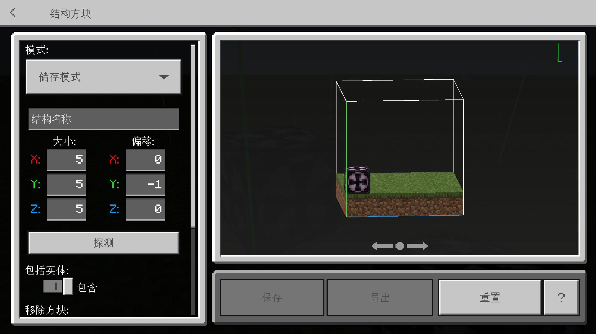

并且，结构方块会默认把自己要操作的区域的边框呈现在世界中，这大幅提高了待操作区域的可见性，比`/clone`要清晰直观得多：

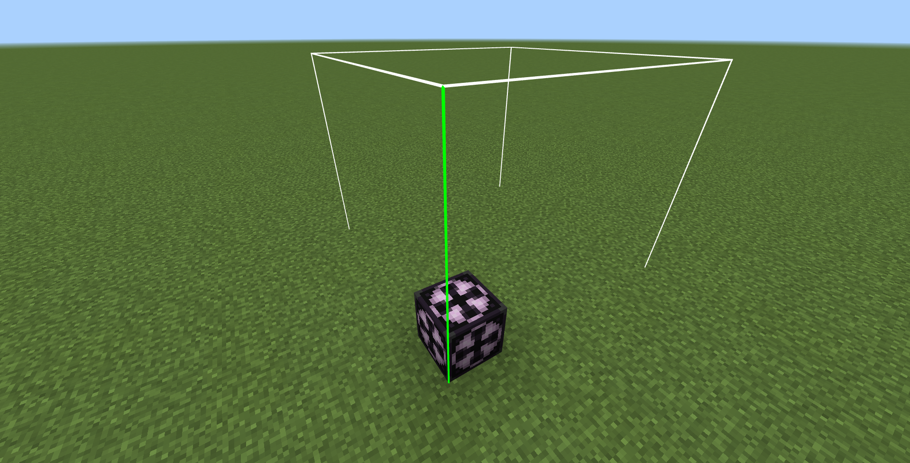

---

## 结构方块的 4 种模式

在基岩版，结构方块和命令方块的 3 种类型类似，有 4 种操作模式：**保存模式、加载模式、角落模式和 3D 输出模式**。其中，前两种模式是我们这一节要讲解的核心所在。结构方块复制粘贴结构的逻辑和`/clone`略有不同，`/clone`是不存在中间状态的，直接暴力把一个区域直接粘贴到另一个区域；而结构方块则需要先用保存模式保存一个结构，然后再用加载模式加载结构出来，是存在一个中间状态的。所以，才说`/clone`更适合简单的、小范围的复制粘贴需求。

### 保存模式

保存模式是用于保存结构的模式。在上面的 UI 图中，我们已经看到保存模式的 UI。除了可选定结构方块的模式之外，右侧有一个结构方块选定方块区域的 3D 预览图，右下角可以选择保存结构或导出结构，而左侧则是保存模式的众多设置。

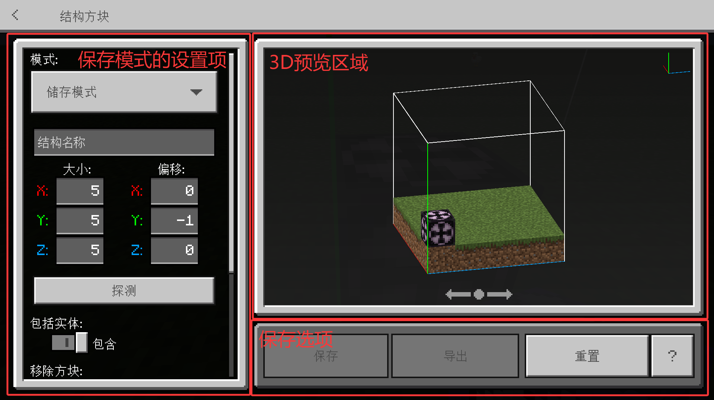

我们现在来关注左侧的各项设置。下面的选项中，**需要格外强调的选项我们已粗体标注，这些是结构方块最核心的功能**。

- **结构名称**：**待保存的结构的名称**。之后加载结构的时候，就要指定这个结构名称。
  - 请注意：*没有任何命令可以查询地图中当前可用的结构，所以请牢记你的结构名称*，如果忘了的话，就只能硬碰硬去试了。同样地，可以考虑使用驼峰命名法或下划线命名法来命名。
  - 注：允许特定的命名空间，比如`doc:test`，其中的`doc`就是命名空间。如果不指定的话，会默认设置为`mystructure`。
- **大小（X Y Z）**：**待保存的结构的大小**，默认为（5, 5, 5）。最大为（64, 320, 64）。
- **偏移（X Y Z）**：**待保存的结构的位置相对于结构方块的位置的偏移**，默认为（0, -1, 0）。
  - 我们曾经讲过，要唯一地指定一个区域，需要指定一个位置，然后从这个位置延伸出大小。所以，偏移就是指定位置的，而大小就是指定大小。读者可以尝试多次调整大小和偏移，体会大小和偏移的作用。
  - 例如，大小设置为（10, 1, 10），偏移设置为（0, 1, 0），效果如下图所示，其中红色代表 X 轴正方向，绿色表示 Y 轴正方向，蓝色表示 Z 轴正方向。  
    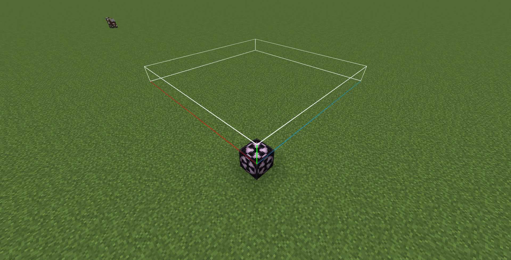‘
- 探测：这个设置要配合角落模式使用，我们稍后再强调。
- **包括实体**：**待保存的结构是否要包含实体**。默认值为`true`。
  - 是的，结构是允许自含实体的！这是相对于`/clone`的一个重大优势。通常也用这种方法来加载现成的掉落物。
- 移除方块：待保存的结构是否不包含方块。默认值为`false`。
  - 是的，结构方块也可以不保存结构的方块，不过绝大多数情况下都不会有这个需求。
- 红石保存模式：当结构方块被红石信号激活时，是保存在内存中还是保存在硬盘。默认值为保存在内存中。
  - 这个选项常常会引起很多人的困惑，但事实上在大多数情况下这个选项没有什么影响。首先，我们要知道结构方块的本质也是一种红石元件，所以可以通过红石激活，也可以直接通过结构方块的 UI 来手动激活。这个选项就是仅限于红石激活的，如果手动激活就只会保存在硬盘中。大多数情况下我们就是直接手动激活结构方块的。
  - 保存在内存中，是指当使用红石信号激活结构方块后，启用该设置后将创建一个临时结构，这个临时结构会在世界关闭后被销毁。
  - 而保存在硬盘中，是指当使用红石信号激活结构方块后，启用该设置后将创建一个稳定结构，这个稳定结构就不会在世界关闭后被销毁。
  - 要深刻的理解二者的区别，你可以想象一下你的手机的内存和闪存配置，比如 12+256 GB，那个 12GB 就是指代的内存，代表软件在内存这个临时存储空间提取的数据；而 256GB 就是你的硬盘空间。CPU 从来不是直接通过硬盘、闪存读取数据的，是通过内存和缓存这个临时空间读取的数据。所以，使用“保存在内存中”这个选项时，地图关闭后，这个临时的数据就会丢失。
- 显示边框：顾名思义，是否在世界中显示选中区域的边框。默认值为`true`。

所以基本上，**在保存模式下，我们通过大小、偏移和结构名来完整地定义一个结构，并使用结构方块提供的其他设置来对这个结构进行修饰**。

现在，我们再来关注一下底下的这三个按钮：

- **保存**：顾名思义，直接保存结构。注意这里无论如何都是保存到硬盘中。
- **导出**：使用导出按钮后，将把这个结构以`.mcstructure`文件的形式导出出去，供其他地图的结构方块和行为包使用。  
  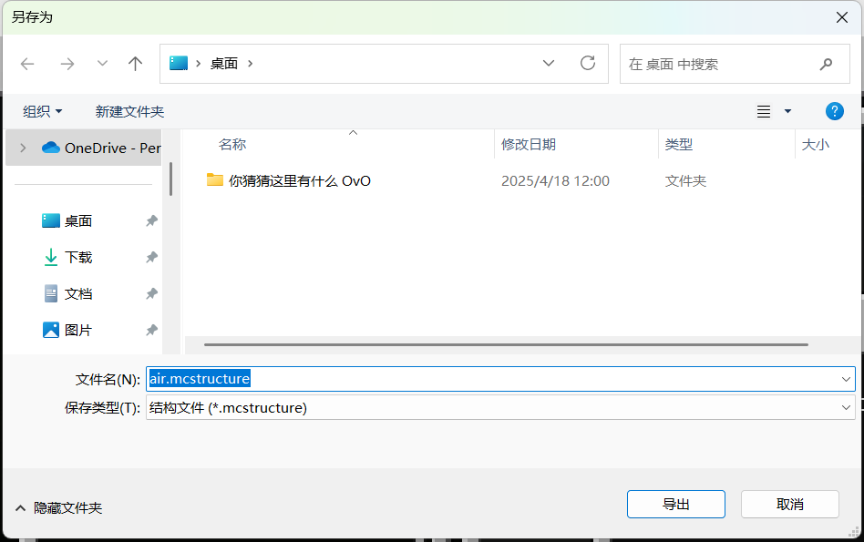
  - 这个选项只有 Windows 版本有，手机端是没有的。*~我们手机玩家招你惹你了~*
- 重置：将左侧的设置回退到上一次更改的设置，类似于撤销的操作。

所以，使用结构方块保存结构的大概步骤就是，**设定结构的名称、大小和位置，进行一些杂项设置后，点击保存按钮即可**，必要时还可以导出结构。不过，保存结构有一个很关键的原则就是——不要在结构中带上结构方块，否则在加载的时候也会把这个结构方块加载出来，通常这并不是我们想要的结果，所以一定要谨慎调整偏移量。

:::tip[实验 3.3-2]

新开一张地图，默认世界（不开超平坦）、打开作弊、开创造、显示坐标、关闭天气更替、终为白日，然后使用`/locate structure minecraft:pillager_outpost`寻找掠夺者哨塔，然后用结构方块保存这个结构。注意保存的结构里面不要带上结构方块。

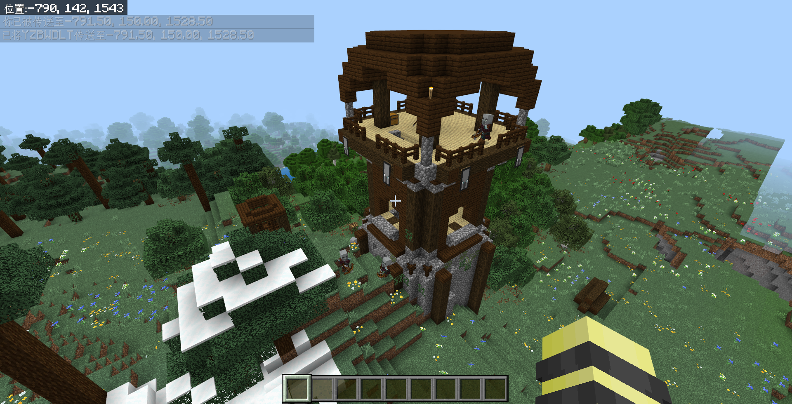  
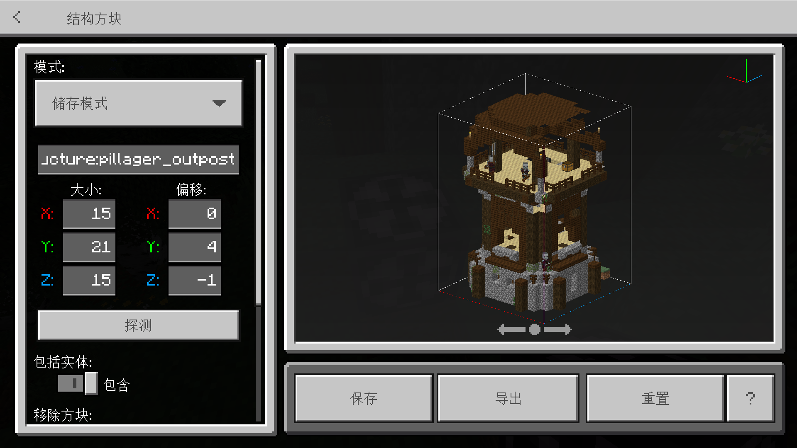

保存完了之后就先放这儿，一会儿另有他用……（坏笑）

:::

### 加载模式

现在我们来看加载模式。将左上角的模式从保存模式改为加载模式后，我们可以看到左边的设置项和右下角的几个按钮都发生了变化。

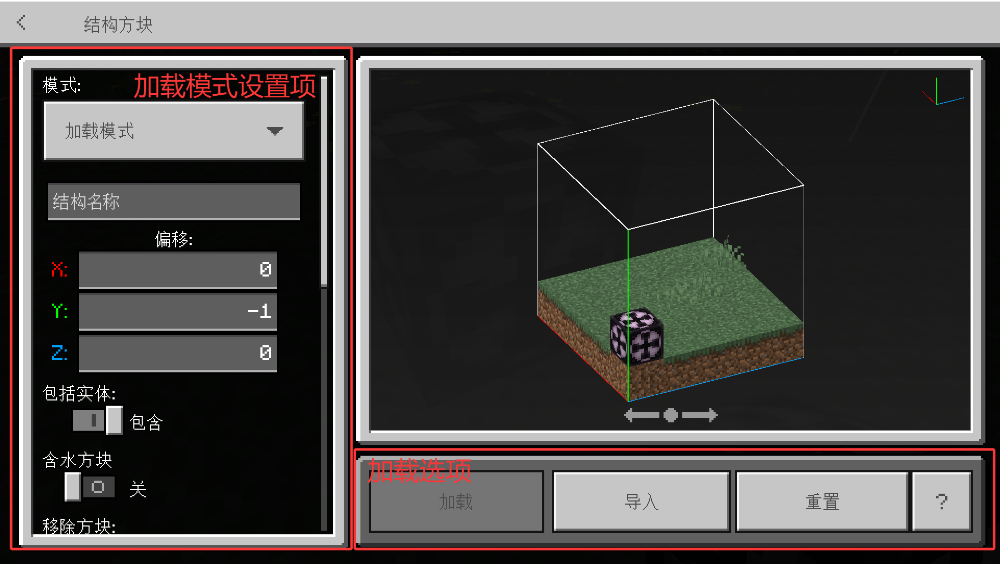  

对于右下角的三个加载选项，想必你很快就能理解：

- **加载**：加载指定名称的结构。
- **导入**：从导出的`.mcstructure`文件导入结构。这样就可以实现跨存档转换结构了。
  - 这个功能也是仅限 Windows，并且在 1.20.50 才加入。目前的中国版也是可用的了。
- **重置**：将左侧的设置回退到上一次更改的设置。

关键在于左边的设置项。可以看到这里为我们提供了非常多的设置项，我们挨个来分析一下：

- **结构名称**：毫无疑问，这是**待加载的结构的名称**，直接写入保存时使用的结构名称即可。
- **偏移（X Y Z）**：**待保存的结构的位置相对于结构方块的位置的偏移**，默认为（0, -1, 0）。
  - 这里之所以不指定大小，是因为结构本身已经保存了大小信息，这个逻辑是很类似于`/clone`的。
- **包括实体**：**是否将结构内的实体加载出来**，默认为`true`。
- 含水方块：加载结构时，使可含水方块在加载区域的水源方块上可以加载为含水方块。否则，可含水方块会取代水源方块而加载为普通方块。默认为`false`。
  - 然而，如果你加载结构的区域存在水源的话，我们强烈建议你开启这个选项。因为如果不开启这个选项的话，在水源中加载可含水方块并不会像预期的那样取代水源方块，或者更准确地说是“取代了但没完全取代”，具体表现就是这个方块加载为了一种可以像水源一样减速玩家，外观上和普通的含水方块一致，却不像水源方块一样流出水，也不判定为含水方块的 bug 方块，我们称这种现象为“假水”现象。这是一个 bug，所以请不要轻易地尝试利用这个漏洞开发玩法。在后面的模块 3，脚本 API 前事件中，我们还会再看到一次这个 bug。祝愿此漏洞可以早日修复。
- 移除方块：加载结构时，不加载方块。默认为`false`。
- **完整性**：**决定一个结构大约加载其中百分之多少的方块**，默认为`100.00`。
  - 完整性在结构加载中是非常重要的，很多地方都会需要完整性，比如建筑做旧、平台随机挖空、等等。
  - 这里还有一期[由 @小mcblac 制作的一种非常巧妙的随机箱子设计的视频](https://www.bilibili.com/video/BV1ko4y1T7EB)，其中的核心之一就使用了结构加载的完整性的思路，而且即便是读到这里的初学者也可以较好地用我们之前讲解过的理论理解视频中的内容，感兴趣的读者可以看一下。但其中的旧版`/execute`可能需要额外反应一下，读者只需要知道视频中所展现的`detect`是核心，等同于`if block`，以及断链法基本上就等于是无延迟的红石比较器就可以了。两节之后我们就会讲到社区常用的断链法。
- 种子：决定完整性这个选项如何加载其中的方块。即使同样都是 20%，不同的种子也会导致不同的加载效果。
  - 通常我们更关心完整度，不太关心种子。每次加载都会重新生成一个新的种子。
- **旋转**：**决定一个结构以多少度旋转的方式加载**，默认为`0`°。旋转的方向为以 Y 轴为旋转轴时俯瞰的**顺时针**。下图是一个旋转加载的示例，读者可以看到90°、180°、270°顺时针旋转加载所带来的不同效果。  
  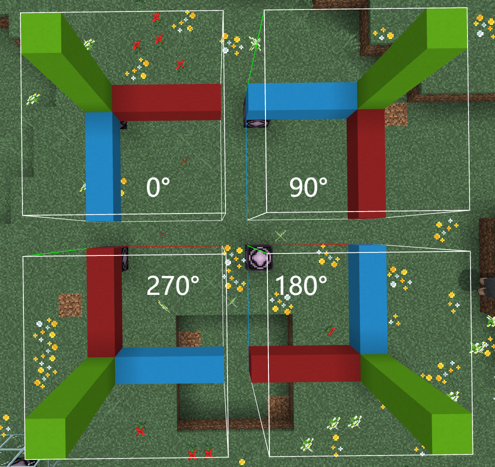
- **镜像（X,Z）**：**决定一个结构以哪个轴作为对称轴加载**，默认为`x`和`z`均不勾选。话不多说，我们直接看实例：  
  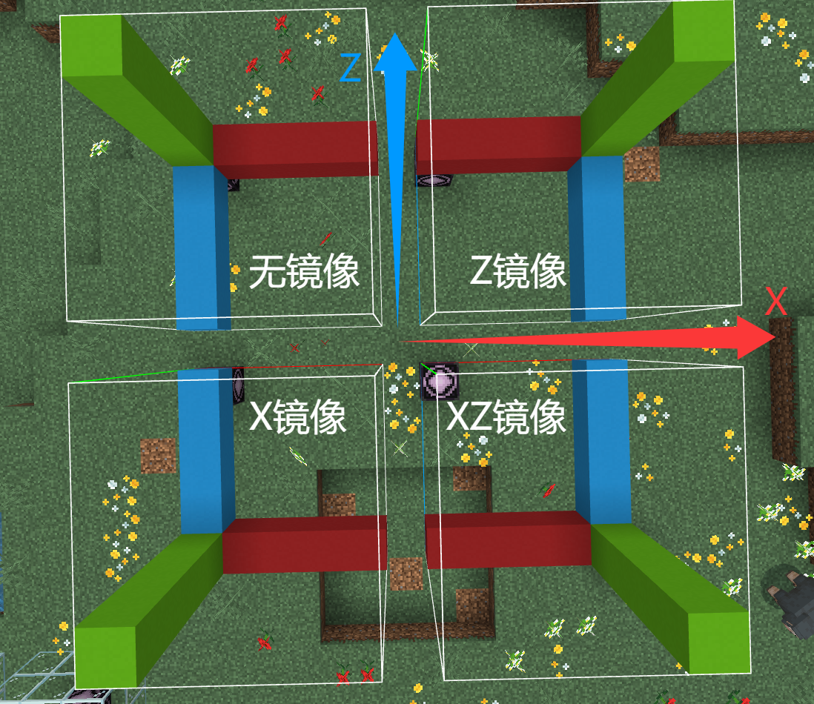  
  读者可以清楚地看到以 X、Z 轴为对称轴加载所带来的影响。同时，读者还能注意到这些加载效果和旋转很类似，但实际上却并不一样，所以不可以将旋转和镜像混为一谈，不能直接认为特定的旋转等同于特定的镜像（比如 X 镜像等同于 270° 旋转就是错误的）。
- **动画**：**决定如何加载这个结构，是一层一层加载、一个一个方块加载还是直接一口气加载完，以及加载时间**。分为动画模式（`无`、`逐层放置`、`逐块放置`，默认为`无`）和动画时长（可填写为浮点数，默认为`0.0`）。对于一些大型结构来说，延长动画时长可以防止瞬间加载大量方块所造成的卡顿。下图是一个动画的示例，逐层和逐块放置均设置为 100 秒的动画。
  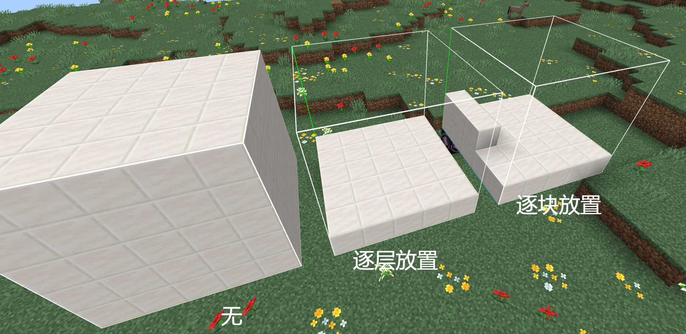
- 显示边框：是否在世界中显示选中区域的边框。默认值为`true`。

可以说，只要你愿意动手挨个去试一试，很快就能发现这些设置的用途。所以，使用结构方块加载结构的大概步骤就是，**设定结构的名称和位置，进行一些杂项设置后，点击加载按钮即可**。

:::tip[实验 3.3-3]

使用`/locate`命令定位一个村庄，然后在村庄里加载这个掠夺者哨塔吧！>:)

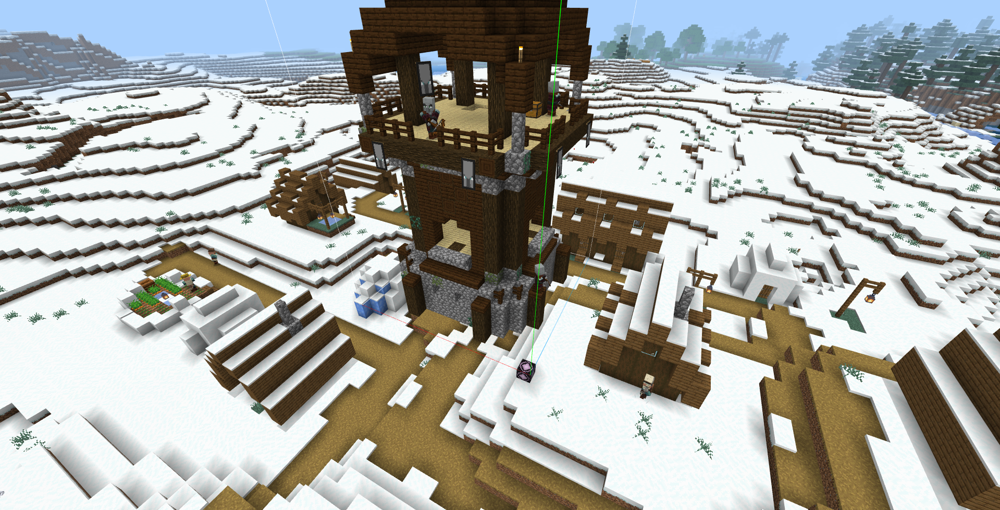

:::

### 角落模式

角落模式可以说是从保存模式延伸出的一种特殊模式，它是用来帮我们快速定位一个结构的两个角落的。

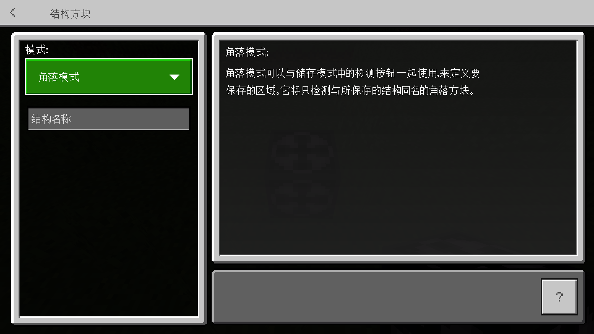  
↑ 结构方块的角落模式 UI

我们可以看到，这个 UI 是很简单的。现在我们来介绍一下角落模式的用法。我们以下面这棵树为例：

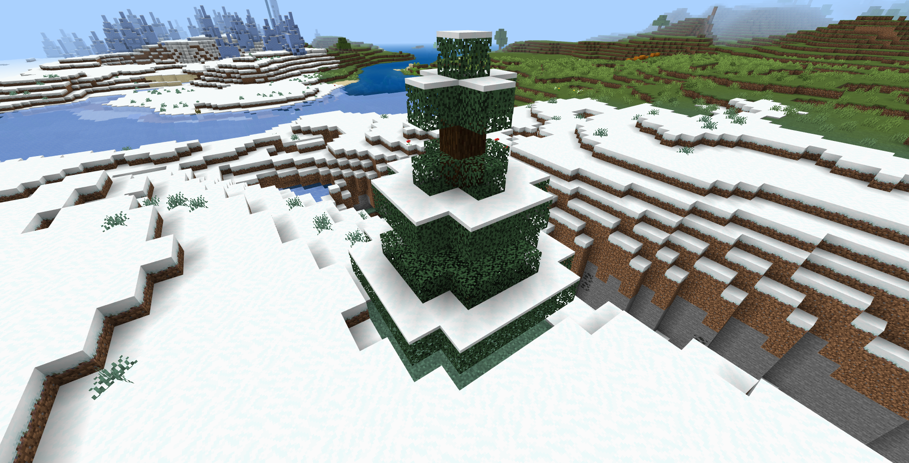

首先，我们找到这棵树的角落，确定这个角落后能够完全地包括这整个结构，也就是这棵树，然后在这个角落外角处放一个保存模式的结构方块：

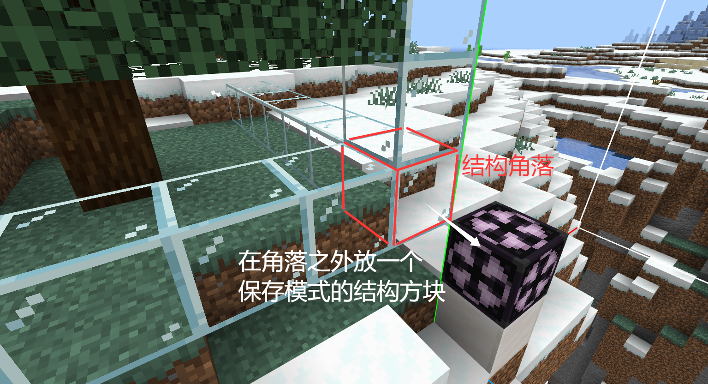

至于为什么要这么放，而不是直接放到角落位置上，一会儿我们就会谈到。然后，在这个结构的对角处，也类似地放一个角落模式的结构方块，同样不要放到角落位置上：

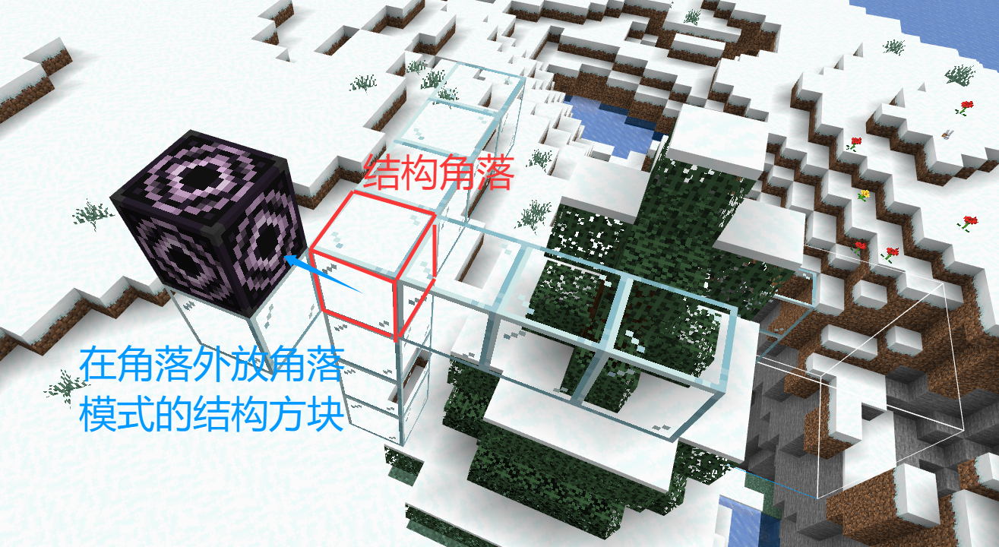

现在，对于这两个结构方块，我们使用同样的结构名称`mystructure:tree`：

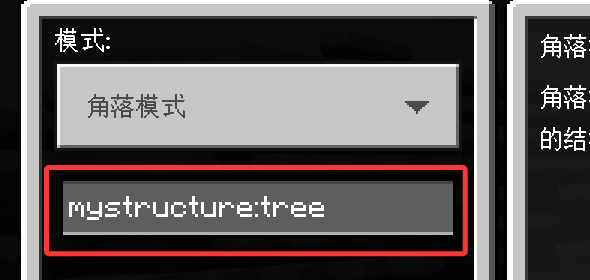

然后，我们便可以使用保存模式的“检测”来检查同名的角落模式的结构方块了：

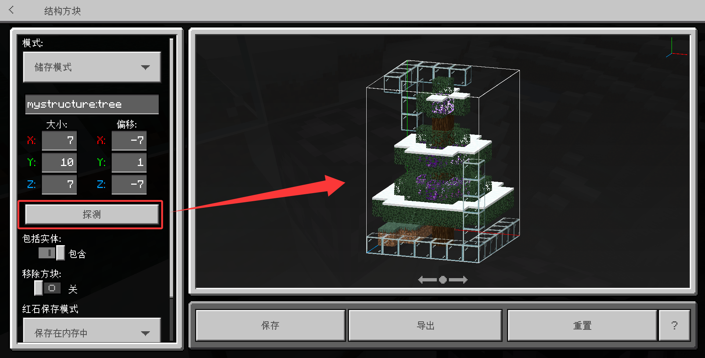

现在，你便知道为什么我们不能直接将结构方块放到角落位置上了，为了结构中不包含结构方块，角落模式的运行是特意被设计为选中两个结构方块所成区域的内部的。角落模式的实际用途并不是很多，因为选中这样一个角落并不是什么简单事情，通常我们是直接调整保存模式的大小和偏移参数直接选定结构区域的。

### *3D 输出模式

3D 输出模式可以用于将结构输出为一个`.glb`的 3D 模型，以便其他软件进行进一步的更改。

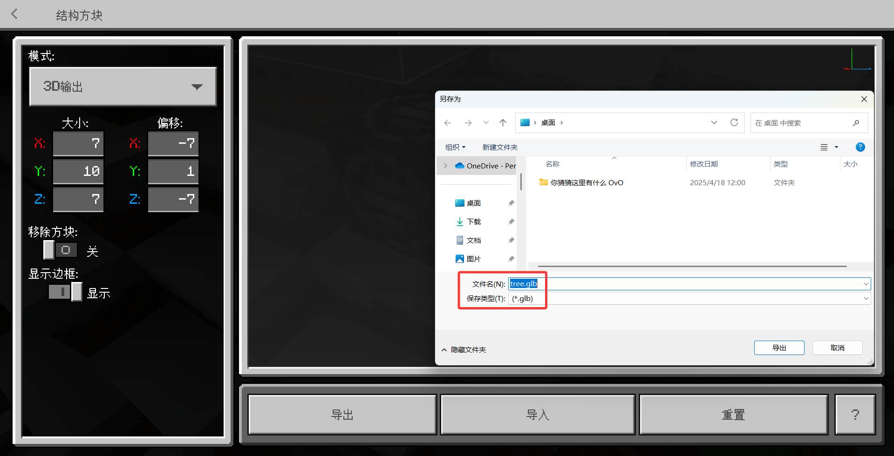

这个模式可由画图 3D 打开，但现在该软件已经停止更新。而且，这个模式仅限 Windows 版本可用。

## 结构方块的几种进阶用法

### 随机做旧

在建筑领域，我们总是会有随机做旧的需求。假设现在我们要将下面的这个石砖火柴盒做旧：

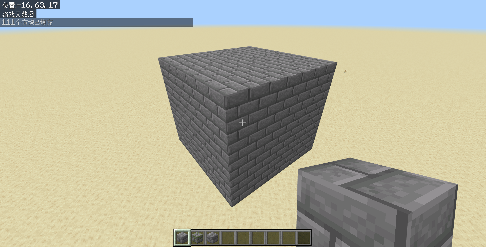

我们可以先复制这个火柴盒，然后全部换为苔石砖；同理地可以再复制一个然后全换为裂纹石砖。

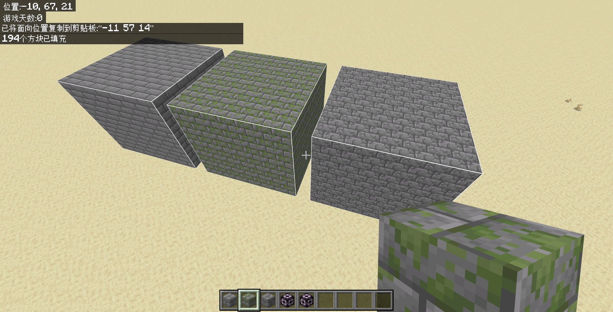

我们可以重新再分别保存为`mystructure:room`、`mystructure:room_mossy`和`mystructure:room_cracked`，然后先加载普通石砖的`room`，再在同一个位置再加载完整度为 20% 的苔石砖的`room_mossy`，清除种子后再加载完整度为 10% 的裂纹石砖的`room_cracked`，就能呈现出做旧效果：

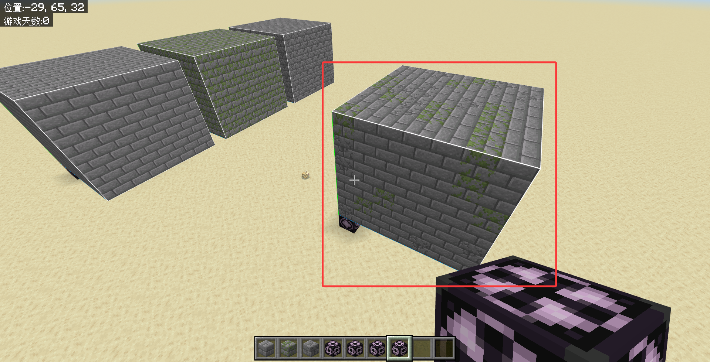

### 加载掉落物

虽然我们不能使用`/summon`直接生成掉落物，但是我们还是有一些方法可以用于加载掉落物。以前，我们通常使用在箱子内放上特定物品，然后复制箱子后再通过`/setblock ... destroy`等方法破坏掉复制的箱子，传送特定位置的掉落物。然而，现在我们还可以使用结构的方法直接保存掉落物实体，在特定的时候再加载。假设我们现在要加载一颗钻石，我们可以将结构名称设置为`mystructure:item_diamond`，然后将大小设置为（1, 1, 1），偏移设置为（0, 1, 0）：

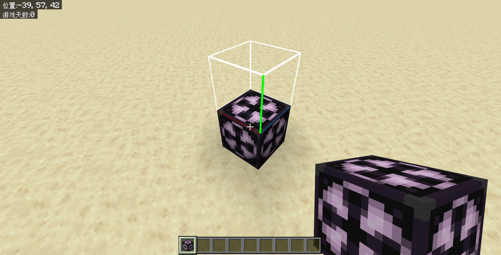

然后，我们可以在这个区域内扔一颗钻石，然后尽快保存。因为众所周知，掉落物会在 5 分钟后消失，即使是重新加载，也不会重置这个掉落物存在的时长，所以通过这种方式加载的掉落物不到 5 分钟就会消失（毕竟保存也是需要时间的）。如果你的要求比较高的话，可以把物品传送到方块中间，这可以用`/execute ... align`来实现。

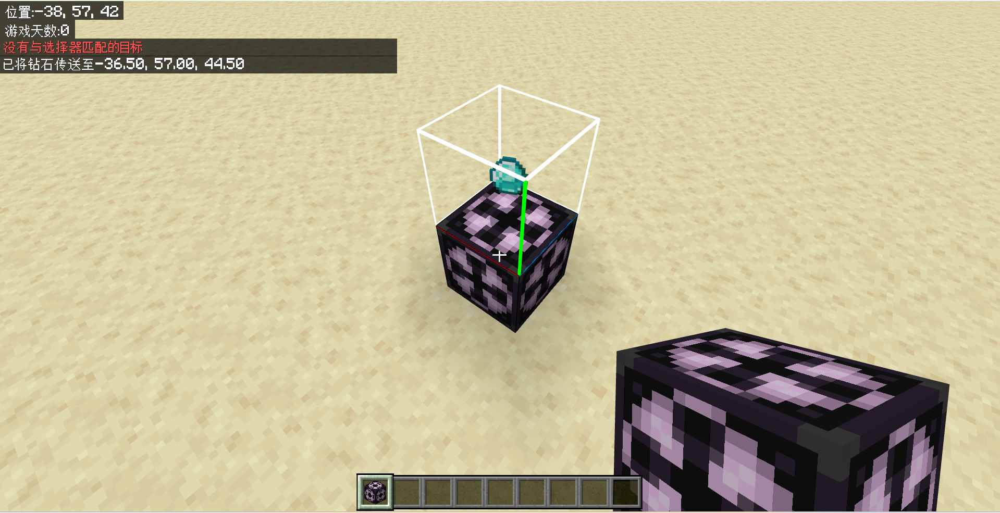

参考命令如下：

```text
/execute as @e[type=item] at @s align xz positioned ~0.5~~0.5 run tp @s ~~~
```

然后，加载这个结构就能生成钻石了。

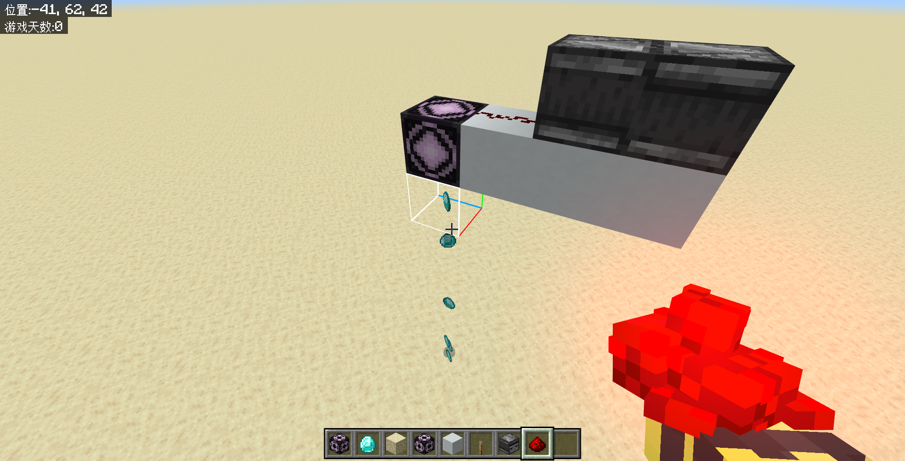

### 跨存档复制结构

:::warning[温馨提醒]

该功能仅限 Windows 版本可用。

:::

现在假设我们希望将上面的`mystructure:room`复制到另一个存档，我们可以在保存这个方块的时候将结构导出为`room.mcstructure`。然后，在另一个存档中直接在加载模式的结构方块中导入。

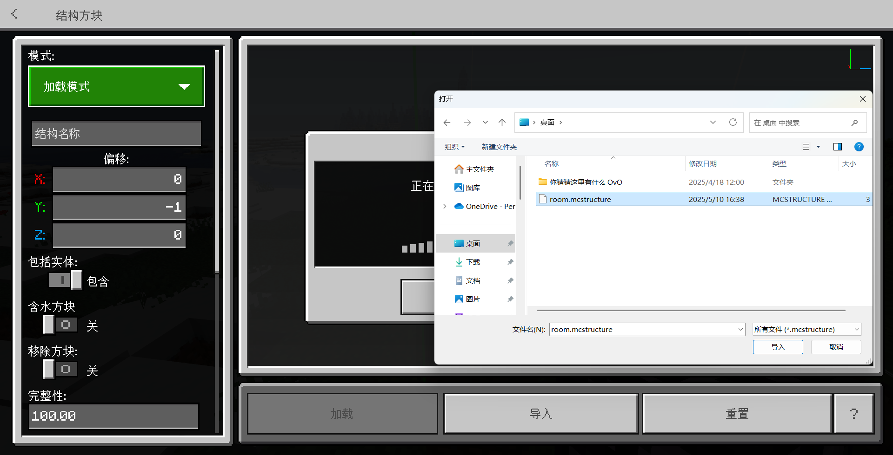

结构一经导入，就是保存到硬盘中的，即便退出游戏再回来也能使用。

在 1.20.50 版本之前，跨存档复制结构要麻烦不少，需要使用行为包才能处理。不过，随着中国版也一并更新 1.20.50，我们建议使用低版本的读者也应至少更新到不低于中国版的版本。

### 制作空岛 PVP 相关的岛屿

对于起床战争、空岛战争这种和空岛有关的 PVP，常常需要制作一模一样的环境的岛屿，以实现双方或多方的公平竞争。这时候，我们就可以使用结构方块了。现在假设有这样的一个红队岛屿：

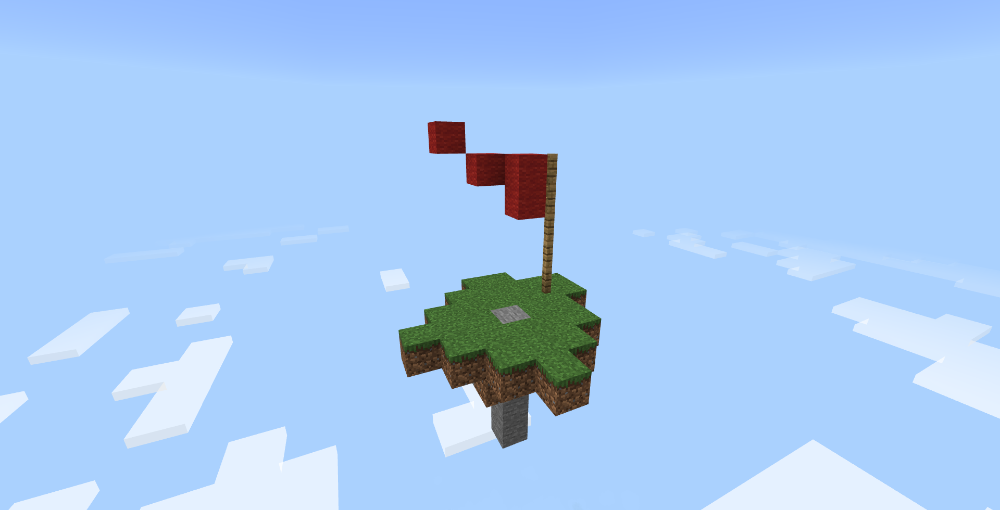

其中，中心为（50, ?, 0）的石头。如何确保另一边的岛屿的布局是完全和红队一样，并且中心位于（-50, ?, 0）的呢？首先我们不难发现一点，这两个坐标是关于 Z 轴对称的，所以，稍后应该使用 Z 轴镜像。我们使用结构方块保存这个结构：

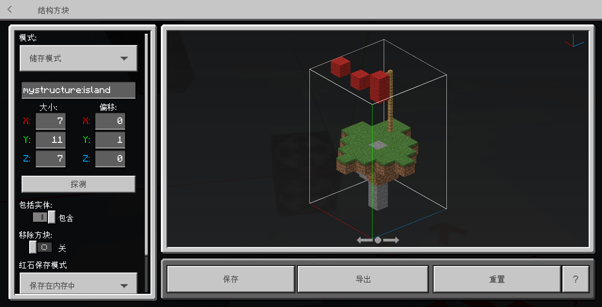  
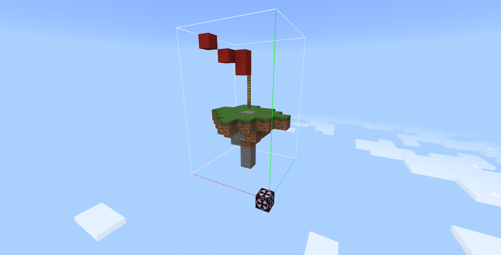  

原则上，岛屿结构应该是恰好被包括在内的，不宜过大或过小，就像上图一样，将岛屿的所有元素刚刚好地囊括在内，可以帮助我们更好地确定该复制到的目标位置。然后，我们记录下结构方块所在的位置，例如这里是（47, 279, -3）。接下来，我们可以考虑在对称的（-47, 279, -3）先放一个任意的方块，如下图所示：

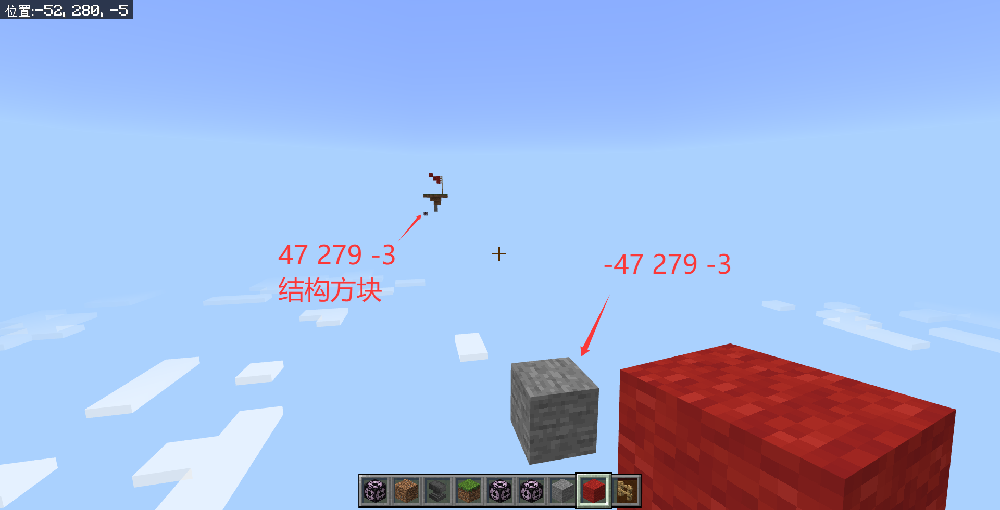

使用`Ctrl+鼠标中键`来复制结构方块（当然你也可以尝试短暂记忆一下结构方块的大小和偏移信息），基于（-47, 279, -3）的方块确定一个结构方块的位置，使得其框架刚好是和另一侧为关于 Z 轴对称的：

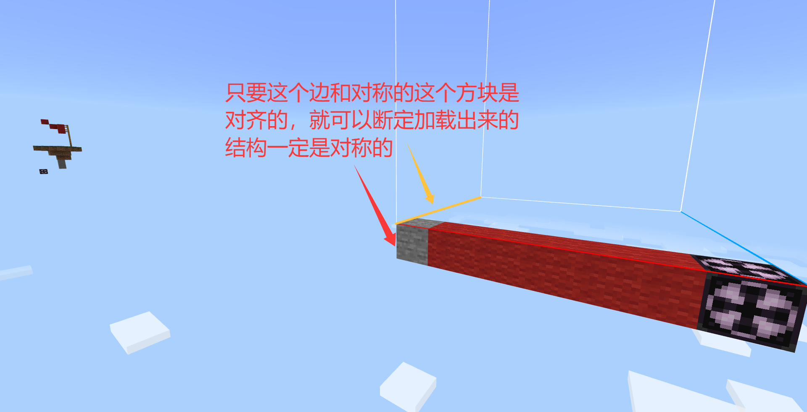

最后，将结构方块改为加载模式，并改为关于 Z 轴镜像对称加载，就可以得到两个关于 Z=0 对称的岛屿。中间的石头经过此番操作后，可以发现确实是我们所预期的那样对称。最后不要忘了将红色羊毛改为蓝色羊毛哦。

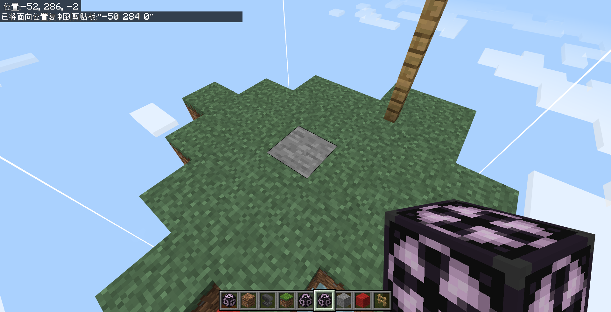

空岛战争或起床战争基本都是用类似的方法加载的结构，**本质上都是在使用旋转功能、镜像功能、或者二者兼备**。

## 结构空位的用法

如果我们在地底加载刚刚保存的结构`mystructure:tree`，我们可以看到地底会被掏空：

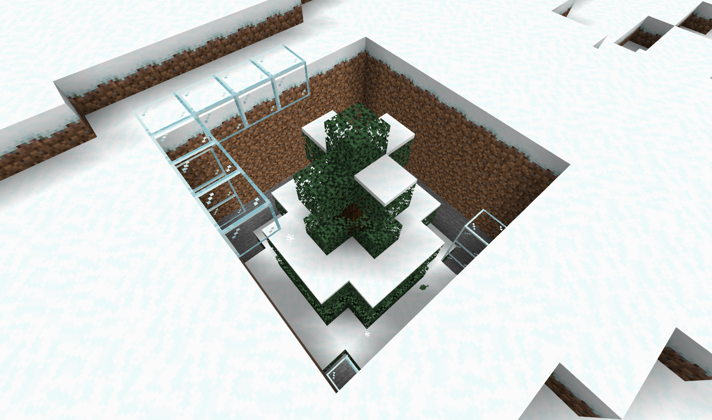

这是因为，我们刚刚保存的结构中是包含了空气的，所以在加载的时候，原有位置的方块就会被加载为空气，也就是“被掏空”。有什么办法可以防止原来的位置被替换为空气呢？我们可以用**结构空位（Structure Void）**，它是一种**标记加载结构时不替换某一位置的方块**。和结构方块、命令方块类似，结构空位也必须依靠命令获取，我们给一条参考命令，读者可以执行之：

```text
/give @s structure_void
```

结构空位的长相如下图所示。和其他方块不同，结构空位必须要在创造模式的玩家手持时才能在该玩家的屏幕中显示出来，否则就不会再显示了。

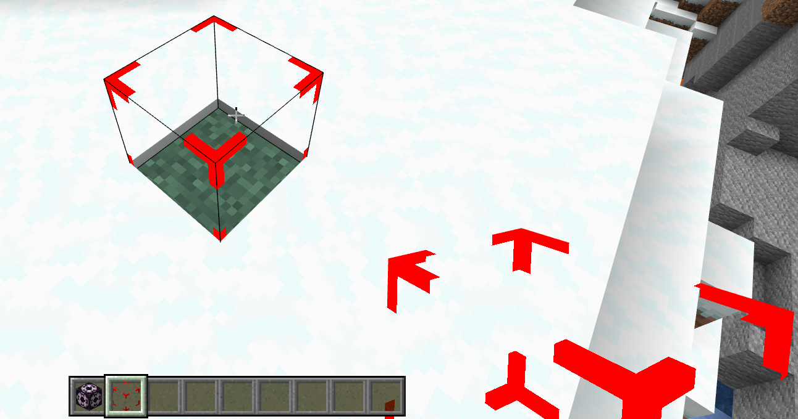

### 基本用法

基本的用法就是在保存结构的时候，将所有的空气都换为结构空位，以防止加载结构的时候加载出空气。所以，刚刚的结构中我们可以用`/fill ... structure_void keep`命令先把空气都替换为结构空位：

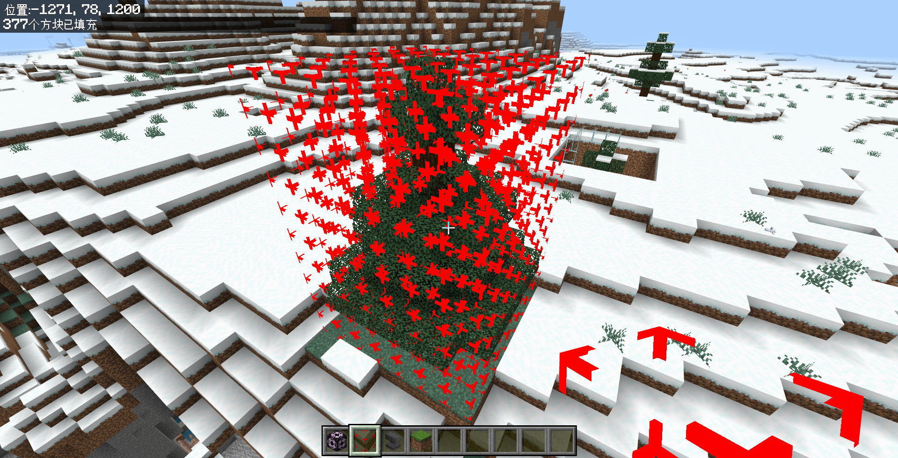

保存之后再加载，就不会导致原来的区域被掏空了：

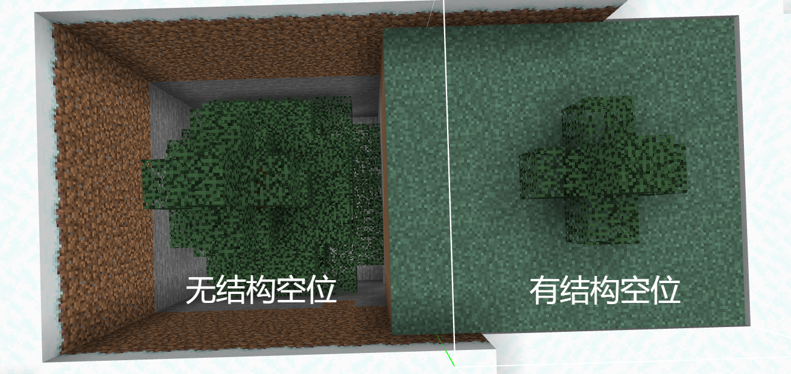

看，结构空位的用法很简单吧？

### 进阶用法 1：阻止交互

即使是冒险模式的玩家，也可以和一些方块进行交互，有时候这并不是我们想要的效果。比如，对于一些解密地图来说，可能会使用工作台作为装饰方块，然而玩家一旦遇到工作台，身上的装备就很可能会意外地变成其他东西。

这时候，我们就可以在工作台旁边套上结构空位，阻止玩家和工作台进行交互。

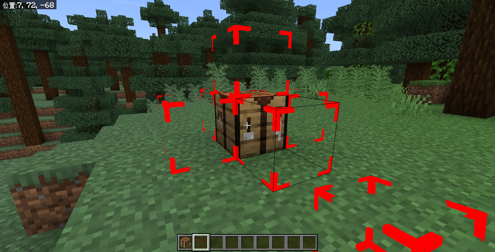

一些租赁服可能会采用更极端的手段，将一些主要区域全部填充为结构空位，甚至可以防止玩家之间在大厅互相攻击，这样就不用调整`pvp`游戏规则了（因为`pvp`游戏规则对全世界都生效，有时候是被迫不能开启这个游戏规则的）。

不过，可以这么做的前提是**玩家必须得是冒险模式**。要知道一点是生存模式的玩家是可以破坏结构空位的！

### 进阶用法 2：浮空方块

和 Java 版不同的是，基岩版的结构空位是允许其他方块附着的！这就允许我们直接在上面放灯笼、告示牌、铁轨这种强烈依赖附着面的方块。依据这种特性，我们便可以制作这种**稳定的**浮空告示牌、浮空灯笼、浮空铁轨等，铁轨上面还可以放矿车，还能坐人哦！

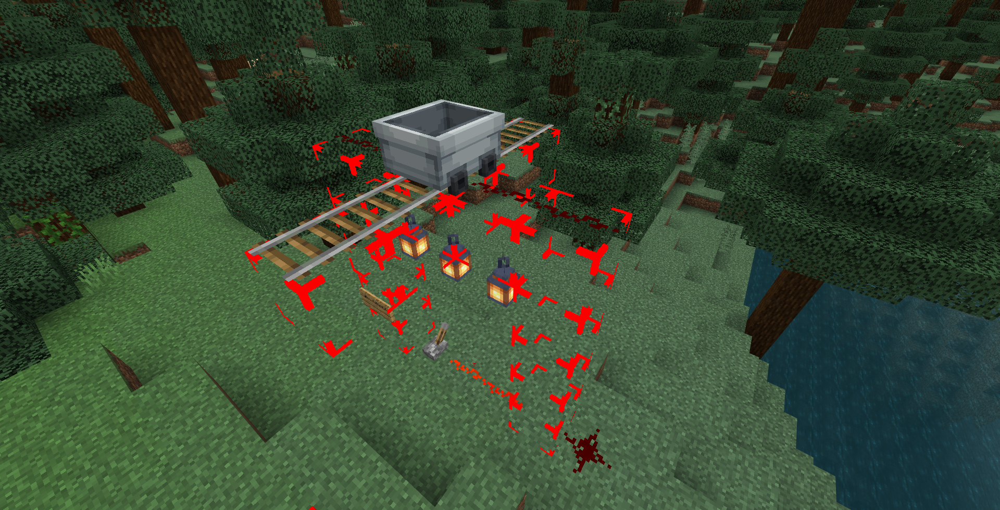

注意一点是，结构空位并不是红石导体。*（虽然上图并不足以说明这一点，总之换成红石中继器也不能传输信号）*

### 进阶用法 3：作为占位符

结构空位具有一些非常好的性质，尤其是可穿过且不可见这种类似于空气的性质。在这里，我们可以将一种门设定在这个位置：

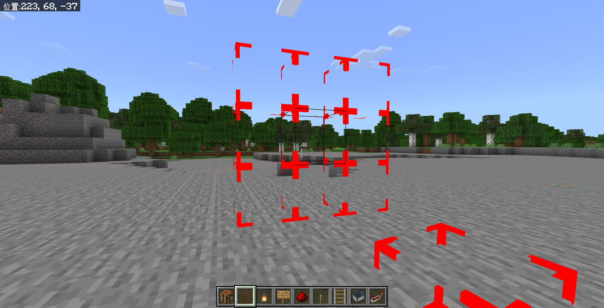

这种门在开启的时候就是结构空位，而关闭的时候可以采用某种方法将结构空位改变为特殊的实体方块。在遇到某些特殊需求的时候，比如要相对于玩家位置而言的这种**相对坐标**和**局部坐标**，而不是用绝对坐标的情况下，结构空位作为占位符可以防止其他方块被波及（使用`/fill ... replace structure_void`来解决）。

## 结构命令`/structure`

现在，我们再来看`/structure`，你便会觉得十分地易于理解。虽然它的语法长到令人发指：

```text title="/structure的语法" showLineNumbers
/structure save <名称: string> <起点: x y z> <终点: x y z> [存储模式: StructureSaveMode]
/structure save <名称: string> <起点: x y z> <终点: x y z> [包含实体: Boolean] [存储模式: StructureSaveMode] [包含方块: Boolean]
/structure load <名称: string> <目的地: x y z> [旋转: Rotation] [镜像: Mirror] [包含实体: Boolean] [包含方块: Boolean] [含水: Boolean] [完整度: float] [种子: string]
/structure load <名称: string> <目的地: x y z> [旋转: Rotation] [镜像: Mirror] [动画模式: StructureAnimationMode] [动画秒数: float] [包含实体: Boolean] [包含方块: Boolean] [含水: Boolean] [完整度: float] [种子: string]
/structure delete <名称: string>
```

但是我们仔细观察这其中的每一个参数，至少`save`和`load`用法我们已经一清二楚——这就是**把结构方块的绝大部分功能都搬过来了，仅此而已**，所以这命令其实根本不难。这个语法千万不要“死记硬背”，太长了。我甚至建议干脆就不要记语法，反正我也记不住（真的），用的时候直接`/help structure`就行了。只要你会用结构方块，那么这条命令你就也已经会了。

至于`delete`语法，这是**删除结构的语法**，这个确实是结构方块所做不到的。语法也很简单，你一看便知。

虽然结构命令我们没有过于深入地去讲，但再强调一遍：**这并不代表它不重要，毕竟它还是高频命令**！请务必掌握结构方块的用法，会了结构方块就是会了这条命令了。

---

## 总结

本节我们学习了结构方块，了解了结构方块的基本用法为保存和加载结构。此外，还学习了结构空位，并了解了它的一些性质可以用作一些比较特殊的用途。那我们现在来回顾一下结构方块和结构空位吧！

- 结构方块（Structure Block）
  - 是一种对结构（建筑）进行操作（主要是复制粘贴）的红石元件。必须通过命令（ID：`structure_block`）获取。
  - 和`/clone`的关系
    - 都用于复制粘贴特定区域的建筑（结构）。
    - 结构方块的优势：相比于`/clone`，结构方块能够保存结构里的实体、能够按照特定的旋转、镜像、完整度、动画加载、以及有清晰的边框反映结构方块影响的区域，所以功能性上是远强于`/clone`的。
    - 结构方块的劣势：但是，因为存在一个“中间状态”，使得复制粘贴小范围的方块的时候并没有`/clone`来的方便。
  - 有 4 种模式：保存模式、加载模式、角落模式和 3D 输出模式。
    - 保存模式：**用于保存结构的模式**，通过**大小**、**偏移**和**结构名**来完整地定义一个结构，并使用结构方块提供的其他设置（**包括实体**、移除方块、红石保存模式、显示边框）来对这个结构进行修饰，最后通过保存按钮来保存结构，也可以通过导出按钮导出一个`.mcstructure`结构文件。*注意一个保存原则是：不要在结构内保存结构方块。*
    - 加载模式：**用于加载刚刚保存的，或从外部导入的结构的模式**。通过**偏移**和**结构名**定义加载的结构及其位置，并使用结构方块提供的其他设置（**包括实体**、含水方块、移除方块、**完整性**、种子、**旋转**、**镜像**、**动画模式**、**动画时长**、显示边框）来对这个结构进行修饰，最后通过加载按钮来加载结构。
    - 角落模式：和保存模式联合使用，用于确定一个区域的两个角落。
    - 3D 输出模式：用于导出一个`.glb`的 3D 模型文件。
- 结构空位（Structure Void）
  - **标记加载结构时不替换某一位置的方块**。必须通过命令获取。
  - 是一种完整方块，一些可附着方块（灯笼、告示牌等）可以附着在其表面形成稳定的悬空方块。
  - 具有一些和空气类似的性质，可穿过且特定情况下不可见。但是，可以在生存模式下被破坏，也因为其完整方块的性质而不允许其他方块直接替换。
- 结构命令`/structure`
  - 分为`save`、`load`、`delete`用法。
  - 其中，`save`和`load`用法的功能都来自于结构方块。
  - 而`delete`用法则清除特定名称的结构。

本节不设置习题。我们相信只要读者跟着我们在教程中给出的例子做了之后，应当基本上能够掌握结构方块的用法。
