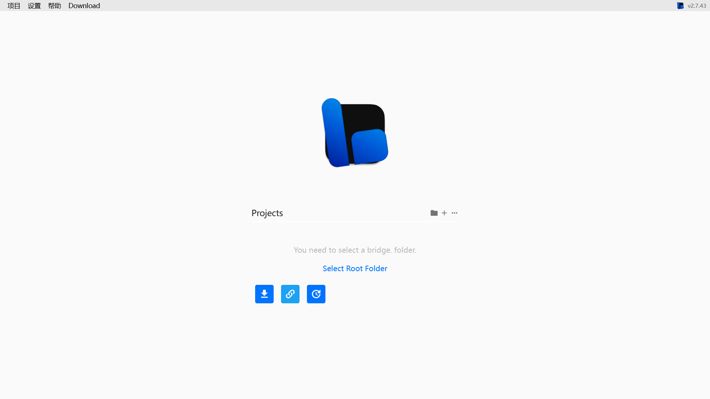
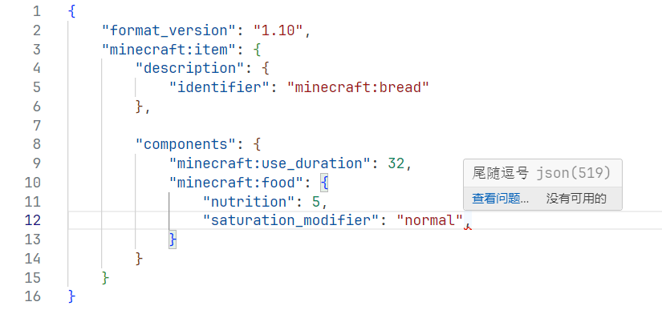

# 1.3.1 常用的文本编辑器

在 1.3，我们要学习如何构建一个基础的附加包框架。我们上节学习了 JSON 的基本语法，并简单回顾了一下命令中的 JSON。然而，我们要在什么地方写这些 JSON 却是一个问题。说是问题，其实也简单。我们通常在**文本编辑器**中编写一个 JSON。文本编辑器说白了就是编辑文本的软件，某种意义上连 Windows 自带的记事本都是一种文本编辑器。

然而，为了便利于我们的开发，我们通常都会追求一些更“专业”的文本编辑器，也就是在我们特定的开发环境的需求下，能够自动为我们实现环境搭建、补全、高亮、纠错等一系列功能。可能用惯了记事本的读者会觉得这是一些很“梦幻”的功能，然而事实上这种软件几十年前就早已是现实了。这样的软件叫做**集成开发环境（Integrated Development Environment，IDE）**。大型的 IDE 通常都是在 Windows 可用的，所以开发也常常需要一台电脑。不过，这并不意味着手机就不能搞 Minecraft 的模组开发了，只是这个过程会非常繁琐，处处都充满着不便。稍后我们会介绍两个最常用的 IDE，从这节开始一直到最后的模块 3，我们都会使用其中最常用的一个 IDE，所以请读者务必跟着做好。

为什么我们不用 Windows 自带的记事本呢？先不说失去补全高亮纠错等辅助性功能，导致其编程体验甚至跟手机差不多之外，还有一个问题是，在低版本的 Windows 下，它独特的编码机制会使得中文失效（因为低版本的 Windows 并不使用 UTF-8 编码），以及有着其他种种问题。在廖雪峰的 Python 教程下，曾经专门吐槽过这一点：

> 请注意，不要用 Word 和 Windows 自带的记事本。Word 保存的不是纯文本文件，而记事本会自作聪明地在文件开始的地方加上几个特殊字符（UTF-8 BOM），结果会导致程序运行出现莫名其妙的错误。
> —— [廖雪峰的 PYTHON 教程，4.1 使用文本编辑器](https://liaoxuefeng.com/books/python/first-program/text-editor/index.html)

## 在 Windows 平台上常用的文本编辑器

下一个问题，既然不推荐用记事本，那我们该使用什么文本编辑器来编写基岩版的附加包呢？

### Visual Studio Code

**由微软出品的 Visual Studio Code（VSC）是我们首选中的首选**。VSC 是一款轻量化的 IDE 和代码编辑器，它适配市面上主流的各种编程语言代码和编程相关的代码，包括知名的 Java、C、C++、JavaScript、Python 等，以及我们在附加包编写中所常见的 JSON。它甚至支持 Minecraft 独有的`.mcfunction`！都不用说在 Minecraft 基岩版的编程领域，就是在整个计算机编程领域，VSC 都是十分受欢迎的 IDE。


这还没完，VSC 还可以下载各路开发者所提供的辅助扩展（有时大家也称之为插件），来进一步强化在特定领域的功能。在 Minecraft 基岩版附加包编写这方面，我们也会强调“属于我们自己的”插件。可以说，在基岩版的附加包编写领域，但凡是有条件的开发者的首选 IDE 几乎清一色地都是 VSC，或者至少需要用到 VSC。

注意：市面上还有一款软件叫做 Visual Studio，也是微软出品的，那个软件就明显地要大得多，而且并不是我们要找的软件。注意搜索的时候不要把那个“Code”丢下了，也不要把 VSC 和 Visual Studio 两个软件进行混淆。

[VSC 的下载链接在这里](https://code.visualstudio.com/download)。在微软商店（Microsoft Store）中也能找得到 VSC。

### bridge.

此外，在基岩版开发的领域还有一种专门的 IDE 叫做 bridge. 。[它的官网在这里](https://bridge-core.app/)。bridge. 和 VSC 其实是高度类似的，而且在创建各种初始文件上会比 VSC 这种适配万家语言的 IDE 要更加专业一些，最关键的是它支持在线编辑，无需下载任何软件即可编写附加包，如下图所示。



只是在编写脚本的时候，bridge. 的便利性就远远没有 VSC 要来的方便，在全局查找这方面也没有 VSC 做的更好，而且 bridge. 的插件太少而且很多都已过时。可以说，二者分别有二者的优缺点。从各种角度综合考虑，接下来的所有教程中我们都会以 VSC 作为基准。

### *PyCharm

PyCharm 是一款专门用于编写 Python 代码的 IDE。Python 这门编程语言在 Minecraft 的主要应用是中国版的脚本，也就是我们会在模块 3 提到的 ModAPI。其余关于 Python 代码的需求，通常 VSC 也能解决。

## 在 Android 平台上常用的文本编辑器

在手机上，我们并没有这么方便的 IDE 可言，连对常见编程语言的支持的 IDE 都极其少见，就更不用提 MC 的专属 IDE 了。除了上面提到的 bridge. 可以在手机上用之外，我们也可以用一些常见的文件管理器来编写一些专业文件。这里，我们推荐 MT 管理器，理论上在各大应用商店应该都能搜得到。它其实是一款文件管理器，只不过内置了文本编辑器的功能。MT 管理器目前也是很多只能用手机的玩家的首选文本编辑器。

## 配置 VSC 和 VSC 常用的操作

:::note[温馨提示]

以下内容仅限 Windows 等电脑设备可用。

:::

VSC 是一款成熟且专业的 IDE，它含有上百种快捷操作、数十种支持的编程语言和成千上万个可用的插件，连 60 条命令都要单开一个模块的我们要全部掌握这些用法再用 VSC 是不现实的。通常用一款软件，我们最常用的功能也就占这个 IDE 的一小部分而已，所以在这一部分，我们来专门探讨一下 VSC 的常见的使用方法。

### 插件配置

首先我们要先下载 VSC 并安装，通常来说除了路径要注意一下（可以选择不装在 C 盘，以防 C 盘爆盘）之外，无脑下一步即可。安装完成之后应该是一个英文的黑色的界面。因为我已经用 VSC 很长时间，没有办法直接提供这个界面，总之以你的界面为准哦。

要改变主题的话可以按照下图的操作进行。使用什么主题全看个人心情，我个人更偏爱白色一些。


接下来，我们将 VSC 改成中文。按照下图的步骤，搜索并安装简体中文的插件并重启 VSC 后就可以使用中文了。


在重启 VSC 之后，我们来安装几个非常关键的基岩版开发相关的插件。还是左边插件，我们搜索“bedrock”，会蹦出来几个可用的插件，我们先安装 **Blockception's Minecraft Bedrock Development、Bedrock Definitions、Snowstorm** 这三个插件，其他插件看读者个人兴趣和需求自行安装。


- 第一个插件 Blockception's Minecraft Bedrock Development 是我们要用到的最主要的插件，它负责进行各种环境检查、自动补全和自动纠错等。虽然它的纠错时常会出毛病，至于如何禁用不正确的纠错我们之后会详谈。
- 第二个插件 Bedrock Definitions 则负责链接代码中涉及到的其他文件的定义。毕竟写附加包的话我们不可能只有一个文件，多个文件之间的联动是几乎不可避免的，这时候使用链接功能就能够很快地帮助我们重定向。
- 第三个插件 Snowstorm 是我们在编写粒子时要用到的插件。粒子是资源包的一部分，而我们也知道资源包通常负责渲染等工作，所以事先清楚粒子效果能大幅简化我们的开发流程。Snowstorm 就是一款社区内十分常用的粒子可视化插件。后面我们还会看到一些这种可视化的软件。

### 基本操作

接下来我们再学习一些最基本的操作。在文件 - 新建文本文件这里新建一个文本文件，选择语言为 JSON：

  


然后我们试着打一段内容上去吧！试着把下面的东西原样地输入上去，包括换行和 4 缩进，但是不要直接复制粘贴，先练练手，作为打字练习。

你会发现打上一个花括号`{`的时候，VSC 会自动补上另一个括号，在括号中间换行也会自动缩进，是不是很方便？

```json showLineNumbers
{
    "format_version": "1.10",
    "minecraft:item": {
        "description": {
            "identifier": "minecraft:bread"
        },

        "components": {
            "minecraft:use_duration": 32,
            "minecraft:food": {
                "nutrition": 5,
                "saturation_modifier": "normal"
            }
        }
    }
}
```

然后，按下`Ctrl+S`来保存文件，我们可以先保存到桌面上，反正只是一个草稿而已，不需要的时候删掉就好了。这是一个很常用的快捷键，养成良好的习惯，要勤于保存哦。

  
*备注：我这里选择的字体和读者默认的代码字体 Consolas 应该是有区别的，这个代码字体叫 JetBrains，喜欢的读者可以自行下载并在网上查找更改字体的方法，视情况可能需要重启软件甚至重启电脑*。

来回顾一下上一节的内容。我们在第 12 行加一个尾随逗号试试：



你会看到，那个尾随逗号出现了一个红色波浪线，代表这是一个**错误（Error）**。这种错误是会严重影响 JSON 的解析的，所以通常要重视。鼠标指向红色波浪线的时候，会告诉你问题原因。

对付中文符号的时候，VSC 的报错也十分好用。下图的逗号就是中文逗号，报错“缺少逗号”，说明这不是 JSON 预期的逗号，显然这就是中文逗号，换掉即可。


对付各种 JSON 的语法错误，VSC 都能够正确即时解析，有效帮助我们避免这种低级问题。


唯一可能无须担心的就是注释问题，VSC 不知道我们正在编写的是 Minecraft 附加包，所以会对注释报错。通常为了避免 VSC 报错，我们也不推荐在 JSON 中引入注释。


下面是一些常用快捷键的用法。

- `Ctrl+C`：复制选中的内容到剪贴板。
- `Ctrl+X`：剪切选中的内容到剪贴板。
- `Ctrl+V`：粘贴剪贴板中的内容到光标的位置。
- `Ctrl+A`：全选。
- `Ctrl+D`：选中下一个匹配项。将下一个和选中内容一致的内容也选中。
  
- `Ctrl+F`：启用查找替换。
- 在按住左`Alt`的情况下，可以点击代码的其他位置以添加一个新的光标，用于批量编辑。  
  

日后我们还会看到更多的 VSC 快捷用法。

### 文件管理器的设置

现在我们来简单调整一下文件管理器的设置，主要就是两件事。

1. 启用文件名后缀。无论是新建、修改、还是识别文件的时候，启用文件名后缀都是很重要的。对于 MC 开发来说，要了解到很多种文件的格式。以 Windows 11 为例，启用方法如下：  
   
2. 将一些文件（目前主要是`*.json`）的默认启用软件改成 VSC。如果以前已经有默认软件比如记事本，可以通过下面的方法改过来（或者“选择其他应用”中选择 VSC）。  
   

---

## 总结

本节我们主要引入了文件编辑器和 IDE 的概念。通常，我们都使用 VSC（Visual Studio Code）来进行 Minecraft 基岩版的开发。同时，还要装一些必备的插件，学习一些常用的快捷方式和文件管理器的必要配置。

:::info[练习 1.3-1]

打字练习：请在 VSC 中打出下面的 JSON 并保存为`manifest.json`，我们下一节就要用到。

```json title="manifest.json" showLineNumbers
{
    "format_version": 2,
    "header": {
        "name": "(包名称)",
        "description": "(包描述)",
        "uuid": "(uuid1)",
        "version": [ 1, 0, 0 ],
        "min_engine_version": [ 1, 20, 50 ]
    },
    "modules": [
        {
            "type": "data",
            "uuid": "(uuid2)",
            "version": [ 1, 0, 0 ]
        }
    ]
}
```

:::
