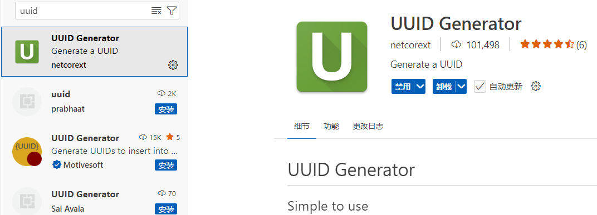
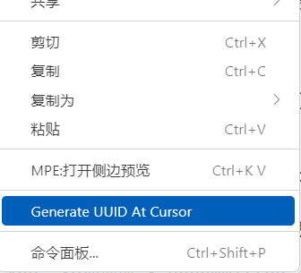

# 1.3.2 清单文件：`manifest.json`

import Tabs from '@theme/Tabs';
import TabItem from '@theme/TabItem';
import GiscusComponent from "/src/components/GiscusComponent/component.js"

在前面我们简单了解了一下文本编辑器和 IDE 的概念。在本节，我们要更进一步，来学习**附加包的“身份证”文件：清单文件`manifest.json`** 的写法。

## 清单文件的意义

为什么我们需要这样一个文件呢？这主要是出于 Minecraft 识别我们的模组的需求。

试想一下，如果没有这个文件，Minecraft 就不知道我们加入的东西是一个模组，它不知道这是什么东西的情况下就没法解析。而在特定的路径下加上这么一个清单文件，Minecraft 就能识别出来我们写的是什么模组，以及模组的各项基本信息。可以说，这就好像是我们的身份证一样，上面写上了我们的姓名、性别、住址和身份证号这样的基本信息，这样就能使别人快速地对我们建立基本印象。

## 清单文件的解析

清单文件如各位所见是一个`json`文件。在上一小节的练习中，我们已经要求读者在 VSC 中打出下面的内容，一方面是为了提升读者输入 JSON 的熟练度，而另一方面则是为本节的内容做准备。我们来看这个 JSON：

```json title="manifest.json" showLineNumbers
{
    "format_version": 2,
    "header": {
        "name": "(包名称)",
        "description": "(包描述)",
        "uuid": "(uuid1)",
        "version": [ 1, 0, 0 ],
        "min_engine_version": [ 1, 20, 50 ]
    },
    "modules": [
        {
            "type": "data",
            "uuid": "(uuid2)",
            "version": [ 1, 0, 0 ]
        }
    ]
}
```

至少目前来说，读者应该能够从语法角度解析这个 JSON，具体的解析方法在 [1.2 JSON 语法基础](./../c2_json_grammar) 中已经提及过，这里就不再赘述。

然而，放在 Minecraft 这个特定环境下，这段 JSON 就还具有更多的含义。

虽然我们通常说，编程的自由度是很高的，然而并不是想写什么就写什么，想把文件扔在哪里就扔在哪里，还必须要符合编程语言所规定的语法，或者引擎软件所规定的文件路径或者语法。换言之，有一些东西其实是固定死了的，是更底层的代码本身所提供给我们的功能，我们只有使用（或者更专业地来说叫调用）这个功能的权利，却并不能更改它们本身的逻辑，这种由更底层的代码所提供给我们的功能就叫做**接口（应用程序编程接口，Application Programming Interface，简称 API）**。

使用 API 的意义何在？意义就是，在我们调用这个应用程序的功能，期望让这个应用程序做点事情的时候，可以不由我们自己费心费力地编写代码——因为这些功能都是应用程序的开发者们为我们封装好了的，我们调用这个 API 的时候，就只需要关注它的功能，而全然不用关注它是如何实现的。你可以把这个接口理解成你的手机、电脑等电子设备上面的接口，只需要你插一根线连接其他硬件，就能实现特定的功能，就不用理解它们内部的电路板是怎么制作的，电路是怎么连接的，就是这个道理了。*~毕竟评价一款冰箱，难道还需要我去理解冰箱的构造吗？~*

在这里，我们也是调用了 Minecraft 给我们提供的 API，也就是说，这段 JSON 怎么写，那是由 Minecraft 规定的，而我们只是根据 Minecraft 规定的格式写出了这个 JSON 而已。后面我们的模组的所有内容（包括命令），都是调用 Minecraft 给我们提供的 API。那么这个 JSON 又是怎么规定的格式呢？

### 格式版本`format_version`

我们看到在这个对象里面有一个`format_version`整数，叫做**格式版本**。格式版本决定了这个清单文件的格式，也会进一步影响其中的内容的解析，比如一会儿要讲到的最小引擎版本`min_engine_version`。

在目前来说，**`format_version`的最新值为`2`**，所以我们直接写为`2`即可。通常来说，**如果没有特殊需求的话，这个值不应该更改为其他的值**。

:::note[扩展：关于`format_version`的不同值的历史]

相关资料可以在[这篇文档](https://www.mcbe-dev.net/addons/data-driven/general/manifest.html#版本化与模式)中找到。

简单来说，最大的影响在于，它会影响稍后要介绍的最小引擎版本`min_engine_version`的解析，而这个最小引擎版本会影响到模组很多地方（尤其是函数）的运行。

- 设置为`2`的时候，`min_engine_version`会解析为`1.13.0`或更高版本。
- 设置为`0`或`1`的时候，`min_engine_version`会解析为`1.12.0`或更低版本。

这能解释很多在你的模组中可能出现的反常现象，在介绍到的时候我们会再着重强调。

:::

### 头文件`header`

现在我们来看这个`header`对象：

```json showLineNumbers
"header": {
    "name": "(包名称)",
    "description": "(包描述)",
    "uuid": "(uuid1)",
    "version": [ 1, 0, 0 ],
    "min_engine_version": [ 1, 20, 50 ]
}
```

我们看到在这里面有 5 个键值对，分别定义了你的附加包最核心的要素。

- `name`：字符串。定义你的附加包的名称。
- `description`：字符串。定义你的附加包的基本描述。
- `version`：接受 3 个整数的数组。定义你的附加包的版本。通常来说，高版本的同种附加包会取代低版本的同种附加包。
  - 例如，`[3,8,24]`对应的版本号就是 3.8.24 。第一位叫做主版本号，第二位叫做次版本号，第三位叫做修订版本号。
  - 习惯上来说，第一个附加包的版本都设置为 1.0.0，如果有小更新则将修订版本号（第三位）进位，大更新将次版本号（第二位）进位，颠覆性更新则将主版本号（第一位）进位。

上面的这三个东西会以最直观的方式显示在 MC 上，就像下图一样，从上到下分别是`name`、`version`、`description`所定义的。


- `uuid`：字符串。定义你的附加包的 UUID。

这里我们需要着重介绍一下 UUID。**UUID 是通用唯一识别码（Universally Unique Identifier）的缩写**，在计算机领域中常常用来让数据库中的各种数据都能有唯一的辨识信息，这样就不会和他人的内容造成混淆、重复，这也是*唯一*的由来。所谓*通用*，主要是因为在计算机领域中，UUID 是很常用的。所以说，**如果说清单文件是模组的身份证的话，UUID 就是模组的身份证号**。

就像我们的身份证号由 18 位数字组成一样，UUID 也具有特殊的格式，为`xxxxxxxx-xxxx-xxxx-xxxx-xxxxxxxxxxxx`，一共是 8+4+4+4+12=32 位数字。每个`x`都是由`0-9 a-f`组成的十六进制数字。这也是 UUID 敢声称自己是*唯一*的“底气”——一共存在 32¹⁶≈1.2×10²⁴ 种 UUID，这个数量级是很恐怖的。

但是，如果只靠我们自己编的话，难免还是有点累，而且难免会展现出一定的规律性，致使我们的 UUID 和别人的重复。这时候我们就可以借助随机生成 UUID 的网站，网上可以搜索到一大堆随机生成的网站，例如这个[在线生成网站](https://www.uuidgenerator.net/)。举个例子，`23bb614f-b8b7-4f91-970a-0fac67bea2c4`就是一种随机生成的 UUID，我们看到每一位都是由`0-9 a-f`组成的。

使用 VSC 的话，则还有一个比较好用的扩展可以用，叫做“UUID Generator”。



安装这个扩展之后，只需要在编辑器里右键，就能看到这个选项，然后自动生成一个 UUID，十分方便。



- `min_engine_version`：最小引擎版本。定义你的附加包至少需要什么游戏版本才能使用。

最小引擎版本是很重要的一个参数。在这里，读者先了解这个参数最核心的含义就行，**也就是只有高于此版本的 Minecraft 才能使用该附加包**。比如，如果要为了中国版玩家考虑的话，这个值不应该低于`[ 1, 20, 50 ]`，也就是当前的中国版版本。后面，我们会聊到这个版本还会影响什么内容的解析。

应该额外注意一点：**`format_version`会影响这个参数的解析，所以我们才要求读者不要更改格式版本，应设置为`2`**。

- 对于地图模板来说，还有几个额外可用的参数，我们在介绍到的时候再细谈。

### 模块归属`modules`

现在我们再来看看`modules`。Module 意为模块，它进一步地决定这个包的类型，会使用到其中的什么功能。我们给出的示例如下：

```json showLineNumbers
"modules": [
    {
        "type": "data",
        "uuid": "(uuid2)",
        "version": [ 1, 0, 0 ]
    }
]
```

我们看到，`modules`是一个数组，其中是对象的集合。我们来看看这三个参数：

- `"type"`：这个参数决定了附加包的类型。我们在 [1.1](./../c1_addon_types) 中曾经讲过几种附加包，这里它们都有对应的字段对应，分别是：
  - `"data"`：定义此包为行为包。即此包规定了游戏运行的部分基本逻辑。
  - `"resources"`：定义此包为资源包。即此包规定了游戏运行的部分渲染、显示特性。
  - `"world_template"`：定义此包为世界模板。
  - `"skin_pack"`：定义此包为皮肤包。  
  我们最多使用的类型也就是`"data"`或`"resources"`。需要注意，行为包和资源包应严格区分开来，不能同时定义一个包既是行为包又是资源包。以在安装时能够区分包体类型。
- `"uuid"`：定义模块的 UUID。只需要注意这个 UUID 不要和上面的`header`的 UUID 一样即可。
- `"version"`：定义模块的版本。这个通常写成`[ 1, 0, 0 ]`就行。

事实上，对于模块而言，本身也是有很多参数的，以上三个是必填内容，其中的参数的重要性远远没有`header`中来的重要，可以认为唯一具有决定性意义的参数就是`"type"`，其他的两个参数按需填写即可。

---

事实上，上面两个参数`header`和`modules`是`manifest.json`中的必选参数，规定完上面的两个参数后，这个清单文件就已经是一个有效的文件了。现在我们来聊聊清单文件的剩下几个可用参数。

### 依赖项`dependencies`

依赖项是指，**必须有另一个规定的包先安装后才能使用这个包，否则这个包就不能使用**。

通常，依赖项用于联合行为包和资源包使用的复合包，比如添加了新物品的时候，就既需要使用行为包定义这个物品的底层逻辑，又需要使用资源包定义这个物品的贴图等渲染表现。这种时候缺少任何一个包都不能正常工作，而依赖项就可以有效解决这个问题。

显然，如果希望单包运行的话，就不应该添加依赖项了。在使用依赖项的时候，只需要对行为包和资源包的其中的一个包添加依赖项即可，如果两个都用的话，可能会出现互锁的问题。习惯上，在行为包中添加依赖项。

我们来看依赖项的写法：

```json showLineNumbers
"dependencies": [
    {
        "uuid": "(要提前安装的包的 UUID)",
        "version": [ 1, 0, 0 ]  // <- 要提前安装的包的版本
    }
]
```

可见，`dependencies`是一个数组，指代了它提前需要的一个或多个包的基本信息。这里的 UUID 和版本都是`header`所定义的信息。

我们来举一个例子，假设行为包和资源包的`manifest.json`分别如下定义：

<Tabs>

<TabItem value="行为包" label="行为包" default>

```json title="manifest.json"
{
    "format_version": 2,
    "header": {
        "name": "行为包",
        "description": "行为包",
        "uuid": "d5fe1d02-79f2-4da7-a641-432a1390f8a8",
        "version": [ 1, 3, 7 ],
        "min_engine_version": [ 1, 20, 50 ]
    },
    "modules": [
        {
            "type": "data",
            "uuid": "b14aaa05-e524-4e9b-be1b-c98a0a4d2103",
            "version": [ 1, 0, 0 ]
        }
    ]
}
```

</TabItem>

<TabItem value="资源包" label="资源包">

```json title="manifest.json"
{
    "format_version": 2,
    "header": {
        "name": "资源包",
        "description": "资源包",
        "uuid": "585c92b2-fb14-4b35-a0ae-46647ea241aa",
        "version": [ 1, 8, 2 ],
        "min_engine_version": [ 1, 20, 50 ]
    },
    "modules": [
        {
            "type": "resources",
            "uuid": "611cd5bb-21b3-4c5b-b8eb-d12184508864",
            "version": [ 1, 0, 0 ]
        }
    ]
}
```

</TabItem>

</Tabs>

那么，我们为行为包添加依赖项的时候就要关注资源包的`header`中的`uuid`和`version`，然后写入到`dependencies`中：

```json title="添加了依赖项的行为包manifest.json"
{
    "format_version": 2,
    "header": {
        "name": "行为包",
        "description": "行为包",
        "uuid": "d5fe1d02-79f2-4da7-a641-432a1390f8a8",
        "version": [ 1, 3, 7 ],
        "min_engine_version": [ 1, 20, 50 ]
    },
    "modules": [
        {
            "type": "data",
            "uuid": "b14aaa05-e524-4e9b-be1b-c98a0a4d2103",
            "version": [ 1, 0, 0 ]
        }
    ],
    "dependencies": [
        {
            "uuid": "585c92b2-fb14-4b35-a0ae-46647ea241aa", // <- 使用资源包的 UUID，代表行为包需要这个资源包
            "version": [ 1, 8, 2 ]  // <- 使用资源包的版本，代表行为包需要资源包的这个版本
        }
    ]
}
```

### *作者标记与版权声明`metadata`

### *子包

---

## 总结与练习

<GiscusComponent/>
