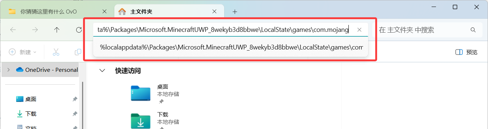

# 1.3.3 构建第一个附加包

import treeview from '/src/css/treeview.css';
import DataType from "/src/components/DataType"
import FileType from "/src/components/FileType"

在上一节，我们为附加包打造了一个“身份证”`manifest.json`。但是只有身份证是没有用的，我们要给游戏展示我们的“身份证”，显然这个过程需要我们**导入（Import）** 一个附加包到游戏里面。怎么导入？导入到哪里？这就是我们这一节所讲解的重点。

---

首先，我们先以国际版的 Windows 版本为例来讲解，然后一步步地延伸到手机版和中国版的特殊案例上。所以，即使读者是手机玩家或中国版玩家，这一部分也是要看一看的哦。

## `com.mojang`文件夹——游戏数据文件夹

首先第一步，我们要找到游戏存储数据的路径。读者可以打开文件管理器，并将下面的路径粘贴到文件管理器的导航栏上：

```text
%localappdata%\Packages\Microsoft.MinecraftUWP_8wekyb3d8bbwe\LocalState\games\com.mojang
```



回车进入该路径后，记得将这个路径收藏下来，毕竟这个路径还是有些复杂的，不太好找。


这个 **`com.mojang`，就是游戏存储数据的文件夹**。现在，我们来看看这个文件夹里面都有哪些内容吧！


先指出一点就是，在本教程中，谈文件路径也是很重要的一环。我们用记号<FileType fileType="folder"/>代表文件夹，用<FileType fileType="file"/>代表一般文件，用<FileType fileType="image"/>表示图像，用<FileType fileType="music"/>表示音乐。相比于 JSON 数据格式的记号来说，这种图案的表示应该是很清晰直观的。

文件是要谈后缀名的，这一点我们在 [1.3.1](./d1_ide#文件管理器的设置) 的时候就已经详细聊过，所以请务必启用后缀名，我们这里也会谈后缀名，比如上一节的清单文件`manifest.json`我们就会这么表示：<FileType fileType="file" name="manifest.json"/>。

我们挑 com.mojang 里面重点部分来说：

<div class="treeview">

- <FileType fileType="folder" name="com.mojang"/>：游戏数据文件夹
  - <FileType fileType="folder" name="behavior_packs"/>：**全局**行为包文件夹，存放所有的行为包
  - <FileType fileType="folder" name="resource_packs"/>：**全局**资源包文件夹，存放所有的资源包
  - <FileType fileType="folder" name="development_behavior_packs"/>：开发行为包文件夹，存放所有的开发用行为包
  - <FileType fileType="folder" name="development_resource_packs"/>：开发资源包文件夹，存放所有的开发用资源包
  - <FileType fileType="folder" name="skin_packs"/>：皮肤包文件夹，存放所有的皮肤包
  - <FileType fileType="folder" name="world_templates"/>：地图模板文件夹，存放所有导入的外部地图模板
  - <FileType fileType="folder" name="minecraftWorlds"/>：**地图**文件夹，存放所有的地图，是的，你所有的世界都存放在这里面!
    - <FileType fileType="folder" name="（任意名称）"/>：地图文件
      - <FileType fileType="folder" name="db"/>：地图数据文件夹，通常存储一些无法通过常规文本编辑器直接访问的数据文件
      - <FileType fileType="folder" name="behavior_packs"/>：地图的行为包
      - <FileType fileType="folder" name="resource_packs"/>：地图的资源包
      - <FileType fileType="file" name="level.dat"/>：地图的核心数据文件
      - <FileType fileType="file" name="level.dat_old"/>：level.dat 的备份文件
      - <FileType fileType="file" name="levelname.txt"/>：地图名（虽然直接更改地图名不会起作用）
      - <FileType fileType="image" name="world_icon.jpeg"/>：地图图标，会对地图关闭的一瞬间进行截图
      - <FileType fileType="file" name="world_behavior_packs.json"/>：地图启用的行为包
      - <FileType fileType="file" name="world_resource_packs.json"/>：地图启用的资源包

<br/></div>

此外，com.mojang 里面还有其他文件夹，比如<FileType fileType="folder" name="Screenshots"/>是保存截图的，等等，就留给读者自行探索。

显然，我们要编写行为包和资源包的话，就要关注<FileType fileType="folder" name="behavior_packs"/>和<FileType fileType="folder" name="resource_packs"/>。在上面的文件路径中，我们看到行为包和资源包有“全局”和“地图内”之分，这正对应着游戏内的全局设置和地图设置。所以：

- 如果你想要做纯附加包的话，应该在**全局**的<FileType fileType="folder" name="development_behavior_packs"/>和<FileType fileType="folder" name="development_resource_packs"/>中进行开发；
  - 为什么不用<FileType fileType="folder" name="behavior_packs"/>和<FileType fileType="folder" name="resource_packs"/>呢？这主要是因为两个开发文件夹有特别优化，可以方便开发者在退出再重进地图后就应用更改，而无需重启游戏。而从外部导入的行为包资源包就通常直接导入到这两个文件夹里，代表这些包是稳定的包。
- 而要做地图配套的附加包的话，就应该在**地图中**的<FileType fileType="folder" name="behavior_packs"/>和<FileType fileType="folder" name="resource_packs"/>中进行开发。

## 创建第一个行为包 & 资源包

理清了游戏数据文件夹之后，我们就可以正式开始构建我们的第一个包了！我们这里先做**全局**的附加包，关于地图特制的附加包的话，处理方法我们稍后就会介绍。

在上一节，我们布置了两道习题，读者如果还没有做的话，请先去做一下哦。答案在上一节练习末尾已经给出。

1. 现在，我们先在全局的<FileType fileType="folder" name="development_behavior_packs"/>下创建一个新的文件夹<FileType fileType="folder" name="BP_test"/>。
2. 然后再把上一节练习中创建的`manifest_bp.json`放到该文件夹下，并重命名为`manifest.json`。你的文件路径应该如下图所示：

    <div class="treeview">

    - <FileType fileType="folder" name="development_behavior_packs"/>：开发行为包文件夹
      - <FileType fileType="folder" name="BP_test"/>：我们的测试行为包
        - <FileType fileType="file" name="manifest.json"/>：行为包的清单文件

    <br/></div>

3. 删除清单文件中的依赖项，下面是一个清单文件<FileType fileType="file" name="manifest.json"/>的示例：

    ```json showLineNumbers title="manifest.json"
    {
        "format_version": 2,
        "header": {
            "name": "实验行为包",
            "description": "",
            "uuid": "60d33b76-0916-4943-8f0e-b027603365eb",
            "version": [ 1, 0, 0 ],
            "min_engine_version": [ 1, 20, 50 ]
        },
        "modules": [
            {
                "type": "data",
                "uuid": "b02118b3-8fcf-4bba-bf53-dce1d1ae0f3e",
                "version": [ 1, 0, 0 ]
            }
        ]
    }
    ```

这时候，<FileType fileType="folder" name="BP_test"/>就已经是一个正确的行为包了。关于这个文件夹的命名，通常来说是任取的，不过习惯上来讲我们都命名为以`BP_`开头的文件夹，在后面接上包的简单描述。例如，如果你在做一个起床战争的行为包，就可以命名为`BP_bedwars`。这样起名还有一个好处，就是前面在 VSC 中安装的插件也可以更方便地检查到相关的路径了。

我们来打开游戏，来看看我们刚装上的包的效果吧！在设置 - 存储 - 行为包中可以看到我们刚创建的行为包：


它的图标目前显示为一个奇怪的紫黑块，并且因为没有内容，所以显示为 0.00 MB。但是，只要能够让游戏成功地识别到这是一个行为包，就已经是一个巨大的成功了。

如果在你的游戏中没有看到刚创建的行为包，请仔细检查你的文件路径和清单文件，以及如果你正在 Minecraft 中的话，要退出游戏并重进。总之，现在你应该能在游戏中看到刚创建的行为包，这个步骤是很重要的。

同理地，我们也可以创建一个新的资源包，步骤和创建行为包类似：

1. 在全局的<FileType fileType="folder" name="development_resource_packs"/>下创建一个新的文件夹<FileType fileType="folder" name="RP_test"/>。
2. 把上一节练习中创建的`manifest_rp.json`放到该文件夹下，并重命名为`manifest.json`。你的文件路径应该如下图所示：

    <div class="treeview">

    - <FileType fileType="folder" name="development_resource_packs"/>：开发资源包文件夹
      - <FileType fileType="folder" name="RP_test"/>：我们的测试资源包
        - <FileType fileType="file" name="manifest.json"/>：资源包的清单文件

    <br/></div>

3. 下面是一个清单文件<FileType fileType="file" name="manifest.json"/>的示例：

    ```json showLineNumbers title="manifest.json"
    {
        "format_version": 2,
        "header": {
            "name": "实验资源包",
            "description": "",
            "uuid": "1eb80b4e-848f-4787-a28f-1058f637c9b3",
            "version": [ 1, 0, 0 ],
            "min_engine_version": [ 1, 20, 50 ]
        },
        "modules": [
            {
                "type": "resources",
                "uuid": "639d861e-4df0-4194-b3d2-86a04752b6b3",
                "version": [ 1, 0, 0 ]
            }
        ]
    }
    ```

然后启动游戏检查一下，你应该能看到刚创建的资源包，你甚至可以在全局资源中启动你的资源包（虽然目前不会有任何效果就是了）。


恭喜你！这就是我们实现的第一个附加包啦！接下来，我们就要在这两个附加包中不断地加入功能，来实现我们的需求了。

*在 Minecraft 的所有玩家中，会做附加包的玩家可以说是少之又少。正所谓万事开头难，如果你已经走到这一步，并且成功地看到刚创建的附加包框架，就已经很厉害了哦\~ 也有很多人可能会因为大大小小的失误而看不到这一结果，不必心急，仔细检查一下，也能成功的！*

## 图标文件

很显然，紫黑块并不是我们想要的图标。稍微有些经验的玩家都知道，紫黑块代表着 Minecraft 的一种**无效纹理**。这正是我们没有定义图标文件所导致的。

我们可以找一个正方形的`.png`文件，起名叫做`pack_icon.png`，并放到包里面去，就可以正常地显示图标出来啦！路径分别如下所示：

<div class="treeview">

- <FileType fileType="folder" name="BP_test"/>：测试行为包
  - <FileType fileType="file" name="manifest.json"/>：清单文件
  - <FileType fileType="image" name="pack_icon.png"/>：图标
- <FileType fileType="folder" name="RP_test"/>：测试资源包
  - <FileType fileType="file" name="manifest.json"/>：清单文件
  - <FileType fileType="image" name="pack_icon.png"/>：图标

<br/></div>

如果你没有的话，这里有一个我们绘制的小图片可供你使用，你可以右键保存该图片并应用到你的附加包中。

</img>

添加了图标文件之后，就会显示正常啦。


---

## 将附加包应用到特定世界

:::warning[注意]

本节的内容仅适用于 Windows 等电脑版本，亦适用于中国版的电脑版本。

对于 Android 版本，因为高版本 Android 的约束更大，难以访问到游戏数据文件。如果你可以访问到 Android 的`Android/data/`文件夹（通常使用 MT 管理器来访问），也可以通过下面两个路径来访问游戏数据。

- 国际版的路径为`Android/data/com.mojang.minecraftpe/files/games/com.mojang/`。需要注意，这个路径必须在设置中将存储路径改为“外部”才可见。
- 中国版的路径为`Android/data/com.netease.(渠道名，官方渠道为x19)/files/`。

如果无法访问的话，可以跳过这一部分，看看如何通过[打包附加包并导入（不适用于中国版）](#打包附加包并导入)的方法来解决。

:::

现在我们来关注一下，如何将附加包应用到一个具体世界上。

对于国际版来说，你已经知道了世界存储在什么位置上，我们来回顾一下：

<div class="treeview">

- <FileType fileType="folder" name="com.mojang"/>：游戏数据文件夹
  - <FileType fileType="folder" name="minecraftWorlds"/>：所有的地图数据
    - <FileType fileType="folder" name="（地图文件夹）"/>

<br/></div>

对于中国版来说，我们同样也要找到类似于<FileType fileType="folder" name="com.mojang"/>的数据文件夹。路径如下：

```text
%appdata%\MinecraftPE_Netease
```

用类似的方法打开这个文件夹，你会看到下面这些文件：


你可以看到这个路径和国际版的<FileType fileType="folder" name="com.mojang"/>还是有一些相似度的，尤其是<FileType fileType="folder" name="minecraftWorlds"/>，这里面就存储了你的地图的信息。

国际版和中国版的地图文件结构都是很一致的：

<div class="treeview">

- <FileType fileType="folder" name="（地图文件夹）"/>
  - <FileType fileType="folder" name="db"/>：地图数据文件夹，通常存储一些无法通过常规文本编辑器直接访问的数据文件
  - <FileType fileType="folder" name="behavior_packs"/>：地图的行为包
  - <FileType fileType="folder" name="resource_packs"/>：地图的资源包
  - <FileType fileType="file" name="level.dat"/>：地图的核心数据文件
  - <FileType fileType="file" name="level.dat_old"/>：level.dat 的备份文件
  - <FileType fileType="file" name="levelname.txt"/>：地图名（虽然直接更改地图名不会起作用）
  - <FileType fileType="image" name="world_icon.jpeg"/>：地图图标，会对地图关闭的一瞬间进行截图
  - <FileType fileType="file" name="world_behavior_packs.json"/>：地图启用的行为包
  - <FileType fileType="file" name="world_resource_packs.json"/>：地图启用的资源包

<br/></div>

这样的话，我们可以把上面做出来的行为包和资源包**剪切**粘贴（注意不要复制粘贴，否则可能会和全局资源冲突）到地图内的<FileType fileType="folder" name="behavior_packs"/>和<FileType fileType="folder" name="resource_packs"/>中，如果没有这两个文件夹的话，就手动创建，也就是：

<div class="treeview">

- <FileType fileType="folder" name="（地图文件夹）"/>
  - <FileType fileType="folder" name="db"/>：地图数据文件夹，通常存储一些无法通过常规文本编辑器直接访问的数据文件
  - <FileType fileType="folder" name="behavior_packs"/>：地图的行为包
    - <FileType fileType="folder" name="BP_test"/>：**测试行为包**
      - <FileType fileType="file" name="manifest.json"/>：**清单文件**
      - <FileType fileType="image" name="pack_icon.png"/>：**图标**
  - <FileType fileType="folder" name="resource_packs"/>：地图的资源包
    - <FileType fileType="folder" name="RP_test"/>：**测试资源包**
      - <FileType fileType="file" name="manifest.json"/>：**清单文件**
      - <FileType fileType="image" name="pack_icon.png"/>：**图标**
  - <FileType fileType="file" name="level.dat"/>：地图的核心数据文件
  - <FileType fileType="file" name="level.dat_old"/>：level.dat 的备份文件
  - <FileType fileType="file" name="levelname.txt"/>：地图名（虽然直接更改地图名不会起作用）
  - <FileType fileType="image" name="world_icon.jpeg"/>：地图图标，会对地图关闭的一瞬间进行截图
  - <FileType fileType="file" name="world_behavior_packs.json"/>：地图启用的行为包
  - <FileType fileType="file" name="world_resource_packs.json"/>：地图启用的资源包

<br/></div>

但是，只有这些还是不够的。如果读者是国际版玩家，应该知道在导入了一个包之后是不可能立刻启用的，需要我们在地图设置或全局设置中手动启用才行。而判断启用哪些包的文件，就是下面的<FileType fileType="file" name="world_behavior_packs.json"/>和<FileType fileType="file" name="world_resource_packs.json"/>。

对于国际版玩家来说，在世界中应用我们插入的附加包是很简单的。我们只需要进入特定世界的设置，并在设置中启用包即可，游戏会自动为上面的两个文件中写入内容。


对于中国版或者国际版的 BDS 服务器的话，情况则没有那么简单。因为没有方便的 UI 来启用这些文件，我们必须手动向这两个文件中写入内容，这种方法叫做**强制导入法**。强制导入法对中国版和国际版都是有效的。

:::danger[当心！]

对于中国版，如果插入第三方未经认证的附加包，会导致你的地图无法多人联机。其他玩家会在进入你的世界时遇到包错误，所以如果你的地图是不打算发布的地图，就请谨慎安装附加包。

但可以放心的是，中国版资源中心的包并不属于“未经认证的附加包”，所以对于地图作者来说，通常是无须担心这一点的。

:::

1. 首先先确保这两个包已经剪切粘贴到世界文件中的<FileType fileType="folder" name="behavior_packs"/>和<FileType fileType="folder" name="resource_packs"/>中。
2. 如果不存在<FileType fileType="file" name="world_behavior_packs.json"/>和<FileType fileType="file" name="world_resource_packs.json"/>这两个文件，需要提前创建。**注意！中国版所自带的<FileType fileType="file" name="netease_behavior_packs.json"/>和<FileType fileType="file" name="netease_resource_packs.json"/>是不行的，这两个文件和我们需要的两个文件不是一回事！**
3. 先打开<FileType fileType="file" name="world_behavior_packs.json"/>，写入以下内容：

    ```json showLineNumbers title="world_behavior_packs.json"
    [
        {
            "pack_id": "60d33b76-0916-4943-8f0e-b027603365eb", // <- 你的行为包的 UUID
            "version": [ 1, 0, 0 ] // <- 你的行为包的版本
        }
    ]
    ```

4. 同理地，向<FileType fileType="file" name="world_resource_packs.json"/>写入以下内容：

    ```json showLineNumbers title="world_resource_packs.json"
    [
        {
            "pack_id": "1eb80b4e-848f-4787-a28f-1058f637c9b3", // <- 你的资源包的 UUID
            "version": [ 1, 0, 0 ] // <- 你的资源包的版本
        }
    ]
    ```

以上就是强制导入的过程了。读者可以明显地看到，我们就是通过强制在这两个文件中写入附加包的 UUID 和版本，让游戏知道我们导入了哪些附加包的。这两个文件所允许的格式都是一致的，如下所示，还是很简单的。

<div class="treeview">

- <DataType dataType="array"/>：根数组
  - <DataType dataType="object"/>：启用的附加包信息
    - <DataType dataType="string" name="pack_id" isRequired/>：附加包的 UUID。
    - <DataType dataType="array" name="version" isRequired/>：附加包的版本。
      - <DataType dataType="int" name="0" isRequired/>：代表主版本号。
      - <DataType dataType="int" name="1" isRequired/>：代表次版本号。
      - <DataType dataType="int" name="2" isRequired/>：代表修订版本号。

</div>

## 打包附加包并导入

:::warning[注意]

本节的内容仅适用于国际版，不适用于中国版。

:::

这一节我们来学习一下如何通过**打包导入法**来向游戏导入我们的附加包。这个方法通常对手机玩家是更有效的，因为我们难以在手机中访问到游戏数据文件夹，而且手机版还可能会有存储路径的问题，很多玩家会将游戏数据存储到*应用程序*（也是默认设置），致使很多人找不到上面给出的国际版路径。对于这种棘手情况，我们就可以直接将包导入游戏。


我们为附加包打包并导入的方法如下：

1. 将行为包和资源包复制粘贴到同一个路径下。
    <div class="treeview">
    - <FileType fileType="folder" name="（任意名称的文件夹）"/>
      - <FileType fileType="folder" name="BP_test"/>
        - ……
      - <FileType fileType="folder" name="RP_test"/>
        - ……
    </div>
2. 选中这两个文件夹（<FileType fileType="folder" name="BP_test"/>和<FileType fileType="folder" name="RP_test"/>），然后压缩到一个`.zip`压缩文件中。这样可以保证游戏可以直接读到这两个文件夹，不会出现文件夹套文件夹的情况。
3. 直接将获得的`.zip`压缩文件的后缀名改为`.mcaddon`。
4. 导入`.mcaddon`文件。
    - 对于 Windows 平台，直接双击该文件即可导入。
    - 对于 Android 平台，在 MT 管理器中打开该文件，在左下角中选择该文件的类型为“文本”，然后以“Minecraft”打开即可。
    </img> </img>

虽然对于手机版玩家这么做麻烦了不少，但没办法，用手机开发确实就是会带来很多的麻烦……

---

## 总结

在这一节中，我们介绍了如何在 Minecraft 中创建并导入我们的附加包。我们来回顾一下本节的内容：

- 游戏数据文件夹：是保存游戏核心数据的文件夹。不同版本、不同平台，都有不同的游戏数据存储路径。
  - 国际版（Windows）：`%localappdata%\Packages\Microsoft.MinecraftUWP_8wekyb3d8bbwe\LocalState\games\com.mojang`
  - 国际版（Android）：`Android/data/com.mojang.minecraftpe/files/games/com.mojang/`
    - 因 Android 限制，这个路径通常难以访问。
  - 中国版（Windows）：`%appdata%\MinecraftPE_Netease`
  - 中国版（Android）：`Android/data/com.netease.(渠道名，官方渠道为x19)/files/`
    - 因 Android 限制，这个路径通常难以访问。
- 导入附加包的方法：
  - 直接导入法：
    - 仅适用于国际版。这种方法导入的附加包是全局和地图均可用的。
    - 如果开发纯附加包类型的资源（即不依托特定地图应用），推荐这种方法。
    - 直接在<FileType fileType="folder" name="com.mojang"/>下的<FileType fileType="folder" name="development_behavior_packs"/>和<FileType fileType="folder" name="development_resource_packs"/>中导入包。
    - 示例：
      <div class="treeview">
      - <FileType fileType="folder" name="com.mojang"/>
        - <FileType fileType="folder" name="development_behavior_packs"/>：开发行为包文件夹
          - **<FileType fileType="folder" name="BP_test"/>：测试行为包**
            - <FileType fileType="file" name="manifest.json"/>：行为包的清单文件
            - <FileType fileType="image" name="pack_icon.png"/>：行为包的图标文件
        - <FileType fileType="folder" name="development_resource_packs"/>：开发资源包文件夹
          - **<FileType fileType="folder" name="RP_test"/>：测试资源包**
            - <FileType fileType="file" name="manifest.json"/>：资源包的清单文件
            - <FileType fileType="image" name="pack_icon.png"/>：资源包的图标文件
      <br/></div>
  - 特定地图导入法（强制导入法）：
    - 国际版与中国版均适用。这种导入方法仅适用于特定地图。
    - 如果开发地图类型的资源，推荐这种方法。
    - 直接在<FileType fileType="folder" name="minecraftWorld"/>下的世界文件夹中，在<FileType fileType="folder" name="behavior_packs"/>和<FileType fileType="folder" name="resource_packs"/>中导入包。
    - 示例：
      <div class="treeview">
      - <FileType fileType="folder" name="com.mojang"/>（在中国版，Windows 平台为<FileType fileType="folder" name="MinecraftPE_Netease"/>，Android 平台为<FileType fileType="folder" name="files"/>）
        - <FileType fileType="folder" name="minecraftWorlds"/>
          - <FileType fileType="folder" name="（地图文件夹）"/>
            - <FileType fileType="folder" name="behavior_packs"/>：地图的行为包
              - **<FileType fileType="folder" name="BP_test"/>：测试行为包**
                - <FileType fileType="file" name="manifest.json"/>：清单文件
                - <FileType fileType="image" name="pack_icon.png"/>：图标
            - <FileType fileType="folder" name="resource_packs"/>：地图的资源包
              - **<FileType fileType="folder" name="RP_test"/>：测试资源包**
                - <FileType fileType="file" name="manifest.json"/>：清单文件
                - <FileType fileType="image" name="pack_icon.png"/>：图标
            - ……
            - <FileType fileType="file" name="world_behavior_packs.json"/>：地图启用的行为包
            - <FileType fileType="file" name="world_resource_packs.json"/>：地图启用的资源包
      <br/></div>
    - 在国际版游戏内，直接在游戏内的地图设置中启用导入的包。
    - 在中国版或者 BDS 等没有 UI 的地方，直接更改<FileType fileType="file" name="world_behavior_packs.json"/>和<FileType fileType="file" name="world_resource_packs.json"/>来强制导入包，即强制导入法。
  - 打包导入法：
    - 仅适用于国际版。这种导入方法是全局和地图均可用的。
    - 对于无法访问游戏数据路径的开发者来说，这种方法可能比较好用（虽然日后导出地图可能也是个问题）。
    - 但对于普通玩家来说，却是最常见且最简单的导入方法。
    - 方法是，将行为包和资源包文件夹压缩到一个`.zip`文件中，并改后缀为`.mcaddon`。然后，双击该文件（Windows）或“以文本形式打开 - Minecraft”（Android）导入。

做附加包开发的话，使用电脑和 VSC 会使得我们的开发变得易上手许多，所以如果读者有条件的话，请尽可能地在电脑上进行开发。虽然手机上也可以做，但确实门槛稍高，而且处处都充满了不便。在未来的教程中，我们就不再强调手机与电脑上编程的差异了（因为差异基本都体现在环境和编辑软件上）。

## 练习

:::info[练习 1.3-2]

根据你的实际情况，选择一个最适合的导入方法导入一个行为包和一个资源包。

:::

import GiscusComponent from "/src/components/GiscusComponent/component.js"

<GiscusComponent/>
